# Parametric and Computational Design

> [!abstract] TL;DR
> **For most of history an architect *drew a specific building* — this window, here, this size. Parametric and computational design flips this: instead of drawing the final form, you design the *rules and relationships* that generate it — you write an algorithm, and the computer produces the design.** It is the difference between drawing one staircase and defining "a staircase whose steps adjust automatically to any floor height." In **parametric design** a model is built from **parameters** (variables — height, angle, spacing, curvature) and **relationships** (rules that link them), so changing one parameter instantly regenerates the whole design — the model is *alive* and flexible; change the site and the building reconfigures itself. Powered by **visual programming** (Grasshopper for Rhino, Dynamo for Revit) and code, this lets architects explore vast **design spaces**, create complex, adaptive, previously-impossible **geometries** (the flowing forms of Zaha Hadid, the "blob," the twisting tower), and **rationalize** wild forms into buildable ones. **Computational / generative design** goes further: the computer doesn't just *execute* rules, it *generates and optimizes* — you specify **goals** (maximize daylight, minimize cost) and constraints, and algorithms (evolutionary/genetic, and increasingly AI) search for optima, sometimes producing forms no human would conceive. Patrik **Schumacher** even proclaimed **"Parametricism"** a new architectural *style*. Yet it is contested — liberating, performance-driven design, or gratuitous "computational formalism"? To understand it is to understand the digital revolution in how buildings are conceived: *from drawing forms to programming the systems that generate them.*

---

## Intuition

**Analogy — from drawing the answer to writing the recipe.** Imagine two ways to design a staircase. The first, the way of five thousand years, is to *draw this staircase*: a specific run of, say, seventeen treads, each 175 mm high and 280 mm deep, fixed on the page. If the floor-to-floor height changes by a hundred millimetres, your drawing is now wrong and you start again. The second way is to *define* "a staircase" as a rule: *given any floor height, compute the number of treads so that each riser stays near 175 mm, then space and draw them.* You have not drawn a staircase — you have written the *recipe* for a staircase, and the same recipe now generates the right stair for any floor, instantly, automatically. Parametric design is exactly this shift in what an architect makes: no longer the finished form, but the **system that generates forms**.

Extend the analogy and the whole discipline opens up. A **parametric model** is a web of **parameters** — the tunable numbers (a tower's twist, a façade's opening size, a roof's curvature) — wired together by **relationships** — the rules and dependencies that say *how* changing one thing ripples through everything else. Pull the "twist" slider and every floor above rotates a little more; nudge the site boundary and the plan re-solves itself; this is the *associative*, *alive* model. Because one recipe can be run with a thousand different inputs, the architect can now sweep across a vast **design space** — generating and comparing hundreds of variants in the time it once took to draw one — and can conjure geometries a hand could never coordinate: the doubly-curved surfaces of Zaha Hadid, Gehry's crumpled titanium, the twisting supertall tower whose every floor is different yet rule-governed. And the recipe can be made *smart* about complexity, so a form that looks impossibly wild is quietly **rationalized** into flat, buildable panels. **Computational and generative design** then takes the decisive further step: instead of the human tuning the sliders, the human states the *goals* — *maximize daylight, minimize structural material, keep the best views, hit the carbon target* — and hands the search to an algorithm. Evolutionary and genetic solvers, gradient and topology optimizers, and now machine-learning models breed, mutate, and select designs, crawling the design space toward optima, sometimes surfacing forms no designer would have imagined — a process that looks unnervingly like biological **morphogenesis**, which is why so many results resemble bone, coral, and branching trees. The theorist Patrik Schumacher went so far as to name this a new epoch, **Parametricism**. Whether it is the liberation of performance-driven, sustainable architecture or merely expensive "computational formalism" — blob for the sake of blob — is the live debate. Either way it marks a genuine revolution: the architect has moved *from drawing forms to programming the systems that generate them.*

---

## How It Works

### Core mechanics

Parametric and computational design is not a style but a *way of designing* — designing the design process itself. Reading it means tracing how rules replace drawings, and how goals replace rules:

1. **The paradigm shift — from representation to generation.** Classical design is *direct representation*: the architect draws the specific building, and the drawing *is* the design. Parametric design substitutes *algorithmic generation*: the architect defines parameters, relationships, and rules, and the **computer generates the form** from them. The slogan, from Rivka Oxman and others, is "**design the design process, not the design.**" The artifact the architect authors is no longer a fixed geometry but a *generative system* — this is the "digital turn" in architectural conception.
2. **Parametric modeling — the alive, associative model.** A parametric model is built from **parameters** (variables: dimensions, angles, counts, curvatures) linked by **relationships and constraints** (rules, dependencies, *associative* logic). Because the geometry is *derived* from the parameters rather than drawn directly, changing any parameter **propagates automatically** and regenerates the entire model — the "alive" model. This is the same associativity that makes a spreadsheet recompute when you change a cell, applied to three-dimensional form.
3. **The enabling tools — visual and dataflow programming.** The paradigm became mainstream through **visual/dataflow programming**: **Grasshopper** (for Rhino) and **Dynamo** (for Revit) let designers wire *components* into a graph — geometry flows along the wires and updates live — while scripting (Python, C#) and lower-level code handle what nodes cannot. The underlying geometry is **NURBS** curves and surfaces, meshes, and subdivision surfaces: smooth, mathematically-parameterized geometry that can bend and blend freely.
4. **Design-space exploration.** Because variants are cheap to generate, the method turns design into **search**: sweep the parameters, batch out dozens or thousands of candidate forms, and compare them — often against measured performance. The architect stops choosing *a* design and starts choosing *within a space* of designs, seeing the trade-off landscape rather than a single guess.
5. **What parametrics enable — complex geometry, rationalization, customization, response.** Four capabilities follow. **Complex geometry**: freeform surfaces, twisting towers, and non-repeating patterns previously impossible to coordinate by hand. **Rationalization**: making a wild form *buildable* — panelizing a curved surface into flat or single-curved pieces, respecting fabrication limits. **Mass customization**: every element different yet all governed by one rule, so variation is cheap. **Responsiveness**: form that adapts to context, sun, structure, and data — bending to the site, opening to the view, thickening where forces demand.
6. **Computational and generative design — goals replace rules.** Generative design lets the computer *generate and explore* from rules or grammars — **shape grammars, L-systems, cellular automata, agent-based and growth models**, often mimicking biological morphogenesis. **Optimization** goes further still: state the **objectives** (daylight, energy, structure, cost, views, circulation) and **constraints**, and let algorithms *search for the best*. **Evolutionary / genetic** solvers (Grasshopper's *Galapagos*), gradient methods, and **topology optimization** breed and select forms; **simulation** (structural FEA, environmental, daylight) closes the feedback loop so the search is *performance-driven*. Increasingly, **machine learning and generative AI** propose and rank designs directly.
7. **Parametricism and its critics.** Patrik **Schumacher** proclaimed **Parametricism** the successor to modernism and postmodernism — an avant-garde *style* built on fluidity, differentiation, and relational logic. Critics answer that much of it is **gratuitous complexity** and "computational formalism," expensive and hard to build, a **tyranny of the tool** where the software's default curves become the architecture, and a gap between seductive digital form and lived human *place*. The unresolved tension is between the **expressive** (form-making) and the **performative** (optimization, sustainability) uses of the very same computation.

### Flow / Architecture

```mermaid
graph TD
    A["For most of history the architect DREW a<br/>specific building — this window, here, this size"] --> B["PARAMETRIC and COMPUTATIONAL DESIGN flip it<br/>design the RULES and RELATIONSHIPS that generate the form<br/>write an algorithm — the computer generates the design"]
    B --> C["Like defining a staircase whose steps ADJUST<br/>to any floor height — not drawing one staircase"]
    C --> D["PARAMETRIC DESIGN<br/>a model built from PARAMETERS — height, angle, spacing —<br/>and RELATIONSHIPS; change one parameter and the<br/>whole design updates — the ALIVE, flexible model"]
    D --> E["Powered by visual, dataflow PROGRAMMING<br/>Grasshopper, Dynamo, and code — over NURBS geometry"]
    E --> F["Explore vast DESIGN SPACES,<br/>create complex adaptive GEOMETRIES — Zaha Hadid —<br/>and RATIONALIZE wild forms into buildable ones"]
    F --> G["COMPUTATIONAL and GENERATIVE design go FURTHER<br/>specify GOALS — maximize daylight, minimize cost —<br/>algorithms — genetic, gradient, AI — OPTIMIZE and generate"]
    G --> H["Form-finding, structural and topology OPTIMIZATION,<br/>often mimicking natural GROWTH and morphogenesis"]
    H --> I["Schumacher proclaims PARAMETRICISM a new STYLE and epoch"]
    I --> J["CONTESTED — liberating and performance-driven<br/>versus gratuitous computational FORMALISM"]
    J --> K["From DRAWING forms<br/>to PROGRAMMING the systems that generate them"]
```



---

## Key Concepts

**Secondary (can explain to a bright 16-year-old):**
- **Design the recipe, not the cake.** Instead of drawing one exact building, you write the *rules* that make a building — like a recipe. Change an ingredient and the whole thing updates by itself. That is parametric design.
- **The "alive" model.** A parametric model has sliders — twist, height, opening size. Move a slider and the design instantly rebuilds. You can try a hundred versions in seconds, which is impossible by hand.
- **Shapes you could never draw.** Because a computer does the geometry, architects can make flowing, curving, twisting shapes — the swooping buildings of Zaha Hadid, or a tower that spirals — that no one could coordinate with a pencil.
- **Letting the computer *design.*** In generative design you tell the computer the *goals* — let in the most daylight, use the least material, cost the least — and it searches through thousands of options to find good answers, sometimes ones a person would never think of.

**Undergraduate (needs some background):**
- **Associative geometry and propagation.** The heart of parametric modeling is *associativity*: geometry is defined *as a function of* parameters and of other geometry, so a change *propagates* through the dependency graph and regenerates the model — exactly like formulas recomputing in a spreadsheet, but in 3D. Tools like **Grasshopper** and **Dynamo** expose this as a **dataflow graph** of components; scripting extends it where nodes run out.
- **Design space and exploration.** Fixing the *rules* and varying the *parameters* defines a **design space** — a high-dimensional space of possible forms. Parametric practice reframes design as *exploring* and *searching* this space (generating many variants, comparing performance) rather than committing to a single drawn solution.
- **Rationalization — making the wild buildable.** A freeform NURBS surface must be built from real, fabricable pieces. **Rationalization** (panelization, developable-surface approximation, planarization of quad panels) re-describes the smooth ideal as a controlled set of manufacturable parts — the bridge from parametric *geometry* to **digital fabrication**. Gehry's practice pioneered this using aerospace CAD (CATIA / Digital Project).
- **Generative methods and morphogenesis.** Beyond tuning parameters, **generative** systems *produce* form from rules: **shape grammars** (a formal vocabulary plus transformation rules), **L-systems** (rewriting rules that model plant-like growth), **cellular automata**, and **agent-based** models. Many deliberately imitate biological **morphogenesis**, which is why computationally-grown structures so often resemble branching, cellular, or bone-like natural forms.

**Graduate (system-level thinking):**
- **Design as multi-objective optimization.** Performance-driven computational design is a *constrained, multi-objective* problem: minimize structural material and energy and cost while maximizing daylight, views, and program fit, subject to code, buildability, and site constraints. The objectives *conflict*, so there is no single optimum but a **Pareto front** of non-dominated trade-offs. **Evolutionary/genetic** algorithms (Grasshopper's *Galapagos*, NSGA-II) approximate this front by population-based search; **gradient** and **topology** optimization (SIMP, level-set) solve the continuous material-layout problem, recovering organic, bone-like structure algorithmically. This is the same optimization machinery as portfolio selection and neural-architecture search, applied to buildings.
- **Form-finding as an inverse problem.** Structural *form-finding* — hanging chains and cloths (Gaudí, Isler), soap films (Otto) — solves an inverse problem: *find the geometry that carries load in pure axial force with no bending.* Its numerical descendants — **dynamic relaxation**, **force-density**, **thrust-network analysis** — pose that same problem as a system converging on an equilibrium shape, coupling parametric geometry to physics in a closed loop. The catenary became a matrix equation; form-finding became design software.
- **Parametricism as an ideology, and its critique.** Schumacher's *Autopoiesis of Architecture* frames Parametricism not as a toolset but as a self-consistent *style* with its own heuristics ("avoid rigid geometric primitives; correlate all subsystems"). The critique operates on three fronts: **epistemic** (optimization is only as meaningful as the objective function you can *quantify* — daylight is measurable, dignity is not, so the measurable crowds out the meaningful); **economic** (rationalization has limits; some parametric icons are ruinously costly); and **phenomenological** (fluent digital surfaces can be placeless, ignoring *genius loci* and human experience). The deep tension is **expressive vs performative** computation — the same algorithm can serve a carbon target or a signature curve.
- **The frontier — closing the design-to-production loop.** The maturing agenda fuses parametric modeling with **BIM** (semantic, coordinated building data), **digital fabrication and robotic construction** (CNC, additive/3D-printing, robotic assembly — design data driving the machine directly), **performance and carbon optimization** (embodied and operational), and **AI/generative-AI** co-design and real-time responsive systems. The trajectory points to the *architect-as-programmer* and to **human–computer co-design**, where the designer curates and constrains a generative partner rather than drafting lines — and to the democratization of these tools beyond the signature studios that pioneered them.

---

## Python Demo

```python
# Parametric & computational design in two moves.
# (a) PARAMETRIC MODEL -> a FAMILY of forms: one rule-set for a twisting, tapering
#     tower is driven by a few PARAMETERS (twist, taper). Varying the parameters
#     unfolds a whole family of related designs from IDENTICAL rules -- the "alive"
#     model and the design space it spans (rules generate form; think Shanghai Tower).
# (b) GENERATIVE OPTIMIZATION -> goals search the space: a facade with two parameters
#     (glazing ratio, shading depth) and two COMPETING objectives (maximize daylight,
#     minimize energy+build cost). A grid search (standing in for a genetic/Galapagos
#     solver) recovers the PARETO FRONT of daylight-vs-cost tradeoffs and a chosen
#     optimum -- goal-driven design finding solutions a human might not pick by hand.
# Requires: numpy, matplotlib
import numpy as np
import matplotlib.pyplot as plt

fig, axs = plt.subplots(1, 2, figsize=(14, 6))

# ---------- (a) PARAMETRIC MODEL: one rule-set, a FAMILY of twisting towers ----------
z = np.linspace(0.0, 1.0, 240)             # normalized height 0..1
n_corners = 4                              # square footprint
# The SAME parametric rule, driven by two PARAMETERS: total twist (turns) and taper.
# Change the parameters -> a whole family of related designs from identical rules.
family = [
    # (twist in turns, taper fraction, label)
    (0.00, 0.10, "twist 0.0"),
    (0.75, 0.35, "twist 0.75"),
    (1.50, 0.55, "twist 1.5"),
    (2.25, 0.75, "twist 2.25"),
]
spacing = 3.2
ax = axs[0]
for i, (turns, taper, label) in enumerate(family):
    x_off = i * spacing
    w = 1.0 * (1.0 - taper * z)             # RULE 1: footprint tapers with height
    ang0 = 2.0 * np.pi * turns * z          # RULE 2: cross-section rotates with height
    color = plt.cm.viridis(i / (len(family) - 1))
    for k in range(n_corners):              # draw the four twisting corner-edges
        theta = ang0 + k * (2.0 * np.pi / n_corners)
        xk = x_off + w * np.cos(theta)      # x-coordinate of corner k at each height
        ax.plot(xk, z, color=color, lw=1.6)
    ax.text(x_off, -0.07, label, ha="center", fontsize=8)
ax.set_title("PARAMETRIC MODEL: one rule-set, a FAMILY of forms\n"
             "vary twist and taper -> the design space unfolds")
ax.set_xlabel("plan x   (towers offset for display)")
ax.set_ylabel("normalized height")
ax.set_ylim(-0.13, 1.05)
ax.set_yticks([0.0, 0.5, 1.0])

# ---------- (b) GENERATIVE OPTIMIZATION: competing goals search the space ----------
# Two design PARAMETERS: glazing ratio g and shading depth s, each in [0, 1].
# Two COMPETING OBJECTIVES:
#   Daylight (MAXIMIZE): more glass admits light; shading cuts it.
#   Cost     (MINIMIZE): more glass drives energy/build cost; shading tempers it but costs.
g = np.linspace(0.0, 1.0, 60)
s = np.linspace(0.0, 1.0, 60)
G, S = np.meshgrid(g, s)
Day  = G * (1.0 - 0.35 * S)                                # daylight benefit  (maximize)
Cost = 0.10 + 0.90 * G * (1.0 - 0.40 * S) + 0.20 * S**2    # energy+build cost (minimize)

cost_v = Cost.ravel()
day_v  = Day.ravel()

# Pareto front: a design is non-dominated if NO other design has lower cost AND
# higher daylight (with at least one strictly better) -- the best-tradeoff frontier.
dominated = np.zeros(cost_v.shape[0], dtype=bool)
for i in range(cost_v.shape[0]):
    better = (cost_v <= cost_v[i]) & (day_v >= day_v[i])
    strict = (cost_v <  cost_v[i]) | (day_v >  day_v[i])
    dominated[i] = np.any(better & strict)
pareto = ~dominated

# A single chosen optimum via weighted scalarization (stands in for a genetic solver):
weight = 0.6                                               # weight on daylight vs cost
score  = weight * day_v - (1.0 - weight) * cost_v
best   = np.argmax(score)

ax = axs[1]
ax.scatter(cost_v[~pareto], day_v[~pareto], s=9, color="#adb5bd",
           label="dominated designs")
order = np.argsort(cost_v[pareto])
ax.plot(cost_v[pareto][order], day_v[pareto][order], "-", color="#c1121f", lw=2.0)
ax.scatter(cost_v[pareto], day_v[pareto], s=16, color="#c1121f",
           label="PARETO front (best tradeoffs)")
ax.scatter(cost_v[best], day_v[best], s=180, marker="*", color="#023047",
           zorder=5, label="chosen optimum")
ax.set_title("GENERATIVE OPTIMIZATION: competing GOALS\n"
             "search recovers the daylight-vs-cost tradeoff")
ax.set_xlabel("energy + build cost   (minimize ->)")
ax.set_ylabel("daylight   (maximize ^)")
ax.legend(loc="lower right", fontsize=8)

plt.tight_layout()
plt.savefig("parametric_computational_design.png", dpi=120)
plt.show()

# Takeaways:
#  (a) A single parametric RULE-SET (footprint tapers and rotates with height) driven by
#      just two parameters generates a whole FAMILY of twisting towers. The architect no
#      longer draws one form -- they author the generator and sweep its design space.
#  (b) With competing GOALS (daylight vs cost), no single design wins: a search over the
#      parameter space recovers a PARETO FRONT of best tradeoffs, and a weighted objective
#      selects one optimum. This is generative, performance-driven design in miniature --
#      the same logic that genetic/evolutionary solvers (Galapagos) run on real buildings.
```

Running this produces two panels. On the left, one parametric **rule-set** — a footprint that *tapers* and *rotates* as it rises — is evaluated at four settings of its `twist` and `taper` parameters, unfolding a **family** of twisting towers from identical rules; the architect authored the *generator*, not any one tower, exactly as the Shanghai Tower's spiral was tuned as a parameter to shed wind load. On the right, a façade with two parameters (glazing and shading) is scored on two **competing objectives** — daylight to maximize, cost to minimize — and a grid search (standing in for a genetic/*Galapagos* solver) recovers the **Pareto front** of best trade-offs, with a weighted objective picking a single optimum. Together they make the paradigm visual: *parametrics generate families of form from rules, and computation searches those families for performance.*

---

## Real-World Applications

> **Foster + Partners' 30 St Mary Axe — "the Gherkin," London (2004).** The tower's aerodynamic, tapering, spiralling form is a *parametric* solution to environmental and structural goals: the bulging profile reduces wind loads and downdraughts at street level, the rotating light-wells drive natural ventilation, and the diagrid structure is a rule-governed lattice of near-identical members. It is an early landmark of *performance-driven* parametric design, where the striking form is largely the *by-product* of optimizing environment and structure rather than a stylistic flourish.

> **Zaha Hadid Architects — the Heydar Aliyev Center, Baku (2012), and beyond.** Hadid's practice, where Patrik Schumacher directs the *Parametricism* project, built its signature language of continuous, flowing, seamless surfaces directly on parametric modeling in Rhino/Grasshopper and Maya. The Heydar Aliyev Center's fluid, wave-like skin — walls, roof, and ground merging into one surface — is only coordinatable and buildable *because* it is a parametric model that could be rationalized into thousands of individually-shaped glass-fibre-reinforced-concrete and polyester panels.

> **Shanghai Tower, Gensler (2015) — twist as a performance parameter.** The 632 m tower's roughly 120-degree twist and tapering, rounded triangular profile were tuned parametrically: wind-tunnel-validated studies showed the asymmetric, twisting form cut wind loads by around a quarter versus a prismatic tower, saving roughly 25 percent of the structural steel — hundreds of millions of dollars — while the double-skin façade wraps sky-gardens between the layers. The single "twist" parameter of the Python demo is precisely the design variable that was optimized here.

> **Autodesk and The Living — the generative-design office, MaRS, Toronto (2016).** For its own Toronto workspace, Autodesk let a *generative* system lay out the office: designers specified goals and constraints — adjacencies, daylight access, views, low-distraction zones, activity preferences gathered from staff — and an evolutionary algorithm generated and evaluated *thousands* of floor-plan options, surfacing high-performing layouts a human planner would not have drawn. A canonical demonstration of goals-and-constraints generative design in real practice.

> **ICD/ITKE research pavilions, University of Stuttgart (Achim Menges, 2010s).** Menges' pavilions fuse *computational form-finding* inspired by biological morphogenesis (sea-urchin plate skeletons, beetle elytra, spider webs) with *robotic fabrication*: the same computational model that grows the biomimetic geometry also drives the robots that fibre-wind or assemble it, closing the **design-to-production** loop. They are the clearest built argument that computational design, nature's growth logic, and robotic construction are converging.

---

## Common Pitfalls

- **Optimizing what you can measure, not what matters.** An optimizer is only as wise as its objective function, and only *quantifiable* goals — daylight, energy, material — enter the math, while dignity, delight, and the sense of *place* do not. Teams that hand the whole design to the solver risk producing forms that score beautifully and *feel* dead. Computation should serve architectural judgement, not replace it; the meaningful must not be crowded out by the merely measurable.
- **The tyranny of the tool.** Every parametric tool has default behaviours — the curves NURBS make easily, the patterns Grasshopper components favour — and it is fatally easy to let the software's *defaults* become the architecture. "It came out of the algorithm" is not a reason for a form to exist. The rules you write encode aesthetic and ethical choices; own them, don't outsource them to a plugin's defaults.
- **Complexity for its own sake — computational formalism.** The capacity to make wild, non-repeating, doubly-curved geometry is not a mandate to. Much-criticised "blobitecture" spends huge cost and carbon on complexity that serves no performance or experiential purpose. Ask of every flourish: does this *do* something — for structure, environment, program, or meaning — or is it complexity as decoration?
- **Ignoring rationalization and buildability until too late.** A gorgeous NURBS surface is not a building; it must be re-described as real, fabricable panels, nodes, and connections within tolerance and budget. Designers who defer *rationalization* — panelization, planarization, developable approximation, fabrication limits — discover late that the form is unbuildable or unaffordable. Buildability is a design input, not an afterthought, as Gehry's CATIA-based practice understood from the start.
- **A brittle parametric model that breaks on change.** The whole promise is flexibility, but a badly-structured dependency graph — tangled logic, hidden hard-coded values, circular references — becomes *more* rigid than a drawing: one parameter change and the model "explodes." Clean, hierarchical, well-named associative logic is what keeps the model genuinely *alive*.
- **Mistaking generation for design.** Producing ten thousand options is not the same as making a good building. Without a clear, well-posed objective and thoughtful *curation* of the results, generative design is just an expensive random-form generator. The hard, human work is framing the right problem and judging among the machine's answers.

---

## Related Concepts

*This note sits in the **Sustainable, Digital, and Future Architecture** section (S06) of the Architecture vault as its account of the digital revolution in how buildings are conceived. It is the algorithmic counterpart to **The Design Process and Architectural Representation** (it replaces direct drawing with generative rules) and it supplies the design method behind the fluid forms surveyed in **Postmodern and Contemporary Architecture** (Hadid's Parametricism, Gehry's rationalized freeform). It extends **Structural Innovation and Iconic Engineering** and **Spanning Space: Arches, Domes, and Shells** by turning their form-finding and structural optimization into a computable design tool, and it feeds directly into **BIM, Digital Fabrication, and Smart Buildings** (closing the design-to-production loop) and **Sustainable and Green Architecture** (performance-driven, carbon-aware optimization). Deliberately a **distinct** treatment, it complements — and links to — the geometry and generative notes in the Computer Graphics, AI/ML, Optimization, and Mathematics vaults, whose machinery it borrows and applies to buildings.*

Cross-vault connections (verified to exist):

- [[Bezier_and_Bsplines]] — the spline and NURBS curves and surfaces that are the mathematical *substrate* of all parametric architectural geometry.
- [[Procedural_Generation]] — the Computer Graphics cousin of generative design: rules, grammars, and noise producing form algorithmically rather than by hand.
- [[Coordinate_Geometry]] — the analytic/coordinate geometry underlying parametric coordinates, associative models, and geometric constraints.
- [[Gradient_Descent]] — the gradient-based optimization used in numerical form-finding, relaxation, and continuous performance optimization.
- [[Optimization/06_Applications/Portfolio_Optimization|Portfolio Optimization]] — the mean–variance Pareto trade-off is structurally identical to the daylight-vs-cost multi-objective frontier in the demo.
- [[Neural_Architecture_Search]] — algorithmic search over a *design space* (evolutionary/RL over architectures) — the machine-learning analogue of searching an architectural design space.
- [[GAN]] — generative models that *produce* candidate designs, the engine behind AI-assisted and generative-AI design tools now entering practice.

---

## Review Questions

**Secondary:**
1. Explain the difference between *drawing* a staircase and *defining* "a staircase whose steps adjust to any floor height." Using this example, describe in your own words what makes a parametric model "alive," and give one reason an architect would want a hundred quick variants instead of one carefully-drawn design.

**Undergraduate:**
2. Distinguish *parametric* design (parameters and relationships that a human tunes) from *generative/computational* design (goals and constraints that an algorithm optimizes). Take the twisting Shanghai Tower or the Gherkin and explain which design variables were the "parameters," what "goals" the form was optimizing (wind, structure, daylight), and how *rationalization* turns such a form from a smooth ideal into something actually buildable.

**Graduate:**
3. Performance-driven design is a constrained, multi-objective optimization with a *Pareto front* of trade-offs rather than a single optimum. (a) Explain why conflicting objectives (e.g., daylight vs cost, or structural material vs expressive form) produce a front rather than a point, and how an evolutionary solver like Galapagos approximates it. (b) Then engage Schumacher's claim that Parametricism is a genuine new *style* and epoch. Critics counter that optimization only captures the *quantifiable*, that it invites "computational formalism," and that fluent digital surfaces can be placeless. Argue whether computational design is fundamentally *liberating and performative* or *gratuitous and formalist* — and state what would have to be true of a project for it to escape the critique.

---

## Sources

- Patrik Schumacher, *The Autopoiesis of Architecture* (2 vols., Wiley) — [Publisher page](https://www.wiley.com/en-us/The+Autopoiesis+of+Architecture%2C+Volume+I%3A+A+New+Framework+for+Architecture-p-9780470772980)
- Patrik Schumacher, "Parametricism: A New Global Style for Architecture and Urban Design," *Architectural Design* 79(4), 2009 — [Essay](https://www.patrikschumacher.com/Texts/Parametricism%20-%20A%20New%20Global%20Style%20for%20Architecture%20and%20Urban%20Design.html)
- Robert Woodbury, *Elements of Parametric Design* (Routledge, 2010) — [Publisher page](https://www.routledge.com/Elements-of-Parametric-Design/Woodbury/p/book/9780415779876)
- Branko Kolarevic (ed.), *Architecture in the Digital Age: Design and Manufacturing* (Taylor & Francis, 2003) — [Publisher page](https://www.routledge.com/Architecture-in-the-Digital-Age-Design-and-Manufacturing/Kolarevic/p/book/9780415380140)
- Achim Menges & Sean Ahlquist (eds.), *Computational Design Thinking* (AD Reader, Wiley, 2011) — [Publisher page](https://www.wiley.com/en-us/Computational+Design+Thinking-p-9780470665657)

---

#architecture #parametric-design #computational-design #generative-design #parametricism
