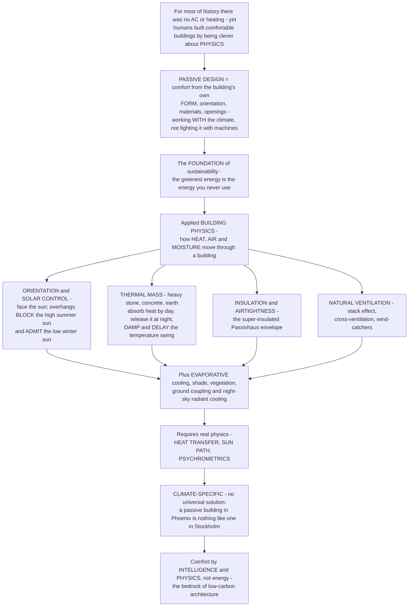

# Passive Design and Building Physics

> [!abstract] TL;DR
> **For almost all of human history there was no air conditioning and no central heating — yet people built genuinely comfortable homes in scorching deserts, steaming tropics, and the frozen north by being clever about PHYSICS.** They used a building's own **form, orientation, materials, and openings** to work *with* the local climate instead of fighting it with machines. That is **PASSIVE DESIGN**: achieving thermal comfort and a healthy indoor environment from the building itself and the free natural energy flows around it — **sun, wind, earth, and sky** — before (or instead of) any mechanical system. It is the foundation of sustainable, low-carbon architecture, because **the greenest energy is the energy you never have to use** — the "fabric-first" hierarchy. Passive design is applied **BUILDING PHYSICS**: understanding how **heat, air, and moisture** move through and around a building. Its core principles are (1) **orientation and solar control** — face glazing toward the sun to catch free winter heat, and use **overhangs** to shade the high summer sun while admitting the low winter sun; (2) **thermal mass** — heavy stone, concrete, or earth that soaks up heat by day and releases it at night, damping and delaying temperature swings; (3) **insulation and airtightness** — cutting unwanted heat loss and gain through the envelope (the Passivhaus obsession); and (4) **natural ventilation** — moving air for cooling and freshness with no fans, using the **stack effect**, cross-ventilation, and wind-catchers. Getting it right demands real physics — **heat transfer, the sun's path, and psychrometrics** — and the payoff is comfort that is often free, robust, and **resilient in a power cut**. Because it answers the *climate*, passive design is radically place-specific: a passive building in Phoenix looks nothing like one in Stockholm.

---

## Intuition

**Analogy — dressing for the weather versus running the furnace.** A smart hiker does not carry a portable heater and air conditioner. They dress in **layers**, face **into or away from the wind**, seek **shade** in the sun and **sun** in the cold, and open or close a **jacket vent** to dump heat. With nothing but cloth, geometry, and common sense they stay comfortable across a huge range of weather — because they *cooperate* with the environment. A building can do exactly the same thing. Its "clothing" is the **envelope** (walls, roof, glass), its "posture" is its **orientation** to sun and wind, its "shade" is an **overhang**, its "thermal underwear" is **insulation and mass**, and its "vent zipper" is an **operable window**. A well-designed building, like a well-dressed hiker, stays comfortable for free — while a badly designed one has to run its "portable heater and AC" (mechanical HVAC) full blast just to compensate for fighting the climate instead of working with it.

Extend the analogy into the discipline and the whole subject appears. The hiker's cleverness is really **physics** — heat transfer, radiation, evaporation, airflow — and so is the building's. **Passive design** means getting comfort out of the building's own **form, fabric, orientation, and openings** plus the free energy flows of **sun, wind, earth, and sky**, *before* switching on a machine — the "passive" half of the passive-versus-active choice at the heart of environmental control. It matters because **energy you never spend is the cleanest energy there is**, which makes passive design the bedrock of sustainable architecture. Its toolkit follows straight from the physics: **orientation and solar control** turn a window into a seasonal valve — equator-facing glass captures free winter sun while an **overhang** blocks the high summer sun but lets the low winter sun stream in; **thermal mass** (thick stone, concrete, earth, water) behaves like a thermal flywheel, absorbing heat during the day and slowly releasing it at night, which is why a thick-walled adobe house stays cool by day and warm by night; **insulation and airtightness** shrink the heat leaking through the envelope, the relentless focus of the **Passivhaus** standard; and **natural ventilation** moves air with no fan at all, riding the **stack effect** (warm air rising and pulling cool air in behind it), cross-breezes, and desert **wind-catchers**. Because every climate poses a different problem, the beauty of passive design is that there is **no universal solution** — the strategies flip completely between a hot-arid, a hot-humid, a temperate, and a cold climate, so a passive building in Phoenix and one in Stockholm are almost opposites. In one sentence: passive design and building physics are how architecture buys comfort with **intelligence and physics rather than energy**.

---

## How It Works

### Core mechanics

Passive design is the deliberate shaping of a building so that its **form and fabric** do the environmental work that would otherwise fall to machines. The mechanism runs like this:

1. **Read the climate first.** Before any form is drawn, the designer characterizes the site's climate — temperature range, humidity, solar radiation, wind, and the **Köppen** climate type — and locates it on a **bioclimatic chart** (Olgyay) or **psychrometric "building bioclimatic" chart** (Givoni) that maps which passive strategy each condition calls for. The climate sets the whole strategy: **hot-arid** wants mass, shade, courtyards, and evaporative cooling; **hot-humid** wants shade, lightweight construction, and relentless cross-ventilation; **temperate** wants a balance with solar gain; **cold** wants a compact, super-insulated, sun-facing box.
2. **Understand the physics — heat, air, moisture.** All strategies rest on **building physics**: heat moves by **conduction** (through the envelope, rate set by **U-value**, the inverse of insulating **R-value**), **convection** (air movement), and **radiation** (solar shortwave in, thermal longwave out and to the night sky). The building runs a continuous **heat balance** — envelope losses/gains, solar gains, internal gains, and ventilation — and comfort itself is a **zone** in temperature-humidity space (**psychrometrics**), not a single number.
3. **Orientation and solar control — the window as a seasonal valve.** Because the sun is **high in summer and low in winter**, an equator-facing window with a correctly sized horizontal **overhang** becomes a self-regulating solar valve: it **shades** the high summer sun (blocking unwanted heat) while **admitting** the low winter sun (harvesting free heat) — **passive solar heating**. Devices scale from overhangs to **louvers, brise-soleil, fins**, and adjustable shades, and glazing is chosen by its **solar heat gain coefficient (SHGC)** and U-value.
4. **Thermal mass — storing and delaying heat.** High-heat-capacity materials — **stone, concrete, earth, water** — absorb heat when it is available and release it hours later, **damping** the indoor temperature swing (the **decrement factor**) and **delaying** its peak (the **time lag**). Mass stored with winter solar gain becomes a **passive-solar heater**; mass "charged" cool by night ventilation becomes a **daytime cooler**. Strategies invert by climate: heavy mass suits high-swing arid climates, lightweight construction suits humid climates where night temperatures stay warm.
5. **Insulation, airtightness, and the fabric-first envelope.** Cutting the conduction and infiltration terms of the heat balance is the cheapest, most durable move. The **Passivhaus / Passive House** strategy drives envelope U-values very low, eliminates **thermal bridges**, seals the envelope nearly airtight, and adds **heat-recovery ventilation** — collapsing space-heating demand to a small fraction of a conventional building. This is the **fabric-first** hierarchy: reduce demand before adding any plant.
6. **Natural ventilation — passive air and cooling.** Air moves for free under two forces: **wind** (cross-ventilation through openings on opposite faces) and **buoyancy** (the **stack effect** — warm, less-dense indoor air rising and escaping high, drawing cool air in low, exploited by atria, **solar chimneys**, and Middle-Eastern **wind-catchers / badgirs**). Ventilation serves fresh air, direct **comfort cooling** of occupants, and **night purging** of a building's mass. Beyond it lie **evaporative cooling** (water and vegetation), **ground coupling / earth tubes**, and **radiant sky cooling**.
7. **Integrate, and accept a mixed-mode reality.** These strategies are combined into a single coherent design and validated with **building-performance simulation**. Where passive means cannot fully cover the climate, **mixed-mode** design hands the remainder to efficient mechanical systems — but only after the loads have been minimized. The payoff is comfort at drastically lower energy, plus **passive survivability**: a well-designed passive building stays habitable through a power outage or heatwave when an all-mechanical one becomes uninhabitable.

### Flow / Architecture



---

## Key Concepts

**Secondary (can explain to a bright 16-year-old):**
- **Old buildings had no AC — and were still comfortable.** People used thick walls, shady overhangs, the right orientation, and open windows to stay cool or warm. That is **passive design**: letting the building itself handle the weather.
- **The window is a clever trap for the sun.** In winter the sun is **low**, so it shines deep into a south-facing room and warms it. In summer the sun is **high**, so a little **roof overhang** casts a shadow that keeps the same window cool. One shelf, two opposite jobs.
- **Heavy walls even out the temperature.** Thick stone or mud walls soak up heat all day and let it back out slowly at night, so the inside never gets as hot or as cold as outside — like a thermal battery.
- **Hot air rises, and you can use that.** Open a low window and a high one; the warm air escapes at the top and pulls cool air in at the bottom, cooling the room with no fan. That is the **stack effect**.
- **The greenest energy is the energy you don't use.** Every bit of comfort the building gives you for free is energy you never have to buy or burn.

**Undergraduate (needs some background):**
- **The heat balance and the three transfer modes.** A building continuously exchanges heat by **conduction** (through the envelope, `U·A·ΔT`, where U is the inverse of insulating R-value), **convection** (air movement and ventilation), and **radiation** (solar shortwave in through glass; thermal longwave out, including to the cold night sky). Passive design is the art of tuning these terms so the balance sits inside the comfort zone with minimal machine intervention.
- **Solar geometry and the overhang.** The sun's **altitude** at solar noon is `90° − |latitude − declination|`, and declination swings ±23.45° over the year, so noon sun is high in summer and low in winter. A horizontal overhang of projection `P` casts a shadow of vertical depth `P·tan(altitude)` down the wall — deep in summer (shading the glass) and shallow in winter (admitting it). Sizing `P` to the latitude is the whole game of **seasonal solar control**.
- **Thermal mass — decrement factor and time lag.** Model a zone as an RC circuit with time constant `τ = R·C`. For a daily outdoor swing of angular frequency `ω = 2π/24 h⁻¹`, the indoor amplitude is reduced by the **decrement factor** `1/√(1+(ωτ)²)` and delayed by a **time lag** `arctan(ωτ)/ω`. High mass (large C, large τ) means a small, delayed indoor swing; lightweight means the inside tracks the outside almost immediately.
- **Passivhaus / fabric-first.** Certified **Passive Houses** push envelope U-values toward `0.15 W/m²K`, kill thermal bridges, reach near-airtight construction, and recover heat from exhaust air, so annual heating demand collapses (`≈ 15 kWh/m²·yr`). The principle generalizes: **reduce demand through the fabric before sizing any plant**.
- **Stack-effect ventilation.** Buoyancy drives a passive flow set by the opening area `A`, the height `h` between inlet and outlet, and the indoor-outdoor temperature difference: `Q ≈ Cₐ·A·√(2·g·h·ΔT / T_in)`. Taller stacks and bigger ΔT move more air — the physics behind atria, solar chimneys, and wind-catchers.

**Graduate (system-level thinking):**
- **Bioclimatic design as a mapping from climate to strategy.** Olgyay's *Design with Climate* and Givoni's building-bioclimatic chart formalize passive design as a decision procedure: plot the site's hourly climate on a psychrometric chart and read off which passive strategy (mass, night ventilation, evaporative cooling, solar heating, humidification) can pull each condition into the comfort zone — and where mechanical assistance becomes unavoidable. This turns "vernacular wisdom" into a quantitative, climate-specific design method.
- **The dynamic, coupled nature of the heat balance.** Real passive performance is not a steady-state U-value sum but a **dynamic** system: envelope conductance, thermal mass, solar and internal gains, ventilation, and control schedules interact across the diurnal and annual cycle. Mass and solar gain are **coupled** (mass only helps if it can be charged and discharged on the right schedule), which is why passive design demands **transient building-performance simulation**, not hand calculation.
- **Climate-specificity and the impossibility of a universal envelope.** Optimal mass, glazing ratio, insulation, and ventilation strategy **invert** across climate zones — heavy mass is a virtue in hot-arid climates but a liability in hot-humid ones with warm nights; large equator-glazing harvests heat in a cold climate but overheats a temperate one without shading. There is no globally optimal building; passive design is an argument *against* the placeless International Style glass box.
- **Passive survivability and resilience.** Framing passive design purely as energy efficiency undersells it: a low-load, high-mass, naturally ventilable building maintains habitable temperatures **through a power outage or grid failure**, a property (passive survivability / thermal resilience) that is increasingly a design requirement in a climate-stressed, extreme-weather world. Passive strategies are simultaneously the low-carbon *and* the resilient choice.
- **The passive-active-mixed-mode frontier.** The endgame is not "no machines" but the **right hierarchy**: minimize loads with form and fabric, meet the residual with high-efficiency, heat-pump-based systems, and blend the two in **mixed-mode** operation governed by controls — so that mechanical energy is a small correction to a fundamentally passive building rather than a brute-force substitute for design.

---

## Python Demo

```python
# Passive design and building physics, quantified:
#   (a) PASSIVE SOLAR / OVERHANG SHADING - the sun's NOON ALTITUDE across the year at a site,
#       and an OVERHANG that shades the HIGH summer sun off a south window while ADMITTING the
#       LOW winter sun; the fraction of the window in sun by season.
#   (b) SEASONAL SOLAR GAIN - resulting beam heat gain through that shaded window across the
#       year: HIGH in winter (wanted) and BLOCKED in summer - the core passive-solar principle.
#   (c) THERMAL MASS / TIME-LAG - a heavy-mass building's indoor swing is much SMALLER and
#       DELAYED vs the outdoor swing (the thermal-flywheel / decrement effect), while a
#       lightweight building tracks the outdoors closely.
#   (d) STACK-EFFECT VENTILATION - buoyancy-driven passive airflow (air changes per hour) vs
#       indoor-outdoor temperature difference, for several chimney/atrium heights.
# Requires: numpy, matplotlib
import numpy as np
import matplotlib.pyplot as plt

# ============================================================
# (a) SOLAR GEOMETRY + OVERHANG  (northern-hemisphere heating climate, ~40 deg N)
# ============================================================
lat = 40.0                                  # site latitude, deg N
day = np.arange(1, 366)
decl = 23.45 * np.sin(np.radians(360.0/365.0 * (day - 81)))   # solar declination, deg
noon_alt = 90.0 - np.abs(lat - decl)        # solar altitude at solar noon, deg

H_win = 1.5                                  # south window height, m (head at overhang, sill below)
P = 0.5                                      # horizontal overhang projection, m
shadow = P * np.tan(np.radians(noon_alt))    # vertical shadow depth below the overhang, m
sunlit_frac = np.clip(1.0 - shadow / H_win, 0.0, 1.0)   # fraction of window in direct sun

# ============================================================
# (b) SEASONAL SOLAR GAIN through the shaded south window
#     beam flux on a VERTICAL south wall at noon ~ DNI * cos(altitude): the LOW winter sun
#     strikes the vertical glass more squarely -> larger cos -> more gain.
# ============================================================
DNI   = 900.0                                # direct-normal irradiance, W/m^2 (clear day)
A_win = 4.0                                  # window area, m^2
SHGC  = 0.6                                  # solar heat gain coefficient of the glazing
gain  = DNI * np.cos(np.radians(noon_alt)) * sunlit_frac * A_win * SHGC   # W admitted

# ============================================================
# (c) THERMAL MASS damping: single-zone RC model, dT_in/dt = (T_out - T_in)/tau
# ============================================================
Tmean, Aout = 20.0, 10.0                     # outdoor daily mean and swing amplitude, degC
def outdoor(t): return Tmean + Aout * np.sin(2*np.pi*(t - 9)/24.0)   # peak ~15:00
dt, ndays = 0.1, 6
t = np.arange(0, 24*ndays, dt)
Tout_t = outdoor(t)

def simulate(tau):                           # tau = R*C thermal time constant, hours
    Ti = np.empty_like(t); Ti[0] = Tmean
    for k in range(1, t.size):
        Ti[k] = Ti[k-1] + dt*(Tout_t[k-1] - Ti[k-1])/tau
    return Ti

Ti_light = simulate(2.0)                     # lightweight: fast, tracks outdoors
Ti_heavy = simulate(24.0)                    # heavy mass: slow, damped, delayed
last = t >= 24*(ndays-1)                     # plot the final settled day
th = t[last] - 24*(ndays-1)

# ============================================================
# (d) STACK-EFFECT VENTILATION: Q = Cd * A * sqrt(2*g*h*dT / T_in_K)
# ============================================================
Cd, A_open, Vol, g = 0.6, 1.0, 250.0, 9.81   # discharge coeff, opening m^2, room m^3
dT = np.linspace(0.5, 12, 200)               # indoor-outdoor temperature difference, K
Tin_K = 295.0
def ach(h):                                  # air changes per hour for stack height h
    Q = Cd * A_open * np.sqrt(2*g*h*dT / Tin_K)   # m^3/s
    return Q * 3600.0 / Vol
heights = [3.0, 6.0, 10.0]

print(f"Summer-solstice noon altitude : {noon_alt[171]:5.1f} deg  ->  window sunlit {sunlit_frac[171]*100:4.0f}%")
print(f"Winter-solstice noon altitude : {noon_alt[354]:5.1f} deg  ->  window sunlit {sunlit_frac[354]*100:4.0f}%")
print(f"Thermal-mass indoor swing  light tau=2h : {np.ptp(Ti_light[last]):4.1f} K "
      f"|  heavy tau=24h : {np.ptp(Ti_heavy[last]):4.1f} K")

# ============================================================
# PLOT
# ============================================================
fig, ax = plt.subplots(2, 2, figsize=(14, 10))
fig.suptitle("Passive Design & Building Physics: sun-control, solar gain, thermal mass, stack ventilation",
             fontsize=13, weight="bold")

# ---- (a) sun altitude + overhang shading ----
axa = ax[0, 0]
axa.plot(day, noon_alt, color="#e76f51", lw=2.2, label="noon solar altitude")
axa.axvline(172, color="#c1121f", ls=":", lw=1); axa.text(176, 78, "summer\nsolstice", fontsize=7, color="#c1121f")
axa.axvline(355, color="#264653", ls=":", lw=1); axa.text(300, 30, "winter\nsolstice", fontsize=7, color="#264653")
axb2 = axa.twinx()
axb2.fill_between(day, sunlit_frac*100, color="#e9c46a", alpha=0.35, label="window in sun")
axb2.set_ylabel("window sunlit  (percent)", color="#b58a1a")
axb2.set_ylim(0, 105)
axa.set_xlabel("day of year"); axa.set_ylabel("noon solar altitude  (deg)", color="#e76f51")
axa.set_ylim(15, 85); axa.set_xlim(1, 365)
axa.set_title("(a) Overhang shades HIGH summer sun,\nadmits LOW winter sun", fontsize=10)
axa.grid(alpha=0.3)

# ---- (b) seasonal solar gain ----
axc = ax[0, 1]
axc.fill_between(day, gain, color="#2a9d8f", alpha=0.30)
axc.plot(day, gain, color="#2a9d8f", lw=2.2)
axc.axvline(172, color="#c1121f", ls=":", lw=1); axc.text(150, gain.max()*0.15, "summer:\nblocked", fontsize=8, color="#c1121f", ha="right")
axc.axvline(355, color="#264653", ls=":", lw=1); axc.text(345, gain.max()*0.8, "winter:\nharvested", fontsize=8, color="#264653", ha="right")
axc.set_xlabel("day of year"); axc.set_ylabel("solar heat gain through window  (W)")
axc.set_xlim(1, 365)
axc.set_title("(b) Passive-solar gain: high in winter (wanted),\nnear zero in summer (blocked)", fontsize=10)
axc.grid(alpha=0.3)

# ---- (c) thermal mass damping ----
axd = ax[1, 0]
axd.plot(th, Tout_t[last], color="#6c757d", lw=1.8, ls="--", label="outdoor")
axd.plot(th, Ti_light[last], color="#e76f51", lw=2.2, label="lightweight  (tau 2 h)")
axd.plot(th, Ti_heavy[last], color="#1d3557", lw=2.4, label="heavy mass  (tau 24 h)")
axd.set_xlabel("hour of day"); axd.set_ylabel("temperature  (degC)")
axd.set_xlim(0, 24); axd.set_xticks(range(0, 25, 4))
axd.set_title("(c) Thermal mass: heavy building's indoor swing\nis smaller AND delayed (the thermal flywheel)", fontsize=10)
axd.legend(fontsize=8, loc="upper right"); axd.grid(alpha=0.3)

# ---- (d) stack-effect ventilation ----
axe = ax[1, 1]
for h, c in zip(heights, ["#a8dadc", "#457b9d", "#1d3557"]):
    axe.plot(dT, ach(h), lw=2.2, color=c, label=f"stack height {h:.0f} m")
axe.set_xlabel("indoor - outdoor temperature difference  (K)")
axe.set_ylabel("ventilation rate  (air changes per hour)")
axe.set_title("(d) Stack-effect (buoyancy) ventilation:\ntaller stack + bigger dT -> more free cooling", fontsize=10)
axe.legend(fontsize=8, loc="upper left"); axe.grid(alpha=0.3)

plt.tight_layout(rect=[0, 0, 1, 0.96])
plt.savefig("passive_design_and_building_physics.png", dpi=120, bbox_inches="tight")
plt.show()

# Takeaway:
#  (a) A fixed horizontal overhang is a SEASONAL solar valve: the high summer sun is fully
#      shaded off the window, while the low winter sun is admitted - pure geometry, no moving parts.
#  (b) The result is exactly what a heating climate wants: strong free solar gain in winter and
#      almost none in summer - the essence of passive solar heating.
#  (c) A heavy-mass building damps the outdoor swing to a small, time-DELAYED indoor swing (cool
#      by day, warm by night), while a lightweight building just tracks the weather.
#  (d) Buoyancy alone drives large passive airflow when there is a tall stack and a temperature
#      difference - many air changes per hour with no fan, the physics behind atria and wind-catchers.
```

Running this prints the summer- and winter-solstice noon sun altitudes with the resulting sunlit fraction of the window, and the indoor temperature swing for a lightweight versus heavy-mass building; then it produces four panels: **(a)** the sun's noon altitude across the year with the overhang's shading of the window, **(b)** the seasonal solar heat gain through that shaded south window (high in winter, blocked in summer), **(c)** the thermal-mass "flywheel" damping and delaying the indoor temperature relative to the outdoor swing, and **(d)** stack-effect ventilation rate versus temperature difference for several chimney heights.

---

## Real-World Applications

> **The desert adobe and courtyard house — thermal mass plus shade.** Traditional dwellings across the American Southwest, North Africa, and the Middle East use thick **adobe, rammed-earth, or stone** walls whose high thermal mass keeps the interior cool through the scorching day and releases stored warmth through the cold desert night — the decrement-factor effect of panel (c) built from mud. Wrapped around a shaded, often planted **courtyard**, they add evaporative cooling and a protected microclimate: passive comfort in one of Earth's harshest climates, with no machinery at all.

> **Persian wind-catchers (badgirs) and qanats — passive cooling by wind and water.** For centuries, towers in cities like Yazd have caught prevailing desert wind at height and funneled it down into living spaces, often drawing it over an underground water channel (**qanat**) for evaporative cooling before it reaches the room. It is stack-effect and cross-ventilation (panel d) combined with evaporative cooling — a pre-industrial "air conditioner" powered entirely by wind, buoyancy, and water.

> **Passive-solar and Trombe-wall houses — capturing the winter sun.** Direct-gain passive-solar homes place large equator-facing glazing in front of a masonry floor or wall so winter sun warms the mass, which re-radiates into the room after dark; the **Trombe wall** formalizes this as a glazed, sun-facing mass wall. A properly sized **overhang** shades the same glass in summer — panels (a) and (b) realized in built form, delivering much of a house's heating for free.

> **The Passivhaus standard — fabric-first taken to the limit.** Certified **Passive Houses** drive envelope U-values toward `0.15 W/m²K`, eliminate thermal bridges, reach near-airtight construction, and use **heat-recovery ventilation**, cutting space-heating demand to roughly a tenth of a conventional building — heated largely by occupants, appliances, and the sun. It is the insulation-and-airtightness principle pushed until the mechanical heating plant nearly disappears.

> **Naturally ventilated landmarks — the stack effect as architecture.** Buildings such as the **Eastgate Centre** in Harare (mass plus night-purge ventilation inspired by termite mounds) and countless atrium- and solar-chimney-based offices use buoyancy-driven **stack ventilation** to cool and freshen air with little or no mechanical cooling — panel (d) scaled to a whole building, cutting energy use dramatically in the right climate.

---

## Common Pitfalls

- **Copying a strategy that doesn't match the climate.** Passive design is **climate-specific**: heavy thermal mass is brilliant in a hot-arid climate with cold nights but a liability in a hot-humid one where nights stay warm and the mass never discharges; big equator-glazing heats a cold climate but bakes a temperate one without shading. Importing a strategy from the wrong climate makes comfort *worse*, not better.
- **Solar gain without solar control (summer overheating).** Large sun-facing glass is only a passive-solar *asset* if it is **shaded in summer**. Skip the overhang or misjudge the sun's altitude and the same window that harvests winter warmth turns the room into a greenhouse in July — the single most common passive-design failure.
- **Thermal mass with no way to charge or discharge it.** Mass is a flywheel that only helps if it is **coupled** to the right heat flow on the right schedule — exposed to sun or room air, and cooled by **night ventilation** in summer. Mass buried behind insulation or carpet, or never night-purged, is inert weight that does nothing.
- **Airtightness without ventilation.** Sealing the envelope for energy while forgetting fresh air causes CO₂ buildup, moisture, mould, and condensation inside the fabric. A tight passive envelope *requires* deliberate ventilation — usually **heat-recovery** — so efficiency and indoor air quality are solved together, not traded off.
- **Ignoring thermal bridges and treating physics as steady-state.** A single continuous concrete slab, balcony, or steel lintel piercing the insulation can short-circuit an otherwise excellent envelope, and a static U-value sum misses how **mass, solar timing, and ventilation interact dynamically**. Real passive performance needs thermal-bridge-free detailing and **transient simulation**, not a one-line calculation.
- **Bolting passive on late, or betting everything on it.** Orientation, form, mass, and shading are nearly free at concept stage and nearly impossible to add later — a building locked into a bad orientation or all-glass skin can only be rescued with ever-larger machines. Equally, in extreme climates purely passive means may not fully reach comfort; the mature answer is **mixed-mode** — minimize loads passively, then meet the small residual efficiently.

---

## Related Concepts

*This note sits in the Architecture vault's S06 (Sustainable, Digital and Future Architecture) and is the physics-and-passive companion to its siblings. **Building Systems and Environmental Control** is its active counterpart — the mechanical "life support" that takes over where passive strategies stop, and the two together form the passive-versus-active choice; **Sustainable and Green Architecture** carries the low-carbon and net-zero agenda that passive design is the foundation of; **Light, Color and Atmosphere** shares the sun-path and daylighting physics that solar control also depends on; **Vernacular Architecture and Regional Design** and **Genius Loci, Place and Context** hold the ancient, place-specific climate wisdom that passive design formalizes (the adobe house, the wind-catcher, the courtyard); and **Materials and Tectonics in Architecture** supplies the thermal mass, insulation, and glazing whose properties this note exploits. Those Architecture siblings are referenced here in prose; the cross-vault links below are Glob-verified to exist, and this note deliberately carries a distinct basename so those engineering and physics notes link **to** it.*

- [[Conduction_Heat_Transfer]] — U-values, R-values, and heat conduction through the envelope: the dominant loss/gain term in the building's heat balance.
- [[Convection_and_Radiation]] — the other two heat-transfer modes: solar radiation through glass, night-sky radiant cooling, and convective/ventilation heat exchange.
- [[Engineering_Thermodynamics]] — the first and second laws that underlie every heat flow, comfort calculation, and efficiency limit in a building.
- [[Laws_of_Thermodynamics]] — the physics foundation: heat spontaneously flows hot-to-cold, the reason a building loses heat in winter and gains it in summer.
- [[Heat_Exchangers_and_HVAC]] — the mechanical systems (including heat-recovery ventilation) that take over in a mixed-mode building once passive loads are minimized.
- [[Energy_Efficiency_and_Demand_Management]] — why buildings, at roughly 40 percent of energy use, make passive load reduction the front line of decarbonization.
- [[Concentrated_Solar_and_Solar_Thermal]] — the active-collector cousin of passive solar heating: capturing the same free sunlight with mechanical systems.
- [[Geothermal_Energy]] — the stable-ground resource behind ground coupling, earth tubes, and ground-source heat pumps for low-carbon heating and cooling.
- [[Solar_Radiation_and_the_Energy_Budget]] — the meteorology of incoming solar radiation and Earth's energy balance that sets the solar-gain "fuel" passive design harvests.
- [[Koppen_Climate_Classification]] — the climate-zone framework that makes passive design radically place-specific: Phoenix versus Stockholm.
- [[Moisture_and_Humidity]] — the psychrometric side: humidity, the comfort zone, condensation, and why hot-humid climates demand ventilation over mass.

---

## Review Questions

**Secondary:**
1. Explain, using the idea that the sun is **high in summer but low in winter**, how a single roof **overhang** above a south-facing window can keep a room cool in summer *and* let it be warmed by the sun in winter. Then give one example of an old building (from any culture) that stayed comfortable with no air conditioning, and say which passive trick it used.

**Undergraduate:**
2. Two identical-looking houses sit in the same hot-arid climate: one built of thick masonry (**high thermal mass**), one of lightweight timber and thin cladding. Using the concepts of **decrement factor** and **time lag**, describe how each house's indoor temperature will behave over a 24-hour cycle relative to the outdoor swing, and explain why the heavy house feels cool by day and warm by night. What extra operational step (a ventilation strategy) is needed to keep the heavy house's advantage across a run of hot days?

**Graduate:**
3. An architect must devise passive strategies for two projects: a house in **hot-humid** Singapore and a house in **cold** Stockholm. Using the heat balance, thermal mass, solar orientation and control, insulation/airtightness, and natural ventilation, argue how the two designs should **differ** — including where each strategy that helps one climate would actively *harm* the other. Then explain why there is no single "optimal" passive building, and how you would decide where passive design must hand off to **mixed-mode** mechanical systems in each case.

---

## Sources

- Victor Olgyay, *Design with Climate: Bioclimatic Approach to Architectural Regionalism* (Princeton University Press) — the founding text of climate-responsive, bioclimatic passive design — [Publisher page](https://press.princeton.edu/books/paperback/9780691169736/design-with-climate)
- Baruch Givoni, *Man, Climate and Architecture* (Applied Science Publishers / Elsevier) — the building-bioclimatic chart and the physics of passive comfort strategies — [WorldCat](https://search.worldcat.org/title/1527267)
- G. Z. Brown & Mark DeKay, *Sun, Wind & Light: Architectural Design Strategies* (Wiley) — the practical toolkit of passive solar, shading, daylighting, and natural-ventilation strategies — [Publisher page](https://www.wiley.com/en-us/Sun%2C+Wind%2C+and+Light%3A+Architectural+Design+Strategies%2C+3rd+Edition-p-9781118052549)
- Norbert Lechner, *Heating, Cooling, Lighting: Sustainable Design Methods for Architects* (Wiley) — the standard comprehensive text integrating building physics with passive and low-energy design — [Publisher page](https://www.wiley.com/en-us/Heating%2C+Cooling%2C+Lighting%3A+Sustainable+Design+Methods+for+Architects%2C+5th+Edition-p-9781118582428)
- Passive House Institute, *Passive House requirements and the fabric-first standard* — the definitive super-insulated, airtight, heat-recovery envelope methodology — [Passipedia](https://passipedia.org/basics/the_passive_house_-_definition)

---

#architecture #passive-design #building-physics #thermal-mass #passive-solar
