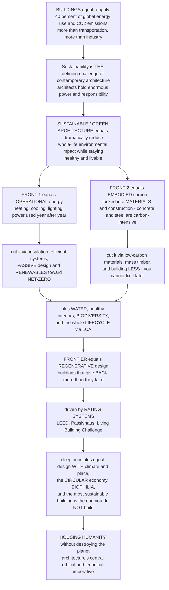

# 🌱 Sustainable and Green Architecture

> [!abstract] TL;DR
> Here is the staggering fact that makes sustainability *the* defining challenge of contemporary architecture: **buildings are responsible for roughly 40 percent of global energy use and CO₂ emissions** — more than transportation, more than industry. How we design, build, and operate buildings is one of the single biggest drivers of the climate crisis, which means architects hold enormous **power and responsibility** to be part of the solution. **Sustainable (or "green") architecture** is the response: designing buildings that dramatically reduce their environmental impact across their *whole life* while staying healthy and livable for people. It attacks the problem on **two fronts.** First, **operational energy** — the energy a building burns over its life for heating, cooling, lighting, and power (the focus for decades) — cut through insulation, efficient systems, **passive design**, and renewables, aiming for **net-zero energy** buildings that produce as much as they use. Second — increasingly recognised as crucial — **embodied carbon**: the emissions locked into a building's **materials** and construction (making concrete and steel is hugely carbon-intensive), which you *cannot fix later*, so low-carbon materials (mass timber) and building *less* / reusing *more* matter enormously. Sustainability also spans **water**, healthy indoor air, **biodiversity**, and the whole **lifecycle** (Life Cycle Assessment). Beyond "less bad," the frontier is **regenerative design** — buildings that give *back* more than they take. It is driven by rating systems (**LEED, BREEAM, Passivhaus, Living Building Challenge**) and grounded in deep principles: designing *with* climate and place, the **circular economy**, **biophilia**, and the recognition that *the most sustainable building is often the one you do not build.* Sustainable architecture is architecture's central **ethical and technical imperative** in the age of climate crisis: how to house humanity without destroying the planet.

---

## Intuition

**Analogy — a building is like a person with two very different carbon "bills": a huge one-time bill you pay the day you are born, and a smaller bill that arrives every single year for the rest of your life.** For most of the last half-century, architects obsessed over only the *yearly* bill — the energy a building consumes to keep its occupants warm, cool, lit, and powered — because it is visible, it shows up on the meter, and over a long life it adds up. So the whole first wave of green design went after *operational* energy: thicker insulation, better windows, tighter construction, efficient heating and cooling, and finally **solar panels on the roof**, chasing the dream of a **net-zero** building that generates as much energy as it uses. That work is real and it matters. But here is the twist that reorganises the whole field: *as you drive the yearly bill toward zero, the one-time birth bill starts to dominate.* That upfront bill is **embodied carbon** — all the CO₂ emitted to dig up, manufacture, transport, and assemble the **concrete, steel, glass, and finishes** a building is made of, spent *before anyone even moves in* — and unlike the operational bill, **you can never pay it back down.** It is locked in the moment you build. A super-efficient tower framed in carbon-heavy concrete can quietly emit more, over its life, than a slightly leakier building framed in **timber that stores carbon**. Once you see both bills at once, the priorities of sustainable architecture snap into focus.

That reframing is why "green building" is really *two campaigns fought together.* On the **operational** front you follow a simple hierarchy: **reduce demand first** — orient the building to the sun, insulate it, shade it, let it breathe with natural ventilation and daylight (this is **passive design**, and it is nearly free once the shape is set) — *then* add efficient mechanical systems, *then* cover whatever demand remains with on-site **renewables**. Do that well and operational carbon approaches zero. On the **embodied** front you make different moves entirely: choose **low-carbon materials** (mass timber, low-carbon concrete, recycled and bio-based products), build *lighter* and *smaller*, and — the most powerful move of all — **build less**, because renovating and reusing an existing building spends almost no new embodied carbon while demolition-and-rebuild spends a fortune of it. Hence the field's most quoted maxim: *"the most sustainable building is the one you do not build."*

But sustainability is bigger than carbon accounting. A truly green building also conserves **water** (harvesting rain, recycling greywater, managing stormwater), protects **health** (clean indoor air, non-toxic materials, daylight and views), supports **biodiversity** (green roofs and walls, habitat, living landscapes), and answers to **social** questions of affordability and community — the "three pillars" of environmental, economic, and social sustainability. Thinking across all of these over a building's entire lifespan, from raw material to demolition, is what **Life Cycle Assessment (LCA)** and the **circular economy** formalise. And the frontier keeps moving: beyond merely doing *less harm*, **regenerative design** asks buildings to be **net-positive** — to generate surplus clean energy, clean their own water, and actively *heal* the ecosystems they sit in, the ambition codified by the **Living Building Challenge** and inspired by **biophilic** design and biomimicry. To understand sustainable architecture is to understand architecture's central ethical and technical imperative in the climate crisis: not a style or a checklist, but the discipline's honest answer to the question of *how to house humanity without wrecking the planet that houses us.*

---

## How It Works

### Core mechanics

1. **Start from the footprint.** The built environment is responsible for roughly **40 percent of global energy-related CO₂ emissions**, about a third of global energy use, huge fractions of raw-material and water consumption, and a large share of solid waste. This scale is *why* sustainability is not one topic among many but the **defining imperative** of contemporary architecture — and why the architect's decisions carry outsized ethical weight.
2. **Split the impact into two carbon streams.** A building's climate impact divides into **operational carbon** (emissions from the energy it *uses* year after year — heating, cooling, ventilation, lighting, hot water, plug loads) and **embodied carbon** (emissions "spent up front" to extract, manufacture, transport, and assemble its **materials**, plus later renovation and end-of-life). Operational you can keep reducing; embodied is largely **fixed at construction** and cannot be recovered.
3. **Attack operational energy with a hierarchy — demand first.** The **energy hierarchy** says: (i) **reduce demand** through **passive design** — orientation, insulation, thermal mass, shading, daylighting, natural ventilation — which costs little once the form is chosen; (ii) **supply efficiently** with high-performance active building systems (heat pumps, heat recovery, efficient lighting and controls); (iii) **generate renewably** on site (rooftop **solar PV**, solar thermal, ground-source heat). The end state is a **net-zero energy** building that produces as much energy annually as it consumes, or the ultra-low-demand **Passivhaus** standard.
4. **Then attack embodied carbon — because the frontier has shifted.** As operational energy falls toward zero, embodied carbon becomes the **dominant remaining impact**. It is driven mostly by **concrete and steel** (cement alone is roughly 8 percent of global CO₂). The responses: choose **low-carbon materials** (mass timber / CLT, which *stores* biogenic carbon; low-carbon and recycled concrete; bio-based products); build **lighter and less**; and above all **reuse** — retrofit and adaptive reuse spend a fraction of new-build embodied carbon.
5. **Think in whole lifecycles.** **Life Cycle Assessment (LCA)** tallies impacts *cradle-to-grave* (or, ideally, *cradle-to-cradle*): raw materials, manufacture, transport, construction, decades of operation, maintenance and replacement, and finally demolition or disassembly. This whole-life view is what exposes the embodied-versus-operational trade-off and motivates the **circular economy** — designing for disassembly, reuse, and recycling so materials never become waste.
6. **Widen beyond carbon.** Genuine sustainability also covers **water** (rainwater harvesting, greywater reuse, stormwater management), **healthy interiors** (indoor air quality, non-toxic materials, daylight — the WELL agenda), **biodiversity and ecology** (green roofs and walls, habitat, living landscapes), **land use and waste**, and **social equity** (affordability, community, health) — the three interlocking pillars of **environmental, economic, and social** sustainability, aligned with the UN SDGs.
7. **Measure, certify — and stay honest.** Rating systems (**LEED, BREEAM, Passivhaus, WELL, Green Star, the Living Building Challenge**) certify performance and drive the market, but they attract critique: *checklist* thinking over real performance, **greenwashing**, and the **performance gap** between predicted and actual energy use — which is why **energy modelling** and **post-occupancy evaluation** matter.
8. **Aim past neutral, toward regeneration.** The frontier is **regenerative design** — buildings that are **net-positive** in energy, water, and ecology, giving back more than they take — together with **biophilic design** (reconnecting people to nature for wellbeing), **climate adaptation and resilience** (designing for heat, flood, and extreme weather), and the vast challenge of **decarbonising the existing building stock** through retrofit.

### Flow / architecture



---

## Key Concepts

### 🟢 Secondary — the big idea and the two bills

- **Buildings are a huge part of the climate problem.** About **40 percent** of the world's energy use and carbon emissions come from buildings — heating them, cooling them, lighting them, and *making* them. So designing better buildings is one of the biggest ways to help the planet.
- **Green architecture = do more with less harm.** A sustainable building is designed to use far less energy and fewer resources, while still being comfortable and healthy to live in.
- **Two kinds of carbon.** A building has a carbon cost from **the energy it uses every year** (heating and cooling — this is *operational*) and a carbon cost from **the stuff it is built out of** (concrete, steel, glass — this is *embodied*, and it is paid all at once when the building goes up).
- **First: use less energy.** Point the building at the sun, wrap it in insulation, use efficient heating and cooling, and put **solar panels** on the roof. A **net-zero** building makes as much energy as it uses.
- **Second: build with better stuff, and build less.** Concrete and steel are very "carbon heavy," while **wood** can actually *store* carbon. And the greenest choice is often to **reuse an old building** instead of tearing it down — *"the most sustainable building is the one you do not build."*
- **More than energy.** Green buildings also save **water**, keep the **air inside clean**, and make room for **nature** (like green roofs and plants).

### 🟡 Undergraduate — the fronts, the hierarchy, and lifecycle thinking

- **Operational carbon and the energy hierarchy.** Operational energy covers heating, cooling, ventilation, lighting, hot water, and plug loads. The design hierarchy is strict: **reduce demand first** (via **passive design** — orientation, insulation, thermal mass, shading, daylighting, natural ventilation), **then** meet remaining demand with **efficient active systems** (heat pumps, heat-recovery ventilation, efficient lighting/controls), **then** cover the rest with **on-site renewables** (solar PV/thermal, ground-source heat). Renewables *last*, not first — it is cheaper and greener to *not need* the energy than to generate it.
- **Net-zero and Passivhaus.** A **net-zero energy** building generates as much energy over a year as it consumes (usually via rooftop PV plus deep efficiency). **Passivhaus / Passive House** is a rigorous ultra-low-energy standard built on a super-insulated, airtight envelope, thermal-bridge-free detailing, and heat-recovery ventilation, cutting heating demand by roughly 80–90 percent.
- **Embodied carbon and the shifting balance.** Embodied carbon is emitted at manufacture, transport, construction, replacement, and end-of-life — and **cannot be reduced after building.** As operational carbon shrinks toward zero, embodied carbon becomes the *majority* of a building's whole-life impact, especially over the critical next few decades. Dominated by **cement (~8 percent of global CO₂)** and **steel**, it is the front where **mass timber (CLT/glulam)**, low-carbon concrete, recycled steel, and bio-based materials pay off.
- **Life Cycle Assessment (LCA).** The standardised method (ISO 14040/14044; EN 15978 for buildings) that quantifies environmental impacts across life stages A (product/construction), B (use), C (end-of-life), and D (beyond, i.e. reuse/recovery). **Whole-life carbon = embodied + operational.** LCA is what makes the two-fronts trade-off visible and comparable.
- **The circular economy in buildings.** Move from *take-make-waste* to *reduce-reuse-recycle*: **design for disassembly**, use demountable connections, favour reused and recyclable materials, and treat existing buildings as **material banks**. Adaptive reuse and retrofit are the circular economy's most powerful architectural expression.
- **Beyond carbon — the wider agenda.** **Water** (rainwater harvesting, greywater reuse, permeable stormwater design), **healthy indoor environments** (air quality, low-VOC materials, daylight and views — the WELL standard), **biodiversity** (green roofs/walls, habitat, ecological landscape), **site and land use**, and **social sustainability** (affordability, equity, community). Together: the **three pillars** — environmental, economic, social.
- **Rating systems and their limits.** **LEED** (US), **BREEAM** (UK), **Green Star** (Australia), **WELL** (health), and the aspirational **Living Building Challenge** certify and market green buildings — but a checklist can be gamed, and the **performance gap** between modelled and measured energy is often large, motivating **post-occupancy evaluation**.

### 🔴 Graduate — regeneration, the performance gap, and the politics of green

- **The shifting frontier, quantified.** Under a decarbonising grid and Passivhaus-level envelopes, operational carbon can fall by 80–90 percent, at which point **embodied carbon dominates** whole-life impact — and, crucially, embodied carbon is emitted *now*, front-loaded in the very decade the carbon budget is tightest. This time-value argument (the World Green Building Council's *"Bringing Embodied Carbon Upfront"*) reorders priorities: reducing *upfront* emissions can matter more than a marginal operational gain, because a tonne saved today is worth more than a tonne saved in 2050.
- **Regenerative design vs sustainability.** "Sustainable" aims for **net-zero / less bad**; **regenerative** design (Bill Reed, the Regenesis group, the Living Building Challenge) aims for **net-positive** — buildings and developments that generate surplus renewable energy, harvest and clean more water than they use, sequester carbon, and *increase* local biodiversity and social capital, treating the building as a participant in a living **place-based system** rather than a machine to be optimised. This reframes design as **whole-systems, integrative** work rather than component efficiency.
- **The integrative design process.** Deep sustainability is not bolted on late; it is achieved through **early, integrated, cross-disciplinary** design (Reed & 7group's *Integrative Design*), where architect, engineer, ecologist, and client co-optimise envelope, systems, structure, and site *together* — because the cheapest, greenest gains (a good orientation, a passive envelope that lets you shrink the mechanical plant) are only available before the concept hardens. Sequential "design then engineer" workflows forfeit them.
- **The performance gap and the rebound effect.** Measured energy use routinely exceeds design predictions by 1.5–2.5× because of unmodelled occupant behaviour, poor commissioning, control complexity, and thermal-bridge/airtightness shortfalls on site. Compounding it, the **rebound (Jevons) effect** means efficiency gains can be partly consumed by increased use (bigger, warmer, more-conditioned buildings). Certification-at-design is therefore no guarantee of certification-in-use — hence **post-occupancy evaluation** and outcome-based, measured standards.
- **Greenwashing and the critique of metrics.** Checklist certifications can reward **credit-shopping** and marketing over genuine performance; single-attribute claims ("recycled content," "LEED Platinum") can mask a large whole-life footprint. A rigorous critique (Ken Yeang, and much recent scholarship) argues for **outcome-based, whole-life, ecologically literal** metrics — actual measured energy, whole-life carbon, real water and ecological balance — rather than design-intent points.
- **Ken Yeang's ecodesign / bioclimatic architecture.** Yeang frames the building as an **artificial ecosystem** that must be integrated — physically, systemically, and temporally — with the **natural systems** of its site: designing with local climate (bioclimatic skyscrapers), closing material and water loops, weaving vegetation and habitat vertically through the building, and planning for its eventual disassembly. Sustainability here is **ecological integration**, not merely reduced consumption.
- **Adaptation, resilience, and the existing stock.** Mitigation (cutting emissions) must pair with **adaptation** — designing for a hotter, more volatile climate (overheating and passive survivability, flood resilience, storm loads, urban heat). And because most of the buildings that will exist in 2050 *already exist*, the decisive battleground is **deep retrofit and decarbonisation of the existing stock**, not new construction — a challenge of scale, finance, heritage, and disruption far harder than designing new zero-carbon icons.
- **The three pillars in tension.** Environmental, economic, and social sustainability do not always align: green premiums can worsen affordability; "eco" enclaves can be exclusionary; embodied-carbon-driven material choices interact with local economies and labour. Genuine sustainability is a **socio-technical**, distributional problem, not only an engineering-efficiency one — connecting architecture to **ecological economics** and environmental justice.

---

## Python Demo

```python
# Sustainable and Green Architecture -- quantifying the TWO FRONTS:
#   (A) WHOLE-LIFE CARBON over 60 years for three buildings:
#         conventional (high embodied + high operational),
#         green        (higher embodied but efficient),
#         low-carbon   (low-carbon materials + near net-zero operation).
#       Shows the CROSSOVER and why, as operational carbon falls, EMBODIED
#       carbon becomes the dominant remaining impact (the shifting frontier).
#   (B) NET-ZERO ANNUAL ENERGY BALANCE: monthly demand (after efficiency)
#       vs on-site solar PV generation -> annual generation matches demand.
#   (C) MARGINAL ABATEMENT CURVE: successive measures ranked by cost --
#       cheap (even money-saving) first, expensive last -> the optimal package.
#   (D) EMBODIED vs OPERATIONAL share of whole-life carbon at year 60 --
#       the frontier shifts from operational-dominated to embodied-dominated.
import numpy as np
import matplotlib.pyplot as plt

years = np.arange(0, 61)  # 0..60 years of building life

# ---- whole-life carbon model (kg CO2e per m2) ------------------------------
# each building: upfront embodied spike + periodic renovation spikes
#                + operational carbon accumulating year by year
def whole_life(embodied_upfront, op_per_year, renov_amt, renov_years):
    cum = np.full_like(years, embodied_upfront, dtype=float)   # upfront at year 0
    cum = cum + op_per_year * years                            # operational accrual
    for ry in renov_years:                                     # renovation spikes
        cum = cum + np.where(years >= ry, renov_amt, 0.0)
    return cum

conv  = whole_life(600, 42, 150, [30])          # concrete/steel, leaky, gas
green = whole_life(760,  9, 110, [30])           # more insulation/glazing, efficient
lowc  = whole_life(300,  2,  60, [40])           # mass timber + near net-zero op

fig, ax = plt.subplots(2, 2, figsize=(14, 11))

# ---------- (A) whole-life cumulative carbon --------------------------------
axA = ax[0, 0]
axA.plot(years, conv,  lw=2.4, color="#c1121f", label="Conventional (high embodied + high operational)")
axA.plot(years, green, lw=2.4, color="#e9c46a", label="Green (higher embodied, efficient)")
axA.plot(years, lowc,  lw=2.4, color="#2a9d8f", label="Low-carbon (mass timber + net-zero)")
# mark the crossover where green overtakes conventional
diff = conv - green
cross = years[np.argmax(diff > 0)] if np.any(diff > 0) else None
if cross:
    axA.axvline(cross, ls="--", color="gray", lw=1)
    axA.text(cross + 0.5, axA.get_ylim()[1]*0.30, f"crossover\n~year {cross}",
             fontsize=8, color="gray")
axA.scatter([0, 0, 0], [conv[0], green[0], lowc[0]], zorder=5, color="black", s=25)
axA.text(1.0, green[0] + 30, "upfront EMBODIED spike\n(paid before day one)", fontsize=8)
axA.set_xlabel("building age  [years]")
axA.set_ylabel("cumulative whole-life carbon  [kg CO2e / m2]")
axA.set_title("(A) Whole-life carbon: the two fronts combined\nefficiency wins over time, but embodied is paid up front")
axA.legend(fontsize=8, loc="upper left"); axA.grid(alpha=0.25)

# ---------- (B) net-zero annual energy balance ------------------------------
axB = ax[1, 1]
months = np.arange(1, 13)
mlab = ["J","F","M","A","M","J","J","A","S","O","N","D"]
# demand after efficiency: heating peak in winter, cooling bump in summer (kWh/m2)
heating = 6.0 * np.clip(np.cos((months-1)/12*2*np.pi), 0, None)
cooling = 2.2 * np.clip(-np.cos((months-1)/12*2*np.pi), 0, None)
base    = 2.0
demand  = base + heating + cooling
# on-site solar PV generation: peaks mid-year (northern hemisphere)
pv = 4.6 + 3.6 * np.cos((months-6)/12*2*np.pi)
w = 0.4
axB.bar(months - w/2, demand, width=w, color="#e76f51", label="energy demand (after efficiency)")
axB.bar(months + w/2, pv,     width=w, color="#457b9d", label="on-site solar PV generation")
axB.set_xticks(months); axB.set_xticklabels(mlab)
axB.set_xlabel("month"); axB.set_ylabel("energy  [kWh / m2 / month]")
axB.set_title(f"(B) Net-zero energy balance\nannual demand {demand.sum():.0f} vs PV {pv.sum():.0f} kWh/m2  ->  net ~ 0")
axB.legend(fontsize=8); axB.grid(axis="y", alpha=0.25)

# ---------- (C) marginal abatement cost curve (MACC) ------------------------
axC = ax[0, 1]
#   measure                       abatement(tCO2)  cost($/tCO2)
measures = [
    ("Insulation upgrade",              9,  -55),
    ("LED lighting + controls",         4,  -35),
    ("Airtightness / draughts",         5,  -12),
    ("Heat pump (vs gas)",             11,   20),
    ("Rooftop solar PV",               13,   45),
    ("Triple glazing",                  6,   70),
    ("Low-carbon concrete",             7,   95),
    ("Mass-timber structure",          16,  120),
]
order = np.argsort([m[2] for m in measures])       # cheapest first
x = 0.0
for i in order:
    name, ab, cost = measures[i]
    color = "#2a9d8f" if cost < 0 else "#e76f51"
    axC.bar(x + ab/2, cost, width=ab, color=color, edgecolor="black", align="center", alpha=0.85)
    axC.text(x + ab/2, cost + (4 if cost >= 0 else -9), name, rotation=90,
             ha="center", va="bottom" if cost >= 0 else "top", fontsize=7)
    x += ab
axC.axhline(0, color="k", lw=1)
axC.set_xlabel("cumulative CO2 abated  [tCO2]")
axC.set_ylabel("marginal abatement cost  [$ / tCO2]")
axC.set_title("(C) Marginal abatement curve\ncheap/negative-cost measures FIRST, expensive last")
axC.grid(axis="y", alpha=0.25)

# ---------- (D) embodied vs operational share at year 60 --------------------
axD = ax[1, 0]
labels = ["Conventional", "Green", "Low-carbon"]
emb = np.array([600 + 150, 760 + 110, 300 + 60], float)     # upfront + renovation
op  = np.array([42*60,      9*60,      2*60],       float)   # operational over 60 yr
axD.bar(labels, emb, color="#8d99ae", edgecolor="black", label="embodied (fixed at build)")
axD.bar(labels, op,  bottom=emb, color="#e76f51", edgecolor="black", label="operational (over 60 yr)")
for i, (e, o) in enumerate(zip(emb, op)):
    share = 100 * e / (e + o)
    axD.text(i, e + o + 60, f"embodied = {share:.0f}%", ha="center", fontsize=9, weight="bold")
axD.set_ylabel("whole-life carbon at year 60  [kg CO2e / m2]")
axD.set_title("(D) The shifting frontier\nas operation approaches zero, EMBODIED dominates")
axD.legend(fontsize=8); axD.grid(axis="y", alpha=0.25)

plt.tight_layout()
plt.savefig("sustainable_architecture.png", dpi=120)
plt.show()

# ---- console summary ----
print("WHOLE-LIFE CARBON at year 60 (kg CO2e / m2):")
for lab, arr in [("conventional", conv), ("green", green), ("low-carbon", lowc)]:
    print(f"  {lab:12s}: {arr[-1]:6.0f}")
print(f"  crossover (green beats conventional): ~year {cross}")
print()
print("NET-ZERO balance:  annual demand = %.0f, PV generation = %.0f kWh/m2  -> net %.0f"
      % (demand.sum(), pv.sum(), pv.sum() - demand.sum()))
print()
print("SHARE of whole-life carbon that is EMBODIED at year 60:")
for lab, e, o in zip(labels, emb, op):
    print(f"  {lab:12s}: embodied {100*e/(e+o):4.0f}%   operational {100*o/(e+o):4.0f}%")
```

The four panels make the two-fronts argument concrete. **(A)** Plotting **cumulative whole-life carbon** shows both bills at once: every building begins with an **upfront embodied spike** (paid before anyone moves in), then accumulates **operational carbon** year by year, with renovation spikes along the way. The **conventional** building starts lower on embodied but its steep operational slope makes it the worst over time; the **green** building carries a *higher* embodied burden yet its shallow slope lets it **cross over** and beat the conventional one after roughly a decade; the **low-carbon** building wins on *both* fronts. **(B)** The **net-zero energy balance** shows demand (already minimised by efficiency, peaking in winter for heating) matched over the year by seasonal **solar PV** generation (peaking in summer) — the two annual totals cancel to roughly zero. **(C)** The **marginal abatement curve** ranks measures by cost: insulation, LEDs, and airtightness are cheap or even *money-saving* and belong first; heat pumps, PV, and low-carbon structure cost more per tonne and come later — the shape of a rational decarbonisation package. **(D)** The **shifting frontier**: at year 60 the conventional building's carbon is mostly *operational*, but for the low-carbon net-zero building operational carbon nearly vanishes and **embodied carbon dominates** the whole-life total — which is exactly why the field's attention has moved to materials and reuse.

---

## Real-World Applications

> **The Edge, Amsterdam (PLP Architecture / OVG, 2015) — the net-zero-energy "smartest office."** A deep-plan office wrapped in a highly efficient envelope, daylight-optimised atrium, aquifer thermal-energy storage for heating and cooling, and a vast rooftop-and-facade **solar PV** array, coupled to a dense sensor network that dims lights and tunes systems to actual occupancy. It demonstrates the full **operational hierarchy** — passive envelope, efficient systems, on-site renewables — pushed to net-zero (or net-positive) energy in a commercial building.

- **Passivhaus housing (e.g. the Bahnstadt district, Heidelberg)** — thousands of dwellings built to the **Passive House** ultra-low-energy standard: super-insulated, airtight envelopes with heat-recovery ventilation cutting heating demand by roughly 80–90 percent. Proof that deep operational efficiency scales to whole neighbourhoods, not just showcase houses.
- **Mjøstårnet and other mass-timber high-rises (Norway, 2019)** — 18-plus-storey towers in **glulam and CLT** that *store* biogenic carbon in their structure, directly attacking **embodied carbon** rather than only operational energy — the leading edge of low-carbon structural design.
- **The Bullitt Center, Seattle (Miller Hull, 2013) — a Living Building.** Certified under the **Living Building Challenge**: net-positive energy from rooftop PV, rainwater-to-potable water, composting toilets, and a strict "Red List" of banned toxic materials — a built manifesto of **regenerative** design that gives back more than it takes.
- **Bosco Verticale, Milan (Boeri, 2014) — biophilia and biodiversity at height.** Two residential towers hosting some 20,000 trees and shrubs on their balconies, providing shade, cooling, air filtration, and urban **habitat** — an argument that buildings can host **biodiversity** and reconnect dense-city dwellers to nature.
- **Adaptive reuse — the "building you do not build."** Projects like the **Tate Modern** (a power station reborn as a gallery) or countless warehouse-to-housing conversions embody the maxim: reusing existing structure spends a fraction of new-build **embodied carbon**, making retrofit and reuse the single most powerful sustainability move for the existing stock.
- **Rating systems in practice — LEED and BREEAM at scale.** From corporate campuses to city planning codes, **LEED** and **BREEAM** certifications now shape the mainstream real-estate market — driving real improvement, while also drawing the **greenwashing** and **performance-gap** critiques that push the field toward measured, outcome-based standards.

---

## Common Pitfalls

- **Chasing operational efficiency while ignoring embodied carbon.** A super-insulated, PV-clad building framed in carbon-intensive concrete and steel can emit *more* over its life — and far more *up front* — than a slightly less efficient timber building. Optimising only the energy meter misses the front you can never fix later.
- **Putting renewables before demand reduction.** Bolting solar panels onto a poorly designed, leaky building is expensive and weak. The hierarchy is **reduce demand first** (passive design), *then* efficient systems, *then* renewables — generating energy you did not need to use is the costliest option.
- **Treating certification as the goal.** LEED Platinum or a BREEAM Excellent rating is a *proxy*, not a guarantee. Checklist "credit-shopping" and single-attribute claims can produce a certified building that performs poorly — **greenwashing** dressed as achievement.
- **Ignoring the performance gap.** Real, measured energy use routinely runs 1.5–2.5× the design prediction because of occupant behaviour, poor commissioning, control complexity, and on-site airtightness/thermal-bridge shortfalls. Design-intent modelling without **post-occupancy evaluation** overstates real savings.
- **Adding sustainability late, as a bolt-on.** The cheapest, deepest gains — good orientation, a passive envelope that lets you shrink the mechanical plant — are only available *before* the concept hardens. Sequential "design, then make it green" workflows forfeit them; deep sustainability requires **early integrative design.**
- **Forgetting the rebound effect.** Efficiency can be partly eaten by increased use — bigger, warmer, more heavily conditioned buildings — so per-unit gains do not automatically yield absolute reductions.
- **Reducing sustainability to carbon alone.** A building can be low-carbon yet waste water, poison indoor air with high-VOC materials, destroy habitat, or be unaffordable. Genuine sustainability spans **water, health, biodiversity, and social equity** — the three pillars — not just energy.
- **Demolishing when you could reuse.** New construction spends a large upfront embodied-carbon budget that reuse largely avoids. Defaulting to demolition-and-rebuild ignores the field's most powerful lever: *the most sustainable building is often the one you do not build.*

---

## Related Concepts

*This is the **Section 06 opener** for the Architecture vault (Sustainable, Digital, and Future Architecture). Sibling notes, referenced here in prose and interlinking once complete: **Architecture_Overview_and_the_Art_of_Building** (the vault hub — sustainability as architecture's central contemporary imperative), **Passive_Design_and_Building_Physics** (the physics of orientation, insulation, thermal mass, shading, and natural ventilation that make up the "reduce demand first" step of the energy hierarchy), **Vernacular_Architecture_and_Regional_Design** (traditional, climate-adapted, low-energy building — the original sustainable architecture, designing *with* place), **Materials_and_Tectonics_in_Architecture** (the embodied-carbon and low-carbon-material argument — mass timber, concrete, and steel — developed at the material scale), **Building_Systems_and_Environmental_Control** (the efficient active HVAC, lighting, and renewable systems that meet the demand passive design cannot), and **The_Reach_and_Future_of_Architecture** (regenerative, decarbonised, resilient architecture as the discipline's future). These interlink once complete.*

Cross-vault connections (verified to exist):

- [[The_Energy_Transition_and_Net_Zero]] — the systems-scale decarbonisation and net-zero framing that a net-zero *building* is one component of.
- [[Energy_Efficiency_and_Demand_Management]] — the "reduce demand first" principle at the scale of whole energy systems, the exact logic of the building energy hierarchy.
- [[Solar_Photovoltaics]] — the on-site renewable generation (rooftop PV) that closes the gap to net-zero after efficiency is maximised.
- [[Emissions_and_the_Climate_Impact_of_Energy]] — why operational energy carries carbon, and how a decarbonising grid changes the operational-versus-embodied balance.
- [[Sustainable_Materials_and_Circular_Economy]] — the materials-science foundation for embodied carbon, low-carbon materials, design for disassembly, and the circular economy this note applies to buildings.
- [[Ecological_Economics_and_Natural_Capital]] — natural capital, the three pillars, and valuing ecosystem impacts — the economic frame for whole-life and regenerative sustainability.
- [[Ecosystem_Services]] — the ecosystem functions (cooling, water regulation, habitat) that regenerative and biophilic buildings aim to *support* rather than degrade.
- [[Restoration_Ecology]] — the science of healing ecosystems that regenerative, net-positive architecture borrows from in aiming to give back more than it takes.
- [[Anthropogenic_Climate_Change]] — the climate crisis that makes sustainable architecture an ethical imperative, and the changing climate that adaptation and resilience must design for.
- [[Urban_Heat_Island_Effect]] — the urban-climate problem that green roofs, reflective surfaces, vegetation, and passive cooling in sustainable design directly mitigate.

---

## Review Questions

**🟢 Secondary**
1. Buildings cause about 40 percent of the world's energy use and carbon emissions. Give two different ways an architect can make a building greener — one that lowers the energy it uses each year, and one that lowers the carbon in the stuff it is built from.
2. What does "the most sustainable building is the one you do not build" mean? Why is reusing an old building often better for the planet than tearing it down and building a new "green" one?

**🟡 Undergraduate**
3. Explain the **energy hierarchy** (reduce demand, then efficient systems, then renewables). Why is it a mistake to put solar panels on a poorly insulated building *before* improving the envelope?
4. Distinguish **operational** carbon from **embodied** carbon. As buildings become highly efficient and the grid decarbonises, why does embodied carbon become the *dominant* remaining impact — and what does that imply for material choice and reuse?

**🔴 Graduate**
5. A client can afford *either* a deep operational retrofit of an efficient concrete building *or* a new low-embodied-carbon timber building. Using **whole-life carbon** and the *time-value* of emissions (a tonne saved today versus in 2050), argue which better serves the climate — and identify what data you would need to decide.
6. Certification systems like LEED are criticised for rewarding checklists over performance ("greenwashing," the performance gap). Contrast **checklist-based** certification with **outcome-based, measured** standards and with **regenerative** (net-positive) design. Is "sustainability" the right ambition, or should architecture aim past it toward regeneration — and why?

---

## Sources

- Brian Edwards, [*Rough Guide to Sustainability: A Design Primer*](https://www.ribabooks.com/rough-guide-to-sustainability-5th-edition_9781859468074) (RIBA Publishing) — a comprehensive, accessible primer on the principles and practice of sustainable design.
- World Green Building Council, [*Bringing Embodied Carbon Upfront*](https://worldgbc.org/advancing-net-zero/embodied-carbon/) (2019) — the landmark report reframing embodied carbon as the urgent, front-loaded priority alongside operational energy.
- Bill Reed & 7group, [*The Integrative Design Guide to Green Building: Redefining the Practice of Sustainability*](https://www.wiley.com/en-us/The+Integrative+Design+Guide+to+Green+Building%3A+Redefining+the+Practice+of+Sustainability-p-9780470181102) (Wiley) — the case for whole-systems, integrative, regenerative design.
- Architecture 2030 (Ed Mazria), [*The 2030 Challenge and Why the Building Sector*](https://architecture2030.org/why-the-building-sector/) — data and targets on the built environment's ~40 percent share of global energy and emissions.
- Ken Yeang, [*Ecodesign: A Manual for Ecological Design*](https://www.wiley.com/en-us/Ecodesign%3A+A+Manual+for+Ecological+Design-p-9780470850985) (Wiley-Academy) — the building as an artificial ecosystem integrated with natural systems; bioclimatic and ecological architecture.

---

#architecture #sustainable-architecture #embodied-carbon #net-zero #green-building
