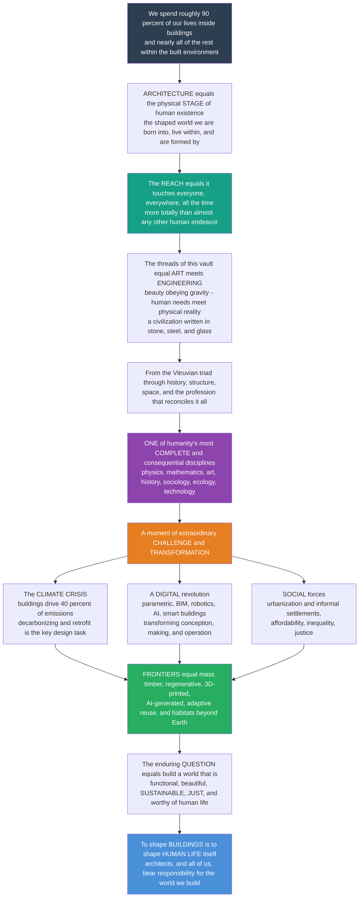

# 🏛️ The Reach and Future of Architecture

> [!abstract] TL;DR
> Step all the way back and take in the whole: **we spend roughly 90 percent of our lives inside buildings, and nearly all of the rest within the built environment.** That single fact is the key to architecture's staggering **reach** — it is not a luxury for elites or a subject for museums but the physical **stage** of human existence, the shaped world we are born into, live within, and are formed by, touching everyone, everywhere, all the time, more totally than almost any other human endeavor. This capstone gathers every thread the vault has pulled — the **foundations and theory** (the Vitruvian triad of *firmness, commodity, delight*; form, function, and society), the **history** across all cultures (classical to contemporary, Western and non-Western), the **structure, materials, and construction** (the physics of building — gravity, span, and material), the **space, form, light, and design** (the invisible essence architecture actually shapes), the **building types, systems, and professional practice** (how buildings get made and run), and the **sustainable and digital frontiers** — and reveals architecture as one of humanity's most **complete and consequential** disciplines: where **art meets engineering** (beauty obeying gravity), where the deepest human needs meet physical reality, and where a civilization writes its values, power, and dreams in stone, steel, and glass, drawing on nearly everything — physics, mathematics, art, history, sociology, psychology, ecology, economics, and technology. And architecture now stands at a moment of extraordinary **challenge and transformation.** The defining challenge is the **climate crisis**: buildings drive roughly **40 percent of global emissions**, so decarbonizing and making the built environment net-zero, regenerative, and resilient — new *and* retrofit — is arguably the single most important design task facing humanity. Simultaneously a **digital revolution** (parametric and computational design, BIM, digital fabrication, robotic construction, AI, and smart buildings) is transforming how buildings are conceived, made, and operated; and huge **social forces** press in — rapid global **urbanization** (housing billions, informal settlements), the **affordability** crisis, and growing **inequality** and injustice in who gets good space. The **frontiers** are vivid: mass-timber towers and regenerative buildings, 3D-printed and robotically-built structures, AI-generated and responsive architecture, adaptive reuse over demolition, biophilic and health-focused design, and perhaps architecture beyond Earth — Moon and Mars habitats. The **enduring question** remains what it has always been: *how do we build a world that is not only functional and beautiful, but sustainable, just, healthy, and worthy of human life?* The meta-lesson of the whole vault is that **to shape buildings is to shape human life itself** — and that architects, and all of us, bear responsibility for the world we build.

---

## Intuition

**Analogy — architecture is the one art you can never leave.** You can close a book, walk out of a concert, look away from a painting. You cannot step outside architecture. Read this sentence and look up: a ceiling is holding a floor above you, a wall is deciding where the light falls, a door is choosing who may enter, a window is framing the only sky you can see from where you sit. You were born in a building, you will likely die in one, and in between you will spend — the studies converge on the figure — about **90 percent of your life indoors**, and almost all of the small remainder still inside the *built environment* of streets, squares, and infrastructure. No other human endeavor is this **total.** Language, money, and law are everywhere, but they are invisible; architecture is the physical, three-dimensional, gravity-obeying **stage** on which every other human activity is performed. It is not the backdrop to life. It *is* the shaped world that forms us.

Once you see that, the ambition of this whole vault comes into focus, because architecture turns out to sit at the exact crossing point of almost everything else. It is where **art meets engineering** — a cathedral or a bridge is beautiful *and* it must not fall down, so beauty here is beauty that obeys gravity, the [Vitruvian](#) reconciliation of *firmness, commodity, and delight* that opened this vault. It is where the **deepest human needs** (shelter, safety, belonging, dignity, awe) meet **physical reality** (the weight of a roof, the cost of steel, the angle of the winter sun). And it is where a **civilization writes itself down** — its values, its power, its faith, its inequality, and its dreams — in stone, steel, and glass that outlast the people who raised it, so that we read a society in its buildings the way we read a mind in its handwriting. Trace the vault's threads and architecture is revealed as one of humanity's most **complete** disciplines, drawing at once on physics and mathematics, on history and sociology, on psychology and ecology, on economics, politics, and technology. To understand buildings you very nearly have to understand everything.

And this most total of arts stands, right now, at a hinge in its history. The **climate crisis** has handed architecture the largest single problem of its existence: the built environment drives roughly **40 percent of global carbon emissions**, which means that decarbonizing it — designing and *retrofitting* for net-zero, regeneration, and resilience — may be the most consequential design task facing our species. At the same instant a **digital revolution** is rewriting how buildings are even conceived (parametric and computational design, BIM, robotic fabrication, AI, responsive smart buildings), and vast **social forces** press against the profession from every side — a planet **urbanizing** at breathtaking speed with billions to house and vast informal settlements to dignify, a deepening crisis of **affordability**, and stark **inequality** in who gets good, healthy, beautiful space and who does not. The **frontiers** ahead are extraordinary — mass-timber towers that store carbon, regenerative buildings that give back more than they take, 3D-printed and robotically-built structures, AI-generated and adaptive architecture, the quiet revolution of reusing what already exists, and even habitats on the Moon and Mars. Through all of it runs one unchanging question, the same one Vitruvius wrestled with two thousand years ago: *how do we build a world that is not only useful and beautiful, but sustainable, just, and worthy of the lives lived inside it?* This capstone is the vault's answer, and its charge: because **to shape buildings is to shape human life itself.**

---

## How It Works

### Core mechanics

Read this note as **the vault's six sections converging into one truth about architecture, then that truth turned to face the future.** The sections are the pillars the vault is organized around; the convergence is that architecture is *simultaneously* all of them — art and engineering and history and society and ecology at once; and the future is what happens when that most-total of disciplines is aimed at the century of climate crisis, digital revolution, and mass urbanization.

1. **Section 1 — Foundations and theory: what architecture *is*.** Before any building, architecture is an *idea* about reconciling firmness, commodity, and delight. The [Vitruvian triad](#) — structural soundness, useful function, and beauty — is the discipline's founding equation, elaborated over centuries into questions of *form and function*, *ornament and meaning*, and the relationship of building to *culture and society*. This is the "why" and "should" beneath every "how." (Prose siblings: *Architecture_Overview_and_the_Art_of_Building*, *Vitruvius_and_the_Principles_of_Architecture*, *Form_Function_and_Ornament*, *Architecture_Culture_and_Society*.)

2. **Section 2 — History across cultures: what architecture *has been*.** The story runs from the post-and-lintel temples of the ancient world, through the arch, vault, and dome of Rome, the soaring stone skeletons of the Gothic, the recovered order of the Renaissance and the drama of the Baroque, the rupture of the **Modern Movement** (*form follows function*, *less is more*, the machine aesthetic), and the pluralism of the postmodern and contemporary — *alongside*, not behind, the great **non-Western traditions** of China, Japan, India, the Islamic world, Africa, and the Americas. History is architecture's memory of every answer already tried. (Prose siblings: *Ancient_and_Classical_Architecture*, *Medieval_Architecture_Romanesque_and_Gothic*, *Renaissance_and_Baroque_Architecture*, *Modern_Architecture_and_the_Modern_Movement*, *Non_Western_Architectural_Traditions*.)

3. **Section 3 — Structure, materials, and construction: how architecture *stands up*.** This is the physics of building — the load path from roof to ground, the arch/dome/shell that turns bending into compression, the tall building made possible by steel and the elevator, and the marriage of *tectonics* to *material* (stone, timber, brick, concrete, steel, glass). Beauty here is inseparable from **not falling down**, the point where architecture becomes the sister of [[Civil_Engineering_Overview|civil and structural engineering]]. (Prose siblings: *Structure_and_Architectural_Form*, *Spanning_Space_Arches_Domes_and_Shells*, *Materials_and_Tectonics_in_Architecture*, *Construction_and_Building_Technology*.)

4. **Section 4 — Space, form, light, and design: what architecture actually *shapes*.** The paradox at the heart of the field: architecture's true medium is not the wall but the **void** the wall defines — *space*, *proportion*, *composition*, *light and atmosphere*, *place (genius loci)*, and the *circulation* that choreographs a body through a building. This is the invisible essence, the reason a great room *feels* different before you can say why. (Prose siblings: *Space_and_Spatial_Experience*, *Proportion_Scale_and_Geometry*, *Light_Color_and_Atmosphere*, *Genius_Loci_Place_and_Context*.)

5. **Section 5 — Building types, systems, and practice: how architecture *gets made and run*.** The pragmatic reality: the *typologies* (house, temple, factory, museum, tower), the *systems* that keep them habitable (structure, envelope, HVAC, services), the *profession* that navigates client, code, cost, and contractor, the *city* that buildings compose, and the **ethics, codes, and accessibility** that make building a public trust rather than a private whim. (Prose siblings: *Building_Typologies*, *Building_Systems_and_Environmental_Control*, *The_Architectural_Profession_and_Practice*, *Urban_Design_and_the_City*, *Codes_Accessibility_and_the_Ethics_of_Building*.)

6. **Section 6 — Sustainable and digital frontiers: where architecture *is heading*.** The edge this capstone lives on: the **sustainable** imperative (net-zero, embodied carbon, regenerative and resilient design, retrofit) and the **digital** revolution (parametric and computational design, BIM, digital fabrication, robotic construction, AI, and smart, responsive buildings). (Prose siblings: *Sustainable_and_Green_Architecture*, *Parametric_and_Computational_Design*, *BIM_Digital_Fabrication_and_Smart_Buildings*, and this capstone.)

**The convergence.** No real building lives in a single section. A single good building is a *theory* made concrete (Section 1), in dialogue with *history* (Section 2), standing up by *structure and material* (Section 3), shaping *space and light* (Section 4), serving a *program* under *code and budget* (Section 5), and — now non-negotiably — answering to *carbon and climate* (Section 6). The architect's real skill is not any one section but the **synthesis** of all of them into a whole that is firm, useful, beautiful, *and* responsible. That synthesis is precisely why architecture reaches into nearly every other discipline, and why it belongs at the culmination of a polymath's vault.

**The reach.** Point that synthesis at human life and you see architecture's true scope: it provides **shelter and survival**; it shapes **health and wellbeing** (we are literally formed by the light, air, and space we live in); it conditions **behavior and society** (buildings decide who meets whom, how we work, gather, and live together); it carries **identity, culture, and meaning**; it drives a huge slice of the **economy** (construction is one of the world's largest sectors); and it presses hardest of all on the **environment** (the built environment is humanity's largest and most consequential artifact). Architecture connects to virtually every domain of knowledge and life because life is *lived inside it*.

**The transformation.** Now aim that same discipline at the century ahead and its frontier is redrawn from *building the world* to *sustaining, decarbonizing, and justly sharing* it. Three great forces converge: **(1) the climate crisis** — the built environment's ~40 percent of emissions makes decarbonization the defining design task, spanning low-carbon materials and mass timber, deep efficiency and passive design, on-site renewables, resilience to a changing climate, and above all the **retrofit** of the vast stock that already exists; **(2) the digital revolution** — parametric/computational design, BIM, digital and robotic fabrication, AI-generated and generative design, and smart, responsive buildings, transforming conception, making, and operation; and **(3) the social crises** — rapid **urbanization** (housing billions, dignifying informal settlements, the developing-world building boom), the **affordability** emergency, and deep **inequality** in who gets good space, raising questions of inclusion, community, and the public realm. The **frontiers** where these forces point: regenerative and net-positive buildings, mass timber and bio-materials, 3D-printed and automated construction, AI-driven and adaptive/responsive architecture, **adaptive reuse** and the circular economy (building *less*, reusing *more*), biophilic and health-focused design, and the far edge of **space architecture** for the Moon and Mars.

**The responsibility.** All of it collapses into one meta-lesson: because we spend our lives inside buildings, *to shape buildings is to shape human life — and the planet — itself.* That is the architect's, and society's, profound **responsibility**: ethical, environmental, and social. And it revives, unchanged, the question architecture has always faced — how to build a world that is not only functional and beautiful but **sustainable, just, healthy, and worthy of human flourishing.** Architecture is, in the end, the collective project of making a good world to live in.

### Flow / architecture



---

## Key Concepts

### 🟢 Secondary — the whole world, and why it matters

- **You live inside architecture almost all the time.** People spend roughly **90 percent** of their lives indoors, and nearly all the rest still in the built world of streets and cities. Architecture is the one art you can never step outside of — it is the *stage* every part of life is acted on.
- **Architecture is art *and* engineering together.** A building has to be **beautiful** *and* it has to **not fall down** *and* it has to **work** for the people inside. That three-way balance — firm, useful, delightful — is what makes it so hard and so complete.
- **Buildings show what a society believes.** Temples, palaces, houses, and skyscrapers are a civilization writing down its values, its power, and its dreams in a form that lasts for centuries.
- **Buildings are a huge part of the climate problem — and the solution.** Making, heating, cooling, and lighting buildings causes about **40 percent** of the world's carbon emissions. So designing greener buildings, and fixing up old ones, is one of the biggest things humanity can do for the planet.
- **The future is already arriving.** New tools (computers that help design, robots and 3D printers that build) and new ideas (wooden towers, buildings that give back to nature, even homes on Mars) are changing what architecture can be.
- **The big lesson.** Because we spend our lives inside buildings, **shaping buildings means shaping human life** — which is why what and how we build really matters.

### 🟡 Undergraduate — the synthesis, the reach, and the crossroads

- **Architecture as synthesis, not a single skill.** The vault's six sections — theory, history, structure, space, practice, and the sustainable/digital frontier — are not a menu but a *simultaneous* demand. A real building is a *theory* made physical, in dialogue with *history*, standing by *structure*, shaping *space and light*, serving a *program* under *code and cost*, and answering to *carbon*. The architect's core competence is the **integration** of all six into one firm, useful, beautiful, responsible whole — which is exactly why architecture reaches into physics, mathematics, art, sociology, ecology, and economics at once.
- **The reach, made specific.** Architecture's influence runs through **shelter and survival**, **health and wellbeing** (we are shaped by our environments — light, air, noise, space affect the body and mind), **behavior and society** (buildings script who meets whom and how we work and gather), **identity and meaning**, the **economy** (construction is ~13 percent of global GDP), and the **environment** (the built environment is our largest artifact and biggest resource sink). The built world is the single most consequential object humanity makes.
- **The two-carbon frame, one level up.** A building's climate impact splits into **operational** carbon (energy used year after year) and **embodied** carbon (locked into materials at construction and unrecoverable). As grids decarbonize and efficiency improves, embodied carbon dominates — which is why the frontier moves to **materials** (mass timber, low-carbon concrete) and to **building less** (adaptive reuse). This is the physical core of *Sustainable_and_Green_Architecture* raised to the scale of the whole discipline.
- **The digital revolution in one sentence.** **Parametric/computational design** lets form be *generated* from rules and data rather than drawn line by line; **BIM** makes the building a coordinated digital model before it is a physical object; **digital and robotic fabrication** and **3D printing** let that model be built directly; and **smart, sensor-rich buildings** let it be operated and tuned in use — a continuous digital thread from concept to occupancy.
- **The social forces are not a footnote.** Rapid **urbanization** (the planet is now majority-urban, adding a city's worth of people every week), the **affordability** crisis, **informal settlements** housing a billion-plus people, and stark **inequality** in access to good space make architecture a question of **justice**, not only aesthetics — the domain where architecture meets [[Urban_Sociology_and_the_City|urban sociology]] and [[Energy_Policy_and_Decarbonization|public policy]].
- **The enduring question is old.** From Vitruvius onward the discipline has asked how to unite *firmness, commodity, and delight*; today we simply add **sustainability and justice** to that list. The question is continuous; only its urgency has changed.

### 🔴 Graduate — the discipline at a hinge, and the responsibility

- **Architecture as the most interdisciplinary of the design arts.** It is the discipline in which *no* boundary is clean: the structural (physics, materials science, [[Civil_Engineering_Overview|civil engineering]]), the environmental (thermodynamics, building physics, [[The_Energy_Transition_and_Net_Zero|energy systems]], [[Anthropogenic_Climate_Change|climate science]]), the human (psychology, sociology, [[Urban_Sociology_and_the_City|urban studies]], anthropology), the economic and political (finance, policy, power), and the aesthetic and cultural (art, [[Architecture_and_the_Built_Environment|art history]], philosophy) all bear on a single artifact that must then be *built*. Its permanent difficulty — and value — is that it must **reconcile** what other disciplines can each isolate.
- **The enduring core versus the shifting frontier.** Vitruvius's triad, the load path, the shaping of space and light, and the reconciliation of art and function are *permanent* — as true in a century as in Rome. What shifts is the *frontier* the core is aimed at: today, decarbonization, digital production, and mass urbanization. Master the invariants and you can absorb the frontier, because the discipline that designed for gravity, climate, and human need can design for a carbon budget, a robot fabricator, and a billion new city-dwellers with the same fundamental commitments.
- **Decarbonization as the defining design task, honestly stated.** The built environment is responsible for roughly **37–40 percent of energy-related CO₂**; cement alone is ~8 percent. Meeting a net-zero-by-2050 pathway requires the sector's emissions to fall steeply *from now*, and the levers are known: deep efficiency and passive design, grid and on-site renewables, low-carbon and bio-based materials, and — decisively — **building less** and retrofitting the existing stock (most 2050 buildings already exist). This is not a niche of architecture; it *is* architecture's central twenty-first-century problem, connecting the discipline directly to [[The_Energy_Transition_and_Net_Zero|the energy transition]] and [[Human_Population_and_the_Anthropocene|the Anthropocene]].
- **The digital transformation as epistemic, not just tooling.** Parametric and generative design change *how form is reasoned about* (from drawing objects to specifying the rules and performance criteria that generate them); BIM changes *who knows what when* (a shared model as single source of truth); AI and machine learning change *what design labor is scarce* (routine documentation automates; framing, judgment, and synthesis become the differentiator); and smart, responsive buildings blur the line between *designing* a building and *programming* one. The competitive skill migrates from drafting toward **problem-framing and integration** — the very synthesis this capstone describes.
- **The justice dimension is intrinsic, not optional.** Because architecture distributes a fundamental good — safe, healthy, dignified space — the question of *who gets good architecture* is a question of justice. Rapid urbanization, informal settlements, displacement, the green premium's threat to affordability, and unequal access to daylight, safety, and beauty make the built environment a primary site of inequality. Genuine progress is therefore **socio-technical and distributional**, not merely a matter of engineering efficiency or aesthetic innovation — the point at which architecture becomes inseparable from [[Energy_Policy_and_Decarbonization|policy]] and [[Urban_Sociology_and_the_City|the sociology of the city]].
- **The far frontier and the return to first principles.** Regenerative (net-positive) buildings, robotic and 3D-printed construction, AI-generated architecture, the circular economy of adaptive reuse, and **space architecture** (habitats for the Moon and Mars, where the Vitruvian problem of shelter is stripped to its bare physics) all extend the discipline — yet each is the *same* discipline redeployed: reconciling human need, physical reality, and meaning under new constraints. The frontier does not replace the core; it reveals it.
- **The steward's mandate.** Every frontier — decarbonization, digital production, urbanization, justice — is ultimately a *shape-the-human-habitat-responsibly-at-scale* problem, precisely architecture's master skill. To shape buildings is to shape life and planet; the demand for architects who can hold *all* of it together — the firm, the useful, the beautiful, the sustainable, and the just — has never been greater.

---

## Python Demo

```python
# The Reach and Future of Architecture -- a four-panel capstone dashboard that
# makes the whole synthesis quantitative:
#
#   (A) THE REACH      -> where a human life is spent: ~90% indoors, nearly all
#                         of the rest still within the built environment.
#   (B) THE FOOTPRINT  -> the built environment's dominant share of global
#                         energy, emissions, materials, waste, and water flows.
#   (C) THE CHALLENGE  -> the DECARBONIZATION pathway: business-as-usual building
#                         emissions vs the steep decline required for net-zero by
#                         2050, and the lever "wedges" that close the gap.
#   (D) THE FUTURE     -> two divergent scenarios (regenerative-and-just vs
#                         business-as-usual): the future as CONTINGENT on choices
#                         made now.
#
# Requires: numpy, matplotlib
import numpy as np
import matplotlib.pyplot as plt

fig, ax = plt.subplots(2, 2, figsize=(15, 11))
fig.suptitle("The Reach and Future of Architecture: shaping buildings is shaping life",
             fontsize=15, fontweight="bold")

# =====================================================================
# (A) THE REACH: where a human life is spent (share of a lifetime).
#     Indoor/building ~87%, in enclosed transport ~6%, outdoors ~7%
#     -> ~93% within the BUILT ENVIRONMENT; ~90% indoors in buildings.
# =====================================================================
axA = ax[0, 0]
segments = ["Indoors,\nin buildings", "In vehicles /\nbuilt transport", "Outdoors,\nunbuilt"]
share    = np.array([87.0, 6.0, 7.0])          # percent of a lifetime
colors   = ["#34495e", "#2980b9", "#27ae60"]
left = 0.0
for s, c, lab in zip(share, colors, segments):
    axA.barh(0, s, left=left, color=c, edgecolor="white")
    axA.text(left + s / 2, 0, f"{lab}\n{s:.0f}%", ha="center", va="center",
             color="white", fontsize=8, fontweight="bold")
    left += s
axA.axvline(90, ls="--", color="crimson", lw=1.5)
axA.text(90, 0.62, "~90% of life indoors", ha="center", color="crimson", fontsize=8.5)
axA.set_xlim(0, 100); axA.set_ylim(-0.5, 0.8)
axA.set_yticks([]); axA.set_xlabel("share of a human lifetime  [percent]")
axA.set_title("(A) THE REACH: we live inside architecture\n~93% of life within the built environment")

# =====================================================================
# (B) THE FOOTPRINT: built-environment share of global flows.
#     Illustrative, order-of-magnitude figures (UNEP / IEA range).
# =====================================================================
axB = ax[0, 1]
flows = ["CO2\nemissions", "Energy\nuse", "Raw\nmaterials", "Solid\nwaste", "Freshwater\nuse"]
pct   = np.array([40, 34, 40, 35, 12], dtype=float)
bars = axB.bar(range(len(flows)), pct, color="#c0392b", edgecolor="black", alpha=0.85)
for b, p in zip(bars, pct):
    axB.text(b.get_x() + b.get_width() / 2, p + 1.0, f"{p:.0f}%",
             ha="center", fontsize=9, fontweight="bold")
axB.set_xticks(range(len(flows))); axB.set_xticklabels(flows, fontsize=8)
axB.set_ylim(0, 55); axB.set_ylabel("built environment's share of global total  [percent]")
axB.set_title("(B) THE FOOTPRINT: humanity's largest artifact\nbuildings dominate global resource and carbon flows")
axB.grid(axis="y", alpha=0.25)

# =====================================================================
# (C) THE CHALLENGE: decarbonization pathway to net-zero by 2050.
#     BAU building emissions vs the required declining pathway; the GAP
#     is closed by four lever wedges (efficiency, renewables, materials,
#     building less / reuse), stacked to fill the gap.
# =====================================================================
axC = ax[1, 0]
yr = np.arange(2020, 2051)
bau = 10.0 * (1 + 0.006 * (yr - 2020))                 # ~10 Gt CO2/yr, slight rise
required = 10.0 * np.clip(1 - (yr - 2020) / 30.0, 0, 1) # linear to 0 by 2050
gap = bau - required
# lever shares of the gap (grow implicitly as the gap grows)
levers = [("Efficiency & retrofit", 0.40, "#2a9d8f"),
          ("Renewables & clean grid", 0.28, "#f4a261"),
          ("Low-carbon materials",   0.20, "#8e44ad"),
          ("Build less / reuse",     0.12, "#e76f51")]
base = required.copy()
for name, frac, col in levers:
    top = base + frac * gap
    axC.fill_between(yr, base, top, color=col, alpha=0.85, label=name)
    base = top
axC.plot(yr, bau, color="black", lw=2.2, ls="--", label="Business as usual")
axC.plot(yr, required, color="crimson", lw=2.6, label="Net-zero pathway (required)")
axC.scatter([2050], [0], color="crimson", zorder=5)
axC.text(2050, 0.4, "net zero\n2050", ha="right", color="crimson", fontsize=8)
axC.set_xlabel("year"); axC.set_ylabel("building-sector emissions  [Gt CO2 / yr]")
axC.set_title("(C) THE CHALLENGE: decarbonizing the built environment\nthe gap, and the levers that close it")
axC.legend(fontsize=7.5, loc="upper right"); axC.grid(alpha=0.25); axC.set_ylim(0, 12)

# =====================================================================
# (D) THE FUTURE: two divergent scenarios from today, on a composite
#     "sustainability & justice" index -- the future is CONTINGENT.
# =====================================================================
axD = ax[1, 1]
t = np.arange(2025, 2101)
x = (t - 2025) / 75.0
regen = 50 + 42 * (1 - np.exp(-2.2 * x))               # regenerative & just -> rises
bau_s = 50 - 26 * x - 6 * np.sin(3 * x) * x            # business as usual -> declines
axD.plot(t, regen, color="#27ae60", lw=2.6, label="Regenerative & just")
axD.plot(t, bau_s, color="#c0392b", lw=2.6, label="Business as usual")
axD.fill_between(t, bau_s, regen, color="#f1c40f", alpha=0.18)
axD.axvline(2025, ls=":", color="gray", lw=1)
axD.text(2027, 30, "choices made NOW\nfork the future", fontsize=8, color="gray")
axD.annotate("livable, low-carbon, equitable", xy=(2100, regen[-1]),
             xytext=(2062, 92), fontsize=8, color="#27ae60",
             arrowprops=dict(arrowstyle="->", color="#27ae60"))
axD.annotate("hotter, unequal, brittle", xy=(2100, bau_s[-1]),
             xytext=(2060, 10), fontsize=8, color="#c0392b",
             arrowprops=dict(arrowstyle="->", color="#c0392b"))
axD.set_xlabel("year"); axD.set_ylabel("built-environment sustainability & justice index")
axD.set_title("(D) THE FUTURE: contingent on choices\ndivergent trajectories from today")
axD.set_ylim(0, 100); axD.legend(fontsize=8, loc="center left"); axD.grid(alpha=0.25)

plt.tight_layout(rect=[0, 0, 1, 0.95])
plt.savefig("reach_and_future_of_architecture.png", dpi=120)
plt.show()

# ------------------------------ console summary ------------------------------
print("=== The Reach and Future of Architecture, in numbers ===")
print(f"(A) REACH      : {share[0]:.0f}% of life indoors; "
      f"{share[:2].sum():.0f}% within the built environment.")
print("(B) FOOTPRINT  : built-environment share of global flows:")
for f_, p in zip([s.replace(chr(10), ' ') for s in flows], pct):
    print(f"        {f_:14s}: {p:2.0f}%")
print(f"(C) CHALLENGE  : BAU 2050 = {bau[-1]:.1f} Gt/yr vs required 0.0 Gt/yr; "
      f"cumulative gap to close ~ {gap.sum():.0f} Gt.")
print(f"(D) FUTURE     : index in 2100 -> regenerative {regen[-1]:.0f} "
      f"vs business-as-usual {bau_s[-1]:.0f} (fork set by choices made now).")
```

The four panels *are* the argument of this capstone. **(A) The reach** lays a single human life along one bar and shows the astonishing truth beneath everything: roughly **90 percent** of it is spent indoors, and about **93 percent** within the built environment — architecture is the habitat of the human animal. **(B) The footprint** turns that habitat around to face the planet: the built environment is not just where we live but humanity's **largest artifact**, commanding a dominant share of global carbon, energy, materials, waste, and water — which is *why* it matters so totally. **(C) The challenge** is the century's defining design task in one chart: business-as-usual building emissions run flat-to-rising while a net-zero-by-2050 pathway must plunge to zero, and the coloured **wedges** — efficiency and retrofit, clean energy, low-carbon materials, and building *less* — are the levers that close the gap. **(D) The future** refuses to be a single line: from today two trajectories fork — a **regenerative and just** built environment that becomes more livable, low-carbon, and equitable, versus a **business-as-usual** path toward a hotter, more unequal, more brittle world — and the yellow wedge between them is the space of everything still to be decided. The future of architecture is not predicted here; it is *chosen*.

---

## Real-World Applications

> **The built environment as humanity's largest artifact — and every frontier is the same discipline redeployed.** Consider a single deep **retrofit** of an ageing city block: it is a *theory* problem (what should this place become?), a *history* problem (what is worth keeping?), a *structure* problem (can the old frame carry a new life?), a *space* problem (light, air, and circulation reimagined), a *practice* problem (code, cost, tenants, and contractor), and a *carbon* problem (reuse spends a fraction of new-build's embodied emissions) — all at once. Retrofit is not a lesser act than the icon; in the age of the carbon budget it is often the *higher* one, because **the most sustainable building is usually the one you do not build.** The same synthesis, aimed at a new constraint, is the whole future of the field in miniature.

- **Decarbonization at scale — the mass-timber tower and the deep retrofit.** Buildings like Norway's *Mjøstårnet* (18-plus storeys of glulam and CLT that *store* biogenic carbon) and city-wide retrofit programs attack the built environment's ~40 percent of emissions head-on — the single most consequential design task of the century, and the direct link to [[The_Energy_Transition_and_Net_Zero|the energy transition]] and [[Energy_Policy_and_Decarbonization|decarbonization policy]].
- **The digital thread — from parametric form to robotic fabrication.** Projects designed parametrically, coordinated in **BIM**, and built by robots or 3D-printed concrete printers (from complex facades to entire printed houses) show the digital revolution running from concept to construction — reshaping *how* buildings are conceived, made, and operated, and sharing a frontier with [[Civil_Engineering_Overview|structural and construction engineering]].
- **Housing the urban billions — and the question of justice.** The developing-world building boom, the upgrading of **informal settlements**, and the global **affordability** crisis make architecture a frontline of equity: who gets safe, healthy, dignified space is a question this discipline answers in built form, at the intersection with [[Urban_Sociology_and_the_City|urban sociology]] and public policy.
- **Regenerative and biophilic design — buildings that give back.** Living-Building-Challenge projects that generate surplus energy, clean their own water, and host biodiversity, and biophilic designs that reconnect dense-city dwellers to nature, push architecture past "less bad" toward **net-positive** — treating the building as a participant in a living [[Human_Population_and_the_Anthropocene|planetary system]] rather than a machine to be optimized.
- **Adaptive reuse and the circular economy.** From power stations reborn as galleries to warehouses turned into housing, reuse embodies the field's most powerful climate lever and its shift from *building more* to *building better with what exists*.
- **Architecture as art — and beyond Earth.** Cultural landmarks that a civilization builds to say who it is (the museum, the concert hall, the memorial) show architecture as [[Architecture_and_the_Built_Environment|one of the great art forms]]; at the far edge, proposals for **Moon and Mars habitats** strip the Vitruvian problem of shelter to its bare physics, proving the discipline's reach now extends past the planet that produced it.

---

## Common Pitfalls

- **Mistaking architecture for a luxury or a style rather than the human habitat.** The image of architecture as expensive icons for elites, or as a menu of "looks," hides its real nature: it is the physical stage of *everyone's* life, most of it spent inside ordinary, unglamorous buildings. The reach is universal; the icons are the exception.
- **Reducing the discipline to a single dimension.** Treating architecture as *only* engineering (will it stand?), *only* art (is it beautiful?), *only* function (does it work?), or *only* sustainability (what is its carbon?) misses the point that its defining difficulty is holding *all* of these together at once. Optimizing one dimension while ignoring the others is how buildings fail as *architecture* even when they succeed as objects.
- **Believing the future replaces the core rather than redeploying it.** Decarbonization, digital fabrication, and space habitats are sometimes imagined as a break with "old" architecture. They are not — each is the *same* reconciliation of human need, physical reality, and meaning aimed at a new constraint. Dismissing the Vitruvian core as obsolete leaves you unable to design the very future that depends on it.
- **Chasing the new-build icon while ignoring the existing stock.** Most of the buildings that will exist in 2050 *already exist*, and demolition-and-rebuild spends a fortune of unrecoverable embodied carbon. Defaulting to the glamorous new project over the unglamorous **retrofit** is the field's most common and most costly climate error.
- **Treating sustainability as carbon accounting alone, and forgetting justice.** A building can be low-carbon yet unaffordable, exclusionary, unhealthy, or ecologically destructive in other ways. Genuine progress is **socio-technical and distributional** — spanning health, equity, community, water, and biodiversity — not a single number. Ignoring *who gets good space* mistakes a justice problem for an efficiency one.
- **Assuming the future is predicted rather than chosen.** As the demo's final panel insists, the trajectory of the built environment is *contingent* on decisions made now. Fatalism ("technology will sort it out") and despair ("nothing can change") are both forms of the same error: forgetting that to shape buildings is to *choose* the world, and that the choice is ours.

---

## Related Concepts

*This is the **capstone of the Architecture vault** — the final note. It gathers the whole arc, referenced here in prose (siblings interlink as the vault completes): **foundations and theory** — *Architecture_Overview_and_the_Art_of_Building*, *Vitruvius_and_the_Principles_of_Architecture*, *Form_Function_and_Ornament*, *Architectural_Theory_and_Criticism*, *Architecture_Culture_and_Society*, *The_Design_Process_and_Architectural_Representation*; **history across cultures** — *Ancient_and_Classical_Architecture*, *Medieval_Architecture_Romanesque_and_Gothic*, *Renaissance_and_Baroque_Architecture*, *Modern_Architecture_and_the_Modern_Movement*, *Postmodern_and_Contemporary_Architecture*, *Non_Western_Architectural_Traditions*; **structure, materials, construction** — *Structure_and_Architectural_Form*, *Spanning_Space_Arches_Domes_and_Shells*, *Materials_and_Tectonics_in_Architecture*, *Construction_and_Building_Technology*, *The_Tall_Building_and_the_Skyscraper*, *Structural_Innovation_and_Iconic_Engineering*; **space, form, light, design** — *Space_and_Spatial_Experience*, *Proportion_Scale_and_Geometry*, *Composition_Order_and_Form*, *Light_Color_and_Atmosphere*, *Genius_Loci_Place_and_Context*, *Circulation_Program_and_Plan*; **types, systems, practice** — *Building_Typologies*, *Building_Systems_and_Environmental_Control*, *The_Architectural_Profession_and_Practice*, *Urban_Design_and_the_City*, *Landscape_and_Interior_Architecture*, *Codes_Accessibility_and_the_Ethics_of_Building*; and **the sustainable and digital frontier** — *Sustainable_and_Green_Architecture*, *Parametric_and_Computational_Design*, *BIM_Digital_Fabrication_and_Smart_Buildings*. Every one of the vault's threads runs into this note.*

Cross-vault connections (verified to exist):

- [[Architecture_and_the_Built_Environment]] — architecture as one of the great art forms; the "art meets engineering" thread seen from the side of aesthetics and art history.
- [[Civil_Engineering_Overview]] — the physics of building and the discipline that makes structure stand; architecture's engineering sibling, sharing the load path, materials, and construction frontier.
- [[The_Reach_and_Future_of_Civil_Engineering]] — the neighboring capstone; the built environment seen as engineering, converging with architecture on decarbonization, resilience, and the smart, digital city.
- [[The_Energy_Transition_and_Net_Zero]] — the systems-scale decarbonization a net-zero *building* is one component of; the energy backbone of the climate challenge.
- [[Energy_Policy_and_Decarbonization]] — the policy machinery (codes, incentives, carbon targets) through which the built environment actually gets decarbonized and justly governed.
- [[Urban_Sociology_and_the_City]] — urbanization, inequality, and the social life of the built environment; the human forces (housing, informal settlements, the public realm) pressing on architecture's future.
- [[Human_Population_and_the_Anthropocene]] — the built environment as humanity's largest artifact and a driver of planetary change; the ecological frame for architecture's footprint and responsibility.
- [[Anthropogenic_Climate_Change]] — the climate crisis that reframes architecture from building the world to sustaining and decarbonizing it, and the changing climate resilient design must answer to.

---

## Review Questions

**🟢 Secondary**
1. People spend about 90 percent of their lives indoors. Using that fact, explain in your own words why the text calls architecture "the one art you can never leave" and why what we build matters for everyone — not just for the people who can afford famous buildings.
2. Buildings cause about 40 percent of the world's carbon emissions. Give two different ways architecture could help fix the climate problem — and explain why reusing an old building can be greener than building a brand-new "eco" one.

**🟡 Undergraduate**
3. The capstone argues architecture is a *synthesis* of six things — theory, history, structure, space, practice, and sustainability — held together at once. Pick one real building you know and show how at least four of these six had to be reconciled in it. Why is "integration," rather than any single skill, called the architect's core competence?
4. Distinguish the **climate**, **digital**, and **social** forces transforming architecture. For each, name one concrete frontier (e.g., mass timber, robotic fabrication, informal-settlement upgrading) and explain how it is the *same* discipline redeployed rather than a break from it.

**🔴 Graduate**
5. It is claimed that decarbonizing the built environment is "arguably the single most important design task facing humanity." Construct the strongest case for that claim using the reach-and-footprint argument (panels A–B of the demo) and the net-zero pathway (panel C), then state the strongest objection to it and defend a position. What would you need to measure to adjudicate?
6. The demo's final panel presents the future as *contingent* — two divergent trajectories forked by choices made now. Defend or challenge the capstone's meta-thesis that "to shape buildings is to shape human life itself." In your answer, address who holds the responsibility (architects, clients, policymakers, all of us), how the justice dimension (who gets good space) interacts with the carbon dimension, and whether "sustainable" is a sufficient ambition or architecture should aim past it toward *regeneration*.

---

## Sources

- Vitruvius, [*The Ten Books on Architecture*](https://www.gutenberg.org/ebooks/20239) (Morgan trans., ~25 BCE) — the founding text; the *firmitas, utilitas, venustas* triad that this vault opens and closes with.
- Kenneth Frampton, [*Modern Architecture: A Critical History*](https://thameshudson.com/book/modern-architecture-a-critical-history-9780500204443) (Thames & Hudson) — the standard critical narrative of architecture's modern arc and its social project.
- Architecture 2030 / Ed Mazria, [*Why the Building Sector?*](https://architecture2030.org/why-the-building-sector/) — data and targets on the built environment's ~40 percent share of global energy and emissions, and the decarbonization pathway.
- Stewart Brand, [*How Buildings Learn: What Happens After They're Built*](https://www.penguinrandomhouse.com/books/57737/how-buildings-learn-by-stewart-brand/) (Penguin, 1994) — buildings as living, changing things over time; the argument for adaptability, reuse, and the long life of the built environment.
- Reyner Banham, [*The Architecture of the Well-Tempered Environment*](https://press.uchicago.edu/ucp/books/book/chicago/A/bo3620293.html) (Univ. of Chicago Press) — the environmental and technological history of how buildings condition human life, prefiguring today's sustainability frontier.

---

#architecture #future-of-architecture #built-environment #decarbonization #architecture-and-humanity
