# 🏚️ Vernacular Architecture and Regional Design

> [!abstract] TL;DR
> **Almost every building ever made was *not* designed by an architect.** The igloo, the adobe pueblo, the thatched cottage, the stilt house, the Bedouin tent, the courtyard house, the log cabin — the vast majority of the built world is **vernacular**: the traditional, indigenous, non-monumental building of ordinary people, made *without professional architects* using **local materials, inherited knowledge, and common sense**, finely adapted to a specific climate and culture. Bernard **Rudofsky** captured it in his 1964 phrase **"architecture without architects."** For a long time "serious" architecture dismissed the vernacular as *primitive*. But there has been a profound **reappraisal**, because the vernacular embodies extraordinary **wisdom** — accumulated over countless generations of trial-and-error into finely-tuned, **time-tested** solutions to the fundamental problem of shelter (Christopher Alexander's "unselfconscious" design). Crucially, vernacular buildings are **masterpieces of climate adaptation and sustainability achieved with zero fossil-fuel technology**: the thick-walled, small-windowed **desert courtyard house** that stays cool through **thermal mass** and shade; the Persian **wind-catcher (badgir)** that drives passive cooling; the elevated, open, big-roofed **tropical house** that sheds rain and catches breezes; the compact, super-insulated, sun-oriented **cold-climate dwelling**. They use **local, natural, low-carbon materials** (earth, stone, timber, thatch, bamboo), embody the **culture** of their people (Amos **Rapoport**: form is shaped by culture, not climate alone), and fit their place so perfectly they are the ultimate expression of **genius loci**. This is why the vernacular is now a crucial resource for **sustainable and regional design**: as we search for low-energy, climate-responsive, place-rooted architecture, it offers thousands of years of proven passive strategies. **Critical regionalism** (Frampton) seeks to *learn from* the vernacular — its climate wisdom, local materials, and rootedness — *without* copying it as nostalgic **pastiche**. Vernacular architecture and regional design reveal the deep, time-tested wisdom of how humans have built in harmony with place and climate — and why that wisdom matters more than ever.

---

## Intuition

**Analogy — a bird's nest was never drawn by an architect, yet it is a masterpiece of local material and inherited know-how.** No swallow ever consulted a blueprint, ran a structural analysis, or hired a designer. It builds with the mud, twigs, and grass *right where it is*, using a technique passed down through its species for millions of years, shaped precisely to the local weather and to the life it must shelter. The nest is not "primitive" — it is a *refined, time-tested solution* to the problem of shelter, evolved by relentless trial and error until it fits its place perfectly. Now look at the buildings humans actually live in across most of the world and most of history: the mud-brick house of a Saharan oasis, the reed house of the marshes, the timber-and-thatch cottage, the snow igloo, the bamboo stilt house over a river. **Almost none of them were designed by an architect either.** They were built by ordinary people, out of whatever the land provides, using knowledge inherited from their grandparents, adjusted over generations until they fit their climate and their way of life like a nest fits its bird. That is **vernacular architecture** — Rudofsky's *"architecture without architects"* — and it makes up the overwhelming majority of everything humans have ever built.

For a long time, architectural history looked right past all of it. The story of architecture was told as a parade of *monuments* — temples, cathedrals, palaces, the signed works of great designers — while the ordinary house, farm, and village were dismissed as **primitive**, sub-architectural, beneath notice. That judgment has now been dramatically overturned, because when you actually study the vernacular you find it is *saturated with intelligence*. Every vernacular building type is a solution polished by countless generations of feedback: what didn't work fell down, rotted, or roasted its occupants and was abandoned; what *did* work was copied and refined. The result is a body of **finely-tuned, robust, time-tested** knowledge — and its most stunning achievement is **climate adaptation with no technology at all**. The thick-walled, small-windowed, courtyard **desert house** stays cool through sheer **thermal mass** and shade, its heat soaking into the earth walls by day and releasing by night; the Persian **wind-catcher** funnels breezes down into the rooms and pulls hot air out; the **tropical house** stands lifted off the wet ground, thrown open to every breeze under a wide shady roof; the **cold-climate dwelling** hunkers down compact and thick-skinned to hoard its heat. All of this runs on *sun, shade, mass, and breeze* — zero fossil fuel. And it is built from whatever grows or lies nearby — **earth, stone, wood, thatch, bamboo** — low-carbon by necessity, and steeped in the culture, family life, and rituals of the people who made it. This is exactly why, in a climate crisis, the vernacular has become *inspiration* rather than embarrassment. **Regional** and **critical regional** architecture now deliberately *learn from* it — its climate wisdom, its local materials, its rootedness — while resisting the temptation to merely *copy* it as sentimental costume. To understand vernacular architecture and regional design is to understand the deep, time-tested wisdom of building in harmony with place and climate.

---

## How It Works

### Core mechanics

1. **"Architecture without architects" — the vast, invisible majority of the built world.** *Vernacular* means "of the people / of the place." **Vernacular architecture** is the traditional, indigenous, non-monumental building of ordinary people, produced *without professional architects* using **local materials, inherited techniques, and traditional knowledge**, adapted to local climate, culture, economy, and needs. Bernard Rudofsky's 1964 MoMA exhibition and book *Architecture Without Architects* forced the field to notice that the *house, farm, and village* — not the cathedral — make up the overwhelming majority of everything humans have built. The range is global and astonishing: the **igloo**, the **adobe pueblo**, the **thatched cottage**, the **stilt / pile house**, the **tent** and **yurt**, the **courtyard house**, the **log cabin**, the Apulian **trulli**, the **longhouse**.

2. **From dismissal to reappraisal — recognizing the wisdom.** For centuries the vernacular was dismissed as *"primitive"* or pre-architectural. Its **reappraisal** — Rudofsky (1964), Amos **Rapoport**'s *House Form and Culture* (1969), Paul **Oliver**'s monumental *Encyclopedia of Vernacular Architecture of the World* (1997) — recognized that vernacular building embodies deep **practical intelligence**. Christopher **Alexander** called this an **"unselfconscious"** design process: no single designer optimizes it, yet the *culture as a whole* refines the form over many generations of trial-and-error feedback until it becomes a robust, well-fitted, **time-tested** solution — much like biological adaptation.

3. **The climate lesson — passive design mastered without technology.** Vernacular buildings are extraordinary examples of **climate-responsive, low-energy, passive** design achieved with **zero fossil-fuel technology**, and the solutions are sharply *climate-specific*:
   - **Hot-arid (desert):** heavy **thermal mass** (thick earth/stone walls) to damp the huge day-night temperature swing; **small openings** to exclude sun and dust; **courtyards** for shade, still cool air, and night-sky radiative cooling; **wind-catchers (badgirs)** for passive ventilation and evaporative cooling.
   - **Hot-humid (tropics):** **elevated** off the wet ground; **open, lightweight** construction for maximum **cross-ventilation**; large **overhanging roofs** to shed monsoon rain and shade the walls.
   - **Cold:** **compact** form with low **surface-area-to-volume** ratio to minimize heat loss; **super-insulated** (snow, thick turf, thick timber); **small openings**; oriented to the **sun**; buffered and bermed.
   - **Temperate:** balanced and seasonally adaptable.

4. **Local, low-carbon materials and the fit to place.** The vernacular uses whatever the land provides: **earth** (adobe, cob, rammed earth), **stone**, **timber**, **thatch/reed**, **bamboo** — materials that are local, natural, renewable, and inherently **low embodied carbon**. Because it grows out of its site, climate, and available materials, the vernacular is the purest expression of **genius loci** — architecture that *belongs* to its place.

5. **Culture, not climate alone — Rapoport's correction.** A crucial refinement: vernacular form is **not determined by climate alone**. Amos Rapoport argued that *"house form and culture"* are inseparable — form is shaped by **social organization, religion, family and kinship structure, economy, ritual, and available materials** as much as by weather. The vernacular *embodies a whole way of life* and an identity, transmitted as tradition. This is why vernacular traditions are now **threatened** by globalization and modernization — the loss of craft, of transmitted knowledge, and of the local materials economy erodes them, replacing rooted place with placelessness.

6. **Regionalism and critical regionalism — learning without copying.** The modern response is **regional / regionalist** architecture: rooting design in local place, climate, materials, and tradition. Kenneth **Frampton**'s **critical regionalism** is the sophisticated version — resisting placeless global uniformity by *mediating* between universal modernity and local place and vernacular, **without** sentimental scenographic **pastiche**. Architects such as Hassan **Fathy** (*Architecture for the Poor*, reviving Nubian mud-brick vaulting at New Gourna), Geoffrey **Bawa**, Glenn **Murcutt**, Charles **Correa**, Laurie **Baker**, Anna **Heringer**, and Francis **Kéré** fuse vernacular wisdom with modern needs. The key distinction is between **learning from** the vernacular (its deep climate and material logic) and merely **copying** it (nostalgic **neo-vernacular** costume) — and why the vernacular matters more than ever as a resource for **sustainable, resilient, place-rooted** architecture in the climate crisis.

### Flow / architecture

```mermaid
graph TD
    A["Almost every building ever made was NOT designed<br/>by an architect - it was built by ordinary people with<br/>LOCAL materials and INHERITED knowledge"] --> B["VERNACULAR ARCHITECTURE equals traditional, indigenous<br/>'architecture without architects' - Rudofsky 1964<br/>the igloo, adobe, thatch, stilt house, courtyard house"]
    B --> C["Long dismissed as PRIMITIVE and sub-architectural"]
    C --> D["Profound REAPPRAISAL - Rudofsky, Rapoport, Oliver<br/>it embodies extraordinary WISDOM"]
    D --> E["Time-tested solutions from countless generations of<br/>trial-and-error - Alexander's 'unselfconscious' design"]
    E --> F["Masterpieces of CLIMATE adaptation with ZERO<br/>fossil technology - desert courtyard house and thermal<br/>mass, Persian wind-catcher, ventilated tropical house,<br/>compact insulated cold dwelling"]
    F --> G["Built from LOCAL low-carbon materials - earth, stone,<br/>timber, thatch, bamboo - embodying CULTURE and<br/>fitting place perfectly - the ultimate genius loci"]
    G --> H["Now a crucial inspiration for SUSTAINABLE and<br/>REGIONAL design - thousands of years of proven<br/>passive, climate-responsive strategies"]
    H --> I["CRITICAL REGIONALISM - Frampton - learns FROM the<br/>vernacular WITHOUT copying it as nostalgic pastiche"]
    I --> J["The time-tested WISDOM of building in harmony<br/>with place and climate - mattering more than ever"]
```



---

## Key Concepts

### 🟢 Secondary — the wisdom of ordinary building
- **Most buildings had no architect.** The igloo, the mud-brick house, the thatched cottage, the stilt house over a river — the vast majority of buildings in history were made by *ordinary people*, using materials found nearby and skills passed down from their grandparents. That is **vernacular architecture**, or *"architecture without architects."*
- **It was wrongly called "primitive."** For a long time people thought these buildings were crude and unimportant compared to grand temples and cathedrals. We now know the opposite: they are full of clever, *hard-won* wisdom, improved over hundreds of years until they worked perfectly for their place.
- **They stay comfortable with no machines.** A desert house with thick mud walls and tiny windows stays cool in blazing heat — no air conditioning needed. A tropical house is lifted up, open, and shaded to catch every breeze and stay dry. A cold-climate house is small, thick-walled, and huddled to keep heat in. All of this uses only **sun, shade, thick walls, and wind** — no fossil fuel at all.
- **Built from the land.** They use whatever is nearby — **mud, stone, wood, straw, bamboo** — which is exactly why they fit their place so beautifully and barely harm the planet.
- **Why it matters today.** As we try to build without wrecking the climate, we are *learning from* these old, proven ideas instead of throwing them away.

### 🟡 Undergraduate — climate, culture, and the reappraisal
- **Definition and scope.** Vernacular architecture is the **traditional, indigenous, non-professional** building of a place — produced without formally trained architects, using **local materials, inherited techniques, and traditional knowledge**, adapted to local climate, culture, and needs. It is *folk / traditional / indigenous* building: the house, the farm, the village — the great majority of the built environment.
- **The reappraisal.** Bernard **Rudofsky**'s *Architecture Without Architects* (1964 MoMA exhibition/book), Amos **Rapoport**'s *House Form and Culture* (1969), and Paul **Oliver**'s *Encyclopedia of Vernacular Architecture of the World* (1997) turned the vernacular from an embarrassment into a serious object of study, recognizing the **accumulated wisdom** in it.
- **Climate-responsive passive design.** Each climate has a characteristic vernacular optimum: **hot-arid** = thermal mass + small openings + courtyards + wind-catchers; **hot-humid** = elevated + open + lightweight + big shading roofs + cross-ventilation; **cold** = compact (low surface-to-volume) + heavily insulated + sun-oriented; **temperate** = balanced/adaptable. These are *passive* strategies — they use free environmental energy (sun, wind, thermal mass) rather than machines.
- **Thermal mass and the desert house.** Thick earth or stone walls have high **thermal mass**: they *damp* (reduce) the daily temperature swing and *delay* (time-lag) it, so the interior stays near the average temperature while outside swings from scorching day to cold night — a decrement factor well below 1 with a lag of many hours.
- **The unselfconscious process.** Christopher **Alexander** distinguished **unselfconscious** design (no single designer; the *culture* refines the form by slow trial-and-error feedback over generations) from **selfconscious** professional design. The vernacular is the paradigm of the unselfconscious — which is *why* it is so well-adapted.
- **Local low-carbon materials.** Earth (adobe, cob, rammed earth), stone, timber, thatch, and bamboo are local, renewable, and low in **embodied carbon** — the environmental logic behind the current earthen- and natural-material building revival.

### 🔴 Graduate — Rapoport, critical regionalism, and the contemporary stakes
- **Rapoport's socio-cultural thesis.** In *House Form and Culture*, Amos Rapoport argued against **climatic** (and against purely materials- or economics-based) **determinism**: while climate, materials, and technology are *modifying* forces, the **primary** shaper of house form is **socio-cultural** — worldview, religion, family and kinship structure, notions of privacy, gender and social organization, ritual, and *"the way of life."* House form is a *cultural artifact*; the same climate produces very different dwellings across different cultures. This is the decisive correction to naive "form follows climate."
- **Vernacular as a knowledge system under threat.** The vernacular is a **repository of transmitted, embodied craft knowledge** — a slowly-evolved commons. **Globalization and modernization** (industrial materials, global styles, loss of craft, monetized land, migration) sever the transmission and dissolve the local materials economy, driving the vernacular toward extinction and the built world toward **placelessness** — the homogenizing "geography of nowhere."
- **Critical regionalism as dialectic, not style.** Kenneth **Frampton** (drawing on Tzonis, Lefaivre, and Ricoeur) frames **critical regionalism** as a *mediation* between **universal civilization** (modern technique, abstraction, the placeless global) and **local place** (climate, light, topography, tectonic, and vernacular culture). Its discipline is to draw on the *deep structure* of the vernacular — its climate logic, materials, tactile and tectonic qualities — while **resisting** two failures: bland international placelessness on one side, and sentimental, scenographic **regional pastiche / kitsch** on the other. It is *self-critical* regionalism, not nostalgia.
- **Learning from vs. copying — the neo-vernacular critique.** The essential distinction is between assimilating the vernacular's *performance logic* (Hassan **Fathy** reviving mud-brick vaulting and courtyard cooling at **New Gourna**; Glenn Murcutt's climate-tuned pavilions; Anna Heringer's rammed-earth and bamboo; Francis Kéré's clay-and-shading schools) and mere **neo-vernacular** *imagery* — pitched roofs and "local" motifs bolted onto conventional buildings. The former is regenerative; the latter is critiqued as superficial *scenography*.
- **Contemporary relevance and the fusion with modern tools.** In the climate crisis the vernacular is re-legitimized as a resource for **low-carbon, climate-adapted, resilient, place-rooted** architecture. New tools *quantify* what the vernacular achieved intuitively: **parametric and computational analysis** of vernacular performance, CFD of wind-catchers and courtyards, and dynamic thermal simulation validate and refine traditional strategies. The frontier is the **fusion** of vernacular wisdom with contemporary technology — earthen-material revival, appropriate/low-tech versus high-tech, and vernacular-informed **humanitarian and development** architecture — balancing tradition and innovation for a sustainable built future.

---

## Python Demo

```python
# Vernacular Architecture and Regional Design -- four quantitative views of the
# time-tested climate wisdom embedded in "architecture without architects":
#   (A) THERMAL-MASS DECREMENT: the thick-walled desert house damps and delays the
#       huge day-night temperature swing (high thermal mass) while a lightweight
#       shed just tracks the outdoor swing -> passive comfort with zero technology.
#   (B) FORM BY CLIMATE: each vernacular type is the PASSIVE OPTIMUM for its zone;
#       a single generic "anywhere" modern box performs far worse in every climate.
#   (C) SURFACE-TO-VOLUME / COMPACTNESS: heat loss ~ surface area, so cold-climate
#       vernacular MINIMIZES S/V (compact igloo) while hot-humid MAXIMIZES it
#       (elongated, exposed stilt house) -- plotting S/V and the heat-loss result.
#   (D) PERSIAN WIND-CATCHER (badgir): wind pressure + buoyant stack effect drive
#       passive ventilation, and evaporation cools the incoming air.
# Requires: numpy, matplotlib
import numpy as np
import matplotlib.pyplot as plt

fig = plt.figure(figsize=(14, 11))

# ============ (A) THERMAL-MASS DECREMENT: desert adobe wall vs lightweight shed ==========
# Diurnal periodic heat conduction through a wall. A sinusoidal outdoor temperature
# penetrates a wall of thermal diffusivity alpha; its amplitude decays by exp(-L/d)
# and lags by (L/d) radians, where d = sqrt(alpha*P/pi) is the diurnal damping depth.
P     = 24 * 3600.0                 # diurnal period, seconds
alpha = 5.0e-7                      # thermal diffusivity of earth/adobe, m^2/s
d     = np.sqrt(alpha * P / np.pi)  # diurnal damping depth, m
T_mean, A_out = 28.0, 14.0          # desert: mean 28 C, +/-14 C swing (14 C night, 42 C day)

t  = np.linspace(0, 48, 600)        # two days, in hours
w  = 2 * np.pi / 24.0               # angular freq per hour
T_outdoor = T_mean + A_out * np.sin(w * t)

def indoor(L):
    """Indoor temperature behind a wall of thickness L (m): damped & lagged swing."""
    dec = np.exp(-L / d)            # decrement factor (amplitude ratio)
    lag = (L / d)                   # phase lag in radians
    return T_mean + A_out * dec * np.sin(w * t - lag), dec, (lag / w)

L_heavy, L_light = 0.50, 0.05       # 50 cm adobe wall vs 5 cm timber shed
T_heavy, dec_h, lag_h = indoor(L_heavy)
T_light, dec_l, lag_l = indoor(L_light)

axA = fig.add_subplot(2, 2, 1)
axA.plot(t, T_outdoor, color="#e76f51", lw=2.2, label="outdoor  (14 C night -> 42 C day)")
axA.plot(t, T_heavy, color="#2a9d8f", lw=2.4,
         label=f"thick adobe wall 50 cm  (decrement {dec_h:.02f}, lag {lag_h:.1f} h)")
axA.plot(t, T_light, color="#8d99ae", lw=1.8, ls="--",
         label=f"lightweight shed 5 cm  (decrement {dec_l:.02f}, lag {lag_l:.1f} h)")
axA.axhspan(22, 27, color="#a8dadc", alpha=0.35)          # comfort band
axA.text(1, 24.5, "comfort band", fontsize=8, color="#1d3557")
axA.set_xlim(0, 48); axA.set_xlabel("time  [hours]"); axA.set_ylabel("temperature  [C]")
axA.set_title("(A) Thermal mass: the desert courtyard house\ndamps & delays the swing -- passive comfort, no A/C")
axA.legend(fontsize=7.2, loc="upper right")

# ============ (B) FORM BY CLIMATE: vernacular optimum vs generic 'anywhere' box =========
# Four passive design levers, each normalised 0..1:
#   open = openness / cross-ventilation | mass = thermal mass
#   shade = solar shading & roof overhang | compact = compactness / low S:V
levers   = ["open", "mass", "shade", "compact"]
climates = ["hot-arid\ncourtyard", "hot-humid\nstilt house", "cold\nigloo/cabin"]
ideal = {
    "hot-arid\ncourtyard":  np.array([0.15, 0.95, 0.90, 0.70]),  # mass, tiny openings, shade, courtyard
    "hot-humid\nstilt house":np.array([0.95, 0.15, 0.95, 0.15]), # open, light, big roof, elongated
    "cold\nigloo/cabin":    np.array([0.20, 0.70, 0.20, 0.95]),  # compact, insulated, want winter sun
}
generic = np.array([0.90, 0.10, 0.10, 0.50])     # the placeless glass-and-concrete box, everywhere
w_lev = np.array([1.0, 1.0, 1.1, 0.9])           # how strongly each mismatch hurts comfort

def penalty(design, target):
    return np.sqrt(np.sum(w_lev * (design - target) ** 2) / w_lev.sum())

vern_pen = [penalty(ideal[c], ideal[c]) for c in climates]      # matches its ideal -> ~0
gen_pen  = [penalty(generic, ideal[c]) for c in climates]

axB = fig.add_subplot(2, 2, 2)
x = np.arange(len(climates)); bw = 0.38
axB.bar(x - bw/2, vern_pen, bw, color="#2a9d8f", label="climate-adapted VERNACULAR")
axB.bar(x + bw/2, gen_pen,  bw, color="#e76f51", label="generic 'anywhere' box")
axB.set_xticks(x); axB.set_xticklabels(climates, fontsize=8)
axB.set_ylabel("discomfort / energy penalty")
axB.set_title("(B) Each vernacular is the PASSIVE OPTIMUM for its zone\nthe generic box fails in every climate")
axB.legend(fontsize=7.5, loc="upper left")
for xi, gp in zip(x, gen_pen):
    axB.text(xi + bw/2, gp + 0.01, f"{gp:.02f}", ha="center", fontsize=7.5)

# ============ (C) SURFACE-TO-VOLUME / COMPACTNESS and its heat-loss consequence =========
# For a FIXED enclosed volume, compute the external surface area of different vernacular
# forms. Heat loss Q = U * S * dT, so a low S/V (compact) form loses far less heat.
V = 300.0                                   # fixed volume, m^3
def hemisphere():                           # igloo: half-sphere on the ground
    r = (V / (2/3 * np.pi)) ** (1/3)
    return 2 * np.pi * r**2                  # curved surface (floor on ground, not lost)
def cube():                                 # compact cold-climate cabin
    a = V ** (1/3)
    return 5 * a**2                          # 4 walls + roof (floor on ground)
def elongated(ratio=6.0):                   # tropical stilt/longhouse: long & thin, exposed
    # base a x (ratio*a), height h; volume = a*(ratio*a)*h; take h = a
    a = (V / ratio) ** (1/3); L = ratio * a; h = a
    return 2*(a*L) + 2*(a*h) + 2*(L*h)       # ALL six faces exposed (raised on stilts)

forms  = ["igloo\n(hemisphere)", "compact cabin\n(cube)", "stilt house\n(elongated, raised)"]
S      = np.array([hemisphere(), cube(), elongated()])
SV     = S / V
U, dT  = 1.2, 25.0                           # U-value W/m2K, indoor-outdoor dT (cold night)
Q      = U * S * dT / 1000.0                 # heat loss, kW

axC = fig.add_subplot(2, 2, 3)
xc = np.arange(len(forms))
b1 = axC.bar(xc - 0.2, SV, 0.4, color="#457b9d", label="surface-to-volume  S/V  [1/m]")
axC.set_ylabel("S/V ratio  [1/m]", color="#457b9d")
axC.tick_params(axis="y", labelcolor="#457b9d")
axC.set_xticks(xc); axC.set_xticklabels(forms, fontsize=8)
axC2 = axC.twinx()
b2 = axC2.bar(xc + 0.2, Q, 0.4, color="#e76f51", label="heat loss  Q  [kW]")
axC2.set_ylabel("conductive heat loss  [kW]", color="#e76f51")
axC2.tick_params(axis="y", labelcolor="#e76f51")
for xi, sv, q in zip(xc, SV, Q):
    axC.text(xi - 0.2, sv + 0.003, f"{sv:.02f}", ha="center", fontsize=7.5, color="#1d3557")
    axC2.text(xi + 0.2, q + 0.2, f"{q:.1f}", ha="center", fontsize=7.5, color="#b5341b")
axC.set_title("(C) Compactness rules the cold, exposure rules the tropics\nlow S/V igloo hoards heat; high S/V stilt house sheds it")

# ============ (D) PERSIAN WIND-CATCHER (badgir): passive ventilation + evap cooling =====
# Two driving pressures move air through the tower:
#   wind:  dP_wind = 0.5 * rho * Cp * v^2      (dynamic pressure, wind-driven)
#   stack: dP_stack = rho * g * h * dT_s / T   (buoyancy, hot air rises out)
# Airflow Q = Cd * Aeff * sqrt(2 * dP_total / rho).
rho, g, Cp, Cd = 1.2, 9.81, 0.35, 0.6
h_tower, Aeff  = 8.0, 0.6                     # tower height 8 m, effective opening 0.6 m^2
T_abs, dT_s    = 305.0, 6.0                   # ~32 C absolute, 6 K indoor-outdoor stack dT
v = np.linspace(0, 6, 200)                    # wind speed, m/s

dP_wind  = 0.5 * rho * Cp * v**2
dP_stack = rho * g * h_tower * dT_s / T_abs   # constant (buoyancy), independent of wind
Q_windonly  = Cd * Aeff * np.sqrt(2 * dP_wind / rho) * 3600.0            # m^3/h
Q_stackonly = Cd * Aeff * np.sqrt(2 * dP_stack / rho) * np.ones_like(v) * 3600.0
Q_total     = Cd * Aeff * np.sqrt(2 * (dP_wind + dP_stack) / rho) * 3600.0

axD = fig.add_subplot(2, 2, 4)
axD.plot(v, Q_stackonly, color="#e9c46a", lw=1.8, ls="--", label="stack / buoyancy only")
axD.plot(v, Q_windonly,  color="#457b9d", lw=1.8, ls="--", label="wind only")
axD.plot(v, Q_total,     color="#2a9d8f", lw=2.6, label="combined (badgir)")
axD.axhline(0, color="k", lw=0.6)
axD.annotate("works even at zero wind\n(buoyancy alone)", xy=(0.1, Q_stackonly[0]),
             xytext=(1.4, Q_stackonly[0]*1.5), fontsize=7.5,
             arrowprops=dict(arrowstyle="->", color="#e9c46a"))
axD.set_xlabel("wind speed  [m/s]"); axD.set_ylabel("passive airflow  [m^3 / h]")
axD.set_title("(D) The Persian wind-catcher (badgir)\nwind + buoyancy drive cooling airflow, no fan")
axD.legend(fontsize=7.5, loc="upper left")

plt.tight_layout()
plt.savefig("vernacular_architecture_and_regional_design.png", dpi=120)
plt.show()

# ---- console summary ----
print("THERMAL MASS (desert courtyard house):")
print(f"  50 cm adobe wall -> decrement {dec_h:.03f}, time-lag {lag_h:.1f} h "
      f"(interior stays near the 28 C daily MEAN while outside swings 14->42 C)")
print(f"  5 cm timber shed -> decrement {dec_l:.03f}, time-lag {lag_l:.1f} h (tracks the swing) ")
print()
print("SURFACE-TO-VOLUME (fixed 300 m^3):")
for nm, sv, q in zip(["igloo", "compact cabin", "stilt house"], SV, Q):
    print(f"  {nm:14s}: S/V = {sv:.03f} /m -> heat loss {q:.1f} kW")
print("  => the cold-climate vernacular MINIMIZES S/V; the tropical one MAXIMIZES it.")
```

The four panels quantify the vernacular's intuitive genius. **(A)** The **thermal-mass decrement**: a 50 cm adobe wall crushes the ±14 °C desert swing down to a barely-perceptible ripple and delays it by many hours, holding the interior near the daily *mean* and inside the comfort band — while a thin timber shed simply tracks the punishing outdoor swing. That is the physics of the desert courtyard house, achieved with *mud*. **(B)** Each vernacular type sits at essentially *zero penalty* in its own climate zone because it *is* the passive optimum there, while a single generic "anywhere" glass-and-concrete box carries a heavy penalty in *every* climate — context must generate form. **(C)** For a fixed enclosed volume, the compact **igloo** has the lowest **surface-to-volume** ratio and therefore the lowest heat loss (hoarding warmth in the cold), while the elongated, fully-exposed **stilt house** has the highest S/V — exactly what the humid tropics *want* for exposure and cross-ventilation. **(D)** The **wind-catcher** delivers substantial passive airflow driven by wind pressure *and* buoyant stack effect combined — and, crucially, it still ventilates at *zero wind* on the buoyancy term alone. Passive cooling, no fan, no electricity.

---

## Real-World Applications

> **The desert courtyard house (Yazd, Iran; Ghadames, Libya; the wider MENA).** The classic hot-arid vernacular fuses every strategy at once: thick, high-**thermal-mass** earth walls; **small, shaded openings**; an internal **courtyard** that traps cool night air and offers shade and evaporative cooling from a fountain; and **wind-catchers (badgirs)** that funnel breezes down into the rooms and exhaust hot air. Together they hold interiors comfortable through 45 °C days on *sun, shade, mass, and breeze* alone — the passive-design masterclass this note's demo models.

> **Hassan Fathy and New Gourna (Egypt, 1940s–50s).** Fathy's *Architecture for the Poor* is the founding text of learning-from-the-vernacular. Rejecting imported concrete, he revived indigenous **Nubian mud-brick vaulting** (built without formwork), courtyard planning, and the **malqaf** wind-catcher to build cool, dignified, low-cost housing from local earth — proving vernacular technique could be *consciously* deployed to solve modern problems of climate, cost, and identity.

> **Glenn Murcutt — critical regionalism in the Australian bush.** Murcutt's houses translate the vernacular's *logic* (not its *look*): long, thin, elevated corrugated-steel pavilions oriented precisely to sun and prevailing breeze, with adjustable louvres and deep verandahs for cross-ventilation and shade — "touch the earth lightly." Modern in material, vernacular in climate intelligence; the model of *learning from* rather than *copying*.

> **Anna Heringer & Francis Kéré — earthen material revival, globally.** Heringer's METI school in Bangladesh (load-bearing **cob / rammed earth** and **bamboo**, built with local craft) and Kéré's clay-brick, double-roof, naturally-ventilated schools in Burkina Faso (which won him the 2022 Pritzker) show the contemporary fusion: vernacular materials and passive strategies married to engineering and design, delivering low-carbon, climate-adapted, community-built architecture.

> **The negative case — the placeless air-conditioned box in every climate.** The concrete-and-glass tower, identical from Dubai to Singapore to Houston, ignores sun, wind, mass, and culture and brute-forces comfort with energy-hungry HVAC. Its enormous operational and embodied carbon is precisely why the vernacular's *free*, place-tuned strategies have been re-legitimized — panel (B) of the demo is exactly this failure quantified.

---

## Common Pitfalls

- **Dismissing the vernacular as "primitive."** The oldest error: treating traditional building as crude and pre-architectural. It is instead a **time-tested, highly optimized** knowledge system refined over generations. Judging it by the aesthetics of monuments misses that its "design" is *performance* — climate fit, material economy, cultural fit — polished by centuries of feedback.
- **Climatic determinism — "form follows climate" alone.** The opposite over-correction: reading every vernacular feature as a pure climate response. Rapoport's *House Form and Culture* shows form is **primarily socio-cultural** (religion, kinship, privacy, ritual, economy), with climate and materials as *modifying* forces. Same climate, different cultures, radically different houses.
- **Confusing "learning from" with "copying."** Bolting pitched roofs, "local" motifs, or picturesque materials onto an otherwise conventional building is **neo-vernacular pastiche / scenography** — costume, not wisdom. Critical regionalism draws on the vernacular's *deep structure* (climate logic, materials, tectonics), not its surface imagery. Mistaking the second for the first produces exactly the kitsch Frampton warns against.
- **Romantic freezing — turning living traditions into museums.** Treating the vernacular as a fixed artifact to be preserved unchanged denies that it was always *slowly evolving* to fit changing life. Over-reverence (and heritage rules that forbid any adaptation) can embalm a tradition and cut off the very evolution that kept it alive.
- **Uncritical transplantation.** A vernacular form is a solution *for its place*. Copying a hot-humid stilt house into a cold climate, or a thermal-mass desert wall into the wet tropics, imports the *image* while inverting the *physics* — high S/V where you need low, mass where you need lightness. The lesson is the *method* (fit form to this climate and culture), not the specific form.
- **Ignoring the threat and the loss of craft.** Vernacular knowledge is **transmitted craft** embedded in a local materials economy. Globalization, industrial materials, and migration sever that transmission; assuming the knowledge will simply persist while its social basis erodes is how living traditions quietly go extinct — and with them, placelessness spreads.
- **Assuming "traditional" always means "sustainable."** Some vernacular practices (e.g. heavy fuel-wood use, deforestation for timber, poor seismic performance of unreinforced earth) are *not* automatically low-impact or safe. The goal is to *learn selectively* and *improve* with modern analysis, not to canonize every traditional practice uncritically.

---

## Related Concepts

*This is the opening note of Section 06, Sustainable, Digital, and Future Architecture, and it is written to complement — not duplicate — its siblings, referenced here in prose. It grows directly out of **Genius_Loci_Place_and_Context** (the vernacular is the purest expression of place-and-climate rootedness, and the source of the wisdom contextualism recovers) and out of **Non_Western_Architectural_Traditions** (the global catalogue of indigenous building this note reads for its climate and cultural logic). It is the historical and evidentiary ground beneath **Passive_Design_and_Building_Physics** (the vernacular is passive design proven over millennia — thermal mass, cross-ventilation, the wind-catcher) and **Sustainable_and_Green_Architecture** (local low-carbon materials, embodied carbon, climate adaptation), and it draws on **Materials_and_Tectonics_in_Architecture** (earth, stone, timber, thatch, bamboo — the low-carbon material palette). It points forward to **The_Reach_and_Future_of_Architecture** (why time-tested vernacular wisdom matters more than ever in the climate crisis). These interlink once the section is complete.*

Cross-vault connections (verified to exist):

- [[Material_Culture_and_Technology]] — anthropology's account of how objects, dwellings, and built landscapes are made and carry cultural meaning: the material-culture lens on the house as artifact, underpinning Rapoport's "house form and culture."
- [[Indigenous_Knowledge_and_Community_Conservation]] — the ecology-and-conservation account of traditional, place-based knowledge systems and community stewardship, the same repository of accumulated, locally-tuned wisdom the vernacular embodies for shelter.
- [[Rise_of_Agriculture_and_Settlement]] — the deep-history origin of permanent dwelling, the village, and the settled built environment out of which vernacular building traditions grew.
- [[Koppen_Climate_Classification]] — the climate-zone framework (hot-arid, hot-humid, temperate, cold) that maps directly onto the distinct vernacular passive-design responses this note analyzes.

---

## Review Questions

**🟢 Secondary**
1. What does "architecture without architects" mean, and why is *most* of the world's building vernacular? Pick one example (igloo, desert mud house, tropical stilt house) and explain how it stays comfortable using *no* machines — just its shape, walls, and openings.
2. For a long time people called vernacular buildings "primitive." Give two reasons why we now think they are actually full of *wisdom*.

**🟡 Undergraduate**
3. Compare the hot-arid **courtyard house** and the hot-humid **stilt house**: for each, explain the openings, the weight/mass of construction, the roof, and the compactness — and why each is the *opposite* of the other. What single principle explains why they diverge?
4. Explain **thermal mass** using the desert house: what do "decrement factor" and "time lag" mean, and how do thick earth walls keep the interior comfortable while the outside swings from freezing night to scorching day?

**🔴 Graduate**
5. Amos Rapoport argued that house form is shaped *primarily* by culture, not climate. Defend or challenge this thesis using a specific vernacular tradition, distinguishing the socio-cultural, climatic, and material forces at work. What is at stake in getting the priority right?
6. Kenneth Frampton's **critical regionalism** claims to *learn from* the vernacular without lapsing into nostalgic **pastiche**. Explain the difference between "learning from" and "copying" the vernacular, using a real project (e.g. Fathy's New Gourna, Murcutt, Heringer, or Kéré). Then argue whether, in the climate crisis, the vernacular is best treated as *inspiration*, as *literal model*, or as *data* to be quantified and improved with modern tools.

---

## Sources

- Bernard Rudofsky, [*Architecture Without Architects: A Short Introduction to Non-Pedigreed Architecture*](https://www.moma.org/calendar/exhibitions/3459) (MoMA / University of New Mexico Press, 1964) — the exhibition and book that launched the modern reappraisal of the vernacular.
- Amos Rapoport, [*House Form and Culture*](https://www.pearson.com/en-us/subject-catalog/p/house-form-and-culture/P200000005960) (Prentice-Hall, 1969) — the foundational argument that vernacular form is shaped primarily by culture, with climate and materials as modifying forces.
- Paul Oliver, [*Dwellings: The Vernacular House Worldwide*](https://www.phaidon.com/store/architecture/dwellings-the-vernacular-house-worldwide-9780714847931/) (Phaidon, 2003) and *Encyclopedia of Vernacular Architecture of the World* (Cambridge University Press, 1997) — the definitive global survey of vernacular building.
- Hassan Fathy, [*Architecture for the Poor: An Experiment in Rural Egypt*](https://press.uchicago.edu/ucp/books/book/chicago/A/bo3624870.html) (University of Chicago Press, 1973) — reviving Nubian mud-brick technique and passive cooling at New Gourna; the classic of learning from the vernacular.
- Kenneth Frampton, "Towards a Critical Regionalism: Six Points for an Architecture of Resistance," in Hal Foster (ed.), [*The Anti-Aesthetic*](https://archive.org/details/antiaestheticess0000unse) (Bay Press, 1983) — the programme of rooting architecture in place and vernacular without sentimental pastiche.

---

#architecture #vernacular-architecture #regional-design #critical-regionalism #climate-adaptation
