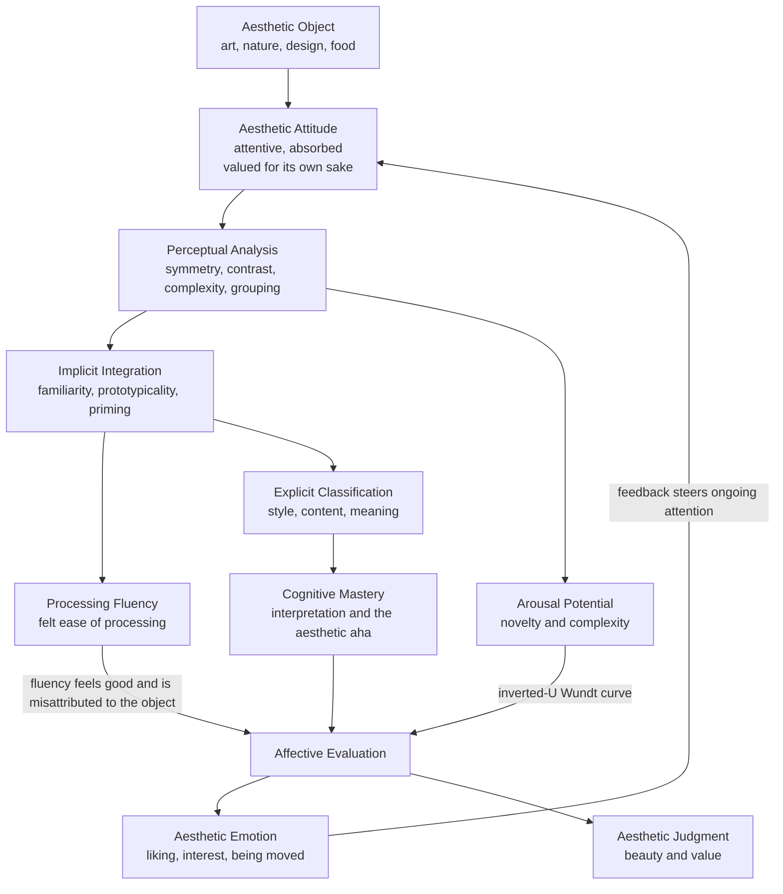

# 🎨 Aesthetic Experience and Perception

> [!abstract] TL;DR
> An **aesthetic experience** is a distinctive *mode of engaging* with an object — attentive, absorbed, and valued **for its own sake** rather than for what it can get you. Two traditions try to explain it: a **philosophical** one that locates the aesthetic in a special *attitude* of **disinterested attention** (Kant, Bullough, Stolnitz), fiercely contested by critics who call that attitude a myth (Dickie); and a **psychological** one that locates it in *how the mind processes the stimulus* — the **processing-fluency** account, where easy-to-process stimuli (symmetric, high-contrast, prototypical, familiar) *feel good*, and that pleasure is **misattributed to the object** as its "beauty." A second force, **interest / novelty** (Silvia), pulls the other way, so aesthetic response is best modelled as a balance of *fluency-driven beauty* and *arousal-driven interest*.

---

## Intuition

**Analogy:** You step into a gallery meaning to glance and move on, but one painting stops you. Minutes pass without your noticing. You are not asking *what is this worth*, or *can I use it*, or *is it true* — you are simply *held* by the way it looks, letting your attention move over it for no reason beyond the looking itself. When you finally step back, you feel you have *been somewhere*. That suspended, self-justifying absorption — attention paid to an object purely for the quality of attending to it — is the core phenomenon aesthetics tries to explain.

Notice what is doing the work in that story: not the object alone and not your mind alone, but a *stance* you took toward the object and a *processing* your perceptual system ran on it. The whole field lives in the gap between those two descriptions — one framed as a chosen **attitude**, the other as automatic **perception** — and the modern synthesis is that the felt "specialness" of the experience is largely your own processing being read back off the canvas.

---

## How It Works

### What makes an experience "aesthetic"

An experience is aesthetic not because of *what* it is about (art, a sunset, a well-plated dish, a proof) but because of *how* it is undergone. Four features recur across accounts:

1. **Attentive** — attention is directed at the object's perceptible, formal, and expressive qualities themselves, not at what they signify or provide.
2. **Absorbed** — the experience is engrossing; self-consciousness and clock-time recede.
3. **Autotelic (valued for its own sake)** — the engagement is its own reward; you are not looking *in order to* do anything else.
4. **Unified and complete** — Monroe **Beardsley** argued aesthetic experiences have a felt *coherence, intensity, and completeness*: the parts hang together, the affect is heightened, and the episode feels finished, like a resolved chord.

### The aesthetic-attitude tradition

The philosophical mainstream long held that aesthetic experience is produced by adopting a special **attitude**:

- **Kant** (1790) — the pure **judgment of taste** is *disinterested*: it takes pleasure in an object's form **without desire to possess, use, or conceptually pin it down**. Because it is not grounded in personal interest, Kant argued, it claims a peculiar *universality* ("this is beautiful" implicitly demands others agree).
- **Bullough** (1912) — **"psychical distance."** We put the object at a psychological arm's length: close enough to feel it, far enough not to react practically. Fog at sea is terrifying to the sailor but sublime to the passenger who *distances* the danger. Too little distance (real fear) or too much (cold detachment) both destroy the aesthetic; the art is to be **"distanced" yet gripped**.
- **Stolnitz** (1960) — codified the **"aesthetic attitude"** as *disinterested and sympathetic attention to and contemplation of any object of awareness whatever, for its own sake alone.*

### The critique: "the myth of the aesthetic attitude"

George **Dickie** (1964) attacked the whole tradition. There is no special *act* of "disinterested attention," he argued — only attention, sometimes to different things. "Distancing" is not a mental operation you perform; it is just *paying attention to the play instead of to your own worries*. The word "disinterested" describes a **motive** (not seeking personal gain), not a distinct **mode of perceiving**. On this deflationary view, aesthetic experience is ordinary perception and cognition, differing only in what it attends to and why — which cleared the ground for **psychological** rather than metaphysical explanations.

### The psychological turn: processing fluency

The most influential empirical account is **processing fluency** (Reber, Winkielman, Schwarz, 2004). Its logic:

1. **Fluency is the felt ease of processing** a stimulus — how quickly and smoothly the mind can encode, organize, and identify it.
2. **Fluency is hedonically marked**: fluent processing produces a faint, immediate **positive affect** (Winkielman & Cacioppo's "hedonic marking of fluency" — high fluency even nudges the smiling *zygomaticus* muscle).
3. **This pleasure is misattributed** to the *source* the perceiver is focused on — the object — and experienced as *its* property: **beauty**. This is the **fluency-attribution** step: the good feeling is about your processing, but it is *read off the canvas*.
4. Therefore anything that **raises fluency raises liking**: **symmetry** (redundant halves are cheap to encode), **good contrast / figure-ground clarity**, **prototypicality** (an average, typical exemplar is easy to categorize — "beauty in averageness"), **familiarity / prior exposure** (the mere-exposure effect), and **priming**.

### The counter-force: interest and novelty (the pleasure-interest duality)

If fluency were the whole story, the most beautiful thing would be the blandest, most familiar, most symmetric — and it is not. Paul **Silvia** stresses a *second* aesthetic emotion, **interest**, driven not by ease but by **novelty, complexity, and the challenge of making sense**. Interest is appraised when something is **novel/complex** *and* **comprehensible** (you judge you *can* cope with it). This mirrors **Berlyne's** older psychobiology: **collative variables** (novelty, complexity, surprise) raise **arousal potential**, and hedonic value follows an **inverted-U "Wundt curve"** — moderate arousal is pleasurable, too little is boring, too much is aversive. So:

- **Fluency / beauty** — the pleasure of *easy* processing.
- **Novelty / interest** — the reward of *effortful mastery* of something new.

Aesthetic response is the **resolution of these two forces**, and their reconciliation is the **"aesthetic aha"**: when a difficult, disfluent stimulus suddenly *clicks*, the **gain in fluency** is itself a spike of pleasure — you master complexity and feel it as the object's depth.

### The information-processing model (Leder et al.)

**Leder, Belke, Oeberst & Augustin (2004)** stitched these pieces into a stage model of **aesthetic appreciation and judgment**: perceptual analysis (symmetry, contrast, complexity, grouping) → implicit memory integration (familiarity, prototypicality) → explicit classification (style, content) → **cognitive mastery** (interpretation, the aha) → evaluation. The output is *dual*: an **aesthetic emotion** (how it feels) **and** an **aesthetic judgment** (its stated value), with continuous affective feedback steering ongoing attention.



---

## Key Concepts

### Secondary (school-level intuition)

- **Aesthetic experience** — really *looking at* something for its own sake, not for what it can do for you.
- **Disinterested** here does **not** mean *bored*; it means *no personal stake* — you are not judging whether you can eat it, sell it, or use it.
- **Fluency** — some things are just *easy on the eye* (a balanced logo, a clear photo), and easy-on-the-eye tends to read as *pretty*.
- **The other side** — but too-easy is boring; a bit of **novelty** makes things *interesting*. Beauty and interest are two different pleasures.
- **The aha** — the delight when a puzzling picture, poem, or song suddenly *makes sense*.

### Undergraduate (aesthetics and psychology depth)

- **The aesthetic-attitude tradition** — Kant's *disinterested* judgment of taste and its claim to universality; Bullough's **psychical distance**; Stolnitz's disinterested-sympathetic attention.
- **Dickie's critique** — **"the myth of the aesthetic attitude"**: there is no special act of attending, only attention; "distancing" is just attending to different things.
- **Beardsley's criteria** — aesthetic experience as **unified, intense, and complete** (coherence, heightened affect, felt completeness).
- **Processing-fluency theory** — fluency is hedonically marked and **misattributed** to the stimulus; symmetry, contrast, prototypicality, and familiarity raise both fluency and liking.
- **Pleasure-interest duality (Silvia)** — beauty from fluency vs interest from novelty/complexity-that-is-comprehensible.
- **Flow and absorption (Csikszentmihalyi)** — the autotelic, self-forgetting quality of deep aesthetic engagement is a species of **flow**.
- **Liking vs interest vs being moved** — three dissociable responses: *liking* (positive, fluency-linked), *interest* (novelty-linked, can accompany displeasure), and *being moved / kama muta* (a warm, tearful "moving" response tied to significance and connection).

### Graduate (theoretical and computational view)

- **Fluency as prediction-error minimization** — a predictive-processing reading: fluent processing = low prediction error; the *hedonic* signal may track the **rate of error reduction** (learning progress), which formalizes why the *aha* (a sudden drop in surprise) is pleasurable rather than mere low surprise.
- **Berlyne's arousal-potential model** — collative variables → arousal potential → inverted-U hedonic value; fluency accounts refine *why* the curve bends where it does.
- **Averageness / prototype effects** — morphed composite faces are rated more attractive; prototypicality is a fluency cue, connecting aesthetics to **categorization** and typicality gradients.
- **Embodied and enactive aesthetics** — appreciation is not disembodied contemplation: **embodied simulation** (motor resonance, "feeling" a brushstroke or a dancer's effort) and **sensorimotor contingencies** shape the experience; beauty is *enacted*, not merely inspected.
- **Everyday aesthetics** — the aesthetic is not confined to art or museums: nature, food, sport, gardens, interfaces, and craft all afford aesthetic experience (Saito, Leddy), pressing on the art-centred assumptions of classical theory.
- **Open problems** — the *disinterestedness* debate (real mode vs mere motive), individual differences and expertise (experts prize novelty/complexity more), and whether "aesthetic emotion" is a natural kind or a heterogeneous cluster.

---

## Python Demo

We simulate the **processing-fluency theory of aesthetic pleasure**. First we map stimulus features (symmetry, contrast, prototypicality, familiarity) to a **fluency** score. Then we combine fluency with **arousal potential** (novelty/complexity, following Berlyne's inverted-U) into a **predicted-liking surface**. Finally we model the **aesthetic aha / fluency-attribution** account: felt pleasure tracks not just the *level* of fluency but the *gain* in fluency at the moment comprehension clicks.

```python
# Processing-fluency theory of aesthetic pleasure (numpy + matplotlib only).
import numpy as np
import matplotlib.pyplot as plt

# ----------------------------------------------------------------------
# 1. FLUENCY FROM STIMULUS FEATURES
#    Symmetry, contrast, prototypicality, and familiarity each make a
#    stimulus EASIER to process. Fluency is a weighted, squashed blend.
# ----------------------------------------------------------------------
feature_names = ["symmetry", "contrast", "prototypicality", "familiarity"]
weights = np.array([0.30, 0.20, 0.28, 0.22])   # relative pull on fluency

def fluency(features):
    """Feature vector in [0,1]^4 -> fluency in [0,1]."""
    raw = np.dot(weights, features)
    return 1.0 / (1.0 + np.exp(-6.0 * (raw - 0.5)))   # logistic squash

stimuli = {
    "symmetric logo":    [0.95, 0.85, 0.90, 0.80],
    "typical face":      [0.80, 0.60, 0.85, 0.70],
    "abstract painting": [0.30, 0.55, 0.20, 0.25],
    "noisy texture":     [0.15, 0.20, 0.10, 0.15],
}
print("Fluency of example stimuli (higher = easier to process):")
for name, feats in stimuli.items():
    print(f"  {name:18s} fluency = {fluency(np.array(feats)):.3f}")

# ----------------------------------------------------------------------
# 2. PREDICTED-LIKING SURFACE OVER FLUENCY x AROUSAL
#    - Fluency is hedonically positive and MISATTRIBUTED to the object.
#    - Arousal potential (novelty/complexity) -> inverted-U Wundt curve.
#    - Interaction: fluent mastery of a NOVEL stimulus pays a bonus (aha).
# ----------------------------------------------------------------------
def wundt(A):
    """Berlyne inverted-U: hedonic value vs arousal potential."""
    reward     = 1.0 / (1.0 + np.exp(-9.0 * (A - 0.35)))
    punishment = 1.3 / (1.0 + np.exp(-9.0 * (A - 0.70)))
    return reward - punishment

def predicted_liking(F, A):
    fluency_pleasure = 1.1 * F        # beauty from ease of processing
    interest         = wundt(A)       # interest from arousal potential
    mastery_bonus    = 0.8 * F * A    # aesthetic aha: fluent mastery of novelty
    return fluency_pleasure + interest + mastery_bonus

F = np.linspace(0, 1, 200)
A = np.linspace(0, 1, 200)
FF, AA = np.meshgrid(F, A)
L = predicted_liking(FF, AA)

# ----------------------------------------------------------------------
# 3. THE AESTHETIC AHA / FLUENCY-ATTRIBUTION OVER TIME
#    A difficult stimulus starts DISFLUENT; comprehension builds along a
#    logistic "insight" curve. Felt pleasure = level term (current fluency)
#    + change term (rate of fluency gain). The spike in dF/dt at the click
#    is the "aha" -- unlabeled, it is attributed to the artwork's depth.
# ----------------------------------------------------------------------
t   = np.linspace(0, 10, 400)
F_t = 1.0 / (1.0 + np.exp(-1.8 * (t - 5.0)))   # comprehension builds, then clicks
dF  = np.gradient(F_t, t)                       # rate of fluency gain
aha_pleasure = 0.5 * F_t + 3.0 * dF             # level + change (attribution)

# ----------------------------------------------------------------------
# PLOTS
# ----------------------------------------------------------------------
fig, (ax1, ax2) = plt.subplots(1, 2, figsize=(13, 5.2))

cf = ax1.contourf(FF, AA, L, levels=20, cmap="magma")
fig.colorbar(cf, ax=ax1, label="predicted liking")
imax = np.unravel_index(np.argmax(L), L.shape)
ax1.plot(FF[imax], AA[imax], "o", color="cyan", ms=11, label="peak liking")
ax1.set_xlabel("processing fluency  F")
ax1.set_ylabel("arousal potential  A  (novelty / complexity)")
ax1.set_title("Predicted aesthetic-liking surface")
ax1.legend(loc="upper left")

ax2.plot(t, F_t, color="#4a9eff", lw=2.0, label="fluency  F(t)")
ax2.plot(t, aha_pleasure, color="#7c3aed", lw=2.6, label="felt pleasure")
t_aha = t[np.argmax(dF)]
ax2.axvline(t_aha, color="gray", ls="--", lw=1.3)
ax2.annotate("aesthetic aha", xy=(t_aha, np.max(aha_pleasure)),
             xytext=(t_aha + 0.7, np.max(aha_pleasure) * 0.78),
             arrowprops=dict(arrowstyle="->"))
ax2.set_xlabel("processing time")
ax2.set_ylabel("magnitude")
ax2.set_title("Aesthetic aha: pleasure tracks the GAIN in fluency")
ax2.legend(loc="center right")

plt.tight_layout()
plt.savefig("aesthetic_fluency.png", dpi=120)
plt.show()
```

**What to notice:** In the *left* panel, liking is highest not in the pure-fluency corner (bottom-right) nor the pure-novelty corner (top-left), but along a **ridge** where high fluency *meets* substantial arousal potential — the sweet spot where you understand a rich, novel object. That ridge is the geometric form of the **beauty-plus-interest** duality. In the *right* panel, the purple pleasure curve **spikes at the instant of comprehension** even though fluency itself only rises smoothly: the pleasure tracks *dF/dt*, the **learning-progress / aha** signal, and because that spike carries no label it is felt *as a property of the artwork* — the fluency-attribution step made visible.

---

## Real-World Applications

- **Design and branding** — logos, typography, and UI trade on fluency: symmetry, high figure-ground contrast, and prototypical layouts read as "clean" and trustworthy. The **mere-exposure effect** is why brands rerun the same mark until familiarity becomes preference.
- **Marketing and pricing** — fluent product names, round numbers, and easy-to-pronounce tickers are judged more favourably and even trade at a premium; disfluent fonts, conversely, can *increase* perceived effort and value for luxury or "craft" positioning.
- **Museums and curation** — labels, lighting, and sequencing manage the **novelty-fluency balance**: enough interpretation to make a challenging work *masterable* (enabling the aha) without over-explaining it into boredom.
- **Music and film** — hooks exploit fluency through repetition and expectation, while tension-and-resolution structures engineer serial **ahas**; too predictable is dull, too chaotic is aversive — composers ride the Wundt curve.
- **Everyday aesthetics** — plating in fine dining, garden design, and the "satisfying" symmetry of well-organized spaces are aesthetic experiences without any art object, exactly as the everyday-aesthetics program insists.
- **Generative and computational art** — fluency and novelty metrics are used to steer models toward outputs that are *neither* clichéd *nor* incoherent, operationalizing the beauty-interest trade-off.

---

## Common Pitfalls

- **Reading "disinterested" as "uninterested."** Kantian disinterest means *no personal stake in the object's existence or use*, not lack of engagement — an aesthetic experience can be intensely absorbing. Confusing the two makes the whole tradition sound like advocacy of boredom.
- **Assuming fluency alone explains beauty.** Pure fluency predicts that the blandest, most average, most familiar stimulus is most beautiful, which is false. Without the **interest/novelty** counter-force you cannot explain why difficult art is prized or why over-exposure breeds contempt.
- **Treating the fluency-pleasure link as unconditional.** Fluency only feels good when it is **unexpected or unattributed**; if perceivers are told *why* something is easy (it was primed, it is high-contrast), the effect can vanish or reverse. The pleasure depends on the **misattribution**.
- **Collapsing liking, interest, and being moved.** They dissociate: you can be *interested* in something you dislike, *moved* by something you would not call beautiful, and *like* something that bores you. Using "liking" as a proxy for all aesthetic response flattens the phenomenon.
- **Art-centrism.** Building a theory only on paintings and symphonies smuggles in assumptions (framing, institutional context) that fail for nature, food, and design — the everyday-aesthetics critique.
- **Mistaking the model for the metaphysics.** A processing account explains the *psychology* of the response; it does not by itself settle whether beauty is *objective*. Dickie's deflation of the attitude is not automatically a verdict on the value question.

---

## Related Concepts

- [[Theories_of_Perception]] — the perceptual machinery (bottom-up features, Gestalt grouping, top-down priors) whose *ease of operation* is exactly what "processing fluency" measures.
- [[Predictive_Processing_and_Free_Energy]] — recasts fluency as low prediction error and the aesthetic *aha* as a rapid *reduction* of error, giving a computational basis for the pleasure of "getting it."
- [[Attention_and_Focus_in_Learning]] — the absorbed, self-forgetting attention of aesthetic experience is a form of **flow** (Csikszentmihalyi), where challenge and skill are matched.
- [[Emotion_and_Cognition]] — grounds the dissociations between *liking*, *interest*, and *being moved*, and how appraisal shapes the affective side of aesthetic response.
- [[Emotion_Theories]] — arousal and appraisal accounts that underpin Berlyne's inverted-U and Silvia's appraisal structure of interest.
- [[Kant_and_the_Copernican_Turn]] — Kant's broader critical philosophy, whose *Critique of the Power of Judgment* originates the disinterested, subjectively-universal judgment of taste.
- [[Sensation_and_Perception]] — the psychology-level foundation (transduction, thresholds, organization) on which any account of aesthetic *perception* is built.

---

## Review Questions

1. **(Conceptual)** Explain the **fluency-attribution** step in processing-fluency theory. Why is it essential that the perceiver be *unaware* of the true source of their good feeling for the effect to produce a judgment of "beauty"? What happens to the effect when the source is made explicit?
2. **(Scenario)** A gallery is deciding how much interpretive text to place beside a difficult abstract work. Using the **beauty-interest duality** and the **aesthetic-aha** idea, argue what happens to visitor liking if they provide *no* explanation versus a *complete* explanation, and describe the intermediate strategy that maximizes engagement. Tie your answer to the shape of the predicted-liking surface.
3. **(Trade-off / critique)** Dickie argues the "aesthetic attitude" is a myth — mere attention, not a special mode of perceiving. Does the **success of processing-fluency theory** support Dickie's deflation, or could a defender of disinterestedness accommodate the fluency findings? State the strongest version of each side.

---

## Sources

- Reber, R., Schwarz, N., & Winkielman, P. (2004). "Processing Fluency and Aesthetic Pleasure: Is Beauty in the Perceiver's Processing Experience?" *Personality and Social Psychology Review*, 8(4), 364–382.
- Leder, H., Belke, B., Oeberst, A., & Augustin, D. (2004). "A model of aesthetic appreciation and aesthetic judgments." *British Journal of Psychology*, 95(4), 489–508.
- Silvia, P. J. (2005). "Emotional Responses to Art: From Collation and Arousal to Cognition and Emotion." *Review of General Psychology*, 9(4), 342–357.
- Dickie, G. (1964). "The Myth of the Aesthetic Attitude." *American Philosophical Quarterly*, 1(1), 56–65.
- Bullough, E. (1912). "'Psychical Distance' as a Factor in Art and an Aesthetic Principle." *British Journal of Psychology*, 5, 87–118.
- Berlyne, D. E. (1971). *Aesthetics and Psychobiology*. Appleton-Century-Crofts.
- Csikszentmihalyi, M. (1990). *Flow: The Psychology of Optimal Experience*. Harper & Row.

---

#aesthetics #aesthetic-experience #processing-fluency #perception #disinterestedness
