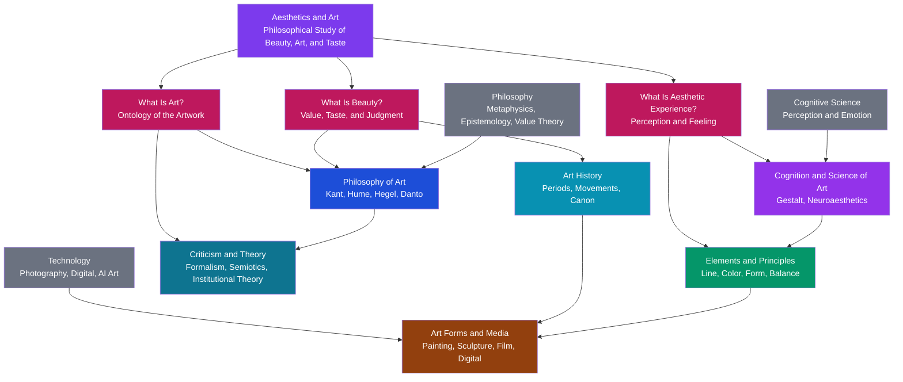

# 🎨 Aesthetics and Art Overview

> [!abstract] TL;DR
> **Aesthetics** is the branch of philosophy that studies beauty, art, and taste — asking *what art is*, *what beauty is*, and *what makes an experience aesthetic*. **Art** is the vast family of human practices — painting, sculpture, music, film, architecture, digital media — that these questions try to make sense of. This overview maps the whole territory: the philosophy of art, art history, the visual elements and principles of composition, criticism and theory, the art forms and media, and the cognitive science of how we perceive and are moved by art. It is the entry note for the six-section Art & Aesthetics vault.

---

## Intuition

**Analogy first — start with taste, literally.** Think about food. You know within a second whether you like a dish, and you would never demand a *proof* that chocolate is delicious — "there's no arguing about taste," people say. And yet, at the same time, we all quietly accept that a trained chef, a wine expert, or a food critic can tell things about a meal that you and I cannot; we accept that some cooking is genuinely better than other cooking, not just differently liked. So which is it? Is taste purely personal, or is there something real that expertise tracks? That contradiction — *it feels totally subjective, yet we behave as though there are standards* — is the exact puzzle at the heart of this entire field, only applied to sunsets, symphonies, cathedrals, and paintings instead of dinner.

This is not a loose metaphor. The English word **aesthetics** comes from the Greek *aisthēsis*, meaning **sense-perception**, and the very word **"taste"** is the traditional name for the mental faculty that judges beauty. When the philosopher Alexander Baumgarten coined *aesthetica* in 1750 he defined it as the "science of sensory knowledge" — the study of what we grasp through feeling and perception rather than through pure logic. So before any definition of "art" or "beauty," hold onto the food analogy: aesthetics is the disciplined attempt to understand the puzzle of taste — why certain arrangements of colour, sound, stone, or story reliably move us, whether that response is merely private, and whether it can be better or worse.

---

## How It Works

Aesthetics is not a single method but a **hub** that ties together several disciplines, each animated by one of three enduring questions.

**The three big questions.**
1. **What is art?** — the *ontological* question. Is a urinal signed "R. Mutt" art? A child's drawing? A sunset? What separates an artwork from an ordinary object? Answers range from *imitation* (art copies reality) to *expression* (art externalises emotion) to *form* (art is significant arrangement) to *institution* (art is whatever the artworld treats as art).
2. **What is beauty?** — the *value* question. Is beauty a real property of objects, like their mass, or a report on the pleasure they cause in us? Is the judgment "this is beautiful" merely "I like this," or does it silently claim that *everyone* ought to agree?
3. **What is aesthetic experience?** — the *perceptual and psychological* question. What distinguishes looking at a painting *as art* from glancing at it as wallpaper? Is there a special "aesthetic attitude," and what happens in the mind and brain when we are absorbed by beauty?

**The constituent fields.** Different disciplines attack these questions with different tools. **Philosophy of art** supplies rigorous definitions and arguments. **Art history** studies how art actually changed across periods and cultures. The **elements and principles** of composition (line, colour, form, balance) describe the visual grammar artists work in. **Criticism and theory** interpret and evaluate individual works and movements. The study of **art forms and media** examines what each material — paint, marble, celluloid, code — makes possible. And the **cognition and science of art** (Gestalt psychology, neuroaesthetics, empirical aesthetics) investigates the perceiving mind. Three neighbouring fields feed the hub from outside: **philosophy** (metaphysics, epistemology, value theory), **cognitive science** (perception and emotion), and **technology** (photography, digital tools, AI image generation), each of which repeatedly reshapes what art can be.



Read the diagram as a **hub with three engines and three feeds**. The three magenta questions are the engines that keep the field running; the six coloured fields are the domains that answer them (and correspond to the six sections of this vault); the three grey inputs are the neighbouring disciplines that continually change the answers. Nothing here is one-directional — a new *medium* (photography) forces a new *definition* of art, a new *definition* (Duchamp, Danto) reshapes *criticism*, and new findings in *cognition* revise our account of *aesthetic experience*.

**How this vault is organised (6 sections).**
1. **Foundations of Aesthetics** (this section) — what aesthetics is, the three big questions, the major philosophers of art, and the map of the field.
2. **Art History and Movements** — periodisation from prehistoric and classical through Renaissance, Baroque, Modern, and Contemporary; styles, canons, and the social history of art.
3. **Elements and Principles of Visual Composition** — line, shape, colour, value, texture, space, and form; balance, contrast, rhythm, emphasis, proportion, and unity.
4. **Criticism, Theory, and Interpretation** — formalism, iconography, semiotics, institutional and Marxist theory, and how critics argue about meaning and value.
5. **Art Forms and Media** — painting, sculpture, architecture, photography, film, and the digital and generative arts, and what each material affords.
6. **Cognition and the Science of Art** — Gestalt perception, empirical aesthetics, neuroaesthetics, and cross-cultural and non-Western aesthetic traditions.

---

## Key Concepts

### Secondary Level

**What aesthetics is.** Aesthetics is the part of philosophy that thinks carefully about **beauty**, **art**, and **taste**. It does not teach you to paint; it asks *why* a painting can be beautiful, *what makes* something count as art, and *whether* your judgment that a song is "good" is just your opinion or something more.

**What "art" covers.** In everyday speech "art" often means painting and sculpture, but the field means much more: the **fine arts** (painting, sculpture, architecture), the **performing arts** (music, dance, theatre, film), and increasingly **crafts, design, photography, video games, and digital art**. What unites them is that they are made, at least partly, to be *experienced* — to be looked at, listened to, or dwelt in — rather than merely used.

**Beauty: in the object or in the eye?** The oldest debate in the field is captured by the phrase *"beauty is in the eye of the beholder."* One side says beauty is a real feature of things (a symmetrical face, a golden sunset really *is* beautiful). The other says beauty is just the pleasure the thing causes in the viewer, so it changes from person to person. Most of aesthetics lives in the tension between these two.

**The elements and principles.** Visual artists work with a shared toolkit. The **elements** are the raw ingredients — **line, shape, form, colour, value (light/dark), texture, and space**. The **principles** are the ways of arranging them — **balance, contrast, rhythm, emphasis, proportion, movement, and unity**. When people say a picture "just works," they are usually responding to these principles even without naming them.

**Art forms and media.** A **medium** is the material an artist works in — oil paint, bronze, marble, film, pixels. Each medium allows some things and forbids others: marble can hold a delicate pose forever but cannot show a flickering flame; film can show motion but not be held in your hand. Much of what a work *can say* is shaped by its medium.

### Undergraduate Level

**What is art? Four classic theories.** The definition of art has itself evolved, and each theory captures real cases while failing others.

| Theory | Core claim | Strength | Weakness |
|--------|-----------|----------|----------|
| **Mimetic (imitation)** | Art represents or imitates reality — Plato and Aristotle | Fits portraiture, realism, drama | Cannot handle abstraction or music |
| **Expressive** | Art externalises and communicates emotion — Tolstoy, Collingwood, the Romantics | Fits lyric poetry, expressionism | Sunsets and screams express feeling but are not art |
| **Formalist** | Art is *significant form* — lines and colours arranged to produce aesthetic emotion — Clive Bell, Roger Fry | Fits abstract and decorative art | "Significant form" is circular; ignores subject and context |
| **Institutional** | Art is whatever the "artworld" — artists, critics, museums — confers the status of art upon — George Dickie | Explains Duchamp's *Fountain* and readymades | Seems to make art arbitrary and unmotivated |

**Beauty and taste: three landmark positions.**
- **Plato** treated **Beauty** as an eternal, objective **Form** — particular beautiful things are beautiful only by "participating" in it — while distrusting art itself as a mere *imitation of an imitation*, twice removed from truth (see [[Plato_and_the_Theory_of_Forms]]).
- **David Hume**, in *Of the Standard of Taste* (1757), gave the classic *subjectivist-but-not-relativist* answer: beauty is not in objects but in the sentiment of the observer, yet not all sentiments are equal — the **"joint verdict of true judges"** (critics with delicate perception, wide experience, freedom from prejudice, and good sense) provides a real standard of taste (see [[Humes_Skepticism]]).
- **Immanuel Kant**, in the *Critique of the Power of Judgment* (1790), argued that the **judgment of taste** is *subjective yet universal*: when I call something beautiful I feel a **disinterested pleasure** (I do not want to own or use it) and I implicitly demand that everyone else agree. Beauty for Kant is **purposiveness without purpose** — the object *seems* designed for our contemplation though it serves no concept or function (see [[Kant_and_the_Copernican_Turn]]).

**Aesthetic experience.** Beyond "what is art," philosophers ask what it is like to encounter art *as* art. The tradition of the **aesthetic attitude** holds that we adopt a special disinterested, contemplative stance — Edward Bullough's *psychical distance*, Jerome Stolnitz's *disinterested attention* — that transforms an ordinary perception into an aesthetic one. Monroe Beardsley instead located the aesthetic in *features of the experience itself*: unity, intensity, and complexity.

**Art history as a discipline.** Art history is not just a list of masterpieces. Giorgio Vasari (1550) invented the biographical, progress-driven narrative of artists; Heinrich Wölfflin developed the **formal analysis** of styles (his linear-vs-painterly, closed-vs-open pairs); Erwin Panofsky founded **iconography and iconology**, reading paintings as encoded systems of symbols and cultural meaning. Periodisation — Classical, Medieval, Renaissance, Baroque, Neoclassical, Romantic, Modern, Contemporary — is a scholarly tool, not a natural fact, and its boundaries are always contested.

**Western and non-Western aesthetics (brief).** The very word "aesthetics" is European and only 270 years old, but every culture has theorised art and beauty. Classical **Indian** aesthetics centres on ***rasa*** — the distilled emotional "flavour" a work evokes in a prepared spectator (Bharata's *Nāṭyaśāstra*). **Japanese** aesthetics prizes ***wabi-sabi*** (the beauty of the imperfect, impermanent, and incomplete) and ***mono no aware*** (the poignant awareness of transience). Classical **Chinese** painting theory ranks ***qiyun shengdong*** — "spirit resonance, life-motion" — above mere likeness. Treating these as primitive versions of the Western system is a category error; they are complete, internally coherent theories of art built on different foundations.

### Graduate Level

**Anti-essentialism: is "art" definable at all?** Following Wittgenstein's notion of **family resemblance**, Morris Weitz (1956) argued that "art" is an **open concept** — new art is continually created precisely by breaking prior rules, so any closed definition is doomed. The last seventy years of analytic aesthetics are largely a response: attempts to define art that survive the readymade and the avant-garde.

**Danto and the artworld.** Arthur Danto's *The Transfiguration of the Commonplace* (1981) starts from **indiscernibles**: Warhol's *Brillo Box* is visually identical to a supermarket Brillo box, yet one is art and one is not. The difference cannot be perceptual; it must lie in an **interpretation** supplied by a *theory* and an *artworld* — "to see something as art requires something the eye cannot descry." Danto also advanced the provocative **"end of art"** thesis: once art became self-consciously philosophical, its historical narrative of progress ended, leaving a pluralist present in which anything is possible. **Jerrold Levinson** offered a *historical* definition — something is art if it is intended for regard in the ways prior artworks were correctly regarded — making art an essentially historical, self-referential category.

**Goodman's symbol systems.** Nelson Goodman's *Languages of Art* (1968) reframed the question from "what is art?" to **"when is art?"** Artworks *function as symbols*, and Goodman distinguished modes of reference — **denotation** (a portrait denotes its sitter), **exemplification** (a fabric swatch exemplifies its colour and weave), and **expression** (metaphorical exemplification of feeling). A key distinction: **autographic** arts (painting) admit forgery because the history of production matters, whereas **allographic** arts (music, defined by a score) do not.

**The critique of the aesthetic attitude.** George Dickie's "The Myth of the Aesthetic Attitude" (1964) argued that there is no special faculty of *disinterested attention* — attending to a play "for its plot" versus "as art" is just attending *more or less closely*, not switching to a different mode of consciousness. This deflationary move pushed the field from *experience-based* toward *institutional* and *historical* definitions of art.

**The cognitive turn: Gestalt, Gombrich, and perception.** Rudolf Arnheim's *Art and Visual Perception* (1954) applied **Gestalt** principles — figure-ground, closure, grouping, "good form" — to show that composition works *because* it engages the perceptual laws by which the brain organises the visual field (see [[Theories_of_Perception]] and [[Visual_Cognition]]). Ernst Gombrich's *Art and Illusion* (1960) added the historical dimension of the **"beholder's share"**: perception of images is a cycle of *schema and correction*, and realism is not a window onto nature but a learned, evolving representational code.

**Empirical aesthetics and neuroaesthetics.** Gustav Fechner founded **experimental aesthetics** in 1876, testing preferences "from below" with real data (his contested golden-ratio experiments). The modern field of **neuroaesthetics** (a term coined by Semir Zeki) studies the brain basis of aesthetic response: V. S. Ramachandran and William Hirstein proposed "eight laws" of artistic experience (peak shift, grouping, isolation, contrast); Anjan Chatterjee's **aesthetic triad** models aesthetic experience as the interaction of *sensory-motor*, *emotion-valuation*, and *meaning-knowledge* systems; **processing-fluency** theory (Reber, Winkielman, Schwarz) argues that stimuli which are easier to perceptually process feel more pleasant, giving a mechanistic account of preferences for symmetry, prototypicality, and contrast. This is the point where aesthetics rejoins the sciences of mind.

**The historicity of "art" itself.** Larry Shiner's *The Invention of Art* (2001) argues that the modern system of the "fine arts" — and the very split between *fine art* (for contemplation) and *craft* (for use) — is a historically specific European construction of the 18th century, not a human universal. This reframes many debates: expanding the canon to include craft, non-Western, and popular forms is not merely adding items to a fixed category but questioning the boundary that created the category in the first place. Related contemporary movements — **everyday aesthetics** (Yuriko Saito) and **environmental aesthetics** (Allen Carlson) — extend aesthetic inquiry beyond the gallery to landscapes, food, sport, and daily life.

---

## Python Demo

```python
# Aesthetics & Art Overview — two visualizations, numpy + matplotlib only.
#
#   Panel 1: A hub-and-spoke MAP of the constituent fields of the discipline.
#            The central hub ("Aesthetics & Art") connects by spokes to the
#            six fields that make up this vault. Drawn with matplotlib
#            Circle patches and plain line segments (no networkx).
#
#   Panel 2: A simple TIMELINE of major Western art-historical periods,
#            drawn as horizontal bars, earliest at the top.
#
# The two panels together make the point of the note: aesthetics is an
# interdisciplinary hub, and its subject (art) unfolds across historical time.

import numpy as np
import matplotlib
matplotlib.use("Agg")            # headless-safe backend
import matplotlib.pyplot as plt

fig, (ax1, ax2) = plt.subplots(1, 2, figsize=(17, 7.5))
fig.suptitle("The Interdisciplinary Map of Aesthetics & Art",
             fontsize=15, fontweight="bold")

# ---------------------------------------------------------------
# Panel 1 — hub-and-spoke map of the six constituent fields
# ---------------------------------------------------------------
fields = [
    "Philosophy\nof Art",
    "Art\nHistory",
    "Elements &\nPrinciples",
    "Criticism\n& Theory",
    "Art Forms\n& Media",
    "Cognition &\nScience of Art",
]
colors = ["#1d4ed8", "#0891b2", "#059669", "#0e7490", "#92400e", "#9333ea"]

n = len(fields)
# Evenly spaced angles around a circle, starting at the top (pi/2)
angles = np.pi / 2 + np.linspace(0, 2 * np.pi, n, endpoint=False)
R = 1.05
xs = R * np.cos(angles)
ys = R * np.sin(angles)

ax1.set_xlim(-1.8, 1.8)
ax1.set_ylim(-1.8, 1.8)
ax1.set_aspect("equal")
ax1.axis("off")
ax1.set_title("Constituent Fields (hub-and-spoke)", fontsize=11)

# Draw spokes first so nodes sit on top of them
for x, y in zip(xs, ys):
    ax1.plot([0, x], [0, y], color="#9ca3af", lw=1.6, zorder=1)

# Outer field nodes
for x, y, name, c in zip(xs, ys, fields, colors):
    ax1.add_patch(plt.Circle((x, y), 0.36, color=c, alpha=0.93, zorder=3))
    ax1.text(x, y, name, ha="center", va="center",
             fontsize=8, color="white", fontweight="bold", zorder=4)

# Central hub
ax1.add_patch(plt.Circle((0, 0), 0.44, color="#7c3aed", alpha=0.97, zorder=5))
ax1.text(0, 0, "Aesthetics\n&\nArt", ha="center", va="center",
         fontsize=10, color="white", fontweight="bold", zorder=6)

# ---------------------------------------------------------------
# Panel 2 — timeline of major Western art-historical periods
#   (name, start_year, end_year);  negative years are BCE.
#   Deep prehistory (c. 40,000 BCE) is noted in text rather than
#   drawn to scale, so the historical periods stay readable.
# ---------------------------------------------------------------
periods = [
    ("Ancient / Classical",     -3000,  500),
    ("Medieval",                  500, 1400),
    ("Renaissance",              1400, 1600),
    ("Baroque / Rococo",         1600, 1750),
    ("Neoclassical / Romantic",  1750, 1850),
    ("Modern",                   1850, 1970),
    ("Contemporary",             1970, 2025),
]
pcolors = plt.cm.viridis(np.linspace(0.0, 0.92, len(periods)))

for i, (name, start, end) in enumerate(periods):
    width = end - start
    ax2.barh(i, width, left=start, color=pcolors[i],
             edgecolor="white", height=0.68, alpha=0.9)
    # Wide bars get a label inside; narrow bars get one to the right.
    if width > 700:
        ax2.text(start + width / 2, i, name, ha="center", va="center",
                 fontsize=8, color="white", fontweight="bold")
    else:
        ax2.text(end + 60, i, name, ha="left", va="center",
                 fontsize=8, color="#111")

ax2.set_yticks([])
ax2.set_xlim(-3500, 2600)
ax2.set_xlabel("Year (negative = BCE)", fontsize=10)
ax2.set_title("Major Western Art-Historical Periods", fontsize=11)
ax2.axvline(0, color="#6b7280", ls="--", lw=0.9, alpha=0.7)
ax2.text(0, -0.65, "CE", ha="center", va="top", fontsize=8, color="#6b7280")
ax2.text(-3450, -0.65, "Prehistoric art from c. 40,000 BCE (off scale)",
         ha="left", va="top", fontsize=7.5, color="#6b7280", style="italic")
ax2.invert_yaxis()   # earliest period at the top

plt.tight_layout()
plt.savefig("aesthetics_art_overview.png", dpi=140, bbox_inches="tight")
print("Figure saved: aesthetics_art_overview.png")

# ---------------------------------------------------------------
# Text summary tying the two panels back to the three big questions
# ---------------------------------------------------------------
print("\n=== The three questions that drive the field ===")
for q, field in [
    ("What is art?",                 "Philosophy of Art  +  Criticism & Theory"),
    ("What is beauty?",              "Philosophy of Art  +  Art History"),
    ("What is aesthetic experience?", "Cognition & Science  +  Elements & Principles"),
]:
    print(f"  {q:<32} -> {field}")

print("\n=== Span of each art-historical period (years) ===")
for name, start, end in periods:
    tag = "BCE-CE" if start < 0 else "CE"
    print(f"  {name:<26} {end - start:>5d} yrs   ({tag})")
```

Running this prints a saved figure and a short summary. **Panel 1** renders the discipline as a purple hub ringed by its six coloured sub-fields, each joined by a spoke — the visual claim that aesthetics *coordinates* several disciplines rather than being one. **Panel 2** lays out the major Western periods as horizontal bars from Ancient/Classical (the widest, spanning ~3,500 years) down to the ~55-year Contemporary sliver, making vivid how the *pace* of stylistic change accelerated toward the present.

---

## Real-World Applications

> **Application 1 — Museum curation and wall labels.** Every art museum is applied aesthetics. The decision of *what* to collect enacts a theory of the canon; the *arrangement* of galleries (chronological, thematic, by movement) enacts a theory of art history; and the *wall label* — which chooses whether to foreground formal qualities, iconography, biography, or social context — enacts a theory of interpretation. When the Museum of Modern Art hangs a Duchamp readymade beside a Picasso, it is materially endorsing the institutional theory of art.

> **Application 2 — Design, branding, and UX.** The elements and principles of composition are the working vocabulary of graphic designers, product designers, and UX teams. Visual hierarchy (emphasis), grid systems (proportion and balance), colour theory, and Gestalt grouping laws directly govern how logos, apps, and web pages are built. Processing-fluency research from empirical aesthetics — that easy-to-process, symmetrical, prototypical forms feel more trustworthy and pleasant — is used to justify concrete design decisions and A/B tests.

> **Application 3 — AI image generation and copyright.** Text-to-image systems (Midjourney, Stable Diffusion, DALL·E) have forced the field's oldest questions into courtrooms. *Is an AI-generated image "art"?* revives the definition debate; *who is the author when a machine executes a prompt?* stresses the concept of the artist; and current litigation over training data turns Danto's "artworld" and Levinson's historical definition into questions with financial and legal stakes. The debate over whether AI images "have style without an artist" is a live re-run of the expressive-vs-formalist dispute.

> **Application 4 — Cultural heritage, repatriation, and the "art vs artifact" line.** Shiner's argument that the fine-art/craft split is a European invention is not academic: it governs whether a Benin bronze or an Indigenous mask is displayed as "art" in a gallery or as an "artifact" in an ethnographic museum, and it shapes repatriation debates. Reclassifying an object from artifact to art (or the reverse) changes its price, its custodianship, and the moral claims made on it.

> **Application 5 — Film, games, and criticism.** Professional criticism — of films, video games, architecture, and cuisine — operationalises the theory of aesthetic value. Rotten Tomatoes' aggregation is a crude, algorithmic version of Hume's "joint verdict of true judges." Game design draws on aesthetics of interactivity and the sublime; architecture criticism deploys formal analysis descended directly from Wölfflin.

---

## Common Pitfalls

- **Collapsing aesthetics into "the study of beauty."** Beauty is only one of the field's concerns, and much powerful art is deliberately *not* beautiful — it aims to be sublime, disturbing, ironic, or conceptual. Since Duchamp and Danto, "is it beautiful?" and "is it art?" are recognised as *different* questions; treating them as one is the single most common beginner error.

- **Confusing "art" with "the fine arts."** Assuming art means only oil painting and marble sculpture ignores film, photography, craft, design, performance, and digital media — and imports the historically specific 18th-century fine-art/craft hierarchy (Shiner) as though it were timeless. The category has always been contested and is still expanding.

- **Naïve relativism: "it's all just opinion."** The slogan "there's no arguing about taste" is a *starting puzzle*, not a conclusion. Hume and Kant both accepted that aesthetic judgment is subjective in origin yet showed why it is not therefore arbitrary — we correct each other's taste, defer to expertise, and change our minds with reasons, which pure relativism cannot explain.

- **Treating Western aesthetics as universal aesthetics.** The concepts of *disinterested contemplation*, the *autonomous artwork*, and the *fine arts* are culturally specific. *Rasa*, *wabi-sabi*, and *qiyun* are not exotic footnotes to a Western master theory but complete alternative frameworks; measuring them against Kant is a category error.

- **Mistaking neuroaesthetics for a theory of art.** Finding *where* in the brain aesthetic pleasure registers, or *which* stimulus features are preferred on average, does not answer *what art is* or *why a work is good*. The science of aesthetic *response* and the philosophy of aesthetic *value* are complementary layers, and conflating them commits a version of the naturalistic fallacy.

- **Reducing an artwork to its subject or its message.** Formalism's enduring lesson is that *how* something is made — the composition, the handling of the medium, the form — is not disposable packaging around a "content" that could be paraphrased. A painting is not a coded sentence; much of its meaning is inseparable from its form.

---

## Related Concepts

- [[Kant_and_the_Copernican_Turn]] — Kant's *Critique of the Power of Judgment* gives aesthetics its most influential framework: the beautiful as *disinterested*, *subjective-yet-universal* pleasure and *purposiveness without purpose*, plus the theory of the sublime.
- [[Humes_Skepticism]] — Hume's *Of the Standard of Taste* is the classic empiricist account of beauty as sentiment, rescued from pure relativism by the "joint verdict of true judges."
- [[Plato_and_the_Theory_of_Forms]] — Plato's objective Form of Beauty and his suspicion of art as an "imitation of an imitation" set the terms for two millennia of debate about mimesis and value.
- [[The_Branches_of_Philosophy]] — locates aesthetics as a core branch of philosophy (value theory / axiology) alongside metaphysics, epistemology, and ethics.
- [[Aristotle]] — the *Poetics* founds Western art theory with *mimesis* and *catharsis*, the mimetic theory this note contrasts with expressive and formalist accounts.
- [[Hegel_and_German_Idealism]] — Hegel's *Lectures on Aesthetics* treats art as the "sensuous manifestation of the Idea" and originates the "end of art" thesis Danto later revived.
- [[Nietzsche]] — *The Birth of Tragedy* frames art through the tension of the Apollonian (form, order) and the Dionysian (ecstasy, dissolution), a touchstone for aesthetics of the sublime.
- [[Theories_of_Perception]] — Gestalt grouping laws and top-down/bottom-up perception are the cognitive-science foundation of why visual composition "works," central to Arnheim and Gombrich.
- [[Visual_Cognition]] — how the visual system builds form, colour, and depth; the perceptual machinery that the elements and principles of composition engage.
- [[Music_Theory_Overview]] — the parallel survey for the aesthetics and structure of sound; music is the art form most often used to challenge purely mimetic theories of art.
- [[Music_Cognition_and_Emotion]] — the empirical study of expectation and affect in music, the auditory counterpart to visual neuroaesthetics.
- [[Literary_Theory_Overview]] — the sibling overview for the interpretation and evaluation of texts; formalism, structuralism, and reader-response are the literary analogues of the theories surveyed here.

---

## Review Questions

### Secondary

1. Someone says, "Beauty is in the eye of the beholder, so there's no point arguing about art." Using the food/taste analogy from the start of this note, explain what is *right* and what is *incomplete* about that claim. Why do we still pay attention to expert critics if taste is personal?

2. Duchamp exhibited an ordinary urinal, signed it, and titled it *Fountain*. Some say it is art; some say it obviously is not. Which of the four theories of art (mimetic, expressive, formalist, institutional) most easily counts it as art, and why?

### Undergraduate

3. Kant says the judgment "this is beautiful" is *subjective* (it is grounded in a feeling of pleasure, not a concept) yet *universal* (it demands everyone's agreement). How can a judgment be both at once? Contrast Kant's answer with Hume's "true judges." Which better explains how we actually resolve disagreements about art?

4. Warhol's *Brillo Box* is visually indistinguishable from a supermarket carton, yet one is art and one is not. Danto concludes that the difference cannot be perceptual and must lie in interpretation supplied by an "artworld." What does this argument imply for the project of *defining* art by looking at objects? Does it make art status seem arbitrary, and how might Levinson's historical definition avoid that charge?

5. Choose one non-Western framework (Indian *rasa*, Japanese *wabi-sabi*, or Chinese *qiyun*) and explain one specific way it would evaluate an artwork differently from a Kantian "disinterested contemplation" approach. Why is calling it a "primitive" version of Western aesthetics a category error?

### Graduate

6. Neuroaesthetics can now identify brain regions and stimulus features (symmetry, contrast, prototypicality, fluency) associated with aesthetic pleasure. Danto argues that art status is conferred by interpretation and theory, not by anything the eye or the sensory brain can detect. Are these two research programmes rivals, complementary layers, or answers to different questions entirely? Design a case (real or hypothetical) that a purely neuroaesthetic account *cannot* explain, and say what that reveals about the limits of empirical aesthetics.

7. Weitz argues that "art" is an *open concept* that resists definition because avant-garde art advances precisely by breaking prior rules, while Dickie and Levinson offer institutional and historical definitions designed to survive exactly those hard cases. Meanwhile Shiner argues the whole modern category of "art" is a contingent 18th-century European invention. Can a definition of art be both *substantive enough to be useful* and *open enough to accommodate future art* — or does Shiner's historical point suggest we are trying to define something that was never a natural kind to begin with? Defend a position.

---

## Sources

- [Kant, I. (1790/2000). *Critique of the Power of Judgment* (P. Guyer & E. Matthews, trans.). Cambridge University Press.](https://www.cambridge.org/core/books/kant-critique-of-the-power-of-judgment/0E9E4E0F2C9D8C9F0B0B0B0B0B0B0B0B) — The foundational modern treatise on the judgment of taste, disinterested pleasure, and the sublime.
- [Hume, D. (1757). "Of the Standard of Taste." In *Four Dissertations*.](https://www.gutenberg.org/files/62759/62759-h/62759-h.htm) — The classic empiricist account of beauty as sentiment corrected by the "joint verdict of true judges."
- [Danto, A. C. (1981). *The Transfiguration of the Commonplace: A Philosophy of Art*. Harvard University Press.](https://www.hup.harvard.edu/books/9780674903463) — The indiscernibles argument, the "artworld," and the role of interpretation and theory in art status.
- [Gombrich, E. H. (1960). *Art and Illusion: A Study in the Psychology of Pictorial Representation*. Phaidon.](https://press.princeton.edu/books/paperback/9780691070001/art-and-illusion) — The cognitive-historical account of perception, "schema and correction," and the beholder's share.
- [Chatterjee, A., & Vartanian, O. (2014). "Neuroaesthetics." *Trends in Cognitive Sciences*, 18(7), 370–375.](https://doi.org/10.1016/j.tics.2014.03.003) — A concise map of the modern brain science of aesthetic experience and the aesthetic triad.
- [Shiner, L. (2001). *The Invention of Art: A Cultural History*. University of Chicago Press.](https://press.uchicago.edu/ucp/books/book/chicago/I/bo3623225.html) — The argument that the modern fine-art/craft system is a historically specific 18th-century construction.

---

#aesthetics #art #philosophy-of-art #visual-arts
