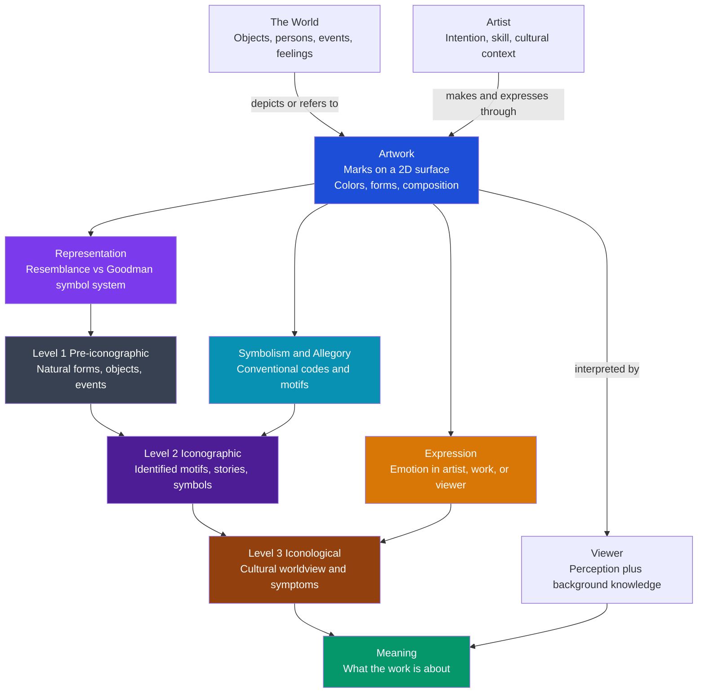

# Art and Meaning

> [!abstract] TL;DR
> "Meaning" in art is not one thing but a stack of distinct problems: how a flat marked surface *refers* to the world (representation — resemblance theory vs Goodman's claim that depiction is a conventional symbol system), how a work *conveys emotion* (expression — is the sadness in the artist, the object, or the aroused viewer?), how images carry *conventional symbols and allegory*, and how a single picture layers "natural" description, culturally coded subject matter, and deep worldview (Panofsky's three levels). Anti-intentionalists say the artist's intention does not fix meaning; contextualists say meaning is unrecoverable without the culture that made it. Even abstract art means — it just means through form, expression, and exemplification rather than depiction.

---

## Intuition

**Analogy:** You and a friend stand in front of the same painting: a woman in a blue robe seated indoors, an angel kneeling before her, a white lily in a vase, a shaft of light from a high window. Your friend, who knows nothing of the tradition, sees *a room, two people, a flower, nice light* — and says "it's peaceful." You recognize it instantly as an Annunciation: the angel is Gabriel, the woman is Mary, the lily signifies her purity, the light is the Holy Spirit entering the world. And an art historian standing behind you sees something neither of you did — that the receding tiled floor, the specific shade of ultramarine reserved for the Virgin, and the domestic setting encode an entire 15th-century worldview about divinity entering ordinary human space. **You are all looking at the identical pigment on the identical panel, yet each of you extracts a different quantity of meaning — because meaning in a picture is not simply *there* on the surface waiting to be seen; it is unlocked by what the viewer brings.**

This is the whole puzzle of art and meaning. The marks on the surface never change. What changes is the interpretive machinery — perceptual, conventional, and cultural — that the viewer applies to them. To ask "how does art mean?" is to ask how a two-dimensional arrangement of colored shapes can be *about* the world, *express* an emotion, *symbolize* an idea, and *reveal* a worldview, and to ask where in the chain from artist to object to viewer that meaning actually lives.

---

## How It Works

Meaning in art decomposes into three overlapping mechanisms — **representation** (how the surface refers to things), **expression** (how the work conveys feeling), and **symbolism** (how it invokes convention) — and these feed the interpretive ladder that Erwin Panofsky formalized as three *levels* of meaning. The artist and the surrounding culture load meaning into the object; the viewer, equipped with more or less background knowledge, unloads it.



The diagram traces meaning from its sources (the world the artwork refers to; the artist who makes and expresses through it) into the physical object, out through its three meaning-bearing mechanisms, up the three Panofsky levels, and finally into the viewer whose interpretation constitutes the realized meaning.

---

## Key Concepts

### Secondary Level

**"Aboutness": the strange fact that a picture refers**

The most basic mystery is *reference*. A patch of blue-grey pigment is, physically, just dried oil and mineral. Yet we see it *as* a sea, and we can be right or wrong about what it depicts. A picture is *about* something — it has what philosophers call **intentionality** or **aboutness**. This is the same property that thoughts and sentences have: your thought about Paris is *directed at* Paris even when you are nowhere near it. Art, like language and like the mind, points beyond itself. Explaining how a mute physical surface acquires this directedness is the core problem of pictorial meaning.

**Depiction versus description**

There are two great families of "aboutness." A *description* refers through language — the word "cat" is about cats by pure convention; nothing about the letters c-a-t resembles a cat. A *depiction* refers through a picture — a drawing of a cat seems to be about cats *because it looks like one*. The central debate is whether that difference is real and deep, or whether depiction is secretly just another convention.

**Resemblance theory** (the natural first answer): a picture depicts X because it *resembles* X. This is intuitive and ancient, but it has famous problems:
- Resemblance is *symmetric* — if the portrait resembles the sitter, the sitter equally resembles the portrait, yet the sitter does not depict the portrait. Depiction has a direction that resemblance lacks.
- Resemblance is *reflexive and cheap* — everything resembles itself most of all, and any two things resemble each other in *some* respect. Resemblance alone cannot pick out what a picture is of.
- We effortlessly read radically stylized images (a stick figure, a cartoon, a caricature that exaggerates rather than matches) that resemble their objects very little.

**Expression: where does the emotion live?**

We routinely say a piece of music is "sad," a painting "serene," a building "menacing." But a canvas has no feelings. So what makes a work *expressive*? Three candidate locations:
1. **In the artist** — the work expresses what the artist felt while making it (the Romantic/expression-theory view).
2. **In the work** — the work possesses expressive *properties* the way a weeping-willow has a "drooping" shape; the sadness is an audible/visible feature, not a report of anyone's inner state.
3. **In the viewer** — the work is sad because it *arouses* sadness in us (the arousal theory).

Each has a fatal counterexample if taken alone: a cheerful composer can write a devastating requiem (against location 1); we can hear music as sad without becoming sad, indeed while enjoying it (against location 3). The most durable view puts expressive properties primarily *in the work* while explaining them by resemblance to human expressive behavior.

**Symbolism and allegory**

Beyond resemblance and expression, art traffics in *conventional symbols*: a skull means death (memento mori), a lily means purity, scales mean justice, a dog at a couple's feet means fidelity. These meanings are learned codes, not perceptual facts — you cannot *see* that a lily means purity the way you see that it is white. **Allegory** extends this: an entire scene is a coded narrative about something abstract (Justice, Vanity, the Triumph of Death). Reading symbolism requires knowing the code, which is exactly why meaning is unevenly distributed across viewers.

**Panofsky's three levels (introduced)**

Erwin Panofsky organized interpretation into a ladder:
1. **Pre-iconographic description** — identifying pure forms and natural subject matter: shapes, colors, "a man, a table, a horse." Requires only practical experience of the world.
2. **Iconographic analysis** — identifying *conventional* subject matter: "this is the Last Supper," "that gesture is a blessing." Requires knowing texts, stories, and symbols.
3. **Iconological interpretation** — recovering the *intrinsic meaning*: the underlying cultural worldview, the "symptoms" of an age, class, or philosophy that the work unconsciously expresses. Requires deep synthetic knowledge of the culture.

Each level presupposes the one below it, and each is corrected by a different discipline (see Graduate).

---

### Undergraduate Level

**Goodman's revolution: depiction is a symbol system, not resemblance**

Nelson Goodman's *Languages of Art* (1968) demolished resemblance theory and replaced it with a radical **conventionalism**: a picture denotes its object the way a name does — by belonging to a *symbol system* whose rules a culture has learned. On this view "realism" is not accuracy of resemblance but *familiarity* of the representational system; a perspective drawing looks "realistic" to us only because we are fluent in its conventions, and cultures with different pictorial systems (Egyptian profile-and-frontal, medieval hierarchical scaling) found *their* systems the natural-looking ones.

Goodman distinguished depiction from description not by resemblance but by *formal properties of the symbol system*:
- **Descriptions** (language) are *articulate* and *differentiated* — there are finitely many discrete words, and tiny variations are irrelevant (the exact size of the letters in "cat" carries no meaning).
- **Depictions** (pictures) are *dense* and *replete* — every aspect of the mark potentially matters (thickness, shade, exact placement), and between any two values there is always a meaningful third. A picture is "replete" because more of its physical properties are pressed into semantic service than in a diagram or a graph.

This reframes the depiction/description contrast as a difference in *how densely the symbol carries meaning*, not a difference between "natural" resemblance and "artificial" convention. Both are conventional; pictures are just denser symbols.

**Expression, in depth: the three theories**

- **Expression theory** (Tolstoy, Croce, Collingwood): art is the *transmission* or *clarification* of emotion. Tolstoy's *What Is Art?* (1897) held that the artist infects the audience with a felt emotion; art's value is the sincerity and reach of that infection. R.G. Collingwood refined this: the artist does not know the emotion in advance and then encode it — the *act of making the work is how the artist discovers and clarifies* an initially inchoate feeling. Expression is exploration, not encoding.
- **Arousal theory**: a work is expressive of E if it is disposed to arouse E in a suitable audience. Its flaw: we do not actually become sad when we hear sad music — often the opposite (we savor it). This is the "paradox of negative emotion" in art.
- **Contour / resemblance theory of expression** (Peter Kivy, Stephen Davies): music and images are expressive because their *shape resembles the outward behavior of an emotion*. A drooping, slow, low melodic line resembles the posture, gait, and voice of a sad person; a St. Bernard's face "looks sad" for the same reason — its contours match human sad expression. The emotion is a perceived property of the object, requiring no one to actually feel it. This is now the leading view because it explains how the work itself can be sad without an emoting artist or an aroused listener.

**The Intentional Fallacy applied to visual art**

Does the artist's *intention* fix what the work means? [[New_Criticism_and_Close_Reading|Wimsatt and Beardsley]] argued in "The Intentional Fallacy" (1946) that it does not: an artist's intention is (a) largely *unavailable* and (b) even if known, *not authoritative* over what the public work actually means. A painter may intend serenity and produce menace; the work means what its marks publicly mean, not what was in the maker's head. Transposed to visual art this yields **anti-intentionalism**: meaning is a property of the object read within its conventions, not a message decoded from the artist.

The opposing camps:
- **Actual intentionalism** (in the spirit of E.D. Hirsch): the work means what the artist intended; interpretation is recovery of that intention, and without it "anything goes."
- **Contextualism / conventionalism**: meaning is fixed by the conventions and context *available at the time of making* — not the private intention, but the public code. A modern symbol read into a Renaissance painting is an anachronism regardless of intention.
- **Hypothetical / moderate intentionalism** (Jerrold Levinson): meaning is what an ideal, suitably informed audience would *best hypothesize* the artist to have intended, given the work and its public context — a middle path that uses intention as evidence without making it sovereign.

**Peirce's icon / index / symbol, applied to art**

Charles Sanders Peirce's triad (see [[Semiotics_and_Symbolic_Communication]]) maps cleanly onto pictorial meaning:
- **Icon** — a sign that means by *resemblance* (a portrait, a realistic landscape). Most depiction has a strong iconic component.
- **Index** — a sign that means by *causal/physical connection*. A photograph is famously *indexical*: light reflected from the actual scene physically caused the image, which is why photos carry evidential force that paintings do not.
- **Symbol** — a sign that means by *convention* (the lily = purity; a halo = holiness). Allegory and iconography live here.

Real artworks are hybrids: a religious painting is iconic (it resembles figures), symbolic (the halo, the lily), and can be indexical (a relic embedded in it). This shows why art is not reducible to any single meaning-mechanism.

---

### Graduate Level

**Wollheim's "seeing-in": a third path between resemblance and convention**

Richard Wollheim rejected *both* naive resemblance and pure Goodmanian convention with the phenomenological notion of **seeing-in** and its **twofoldness**. When we look at a representational picture we are simultaneously aware of *two* things: the marked surface (the configurational fold) *and* the object we see in it (the recognitional fold). We do not choose between them or forget the surface (as an illusion theory would require); we hold both at once. Depiction, for Wollheim, is grounded in a special perceptual capacity — the same capacity that lets us "see" faces in clouds or animals in inkblots — trained and directed by the artist. This locates pictorial meaning in a fact about *human perception* rather than in either physical resemblance or arbitrary code.

**Gombrich: the beholder's share, schema and correction**

Ernst Gombrich's *Art and Illusion* (1960) is the great empirical account. There is no "innocent eye": we never see raw reality, only reality organized by prior *schemata*. The artist works by "making and matching" — starting from an inherited schema (a conventional way of drawing a horse, a face, foliage) and correcting it against observation. Style is therefore not a failure to copy nature but the *set of schemata* a period makes available. Crucially, meaning requires the **beholder's share**: the viewer's perceptual and cultural expectations actively complete the image. This is the cognitive underpinning of why background knowledge governs how much meaning a viewer extracts — the theme modeled in the Python demo below.

**Panofsky's three levels, with their correctives**

Panofsky did not merely rank the levels; he specified for each a *tradition of interpretation* and a *corrective principle* that stops the reading from becoming arbitrary:

| Level | Object of interpretation | Equipment needed | Corrective principle |
|---|---|---|---|
| Pre-iconographic | Primary/natural subject matter: forms, objects, events, expressions | Practical experience of the world | History of *style* — how objects and events were rendered under changing historical conditions |
| Iconographic | Secondary/conventional subject matter: identified stories and allegories | Knowledge of literary sources, texts, traditions | History of *types* — how themes and concepts were expressed by objects and events across time |
| Iconological | Intrinsic meaning: the underlying worldview, the symbolic "symptom" of a culture | Synthetic intuition, conditioned by personal psychology and worldview | History of *cultural symptoms* — how essential tendencies of the mind were expressed across the whole range of a culture |

The iconological level is the riskiest: it interprets the work as an unconscious *symptom* of its age (as a symptom reveals a disease the patient does not intend). Panofsky's safeguard is that iconological readings must be *checked against* the history of cultural symptoms in every other domain (philosophy, religion, politics), not spun freely from a single image. Gombrich's sharpest critique of the "iconological" enterprise was precisely that, without rigorous constraint, it licenses over-reading — finding profound cultural allegories in what may be decorative or conventional.

**Danto: art as embodied meaning, and the abstract-art problem**

Arthur Danto's *The Transfiguration of the Commonplace* (1981) makes *meaning* central to the very definition of art. His thought experiment: imagine perceptually *indiscernible* objects — Warhol's *Brillo Box* and an actual grocery Brillo box; a red canvas that is "The Israelites Crossing the Red Sea" and a perceptually identical one that is just a primed canvas. Since they look identical, what makes one an artwork and the other not cannot be in the visible surface. Danto's answer: an artwork is *about* something (it has content) and it *embodies* that meaning in its material form, and it does so within an "artworld" of theory and history that makes the aboutness possible. **Art just is embodied meaning.** This directly connects art's meaning to the philosophy of mind's problem of intentionality (see [[Intentionality_and_Mental_Content]]): a physical object cannot be intrinsically "about" anything, so pictorial aboutness is *derived* intentionality — meaning conferred by the minds and practices that produce and interpret the work, much as a sentence's meaning is derived from the community of speakers.

**Does abstract / non-representational art mean?**

If meaning were only depiction, a Rothko or a Bach fugue would be meaningless — which is absurd. Non-representational art means through channels *other than* depiction:
- **Expression** — abstract form is expressive by contour and dynamics (Kandinsky's "spiritual" color-theory; Rothko's luminous fields read as tragic, ecstatic, or contemplative).
- **Exemplification** (Goodman's key move): a work can *refer to properties it possesses and displays*, the way a tailor's swatch denotes nothing but *exemplifies* its own color and weave. An abstract painting can exemplify balance, tension, restlessness, or "redness itself," thereby meaning without depicting.
- **Formalism** (Clive Bell's "significant form"; Eduard Hanslick on "absolute" music as "tonally moving forms") — the meaning is the internal structure of relations, not any external reference.

So the honest answer is that abstract art *does* mean; it simply relinquishes depiction and leans on expression, exemplification, and form.

**Meaning versus aesthetic quality**

A final graduate distinction: *meaningfulness* and *aesthetic merit* are two axes, not one. A propaganda poster can be densely meaningful yet aesthetically crude; a decorative arabesque can be exquisite yet nearly contentless; a mediocre allegory can be "deep" but bad. Conflating "profound meaning" with "good art" is a persistent error. Interpretation recovers *what a work means*; evaluation judges *how well it is made* — and the two verdicts can come apart.

---

## Python Demo

```python
# Panofsky's Three Levels of Meaning as a Feature Stack
#
# Models an artwork as three stacked "layers" of meaning content:
#   Level 1  Pre-iconographic  -- forms, colors, objects   (little knowledge needed)
#   Level 2  Iconographic      -- identified motifs/symbols (some knowledge needed)
#   Level 3  Iconological       -- deep cultural worldview   (much knowledge needed)
#
# Each layer stores a fixed amount of "meaning content" (arbitrary units) and
# requires an increasing amount of viewer BACKGROUND KNOWLEDGE (k in [0,1]) to
# unlock. A logistic "gate" per layer decides what fraction a given viewer reads.
#
# Panel 1: "meaning accessible vs viewer knowledge" curve
#          (total + the three per-level component curves; viewers marked)
# Panel 2: layered (stacked) bar of the three levels for representative viewers
#
# Uses: numpy and matplotlib only.

import numpy as np
import matplotlib
matplotlib.use("Agg")
import matplotlib.pyplot as plt

# --- The artwork: three levels of meaning content ---------------------------
LEVELS    = ["Pre-iconographic", "Iconographic", "Iconological"]
CONTENT   = np.array([12.0, 28.0, 45.0])   # units of meaning stored per level
THRESHOLD = np.array([0.10, 0.45, 0.78])   # knowledge at which a level "turns on"
STEEPNESS = np.array([12.0, 10.0,  9.0])   # how sharply the gate opens
MAX_MEANING = CONTENT.sum()

def accessible_fraction(k, threshold, steepness):
    """Fraction of a level's meaning a viewer with knowledge k can unlock."""
    return 1.0 / (1.0 + np.exp(-steepness * (k - threshold)))

def meaning_at(k):
    """Vector of meaning extracted at each level by a viewer with knowledge k."""
    return CONTENT * accessible_fraction(k, THRESHOLD, STEEPNESS)

# --- Panel 1 data: continuous meaning-vs-knowledge curve --------------------
k_grid    = np.linspace(0.0, 1.0, 400)
per_level = np.array([CONTENT[i] * accessible_fraction(k_grid, THRESHOLD[i], STEEPNESS[i])
                      for i in range(3)])          # shape (3, 400)
total_curve = per_level.sum(axis=0)

# --- Representative viewers with different background knowledge --------------
VIEWERS = {
    "Young child":         0.05,
    "Adult layperson":     0.35,
    "Educated visitor":    0.55,
    "Art-history student": 0.72,
    "Iconographer":        0.92,
}
names   = list(VIEWERS.keys())
ks      = np.array([VIEWERS[n] for n in names])
extract = np.array([meaning_at(k) for k in ks])    # shape (n_viewers, 3)
totals  = extract.sum(axis=1)

# --- Diagnostic table -------------------------------------------------------
print("=== Panofsky Three-Level Meaning Extraction ===")
print(f"Artwork total meaning content = {MAX_MEANING:.0f} units "
      f"(L1={CONTENT[0]:.0f}, L2={CONTENT[1]:.0f}, L3={CONTENT[2]:.0f})\n")
hdr = f"{'Viewer':<20}{'k':>6}{'L1':>8}{'L2':>8}{'L3':>8}{'Total':>9}{'% of max':>10}"
print(hdr); print("-" * len(hdr))
for i, n in enumerate(names):
    print(f"{n:<20}{ks[i]:>6.2f}{extract[i,0]:>8.1f}{extract[i,1]:>8.1f}"
          f"{extract[i,2]:>8.1f}{totals[i]:>9.1f}{100*totals[i]/MAX_MEANING:>9.1f}%")

print("\nReading of the numbers:")
print("  * The child reads almost only Level 1 -- forms and objects.")
print("  * The layperson unlocks Level 1 fully but little of the symbols.")
print("  * The iconographer reads nearly all of Levels 1-2 and most of Level 3,")
print("    yet still not 100% -- interpretive residue always remains.")

# --- Plot -------------------------------------------------------------------
fig, (ax1, ax2) = plt.subplots(1, 2, figsize=(14, 5.5))
fig.suptitle("Art and Meaning: How Viewer Knowledge Unlocks Panofsky's Three Levels",
             fontsize=12, fontweight="bold")

# Panel 1: meaning accessible vs viewer knowledge
level_colors = ["#374151", "#7c3aed", "#b45309"]
ax1.plot(k_grid, total_curve, color="#059669", lw=3, label="Total meaning accessible")
for i in range(3):
    ax1.plot(k_grid, per_level[i], color=level_colors[i], lw=1.8, ls="--",
             label=f"{LEVELS[i]} (max {CONTENT[i]:.0f})")
ax1.axhline(MAX_MEANING, color="gray", lw=1, ls=":", label=f"Full content ({MAX_MEANING:.0f})")
for i, n in enumerate(names):
    ax1.scatter(ks[i], totals[i], color="#dc2626", zorder=5, s=40)
    ax1.annotate(n, (ks[i], totals[i]), textcoords="offset points",
                 xytext=(6, -2), fontsize=7)
ax1.set_xlabel("Viewer background knowledge  k  (0 = naive, 1 = expert)")
ax1.set_ylabel("Meaning accessible (units)")
ax1.set_title("Meaning Accessible vs Viewer Knowledge", fontsize=10)
ax1.set_xlim(0, 1); ax1.set_ylim(0, MAX_MEANING * 1.05)
ax1.legend(fontsize=7, loc="upper left")
ax1.grid(alpha=0.25)

# Panel 2: layered (stacked) bar of the three levels per viewer
x = np.arange(len(names))
bottom = np.zeros(len(names))
for i in range(3):
    ax2.bar(x, extract[:, i], bottom=bottom, color=level_colors[i],
            edgecolor="white", label=LEVELS[i])
    bottom += extract[:, i]
ax2.axhline(MAX_MEANING, color="gray", lw=1, ls=":", label=f"Full content ({MAX_MEANING:.0f})")
ax2.set_xticks(x)
ax2.set_xticklabels(names, rotation=20, ha="right", fontsize=8)
ax2.set_ylabel("Meaning extracted (units)")
ax2.set_title("Layered Meaning Extracted by Each Viewer", fontsize=10)
ax2.set_ylim(0, MAX_MEANING * 1.05)
ax2.legend(fontsize=7, loc="upper left")
ax2.grid(axis="y", alpha=0.25)

plt.tight_layout(rect=[0, 0, 1, 0.95])
plt.savefig("art_and_meaning_panofsky.png", dpi=140, bbox_inches="tight")
print("\nFigure saved: art_and_meaning_panofsky.png")
```

**What the model demonstrates:**

- **Panel 1 — the meaning curve.** Accessible meaning is an S-shaped, staircase-like function of viewer knowledge. Each Panofsky level "switches on" at a different knowledge threshold, so the total climbs in three waves. The identical artwork yields roughly 6% of its meaning to a naive child and ~88% to an iconographer — the object is fixed; the meaning realized is not.
- **The residue.** Even the expert never reaches 100%. This models a real feature of interpretation: iconological meaning is inexhaustible and contestable, so there is always interpretive residue — no single reading closes the work.
- **Panel 2 — the layered bar.** The stacked bars show *which* levels each viewer reaches: everyone gets the pre-iconographic base; only the knowledgeable add the iconographic middle; only the deeply cultured reach the iconological top. This is exactly why museums supply wall labels — they inject the iconographic layer into viewers who lack it, raising their effective `k`.

---

## Real-World Applications

> **Example 1 — Museum wall labels and audio guides.** Every interpretive label in a gallery is an engineered fix for the meaning gap the Python demo models. Left alone, most visitors read only the pre-iconographic level ("a woman and an angel"). The label supplies the iconographic key ("The Annunciation; the lily signifies the Virgin's purity") and sometimes the iconological frame ("reflecting 15th-century Netherlandish theology of the divine entering domestic space"), raising the visitor's effective background knowledge and unlocking meaning that the pigment alone cannot deliver.

> **Example 2 — Iconclass, the iconography database.** Iconclass is a real, widely used classification system (originated by Henri van de Waal) that assigns alphanumeric codes to visual subjects and symbols so that museums, print rooms, and image archives can catalog *what a picture is about* at Panofsky's iconographic level. It operationalizes iconographic analysis at industrial scale — millions of images indexed by motif — and underpins searchable digital art collections.

> **Example 3 — Computer vision and image captioning.** Modern vision models (CLIP-style embeddings, captioning systems) are strong at Panofsky Level 1 (detecting forms and objects: "a woman, an angel, a flower") and increasingly competent at Level 2 (recognizing named scenes and symbols when trained on captioned art data), but they largely fail at Level 3 iconological interpretation, which requires synthetic cultural knowledge the training data underdetermines. The three-level model is a precise diagnostic for *where* machine image understanding plateaus — and why "the AI described the painting" is not the same as "the AI understood what it means."

> **Example 4 — Advertising and visual persuasion.** Advertisers engineer meaning through exactly the mechanisms in this note: iconic depiction of the product, indexical association (a happy family *next to* the car), and dense conventional symbolism (a sunrise for renewal, gold for luxury). Roland Barthes' analysis of a Panzani pasta advertisement is the classic demonstration — a single photograph carries a "rhetoric of the image" whose connotations (Italianicity, freshness, abundance) are read by culturally competent viewers and invisible to others.

> **Example 5 — Art authentication and connoisseurship.** Attributing a disputed painting fuses meaning with style: an anachronistic symbol, an iconographic error impossible for a period artist, or an allegorical program that no contemporary would have devised can expose a forgery even when the brushwork is convincing. Because iconological consistency must hold across the whole cultural context, meaning-level analysis is a forensic tool, not merely an interpretive one.

---

## Common Pitfalls

- **The resemblance trap** — Assuming a picture depicts X simply *because it looks like* X. Resemblance is symmetric, reflexive, and cheap; it cannot fix pictorial reference on its own. Depiction requires a directed symbol system (Goodman) or a trained perceptual capacity (Wollheim's seeing-in), not bare visual similarity.

- **Locating expression only in the artist** — Inferring the maker's feelings from the work ("this painting is anguished, so the painter must have suffered"). A serene composer can write a requiem; expressive properties belong primarily to the *work* (by resemblance to human expressive behavior), not to a biography. The reverse move — reducing a work's sadness to the sadness it arouses in *you* — fails just as badly, since we can perceive sadness without feeling it.

- **Assuming abstract art is meaningless** — Treating "no depiction" as "no meaning." Non-representational work means through expression, exemplification (referring to properties it displays), and pure form. The correct question is not *whether* it means but *through which channel*.

- **Unconstrained iconological over-reading** — Panofsky's third level is powerful and dangerous: it is easy to project a grand cultural allegory onto what was decorative, conventional, or accidental. Gombrich's warning stands — iconological claims must be checked against independent evidence of the culture's actual symbolic habits, not spun from a single image.

- **Intentional-fallacy overreach in both directions** — Treating the artist's stated intention as the final word on meaning ignores that works mean what their public conventions make them mean. But the opposite error — ignoring the artist and the historical context entirely — strips away the very conventions that fix meaning. Moderate/hypothetical intentionalism (best-supported hypothesis about intention, given the public context) avoids both cliffs.

- **Anachronism** — Reading present-day symbolic associations into images made under different codes (seeing modern psychological or political meanings in a medieval bestiary). Iconography is period-specific; a symbol's meaning must be recovered from the code available *when the work was made*.

- **Conflating meaning with quality** — Deciding a work is *good* because it is *meaningful*, or dismissing a beautiful work as trivial because it "says nothing." Interpretation and evaluation are distinct operations on distinct axes; a work can score high on one and low on the other.

---

## Related Concepts

- [[Semiotics_and_Symbolic_Communication]] — The theoretical engine behind "how art means": Peirce's icon/index/symbol triad maps directly onto depiction, photography, and allegory, while Barthes' denotation/connotation and "rhetoric of the image" formalize how a picture carries second-order cultural meaning; this note applies that sign theory specifically to the visual arts.

- [[New_Criticism_and_Close_Reading]] — The origin of the Intentional Fallacy (Wimsatt and Beardsley, 1946): the literary argument that an author's intention neither is available nor fixes meaning transfers almost verbatim to visual art, generating pictorial anti-intentionalism and its contextualist and moderate-intentionalist rivals.

- [[Structuralism_and_Narratology]] — The structuralist claim that meaning arises from *systems of difference and convention* rather than natural reference is the literary-theory counterpart of Goodman's conventionalism about depiction; both deny that signs (verbal or pictorial) mean by resemblance to the world.

- [[Semantic_Theory]] — Linguistic meaning (reference, sense, truth-conditions) is the contrast class for pictorial meaning: comparing how words denote (articulate, differentiated symbols) with how pictures depict (dense, replete symbols) is exactly Goodman's depiction-vs-description distinction, and clarifies what is *special* about images.

- [[Cognitive_Semantics_and_Metaphor]] — Conceptual metaphor theory explains *visual* metaphor and the expressive "contours" of art: we read a drooping line as sad or an ascending composition as triumphant because embodied metaphor maps spatial and bodily form onto emotional meaning.

- [[Mental_Representation]] — How the mind represents the world is the deep parallel to how a picture represents it; theories of pictorial content borrow from, and constrain, theories of mental content, and Gombrich's "beholder's share" is a claim about the perceiver's representational contribution.

- [[Intentionality_and_Mental_Content]] — Art's "aboutness" is a species of intentionality; since a physical surface cannot be intrinsically about anything, pictorial meaning is *derived* intentionality conferred by minds and practices — the philosophical core of Danto's "art as embodied meaning."

---

## Review Questions

### Secondary

1. In the Annunciation example from the Intuition, three viewers extract different amounts of meaning from the identical painting. Using Panofsky's three levels, say *which* level each viewer is reading and *what knowledge* each one would need to reach the next level up.

2. We call a piece of music "sad" even though a sound cannot feel anything. Describe the three possible locations of that sadness (artist, work, viewer) and give one everyday reason each of the first and third options runs into trouble on its own.

### Undergraduate

3. Nelson Goodman argues that depiction is a *conventional symbol system* rather than resemblance, and that "realism" is really *familiarity* with a system. State two concrete problems with the resemblance theory that motivate his view, then explain how the density/repleteness of pictures distinguishes depicting from describing.

4. Apply the Intentional Fallacy to a specific case: a painter says she intended a canvas to express hope, but viewers uniformly read it as despairing. Argue the anti-intentionalist position, then the actual-intentionalist reply, then show how *moderate/hypothetical* intentionalism resolves the case without making either intention or the surface sovereign.

5. Does abstract art mean? Choose a non-representational work (or type) you know and explain, using at least two of {expression by contour, Goodmanian exemplification, significant form}, precisely *how* it means without depicting anything.

### Graduate

6. Danto's indiscernible-counterparts argument (Brillo Box vs the grocery box; two perceptually identical red canvases) claims that what makes something art, and what it means, cannot lie in its visible surface. Reconstruct the argument, connect its conclusion to the notion of *derived intentionality* from the philosophy of mind, and assess whether "art is embodied meaning" successfully explains cases of purely formal or decorative art.

7. Panofsky's iconological level interprets a work as an unconscious *symptom* of its culture, while Gombrich warns that this licenses uncontrolled over-reading. Formulate the corrective constraints Panofsky himself proposed (the three "histories"), then decide whether they are strong enough to make iconological interpretation *falsifiable*, or whether the level is inevitably speculative. What would count as evidence against a proposed iconological reading?

8. The Python model shows meaning-extraction as a knowledge-gated logistic that never reaches 100%, leaving interpretive residue. Is that residue a limitation of viewers (finite knowledge) or a feature of artworks (genuine semantic inexhaustibility)? Relate your answer to reader-response theory (meaning as co-produced) versus the view that a work has a determinate, if hard-to-reach, meaning — and say what your position implies about whether two rival interpretations can *both* be correct.

---

## Sources

- [Goodman, N. (1968). *Languages of Art: An Approach to a Theory of Symbols*. Bobbs-Merrill.](https://www.goodreads.com/book/show/598234.Languages_of_Art)
- [Panofsky, E. (1955). *Meaning in the Visual Arts* (incl. "Iconography and Iconology"). Doubleday Anchor.](https://www.goodreads.com/book/show/125018.Meaning_in_the_Visual_Arts)
- [Gombrich, E.H. (1960). *Art and Illusion: A Study in the Psychology of Pictorial Representation*. Phaidon.](https://www.goodreads.com/book/show/128299.Art_and_Illusion)
- [Wollheim, R. (1980). *Art and Its Objects* (2nd ed., incl. "Seeing-as, seeing-in, and pictorial representation"). Cambridge University Press.](https://www.goodreads.com/book/show/1044999.Art_and_Its_Objects)
- [Danto, A.C. (1981). *The Transfiguration of the Commonplace: A Philosophy of Art*. Harvard University Press.](https://www.goodreads.com/book/show/588837.The_Transfiguration_of_the_Commonplace)
- [Hyman, J. & Bantinaki, K. (2021). "Depiction." *Stanford Encyclopedia of Philosophy*.](https://plato.stanford.edu/entries/depiction/)
- [Kivy, P. (1980). *The Corded Shell: Reflections on Musical Expression*. Princeton University Press.](https://www.goodreads.com/book/show/1969247.The_Corded_Shell)

---

#aesthetics #meaning #representation #expression #iconography
