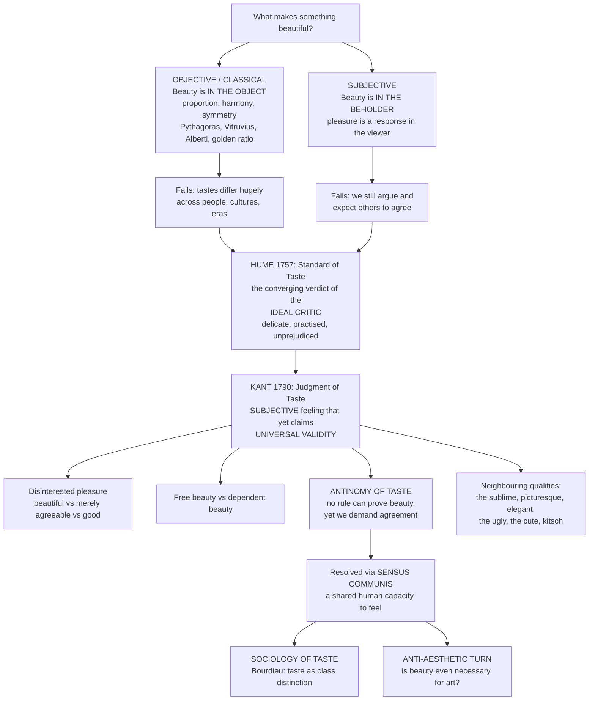

# 🌹 Beauty and Taste

> [!abstract] TL;DR
> "Beauty and taste" names the oldest fault line in aesthetics: is beauty a property *of the object* (classical view — proportion, harmony, symmetry, the golden ratio, from Pythagoras to Alberti) or a *response in the beholder* (subjective view — "beauty is in the eye of the beholder")? Pure objectivism cannot explain why tastes visibly differ; pure subjectivism cannot explain why we still *argue* about beauty and expect others to agree. **Hume** ("Of the Standard of Taste," 1757) locates a standard in the converging verdict of the *ideal critic* — experienced, delicate, unprejudiced. **Kant** (*Critique of the Power of Judgment*, 1790) sharpens the puzzle into the **antinomy of taste**: a judgment of beauty is *subjective* (grounded in a feeling of pleasure, provable by no rule) yet lays claim to *universal validity* (I demand that you agree). His scaffolding — **disinterested** pleasure, the **beautiful vs the merely agreeable**, **free vs dependent** beauty, and the **sensus communis** (a shared human capacity to feel) — tries to hold subjectivity and universality together. Beauty is only one aesthetic quality among many (the sublime, the picturesque, the elegant, the ugly, the cute, kitsch), and modernity asks two radical questions: is taste *cultivated or innate* (**Bourdieu**: it is class distribution in disguise), and is beauty even *necessary for art* (the **anti-aesthetic turn**: often not)?

---

## Intuition

**Analogy — the wine, the key, and the leather thong.** In *Don Quixote*, two of Sancho Panza's kinsmen are asked to judge a barrel of wine. One detects a faint taste of leather; the other, of iron. They are mocked — until the cask is drained and at the bottom is found an old key on a leather thong. Their verdicts were *subjective* (a private sensation on the tongue) yet *tracked something real* in the object, and their superior *delicacy of taste* was vindicated by the physical evidence. Hume tells this story to make his central point: taste is a felt response, not a measurement, and yet it is not merely "whatever anyone happens to like" — some palates are demonstrably finer, and their agreement forms a *standard*.

Now transpose the tongue to the eye. When you call a face, a sunset, a fugue, or a font "beautiful," you are reporting a *pleasure you feel* — no instrument reads beauty off the object the way a scale reads weight. Yet you do not treat it as you treat "I like anchovies." You feel entitled to say the other person is *missing something* if they see no beauty in the Taj Mahal. That double character — a private feeling that nonetheless *demands* agreement — is the entire problem of beauty and taste in a single sentence.

---

## How It Works

### The debate and its two failures

The **objective / classical** tradition says beauty is a real property of the object: the right **proportion, harmony, and symmetry**. Pythagoras heard it in the whole-number ratios of consonant musical intervals; Polykleitos codified it in his *Canon* of the ideal body; Vitruvius and later **Alberti** defined architectural beauty as *concinnitas* — a harmony of parts "such that nothing could be added, taken away, or altered but for the worse." The **golden ratio** (φ ≈ 1.618) became the poster child of this view. If beauty is *in the object*, then in principle it is measurable and disputes are settled by proof.

The **subjective** tradition — "beauty is in the eye of the beholder" — says beauty is not in the thing but in the *pleasure it produces in a mind*. Nothing is beautiful in the dark, to no one. If beauty is *in the beholder*, then it is a report of feeling and, seemingly, immune to argument.

Each view breaks on one stubborn fact:

- **Objectivism fails** because tastes visibly, massively differ — across persons, cultures, and centuries. If beauty were a measurable property like mass, disagreement would be error, and we could correct it with a ruler. We cannot.
- **Subjectivism fails** because we do not *behave* as if beauty were mere private preference. We argue about it, cultivate it, defer to critics, and feel that someone who finds a masterpiece ugly is *deficient*, not simply *different*. Nobody argues that anchovies are objectively delicious.

**Hume** and **Kant** are two great attempts to keep what is true in each side while escaping both failures.



The engine of the whole field is the tension the diagram makes visible: beauty *feels* like a fact about the world and *behaves* like a feeling in us. Every serious theory is a strategy for living with that contradiction rather than denying half of it.

---

## Key Concepts

### Secondary Level

**Two answers to one question.** "Is this beautiful because of how it *is*, or because of how it makes *me feel*?" The classical answer points at the object: the right shapes and ratios. The subjectivist answer points at the viewer: the pleasure inside. Most people, when pushed, hold *both* at once — and that is exactly the puzzle.

**Proportion, symmetry, and the golden ratio.** The classical toolkit for "objective" beauty is geometric. **Symmetry** (especially bilateral — left mirrors right) recurs in faces, temples, and butterflies. **Proportion** is the pleasing relation of parts to the whole. The **golden ratio** φ ≈ 1.618 is the most famous proposed proportion: a rectangle whose sides are in ratio φ is said to be maximally pleasing, and it appears in the golden spiral. (Whether people *actually* prefer φ is far shakier than the legend suggests — see Common Pitfalls.)

**The beautiful vs the agreeable.** A crucial distinction you already use. The **agreeable** is what merely *gratifies* you — a warm bath, a sweet drink, your favourite colour. It is admittedly private: "to each his own." The **beautiful** is different in kind — when you call a thing beautiful you implicitly invite everyone to see it too. Beauty *aspires to be shared* in a way that mere liking does not.

---

### Undergraduate Level

**Hume: "Of the Standard of Taste" (1757).** Hume is an empiricist: beauty "is no quality in things themselves; it exists merely in the mind which contemplates them" — so far, pure subjectivism. But he refuses the relativist conclusion. In practice we *know* that some verdicts are absurd (ranking a pulp romance above Milton), so there must be a **standard of taste**. Hume locates it not in the object but in the *ideal critic*. True critics are people of:

1. **Strong sense** — sound understanding.
2. **Delicacy of sentiment** — a fine, discriminating perception (the wine-tasters).
3. **Practice** — repeated, attentive experience of the art form.
4. **Comparison** — knowledge of many works, so standards are calibrated.
5. **Freedom from prejudice** — setting aside personal and factional bias.

The **"joint verdict"** of such critics, "wherever they are to be found, is the true standard of taste and beauty." Beauty stays subjective (a sentiment), but not *arbitrary*: it is anchored in the convergence of the best-qualified responders. The residual problems Hume honestly flags: critics still disagree over the *relative* rank of genuine masters, and taste varies with the "different humours of particular men" and "the particular manners and opinions of our age and country" — an early acknowledgment of what sociology will later make central.

**Kant: the *Critique of the Power of Judgment* (1790).** Kant's third *Critique* is the deepest analysis of the judgment of taste. Its core claim is a deliberate paradox — **subjective universality**: a judgment of beauty is grounded in a *feeling* (hence subjective, provable by no concept or rule), yet it rightly *demands the agreement of everyone* (hence claims universal validity). Kant unpacks this in **four moments**:

| Moment | The beautiful is... | Meaning |
|--------|--------------------|---------|
| **Quality** | the object of a **disinterested** satisfaction | I take pleasure in it without *wanting* it, using it, or caring whether it exists for my purposes — pure contemplation, not desire |
| **Quantity** | what pleases **universally without a concept** | I speak "with a universal voice," as if beauty were a property, yet I apply no rule or definition |
| **Relation** | **purposiveness without a purpose** | the form looks *designed to fit* our faculties, though it serves no determinate end |
| **Modality** | the object of a **necessary** satisfaction (exemplary) | I hold that others *ought* to feel as I do — an "exemplary" necessity, not one derived from a law |

**Disinterestedness** is the linchpin and separates three kinds of liking Kant carefully distinguishes:

- The **agreeable** — pleases the *senses*; interested (I desire the object). Purely private.
- The **good** — pleases through a *concept* of what is useful or morally worthy; interested (I approve and will it).
- The **beautiful** — pleases in mere *contemplation of form*; **disinterested**. Precisely *because* my pleasure is freed from private appetite and from concepts, I can suppose it springs from something everyone shares — hence I demand agreement.

**Free vs dependent beauty.** *Free beauty* (*pulchritudo vaga*) presupposes no concept of what the thing *should* be — a flower, an arabesque, a fugue without words. *Dependent* (adherent) beauty presupposes a concept of the object's purpose — the beauty of a horse, a church, a human body is judged partly against what such a thing is *for*. Free beauty gives the purest judgment of taste; dependent beauty mixes aesthetic and conceptual approval.

**The sensus communis.** How can a private feeling legitimately demand universal assent? Kant's answer is the **sensus communis** — not "common sense" as ordinary prudence, but a *shared aesthetic sense*: the idea of a communal faculty of feeling that, in judging, abstracts from one's own private conditions and takes the standpoint of everyone. Because the beautiful engages the *free harmonious play* of imagination and understanding — faculties every human possesses — the pleasure is one I can presume in all. The sensus communis is the postulated common ground that turns "I like it" into "this is beautiful, and you should feel it too."

**The antinomy of taste.** Kant crystallises the whole problem into a contradiction between two things we all believe:

- **Thesis:** Judgments of taste are *not* based on concepts — for otherwise we could *dispute* about beauty and settle it by proof (as we settle mathematics). We plainly cannot.
- **Antithesis:** Judgments of taste *are* based on concepts — for otherwise we could not even *quarrel* about beauty or claim that others *ought* to agree. But we plainly do.

Kant's resolution: both are true because "concept" means different things. Taste rests on *no determinate concept* (thesis holds — you cannot prove beauty), but it does rest on an *indeterminate* concept — the "supersensible substrate of humanity," the shared ground of the sensus communis (antithesis holds — hence we may demand agreement). The antinomy dissolves once we see that beauty is grounded in something universal but *non-conceptual*.

**Beauty is not the only aesthetic quality.** Kant himself pairs the beautiful with the **sublime** — the overwhelming vastness or might of nature (a storm, an alpine peak) that first checks and then exalts the mind. Beauty is bounded, restful, form-friendly; the sublime is formless, threatening, and thrills through a felt inadequacy overcome by reason. Beyond these two, the aesthetic vocabulary is rich: the **picturesque** (roughness and irregularity fit for a painting), the **elegant** (economy and grace), the **ugly**, the **cute** (smallness and vulnerability), and **kitsch** (sentimental, formulaic pseudo-beauty). Beauty is one region of a large map, not the whole territory.

---

### Graduate Level

**Taste: cultivated or innate?** Kant's sensus communis presumes a *universal* human capacity, and empirical aesthetics has hunted for innate constants — averageness and symmetry in facial attractiveness, preferences for certain curvatures and landscapes (savannah hypothesis). But taste is also manifestly *trained*: no one is born loving Schoenberg, Cézanne, or natural wine; connoisseurship is built by exposure, instruction, and comparison — exactly Hume's "practice." The honest position is *both*: some low-level perceptual biases are broadly shared, while the *elaborated* preferences that we call "cultivated taste" are learned, effortful, and unevenly distributed. And the moment taste is unevenly distributed, the question becomes *who* has it — and why.

**Bourdieu: the sociology of taste.** In *Distinction: A Social Critique of the Judgement of Taste* (1979), Pierre Bourdieu turns Kant's title into a target. Surveying French tastes in music, art, food, and décor, he finds that they are not free individual preferences but *structured by class position*. What passes as pure "good taste" is the **cultural capital** of the dominant class, acquired through upbringing and education (the *habitus*), and then *misrecognised* as natural gift. The very posture Kant prized — the **disinterested**, contemplative, "pure gaze" attending to form over function — is, for Bourdieu, itself a *class disposition*: available to those with the leisure and schooling to cultivate it, and defined *against* the "popular" or "barbarous" taste that demands art be useful, representational, and immediately pleasurable. His slogan: **"Taste classifies, and it classifies the classifier."** Aesthetic judgment thereby performs *social distinction* — marking and reproducing class boundaries — precisely while claiming to be above all interest. This is the deepest challenge to Kant: what he took to be *disinterested* and *universal* may be the most refined form of social interest there is (→ [[Social_Class_and_Stratification]], [[Education_and_Social_Reproduction]]).

**Beauty in nature vs beauty in art.** Kant thought *natural* beauty was aesthetically and even morally superior — its purposiveness-without-purpose is unforced, and taking disinterested delight in nature betokens a "good soul." The nineteenth century (Hegel) inverted this: *art* is higher, because in art beauty is *spirit made sensuous*, freighted with meaning that a mere flower lacks. The disagreement matters: if beauty is fundamentally natural, aesthetics is close to perception and pleasure; if fundamentally artistic, it is close to meaning, culture, and history.

**Is beauty even necessary for art? The anti-aesthetic turn.** For most of history "art" and "beauty" were nearly synonymous. The twentieth century severed them. Duchamp's readymades — a urinal signed and titled *Fountain* (1917) — asserted that something could be *art* while making no bid whatsoever to be *beautiful*; what matters is the idea, the gesture, the institutional framing. Conceptual, minimal, and shock art followed. Philosophers formalised the divorce: Arthur Danto (*The Transfiguration of the Commonplace*) argued that what makes something art is an *interpretation* embedded in an "artworld," not any perceptual beauty; George Dickie's **institutional theory** defines art by its status within a social practice, not by aesthetic properties; Adorno held that after the horrors of the century, comforting beauty is suspect, and serious art must be *difficult* and negative. Hal Foster's edited volume *The Anti-Aesthetic* (1983) gave the movement its name. The upshot: beauty is *neither necessary nor sufficient* for art. This does not abolish beauty — it demotes it from the *definition* of art to *one value among others* that art may pursue, refuse, or interrogate.

**Where this leaves us.** No single theory wins. Objectivism preserves the felt fact that beauty seems *in* the world; subjectivism preserves that it *lives in response*; Hume and Kant preserve *both* by grounding a normative standard in, respectively, the ideal critic and the sensus communis; Bourdieu unmasks that "universal" standard as social power; and the anti-aesthetic tradition detaches art from beauty altogether. The mature view treats "beauty" less as a property to be located and more as a *practice of judging* — one that really does feel universal, really is shaped by class and history, and really is worth arguing about.

---

## Python Demo

```python
# Beauty and Taste, explored empirically:
#   (A) Plot two proposed "OBJECTIVE" beauty features:
#         - the golden ratio phi (golden spiral + golden rectangle)
#         - bilateral symmetry (a symmetric silhouette vs an asymmetric one)
#   (B) Simulate a POPULATION of observers with individual tastes to show that
#       aesthetic judgments SPREAD OUT (subjectivity) while sharing a CENTRAL
#       TENDENCY near phi (a pull toward the "universal") --> the antinomy of taste.
# Requires: numpy, matplotlib only.

import numpy as np
import matplotlib.pyplot as plt

rng = np.random.default_rng(1618)
phi = (1 + np.sqrt(5)) / 2          # the golden ratio, ~1.6180

fig, axes = plt.subplots(2, 2, figsize=(14, 11))
ax_phi, ax_sym, ax_curves, ax_hist = axes.ravel()

# ---------------------------------------------------------------------------
# PANEL A1: the golden ratio as a proposed OBJECTIVE feature -- golden spiral
# The golden spiral multiplies its radius by phi every quarter turn.
# ---------------------------------------------------------------------------
theta = np.linspace(0, 4 * np.pi, 1200)
r = phi ** (2 * theta / np.pi)                      # grows by phi per pi/2 turn
ax_phi.plot(r * np.cos(theta), r * np.sin(theta), color="#b45309", lw=2.2)

# Overlay a golden rectangle (width phi, height 1) centred on the spiral origin
w, h = phi, 1.0
rect_x = [-1, -1 + w, -1 + w, -1, -1]
rect_y = [-0.5, -0.5, -0.5 + h, -0.5 + h, -0.5]
ax_phi.plot(rect_x, rect_y, color="#1e40af", lw=1.6)
ax_phi.text(-1 + w / 2, -0.72, f"width : height = phi : 1 = {phi:.3f} : 1",
            ha="center", color="#1e40af", fontsize=10)
ax_phi.set_title("Objective feature 1: the golden ratio (spiral + rectangle)")
ax_phi.set_aspect("equal")
ax_phi.axis("off")

# ---------------------------------------------------------------------------
# PANEL A2: bilateral symmetry as a proposed OBJECTIVE feature
# Build a silhouette from its right edge, mirror it -> perfectly symmetric.
# Then perturb one side -> asymmetric, for contrast.
# ---------------------------------------------------------------------------
yv = np.linspace(-1, 1, 400)
right_edge = 0.55 * np.sqrt(np.clip(1 - yv**2, 0, None)) + 0.12 \
             + 0.10 * np.cos(3 * np.pi * yv)         # a lobed vase/face profile

# symmetric shape: left edge is exact mirror of right edge
xs = np.concatenate([right_edge, -right_edge[::-1]])
ys = np.concatenate([yv, yv[::-1]])
ax_sym.fill(xs - 1.1, ys, color="#93c5fd", ec="#1e40af", lw=1.6, alpha=0.75)
ax_sym.axvline(-1.1, color="#1e40af", ls="--", lw=1.0)
ax_sym.text(-1.1, 1.15, "symmetric", ha="center", color="#1e40af", fontsize=10)

# asymmetric shape: same right edge, but left edge is randomly perturbed
left_edge = right_edge + rng.normal(0, 0.14, right_edge.size)
xa = np.concatenate([right_edge, -left_edge[::-1]])
ax_sym.fill(xa + 1.1, ys, color="#fca5a5", ec="#b91c1c", lw=1.6, alpha=0.75)
ax_sym.axvline(1.1, color="#b91c1c", ls="--", lw=1.0)
ax_sym.text(1.1, 1.15, "asymmetric", ha="center", color="#b91c1c", fontsize=10)

ax_sym.set_title("Objective feature 2: bilateral symmetry vs asymmetry")
ax_sym.set_aspect("equal")
ax_sym.set_xlim(-2.2, 2.2)
ax_sym.axis("off")

# ---------------------------------------------------------------------------
# PANEL B1: SUBJECTIVITY -- every observer has their own tuning curve.
# Observer i finds a stimulus of proportion x most pleasing near their ideal
# mu_i. Their preference is a Gaussian bump peaked at mu_i.  The mu_i are drawn
# around phi (a shared pull) but scatter (individual taste).
# ---------------------------------------------------------------------------
N = 6000                                   # population of observers
sigma_between = 0.15                        # spread of individual ideals (taste)
tau = 0.10                                  # width of each observer's tuning
mu = rng.normal(phi, sigma_between, N)      # each observer's ideal proportion

x = np.linspace(1.0, 2.3, 400)             # stimulus proportion (width:height)

# plot ~14 individual curves (subjective, all different)
for m in mu[:14]:
    ax_curves.plot(x, np.exp(-0.5 * ((x - m) / tau) ** 2),
                   color="#94a3b8", lw=0.9, alpha=0.8)

# population-mean preference curve (the shared "universal" tendency)
mean_pref = np.mean(
    np.exp(-0.5 * ((x[None, :] - mu[:, None]) / tau) ** 2), axis=0
)
ax_curves.plot(x, mean_pref, color="#7c3aed", lw=3,
               label="population mean preference")
ax_curves.axvline(phi, color="#b45309", ls="--", lw=1.5,
                  label=f"golden ratio phi = {phi:.3f}")
ax_curves.set_xlabel("stimulus proportion  (width : height)")
ax_curves.set_ylabel("aesthetic pleasure")
ax_curves.set_title("Subjectivity: individual tastes differ, mean peaks near phi")
ax_curves.legend(fontsize=9, loc="upper right")
ax_curves.grid(alpha=0.3)

# ---------------------------------------------------------------------------
# PANEL B2: the ANTINOMY OF TASTE, made visual.
# Histogram of each observer's most-preferred proportion. It SPREADS (taste is
# subjective) yet clusters with a clear CENTRAL TENDENCY near phi (feels
# universal). Both facts are true at once -- Kant's antinomy.
# ---------------------------------------------------------------------------
expressed_peak = mu + rng.normal(0, 0.05, N)     # add small judgment noise
ax_hist.hist(expressed_peak, bins=60, color="#c4b5fd",
             edgecolor="white", density=True)
ax_hist.axvline(phi, color="#b45309", ls="--", lw=2,
                label=f"golden ratio phi = {phi:.3f}")
ax_hist.axvline(expressed_peak.mean(), color="#7c3aed", lw=2,
                label=f"population mean = {expressed_peak.mean():.3f}")
ax_hist.set_xlabel("each observer's most-preferred proportion")
ax_hist.set_ylabel("density of observers")
ax_hist.set_title("Antinomy of taste: shared centre (universal) + spread (subjective)")
ax_hist.legend(fontsize=9)
ax_hist.grid(alpha=0.3)

fig.suptitle(
    "Beauty and Taste: objective features vs a distribution of subjective judgments",
    fontsize=14, fontweight="bold"
)
plt.tight_layout()
plt.savefig("beauty_and_taste.png", dpi=150, bbox_inches="tight")
plt.show()

# ---------------------------------------------------------------------------
# Numerical read-out: how "universal" is the shared pull, really?
# ---------------------------------------------------------------------------
within = np.mean(np.abs(expressed_peak - phi) < 0.10) * 100
print(f"Population mean preferred proportion : {expressed_peak.mean():.3f}  "
      f"(golden ratio phi = {phi:.3f})")
print(f"Std of preferred proportion (taste spread) : {expressed_peak.std():.3f}")
print(f"Share of observers within 0.10 of phi : {within:.1f}%")
print("\nInterpretation: the MEAN sits right on phi (looks universal / objective),")
print("yet no single observer IS the mean -- tastes fan out around it (subjective).")
print("That coexistence is exactly Kant's antinomy of taste, made empirical.")
```

**Reading the output.** The top row shows the two features the classical tradition proposed as *objective* beauty: the golden ratio (a spiral and rectangle in the proportion φ:1) and bilateral symmetry (a mirror-perfect silhouette beside a perturbed one). The bottom row is the subjectivist reply. Panel B1 gives each simulated observer their *own* tuning curve — every taste differs — yet the population *average* (purple) peaks right at φ. Panel B2 histograms everyone's single most-preferred proportion: the cloud is genuinely *spread* (taste is subjective and personal) but has an unmistakable *centre* on the golden ratio (it feels universal). Both statements are simultaneously true, which is precisely Kant's antinomy: beauty is a subjective feeling that nonetheless behaves as if it were shared by all. Note the code *builds in* the shared pull toward φ as an assumption — mirroring the fact that the empirical evidence for an innate golden-ratio preference is itself contested (see Common Pitfalls).

---

## Real-World Applications

> **Example 1 — Facial-attractiveness research and "averageness."** Empirical psychology (Langlois and Roggman, 1990 onward) found that computer-averaged composite faces are rated *more* attractive than most of the individual faces averaged into them, and that **symmetry** predicts rated attractiveness. This is the objectivist wager made testable: some beauty judgments show broad cross-observer and cross-cultural agreement, consistent with Kant's presumed sensus communis and Hume's ideal-critic convergence — while still leaving wide individual variation, consistent with subjectivism. The simulation above models exactly this: a shared centre plus real spread.

> **Example 2 — Design systems and "the rule of thirds" / golden ratio in UX and typography.** Countless design guides invoke φ, the golden rectangle, and symmetry as objective recipes for pleasing layouts, logos, and type scales. The practical value is real (proportional consistency, visual rhythm), but the *justification* often over-claims a universal law where the evidence supports, at best, a mild and trainable preference — a live instance of the classical-objectivist tradition operating inside modern product design.

> **Example 3 — Bourdieu's *Distinction* and the culture industries.** Marketing, museums, wine ratings, and streaming recommender systems all operate on the premise that taste is *socially structured and predictable* by class, education, and prior consumption — Bourdieu's thesis turned into a business model. "Prestige" pricing, tiered art institutions, and taste-based segmentation are the sociology of taste monetised: they exploit precisely the class-coded, cultivated character of aesthetic judgment that Kant's "disinterested universality" tried to abstract away (→ [[Social_Class_and_Stratification]]).

> **Example 4 — The art market and the anti-aesthetic.** A Duchamp readymade, a Rothko colour field, or a conceptual piece can command tens of millions while making no claim to conventional beauty. The market prices *artworld status, provenance, and interpretation* — Danto's and Dickie's institutional theories in action — demonstrating in hard currency that beauty is neither necessary nor sufficient for something to count, and be valued, as art.

---

## Common Pitfalls

- **The golden-ratio myth.** The claim that φ pervades the Parthenon, the *Mona Lisa*, nautilus shells, and human faces — and that people robustly *prefer* it — is largely a modern legend. Careful measurement often has to cherry-pick the rectangle; controlled preference studies (going back to Fechner) find weak, inconsistent effects. Treat the golden ratio as a *cultural idea about beauty*, not a proven law of perception. The Python demo deliberately *assumes* the pull toward φ rather than deriving it — because the real evidence would not license deriving it.

- **Collapsing beauty into the merely agreeable.** "It's all just subjective preference, like ice-cream flavours" ignores Kant's central distinction. Calling something *beautiful* makes a normative bid for agreement; saying you *like* it does not. Flattening the two erases the entire phenomenon that needs explaining.

- **Mistaking "subjective" for "arbitrary."** Both Hume and Kant are subjectivists about the *ground* of beauty (a feeling) yet reject relativism. Subjective does not mean "anything goes": a standard emerges through the ideal critic (Hume) or the shared sensus communis (Kant). Confusing "located in a subject" with "beyond rational discussion" is the most common error in the whole area.

- **Reading disinterestedness as indifference or coldness.** Kant's "disinterested" pleasure is *intense* — it simply is not driven by *desire to possess or use* the object, and not by a *concept* of its purpose. Students routinely misread it as "detached" or "unemotional." It is emotional; it is just free of appetite and utility.

- **Treating Bourdieu as merely cynical.** "Taste is just class snobbery" is a caricature. Bourdieu's claim is structural, not moralising: aesthetic dispositions are *systematically distributed* by upbringing and education and *misrecognised* as natural gifts. The point is to expose a mechanism of reproduction, not to deny that people have genuine aesthetic experiences.

- **Assuming beauty defines art.** After Duchamp, Danto, and Dickie, this is false. Much important art is deliberately *not* beautiful (difficult, ugly, conceptual, political). Beauty is one aesthetic value art may pursue or refuse — do not smuggle it back in as a definition.

---

## Related Concepts

- [[Kant_and_the_Copernican_Turn]] — the same Kant, same critical method: just as the first *Critique* shows the mind supplies the *forms* of knowledge, the third *Critique* (analysed here) shows taste supplies a *subjective yet universal* form of judging; the sensus communis and the antinomy of taste are the aesthetic counterparts of the categories and the antinomies of pure reason.
- [[Humes_Skepticism]] — Hume's empiricism about ideas and his sentiment-based ethics are the backdrop to "Of the Standard of Taste": beauty, like moral approval, is a *feeling* projected onto objects, disciplined here by the ideal critic rather than left to relativism.
- [[Social_Class_and_Stratification]] — supplies Bourdieu's full apparatus (economic, cultural, and social capital; habitus; symbolic violence) that *Distinction* deploys to reinterpret the "judgement of taste" as a mechanism of class reproduction; the two notes are mutually load-bearing.
- [[Education_and_Social_Reproduction]] — the schooling system is where "legitimate taste" (the cultural capital of the dominant class) is transmitted and *misrecognised* as natural ability; the concrete machinery behind Bourdieu's sociology of taste.

*(Planned sibling notes in this folder — The Sublime, Aesthetic Experience — will cross-link here once created.)*

---

## Review Questions

### Secondary

1. Your friend says "beauty is completely in the eye of the beholder — there's no arguing about it." Give one everyday example that *supports* them and one that *works against* them (hint: think about how we treat a masterpiece versus how we treat ice-cream flavours). What does the second example show that pure subjectivism struggles to explain?
2. Explain the difference between calling a slice of cake **agreeable** and calling a cathedral **beautiful**. When you say the cathedral is beautiful, what do you seem to expect of other people that you do *not* expect when you say you like the cake?
3. What are the golden ratio and bilateral symmetry, and why did the classical tradition think they made things objectively beautiful? Give one reason to be sceptical that everyone actually prefers the golden ratio.

### Undergraduate

1. Reconstruct Hume's argument in "Of the Standard of Taste." If beauty is "no quality in things themselves" but exists "in the mind," how does Hume avoid the conclusion that all verdicts are equally valid? Lay out the five qualifications of the ideal critic and explain what problem *remains* even after the standard is established.
2. State Kant's **antinomy of taste** as a thesis and antithesis, then explain his resolution. Why does the ambiguity in the word "concept" (determinate vs indeterminate) do the decisive work? Connect the resolution to the role of the **sensus communis**.
3. Distinguish Kant's three kinds of liking — the agreeable, the good, and the beautiful — using the concept of **disinterestedness**. Then explain **free vs dependent beauty** with an example of each, and say why free beauty yields the "purest" judgment of taste.

### Graduate

1. Bourdieu titles his book *A Social Critique of the Judgement of Taste* — a direct shot at Kant. Reconstruct his argument that the Kantian **pure, disinterested gaze** is itself a *class disposition*, using habitus and cultural capital. Is this a *refutation* of Kant's universality claim, or a *sociological redescription* that leaves the philosophical claim untouched? Defend your answer.
2. "Beauty is neither necessary nor sufficient for art." Assess this using Duchamp's *Fountain*, Danto's interpretation-based account, and Dickie's institutional theory. If beauty is dethroned from the *definition* of art, what work (if any) is left for the concept of beauty to do in aesthetics?
3. The Python simulation reproduces a shared central tendency near φ *and* wide individual spread. Suppose an empirical study found exactly this pattern for real facial-attractiveness ratings. Which philosopher — Hume, Kant, or Bourdieu — does the data most support, and how could a defender of each of the *other two* reinterpret the same result without conceding? Design a follow-up experiment that would discriminate between them.

---

## Sources

- [Immanuel Kant, *Critique of the Power of Judgment* (1790), trans. Guyer & Matthews, Cambridge University Press](https://www.cambridge.org/core/books/kant-critique-of-the-power-of-judgment/)
- [David Hume, "Of the Standard of Taste" (1757), in *Essays, Moral, Political, and Literary*](https://www.econlib.org/library/LFBooks/Hume/hmMPL23.html)
- [Pierre Bourdieu, *Distinction: A Social Critique of the Judgement of Taste* (1984, trans. Richard Nice), Harvard University Press](https://www.hup.harvard.edu/books/9780674212770)
- [Stanford Encyclopedia of Philosophy, "The Concept of the Aesthetic"](https://plato.stanford.edu/entries/aesthetic-concept/)
- [Stanford Encyclopedia of Philosophy, "Kant's Aesthetics and Teleology"](https://plato.stanford.edu/entries/kant-aesthetics/)
- [Hal Foster (ed.), *The Anti-Aesthetic: Essays on Postmodern Culture* (1983), Bay Press](https://www.worldcat.org/title/anti-aesthetic-essays-on-postmodern-culture/oclc/9827598)

---

#aesthetics #beauty #taste #kant #judgment
