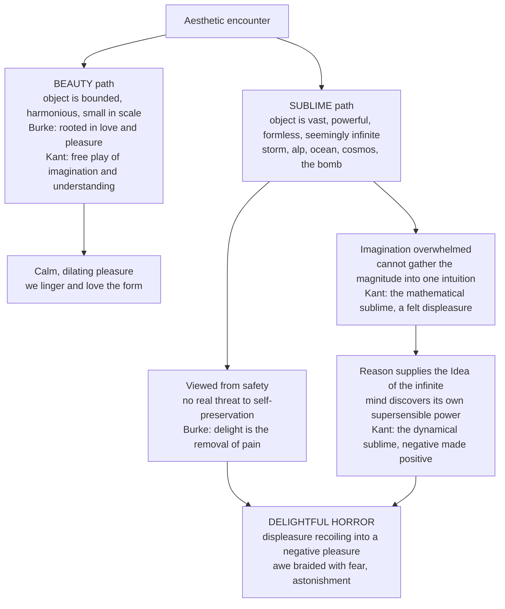

# 🏔️ The Sublime and Aesthetic Emotion

> [!abstract] TL;DR
> The **sublime** is aesthetics' second great category, defined *against* beauty: where beauty is bounded, harmonious, and loved, the sublime is vast, formless, and overpowering — the storm, the alp, the ocean, the cosmos — and it produces not calm pleasure but **awe braided with terror**, a "delightful horror" felt precisely because we are safe. **Longinus** located it in rhetoric (language that transports); **Burke** grounded it in self-preservation (obscurity, power, vastness, infinity trigger a pleasurable fear when danger is only represented); **Kant** relocated it to the *mind itself* — in the **mathematical sublime** imagination fails to grasp sheer magnitude, and in the **dynamical sublime** we feel nature's might, but in both the failure recoils into a discovery of reason's own supersensible power, so the sublime is ultimately about *us*, not the mountain. The **Romantics** (Friedrich, Turner) made landscape its home, and the twentieth century revived it as the technological, nuclear, and **abstract sublime** (Rothko, Newman). Around this sits the wider science of **aesthetic emotions** — awe, being-moved / *kama muta*, the **chills / frisson**, wonder, and the tragic pleasure of **catharsis** — and the puzzle they all share: **why negative emotions in art feel good**. **Berlyne's** psychobiology answers with the **inverted-U**: hedonic value peaks at *moderate* arousal potential set by collative variables (novelty, complexity, surprise); too simple bores, too complex repels — while the sublime is the special case where overwhelming magnitude is enjoyed *anyway*.

---

## Intuition

**Analogy:** Stand at the railing on the rim of a vast canyon. Your stomach drops; some ancient circuit reads the drop as *death* and floods you with the physiology of fear — tight chest, prickling skin, a magnetic pull toward and away from the edge. And yet you do not flee. You lean *in*. The very hugeness that frightens you is the thing you drove four hours to feel, and mixed into the fear is an exhilaration you would never get from a tidy garden. Now imagine watching a violent thunderstorm hammer the coast from behind a plate-glass window: lightning, black water, wind that would kill you outside — and you feel thrilled, expanded, almost grateful. That specific cocktail — **overwhelming magnitude + real fear + guaranteed safety = a pleasure shot through with terror** — is the sublime.

Notice what beauty is *not* doing here. A rose, a well-proportioned face, a gentle melody invite you to *linger and love*; they are bounded and you feel bigger than them. The canyon and the storm are the opposite: they dwarf you, they refuse to be taken in at a glance, and the pleasure comes not from mastering the object but from surviving the encounter with something that could not be mastered at all. Beauty says *how lovely*; the sublime says *my God*. Aesthetics needs two categories because these are two different feelings — and the sublime is the one that shades into fear, awe, and the sacred.

---

## How It Works

### Core mechanics

1. **Beauty and the sublime are distinct categories, not degrees of the same thing.** From **Burke** onward, the tradition insists on a *qualitative* split. **Beauty** is small, smooth, delicate, bounded, and produces *love* — a relaxing, dilating pleasure. The **sublime** is vast, rugged, obscure, powerful, and produces *astonishment* — a state in which, Burke writes, "the mind is so entirely filled with its object that it cannot entertain any other." One relaxes the nerves; the other braces them.

2. **The engine of the sublime is threat experienced without danger.** Burke roots it in **self-preservation**, the strongest of the passions. Anything that suggests pain, death, or annihilation — a precipice, a wild beast, a raging sea — excites terror. But when the threat is *represented* or viewed from safety, the terror is defused into **"delight"** (Burke's technical term for the pleasure that arises from the *removal* of pain). The result is his famous phrase: the sublime is a **"sort of delightful horror."**

3. **Burke's toolkit of sublimity.** He catalogs the qualities that trigger it: **obscurity** (the half-seen, the dark, the vague are more terrible than the clearly lit — hence gods are shrouded), **power** (anything mightier than us), **vastness** in extension, **infinity** and its cousin **succession/uniformity** (a colonnade that seems endless), **magnificence**, **loudness** and **sudden silence**. These are physiological triggers: he thought sublimity literally *tenses* the nervous fibers.

4. **Kant moves the sublime from the object into the mind.** In the *Critique of the Power of Judgment* (1790), Kant argues that, strictly, *no object* is sublime — the ocean is just water. Sublimity is a feeling provoked *in us*. He splits it in two:
   - **Mathematical sublime** — magnitudes so vast (the starry sky, a pyramid up close, the sheer *number* of stars) that **imagination fails** to gather them into a single intuition. This failure is painful.
   - **Dynamical sublime** — nature's overwhelming *might* (volcano, hurricane, cliff) considered as fearful **but not actually feared** because we are secure.
   In both, the momentary defeat of our sensible faculties awakens **reason**, which *can* think the infinite as an Idea. We feel our own **supersensible vocation** — our moral and rational nature outstripping all of nature's magnitude. So the negative jolt (imagination's failure) **recoils into a positive** (reason's triumph). The sublime, for Kant, is a compliment the mind pays *to itself*.

5. **The Romantic sublime turns the theory into landscape and paint.** Caspar David Friedrich's *Wanderer above the Sea of Fog* and Turner's storms and burning skies stage exactly Kant's structure: a small human figure before an engulfing, formless nature. The nineteenth century tied it to nationhood, God, and the wilderness. The twentieth century **secularized and abstracted** it: the **technological / nuclear sublime** (the terrifying grandeur of the atom bomb, the machine, the megacity) and the **abstract sublime** of **Rothko's** hovering color fields and **Barnett Newman's** vast "zips," designed to overwhelm a viewer standing close.

6. **The sublime is one member of a family: aesthetic emotions.** Contemporary affective science studies a cluster of feelings art specializes in provoking: **awe** (vastness + a need for accommodation, per Keltner & Haidt), **being moved / *kama muta*** (the warm, tearful "moved" feeling of sudden communal love), the **chills / frisson** (goosebumps and shivers down the spine at a musical or poetic peak), **wonder**, **nostalgia**, and the **tragic pleasure** Aristotle called **catharsis**. What unifies them is that they are *responses to represented or contemplated objects*, they blend valence in unusual ways, and they are often *rewarding despite being negative*.

7. **Berlyne supplies the psychobiology and the master curve.** Daniel Berlyne argued aesthetic preference tracks a stimulus's **arousal potential**, driven by **collative variables** — properties you can only assess by *comparing* elements: **novelty, complexity, surprise, ambiguity, incongruity**. Preference follows an **inverted-U** (the "Wundt curve"): as arousal potential rises, liking climbs to a peak at *moderate* levels, then falls. Too little (utterly simple, familiar) is **boring**; too much (chaotic, overwhelming) is **aversive**; the sweet spot in between is *pleasing*. The sublime is the striking exception where the far-right, high-arousal region — normally aversive — is nonetheless sought out and enjoyed, because safety and reason reframe the overwhelm.

8. **The paradox of negative emotion, resolved.** Why pay to feel sad (weepies), scared (horror), or overwhelmed (the sublime)? Several mechanisms combine: **safe framing** (the fiction/frame guarantees no real cost — Burke's "delight"), **compensation** (the aesthetic rewards — form, meaning, catharsis, social bonding via *kama muta* — outweigh the felt negativity), **arousal regulation** (a controlled dose of high arousal is itself pleasurable when we can stop it), and **meaning-making** (the negative emotion is metabolized into insight). The unpleasant component is not a bug to be subtracted; it is the *raw material* the aesthetic response transforms.

### The structure of a sublime experience



---

## Key Concepts

### Secondary Level

- **Beauty vs the sublime.** Beauty = small, smooth, harmonious, *loved*, makes us feel comfortable and in control. The sublime = huge, powerful, awe-inspiring, *frightening from a safe distance*. A garden is beautiful; a thunderstorm at sea is sublime.
- **Delightful horror.** The sublime is enjoyable *because* it is a little terrifying — but only when you are safe. Roller coasters, horror films, and standing at a cliff edge all borrow this trick.
- **Aesthetic emotions.** Special feelings art is good at causing: **awe** (feeling small before something vast), the **chills / goosebumps** at a great song, **being moved** to happy tears, **wonder**, and the strange satisfaction of a **sad or tragic story**.
- **The Goldilocks rule of interest (Berlyne).** We like things that are *moderately* new and complex. Too plain is boring; too chaotic is off-putting; "just right" is most pleasing.

### Undergraduate Level

- **Longinus, *On the Sublime* (Peri Hypsous, ~1st c. CE).** The *rhetorical* sublime: great language does not merely persuade, it **transports** and "scatters" the audience like a lightning bolt. Sublimity is the echo of a great soul; it lifts the reader out of themselves. This is the sublime's *first* home — in words, not landscapes.
- **Burke's *Philosophical Enquiry* (1757).** The first sustained *empirical-psychological* treatment. Splits aesthetics into two passions: the **sublime** (grounded in **self-preservation** → terror, delight) and **beauty** (grounded in **society / love**). Enumerates the causes of sublimity — **obscurity, power, vastness, infinity, magnificence, loudness**. Influential on the Gothic novel and Romanticism.
- **Kant's Analytic of the Sublime (1790).** The **mathematical sublime** (magnitude that defeats imagination) and the **dynamical sublime** (might that we contemplate without fear). Key move: the sublime is a feeling *in the subject*, arising when the collapse of sensible imagination reveals the superiority of **reason** and our **supersensible vocation**. Requires "culture" (moral-rational development) to be felt fully — links to [[Kant_and_the_Copernican_Turn]].
- **The Romantic sublime.** Landscape as the theater of the sublime: **Caspar David Friedrich** (the solitary figure before fog, mountains, ruins) and **J. M. W. Turner** (storms, avalanches, blazing atmospheres). Human smallness against engulfing nature; the sublime allied with the wild, the national, and the divine.
- **Aesthetic emotion vs ordinary emotion.** Aesthetic emotions are typically (a) directed at *represented* or *contemplated* objects, (b) often *self-reflexive* (we savor the feeling itself), and (c) capable of **mixed valence** — pleasure and displeasure at once — in a way everyday emotions rarely allow.

### Graduate Level

- **The abstract and technological sublime.** Twentieth-century revivals detach the sublime from nature. **Barnett Newman** ("The Sublime is Now," 1948) and **Mark Rothko** engineer *color-field* canvases meant to be viewed close, so the field exceeds the visual frame and overwhelms — a *formless*, secular sublime. Parallel strands: the **technological sublime** (Leo Marx, David Nye) of railroads, skyscrapers, and rockets; the **nuclear sublime** of the mushroom cloud (Rob Wilson, Frances Ferguson); and Lyotard's **postmodern sublime**, art that "presents that there is the unpresentable."
- **Berlyne's arousal theory in full.** Two hypothesized reward systems: a **primary reward system** (rising with arousal) and an **aversion system** (kicking in at higher arousal). Their difference yields the **Wundt curve** (inverted-U). Distinguishes **specific exploration** (reducing uncertainty about one object) from **diversive exploration** (seeking stimulation when bored). **Collative variables** (novelty, complexity, surprise, incongruity, ambiguity) set arousal potential; hedonic tone is their inverted-U transform. Later refined by **Martindale** (prototypicality can dominate) and by **fluency/processing-fluency** accounts, and by two-factor / dual-process models.
- **The chills / frisson mechanism.** Musical/aesthetic frisson correlates with dopaminergic reward activity (Salimpoor et al., 2011) and often tracks **expectation violation and resolution** — surprising harmonic or dynamic peaks. Ties directly to [[Music_Cognition_and_Emotion]] and to predictive-processing accounts of emotion in [[Emotion_and_Cognition]].
- **Awe as a distinct construct.** Keltner & Haidt (2003) define awe by two appraisals: **perceived vastness** (physical, social, or conceptual) and a **need for accommodation** (the stimulus does not fit existing mental schemas, forcing revision). Awe produces a **"small self,"** prosociality, and time-expansion — a modern operationalization of the Kantian/Burkean sublime.
- **The paradox of tragic / negative aesthetic emotion.** Competing theories: **conversion** (Hume — negative affect is transmuted by the pleasure of eloquent form), **compensation** (rewards outweigh costs), **meta-emotion / control** (we enjoy being moved *about* our own responses; the frame guarantees exit), and **rich experience / meaning** accounts (Menninghaus et al.'s "distancing-embracing" model: art frames negative emotion so it can be *embraced* for the mixed, intensified experience it affords). Directly extends Aristotle's **catharsis** → [[Aristotles_Poetics_and_Drama]].

---

## Python Demo

```python
# The Aesthetics of Arousal: Berlyne's inverted-U vs the Sublime
# ------------------------------------------------------------------
# We model hedonic (liking) value as a function of a stimulus's AROUSAL
# POTENTIAL -- Berlyne's construct set by collative variables (novelty,
# complexity, surprise). Berlyne's theory: liking = REWARD(arousal) minus
# AVERSION(arousal). Two offset sigmoids produce the famous inverted-U
# (the "Wundt curve"): moderate complexity is most pleasing, too simple is
# boring, too complex is aversive.
#
# The SUBLIME is modeled as the special case: at OVERWHELMING magnitude the
# ordinary aversion still fires (real fear), but a high-arousal "awe / reason-
# triumph" reward peak is added (Kant: imagination fails, reason recoils into
# a negative pleasure). The net is a MIXED pleasure-fear peak far to the right,
# where ordinary beauty has long since become unpleasant.
#
# numpy + matplotlib only.

import numpy as np
import matplotlib.pyplot as plt

def sigmoid(x, center, steep):
    return 1.0 / (1.0 + np.exp(-steep * (x - center)))

# Arousal potential axis (0 = utterly plain/familiar, 10 = overwhelming)
a = np.linspace(0, 10, 600)

# --- Berlyne's two systems ---------------------------------------------
reward   = 1.00 * sigmoid(a, center=3.0, steep=1.3)   # rises early, plateaus
aversion = 1.15 * sigmoid(a, center=6.5, steep=1.2)   # kicks in later, stronger

# BEAUTY / ordinary preference: reward - aversion  -> inverted-U (Wundt curve)
hedonic_beauty = reward - aversion

# --- The SUBLIME -------------------------------------------------------
# Same fear (aversion), plus an "awe bump": a Gaussian reward centered in the
# high-arousal region -- the mind's recoil into reason's power under overwhelm.
awe_bump = 1.10 * np.exp(-((a - 8.3) ** 2) / (2 * 0.9 ** 2))
hedonic_sublime = reward - aversion + awe_bump

# ----------------------------------------------------------------------
fig, (ax1, ax2) = plt.subplots(1, 2, figsize=(14, 5.5))

# ============ PANEL A: the response curves ============
ax1.axhline(0, color="0.6", lw=0.8)
ax1.plot(a, reward,   "--", color="seagreen", lw=1.4, label="Reward system")
ax1.plot(a, aversion, "--", color="firebrick", lw=1.4, label="Aversion system")
ax1.plot(a, hedonic_beauty,  color="steelblue", lw=2.6,
         label="Beauty  (Berlyne inverted-U)")
ax1.plot(a, hedonic_sublime, color="indigo", lw=2.6,
         label="Sublime  (mixed pleasure-fear peak)")

# Mark the two peaks
i_b = np.argmax(hedonic_beauty)
i_s = np.argmax(hedonic_sublime[a > 6.5]) + np.argmax(a > 6.5)
ax1.scatter([a[i_b]], [hedonic_beauty[i_b]], color="steelblue", zorder=5)
ax1.annotate("moderate complexity\n= peak liking",
             (a[i_b], hedonic_beauty[i_b]), xytext=(a[i_b]-0.3, 0.55),
             ha="center", fontsize=9, color="steelblue")
ax1.scatter([a[i_s]], [hedonic_sublime[i_s]], color="indigo", zorder=5)
ax1.annotate("SUBLIME:\ndelightful horror",
             (a[i_s], hedonic_sublime[i_s]), xytext=(a[i_s]+0.1, 0.55),
             ha="center", fontsize=9, color="indigo")

# Zone labels along the bottom
ax1.text(1.2, -0.95, "BORING\n(too simple)", ha="center", fontsize=8, color="0.4")
ax1.text(4.5, -0.95, "PLEASING",           ha="center", fontsize=8, color="0.4")
ax1.text(8.3, -0.95, "AVERSIVE / SUBLIME\n(overwhelming)", ha="center",
         fontsize=8, color="0.4")

ax1.set_xlabel("Arousal potential  (novelty, complexity, surprise, magnitude)")
ax1.set_ylabel("Hedonic value  (liking)")
ax1.set_title("Berlyne's inverted-U vs the Sublime")
ax1.legend(loc="upper right", fontsize=8)
ax1.set_ylim(-1.15, 1.0)

# ============ PANEL B: aesthetic emotions mapped onto arousal ============
# name, arousal, valence(-1..+1 pleasant), intensity(size)
emotions = [
    ("Boredom",        0.8, -0.5, 120),
    ("Calm beauty",    3.3,  0.9, 260),
    ("Wonder",         5.2,  0.7, 300),
    ("Being moved\n(kama muta)", 6.0, 0.6, 320),
    ("Chills / frisson", 7.0, 0.5, 340),
    ("Awe / sublime",  8.3,  0.25, 420),
    ("Tragic pathos\n(catharsis)", 7.6, -0.15, 300),
    ("Terror",         9.5, -0.9, 200),
]
xs  = [e[1] for e in emotions]
ys  = [e[2] for e in emotions]
szs = [e[3] for e in emotions]
sc = ax2.scatter(xs, ys, s=szs, c=ys, cmap="coolwarm_r",
                 vmin=-1, vmax=1, edgecolor="k", linewidth=0.6, zorder=3)
for name, x, y, _ in emotions:
    ax2.annotate(name, (x, y), textcoords="offset points",
                 xytext=(0, 16), ha="center", fontsize=8.5)

ax2.axhline(0, color="0.6", lw=0.8)
ax2.text(0.2, 0.92, "pleasant", fontsize=8, color="0.4")
ax2.text(0.2, -0.98, "unpleasant", fontsize=8, color="0.4")
ax2.set_xlabel("Arousal  (low  ->  overwhelming)")
ax2.set_ylabel("Valence")
ax2.set_title("Aesthetic emotions on the arousal-valence plane")
ax2.set_xlim(-0.3, 10.3)
ax2.set_ylim(-1.15, 1.25)
fig.colorbar(sc, ax=ax2, label="valence", fraction=0.046, pad=0.04)

plt.tight_layout()
plt.savefig("sublime_aesthetic_emotion.png", dpi=130)
plt.show()

# Console read-out: where does each curve peak?
print(f"Beauty  peaks at arousal ~ {a[i_b]:.2f}  (moderate complexity)")
print(f"Sublime peaks again at arousal ~ {a[i_s]:.2f}  (overwhelming magnitude)")
print("Between the peaks the ordinary curve goes NEGATIVE: too much complexity")
print("is aversive -- unless awe/safety reframes it into the sublime.")
```

**What the plot shows.** Panel A reproduces Berlyne's **inverted-U**: the blue *beauty* curve (reward minus aversion) climbs to a single peak at *moderate* arousal potential, then dives negative as complexity/magnitude overwhelms. The indigo *sublime* curve shares that dip but grows a **second, high-arousal peak** — the awe bump — modeling how overwhelming magnitude, reframed by safety and reason, becomes a **pleasure shot through with fear** exactly where ordinary aesthetics turns unpleasant. Panel B lays the family of **aesthetic emotions** onto an arousal-valence plane: boredom (low arousal), calm beauty and wonder (moderate, positive), frisson and being-moved (high, positive), the **sublime / awe** sitting at high arousal with *mixed* valence, tragic pathos just below the pleasant line, and raw terror at the extreme.

---

## Real-World Applications

- **Landscape and adventure tourism.** The entire industry of national parks, glacier tours, "dark-sky" astro-tourism, and via-ferrata cliff walks sells the sublime: overwhelming vastness delivered with engineered safety (railings, guides, glass skywalks). The Grand Canyon railing is a Burkean machine.
- **Cinema and immersive design.** IMAX, the towering monoliths of *2001*, the leviathan spaceships of *Interstellar*, and horror's "cosmic dread" all target the sublime — scale and threat with the guarantee of a seat and an exit. Sound designers use infrasound and loudness (Burke's triggers) to induce awe and unease.
- **Museum and gallery curation.** Rothko Chapel and Newman rooms are hung so viewers stand *close*, letting the color field exceed the visual frame — deliberately staging the abstract sublime. Awe-inducing architecture (Gothic cathedrals, the Pantheon oculus, memorial halls) uses vastness, obscurity, and light to the same end.
- **Marketing, branding, and UX aesthetics.** Berlyne's inverted-U underwrites design heuristics: interfaces and products succeed at *moderate* novelty/complexity — enough to intrigue, not so much as to overwhelm (the MAYA principle, "Most Advanced Yet Acceptable"). Ad campaigns chase awe because awe boosts sharing and prosociality.
- **Well-being and "awe interventions."** Positive psychology deploys awe walks, planetarium visits, and VR nature to shrink the "small self," lower stress markers, and increase generosity — turning the sublime into a mental-health tool.
- **Games and controlled fear.** Roller coasters, skydiving, and horror games monetize the delightful-horror formula: maximal arousal with a reliable safety frame, hitting the sublime's high-arousal reward peak on demand.

---

## Common Pitfalls

- **Confusing the sublime with mere beauty (or "very beautiful").** The sublime is not beauty turned up; it is a *different category* with an opposite phenomenology — bracing not relaxing, overwhelming not harmonious, tinged with fear not love. Calling a sunset "sublime" when you mean "gorgeous" flattens a crucial distinction.
- **Locating the sublime in the object.** Post-Kant, it is a mistake to think the mountain *is* sublime. The sublimity is a *feeling in the subject*, contingent on safety, culture, and the mind's recoil into reason. Remove the safety and you get plain terror, not the sublime.
- **Forgetting the safety condition.** Burke's "delight" *requires* that the threat be represented or distanced. Actual mortal danger destroys the aesthetic response — you cannot contemplate the storm's grandeur while drowning in it.
- **Treating aesthetic emotions as ordinary emotions.** Being moved by a film is not the same as ordinary sadness; frisson is not ordinary fear. They are self-reflexive, framed, and often *mixed* in valence. Measuring them with everyday-emotion instruments misses their distinctive structure.
- **Reading Berlyne's inverted-U as a universal law.** The curve is a strong tendency, not destiny: expertise, prototypicality, processing fluency, and individual "openness" shift the peak. Experts tolerate (and crave) far more complexity than novices; the same stimulus can bore one viewer and overwhelm another.
- **Assuming negative emotion must be subtracted for art to please.** The paradox of tragedy shows the opposite: the negative component is often the *source* of the value once it is safely framed and transformed. Sanitizing away sadness or terror can gut the experience.
- **Over-inducing arousal.** More novelty/scale/surprise is not linearly better. Push past the peak and you slide into the aversive zone — sensory overload, confusion, fatigue — unless (as with the sublime) a genuine awe-and-safety reframe carries the viewer over.

---

## Related Concepts

- [[Emotion_and_Cognition]] — the affective-science backbone: appraisal theory, the arousal-valence (circumplex) space, and interoceptive/predictive accounts that explain how the *same* arousal becomes awe, frisson, or terror depending on interpretation.
- [[Aristotles_Poetics_and_Drama]] — **catharsis** and the tragic pleasure: the founding case of enjoying "negative" emotion in art, and the ancestor of the paradox-of-tragedy debate.
- [[Music_Cognition_and_Emotion]] — the **chills / frisson** response, expectation-violation, and dopaminergic reward: the sublime and aesthetic emotion realized in sound.
- [[Kant_and_the_Copernican_Turn]] — Kant's core move (objects conform to the mind's structuring faculties) is exactly what powers his relocation of the sublime *into the subject* and reason's supersensible power.
- [[Emotion_Theories]] — general models of emotion (James-Lange, Cannon-Bard, Schachter-Singer, appraisal) that ground how mixed and self-reflexive aesthetic emotions are constructed.

---

## Review Questions

1. **Conceptual (Secondary/Undergraduate).** In your own words, distinguish beauty from the sublime using the canyon-and-storm intuition. Why does Burke insist the sublime depends on *safety*, and what does he mean by "delight" as opposed to ordinary pleasure?
2. **Analytical (Undergraduate/Graduate).** Explain Kant's claim that "no object is sublime." Walk through the mathematical and dynamical sublime and show how, in each, a *displeasure* (imagination's failure, nature's might) recoils into a *pleasure* (reason's power). How does this differ from Burke's physiological account?
3. **Applied / trade-off (Graduate).** You are designing a VR experience meant to induce awe. Using **Berlyne's inverted-U** and the **arousal-safety reframe** of the sublime, explain how you would set novelty, complexity, scale, and threat cues to land on the *sublime* high-arousal peak rather than sliding into the aversive zone — and what individual differences (expertise, openness) would force you to tune. Connect your answer to the paradox of enjoying negative emotion.

---

## Sources

- Burke, Edmund. *A Philosophical Enquiry into the Origin of Our Ideas of the Sublime and Beautiful* (1757). Full text: [Project Gutenberg](https://www.gutenberg.org/ebooks/15043).
- Kant, Immanuel. *Critique of the Power of Judgment* (1790), "Analytic of the Sublime" (§§23–29). See the Stanford Encyclopedia overview: [SEP, "The Sublime"](https://plato.stanford.edu/entries/sublime/).
- Longinus. *On the Sublime* (Peri Hypsous, ~1st c. CE). Trans. W. Rhys Roberts, [Project Gutenberg / Internet Archive](https://archive.org/details/onthesublime00longuoft).
- Berlyne, D. E. *Aesthetics and Psychobiology* (1971), and "Novelty, complexity, and hedonic value," *Perception & Psychophysics* 8 (1970): 279–286. [DOI:10.3758/BF03212593](https://doi.org/10.3758/BF03212593).
- Menninghaus, W., Wagner, V., Hanich, J., Wassiliwizky, E., Jacobsen, T., & Koelsch, S. (2019). "What are aesthetic emotions?" *Psychological Review* 126(2): 171–195. [DOI:10.1037/rev0000135](https://doi.org/10.1037/rev0000135).
- Keltner, D., & Haidt, J. (2003). "Approaching awe, a moral, spiritual, and aesthetic emotion." *Cognition & Emotion* 17(2): 297–314. [DOI:10.1080/02699930302297](https://doi.org/10.1080/02699930302297).

---

#aesthetics #sublime #aesthetic-emotion #berlyne #awe
