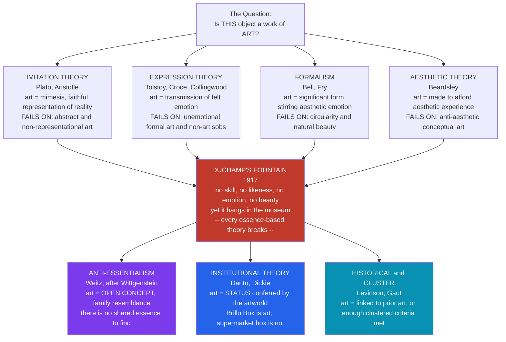

# 🖼️ What Is Art? The Definition Problem

> [!abstract] TL;DR
> "What is art?" looks like a request for a dictionary entry but is one of philosophy's most stubborn puzzles: every proposed essence — imitation, expression, significant form, aesthetic experience — is defeated by a counterexample, and the twentieth century's readymades and Brillo Boxes broke the last of them. The two dominant modern answers abandon the search for an intrinsic essence: **anti-essentialism** (art is an open, family-resemblance concept with no shared core) and the **institutional theory** (art is whatever the "artworld" confers the status of art upon). The question is not idle: it decides what enters the canon, what public money funds, and what censors may ban.

---

## Intuition

**Analogy — the museum puzzle.** You walk into a modern gallery. On one wall hangs a luminous oil landscape: a river, poplars, an evening sky, painted over months by a trained hand. On a plinth nearby sits a white porcelain urinal, turned on its back, signed "R. Mutt 1917." A guard stops you from touching either. Both are labelled, insured, and photographed by tourists. Your gut says the landscape is *obviously* art. But the urinal — mass-produced in a sanitary-ware factory, requiring no skill, depicting nothing, expressing nothing, arguably ugly — is also, according to every curator in the building, art. If you try to explain *why the landscape counts*, every reason you give (it took skill, it looks like something, it's beautiful, it moves me) is a reason the urinal fails. Yet the urinal is in the museum and your kitchen's identical urinal is not.

That gap — between two physically similar objects where one is art and one is plumbing — is the whole problem. It shows that "art" cannot be read off an object's visible properties the way "made of porcelain" can. Something *invisible* is doing the work: a history, a gesture, an institution, a concept. The philosophy of art is the attempt to say what that invisible something is — and two thousand years of trying has not produced a definition everyone accepts.

---

## How It Works

The definitional project runs as a series of **proposals and refutations**. Each theory offers a necessary-and-sufficient condition for "x is a work of art," and each is tested against hard cases. A good definition must be neither **too narrow** (excluding things we confidently call art) nor **too broad** (admitting things we confidently do not). The history of the field is largely the history of counterexamples killing definitions.

1. **Imitation / representation theory (mimesis).** The oldest answer, running from Plato and Aristotle through the Renaissance: art *imitates* reality. A painting is art because it re-presents a visible scene; drama imitates human action. *Refutation:* non-representational art — a Rothko color field, a Bach fugue, ornamental pattern, abstract sculpture — imitates nothing, yet is unquestionably art. The theory is too narrow.
2. **Expression theory.** Art is the *transmission of felt emotion* from artist to audience (Tolstoy: art "infects" others with the artist's feeling; Croce and Collingwood: art is the clarifying *expression*, not mere arousal, of emotion). *Refutation:* much art expresses no emotion (a rigorous fugue, a conceptual grid, a decorative frieze), and plenty of emotional communication is not art (a genuine sob, a threat, propaganda). Too broad *and* too narrow.
3. **Formalism.** What makes an object art is not what it depicts or feels but its **"significant form"** — lines, colors, and volumes arranged so as to stir a special "aesthetic emotion" (Clive Bell, Roger Fry). *Refutation:* the notion is nearly circular (significant form is "the form that produces aesthetic emotion," and aesthetic emotion is "what significant form produces"), and it wrongly admits any pleasingly arranged natural object.
4. **Aesthetic theory.** Art is anything *made with the intention to afford an aesthetic experience* — a rewarding, absorbed, disinterested contemplation (Monroe Beardsley). *Refutation:* readymades and much conceptual art are designed to frustrate aesthetic pleasure and provoke *thought* instead, yet remain art; conversely, sunsets and well-designed sports cars afford intense aesthetic experience without being art.
5. **The anti-essentialist turn.** Morris Weitz (1956), applying Wittgenstein's idea of **family resemblance**, argues the whole project is misconceived: "art" is an **open concept**. There is no set of properties common to *all* artworks, only overlapping, crisscrossing similarities — as members of a family share no single feature but resemble one another in a network. Because art is essentially *creative and expansive*, any closed definition would illegitimately foreclose future art. So: art is undefinable in principle.
6. **The institutional / historical answers.** If art has no visible essence, locate its essence in **relations**, not properties. Arthur Danto: the difference between Warhol's *Brillo Boxes* and the supermarket's identical Brillo boxes is not perceptual but theoretical — an *atmosphere of artistic theory* and a *history of art*, "the artworld," makes one art. George Dickie systematizes this: an artwork is an artifact upon which some person acting on behalf of an artworld institution has conferred *the status of candidate for appreciation*. Jerrold Levinson relocates the essence in **history**: art is anything intended for regard in some way that prior artworks were correctly regarded. Berys Gaut offers a **cluster account**: no single necessary condition, but a checklist of criteria (skill, emotion, form, intellectual challenge, tradition) of which enough must be met.



The diagram encodes the field's actual trajectory: the four classical *essence* theories (top) all crash into the same wall — Duchamp's *Fountain* — and the survivors (bottom) are precisely the theories that stop asking "what property do artworks share?" and start asking "what relation, history, or status makes something art?"

---

## Key Concepts

### Secondary Level

**Why can't we just define it?** A definition names conditions that are *necessary* (every artwork has them) and *sufficient* (anything with them is art). "Art" resists this because for every proposed condition there is a clear artwork that lacks it and a clear non-artwork that has it. Music without imitation, decoration without emotion, a beautiful shell that is not art — each proposal springs a leak.

**Mimesis — the first theory.** For the Greeks, art was *imitation*. Plato distrusted it: a painting of a bed is a copy of a physical bed, which is itself a copy of the eternal Form of Bed — art is thus "at third remove from the truth," and dangerously seductive. Aristotle rehabilitated mimesis in the *Poetics*: imitation is natural to humans, we learn and take pleasure through it, and poetry reveals *universals* (what a person of a certain type would do) rather than mere particulars. Either way, art *is* imitation — a view that held for two millennia and only collapsed when photography and abstraction arrived.

**Duchamp's readymades.** In 1917 Marcel Duchamp submitted a factory-made porcelain urinal, signed "R. Mutt," titled *Fountain*, to an exhibition that had promised to show anything submitted. It was hidden, then lost, then became one of the most influential objects of the century. A **readymade** is an ordinary manufactured object *selected and designated* as art. It severs art from making, from skill, from beauty, from representation — leaving only the *choice* and the *context*. Every later theory of art has to explain why *Fountain* is art.

### Undergraduate Level

**Expression theory and its collapse.** Leo Tolstoy (*What Is Art?*, 1897) held that real art *infects* the audience with the emotion the artist felt — sincerity and communicability are the tests, which led him to reject much of the elite canon (including his own novels) as fake. R. G. Collingwood refined this: art proper is not the *arousal* of emotion (that is craft or amusement) but the *clarifying expression* of an emotion the artist did not fully understand until expressing it. The theory captures something real about lyric poetry and music but cannot be the *definition* of art: it excludes cool conceptual and formal work and includes any vivid emotional outburst.

**Formalism and "significant form."** Clive Bell (*Art*, 1914) sought the property common to all visual art and named it **significant form** — relations of lines and colors that provoke a distinctive "aesthetic emotion." The virtue of formalism is that it explains abstract art and cross-cultural art (a Byzantine mosaic and a Cezanne share form, not subject). Its fatal flaw is *circularity*: significant form is defined by the aesthetic emotion, and the aesthetic emotion by significant form, with no independent grip on either. It also over-includes: a perfectly arranged flower bed has significant form but is not art.

**Weitz and the open concept.** Morris Weitz's 1956 paper "The Role of Theory in Aesthetics" is the field's hinge. Borrowing Wittgenstein's *family resemblance* (games share no single defining feature — some are competitive, some solo, some for fun, some for money — only overlapping similarities), Weitz argues "art" is an **open concept**: its conditions of application are perpetually revisable because art is inherently innovative. Any closed definition would rule out the next avant-garde move *a priori*, which is absurd. His conclusion: stop defining art; instead, examine how the concept actually functions and what makes particular works good.

**Danto and the artworld.** Arthur Danto's "The Artworld" (1964) and *The Transfiguration of the Commonplace* (1981) confront the ultimate case: Warhol's *Brillo Boxes* (1964) are visually near-identical to the supermarket cartons. If two things look exactly alike and one is art and one is not, the difference *cannot* be perceptual. Danto locates it in an **atmosphere of theory and a history of art** — "the artworld" — that transfigures the commonplace object into a vehicle of meaning. Art, for Danto, is *about* something and *embodies* its meaning; the Brillo Box is a statement about art, commerce, and representation that a warehouse carton is not.

### Graduate Level

**Dickie's institutional theory — the classic and revised versions.** George Dickie converts Danto's insight into a definition. Early version: a work of art is (1) an *artifact* (2) upon which some society or subgroup *acting on behalf of the artworld* has conferred the status of *candidate for appreciation*. The status is conferred the way a chairman "opens" a meeting or a minister pronounces a couple married — a **performative** act, not a discovery of hidden properties. Objections poured in: the account looks *circular* (the artworld is defined by making art, art by the artworld), *empty* (it tells us the status is conferred but not on what basis), and it seems to make bad or trivial designations automatically successful. Dickie's *revised* (1984) theory replaces "candidate for appreciation" with a deliberately **circular cluster of interdefined terms** (artist, artwork, public, artworld, artworld system) and *embraces* the circularity as revealing art's genuinely institutional, self-referential nature — art is an inherently social, rule-governed practice, like money or promising.

**Historical definitions — Levinson.** Jerrold Levinson objects that institutions are too thin and locates the essence in **intentional-historical** relations: something is art if it is intended by its maker for regard-as-a-work-of-art, i.e., in *any of the ways prior artworks were correctly regarded*. This elegantly handles novelty (new art connects backward to old art without needing shared visible properties) and privately made art (a hermit's carvings can be art with no institution present). The hard problem is the **first art** — the "bootstrapping" or ur-art problem: if art is defined by reference to previous art, how did the very first artwork qualify? Levinson answers with a designated set of initial artworks, but critics find this ad hoc.

**Cluster and disjunctive accounts.** Berys Gaut's **cluster account** abandons necessary conditions entirely: there is a list of criteria (possessing positive aesthetic qualities; being expressive of emotion; being intellectually challenging; being formally complex and coherent; exhibiting an individual point of view; being the product of a high degree of skill; belonging to an established art form; being the product of an intention to make art), and an object is art if it satisfies *enough* of them — with no single one required. This matches how the concept behaves but risks vagueness about "enough." Related **disjunctive** and **functional-vs-procedural** distinctions (does art *do* something aesthetic, or is it *made through* an art-conferring procedure?) organize the contemporary debate; most theorists now accept some hybrid.

**Why the debate is not merely academic.** The definition is *load-bearing* in practice. It sets the **canon** (what museums collect, universities teach, and cultures preserve). It governs **funding**: public arts bodies must decide what counts as art to justify grants, and the definition can be weaponized in "culture war" disputes over provocative work. It shapes **law and censorship**: obscenity and free-speech rulings (e.g., the U.S. *Miller* test's "serious artistic value" prong) hang an object's legal protection on whether it is art. And it decides **market and property**: customs, tax, and import rules treat "works of art" specially — a famous 1928 U.S. customs case, *Brancusi v. United States*, litigated whether an abstract bronze was duty-free art or a taxable manufacture of metal. Definitions have consequences.

---

## Python Demo

We build a toy "art classifier." Each candidate object is a feature vector over five properties the classical theories care about — **imitation, expression, form, institutional-status, skill**. Each *theory* is a weighting of those features plus a threshold: an object is "art *according to that theory*" if its weighted score clears the bar. We add an anti-essentialist **family-resemblance** row that classifies by *similarity to paradigm artworks* rather than by any single property. The heatmap makes the moral vivid: the *same object* is art under one theory and not-art under another. "What is art" is not a fact about the object alone — it is relative to the definition you adopt.

```python
# Scores four candidate objects against six theories of art and plots a heatmap.
# numpy + matplotlib only. The point: classification depends on the DEFINITION chosen.
import numpy as np
import matplotlib.pyplot as plt

# --- Feature space: how strongly each object exhibits each property (0..1) ---
FEATURES = ["Imitation", "Expression", "Form", "Institutional", "Skill"]
OBJECTS = {
    "Landscape\nPainting":  [0.90, 0.60, 0.80, 0.85, 0.90],  # canonical fine art
    "Duchamp's\nFountain":  [0.10, 0.30, 0.40, 0.95, 0.10],  # readymade: only status
    "Child's\nDrawing":     [0.40, 0.85, 0.30, 0.10, 0.20],  # sincere expression, no status
    "A Real\nSunset":       [0.05, 0.00, 0.85, 0.00, 0.00],  # natural beauty, no maker
}
obj_names = list(OBJECTS.keys())
X = np.array([OBJECTS[o] for o in obj_names])           # objects x features

# --- Essence theories as (weight-over-features). Score = normalized weighted sum. ---
THEORY_WEIGHTS = {
    "Imitation\n(Plato/Aristotle)": [1.0, 0.0, 0.0, 0.0, 0.4],
    "Expression\n(Tolstoy)":        [0.0, 1.0, 0.0, 0.0, 0.1],
    "Formalism\n(Bell)":            [0.0, 0.0, 1.0, 0.0, 0.1],
    "Aesthetic\n(Beardsley)":       [0.0, 0.1, 0.9, 0.0, 0.2],
    "Institutional\n(Dickie/Danto)":[0.0, 0.0, 0.0, 1.0, 0.0],
}
THRESHOLD = 0.50

def score_essence(weights, feats):
    w = np.array(weights, dtype=float)
    w = w / w.sum()                      # normalize so scores are comparable 0..1
    return float(w @ feats)

# --- Anti-essentialist family resemblance (Weitz): similarity to paradigm artworks ---
# No single defining feature; art if it resembles some accepted artwork closely enough.
PARADIGMS = np.array([
    [0.90, 0.60, 0.80, 0.85, 0.90],     # a landscape painting
    [0.85, 0.50, 0.90, 0.90, 0.95],     # a classical marble sculpture
])
def cosine(a, b):
    return float(a @ b / (np.linalg.norm(a) * np.linalg.norm(b) + 1e-9))
def score_family(feats):
    return max(cosine(np.array(feats), p) for p in PARADIGMS)  # nearest paradigm

# --- Build the score matrix: theories (rows) x objects (cols) ---
theory_names = list(THEORY_WEIGHTS.keys()) + ["Family Resemblance\n(Weitz)"]
S = np.zeros((len(theory_names), len(obj_names)))
for j, o in enumerate(obj_names):
    for i, t in enumerate(THEORY_WEIGHTS):
        S[i, j] = score_essence(THEORY_WEIGHTS[t], OBJECTS[o])
    S[-1, j] = score_family(OBJECTS[o])

# --- Plot heatmap with ART / not-art verdicts annotated ---
fig, ax = plt.subplots(figsize=(9, 6.5))
im = ax.imshow(S, cmap="RdYlGn", vmin=0.0, vmax=1.0, aspect="auto")

ax.set_xticks(range(len(obj_names)));   ax.set_xticklabels(obj_names, fontsize=9)
ax.set_yticks(range(len(theory_names))); ax.set_yticklabels(theory_names, fontsize=9)
ax.set_title("Is it ART? Same objects, different verdicts by theory\n"
             "(green = counts as art, red = does not; threshold = %.2f)" % THRESHOLD,
             fontsize=11, fontweight="bold")

for i in range(len(theory_names)):
    for j in range(len(obj_names)):
        verdict = "ART" if S[i, j] >= THRESHOLD else "not"
        ax.text(j, i, f"{S[i,j]:.2f}\n{verdict}",
                ha="center", va="center", fontsize=8,
                color="black" if 0.30 < S[i, j] < 0.75 else "white")

cbar = fig.colorbar(im, ax=ax, shrink=0.85)
cbar.set_label("Weighted 'art-ness' score under the theory", fontsize=9)
plt.tight_layout()
plt.savefig("what_is_art_heatmap.png", dpi=120, bbox_inches="tight")
plt.show()

# --- Console summary: which theory calls each object art? ---
print("Object            |  theories that count it as ART")
print("-" * 60)
for j, o in enumerate(obj_names):
    winners = [theory_names[i].split("\n")[0] for i in range(len(theory_names))
               if S[i, j] >= THRESHOLD]
    print(f"{o.replace(chr(10),' '):17s} |  {', '.join(winners) if winners else 'NONE'}")
```

**Expected output (approximate):**

```
Object            |  theories that count it as ART
------------------------------------------------------------
Landscape Painting |  Imitation, Expression, Formalism, Aesthetic, Institutional, Family Resemblance
Duchamp's Fountain |  Institutional
Child's Drawing    |  Expression
A Real Sunset      |  Formalism, Aesthetic
```

The demo dramatizes the whole chapter. The **landscape** is over-determined — every theory calls it art, which is why it feels *obviously* art. **Fountain** is art under *institutional theory alone*: it has status but no skill, likeness, emotion, or beauty — exactly why it broke the classical theories. The **child's drawing** counts only under *expression* theory (sincere feeling, no institutional standing) — capturing the intuition that it is "art" in a private sense but not gallery art. And the **sunset** counts under *formalism* and *aesthetic* theory but *not* institutional — reproducing the textbook objection that beauty-based definitions wrongly annex natural phenomena, which the institutional theory correctly excludes because nature has no artworld status and no maker.

---

## Real-World Applications

**Museum and biennial curation.** Every acquisition decision is an applied answer to "what is art." When the Tate acquires a pile of bricks (Carl Andre's *Equivalent VIII*) or an unmade bed (Tracey Emin's *My Bed*), the institution is *conferring* art status in exactly the way Dickie describes — and the ensuing public outrage ("my child could do that," "that's just a bed") is the collision between institutional and skill/beauty-based folk definitions.

**Arts funding and policy.** Public bodies (national endowments, arts councils, city cultural budgets) must operationalize a definition to allocate money and justify it to taxpayers. The 1989–1990 U.S. controversy over National Endowment for the Arts grants to Robert Mapplethorpe and Andres Serrano turned a definitional-and-value dispute into a congressional fight over whether provocative work is "art" deserving public support.

**Censorship and obscenity law.** Legal systems must distinguish protected art from unprotected obscenity or hate speech. The U.S. Supreme Court's *Miller v. California* (1973) test asks, in part, whether a work "taken as a whole, lacks serious literary, artistic, political, or scientific value" — hanging free-speech protection on an aesthetic judgment. Definitions of art thereby become instruments of liberty.

**Trade, tax, and customs.** *Brancusi v. United States* (1928) forced a court to rule whether Constantin Brancusi's abstract bronze *Bird in Space* was a duty-free "work of art" or a taxable "manufactured metal object"; the court's decision to admit that non-representational abstraction can be art carried real financial and precedential weight. Customs codes worldwide still maintain special categories for "works of art."

**Generative AI and authorship.** The debate has a new frontier: is an image produced by a diffusion model a work of art, and who (if anyone) is the artist? Institutional and intentional-historical theories are being stress-tested — the U.S. Copyright Office has denied registration to purely machine-generated images for lacking human authorship, effectively deploying a definition of art-as-authored-artifact to decide legal status.

---

## Common Pitfalls

- **Confusing "is it art?" with "is it good art?"** These are different questions. *Fountain* can be art (a classification) and, to your taste, worthless (an evaluation). Most bar-room arguments about whether something is "really art" are actually disguised value judgments; separating the *classificatory* from the *evaluative* sense of "art" dissolves much of the heat.
- **Treating the institutional theory as elitist gatekeeping.** Dickie's "artworld" is not a cabal of critics deciding what is good; it is the loose, decentralized *practice* (artists, galleries, audiences, critics, historians) within which the *status* is conferred. It explains *how* something becomes art, not *whether* it deserves praise, and it is descriptively neutral, not a snob's veto.
- **Reading mimesis as naive "copying."** Even the imitation theorists did not mean photographic duplication. Aristotle's mimesis represents *universals* and *possible* action, idealizing and selecting; the caricature that mimesis means "art must look exactly like its subject" makes the theory easier to dismiss than it deserves.
- **Assuming anti-essentialism ends the debate.** Weitz's open-concept argument is powerful but not decisive: institutional and historical definitions accept that artworks share no *visible* essence yet locate a *relational* essence (status, or a link to prior art), which sidesteps the family-resemblance objection. "There's no definition" is itself a contested position, not the consensus.
- **Forgetting the first-art (bootstrapping) problem.** Historical definitions ("art relates to prior art") and institutional ones ("art needs an artworld") both owe an account of how the *very first* artworks or the *first* artworld got started without pre-existing art to refer to. Any purely relational definition must answer this or admit a designated ur-set.
- **Universalizing a Western, post-Renaissance concept.** The very category "fine art" (art as autonomous objects for disinterested contemplation, separate from craft and ritual) is historically local — largely an 18th-century European construction (Kristeller's "modern system of the arts"). Applying it flatly to masks, icons, calligraphy, or ritual objects from other cultures can distort what those objects *were made to do*.

---

## Related Concepts

*(Companion notes planned for this section — Beauty_and_Taste and Art_Institutions — will expand the aesthetic-value and artworld-institution threads touched on here.)*

- [[Plato_and_the_Theory_of_Forms]] — Plato's demotion of art as mimesis "three removes from the truth" is the origin of the imitation theory and the first philosophical attack on art's cognitive worth
- [[Aristotle]] — Aristotle's rehabilitation of mimesis (imitation as natural, pleasurable, and knowledge-yielding) sets the imitation theory's most defensible form
- [[Aristotles_Poetics_and_Drama]] — the *Poetics* is the founding text of mimesis-as-representation and directly frames the Plato-versus-Aristotle debate on whether art copies or reveals
- [[Literary_Theory_Overview]] — the anti-essentialist and institutional turns in art theory parallel literary theory's move from "what is literature?" (intrinsic properties) to the institutions and conventions of reading
- [[New_Criticism_and_Close_Reading]] — literary formalism (the autonomous "verbal icon," attention to form over author intent) is the textual cousin of Bell and Fry's "significant form" in visual art
- [[Marx_and_Critical_Theory]] — the Frankfurt School's treatment of art as embedded in institutions, ideology, and the culture industry gives the institutional theory its sociological depth and its critical edge
- [[Kant_and_the_Copernican_Turn]] — background on Kant's critical philosophy; his *Critique of the Power of Judgment* (the third Critique, not covered in that note) founded the disinterested-pleasure tradition of aesthetic experience that Beardsley's aesthetic definition descends from

---

## Review Questions

### Secondary
1. Two objects sit side by side in a gallery: a hand-painted landscape and a signed factory urinal. Give three reasons someone might say the landscape "is really art" and the urinal is not — then show how the urinal's defenders would answer each reason.
2. What is a "readymade," and why did Duchamp's *Fountain* cause a crisis for older ideas about what art is? Which property that people usually associate with art does it most obviously lack?

### Undergraduate
1. State the imitation, expression, and formalist theories as necessary-and-sufficient definitions, then give one counterexample that is "too narrow" and one that is "too broad" for each. What general lesson about defining art do these failures teach?
2. Explain Weitz's claim that "art" is an *open concept* using Wittgenstein's family-resemblance idea. Does the institutional theory escape Weitz's objection, or does it merely relocate the essence? Defend your answer.
3. Danto says the difference between Warhol's *Brillo Box* and a supermarket carton is not perceptual. If not perceptual, what is it? Reconstruct his "artworld" answer and identify one thing it leaves unexplained.

### Graduate
1. Dickie's institutional theory has been charged with vicious circularity and emptiness. Present the strongest version of each objection, then present Dickie's revised (1984) response that *embraces* the circularity. Is the embrace a defense or a concession?
2. Compare the institutional definition (Dickie) with the intentional-historical definition (Levinson). How does each handle (a) radically novel avant-garde work and (b) art made in isolation with no institution present? Which faces the harder version of the first-art bootstrapping problem, and why?
3. "The question 'what is art?' is not merely academic — it is a question about power." Evaluate this claim using at least two of: canon formation, public arts funding, obscenity/censorship law, and customs/tax classification (e.g., *Brancusi v. United States*). Does a *purely descriptive* institutional definition adequately account for these normative stakes?

---

## Sources

- [Weitz, M. (1956). "The Role of Theory in Aesthetics." *Journal of Aesthetics and Art Criticism* 15(1), 27–35.](https://www.jstor.org/stable/427491)
- [Danto, A. (1981). *The Transfiguration of the Commonplace: A Philosophy of Art*. Harvard University Press.](https://www.hup.harvard.edu/books/9780674903463)
- [Dickie, G. (1984). *The Art Circle: A Theory of Art*. Haven Publications.](https://www.worldcat.org/title/art-circle-a-theory-of-art/oclc/10726887)
- [Adajian, T. "The Definition of Art." *Stanford Encyclopedia of Philosophy* (2022 ed.).](https://plato.stanford.edu/entries/art-definition/)
- [Levinson, J. (1979). "Defining Art Historically." *British Journal of Aesthetics* 19(3), 232–250.](https://academic.oup.com/bjaesthetics/article-abstract/19/3/232/16893)
- [Tolstoy, L. (1897). *What Is Art?* (trans. A. Maude).](https://www.gutenberg.org/ebooks/64908)

---

#aesthetics #definition-of-art #institutional-theory #philosophy-of-art
