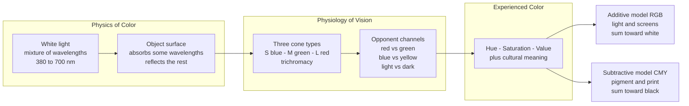

# 🎨 Color Theory

> [!abstract] TL;DR
> Color is not a property of objects but a **three-way collaboration** between physics (which wavelengths of light reach the eye), physiology (how three cone types and their opponent channels encode that light), and psychology (the meanings and relationships the mind assigns). Color theory is the practical grammar built on top of this: a way to organize hue, saturation, and value on a wheel so that artists and designers can predict how colors will mix, clash, harmonize, and change one another when placed side by side.

---

## Intuition

**Analogy: color is a chord, not a single note.** A musician does not judge a note as "good" or "bad" in isolation — a C sounds tense over an F chord and restful over a C chord. Color works the same way. There is no such thing as a "nice" red in the abstract; a red glows against green, muddies against orange, and looks almost brown when surrounded by pink. Josef Albers built an entire course around this one fact: **color is the most relative medium in art.** What you see is never the pigment on the surface — it is that pigment as *re-tuned by its neighbors and its light*.

Push the analogy one step further. Just as a chord has three describable dimensions — which notes (pitch), how loud (volume), how bright the timbre — every color has three: **hue** (which color family — the "note"), **saturation** (how pure versus grayed — the "richness"), and **value** (how light or dark — the "brightness"). Master those three dials and the whole subject becomes navigable.

---

## How It Works

### From wavelength to sensation

1. **Physics — the stimulus.** Visible light is electromagnetic radiation between roughly 380 nm (violet) and 700 nm (red). A red apple is not "red"; it *absorbs* the short and middle wavelengths and *reflects* the long ones. Color begins as a spectral power distribution — how much energy sits at each wavelength — shaped by the light source and the surface. This is the domain of dispersion: a prism splits white light because each wavelength bends by a different amount. See [[Polarization_and_Dispersion]].
2. **Physiology — the sensor.** The retina holds three cone types tuned to **S**hort (blue), **M**edium (green), and **L**ong (red) wavelengths. This is **trichromacy**: the eye collapses an infinite spectrum into just three numbers. A crucial consequence is **metamerism** — two physically different spectra that excite the three cones identically look *identical*. This is the loophole that makes RGB screens possible.
3. **Neural encoding — opponent process.** The three cone signals are immediately recombined into three **opponent channels**: red-versus-green, blue-versus-yellow, and light-versus-dark. This is why you can imagine a "reddish yellow" (orange) but never a "reddish green" — those hues cancel on the same axis. It also explains **afterimages**: stare at red, fatigue the red-green channel, look away, and it rebounds into green. See [[Visual_System_and_Visual_Cortex]] and [[Sensation_and_Perception]].
4. **Psychology — the meaning.** The bound percept carries learned and cultural associations: red as danger or love, blue as calm or corporate trust, white as purity in one culture and mourning in another.

### The three dimensions of color

Every color model is just a different geometry over the same three dials:

- **Hue** — position on the color wheel (angle), the wavelength-like identity: red, orange, yellow, green, blue, violet.
- **Saturation / Chroma** — purity or intensity; how far from gray. High chroma = vivid; low = muted, "grayed."
- **Value / Lightness / Brightness** — how light or dark. In **HSV** and **HSL** this is a separate axis; the **Munsell system** (1905) was the first to space these three perceptually so that equal steps *look* equal.

### The color wheel

- **Primary** colors cannot be mixed from others *within a given system* (in RYB pigment: red, yellow, blue).
- **Secondary** = two primaries mixed (orange, green, violet).
- **Tertiary** = a primary mixed with an adjacent secondary (red-orange, yellow-green, etc.).

### Additive vs subtractive mixing

The single most important distinction in the whole subject:

- **Additive (light) — RGB.** Start from black; *add* colored light. Red + Green + Blue light = **white**. This governs screens, stage lighting, and the eye itself.
- **Subtractive (pigment) — CMY (and the traditional RYB).** Start from white paper; each pigment *subtracts* wavelengths. Cyan + Magenta + Yellow ink → toward **black**. This governs paint, ink, and print.

### Color harmony and contrast

Harmony schemes are geometric relationships on the wheel: **complementary** (opposite), **split-complementary**, **analogous** (adjacent), **triadic** (120° apart), **tetradic** (two complementary pairs), and **monochromatic** (one hue, varied value/saturation). **Simultaneous contrast** (Chevreul, 1839) and Albers' *Interaction of Color* (1963) describe how each color pushes its neighbor toward its own complement.



---

## Key Concepts

### Secondary (high-school foundation)

- The **color wheel** and the primary / secondary / tertiary structure.
- **Warm colors** (reds, oranges, yellows) advance and feel energetic; **cool colors** (blues, greens, violets) recede and feel calm.
- Mixing **paint** is different from mixing **light**: paints get darker and muddier as you combine them; lights get brighter and paler.
- Basic harmony: complementary pairs (opposite on the wheel) create maximum contrast and "pop."

### Undergraduate (working artist / designer)

- **HSV / HSL** color spaces and why **value** control, not hue choice, does most of the compositional work.
- **Additive (RGB) vs subtractive (CMY) mixing** and why the same design looks different on screen versus in print.
- Full **harmony schemes**: split-complementary, analogous, triadic, tetradic, monochromatic — and when each is appropriate.
- **Color temperature** measured in Kelvin (warm ~2700 K incandescent, cool ~6500 K daylight) and how it shifts the perceived hue of every pigment.
- **Simultaneous contrast** and **afterimages** — Chevreul's tapestry problem and Albers' teaching that "one color evokes many readings."
- **Color gamut**: the finite triangle of colors a device can reproduce; why saturated cyans and greens on screen cannot be printed.

### Graduate (colorimetry and perception science)

- **CIE 1931 XYZ** and the chromaticity diagram: a device-independent, mathematically-grounded map of all human-visible color built from tristimulus matching functions.
- **Metamerism** and its practical curse: matches that hold under one illuminant break under another.
- **Color appearance models** (CIECAM) accounting for adaptation, surround, and the Bezold-Brücke and Abney effects, where perceived hue shifts with intensity and added white.
- **Perceptual uniformity** — why RGB and HSV are *not* uniform, and why CIELAB / Munsell were engineered so that Euclidean distance approximates perceived difference.
- **Retinex theory** (Edwin Land): color constancy as the brain's estimate of *surface reflectance*, discounting the illuminant — the same computation modern white-balance algorithms perform.

---

## Python Demo

```python
# Color theory in code: an HSV color wheel, the three main harmony schemes,
# and a side-by-side of additive (RGB light) vs subtractive (CMY pigment) mixing.
# Dependencies: numpy, matplotlib only.
import numpy as np
import matplotlib.pyplot as plt
from matplotlib.colors import hsv_to_rgb

# ----------------------------------------------------------------------
# 1. Build an HSV color wheel: angle = hue, radius = saturation, value = 1
# ----------------------------------------------------------------------
size = 512
yy, xx = np.mgrid[-1:1:size * 1j, -1:1:size * 1j]
radius = np.sqrt(xx ** 2 + yy ** 2)
angle = np.arctan2(yy, xx)                       # range -pi .. pi

H = (angle / (2 * np.pi)) % 1.0                  # hue from angle -> [0, 1)
S = np.clip(radius, 0.0, 1.0)                    # saturation from radius
V = np.ones_like(H)                              # full brightness
wheel = hsv_to_rgb(np.dstack([H, S, V]))
wheel[radius > 1.0] = 1.0                         # paint outside the disk white

# ----------------------------------------------------------------------
# 2. Harmony schemes: pick a base hue, derive complementary / analogous / triadic
#    Hue is on the [0,1) circle, so relationships are modular arithmetic.
# ----------------------------------------------------------------------
base = 0.02                                       # a warm red
def swatches(hues):
    return hsv_to_rgb(np.array([[[h % 1.0, 0.85, 0.95] for h in hues]]))[0]

complementary = swatches([base, base + 0.5])                 # opposite hue
analogous     = swatches([base - 1/12, base, base + 1/12])   # adjacent hues
triadic       = swatches([base, base + 1/3, base + 2/3])     # 120 deg apart

# ----------------------------------------------------------------------
# 3. Additive (light, RGB) vs subtractive (pigment, CMY) mixing
#    Additive: start at black, ADD light  -> component-wise sum toward white.
#    Subtractive: start at white, each pigment MULTIPLIES a reflectance mask.
# ----------------------------------------------------------------------
R, G, B = [1, 0, 0], [0, 1, 0], [0, 0, 1]
add_pairs = {
    "R+G = Yellow":  np.clip(np.add(R, G), 0, 1),
    "G+B = Cyan":    np.clip(np.add(G, B), 0, 1),
    "R+B = Magenta": np.clip(np.add(R, B), 0, 1),
    "R+G+B = White": np.clip(np.add(np.add(R, G), B), 0, 1),
}
# Reflectances: cyan pigment reflects G,B (absorbs R); magenta reflects R,B; yellow reflects R,G
C_p, M_p, Y_p = [0, 1, 1], [1, 0, 1], [1, 1, 0]
sub_pairs = {
    "C*M = Blue":    np.multiply(C_p, M_p),
    "C*Y = Green":   np.multiply(C_p, Y_p),
    "M*Y = Red":     np.multiply(M_p, Y_p),
    "C*M*Y = Black": np.multiply(np.multiply(C_p, M_p), Y_p),
}

# ----------------------------------------------------------------------
# Render everything
# ----------------------------------------------------------------------
fig = plt.figure(figsize=(12, 8))

ax = fig.add_subplot(2, 3, 1)
ax.imshow(wheel, extent=[-1, 1, -1, 1]); ax.set_title("HSV Color Wheel"); ax.axis("off")

for idx, (name, cols) in enumerate([("Complementary", complementary),
                                    ("Analogous", analogous),
                                    ("Triadic", triadic)]):
    ax = fig.add_subplot(2, 3, idx + 2)
    ax.imshow(cols[np.newaxis, :, :], aspect="auto")
    ax.set_title(f"{name} harmony"); ax.set_xticks([]); ax.set_yticks([])

def bar(ax, mapping, title):
    for i, (label, rgb) in enumerate(mapping.items()):
        ax.bar(i, 1, color=np.clip(rgb, 0, 1), width=0.9)
        ax.text(i, 0.5, label, ha="center", va="center", rotation=90,
                color="white" if np.mean(rgb) < 0.5 else "black", fontsize=8)
    ax.set_title(title); ax.set_xticks([]); ax.set_yticks([])

bar(fig.add_subplot(2, 3, 5), add_pairs, "Additive mixing (RGB light)")
bar(fig.add_subplot(2, 3, 6), sub_pairs, "Subtractive mixing (CMY pigment)")

plt.tight_layout()
plt.savefig("color_theory_demo.png", dpi=110)
print("Saved color_theory_demo.png")
print("Additive R+G+B ->", add_pairs["R+G+B = White"], "(white)")
print("Subtractive C*M*Y ->", sub_pairs["C*M*Y = Black"], "(black)")
```

Running it produces a color wheel, three harmony strips, and two mixing panels — a compact, visual proof that adding light climbs toward white while layering pigment sinks toward black.

---

## Real-World Applications

- **Screens and cameras (RGB).** Every phone, monitor, and TV exploits **trichromacy and metamerism**: three subpixels of light can fake the entire visible gamut because the eye only samples three cone responses.
- **Print and packaging (CMYK).** The extra **K** (black) is a subtractive-mixing fix: real CMY inks mix to a muddy brown, not true black, so a dedicated black plate restores depth and saves ink.
- **Brand and UI design.** Complementary and split-complementary palettes drive call-to-action contrast; accessible design tools enforce **value/luminance contrast ratios** (WCAG) because color-blind users rely on value, not hue.
- **Film and photography.** **Color temperature** and white balance let a cinematographer make a scene feel warm and nostalgic (2700 K) or cold and clinical (6500 K); "teal-and-orange" grading is literally a complementary scheme applied to skin tones.
- **Painting.** Impressionists placed small strokes of **broken color** side by side so the eye mixes them optically (partial additive mixing), yielding luminosity flat pigment mixing kills; the **Fauves** used non-local, high-chroma color for emotional impact over description.

---

## Common Pitfalls

- **Treating color as absolute.** The single biggest beginner error: judging a swatch in isolation. Simultaneous contrast means the *same* gray looks warm on blue and cool on orange — always evaluate color in its final context.
- **Confusing the two mixing models.** Expecting paint to behave like light. Blue + yellow *paint* gives green (subtractive), but blue + yellow *light* gives near-white. RYB, RGB, and CMY are different systems with different "primaries."
- **Ignoring value.** Chasing pretty hues while all values are similar produces a composition that reads as mush in grayscale. Value structure carries the image; hue is decoration on top.
- **Gamut and calibration surprises.** Designing in vivid on-screen RGB, then printing to a smaller CMYK gamut, dulls the saturated greens and blues. Soft-proof and calibrate before committing.
- **Over-saturation.** Maxing chroma everywhere destroys hierarchy — nothing pops when everything shouts. Muted colors need a few saturated accents to sing.
- **Assuming universal symbolism.** Red means luck in China and danger in the West; white signals weddings in Europe and mourning in parts of Asia. Color meaning is cultural, not innate.

---

## Related Concepts

- [[Polarization_and_Dispersion]] — the physics of how white light splits into a spectrum by wavelength; the objective side of color.
- [[Visual_System_and_Visual_Cortex]] — the retina-to-cortex pathway, cone phototransduction, and area V4's role in color perception.
- [[Sensation_and_Perception]] — trichromatic and opponent-process theories, color constancy, and color-vision deficiencies.
- [[Visual_Cognition]] — how color is bound to objects as one feature among many, and how attention integrates it.
- [[Image_Representations]] — RGB and HSV color spaces, channels, and color as numerical data in computer vision.

---

## Review Questions

1. **(Recall / conceptual)** Name the three dimensions used to describe any color and explain what physically or perceptually each one corresponds to. Why can HSV and Munsell describe the *same* color differently?
2. **(Application / scenario)** A designer's logo looks vivid and electric on a website but dull and muddy once printed on a brochure. Using additive vs subtractive mixing and the idea of gamut, explain exactly why — and what step in the workflow should catch this before production.
3. **(Analysis / trade-off)** Opponent-process theory predicts you can never see a "reddish-green." Explain the neural mechanism behind this, connect it to why staring at a red square produces a green afterimage, and describe how Chevreul's simultaneous contrast is a *spatial* version of the same principle.

---

## Sources

- Albers, Josef. *Interaction of Color*. Yale University Press, 1963 (50th Anniversary ed., 2013).
- Itten, Johannes. *The Art of Color: The Subjective Experience and Objective Rationale of Color*. Wiley, 1961.
- Chevreul, Michel Eugène. *The Principles of Harmony and Contrast of Colors and Their Applications to the Arts*, 1839 (English ed., 1854).
- Fairchild, Mark D. *Color Appearance Models*, 3rd ed. Wiley, 2013.
- [Munsell Color System — overview and history](https://munsell.com/about-munsell-color/how-color-notation-works/)

---

#aesthetics #color-theory #color #hue #harmony
