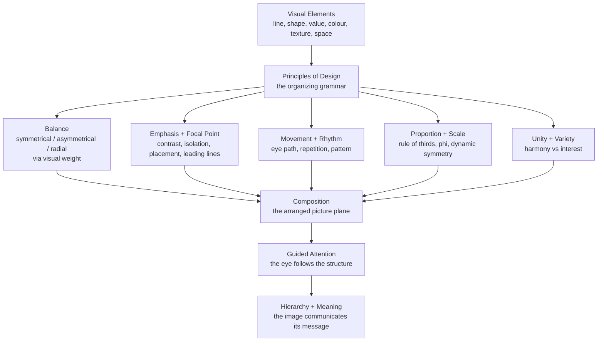

# 🎨 Composition and Design Principles

> [!abstract] TL;DR
> **Composition** is the deliberate arrangement of visual elements — line, shape, value, colour, texture, and space — inside the boundary of a picture. The **principles of design** (balance, emphasis, movement, rhythm, proportion, unity, and hierarchy) are the organizing rules that turn a pile of elements into a coherent image that guides the eye and carries meaning. Devices like the rule of thirds, the golden ratio, and triangular composition are *heuristics* for placing the eye, not physical laws — powerful when they serve intent, empty when applied as superstition.

---

## Intuition

**Analogy: composition is stage directing, not scene painting.** Imagine you are directing a play. The actors, props, and lighting are your *visual elements* — each already interesting on its own. But an audience does not experience a list of actors; it experiences where you *place* them. Put the lead downstage-left under a spotlight and everyone looks there first. Cluster the supporting cast to balance the empty right side of the stage. Make a diagonal line of bodies and the audience's eye slides along it toward the door where the villain will enter. Nothing on stage changed; only the *arrangement* did — and the arrangement is what tells the story.

A picture works the same way. The painter or photographer is a director of the viewer's gaze. Composition decides what the eye hits first, where it travels next, and what it rests on last. The principles of design are the director's toolkit for controlling that journey without the viewer ever noticing they were steered.

---

## How It Works

### Elements versus principles

There are two vocabularies. The **elements** are the *nouns* — the raw stuff on the surface: line, shape, form, value (light/dark), colour, texture, and space (positive and negative). The **principles** are the *grammar* — the ways those nouns get organized: balance, emphasis, movement, rhythm and repetition, pattern, proportion and scale, unity and variety, harmony, and hierarchy. You cannot see a principle directly; you see elements arranged *according to* a principle.

### The picture plane, format, and cropping

Everything happens on the **picture plane** — the flat 2D field bounded by the frame. The frame's **format** (portrait, landscape, square, panorama) is itself a compositional decision: a tall format lifts the eye and suggests grandeur or growth; a wide format spreads it and suggests calm or narrative sweep. **Cropping** decides what stays inside the frame and what is cut, and where the subject sits relative to the edges. Because the eye reads the edge as a hard boundary, placement *relative to that edge* is where most compositional tension lives.

### The core principles

1. **Balance** — the distribution of **visual weight** across the plane. Weight is not physical mass; it is optical pull, driven by size, darkness, saturation, complexity, isolation, and position (things near the edge and things high in the frame feel heavier). Balance comes in three flavours: **symmetrical** (mirror weight around an axis — stable, formal, sometimes static), **asymmetrical** (unequal elements arranged so their weights offset like a lever — dynamic, more interesting), and **radial** (weight radiating from a centre, as in a rose window or mandala).
2. **Emphasis and focal point** — the one place the eye goes first. Created by **contrast** (a bright spot in a dark field), **isolation** (one object separated from a crowd), **placement** (on a strong intersection), and **leading lines** (edges, roads, gazes that funnel the eye inward).
3. **Movement and visual path** — the route the eye travels through the image. Good composition builds an *eye flow*, often a loop, that keeps the viewer circulating rather than sliding off the edge.
4. **Rhythm, repetition, and pattern** — repeated elements create visual beat; regular repetition becomes **pattern**; varied repetition creates rhythm that carries the eye like a melody.
5. **Proportion and scale** — the relative size of parts to each other and to the whole. This is where the famous ratios live: the **rule of thirds**, the **golden ratio** phi, and Hambidge's **dynamic symmetry** (root rectangles and the whirling-square construction that yields the **Fibonacci spiral**).
6. **Unity and variety** — unity makes the parts feel like one thing (through harmony, repetition, proximity); variety keeps it from being boring. Great composition is the tension between the two.
7. **Hierarchy** — the ordered ranking of importance, so the eye reads primary, secondary, and tertiary elements in the intended sequence. Hierarchy is emphasis applied across the *whole* image at once.

### How this connects to perception

Composition is powerful because it exploits how vision actually works. **Gestalt principles** — proximity, similarity, closure, continuity, common fate, figure/ground — describe how the visual system automatically groups elements into wholes, and every one of them is a compositional lever (grouping by proximity creates unity; a break in continuity creates a focal point). The classic **positive/negative space** relationship is simply the figure/ground distinction: the "empty" negative space is an active shape that a composer sculpts as deliberately as the subject. These perceptual grouping rules are treated in depth in the sibling note *Line_Shape_and_Form* and in the psychology of perception; see the graduate tier for the empirical debate.



---

## Key Concepts

### Secondary (explainable to a beginner)
- **Composition** is *where you put things* in a picture; the principles are the rules for arranging them well.
- **Balance**: symmetrical feels calm and formal; asymmetrical feels lively; radial spins around a centre.
- **Rule of thirds**: divide the frame into a 3x3 grid; place important things on the lines or their four crossing points ("power points") instead of dead centre.
- **Focal point**: the one spot the eye is supposed to land first, made to stand out by contrast or isolation.
- **Positive and negative space**: the subject *and* the empty area around it are both shapes — the "empty" part is not wasted, it does work.
- **Pattern and repetition**: repeating shapes create unity and a visual beat.

### Undergraduate (needs some background)
- **Visual weight** can be estimated: larger, darker, more saturated, more complex, more isolated, and higher-placed elements pull harder. Asymmetrical balance is the lever law of the eye — a small heavy element far from centre offsets a large light element near it.
- **Leading lines and eye flow**: composers plant lines (roads, gazes, limbs, edges) that route the gaze along an intended path, ideally a closed loop that keeps the eye inside the frame.
- **Triangular / pyramidal composition**: Renaissance painters (Leonardo's *Virgin of the Rocks*, Raphael's Madonnas) stacked figures into a stable triangle — a broad base and an apex — producing calm monumentality. The **diagonal** and **framing** (an arch, a doorway, foliage) are the other classic structures.
- **The golden ratio** phi equals `(1 + sqrt(5)) / 2` which is about 1.618. A rectangle whose sides are in this ratio can be divided into a square plus a smaller golden rectangle forever — the "whirling squares." Quarter-circle arcs inscribed in those squares approximate the **golden / Fibonacci spiral**, whose growth factor per quarter turn is phi.
- **Rule of thirds vs phi grid**: thirds put lines at 0.333 and 0.667; the phi grid puts them at 0.382 and 0.618. They are close cousins — the rule of thirds is a simpler, easier-to-eyeball approximation of golden-section placement.
- **Dynamic symmetry (Jay Hambidge)**: a compositional system based on **root rectangles** (root-2, root-3, root-5) and the golden section, using diagonals and reciprocals to place elements on a rational grid rather than by feel. Adopted by painters such as George Bellows and Robert Henri.
- **Gestalt applied to composition**: proximity builds groups, similarity builds unity, continuity builds leading lines, closure lets the eye complete implied shapes, and figure/ground governs positive/negative space.

### Graduate (system-level thinking)
- **Is the golden ratio real, or post-hoc?** This is a genuine scientific controversy. Gustav Fechner's 19th-century experiments claimed people prefer golden rectangles, but modern reviews (Christopher Green, 1995) found the effect weak, sensitive to method, and largely non-replicating. Many "golden ratio in the Parthenon / Mona Lisa" diagrams are drawn *after the fact* by choosing which points to connect until the ratio appears — confirmation bias with a ruler. The defensible claim is narrower: certain ratios are *available heuristics* that reliably keep the subject off dead-centre and create asymmetric division, not that phi is a hardwired law of beauty.
- **Composition and gaze**: eye-tracking studies show viewers do not scan uniformly; fixations cluster on faces, high-contrast regions, and semantically salient objects. Compositional "rules" are partly reverse-engineered descriptions of where trained composers *put* the things eyes already go. This links to bottom-up **saliency models** and top-down attention (see [[Visual_Cognition]]).
- **Computational aesthetics**: modern work models composition quantitatively — saliency maps, symmetry detectors, and learned aesthetic scorers (e.g., neural image-quality predictors) attempt to formalize "good composition," with partial success and heavy cultural bias in the training data.
- **Cross-cultural and historical relativity**: reading order (left-to-right vs right-to-left) changes assumed eye flow; classical Chinese landscape composition uses shifting perspective and vast negative space with conventions quite unlike Renaissance triangular massing. Composition is a *learned pictorial language*, not a universal grammar — its "rules" are period- and culture-specific conventions that nonetheless exploit universal perceptual machinery.
- **Meaning through structure**: composition is not decoration but semantics. A low camera angle plus a figure at the apex of a triangle reads as *power*; the same figure cropped tight at the frame edge reads as *entrapment*. Structure *is* the message.

---

## Python Demo

```python
# Composition and Design Principles - geometric demonstration
# Uses only numpy and matplotlib. Illustrates the classic compositional
# devices geometrically:
#   1. rule-of-thirds grid with the four "power points"
#   2. phi grid at 0.382 and 0.618 with power points
#   3. the golden (Fibonacci) spiral built from whirling squares
#   4. symmetric balance via the visual centre of mass
#   5. asymmetric balance via the visual centre of mass
#   6. thirds-vs-phi grid overlay to show how close they are

import numpy as np
import matplotlib.pyplot as plt
from matplotlib.patches import Arc, Rectangle, Circle

PHI = (1 + np.sqrt(5)) / 2   # golden ratio, about 1.618
INV = 1 / PHI                # about 0.618
COMP = 1 - INV               # about 0.382

W, H = 3.0, 2.0              # a 3:2 canvas, a common photo frame

fig, axes = plt.subplots(2, 3, figsize=(15, 9))

# ---- Panel 1: rule of thirds ----
ax = axes[0, 0]
ax.add_patch(Rectangle((0, 0), W, H, fill=False, lw=1.5))
for vx in (W / 3, 2 * W / 3):
    ax.plot([vx, vx], [0, H], color="gray", lw=1)
for hy in (H / 3, 2 * H / 3):
    ax.plot([0, W], [hy, hy], color="gray", lw=1)
power = [(x, y) for x in (W / 3, 2 * W / 3) for y in (H / 3, 2 * H / 3)]
px, py = zip(*power)
ax.scatter(px, py, s=90, color="crimson", zorder=5, label="power points")
ax.scatter([2 * W / 3], [2 * H / 3], s=450, color="steelblue",
           alpha=0.6, zorder=4)  # subject placed on a power point
ax.set_title("Rule of thirds: subject on a power point")
ax.set_xlim(-0.1, W + 0.1); ax.set_ylim(-0.1, H + 0.1)
ax.set_aspect("equal"); ax.axis("off")

# ---- Panel 2: phi grid ----
ax = axes[0, 1]
ax.add_patch(Rectangle((0, 0), W, H, fill=False, lw=1.5))
for vx in (COMP * W, INV * W):
    ax.plot([vx, vx], [0, H], color="gray", lw=1)
for hy in (COMP * H, INV * H):
    ax.plot([0, W], [hy, hy], color="gray", lw=1)
phi_power = [(x, y) for x in (COMP * W, INV * W) for y in (COMP * H, INV * H)]
px, py = zip(*phi_power)
ax.scatter(px, py, s=90, color="darkorange", zorder=5)
ax.set_title("Phi grid: divisions at 0.382 and 0.618")
ax.set_xlim(-0.1, W + 0.1); ax.set_ylim(-0.1, H + 0.1)
ax.set_aspect("equal"); ax.axis("off")

# ---- Panel 3: golden spiral from Fibonacci squares ----
ax = axes[0, 2]
n = 7
fibs = [1, 1]
for _ in range(n - 2):
    fibs.append(fibs[-1] + fibs[-2])

squares = []
sx0, sy0, sx1, sy1 = 0.0, 0.0, float(fibs[0]), float(fibs[0])
squares.append((sx0, sy0, sx1, sy1))
L, R, B, T = sx0, sx1, sy0, sy1
dirs = ["right", "up", "left", "down"]
for i in range(1, len(fibs)):
    s = float(fibs[i])
    d = dirs[(i - 1) % 4]
    if d == "right":
        sq = (R, B, R + s, B + s); R = R + s
    elif d == "up":
        sq = (L, T, L + s, T + s); T = T + s
    elif d == "left":
        sq = (L - s, T - s, L, T); L = L - s
    else:  # down
        sq = (R - s, B - s, R, B); B = B - s
    squares.append(sq)

for i, (qx0, qy0, qx1, qy1) in enumerate(squares):
    s = qx1 - qx0
    ax.add_patch(Rectangle((qx0, qy0), s, s, fill=False, lw=0.8, color="gray"))
    k = i % 4
    if k == 0:
        cx, cy, t1, t2 = qx1, qy1, 180, 270      # arc pivots on top-right
    elif k == 1:
        cx, cy, t1, t2 = qx0, qy1, 270, 360      # top-left
    elif k == 2:
        cx, cy, t1, t2 = qx0, qy0, 0, 90         # bottom-left
    else:
        cx, cy, t1, t2 = qx1, qy0, 90, 180       # bottom-right
    ax.add_patch(Arc((cx, cy), 2 * s, 2 * s, angle=0,
                     theta1=t1, theta2=t2, color="crimson", lw=2))
ax.set_title("Golden spiral: Fibonacci squares 1,1,2,3,5,8,13")
ax.set_xlim(L - 1, R + 1); ax.set_ylim(B - 1, T + 1)
ax.set_aspect("equal"); ax.axis("off")

# ---- balance helper: shapes as weighted masses, visual centre of mass ----
def draw_balance(ax, masses, title):
    ax.add_patch(Rectangle((0, 0), 1, 1, fill=False, lw=1.5))
    xs = np.array([m[0] for m in masses])
    ys = np.array([m[1] for m in masses])
    ws = np.array([m[2] for m in masses])
    for x, y, w in masses:
        # area of the disc is proportional to visual weight
        ax.add_patch(Circle((x, y), 0.05 * np.sqrt(w),
                            color="steelblue", alpha=0.6))
    com_x = np.sum(ws * xs) / np.sum(ws)
    com_y = np.sum(ws * ys) / np.sum(ws)
    ax.scatter([0.5], [0.5], marker="+", s=220, color="gray",
               zorder=4)   # geometric centre
    ax.scatter([com_x], [com_y], marker="x", s=220, color="crimson",
               zorder=5)   # visual centre of mass
    ax.set_title(title)
    ax.set_xlim(0, 1); ax.set_ylim(0, 1)
    ax.set_aspect("equal"); ax.axis("off")

# symmetric: mirrored equal masses -> COM sits on the geometric centre
draw_balance(axes[1, 0],
             [(0.28, 0.50, 4.0), (0.72, 0.50, 4.0), (0.50, 0.50, 1.5)],
             "Symmetrical balance: mirrored equal masses")

# asymmetric: a large mass near centre offset by a small mass far out,
# tuned so the visual centre of mass still lands on the geometric centre
draw_balance(axes[1, 1],
             [(0.35, 0.55, 6.0), (0.80, 0.40, 3.0)],
             "Asymmetrical balance: lever of unequal masses")

# ---- Panel 6: thirds vs phi overlay ----
ax = axes[1, 2]
ax.add_patch(Rectangle((0, 0), W, H, fill=False, lw=1.5))
for vx in (W / 3, 2 * W / 3):
    ax.plot([vx, vx], [0, H], color="steelblue", lw=1, ls="--")
for hy in (H / 3, 2 * H / 3):
    ax.plot([0, W], [hy, hy], color="steelblue", lw=1, ls="--")
for vx in (COMP * W, INV * W):
    ax.plot([vx, vx], [0, H], color="darkorange", lw=1)
for hy in (COMP * H, INV * H):
    ax.plot([0, W], [hy, hy], color="darkorange", lw=1)
ax.set_title("Thirds (dashed) vs phi (solid): near cousins")
ax.set_xlim(-0.1, W + 0.1); ax.set_ylim(-0.1, H + 0.1)
ax.set_aspect("equal"); ax.axis("off")

plt.suptitle("Composition and Design Principles - geometric devices",
             fontsize=14)
plt.tight_layout()
plt.show()

# Print the numbers behind the pictures
print(f"phi              = {PHI:.6f}")
print(f"1/phi (0.618)    = {INV:.6f}")
print(f"1 - 1/phi (0.382)= {COMP:.6f}")
print(f"Fibonacci sides  = {fibs}")
print("Consecutive Fibonacci ratios converge to phi:")
for a, b in zip(fibs[1:], fibs[2:]):
    print(f"  {b}/{a} = {b / a:.5f}")
```

Running it draws the six panels and prints how consecutive Fibonacci ratios (2/1, 3/2, 5/3, 8/5, 13/8) converge toward phi, which is exactly why the Fibonacci square construction approximates the true logarithmic golden spiral.

---

## Real-World Applications

- **Photography**: the rule of thirds is the first thing every photographer learns; horizons go on the lower or upper third, eyes on a power point, leading lines (fences, rivers, roads) draw into the subject. Portrait "headroom" and "lead room" are cropping decisions.
- **Cinematography**: the same thirds grid is baked into camera viewfinders; the frame's balance, the diagonal of a Dutch tilt, and the use of negative space (a lonely figure small in a wide frame) are pure composition doing narrative work (Roger Deakins, Wes Anderson's aggressive symmetry).
- **Painting**: Renaissance masters used triangular/pyramidal massing for stability and the diagonal for drama; Baroque painters (Rubens, Caravaggio) used strong diagonals and chiaroscuro to create movement and a single blazing focal point.
- **Graphic design and UI/UX**: visual hierarchy is composition applied to information — size, weight, and placement rank what the user reads first; grid systems, the "F" and "Z" reading patterns, and generous negative space are direct descendants of pictorial composition.
- **Logo and brand design**: proportion systems (some genuine, some marketing myth) and radial/symmetrical balance give marks their sense of stability and completeness.
- **Web layout and typography**: modular scales for type sizes, the golden ratio or root rectangles for column proportions, and emphasis via contrast are the everyday working tools of the trade.

---

## Common Pitfalls

- **Treating the golden ratio as magic** — overlaying a phi spiral on a finished image and declaring it "proof of genius." The ratio is a placement heuristic, not a law of beauty; the evidence for an innate preference is weak. Use it as a starting grid, not a mystical justification.
- **Dead-centre everything** — beginners centre the subject, producing a static, lifeless image. Off-centre placement (thirds or phi) creates the asymmetric tension the eye finds engaging. (Exception: deliberate symmetry for formality or confrontation.)
- **No clear focal point** — when everything shouts, nothing is heard. Without emphasis (contrast, isolation, placement) the eye wanders and gives up. Always decide what the viewer sees *first*.
- **Ignoring negative space** — treating the background as leftover rather than an active shape. Cramped, cluttered edges kill an image; deliberate negative space gives the subject room to breathe and can itself become the focal shape (figure/ground reversal).
- **Leading lines that lead *out*** — a diagonal that funnels the eye off the edge of the frame drains the composition. Lines and eye-flow loops should keep the gaze circulating inside the picture.
- **Symmetry as a crutch** — perfect mirror symmetry reads as stable but can be monotonous; unrelieved pattern with no variety becomes wallpaper. Balance unity with enough variety to sustain interest.
- **Confusing "rules" with laws** — the rule of thirds, phi, and triangular massing are conventions that usually work; the best compositions often break them on purpose. Know why the rule exists before you break it.

---

## Related Concepts

- [[Generating_Functions_and_Recurrences]] — derives the Fibonacci closed form and shows why consecutive Fibonacci ratios converge to the golden ratio phi, the mathematics behind the golden spiral used in composition.
- [[Visual_Cognition]] — explains figure/ground segregation, feature binding, and attention; composition works by exploiting exactly this perceptual machinery, and eye-tracking findings inform the debate over compositional "rules."

*Planned sibling notes in this vault (create and back-link once written):* **Line_Shape_and_Form** (positive/negative space and Gestalt grouping), **Space_Perspective_and_Depth** (how depth cues interact with the picture plane), and **Psychology_of_Art** section 6 (Gestalt principles and gaze).

---

## Review Questions

1. **(Secondary)** What is the difference between a visual *element* and a *principle of design*? Give one example of each and explain how a principle organizes elements.
2. **(Undergraduate)** You have a portrait with a single figure. Compare placing the figure dead-centre versus on a rule-of-thirds power point. What changes in visual weight, balance, and eye flow, and when would centring actually be the better choice?
3. **(Graduate)** A designer claims a famous painting "proves" the golden ratio governs beauty because a phi spiral fits its composition. Lay out the case for *and against* that claim: what would count as real evidence, why do post-hoc overlays mislead, and what is the defensible role of proportional heuristics in composition?

---

## Sources

- Arnheim, Rudolf. *Art and Visual Perception: A Psychology of the Creative Eye* (new version). University of California Press, 1974.
- Hambidge, Jay. *The Elements of Dynamic Symmetry*. Dover Publications, 1967 (orig. 1926).
- Elam, Kimberly. *Geometry of Design: Studies in Proportion and Composition* (2nd ed.). Princeton Architectural Press, 2011.
- Green, Christopher D. "All That Glitters: A Review of Psychological Research on the Aesthetics of the Golden Section." *Perception*, 24(8), 1995, pp. 937-968.
- Wagemans, Johan, et al. "A Century of Gestalt Psychology in Visual Perception: I. Perceptual Grouping and Figure-Ground Organization." *Psychological Bulletin*, 138(6), 2012, pp. 1172-1217.

---

#aesthetics #composition #design-principles #golden-ratio #balance
