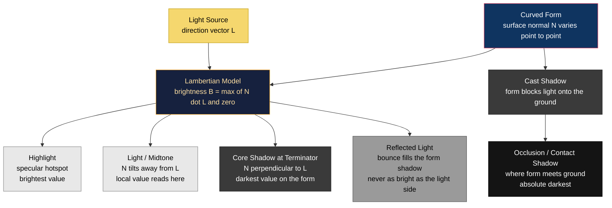

# 🌗 Light, Shadow, and Value

> [!abstract] TL;DR
> **Value** is the lightness or darkness of a tone, and it is the single most powerful element for creating the illusion of three-dimensional form and depth — arguably more important than color. Light striking a rounded form produces a predictable sequence of values (highlight, light/midtone, core shadow at the terminator, reflected light, cast shadow, occlusion shadow), and controlling that sequence — from the soft *sfumato* of Leonardo to the theatrical *chiaroscuro* of Caravaggio — is how flat marks become believable, emotionally charged volume.

---

## Intuition

**Analogy first:** squint at a black-and-white photo of a friend's face until the details blur. What remains is a map of *light and dark patches* — bright forehead, shadowed eye sockets, a dark under-chin. You can still read the face perfectly, even though every trace of color is gone. Now imagine the reverse: a photo with all its colors intact but every patch flattened to the *same* brightness. It turns into an unreadable camouflage blob. That thought experiment is the whole lesson: **the eye reconstructs 3D shape from value differences, not from hue.** Color is the paint job; value is the sculpture underneath.

Technically, "value" is just the position of a tone on a grayscale ramp from black to white. A curved surface turns toward or away from a light source point by point, so each patch receives a different amount of light and lands at a different value — and that continuous gradient is what the brain decodes as *roundness*.

---

## How It Works

### The core idea: light reveals form through the angle of the surface

A light source sends rays in a direction. At every point on an object, the surface faces some direction described by its **normal** (an arrow pointing straight out of the surface). The more directly a patch faces the light, the brighter it is; the more it turns away, the darker. Where the surface turns exactly side-on to the light, the light "grazes off" and you get the darkest band *on the form itself* — the **terminator**, or **core shadow**. Past that, the surface is in its own shadow, lifted only slightly by light bouncing back from the environment (**reflected light**). Meanwhile the object blocks light from reaching the ground, throwing a **cast shadow**, darkest right where object meets ground (the **occlusion / contact shadow**).

This "how brightly does a patch face the light" relationship is captured almost exactly by a **dot product** between the surface normal and the light direction — the diffuse (Lambertian) shading model that also powers real-time computer graphics (see [[Phong_and_Blinn_Phong]]).



### Two physical flavors of reflection

- **Diffuse (Lambertian):** a matte surface scatters light equally in all directions, so its value depends only on the light angle, not the viewer's position. This is the broad tonal gradient across the form.
- **Specular:** a glossy surface mirrors the light toward a specific direction, producing the small, movable **highlight**. Move your head and the highlight slides; the diffuse shading stays put.

Real materials combine both, which is exactly what the demo below simulates.

---

## Key Concepts

### Secondary (foundations)
- **Value = lightness/darkness of a tone**, independent of hue. A lemon and a navy shirt can share the same value even though their colors differ wildly.
- **The value scale:** a ramp of steps from black (darkest) to white (lightest), commonly divided into 9–10 steps. Artists train to place any tone on this scale.
- **Value is relative:** a tone looks lighter next to a dark neighbor and darker next to a light one (simultaneous contrast). You never judge a value in isolation.
- **Local value vs. light value:** *local* value is an object's inherent tone (a white cup is light, a coal is dark); *light* value is what the lighting does to it. A white cup in deep shadow can read darker than black coal in bright sun.
- **High-key vs. low-key:** high-key images cluster in the light half of the scale (airy, gentle); low-key images cluster in the dark half (moody, dramatic).

### Undergraduate (modeling and technique)
- **The anatomy of light on a form (in value order):** highlight → light/midtone → core shadow (terminator) → reflected light → cast shadow → occlusion shadow. A convincing sphere shows *all six*.
- **Modeling / shading techniques:**
  - **Hatching** — parallel lines; density controls value.
  - **Cross-hatching** — layered line grids for darker, richer tone.
  - **Stippling** — dots; dot density controls value (used in engraving, pen work).
  - **Blending** — smooth continuous gradients (pencil, charcoal, paint).
  - **Sfumato** — Leonardo's "smoky," edgeless transitions with no hard lines (*Mona Lisa*).
- **Chiaroscuro** — the modeling of form through strong light/dark contrast (Italian *chiaro* = light, *scuro* = dark). **Tenebrism** is its extreme form: a near-black field pierced by a single dramatic light (Caravaggio). Its power is emotional, not just descriptive — it directs attention and sets mood.
- **Value contrast as a focal-point tool:** the eye is drawn to the area of greatest value contrast. Placing your lightest light against your darkest dark at the center of interest is the most reliable way to build a focal point in composition.

### Graduate (physics, perception, and systems)
- **The cosine (Lambert's) law:** diffuse radiance is proportional to `max(N · L, 0)` — the cosine of the angle between surface normal and light. This is Lambertian reflectance, formalized by J. H. Lambert (*Photometria*, 1760), and it is the diffuse term of the [[Phong_and_Blinn_Phong]] model and, generalized as a BRDF, of [[Physically_Based_Rendering]].
- **Diffuse vs. specular vs. indirect:** the full appearance sums a direct diffuse term, a view-dependent specular term, and *indirect* (bounced) light — the physical basis of "reflected light" and the domain of [[Global_Illumination]] and [[Ray_Tracing_and_Path_Tracing]].
- **Perceptual (nonlinear) value:** human lightness perception is roughly logarithmic (Weber–Fechner). CIE `L*` and the Munsell value scale are *perceptually uniform*, whereas raw physical luminance and digital pixel values (before gamma) are not — a key reason naive linear blending in software looks wrong.
- **The Zone System (Ansel Adams):** maps scene luminance to eleven print values (Zone 0 = pure black to Zone X = paper white), each a stop of exposure apart. It is essentially a disciplined value scale for photography, letting a photographer *previsualize* and place tones exactly (linking Photography, S05).
- **Value as one axis of color:** in HSV/HSL and Munsell, value (or lightness) is a separate dimension from hue and saturation — which is why "getting the values right" survives even a total change of palette.

---

## Python Demo

```python
"""
Light, Shadow, and Value -- a numpy/matplotlib study.

Demonstrates, using only numpy and matplotlib:
  1. A sphere shaded with a Lambertian (diffuse) model: brightness = max(N . L, 0),
     plus a small ambient/reflected term and a specular highlight, composited over a
     ground plane with a cast shadow and a contact (occlusion) shadow. The six
     classic value zones are annotated.
  2. The value scale -- a grayscale ramp from black (0) to white (1).
  3. Value histograms contrasting a high-key image (bright, low contrast) with a
     low-key / chiaroscuro image (mostly dark with a bright accent).
"""
import numpy as np
import matplotlib.pyplot as plt


def normalize(v):
    return v / np.linalg.norm(v)


def shade_sphere(res=380, light_dir=(-0.5, 0.7, 0.6), ambient=0.07,
                 spec_strength=0.9, shininess=40.0, reflected=0.12):
    """Grayscale value map of a shaded unit sphere + a boolean sphere mask."""
    L = normalize(np.array(light_dir, dtype=float))
    V = np.array([0.0, 0.0, 1.0])          # viewer looks along +z
    H = normalize(L + V)                   # Blinn-Phong half-vector

    axis = np.linspace(-1.0, 1.0, res)
    X, Y = np.meshgrid(axis, -axis)        # flip Y so "up" is up
    r2 = X**2 + Y**2
    mask = r2 <= 1.0
    Z = np.sqrt(np.clip(1.0 - r2, 0.0, 1.0))
    Nx, Ny, Nz = X, Y, Z                    # unit normals on the unit sphere

    # 1) Lambertian diffuse -- the heart of the whole demo
    NdotL = Nx * L[0] + Ny * L[1] + Nz * L[2]
    diffuse = np.clip(NdotL, 0.0, 1.0)

    # 2) reflected / bounce light: weak fill from the opposite-lower side that only
    #    lifts the shadow side and never out-shines the lit side
    Lb = normalize(np.array([-L[0], -L[1] - 0.4, 0.3]))
    NdotLb = np.clip(Nx * Lb[0] + Ny * Lb[1] + Nz * Lb[2], 0.0, 1.0)
    bounce = reflected * NdotLb * (1.0 - diffuse)

    # 3) specular highlight (Blinn-Phong): the small brightest spot
    NdotH = np.clip(Nx * H[0] + Ny * H[1] + Nz * H[2], 0.0, 1.0)
    specular = spec_strength * NdotH ** shininess

    value = np.clip(ambient + diffuse + bounce + specular, 0.0, 1.0)
    value[~mask] = np.nan                   # background flagged
    return value, mask


def composite_scene(res=380):
    """Sphere on a ground plane with a soft cast shadow and a contact shadow."""
    value, mask = shade_sphere(res=res)
    H = int(res * 1.35)
    frame = np.full((H, res), 0.55)                       # mid-gray ground
    frame += np.linspace(0.0, -0.15, H)[:, None]          # depth falloff

    yy, xx = np.mgrid[0:H, 0:res]
    cx, cy = res * 0.60, res * 1.02                        # cast shadow, offset from light
    ell = ((xx - cx) / (res * 0.42))**2 + ((yy - cy) / (res * 0.11))**2
    frame -= 0.42 * np.clip(1.0 - ell, 0.0, 1.0)

    occ = np.exp(-(((xx - res * 0.5) / (res * 0.30))**2 +  # occlusion / contact shadow
                   ((yy - res * 0.985) / (res * 0.03))**2))
    frame -= 0.35 * occ
    frame = np.clip(frame, 0.0, 1.0)

    top = int(res * 0.03)                                  # drop the sphere in near the top
    view = frame[top:top + res, :]
    view[mask] = value[mask]
    return frame


def key_variants(res=320):
    """High-key (bright, gentle) and low-key / chiaroscuro (dark, dramatic)."""
    hi, _ = shade_sphere(res=res, ambient=0.55, spec_strength=0.3, reflected=0.25)
    hi = np.clip(0.45 + 0.5 * np.nan_to_num(hi, nan=1.0), 0.0, 1.0)   # lifted toward white
    lo, _ = shade_sphere(res=res, ambient=0.02, spec_strength=1.0,
                         shininess=60.0, reflected=0.06)
    lo = np.nan_to_num(lo, nan=0.02)                                  # near-black field
    return hi, lo


# ---- assemble the figure ----------------------------------------------------
fig = plt.figure(figsize=(13, 8))
fig.suptitle("Light, Shadow, and Value -- Lambertian shading and the value scale",
             fontsize=13, fontweight="bold")

# (1) annotated shaded sphere
scene = composite_scene(res=380)
Hs, Ws = scene.shape
ax1 = fig.add_subplot(2, 3, 1)
ax1.imshow(scene, cmap="gray", vmin=0, vmax=1)
ax1.set_title("Elements of light & shadow on a form")
ax1.axis("off")
labels = [("highlight", 0.36, 0.13, "white"),
          ("light / midtone", 0.28, 0.30, "white"),
          ("core shadow\n(terminator)", 0.66, 0.45, "yellow"),
          ("reflected light", 0.80, 0.60, "yellow"),
          ("cast shadow", 0.66, 0.82, "yellow")]
for text, fx, fy, col in labels:
    ax1.text(fx * Ws, fy * Hs, text, color=col, fontsize=8,
             ha="center", va="center", fontweight="bold")

# (2) the value scale (grayscale ramp)
ax2 = fig.add_subplot(2, 3, 2)
ramp = np.linspace(0, 1, 256)[None, :].repeat(30, axis=0)
ax2.imshow(ramp, cmap="gray", vmin=0, vmax=1, aspect="auto")
ax2.set_title("Value scale: black 0  ->  white 1")
ax2.set_yticks([])
ax2.set_xticks(np.linspace(0, 255, 6))
ax2.set_xticklabels([f"{v:.1f}" for v in np.linspace(0, 1, 6)])

# (3) histogram of the shaded scene
ax3 = fig.add_subplot(2, 3, 3)
ax3.hist(scene.ravel(), bins=50, range=(0, 1), color="#444")
ax3.set_title("Value distribution of the scene")
ax3.set_xlabel("value"); ax3.set_ylabel("pixels")

# (4) high-key variant
hi, lo = key_variants(res=320)
ax4 = fig.add_subplot(2, 3, 4)
ax4.imshow(hi, cmap="gray", vmin=0, vmax=1)
ax4.set_title("High-key (bright, low contrast)")
ax4.axis("off")

# (5) low-key / chiaroscuro variant
ax5 = fig.add_subplot(2, 3, 5)
ax5.imshow(lo, cmap="gray", vmin=0, vmax=1)
ax5.set_title("Low-key / chiaroscuro (dark, dramatic)")
ax5.axis("off")

# (6) overlaid histograms -- high-key vs low-key
ax6 = fig.add_subplot(2, 3, 6)
ax6.hist(hi.ravel(), bins=50, range=(0, 1), alpha=0.6, color="#d0d0d0", label="high-key")
ax6.hist(lo.ravel(), bins=50, range=(0, 1), alpha=0.6, color="#333", label="low-key")
ax6.set_title("High-key vs low-key histograms")
ax6.set_xlabel("value"); ax6.set_ylabel("pixels"); ax6.legend()

plt.tight_layout(rect=[0, 0, 1, 0.96])
plt.show()
```

**What to notice when you run it:** the sphere shows the full value march from a bright specular highlight down through the midtone to the dark **terminator**, then *back up* slightly into reflected light before the cast shadow. The scene histogram is broad. Swap to the high-key sphere and the histogram bunches on the right (few darks); the low-key/chiaroscuro sphere spikes near black with one bright accent — the numerical signature of *tenebrism*.

---

## Real-World Applications

- **Drawing & painting:** value studies (small "thumbnails" or *notan* black-and-white plans) are done *before* color, because if the values fail, no palette can rescue the image. Renaissance *grisaille* underpaintings established the whole tonal structure in gray first.
- **Photography & cinema:** Rembrandt lighting, film-noir chiaroscuro, and Ansel Adams's Zone System are all value-control disciplines (S05, Photography). Cinematographers choose "high-key" for comedy and "low-key" for thrillers precisely for the emotional charge of value.
- **Computer graphics & games:** the Lambertian `N · L` term, specular highlights, ambient occlusion (contact shadows), and shadow mapping are the exact real-time analogues of the artist's value elements — see [[Phong_and_Blinn_Phong]], [[Physically_Based_Rendering]], [[Global_Illumination]].
- **UI / graphic design & accessibility:** legibility is governed by *value* (relative luminance) contrast, not hue — WCAG contrast ratios are a value rule. Text that differs only in hue but not value is unreadable.
- **Comics & illustration:** "spotting blacks" (deciding where the solid darks go) uses value to guide the eye across a page.

---

## Common Pitfalls

- **Confusing value with color (hue).** A vivid orange and a vivid blue can be the *same* value. Fix: squint, convert to grayscale, or hold up a red value-finder — judge the tone, not the color.
- **Not enough value range ("muddy" work).** Timid drawings live entirely in the midtones. Fix: commit to your darkest darks and lightest lights; use the full scale.
- **Judging value in isolation.** Because value is *relative* (simultaneous contrast), a tone that looks correct alone reads wrong in context. Fix: always compare against neighboring values.
- **Getting the shadow anatomy backwards.** The **core shadow at the terminator is usually darker than the cast shadow**, and **reflected light must never be as bright as the light side** — beginners often over-brighten reflected light and flatten the form.
- **Killing form with flat or frontal lighting.** Light aimed straight from the camera erases the terminator and makes objects look pasted-on. Fix: use directional/side light to create a clear light-to-shadow transition.
- **Floating objects.** Omitting the occlusion/contact shadow makes things hover. Fix: anchor with a dark contact shadow where object meets ground.
- **Local vs. light value slip-ups.** Rendering a white object as uniformly light even in shadow. Fix: a white object in shadow can be darker than a dark object in light.
- **Ignoring gamma in digital work.** Blending or shading in non-linear sRGB space produces wrong midtones; do lighting math in linear space, then encode.

---

## Related Concepts

- [[Phong_and_Blinn_Phong]] — the computer-graphics formalization of the same idea: diffuse value comes from `max(N · L, 0)`, and the highlight is the specular term. The demo above is a hand-rolled version of this model.
- [[Physically_Based_Rendering]] — generalizes diffuse and specular reflection into energy-conserving BRDFs; the rigorous physics behind "how brightly a surface faces the light."
- [[Global_Illumination]] — the indirect, bounced light that art calls **reflected light**, filling shadows so they are never pure black.
- [[Ray_Tracing_and_Path_Tracing]] — how cast shadows, contact (occlusion) shadows, and reflected light are computed by simulating light transport.
- [[Geometric_and_Wave_Optics]] — the underlying physics of how light rays reflect off surfaces, the reason a normal's angle to the light determines brightness.

> Companion notes in this folder (to be cross-linked once created): *Color Theory* (value as one axis of color) and *Composition and Design Principles* (value contrast as the primary focal-point tool).

---

## Review Questions

1. **(Secondary)** Why do artists say value matters more than color for creating the illusion of 3D form? Put the six elements of light and shadow on a lit sphere in order from lightest to darkest.
2. **(Undergraduate)** A white ceramic mug sits on a table lit strongly from the upper left. Describe where the terminator, reflected light, cast shadow, and occlusion shadow fall, and explain why the core shadow can be *darker* than the cast shadow.
3. **(Graduate)** Explain how the Lambertian `N · L` cosine law connects to the physics of diffuse reflection, and how the Zone System maps scene luminance to print value. Where does the linear dot-product model break down as a description of real appearance (consider gamma/perceptual lightness, specular reflection, and indirect illumination)?

---

## Sources

- James Gurney, *Color and Light: A Guide for the Realist Painter* (Andrews McMeel, 2010) — the definitive artist's treatment of the light/shadow anatomy and reflected light.
- Betty Edwards, *The New Drawing on the Right Side of the Brain* (Tarcher/Putnam, 1999) — value scales, modeling form, and seeing tone rather than symbol.
- Ansel Adams, *The Negative* (New York Graphic Society / Little, Brown, 1981) — the Zone System and previsualization of value in photography.
- [Scratchapixel — Introduction to Shading (Diffuse / Lambertian, N·L)](https://www.scratchapixel.com/lessons/3d-basic-rendering/introduction-to-shading/shading-normals.html)
- Tomas Akenine-Möller, Eric Haines, Naty Hoffman et al., *Real-Time Rendering*, 4th ed. (CRC Press, 2018) — diffuse/specular reflection models and the physics of shading.

---

#aesthetics #light #value #chiaroscuro #shading
