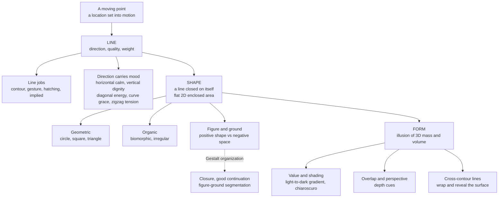

# ✏️ Line, Shape, and Form

> [!abstract] TL;DR
> **Line, shape, and form** are the three most fundamental visual elements, and they build on one another. A **line** is the path of a moving point — its direction and weight already carry feeling (horizontal calm, diagonal energy, curved grace). When a line closes on itself it encloses a flat 2D **shape** (geometric or organic), which the eye separates from its background as *figure* against *ground*. Add value, overlap, and perspective and that flat shape gains the illusion of 3D volume — it becomes a **form**. A circle is a shape; a shaded sphere is a form. Everything else in visual art (color, texture, space) is draped over this skeleton.

---

## Intuition

**Analogy: a walk in fresh snow.** Press a single boot down and you have a *point* — a location, at rest. Start walking and the trail you leave is a **line**: it has a direction, a speed you can read in its spacing, and a weight (a deep stomp vs a light shuffle). Now walk in a loop back to where you started and the trail encloses a patch of untouched snow — you have made a **shape**, a flat region marked off from everything around it. Finally, pack that snow up into a snowman and light it from one side: the gradient of bright-to-shadow across its surface makes your eye read a solid, rounded **form** with real volume you could walk around.

That is the whole hierarchy in one image: **a moving point becomes a line, a closed line becomes a shape, and a shaded shape becomes a form.** Kandinsky put it more austerely — a line is "the track made by the moving point," born the instant the point's self-contained rest is destroyed by motion.

---

## How It Works

### Core progression

1. **Line — the germ of every mark.** A line is one-dimensional in spirit: length without meaningful width. But even a bare line is expressive before it depicts anything, because we read it through our own bodies. Its **direction** carries mood (below), its **quality** varies from mechanically even to nervous and broken, and its **weight** (thickness) signals emphasis, weight, and nearness. Line also does specific jobs: *contour* (tracing an edge), *gesture* (a fast stroke capturing movement or a pose's "line of action"), *hatching / cross-hatching* (parallel lines that build tone), and *implied* line (dots, gaps, or aligned elements the eye connects on its own).

2. **Shape — a line that closes.** The moment a contour returns to its start it encloses an area: a flat, two-dimensional **shape**. Shapes split into two families — **geometric** (circle, square, triangle: regular, measurable, feels man-made and ordered) and **organic / biomorphic** (leaf, puddle, amoeba: irregular, feels natural and alive). Crucially, enclosing one shape simultaneously carves the space around it into **negative shapes**, and the visual system must decide which region is the *figure* (the thing) and which is the *ground* (the backdrop).

3. **Form — the illusion of volume.** **Form** is shape plus the third dimension: mass and volume. In sculpture this is literal; on a flat surface it is an illusion the artist fabricates with a small toolkit — chiefly **value / shading** (a light-to-dark gradient across a surface), reinforced by **overlap** (a shape covering another reads as nearer), **size diminution**, **linear perspective**, and **atmospheric perspective**. Of these, shading is the single most powerful: it is what turns the outline of a circle into the bulge of a sphere.

### How line direction carries feeling

- **Horizontal** — rest, calm, stability. It echoes the horizon and the body lying down.
- **Vertical** — dignity, aspiration, alertness. It echoes standing upright, columns, trees, and reaching up.
- **Diagonal** — motion, tension, instability, dynamism. It is a vertical or horizontal *caught mid-fall*.
- **Curved** — grace, softness, flow, the organic and the human.
- **Zigzag / jagged** — energy, agitation, conflict; the visual equivalent of a raised voice.

### Flow / architecture



---

## Key Concepts

### Secondary Level

- **A line is a moving point.** Straight, curved, or zigzag; drawn or implied. Even with nothing depicted, a line has a feeling because we read it with our bodies — a horizontal line is a person lying down, a diagonal is a person mid-stride.
- **Line does four jobs.** *Contour* traces an edge; *gesture* captures quick movement or a pose; *hatching* stacks parallel lines to make an area look darker; *implied* line is the imaginary line your eye draws between separated dots or aligned objects.
- **Shape = a closed line.** A flat, 2D enclosed area. **Geometric** shapes (circle, square, triangle) look designed and orderly; **organic** shapes (a leaf, a spill) look natural and free.
- **Form = shape with volume.** A circle is a shape; a sphere is a form. You turn a shape into a form mainly by **shading** it — going light on the lit side and dark on the shadow side.

### Undergraduate Level

- **Positive / negative shape, figure-ground, silhouette.** The object is the *positive* shape; the space around and between objects is the *negative* shape. Drawing teachers push students to "draw the negative space" because it bypasses what you *think* an object looks like and forces you to record what is actually there. A design passes the **silhouette test** if its filled black outline still reads unambiguously as the subject — the reason strong logos and character designs are recognizable at thumbnail size. Figure-ground can flip (Rubin's vase), which is where this topic meets Gestalt psychology.
- **Contour vs cross-contour.** *Contour* lines describe edges — the boundary where a form turns away from the viewer. *Cross-contour* lines run *across* the surface (like the latitude and longitude lines on a globe, or the seams on a beach ball); the eye infers a rounded 3D volume from the way they curve. Cross-contour is how a wireframe suggests form with no shading at all.
- **The toolkit that fakes 3D on a flat surface.** In rough order of power: (1) **value / shading** — the light-to-dark gradient (chiaroscuro); (2) **overlap** — whatever covers part of something else is read as in front of it; (3) **relative size** — larger reads as nearer; (4) **linear perspective** — parallel edges converge to vanishing points; (5) **atmospheric perspective** — distant things lose contrast and shift cool. Shading plus overlap alone are usually enough to convince the eye.
- **Line in drawing vs painting vs sculpture.** In drawing and printmaking, line is explicit and primary. In much painting there are *no* actual lines — edges appear where two shapes of different value or color meet, and skilled painters deliberately soften some (a "lost" edge) and sharpen others (a "found" edge) to steer the eye. In sculpture, "line" becomes the literal silhouette and the path the eye travels along the form, and form is real mass, not illusion.
- **Proportion and the golden ratio.** Shapes relate to each other by *proportion*. The **golden ratio** (about 1.618) and simpler schemes like the **rule of thirds** are classic tools for sizing and placing shapes — but their supposed omnipresence in masterpieces is often retrofitted after the fact. Proportion is a servant of the composition, covered in depth in the companion note on composition and design principles.

### Graduate Level

- **Shape is an act of perception, not a given (Gestalt).** The visual system *organizes* raw contrast into shapes using principles like **closure** (we complete interrupted contours — the basis of implied line and of the Kanizsa illusory triangle), **good continuation** (we follow the smoothest path, which is why line quality reads as continuous motion), **figure-ground segmentation**, and **Prägnanz** (a bias toward the simplest, most stable interpretation). A few marks read as a face because the system is straining to find a stable whole.
- **The neuroscience of line.** The primary visual cortex is built to extract lines first: **V1 simple cells are orientation-tuned edge detectors** (Hubel & Wiesel). Contour completion happens early and automatically, which is why *illusory contours* look razor-sharp even though no luminance edge exists. "Line is the most fundamental element" is therefore not just art-school dogma — it mirrors the first thing the cortex computes.
- **Curvature preference.** Humans reliably prefer curved contours over sharp, angular ones (Bar & Neta, 2006), plausibly because angularity carries a low-level threat signal that engages the amygdala. This gives the classic "curved = graceful, jagged = tense" intuition a measurable affective basis.
- **Form from shading is an ill-posed inverse problem.** Many 3D surfaces plus lighting conditions could produce the same 2D gradient, so the brain disambiguates with priors — chiefly the **light-from-above assumption**. Flip a shaded gradient upside down and a bump becomes a dent, because the prior stays fixed while the surface interpretation swings. The Python sphere demo below works precisely because it feeds the eye a gradient consistent with a single overhead-ish light.
- **How this element relates to the others.** Line, shape, and form are the *skeleton*; color, value, texture, and space are the *flesh*. They are analytically separable but perceptually fused: a form cannot exist without value, a shape cannot be seen without a value or color contrast against its ground, and space is simply what forms occupy. You isolate them to learn them, then recombine them to compose.

---

## Python Demo

The figure below walks the whole hierarchy with `numpy` and `matplotlib` only: (1) how line **direction** sets mood, (2) how line **weight and quality** change a mark's voice, (3) how a **closed** line becomes a shape, (4) **geometric vs organic** shapes plus overlap as a depth cue, (5) a **flat circle** (2D shape), and (6) a **shaded sphere** (implied 3D form). Panels 5 and 6 are the payoff: the *only* difference is a value gradient, yet one reads flat and the other reads round.

```python
import numpy as np
import matplotlib.pyplot as plt
from matplotlib.patches import Circle, Ellipse, Rectangle

# ---------------------------------------------------------------
# point -> line -> shape -> form, one idea per panel.
# numpy + matplotlib only.
# ---------------------------------------------------------------
fig, axes = plt.subplots(2, 3, figsize=(13, 8))
for ax in axes.ravel():
    ax.set_xticks([]); ax.set_yticks([]); ax.set_aspect("equal")
    ax.set_xlim(0, 1); ax.set_ylim(0, 1)

# --- Panel 1: line DIRECTION carries mood -----------------------
ax = axes[0, 0]
ax.set_title("Line direction = mood", fontsize=11)
t = np.linspace(0, 1, 200)
ax.plot([0.05, 0.95], [0.86, 0.86], color="#2b6cb0", lw=2)          # horizontal
ax.text(0.5, 0.93, "horizontal: calm", ha="center", fontsize=8)
ax.plot([0.05, 0.95], [0.58, 0.72], color="#c53030", lw=2)          # diagonal
ax.text(0.5, 0.65, "diagonal: dynamic", ha="center", fontsize=8)
ax.plot(0.05 + 0.9 * t, 0.42 + 0.05 * np.sin(2 * np.pi * t),        # curved
        color="#2f855a", lw=2)
ax.text(0.5, 0.49, "curved: grace", ha="center", fontsize=8)
zx = np.linspace(0.05, 0.95, 9)                                      # zigzag
zy = 0.14 + 0.06 * np.array([0, 1, 0, 1, 0, 1, 0, 1, 0])
ax.plot(zx, zy, color="#6b46c1", lw=2)
ax.text(0.5, 0.26, "zigzag: energy", ha="center", fontsize=8)

# --- Panel 2: line WEIGHT and quality ---------------------------
ax = axes[0, 1]
ax.set_title("Line weight and quality", fontsize=11)
xs = np.linspace(0.1, 0.9, 120)
for i, lw in enumerate([0.8, 2.5, 6.0]):
    ax.plot(xs, 0.78 - 0.22 * i + 0.03 * np.sin(3 * np.pi * xs), color="black", lw=lw)
ax.text(0.5, 0.86, "thin -> delicate", ha="center", fontsize=8)
ax.text(0.5, 0.64, "medium", ha="center", fontsize=8)
ax.text(0.5, 0.42, "thick -> emphatic", ha="center", fontsize=8)
# gesture: one energetic stroke that TAPERS via per-segment linewidth
g = np.linspace(0, 1, 60)
gx = 0.1 + 0.8 * g
gy = 0.14 + 0.08 * np.sin(4 * np.pi * g) * np.linspace(1, 0.2, 60)
widths = np.linspace(5.0, 0.4, 59)
for j in range(59):
    ax.plot(gx[j:j + 2], gy[j:j + 2], color="#8b4513",
            lw=widths[j], solid_capstyle="round")
ax.text(0.5, 0.03, "gesture: tapering, energetic", ha="center", fontsize=8)

# --- Panel 3: a CLOSED line becomes a shape ---------------------
ax = axes[0, 2]
ax.set_title("A closed line becomes a SHAPE", fontsize=11)
th = np.linspace(0, 1.6 * np.pi, 120)                               # OPEN arc
ax.plot(0.28 + 0.16 * np.cos(th), 0.62 + 0.16 * np.sin(th), color="black", lw=2)
ax.text(0.28, 0.32, "open line\nno interior", ha="center", fontsize=8)
th2 = np.linspace(0, 2 * np.pi, 200)                                # CLOSED blob
r = 0.16 * (1 + 0.18 * np.sin(5 * th2))
ax.fill(0.72 + r * np.cos(th2), 0.62 + r * np.sin(th2),
        color="#f6ad55", edgecolor="black", lw=2)
ax.text(0.72, 0.32, "closed line ->\nflat shape", ha="center", fontsize=8)

# --- Panel 4: geometric vs organic + overlap = depth ------------
ax = axes[1, 0]
ax.set_title("Geometric vs organic; overlap = depth", fontsize=11)
ax.set_facecolor("#edf2f7")                                         # negative space / ground
ax.add_patch(Rectangle((0.12, 0.38), 0.34, 0.34,
                       facecolor="#4299e1", edgecolor="black", lw=1.5, zorder=2))
ax.text(0.29, 0.28, "geometric\n(positive)", ha="center", fontsize=8)
th2 = np.linspace(0, 2 * np.pi, 200)
r = 0.19 * (1 + 0.25 * np.sin(3 * th2 + 0.7))
ax.fill(0.56 + r * np.cos(th2), 0.55 + r * np.sin(th2),
        color="#ed8936", edgecolor="black", lw=1.5, zorder=3)       # overlaps -> nearer
ax.text(0.66, 0.20, "organic,\noverlaps -> nearer", ha="center", fontsize=8)

# --- Panel 5: FLAT circle (2D shape) ----------------------------
ax = axes[1, 1]
ax.set_title("Flat circle = 2D shape", fontsize=11)
ax.add_patch(Circle((0.5, 0.55), 0.32, facecolor="#a0aec0", edgecolor="black", lw=2))
ax.text(0.5, 0.12, "uniform fill\nreads FLAT", ha="center", fontsize=8)

# --- Panel 6: SHADED sphere (implied 3D form) -------------------
ax = axes[1, 2]
ax.set_title("Shaded sphere = implied 3D FORM", fontsize=11)
ax.set_xlim(-1.3, 1.3); ax.set_ylim(-1.5, 1.3)
n = 400
gx = np.linspace(-1, 1, n)
X, Y = np.meshgrid(gx, gx)
R2 = X ** 2 + Y ** 2
inside = R2 <= 1.0
Z = np.sqrt(np.clip(1 - R2, 0, 1))                                  # front hemisphere
light = np.array([-0.5, 0.6, 0.7]); light /= np.linalg.norm(light)
lambert = np.clip(X * light[0] + Y * light[1] + Z * light[2], 0, 1)  # n . L shading
val = 0.12 + 0.88 * lambert                                         # ambient + diffuse
rgba = np.zeros((n, n, 4))
rgba[..., 0] = rgba[..., 1] = rgba[..., 2] = val
rgba[..., 3] = inside.astype(float)                                 # transparent outside disc
ax.add_patch(Ellipse((0.15, -0.9), 1.5, 0.35,
                     facecolor=(0, 0, 0, 0.18), edgecolor="none", zorder=1))  # cast shadow
ax.imshow(rgba, extent=[-1, 1, -1, 1], origin="lower", zorder=2)
ax.text(0, -1.28, "value gradient + cast shadow\nreads as VOLUME",
        ha="center", fontsize=8)

plt.tight_layout()
plt.show()

# Same silhouette in panels 5 and 6. The ONLY added information in panel 6 is a
# value gradient (Lambert n.L) plus a cast shadow -- and that alone converts a
# flat shape into a convincing 3D form. That is "shape from shading" at work.
```

**What the demo shows.** Panels 1-2 prove a mark is expressive *before* it depicts anything: swap direction or weight and the mood changes. Panel 3 is the moment a shape is born — the instant a contour closes it encloses an area. Panel 4 shows two shape families and demonstrates that **overlap** is a depth cue with zero shading. Panels 5 and 6 are a controlled experiment: identical circular silhouette, but a single value gradient plus a cast shadow flips the reading from flat disc to solid sphere. That gradient is a discrete Lambertian shading term (surface-normal dotted with a light direction) — the same math a graphics engine uses.

---

## Real-World Applications

**1. Logos and brand identity.** Identity design lives or dies on shape and silhouette. The Nike swoosh is a single gestural line; the Apple mark is a clean organic shape defined as much by its bite (negative space) as its body; the Twitter/X bird was pure silhouette. Simple, high-contrast shapes survive being scaled down to a favicon — the silhouette test in action.

**2. Character and concept design / animation.** Animators pose figures along a single **line of action** (a gesture curve) for dynamism, and vet designs by silhouette so a character is readable in shadow. The classic "shape language" heuristic — round shapes for friendly, angular for villainous — is curvature-preference turned into a production rule.

**3. Typography.** Letterforms are shapes, and their **counters** (the enclosed and partly-enclosed negative spaces) are as designed as the strokes. The thick/thin **stroke contrast** distinguishes a high-contrast serif (elegant, formal) from a monoline sans (neutral, modern) — line weight setting mood at the scale of a glyph.

**4. Architecture and product form.** Buildings deploy line direction psychologically: the soaring verticals of a Gothic cathedral read as dignity and aspiration; Brutalism's hard geometric masses read as weight and permanence; Zaha Hadid's continuous organic curves read as flow. Product silhouettes (a bottle, a car) are engineered to be recognizable as pure shape.

**5. Interface and data visualization.** UI uses figure-ground and shape to encode categories, line weight to signal emphasis, and *implied* lines (alignment grids) to guide the eye without drawing anything — the same organizing logic covered in the companion note on visual design principles.

**6. 3D graphics and rendering.** Real-time rendering computes "shape from shading" literally: a shading model evaluates `surface_normal · light_direction` per pixel to assign value, exactly as the sphere demo does. Cross-contour lines are the isolines and wireframes used to reveal a mesh's form.

---

## Common Pitfalls

- **Confusing shape with form.** Beginners "outline and fill" a circle and wonder why it looks like a coin, not a ball. Form comes from *shading across* the surface, not from a harder outline — in fact a hard, even outline tends to *flatten* form.
- **Tangents.** When two edges just barely touch or graze, the eye fuses them, destroying depth and figure-ground clarity. Either overlap decisively or separate cleanly; never let edges kiss.
- **Ignoring negative space.** Designing only the object leaves the leftover shapes looking accidental and cramped. Strong composition shapes the *positive and negative together*.
- **Uniform line weight.** A single mechanical line weight kills depth and emphasis. Vary it: heavier on near or shadowed edges, lighter on far or lit edges, to imply space and light.
- **Fighting light-from-above.** Shading a scene with inconsistent light directions, or as if lit from below, reads as uncanny because it violates the brain's default prior. Pick one light direction and commit.
- **Over-mythologizing the golden ratio.** Forcing 1.618 into every layout is numerology, and most "golden ratio in the Mona Lisa" claims are drawn on after the fact. Let proportion serve the composition, not the other way around.
- **Outlining everything (the "coloring book" look).** Nature has no black outlines — real edges are value and color transitions. A uniform contour around every object is a legitimate *style*, but a mistake when the goal is convincing form.

---

## Related Concepts

- [[Visual_Cognition]] — figure-ground segmentation, object recognition, and the binding of contour and shading into a perceived object; the cognitive machinery behind why a shaded shape reads as a form.
- [[Theories_of_Perception]] — the Gestalt laws (closure, good continuation, figure-ground, Prägnanz) that turn raw contrast into shapes and let a broken line read as continuous.
- [[Sensation_and_Perception]] — perceptual organization and depth cues (overlap, shading, perspective) at the psychophysical level that underpins the illusion of form.
- [[Visual_System_and_Visual_Cortex]] — V1 orientation-tuned simple cells as literal line/edge detectors; the physiological reason line is the most fundamental element.
- [[Visual_Design_Principles]] — how shape, figure-ground, line weight, and implied line are applied to build clarity and hierarchy in interface design.
- [[Phong_and_Blinn_Phong]] — the computer-graphics shading models that compute value from `normal · light`, i.e., the engineered version of "shape from shading" the sphere demo performs.

---

## Review Questions

**Secondary / Conceptual**
1. Why does a horizontal line tend to feel calm while a diagonal feels dynamic? Ground your answer in something about the body or the everyday world, not just "it looks that way." Then: what one thing do you add to a flat *shape* to turn it into a *form*?

**Undergraduate / Integrative**
2. You have drawn a plain circle. Name **two independent** techniques that would make it read as a sphere, and for each state the perceptual depth cue it exploits. Separately, use the Rubin vase to explain figure-ground, and say why "drawing the negative space" tends to improve a beginner's accuracy.

**Graduate / Trade-off**
3. "Shape from shading" is an ill-posed inverse problem. (a) What prior does the visual system use to disambiguate a convex bump from a concave dent, and how would you exploit that prior to make a photograph of a bump look like a dent? (b) Relate this to why the Python sphere panel succeeds while the flat-circle panel does not. (c) When would a designer deliberately choose explicit contour outlines over painterly "lost-and-found" value edges, and what do they trade away by doing so?

---

## Sources

- Kandinsky, W. (1926). *Point and Line to Plane*. Bauhaus Books. (Line as the track of a moving point.)
- Arnheim, R. (1974). *Art and Visual Perception: A Psychology of the Creative Eye*. University of California Press. (Gestalt applied to shape, form, and balance.)
- Nicolaides, K. (1941). *The Natural Way to Draw*. Houghton Mifflin. (Contour and gesture as ways of seeing line.)
- Bar, M. & Neta, M. (2006). Humans prefer curved visual objects. *Psychological Science*, 17(8), 645-648. (Curvature preference and the affective character of line.)
- Hubel, D.H. & Wiesel, T.N. (1962). Receptive fields, binocular interaction and functional architecture in the cat's visual cortex. *Journal of Physiology*, 160(1), 106-154. (Orientation-tuned edge detectors — the neural basis of line.)

---

#aesthetics #visual-elements #line #shape #form
