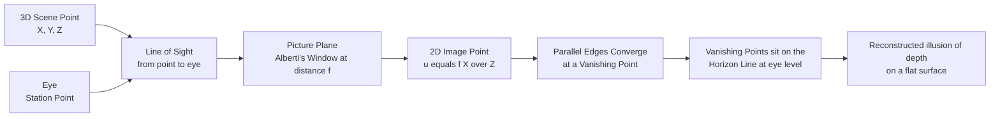

# 🪟 Space, Perspective, and Depth

> [!abstract] TL;DR
> A picture is a flat surface, yet we read solid space in it. Artists trick the eye with **depth cues** — overlap, relative size, height in the plane, and atmospheric haze — and, since the Italian Renaissance, with **linear perspective**: the same central-projection geometry as a pinhole camera, where parallel edges converge to **vanishing points** strung along a **horizon line**. Perspective is not "how the world is" but one culturally specific projection among many (isometric, reverse, Cubist), each a deliberate choice about how to fold three dimensions onto two.

---

## Intuition

**Analogy:** Stand between two railroad tracks and look down the line. The rails are provably parallel — a tape measure confirms they never meet — yet your eyes swear they converge to a single point on the horizon. Telephone poles beside them shrink and crowd together toward that same point, and the distant hills go pale, hazy, and slightly blue. Nothing in the world changed; only its *projection onto your retina* did.

Linear perspective is the discovery that this convergence is not vague poetry but exact geometry. If you freeze that view onto a pane of glass held in front of your eye — tracing each object where its line of sight pierces the glass — you get a mathematically precise drawing. That pane of glass is the whole idea: Alberti called the picture "an open window through which the subject is seen." A painting is a *window* whose glass we have permanently painted over.

---

## How It Works

### The core problem

The world has three spatial dimensions; a canvas, screen, or retina has two. Any picture is therefore a **projection** — a many-to-one collapse that throws away one dimension of information (absolute depth). An infinite family of 3D scenes projects to the *same* 2D image, which is exactly why optical illusions and forced-perspective photographs work. "Creating depth" means feeding the visual system enough consistent **depth cues** that it reconstructs one plausible 3D scene rather than reading the surface as flat.

### The depth cues (roughly in order of strength)

1. **Overlap / occlusion** — if shape A hides part of shape B, A is nearer. The single most decisive cue and the only one that gives a strict ordering even with no other information.
2. **Relative & familiar size** — of two objects known to be the same real size, the smaller one is farther. Image size scales as **1 / distance** (the size–distance law).
3. **Height in the picture plane** — for objects on the ground, the higher up the picture (up to the horizon) the farther away. A boat painted near the top of a seascape reads as distant.
4. **Texture gradient** — a cobbled road's stones grow smaller and denser with distance; the compression *is* the recession.
5. **Atmospheric / aerial perspective** — air scatters short-wavelength light (**Rayleigh scattering**, the same physics that makes the sky blue), so distant objects lose contrast and warm color and drift pale, hazy, and bluish. Leonardo codified this; it is a *physical*, not geometric, cue and works even in a photograph.
6. **Linear perspective** — the geometric convergence of parallel edges to vanishing points, described below.
7. **Shading & cast shadows** — attach objects to the ground and model volume (light-and-shade, *chiaroscuro*).

### Linear perspective as central projection

Model the eye as a single point (the **station point** or **center of projection**). Place a flat **picture plane** in front of it at distance `f`. Every world point `P = (X, Y, Z)` is joined to the eye by a line of sight; where that line pierces the picture plane is where `P` gets drawn. With the eye at the origin looking down the `+Z` axis this is one division:

```
u = f · X / Z          v = f · Y / Z
```

Three consequences fall straight out of the `1/Z`:

- **Vanishing point.** A set of parallel 3D lines with direction `(dx, dy, dz)` all project to the single point `(f·dx/dz, f·dy/dz)` as `Z → ∞`. Parallels meet. Lines *parallel to the picture plane* (`dz = 0`) never converge — their vanishing point is at infinity.
- **Horizon line.** Every horizontal set of parallels has `dy = 0`, so its vanishing point has `v = 0`: all horizontal vanishing points lie on one line at **eye level**. That is the horizon.
- **Orthogonals.** Edges receding straight away from the viewer (the `Z` axis) are the **orthogonals**; they rush to the central **principal vanishing point**. Edges running across the view (**transversals**) stay parallel to the horizon.

The count of vanishing points is just the count of edge-direction families oblique to the picture plane:

- **One-point** — the object is square-on; one family recedes (a hallway, a train track).
- **Two-point** — the object is turned about a vertical axis; two horizontal families recede to two VPs on the horizon (a building seen from a street corner).
- **Three-point** — add a tilt so verticals also converge, to a third VP far above or below (a skyscraper seen from the gutter or a drone).



### A short history

- **Brunelleschi (c. 1413–1425)** demonstrated the geometry with his lost *tavolette*: a painted panel of the Florence Baptistery with a peephole, viewed against a mirror so the painting and the real building could be swapped and seen to match exactly.
- **Leon Battista Alberti**, *De Pictura* (1435), gave the first written method — the *costruzione legittima* — and the governing metaphor of the picture as a *window*.
- **Piero della Francesca, Dürer, Desargues** turned it into a mathematical discipline; Desargues' work on projection seeded **projective geometry**, which now underwrites every graphics pipeline and camera model.

### Perspective is a choice, not a law

Central projection is the *European* solution, not the only one:

- **Parallel / isometric projection** — East Asian handscrolls and technical/CAD drawing keep receding edges parallel (no convergence). Space stays measurable and the viewer glides along the scroll rather than standing at one fixed eyehole.
- **Reverse (Byzantine) perspective** — lines *diverge* toward the viewer, as if the vanishing point sat in front of the icon, in the beholder's space, opening the sacred image outward.
- **Multiple viewpoints** — Cubism (Picasso, Braque) shatters the single station point, showing a face frontally and in profile at once; time and motion enter a still image.
- **Flattened modernism** — Matisse and later abstraction deliberately suppress depth to assert the honesty of the flat surface (Greenberg's "flatness").

---

## Key Concepts

### Secondary (foundational)
- **Foreground / middle ground / background** and the six everyday depth cues (overlap, relative size, height, texture, haze, shadow).
- **Horizon line = eye level.** Its height in the picture tells you where the artist (and so the viewer) is standing or floating.
- **One vanishing point** and the sunburst of orthogonals; drawing a simple road or corridor.
- **Positive vs negative space** — the shapes of objects vs the shapes of the gaps between them; strong composition designs both.

### Undergraduate (formal method)
- **Costruzione legittima**: ground line, horizon, central vanishing point, and **distance points** to lay out a correctly foreshortened tiled floor.
- **Orthogonals vs transversals**; **station point** and the **cone of vision** (roughly a 60° comfortable field — objects near the edge suffer marginal distortion).
- **One-, two-, and three-point** constructions and when each applies.
- **Picture plane** as the physical window; **the fourth wall** as its theatrical cousin — the invisible plane between stage and audience that actors "break."
- **Anamorphosis** — an image built for one extreme oblique viewpoint (or a curved mirror), unreadable head-on; e.g. the skull in Holbein's *The Ambassadors*.

### Graduate (projective / computational)
- Perspective is a **central projection**, a map from projective 3-space to the projective plane; in homogeneous coordinates it is the linear **pinhole camera** `x ∝ K [R | t] X`, with the intrinsic matrix `K` encoding focal length and principal point.
- **Points and lines at infinity** are first-class citizens: the horizon is the *image of the ideal line* of the ground plane; parallel lines meet because their shared point at infinity has a finite image.
- **Cross-ratio** is the projective invariant preserved under perspective, the basis of single-view metrology and of Renaissance "restitution."
- **Panofsky's critique** (*Perspective as Symbolic Form*): perspective encodes a specific, historically contingent worldview — an infinite, homogeneous, viewer-centered space — rather than neutral optical truth.
- Anamorphosis is simply projection onto a plane (or surface) at an extreme angle: an oblique **homography**.

---

## Python Demo

```python
# Linear perspective from first principles with a pinhole camera.
# Camera at the origin looks down +Z; the picture plane sits at distance f.
# A world point (X, Y, Z>0) projects to  u = f*X/Z ,  v = f*Y/Z.
# We draw one-point and two-point perspective, mark the horizon and
# vanishing points, and show the size-distance law (image height ~ 1/Z).
import numpy as np
import matplotlib.pyplot as plt

f = 1.5          # focal length = eye-to-picture-plane distance
EYE_H = 1.5      # eye height; the ground plane sits at Y = -EYE_H

def project(pts):
    """(N,3) camera-space points with Z>0  ->  (N,2) image points."""
    pts = np.asarray(pts, float)
    return np.column_stack([f * pts[:, 0] / pts[:, 2],
                            f * pts[:, 1] / pts[:, 2]])

def vanishing_point(direction):
    """Image location where every 3D line of this direction converges."""
    dx, dy, dz = direction
    return np.array([f * dx / dz, f * dy / dz])

def rot_y(theta):
    c, s = np.cos(theta), np.sin(theta)
    return np.array([[c, 0, s], [0, 1, 0], [-s, 0, c]])

def box(center, size, R=np.eye(3)):
    """8 corners + 12 typed edges of an axis box, optionally rotated."""
    cx, cy, cz = center
    sx, sy, sz = size
    corners = []
    for ix in (0, 1):
        for iy in (0, 1):
            for iz in (0, 1):
                local = np.array([(ix - .5) * sx, (iy - .5) * sy, (iz - .5) * sz])
                corners.append(R @ local + np.array([cx, cy, cz]))
    corners = np.array(corners)
    idx = lambda ix, iy, iz: 4 * ix + 2 * iy + iz
    edges = []                                   # (i, j, axis)
    for iy in (0, 1):
        for iz in (0, 1):
            edges.append((idx(0, iy, iz), idx(1, iy, iz), 'x'))
    for ix in (0, 1):
        for iz in (0, 1):
            edges.append((idx(ix, 0, iz), idx(ix, 1, iz), 'y'))
    for ix in (0, 1):
        for iy in (0, 1):
            edges.append((idx(ix, iy, 0), idx(ix, iy, 1), 'z'))
    return corners, edges

fig, ax = plt.subplots(1, 3, figsize=(16, 5))
gy = -EYE_H

# ---------------- 1) ONE-POINT PERSPECTIVE ----------------
a = ax[0]
for xi in np.arange(-3, 3.01, 1):                       # orthogonals -> VP
    p = project([[xi, gy, 2], [xi, gy, 40]])
    a.plot(p[:, 0], p[:, 1], color='0.7', lw=.8)
for zj in [2, 4, 6, 9, 13, 19, 28, 40]:                 # transversals stay flat
    p = project([[-3, gy, zj], [3, gy, zj]])
    a.plot(p[:, 0], p[:, 1], color='0.7', lw=.8)
cor, edg = box((1.3, gy + 1.0, 9), (2, 2, 2))           # a box on the floor
P = project(cor)
for i, j, _ in edg:
    a.plot([P[i, 0], P[j, 0]], [P[i, 1], P[j, 1]], color='#0b3d91', lw=1.8)
vp = vanishing_point((0, 0, 1))
a.axhline(0, color='#e94560', lw=1.2, ls='--')          # horizon = eye level
a.plot(*vp, 'o', color='#e94560', ms=8)
a.annotate('VP', vp + [0.03, 0.03], color='#e94560', fontsize=11)
a.set_title('One-point perspective\n(view-axis edges converge to one VP)')

# ---------------- 2) TWO-POINT PERSPECTIVE ----------------
b = ax[1]
theta = np.radians(35)
cor, edg = box((0, gy + 1.0, 9), (2.6, 2, 2.6), R=rot_y(theta))
P = project(cor)
vp_x = vanishing_point(rot_y(theta) @ np.array([1, 0, 0]))
vp_z = vanishing_point(rot_y(theta) @ np.array([0, 0, 1]))
for i, j, axis in edg:
    b.plot([P[i, 0], P[j, 0]], [P[i, 1], P[j, 1]], color='#0b3d91', lw=1.8)
    if axis in ('x', 'z'):
        far = j if cor[j, 2] > cor[i, 2] else i
        target = vp_x if axis == 'x' else vp_z
        b.plot([P[far, 0], target[0]], [P[far, 1], target[1]],
               color='0.8', lw=.6, ls=':')
b.axhline(0, color='#e94560', lw=1.2, ls='--')
for v, name in [(vp_x, 'VP1'), (vp_z, 'VP2')]:
    b.plot(*v, 'o', color='#e94560', ms=8)
    b.annotate(name, v + [0.03, 0.03], color='#e94560', fontsize=11)
b.set_title('Two-point perspective\n(box turned 35 deg; two VPs on the horizon)')

# ---------------- 3) SIZE-DISTANCE LAW ----------------
c = ax[2]
H = 2.0                                                 # every pole is 2 units tall
for z in [4, 6, 9, 13, 18, 25]:
    base = project([[2.5, gy, z]])[0]
    top = project([[2.5, gy + H, z]])[0]
    c.plot([base[0], top[0]], [base[1], top[1]], color='#0b3d91', lw=2.5)
    c.annotate(f'Z={z}\nh={f*H/z:.2f}', (base[0] + 0.02, base[1]), fontsize=8, color='0.3')
c.axhline(0, color='#e94560', lw=1.2, ls='--')
c.set_title('Size-distance law\n(identical poles: image height = f*H / Z)')

for p in ax:
    p.set_aspect('equal'); p.set_xlim(-1.2, 1.2); p.set_ylim(-0.9, 0.9)
    p.set_xlabel('u'); p.set_ylabel('v'); p.grid(alpha=.15)
b.set_xlim(-2.4, 1.4)                                    # widen to reveal both VPs
plt.tight_layout(); plt.show()

# doubling the distance halves the projected height:
for z in (5, 10, 20):
    print(f'pole at Z={z:2d}  ->  image height = {f*H/z:.3f}')
```

Running it prints `0.600, 0.300, 0.150` — each doubling of distance halves the image height, the `1/Z` size–distance law made literal. The first panel shows all floor orthogonals spearing one vanishing point on the horizon while transversals stay flat; the second shows a turned box throwing two vanishing points onto that same horizon; the third shows six identical poles shrinking and climbing toward eye level.

---

## Real-World Applications

- **Renaissance painting** — Masaccio's *Holy Trinity* and Raphael's *School of Athens* use single-point construction to make a wall dissolve into believable architectural depth.
- **Film and stage** — the **fourth wall** is the picture plane of theatre; cinematographers exploit forced perspective (the *Lord of the Rings* Hobbit-scaling shots) precisely because a single lens cannot distinguish a small near object from a large far one.
- **Computer graphics & games** — the GPU perspective-projection matrix and the perspective divide (`÷w`) are the same central projection Alberti described; isometric projection survives in strategy games and technical illustration for its measurability.
- **Computer vision & robotics** — the pinhole camera model, camera calibration, and structure-from-motion invert perspective to recover 3D from images; SLAM and monocular depth estimation are, in effect, un-projecting the artist's window.
- **Architecture & product design** — orthographic and isometric drawings keep dimensions true, while one- and two-point renders sell the *experience* of a space.
- **Anamorphic art** — street 3D chalk illusions, safety road markings ("SLOW" stretched long so it reads correctly from a low driver's-eye angle), and Holbein's hidden skull.

---

## Common Pitfalls

- **Inconsistent horizon / multiple accidental VPs.** Drawing each object with its own eye level makes a scene subtly seasick. Every object sharing the ground must answer to one horizon.
- **Horizon confused with the skyline.** The horizon is *your eye level*, an abstract line; it can sit behind a mountain or below a table edge. Placing it at the visible hilltop is a classic beginner error.
- **Vanishing points crammed inside the frame.** In natural two-point views the VPs usually fall well outside the picture; pulling them in yields a fish-eye, wide-angle distortion.
- **Perspective without atmosphere.** Geometrically perfect but uniformly crisp scenes still read flat. Distance also demands lower contrast and cooler, paler color (aerial perspective).
- **Ignoring the cone of vision.** Objects placed far off-axis (beyond ~60°) stretch grotesquely because the flat picture plane cannot hold a wide field — the same reason ultra-wide photos bloat at the edges.
- **Treating perspective as objective truth.** It is one projection with built-in assumptions (single fixed eye, instant of time); reverse, parallel, and multi-viewpoint systems are equally valid, not "mistakes."
- **Foreshortening a receding grid by equal spacing.** Transversals must *compress* toward the horizon (via distance points), not sit at even intervals.

---

## Related Concepts

- [[Projection_and_Viewing]] — the GPU perspective matrix and perspective divide are Alberti's window as a linear transform.
- [[Projective_Geometry]] — points and lines at infinity formalize why parallels meet; the horizon is the image of the ideal line.
- [[Geometric_and_Wave_Optics]] — the pinhole/camera-obscura optics behind the single center of projection.
- [[Electromagnetic_Waves_and_Radiation]] — Rayleigh scattering (`λ⁻⁴`) explains aerial perspective's pale, bluish distance.
- [[Depth_Estimation_Deep]] — machine vision recovering the depth that projection discards.
- [[Visual_SLAM]] — inverting perspective across many views to rebuild 3D structure and camera pose.
- [[Linear_Transformations]] — the matrix machinery of rotation, projection, and homography.
- [[Coordinate_Systems_and_Handedness]] — camera-space conventions that fix which way "into the scene" points.
- [[Euclidean_Geometry]] — the classical geometry perspective both uses and, at infinity, extends.
- [[NeRF_and_3DGS]] — modern novel-view synthesis: learning a scene, then re-projecting it through virtual perspective cameras.

---

## Review Questions

1. **(Foundational)** Two boats are painted the same size, but one overlaps the other. Which cues are in tension, and which one wins for judging depth order? Why does overlap outrank relative size?
2. **(Formal)** You are drawing a building standing at a street corner, seen at eye level. How many vanishing points do you need, where do they lie, and which edges remain parallel in the picture? What changes if you now look up at it from the pavement?
3. **(Analytical)** Show from `u = f·X/Z` why an object's image height is proportional to `1/Z`, and why a set of horizontal parallel lines with direction `(dx, 0, dz)` must have its vanishing point on the horizon.
4. **(Conceptual)** Panofsky called perspective a "symbolic form." In what sense is a two-point construction a cultural choice rather than an optical fact? Contrast it with East Asian parallel projection and Byzantine reverse perspective.
5. **(Applied / cross-domain)** A self-driving car's camera and a Renaissance fresco share the pinhole model, yet one *creates* depth and the other *recovers* it. Explain how the same `1/Z` projection runs in opposite directions in the two tasks, and why monocular depth is fundamentally ambiguous.

---

## Sources

- Leon Battista Alberti, *On Painting (De Pictura)*, 1435 — the founding text of the "window" and the *costruzione legittima*. [Britannica overview](https://www.britannica.com/art/perspective-art)
- Erwin Panofsky, *Perspective as Symbolic Form* (Zone Books, 1991; orig. 1927) — perspective as a historically situated worldview. [MIT Press / Zone Books](https://mitpress.mit.edu/9780942299533/perspective-as-symbolic-form/)
- Kirsti Andersen, *The Geometry of an Art: The History of the Mathematical Theory of Perspective from Alberti to Monge* (Springer, 2007). [Springer](https://link.springer.com/book/10.1007/978-0-387-48946-9)
- Martin Kemp, *The Science of Art: Optical Themes in Western Art from Brunelleschi to Seurat* (Yale University Press, 1990).
- Richard Hartley and Andrew Zisserman, *Multiple View Geometry in Computer Vision* (Cambridge University Press, 2004) — the pinhole camera and projective geometry that formalize linear perspective. [Book site](https://www.robots.ox.ac.uk/~vgg/hzbook/)

---

#aesthetics #perspective #depth #space #vanishing-point
