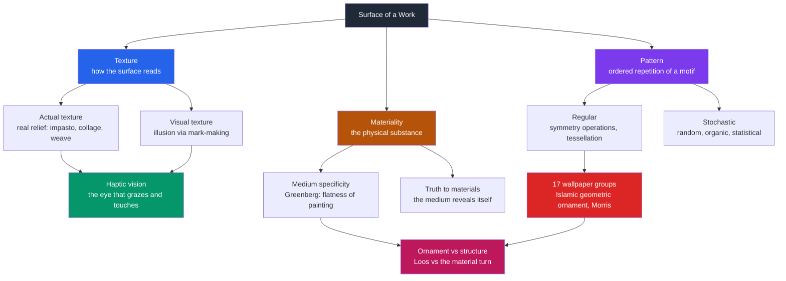

# 🪨 Texture, Pattern, and Materiality

> [!abstract] TL;DR
> **Texture** is the surface quality of a work — either *actual* (real physical relief you could feel: impasto, collage, the tooth of the paper) or *visual* (an illusion of surface conjured by mark-making). **Pattern** is the ordered repetition of a motif, and its "grammar" is literally the mathematics of symmetry — translation, rotation, reflection, glide — culminating in the 17 wallpaper groups that classify every possible flat repeating design. **Materiality** is the meaning carried by the physical substance itself: bronze, marble, oil, or pixels are never neutral carriers but active participants in what a work says and what it is worth.

---

## Intuition

**Analogy:** Run your hand across three walls in the dark. One is smooth plaster, one is rough brick, one is a woven tapestry — you *know* each instantly without seeing it, because your fingertips read the surface. Now turn on the light and look at a photograph of that brick wall: you "feel" the roughness even though the photo is glass-smooth. That gap — between the roughness your fingers report and the roughness your eyes invent — is the entire distinction between **actual texture** (the real relief of the surface) and **visual texture** (the *illusion* of relief). Pattern is what happens when the bricks line up into a repeating grid your eye can predict; materiality is the difference between a wall built of gold bricks and one built of mud, even if the pattern is identical.

Texture is the one visual element that refuses to stay in the eye — it constantly reaches back toward touch and the body.

---

## How It Works

### Core Mechanics

1. **Actual (tactile) texture** is genuine three-dimensional relief on the surface. Van Gogh's ridged **impasto**, a Cubist **collage** of pasted newspaper, the hammer-marks on a bronze, the weave of raw canvas — these cast real micro-shadows and would register under your fingertips. The medium asserts its own physical body.
2. **Visual (implied) texture** is the *illusion* of a surface built purely from marks on a flat plane: cross-hatching that "reads" as fur, a photorealistic rendering of crushed velvet, dense stippling that suggests stone. Nothing protrudes; the brain infers texture from learned cues (shadow, gradient, edge frequency).
3. **Haptic vision** is the bridge between them. Following Alois Riegl and later Deleuze, the eye can operate in a *haptic* mode — grazing across a surface as if touching it — rather than an *optical* mode that reads deep illusionistic space. Rough, tactile surfaces pull vision toward the haptic; smooth, atmospheric ones push it toward the optical.
4. **Pattern** emerges when a **motif** (the smallest repeated unit) is copied under **symmetry operations**: *translation* (slide), *rotation* (turn by a fixed angle), *reflection* (mirror), and *glide reflection* (mirror-then-slide). The set of operations that map a design onto itself forms a mathematical *group*.
5. **Tessellation** is pattern that tiles the plane with no gaps or overlaps. In two dimensions, once you demand a repeat in two independent directions, only **17 distinct symmetry types** are possible — the **17 wallpaper groups**. Every Alhambra tiling, William Morris wallpaper, and quilt belongs to one of these 17 classes; there is no eighteenth.
6. **Regular vs stochastic** patterns differ in predictability: a regular pattern lets you predict the whole field from one tile; a stochastic (random) texture can only be described statistically — density, contrast, grain — because no unit repeats.
7. **Materiality** governs meaning through the substance itself. **Truth to materials** (Ruskin, later Brancusi and the Bauhaus) holds that a medium should reveal its own nature rather than imitate another — wood should look like wood, not painted marble. **Medium specificity** (Clement Greenberg) pushed this further: each art should exploit what is unique to *its* medium — for painting, the flatness of the picture plane — and purge borrowed effects.
8. **Ornament vs structure** is the ideological battlefield of the surface. Adolf Loos's polemic *"Ornament and Crime"* (1908) branded decoration as primitive waste, aligning modernism with the bare plane; the **material turn** in contemporary art and later theory reversed the verdict, reclaiming ornament, textile, and craft as carriers of cultural knowledge, especially in non-Western traditions.

### Flow / Architecture



---

## Key Concepts

### Secondary (foundational)
- **Texture = surface quality.** Ask of any work: could I feel this, or does it only *look* rough?
- **Actual vs visual texture.** Impasto and collage are real relief; a drawing of fur is an illusion.
- **Motif and repetition.** A pattern is a small unit repeated. Wallpaper, tiles, fabric, and brickwork are everyday patterns.
- **Regular vs random.** Regular patterns are predictable and rhythmic; random textures feel organic and unpredictable.
- **The medium matters.** The same image in charcoal, oil, or marble feels — and is valued — differently.

### Undergraduate (mechanisms)
- **Symmetry operations:** translation, rotation, reflection, glide reflection — the four rigid moves that generate all planar patterns.
- **Tessellation and the 17 wallpaper groups:** every periodic 2D design is classified by exactly one of 17 symmetry groups (proved by Fedorov, 1891). Islamic geometric ornament, developed without the modern theorem, exhausts a remarkable range of these classes.
- **Haptic vs optical vision** (Riegl): surfaces can be read by an eye that "touches" or an eye that sees deep space.
- **Truth to materials:** the modernist ethic that a medium should express its own nature — grain, weight, weld — rather than disguise it.
- **Greenberg's medium specificity:** each art advances by isolating and exploiting what only *it* can do; for painting this meant embracing flatness and the material fact of pigment on a plane.
- **Loos's *Ornament and Crime*:** the founding modernist attack on decoration as regressive, tying moral and economic "progress" to the unornamented surface.

### Graduate (frontier / debate)
- **The 17 wallpaper groups as 2D crystallographic groups.** They are the two-dimensional analog of the **230 space groups** that classify crystals — pattern in art and periodicity in matter are the *same* group theory. See [[Crystal_Systems_and_Space_Groups]].
- **Riegl's *Kunstwollen*** and the autonomous history of ornament: style evolves by an internal "will to form," making decoration a serious object of art-historical theory rather than mere embellishment.
- **The material turn / new materialism:** contemporary theory (Bennett, Barad, Ingold) treats matter as agentive — the substance *does* something, resisting the artist and co-authoring meaning — dissolving the passive "medium as vehicle" model.
- **Critique of medium specificity:** post-Greenbergian and postmedium (Krauss) positions argue that installation, video, and conceptual work broke the one-art-one-medium doctrine; specificity became a historically bounded modernist ideology, not a law.
- **The politics of the decorative:** the modernist demotion of ornament coincided with the demotion of textile, ceramic, and non-Western "craft." Reclaiming pattern and materiality is therefore also a gendered and postcolonial argument about whose surfaces count as "art."
- **Semiotics of surface:** texture and material function as signs — a gilded icon signifies the sacred, a rusted steel plate signifies industrial time — meaning that is *carried by the substance*, not depicted by it.

---

## Python Demo

```python
# Demonstrates the three families of surface — a REGULAR repeating tile,
# a RANDOM (stochastic) texture, and a STRUCTURED texture — plus a
# WALLPAPER-style pattern built by reflecting a motif to impose symmetry.
# numpy + matplotlib only.
import numpy as np
import matplotlib.pyplot as plt

rng = np.random.default_rng(42)

# 1) REGULAR PATTERN — tile one motif exactly across the plane (pure periodicity).
motif = np.array([[0, 1, 1, 0],
                  [1, 0, 0, 1],
                  [1, 0, 0, 1],
                  [0, 1, 1, 0]], dtype=float)     # a 4x4 "ring" motif
regular = np.tile(motif, (8, 8))                  # 32x32 canvas, one motif repeated

# 2) RANDOM TEXTURE — white noise: every pixel independent, no predictable structure.
random_tex = rng.random((32, 32))

# 3) STRUCTURED TEXTURE — deterministic interference of sine gratings -> a woven feel.
u = np.linspace(0, 6 * np.pi, 128)
X, Y = np.meshgrid(u, u)
structured = np.sin(X) * np.cos(Y) + 0.5 * np.sin(X + Y)

# 4) WALLPAPER PATTERN — take an ASYMMETRIC seed and impose mirror symmetry,
#    then translate the symmetric cell -> mirror + translational symmetry (a pmm-type cell).
base = rng.random((8, 8))                          # asymmetric seed motif
top  = np.hstack([base, np.fliplr(base)])          # left-right mirror
cell = np.vstack([top,  np.flipud(top)])           # add top-bottom mirror -> 16x16 symmetric unit
wallpaper = np.tile(cell, (3, 3))                  # translate the symmetric unit across the plane

# --- display ---
fig, axes = plt.subplots(1, 4, figsize=(14, 4))
panels = [
    (regular,    "Regular tiling\n(exact periodicity)"),
    (random_tex, "Random texture\n(white noise)"),
    (structured, "Structured texture\n(sine interference)"),
    (wallpaper,  "Wallpaper pattern\n(mirror + translation)"),
]
for ax, (img, title) in zip(axes, panels):
    ax.imshow(img, cmap="viridis", interpolation="nearest")
    ax.set_title(title, fontsize=10)
    ax.axis("off")
plt.tight_layout()
plt.savefig("texture_pattern_demo.png", dpi=110)
plt.show()

# --- quantify the perceptual difference between REGULAR and RANDOM ---
# Split each field into top and bottom halves and correlate them.
# A regular tiling repeats every 4 rows, so its halves are IDENTICAL -> corr = 1.0
# (the eye predicts the whole field from one tile).
# White noise has independent halves -> corr ~ 0 (only statistics are perceivable).
reg_corr = np.corrcoef(regular[:16].ravel(),    regular[16:].ravel())[0, 1]
rnd_corr = np.corrcoef(random_tex[:16].ravel(), random_tex[16:].ravel())[0, 1]
print(f"Regular half-to-half correlation: {reg_corr:.3f}  -> fully predictable")
print(f"Random  half-to-half correlation: {rnd_corr:.3f}  -> only statistics readable")
# Perceptual takeaway: a REGULAR pattern gives the eye a 'beat' it can extrapolate;
# a RANDOM texture gives no repeat unit, so we read density and grain, not position;
# a STRUCTURED texture sits between (local order without a global tile) -- which is why
# real surfaces like wood grain or cloth feel 'textured' rather than 'patterned'.
```

Expected output (values are seed-stable): a regular half-to-half correlation of `1.000` versus a random correlation near `0.0` — a compact numeric proof that periodicity is predictability, while stochastic texture is legible only in aggregate.

---

## Real-World Applications

- **Islamic architecture (Alhambra, Granada).** Its tiled walls empirically explore a large fraction of the 17 wallpaper groups centuries before the theorem existed — a case where artisanal pattern-making anticipated formal mathematics. The same group theory reappears in [[Crystal_Systems_and_Space_Groups]] as the 230 space groups.
- **Product and interface design.** UI systems and materials-design languages encode *implied* texture and depth cues (soft shadows, grain, "frosted glass") to signal affordances, then swing toward flat design to signal modernity — a live replay of the ornament-versus-structure debate on the screen.
- **Textile and ceramic traditions.** Andean weaving, West African adinkra and kente, Japanese kiln glazes: pattern and materiality carry cosmology, status, and identity. The "material turn" in art history reclaims these as knowledge systems, not decoration.
- **CGI and procedural graphics.** Games and film generate believable surfaces from *stochastic* noise (Perlin/Simplex) plus *structured* rules — computational texture synthesis is exactly the regular-versus-random spectrum this note formalizes.
- **Materials and manufacturing.** Surface finish, brushed metal, and haptic feedback in industrial design apply "truth to materials" literally: the felt texture of a product signals quality and authenticity.

---

## Common Pitfalls

- **Confusing actual with visual texture.** A photorealistic painting of rust has *visual* texture but a perfectly smooth *actual* surface. Always ask separately: what would my fingers feel, and what does my eye infer?
- **Assuming there are infinitely many wallpaper patterns.** There are infinitely many *designs* but only **17** symmetry *types* in the plane. Beginners over-count by mistaking motif variety for symmetry variety.
- **Treating "random" as "structureless."** Stochastic textures still have statistical structure (density, correlation length, spectrum). Truly independent white noise is rare in nature; most "random" surfaces are correlated, like the smoothed field between order and chaos.
- **Reading materiality as neutral.** The medium is never a transparent window. Bronze versus plaster, oil versus print, original versus pixel — each changes meaning, aura, and market value even when the image is "the same."
- **Over-applying medium specificity.** Greenberg's flatness doctrine is a powerful lens for modernist painting but a poor fit for installation, video, or conceptual art; using it as a universal law misreads postmedium practice.
- **Equating ornament with excess.** Loos's polemic is an argument, not a fact. Dismissing pattern as mere decoration erases textile, ceramic, and non-Western traditions where ornament is the primary carrier of meaning.

---

## Related Concepts

- [[Groups_and_Subgroups]] — the symmetry operations behind pattern (translation, rotation, reflection, glide) form mathematical groups; the "grammar of ornament" is literally group theory.
- [[Euclidean_Geometry]] — tessellation and the tiling of the flat plane are governed by Euclidean plane geometry and its constraints on which shapes can fill space.
- [[Crystal_Systems_and_Space_Groups]] — the 17 wallpaper groups are the 2D analog of the 230 crystallographic space groups; pattern in art and periodicity in matter share one theory of symmetry.
- [[Ceramics_and_Glasses]] — the physical substance of glaze, clay, and glass grounds the "materiality" and "truth to materials" arguments in real material behavior and value.

---

## Review Questions

1. **(Conceptual)** Explain the difference between actual and visual texture, and describe how "haptic vision" complicates the idea that texture belongs purely to the sense of touch.
2. **(Scenario)** A designer shows you a wall covered in an intricate hand-painted repeating motif and claims it is "a completely new kind of pattern no one has made before." Using the concept of the 17 wallpaper groups, what can you say is *necessarily* true about it, and what genuinely could be novel?
3. **(Trade-off / debate)** Contrast Adolf Loos's *Ornament and Crime* with the contemporary "material turn." What does each position gain and lose, and how does the modernist demotion of ornament intersect with the treatment of non-Western textile and ceramic traditions?

---

## Sources

- Clement Greenberg, *"Modernist Painting"* (1960), in *The Collected Essays and Criticism, Vol. 4*. — medium specificity and flatness.
- Adolf Loos, *"Ornament and Crime"* (1908), in *Ornament and Crime: Selected Essays* (Ariadne Press, 1998). — the modernist case against ornament.
- Alois Riegl, *Problems of Style: Foundations for a History of Ornament* (1893; Princeton University Press, 1992). — the autonomous history of ornament and the haptic/optical distinction.
- Branko Grünbaum and G. C. Shephard, *Tilings and Patterns* (W. H. Freeman, 1987). — the definitive treatment of tessellation and the 17 wallpaper groups.
- E. H. Gombrich, *The Sense of Order: A Study in the Psychology of Decorative Art* (Phaidon, 1979). — perception of pattern, repetition, and the psychology of the decorative.

---

#aesthetics #texture #pattern #materiality #surface
