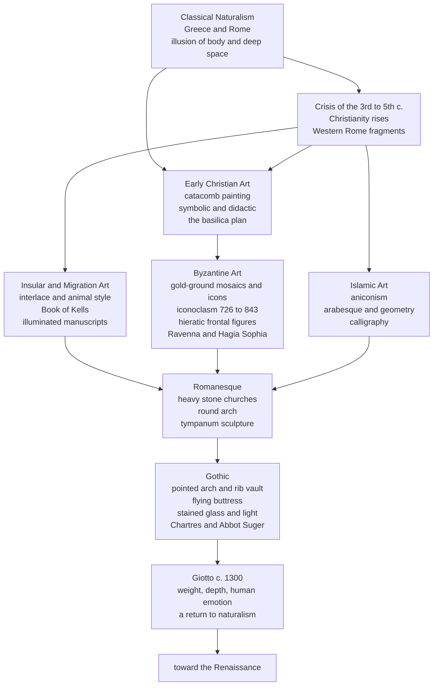

# 🎨 Classical to Medieval Art

> [!abstract] TL;DR
> Between roughly 200 and 1300 CE, European and Mediterranean art turned **away** from the lifelike bodies and deep space of Greece and Rome and **toward** flat, gold, symbolic images built to teach doctrine and open a window onto heaven. The story runs through **Early Christian** catacomb painting and the basilica, the **gold-ground mosaics and icons** of **Byzantium** (and the century-long war over whether images were holy or idolatrous), the **aniconic geometry and calligraphy** of **Islamic art**, the woven **interlace** of migration-era manuscripts like the *Book of Kells*, the massive **round-arched** stone of the **Romanesque**, and the soaring **pointed-arch, stained-glass** cathedrals of the **Gothic** — before **Giotto** around 1300 began turning the pendulum back toward naturalism and the Renaissance.

---

## Intuition

**Analogy:** Imagine two different photographers hired to portray a king. The first is a **wedding photographer** who wants a realistic snapshot — correct proportions, natural light, the king caught mid-stride looking like a normal man. The second is a **stained-glass window designer** who does not care whether the king looks "real"; she wants you to grasp *instantly* that he is the most important figure in the room. So she makes him **bigger than everyone else**, poses him rigidly facing forward, sets him against pure gold, and gives him a halo. She is not a *worse* artist than the first — she is answering a different question. She is drawing **meaning**, not **appearance**.

The whole arc from classical to medieval art is the pendulum swinging from the first photographer to the second and slowly back again. Greek and Roman art chased **appearance** — the illusion of muscle, weight, and receding space. Medieval art abandoned that illusion on purpose, because its patron, the **Church**, wanted images that were **legible, hierarchical, and transcendent**: a "Bible for the illiterate" whose figures were sized by holiness rather than by where they stood in a room.

---

## How It Works

### The core mechanism: a change of purpose, not a loss of skill

The single most important idea in this whole period is that the shift to flatness was a **deliberate reorientation of purpose**, not a collapse of ability. When the Western Roman Empire fragmented (see [[Fall_of_the_Western_Roman_Empire]]) and Christianity became the dominant patron of images, art's job changed. It no longer needed to fool the eye into seeing a real body in real space; it needed to make the **invisible sacred order visible**. That single change explains almost every "strange" feature of medieval art:

1. **Hieratic scale** — figures are sized by spiritual importance, not by distance. Christ towers over apostles; a donor kneels tiny at a saint's feet. Perspective, which ranks things by *position in space*, is deliberately discarded for a ranking by *value*.
2. **Frontality and stillness** — holy figures face the viewer head-on, symmetrical and motionless, inviting prayer rather than depicting a passing moment.
3. **The gold ground** — backgrounds become sheets of gold, not landscapes. Gold is not a *place*; it is **timeless, placeless divine light**, dissolving the real world so the figure floats in eternity.
4. **Symbol over illusion** — a fish means Christ, a lamb means sacrifice, a peacock means immortality. The image is a **text to be read**, not a scene to be admired.

### The main traditions and how they connect

- **Early Christian (c. 200–500):** Persecuted Christians painted **symbolic, shorthand images** on **catacomb** walls (the Good Shepherd, orant figures, biblical rescues as promises of salvation). After Constantine legalized Christianity, worship moved into the **basilica** — a plan borrowed from the Roman civic hall, not the pagan temple: a long nave leading the congregation toward the altar.
- **Byzantine (c. 500–1453):** The Eastern Roman world (see [[The_Byzantine_Empire]]) perfected the **gold-ground mosaic** (San Vitale and Sant'Apollinare in **Ravenna**; the vast interior of **Hagia Sophia**) and the portable **icon**. This is where the **theology of the image** was fought out: the **iconoclast controversy** of 726–843 pitted "image-breakers" against "image-venerators," resolved by the doctrine that an icon is not an idol but a **window** to the holy person it depicts.
- **Islamic (from c. 650):** Religious contexts embraced **aniconism** (avoidance of figural images of the divine), redirecting immense creativity into **geometric pattern**, flowing vegetal **arabesque**, and elevated **calligraphy** — an art of infinite, non-representational order (the Great Mosque of Córdoba, the later Alhambra; see [[Al_Andalus]]).
- **Insular / migration-period (c. 600–900):** In the post-Roman north, "barbarian" metalwork aesthetics of **interlace** and **animal style** transformed the illuminated manuscript into a labyrinth of woven line — supremely the *Lindisfarne Gospels* and the ***Book of Kells***.
- **Romanesque (c. 1000–1150):** As pilgrimage and monasticism grew (see [[Feudalism_and_Early_Medieval_Europe]]), heavy stone churches with **round (Roman) arches**, thick walls, and small windows spread across Europe, their doorway **tympana** carved with terrifying Last Judgements.
- **Gothic (c. 1150–1400):** The **pointed arch**, **rib vault**, and **flying buttress** together let walls dissolve into **stained glass**. Abbot **Suger** of Saint-Denis theorized this as *lux nova* — a "new light" through which the mind ascends from the material to the divine. The cathedrals of **Chartres**, Amiens, and Reims are the result.
- **The turn back (c. 1300):** **Giotto** reintroduced weight, believable space, and raw human emotion — the seed of the Renaissance (see [[The_Italian_Renaissance]]).

### Flow / map of the medieval art traditions



---

## Key Concepts

### Secondary (the essentials)

- **The big flip.** Greek and Roman art tried to make things look **real**; medieval art made things look **meaningful**. A Roman statue looks like a person; a Byzantine saint looks like a symbol of a person.
- **Hieratic scale.** In a medieval picture, the **most important figure is the biggest** — not the closest. Size = importance.
- **The Church paid the bills.** Almost all major art was religious because the **Church was the great patron**, and images were a "Bible for those who could not read."
- **Two arches to remember.** The **Romanesque round arch** (a half-circle, heavy, needs thick walls) versus the **Gothic pointed arch** (reaches higher, carries weight more steeply, lets walls open up into **stained glass**).

### Undergraduate (mechanisms and vocabulary)

- **The basilica.** Christianity adapted the Roman **civic hall** (a long nave, side aisles, an apse) rather than the pagan temple, giving liturgy a processional axis toward the altar.
- **Icon and iconoclasm.** An **icon** is a venerated sacred image; the **iconoclast controversy (726–843)** in Byzantium debated whether venerating images was idolatry. The resolution — icons are **windows, not idols** — is central to Orthodox worship to this day.
- **The gold ground and frontality** define the Byzantine "hieratic" figure: still, symmetrical, floating in placeless gold, meeting the worshipper's gaze.
- **Islamic aniconism to ornament.** Avoidance of figural images in sacred settings channelled genius into **repeating geometric tessellation**, **arabesque** vegetal scrollwork, and **calligraphy** — an aesthetic of infinite, unbroken order rooted in compass-and-straightedge construction.
- **Insular interlace.** Manuscripts like the *Book of Kells* fuse Christian text with pagan metalwork patterning into dense woven line.
- **The Gothic system.** The **pointed arch** + **rib vault** + **flying buttress** form one structural package: thrust is gathered onto slender piers and thrown outward to external buttresses, freeing the wall to become **glass**. Abbot **Suger** framed this flood of coloured light as *lux nova*, a means of spiritual ascent.

### Graduate (theory and debate)

- **The theology of the image.** The defence of icons drew on **Neoplatonic** thought and John of Damascus: because the invisible God became visible in the Incarnation, He can be depicted; the image participates in its prototype. The **Second Council of Nicaea (787)** codified this. Compare the philosophical backdrop in [[Augustine_and_Early_Christian_Thought]] and [[Islamic_and_Jewish_Philosophy]].
- **"Decline" versus *Kunstwollen*.** Nineteenth-century critics read medieval flatness as *decline* from classical skill. **Alois Riegl** reframed it as a deliberate **artistic will (*Kunstwollen*)** — a different *goal*, not a failure of technique. This reframing is the modern scholarly consensus and the reason we no longer call the era the "Dark Ages" of art.
- **Light-metaphysics.** Suger's programme rests on **Pseudo-Dionysius** and an **anagogical** theology in which material splendour lifts the mind to the immaterial. **Bernard of Clairvaux** attacked exactly this, defending Cistercian austerity — a live medieval debate about whether ornament aids or distracts from devotion.
- **Structural rationalism debate.** Whether Gothic form *follows* structural logic (**Viollet-le-Duc**) or is primarily an aesthetic-symbolic system that structure merely permits (**Pol Abraham**, later Panofsky's link to **scholastic** habits of ordered exposition — see [[Aquinas_and_Scholasticism]]) remains a classic art-historical controversy.
- **The historiography of the "rebirth."** Giotto's naturalism was mythologized by **Vasari** as a lone spark reviving art after "Greek" (Byzantine) barbarism — a narrative that undervalues his real Byzantine and Roman (Cavallini) debts and the continuities across 1300.

---

## Python Demo

```python
# Two illustrations of the classical-to-medieval story:
#   (1) the "stylistic pendulum" -- naturalism vs symbolism across periods
#   (2) the geometry of the Roman round arch vs the Gothic pointed arch,
#       showing how the pointed form reaches higher for the same span.
import numpy as np
import matplotlib.pyplot as plt

# ----------------------------------------------------------------------
# PART 1: naturalism vs symbolism across periods (a didactic 0-10 model)
# ----------------------------------------------------------------------
periods = [
    "Classical\nGreece-Rome",
    "Early\nChristian",
    "Byzantine",
    "Insular /\nMigration",
    "Romanesque",
    "Gothic",
    "Giotto\nc.1300",
]
naturalism = np.array([9.0, 4.0, 2.5, 1.5, 3.0, 5.5, 8.0])   # imitation of real bodies/space
symbolism  = np.array([3.0, 8.0, 9.5, 8.5, 8.0, 6.5, 4.5])   # meaning/hierarchy over illusion
x = np.arange(len(periods))

fig, (ax1, ax2) = plt.subplots(1, 2, figsize=(14, 6))

ax1.plot(x, naturalism, "o-",  lw=2.5, color="#c0392b", label="Naturalism")
ax1.plot(x, symbolism,  "s--", lw=2.5, color="#2c3e50", label="Symbolism / hierarchy")
ax1.fill_between(x, naturalism, symbolism, where=(symbolism >= naturalism),
                 color="#f1c40f", alpha=0.18, label="Medieval abstraction")
ax1.set_xticks(x)
ax1.set_xticklabels(periods, fontsize=9)
ax1.set_ylim(0, 10)
ax1.set_ylabel("Emphasis  [0-10, illustrative]")
ax1.set_title("The Stylistic Pendulum: Classical -> Medieval -> Giotto")
ax1.legend(loc="upper center")
ax1.grid(alpha=0.3)

# ----------------------------------------------------------------------
# PART 2: Roman round arch vs Gothic pointed arch, SAME span
# ----------------------------------------------------------------------
span = 2.0
r = span / 2.0                       # round arch = semicircle of radius span/2

# Round (Roman) arch: apex height = r = 0.5 * span
t = np.linspace(0, np.pi, 200)
round_x, round_y = r * np.cos(t), r * np.sin(t)

# Equilateral (Gothic) pointed arch: two arcs of radius = span, centred on
# the OPPOSITE springing points; they meet at apex height = span*sqrt(3)/2.
A = np.array([-span / 2, 0.0])       # left springing point
B = np.array([ span / 2, 0.0])       # right springing point
apex_y = span * np.sqrt(3) / 2       # ~0.866 * span

a1 = np.linspace(0, np.pi / 3, 120)          # right half: centre A, 0 -> 60 deg
right_x, right_y = A[0] + span * np.cos(a1), A[1] + span * np.sin(a1)
a2 = np.linspace(np.pi, 2 * np.pi / 3, 120)  # left half: centre B, 180 -> 120 deg
left_x, left_y = B[0] + span * np.cos(a2), B[1] + span * np.sin(a2)

ax2.plot(round_x, round_y, lw=3, color="#8e44ad", label="Roman round arch")
ax2.plot(right_x, right_y, lw=3, color="#16a085")
ax2.plot(left_x,  left_y,  lw=3, color="#16a085", label="Gothic pointed arch")

ax2.plot([-r, r], [0, 0], color="k", lw=1)                       # springing line
ax2.axhline(r,      color="#8e44ad", ls=":", alpha=0.6)
ax2.axhline(apex_y, color="#16a085", ls=":", alpha=0.6)
ax2.annotate("round apex = 0.50 x span",   xy=(0, r),      xytext=(0.12, r - 0.30), color="#8e44ad", fontsize=9)
ax2.annotate("pointed apex = 0.87 x span", xy=(0, apex_y), xytext=(0.12, apex_y + 0.06), color="#16a085", fontsize=9)

# thrust arrows: round arch pushes strongly OUTWARD; pointed arch more DOWNWARD
ax2.annotate("", xy=(r + 0.40, 0), xytext=(r, 0),
             arrowprops=dict(arrowstyle="->", color="#8e44ad", lw=2))
ax2.annotate("", xy=(B[0] + 0.12, -0.38), xytext=(B[0], 0),
             arrowprops=dict(arrowstyle="->", color="#16a085", lw=2))

ax2.set_aspect("equal")
ax2.set_xlim(-1.7, 2.0)
ax2.set_ylim(-0.55, 2.0)
ax2.set_title("Same span, taller reach:\nwhy the pointed arch let cathedrals soar")
ax2.legend(loc="upper right")
ax2.grid(alpha=0.2)

plt.tight_layout()
plt.savefig("classical_to_medieval_art.png", dpi=120)
plt.show()

# Takeaway: the pointed arch clears ~73% more height for the SAME opening,
# and steers thrust closer to vertical -- so walls could be pierced with the
# huge stained-glass windows that define Gothic light-filled cathedrals.
```

The left panel makes the "pendulum" explicit: naturalism peaks with Greece and Rome, bottoms out in the flat, symbolic art of Byzantium and the migration period, and climbs back with Gothic softening and Giotto. The right panel shows *why* the pointed arch mattered structurally — for an identical span it reaches far higher and drives its load more steeply downward, which is exactly what let masons replace solid Romanesque walls with walls of glass.

---

## Real-World Applications

- **Living liturgical practice.** Byzantine **icons** are not museum relics — they are venerated in Eastern Orthodox worship today, and the 787 resolution of the image debate still governs how they are made and honoured.
- **Gothic Revival architecture.** The 19th-century revival put pointed arches and rib vaults on the **Houses of Parliament**, countless universities, and churches worldwide; understanding the medieval original is the key to reading these buildings.
- **Structural engineering pedagogy.** The **round-vs-pointed arch** thrust comparison and the **flying buttress** are standard teaching examples of load paths and how form channels compressive force — the logic still underlies masonry restoration.
- **Islamic geometric design.** Medieval **girih** and arabesque tiling anticipate ideas in modern **symmetry** and even quasi-periodic (Penrose-like) tilings, and remain a live source for computer-graphics pattern generation, textiles, and architecture (see [[Groups_and_Subgroups]], [[Euclidean_Geometry]]).
- **Visual communication.** **Hieratic scale** — sizing elements by importance rather than by realistic proportion — is exactly what infographics, iconography, and UI hierarchy do; the medieval instinct never left graphic design.
- **Conservation and museums.** Mosaic, fresco, gilding, and manuscript conservation are entire specializations built on understanding these materials and techniques.

---

## Common Pitfalls

- **"Medieval artists just could not draw."** The flatness is a **deliberate choice of purpose** (Riegl's *Kunstwollen*), not incompetence — the same cultures produced technically dazzling metalwork, mosaic, and manuscript illumination.
- **Treating "Byzantine" as a name they used.** It is a **modern label**; the Byzantines called themselves **Romans**. The term arrives centuries later (see [[The_Byzantine_Empire]]).
- **Confusing Romanesque with Gothic.** The quick tell is the **arch**: **round** = Romanesque, **pointed** = Gothic. Note too that "Gothic" was originally a **Renaissance insult** implying barbarism.
- **Thinking Islamic art forbids all images.** Aniconism is strongest in **religious** contexts; **secular** Persian, Mughal, and Ottoman traditions produced rich **figural** painting. The "ban" is neither total nor uniform.
- **Reading the flying buttress as decoration.** It is a **structural** member that catches the vault's outward thrust — remove it and the wall of glass has nothing holding it up.
- **Seeing stained glass as mere prettiness.** For Suger it was **theology in light** (*lux nova*), an instrument of spiritual ascent, not ornament.
- **Crediting Giotto as a lone genius.** His naturalism has real **Byzantine and Roman precedents**; the "rebirth from nothing" story is Vasari's myth.

---

## Related Concepts

- [[The_Byzantine_Empire]] — the political and religious world of icons, iconoclasm, Ravenna, and Hagia Sophia; essential context for gold-ground mosaic and the theology of the image
- [[Fall_of_the_Western_Roman_Empire]] — the rupture that reframed art's patron and purpose from empire to Church
- [[The_Roman_Empire]] — the classical naturalism that medieval art turned away from and later reclaimed
- [[The_High_Middle_Ages]] — the age of cathedral-building, pilgrimage, and the Church as supreme patron
- [[Feudalism_and_Early_Medieval_Europe]] — the social order behind monastic and Romanesque art
- [[The_Crusades]] — contact that carried Byzantine and Islamic artistic ideas westward and fed the relic economy that shaped church design
- [[Rise_of_Islam_and_the_Caliphates]] — the religious context of aniconism and the flourishing of geometric ornament and calligraphy
- [[Al_Andalus]] — Islamic art and architecture in Iberia (Córdoba, later the Alhambra)
- [[Islamic_Science_and_Mathematics]] — the geometry and number that underpin arabesque and tiling
- [[Augustine_and_Early_Christian_Thought]] — Christian theology shaping early Christian and Byzantine imagery
- [[Aquinas_and_Scholasticism]] — the ordered intellectual world Panofsky linked to Gothic structural clarity
- [[Islamic_and_Jewish_Philosophy]] — Neoplatonism and debates over image, form, and the divine
- [[The_Italian_Renaissance]] — the naturalist future Giotto anticipates
- [[Humanism_and_the_Arts]] — the values that complete the pendulum's swing back to the human figure
- [[Groups_and_Subgroups]] — the symmetry groups that formalize Islamic geometric pattern
- [[Euclidean_Geometry]] — the compass-and-straightedge construction behind arabesque and Gothic tracery

---

## Review Questions

1. **(Secondary)** Describe two concrete differences between how a Roman marble statue and a Byzantine gold-ground mosaic portray a human figure. Why did medieval artists deliberately choose the second approach?
2. **(Undergraduate)** Explain how the pointed arch, the rib vault, and the flying buttress work together as a single structural system to enable the tall, glass-filled Gothic cathedral. How does this contrast with the Romanesque solution, and what did Abbot Suger claim the resulting light achieved?
3. **(Graduate)** "The abstraction of medieval art represents a loss of the naturalistic skill perfected in antiquity." Argue for or against this claim, drawing on the theology of the image, the concept of hieratic scale, and Riegl's notion of *Kunstwollen*. What does the case of Islamic aniconism add to your argument?

---

## Sources

- Kleiner, F. S. *Gardner's Art Through the Ages: A Global History*. Cengage.
- Gombrich, E. H. *The Story of Art*. Phaidon.
- Panofsky, E. (ed.). *Abbot Suger on the Abbey Church of St.-Denis and Its Art Treasures*. Princeton University Press.
- Demus, O. *Byzantine Mosaic Decoration: Aspects of Monumental Art in Byzantium*. Routledge & Kegan Paul.
- Grabar, O. *The Formation of Islamic Art*. Yale University Press.
- Mâle, É. *The Gothic Image: Religious Art in France of the Thirteenth Century*. Harper & Row.

---

#aesthetics #art-history #medieval-art #byzantine #gothic
