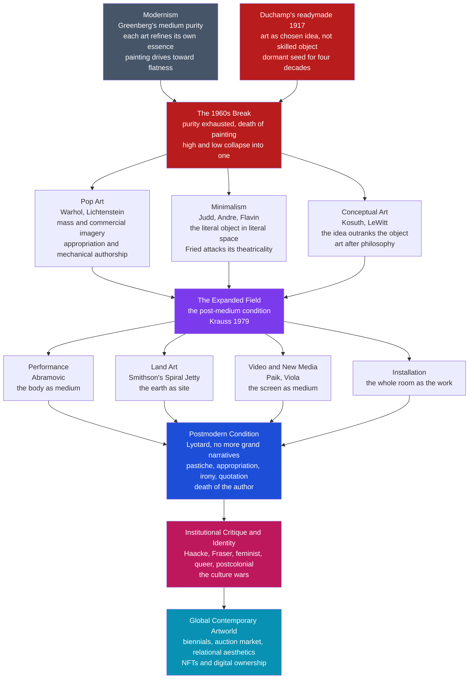

# 🖼️ Contemporary and Postmodern Art

> [!abstract] TL;DR
> After roughly 1960, art abandoned modernism's central promise — that each medium should refine its own pure essence toward an ever-higher truth — and detonated it from within. **Pop Art** flooded the gallery with soup cans and comic strips, erasing the line between high art and commercial culture; **Minimalism** stripped the artwork down to a plain object in a room; **Conceptual Art** decided the *idea* mattered more than any object at all; and the "**expanded field**" spilled art into performance, land, video, installation, and code. Philosophically this is **postmodernism**: an "incredulity toward grand narratives" (Lyotard) that trades the modernist story of progress for pastiche, appropriation, irony, historical quotation, and the "death of the author." The result is today's **post-medium**, globalized, biennial-and-market-driven artworld — from Marina Abramović's endurance performances to a sixty-nine-million-dollar NFT at Christie's.

---

## Intuition

**Analogy — the record shop that ran out of bins.** Picture a music store in 1955. It has a handful of neatly labelled bins: *Classical*, *Jazz*, *Pop*. Every record slots cleanly into exactly one bin, and the store's purist critic has a rule — each genre should sound *more like itself* over time: jazz should get more jazz-like, classical more classical, each perfecting its own nature. Then a generation of musicians starts wrecking the scheme. One releases an "album" that is just a printed card instructing you to hum for four minutes. Another sells recordings of supermarket jingles unchanged. A third performs a set that ends by smashing every instrument, and the *smashing* is the piece. Records arrive that are half field-recording, half advert, half sculpture. The neat bins overflow; new bins appear weekly; and eventually the very act of sorting by a single "medium" collapses. The store gives up and relabels the whole back wall **Contemporary** — a bin defined not by what it contains but by the fact that it *refuses to stay sorted*.

That is almost exactly what happened to visual art after 1960. **Modernism** was the purist critic: each art was supposed to purify its own medium — painting toward flatness and colour, sculpture toward pure form. **Contemporary and postmodern art** is the store that ran out of bins. It stopped asking "how do I make a *purer painting*?" and started asking "why a painting at all — why not an idea, a body, a desert, a television, a dinner party, a token on a blockchain?" The whole story below is the story of the bins breaking, and of the new artworld that grew up to sell, exhibit, and argue about whatever spilled out.

---

## How It Works

Contemporary art is best understood not as a *style* but as the **collapse of the modernist framework** and the improvised order that replaced it. The mechanism runs in six moves.

1. **The modernist purity narrative — and its exhaustion.** The dominant mid-century theory, articulated by the critic **Clement Greenberg** ("Modernist Painting," 1960), held that each art advances by using its own methods to isolate what is *unique and irreducible* to its medium. For painting that meant surrendering illusion and sculptural depth and embracing the one thing only painting has: **flatness**. This gave a triumphant, teleological story — abstraction as the destiny of painting — but it was a trap. Once painting had been reduced to a flat monochrome, there was nowhere purer to go. Critics began to speak of the "**death of painting**": the medium's internal logic had run out of road. If art could no longer progress *inside* a medium, the next move had to come from *outside* it.

2. **The 1960s break — three exits from the medium.** Around 1960 three movements simultaneously walked out of Greenberg's cul-de-sac. **Pop Art** (Andy Warhol, Roy Lichtenstein) abolished the high/low boundary by importing the imagery of advertising, packaging, and comics, and by using mechanical, authorless techniques like silkscreen and Ben-Day dots — art as **appropriation** of mass culture. **Minimalism** (Donald Judd, Carl Andre, Dan Flavin) went the opposite way: not more imagery but *less*, reducing the work to a plain industrial **object** — a stack of steel boxes, a grid of firebricks — with no illusion, no composition, no metaphor, just a literal thing sharing your literal space. **Conceptual Art** (Joseph Kosuth, Sol LeWitt) took the final step and dematerialized the object entirely: "the **idea** becomes a machine that makes the art" (LeWitt), and "**art after philosophy**" means the artwork is a *proposition about the nature of art*, not a crafted thing (Kosuth).

3. **The critical hinge — Fried and Danto.** Two 1960s texts frame the stakes. Michael Fried's "**Art and Objecthood**" (1967) attacked Minimalism as **theatrical**: because a Minimalist object only completes itself in the beholder's bodily, durational encounter with it in a room, it abandons the self-sufficient, instantaneous presence of true modernist art — and, Fried warned, "**art degenerates as it approaches the condition of theatre**." He meant it as condemnation; the next fifty years took it as a *programme*. Meanwhile Arthur **Danto**, confronting Warhol's *Brillo Boxes* (indistinguishable from supermarket cartons yet hanging in a gallery), concluded that art status is not perceptual at all — it is conferred by an "**artworld**" of theory and history. This is the direct bridge to institutional theory (see [[What_Is_Art]]).

4. **The expanded field.** With the object no longer sacred, art poured into media that modernism never recognised. **Performance art** made the artist's own body the medium (Marina Abramović's endurance and presence pieces). **Land art** left the gallery for the desert (Robert Smithson's *Spiral Jetty*, 1970, a 1,500-foot coil of basalt in the Great Salt Lake). **Video art** turned the television — the very emblem of mass culture — into a fine-art medium (Nam June Paik's TV assemblages; Bill Viola's slow, immersive projections). **Installation** treated the entire room as the work. The critic Rosalind Krauss named this condition "**sculpture in the expanded field**" (1979): categories like "sculpture" had become so stretched that they were now defined by what they were *not*. This is the **post-medium condition** — art no longer identified with any single material support.

5. **Postmodernism as the philosophy of it all.** Jean-François **Lyotard** defined the postmodern as "**incredulity toward metanarratives**" — the loss of faith in the big legitimating stories (progress, reason, the avant-garde's forward march) that modernism relied on. In art this reads as a cluster of recognisable traits: **pastiche** (imitating dead styles without parody's satirical edge — Fredric Jameson), **appropriation** (Sherrie Levine re-photographing famous photographs), **irony**, **historical quotation** (postmodern architecture bolting classical columns onto glass towers), and the "**death of the author**" (Roland Barthes: meaning is made by the reader/viewer, not decoded from the artist's intention — see [[Poststructuralism_and_Deconstruction]]).

6. **The new order — critique, identity, relation, and the market.** Once art could be anything, the questions became *who* gets to make it, *where* it circulates, and *what* it does socially. **Institutional critique** (Daniel Buren, Hans Haacke, Andrea Fraser) turned the museum itself into the subject, exposing the gallery's economic and ideological frame. **Identity politics and the culture wars** put feminist, queer, and postcolonial art at the centre (Linda Nochlin's "Why Have There Been No Great Women Artists?"; the Guerrilla Girls; a global roster contesting the Euro-American canon — see [[Feminist_and_Queer_Literary_Theory]] and [[Postcolonial_Literary_Theory]]). **Relational aesthetics** (Nicolas Bourriaud) proposed that the artwork could *be* a social situation — a shared meal, a conversation. And all of this now circulates through a **globalized, biennial-and-market-driven artworld** whose newest frontier is **NFTs** and blockchain-verified digital ownership.



Read the diagram as a **dam bursting**. Modernism's purity narrative and Duchamp's long-dormant readymade meet at the 1960s break; three streams pour out (Pop, Minimalism, Conceptual); they merge into the expanded field, where the medium dissolves into body, earth, screen, and room; and the whole flood is theorised as the postmodern condition and channelled, finally, into the institutions, identities, and markets of today's global artworld.

---

## Key Concepts

### Secondary Level

**Modern art is not the same as contemporary art.** "Modern art" names a historical period (roughly 1860s–1960s: Impressionism through Abstract Expressionism) built on originality, progress, and medium purity. "**Contemporary art**" means art of *our own moment* (roughly 1960/1970 to now), and **postmodern** describes its dominant attitude — sceptical, ironic, quoting the past instead of marching past it. Calling a Pollock "contemporary" or a Warhol "modern" mixes up the two.

**Pop Art erased the line between art and advertising.** Andy Warhol painted Campbell's Soup cans and silkscreened Marilyn Monroe and Coca-Cola bottles; Roy Lichtenstein blew up romance-comic panels complete with printer's dots. The shock was that they took the imagery of **mass, commercial, "low" culture** perfectly seriously as fine-art subject matter — and often reproduced it **mechanically**, refusing the heroic, hand-made brushstroke. This is **appropriation**: making art by borrowing existing images rather than inventing new ones.

**Conceptual art means the idea can *be* the artwork.** In conceptual art the physical object is optional — sometimes it is just a certificate, a set of instructions, a sentence on a wall, or a photograph documenting an action. The value lives in the **concept**, not the craftsmanship. This is why "my kid could make that" misses the point: the skill on display is *thinking*, not *painting*.

### Undergraduate Level

**Greenberg vs. Duchamp — the two family trees of modern art.** Almost all twentieth-century art descends from one of two ancestors. The **Greenberg line** (medium-specific, retinal, about *how* the work looks) runs through abstraction and Minimalism's concern with the object's physical presence. The **Duchamp line** (idea-specific, anti-retinal, about *what* the gesture means) runs through Pop, Conceptual, and institutional critique. Postmodern art is, in large part, the **triumph of the Duchamp line** — the readymade's 1917 provocation, ignored for decades, becomes the master template.

**Minimalism and the charge of "theatricality."** Minimalist objects (Judd's "specific objects," Andre's floor tiles) rejected illusion and internal composition in favour of a single, whole, industrially-fabricated form. Michael Fried's "**Art and Objecthood**" argued this was a betrayal: such objects only *work* through the viewer's bodily, time-bound experience of sharing a room with them — they are **theatrical** rather than self-sufficient. Fried meant this as a fatal criticism; instead it accurately *described* the future, because performance, installation, and video art are *all* essentially theatrical, durational, and beholder-dependent.

**Dematerialization and the "death of painting."** The critic Lucy Lippard chronicled the "**dematerialization of the art object**" (1966–1972): a wave of work that reduced the physical artwork toward pure information, documentation, and idea. Combined with Greenberg's dead-end (painting reduced to flat monochrome had nowhere left to go), this produced the recurring "**death of painting**" debate — the claim that painting as a serious avant-garde medium was historically finished. Painting, notably, kept *not* dying, returning in Neo-Expressionism, appropriation painting, and beyond — but always now as a *choice among media* rather than the default.

**Danto's "end of art" and the Brillo Box.** Confronting Warhol's *Brillo Boxes* (1964), Danto argued that once art became self-consciously *philosophical* — once it could ask "what is art?" from the inside — the modernist **narrative of progress ended**, leaving a pluralist present in which *anything is possible* and no single direction is mandatory. This is not the end of art-*making* but the end of art-*history* as a story of forward development, and it is the philosophical charter of "contemporary" as a category (see [[What_Is_Art]] for the institutional theory this rests on).

### Graduate Level

**Lyotard, Jameson, Baudrillard — three theories of the postmodern.** Jean-François **Lyotard** (*The Postmodern Condition*, 1979) defined it epistemologically: the collapse of legitimating **metanarratives** and their replacement by local, incommensurable "language games." Fredric **Jameson** (*Postmodernism, or, The Cultural Logic of Late Capitalism*, 1991) defined it economically: postmodern culture — depthless, fragmented, dominated by **pastiche** (blank, satire-less imitation) rather than parody — is the *superstructure* of multinational, consumer capitalism. Jean **Baudrillard** defined it semiotically: in the age of the **simulacrum**, images no longer represent a reality behind them but circulate as copies of copies with no original ("**hyperreality**"). Warhol's endlessly repeated Marilyn is Exhibit A for all three readings.

**Institutional critique.** If Danto and Dickie showed that the *institution* confers art status, a generation of artists turned that institution into their subject. Daniel **Buren** exposed the gallery's framing conventions with his repeated vertical stripes; Hans **Haacke** produced works documenting the real-estate holdings and corporate money behind museums (one was cancelled by the Guggenheim in 1971); Andrea **Fraser** performed the museum docent and the artist-as-service-provider to lay bare the economy of the artworld. Institutional critique is postmodern reflexivity turned on art's own supporting apparatus.

**Feminist, queer, and postcolonial art.** Linda **Nochlin**'s "Why Have There Been No Great Women Artists?" (1971) reframed the question: not a deficiency in women but the **institutional structures** (academies, patronage, the "genius" myth) that excluded them. The **Guerrilla Girls** turned museum statistics into agitprop. Queer art (from Robert Mapplethorpe to David Wojnarowicz) and **postcolonial** practice (contesting the Euro-American canon, the ethnographic gaze, and "primitivism") made **identity and representation** central — and detonated the late-1980s/1990s "**culture wars**" over public funding of provocative work.

**Relational aesthetics and its critics.** Nicolas **Bourriaud** (*Relational Aesthetics*, 1998) argued that a strand of 1990s art (Rirkrit Tiravanija cooking Thai curry for gallery visitors, Liam Gillick's discussion platforms) locates the artwork not in an object but in the **inter-human relations** and micro-communities it produces — art as a social interstice, a rehearsal of better ways of being together. Claire **Bishop** attacked this as politically naïve: such convivial, harmonious "togetherness" evades genuine **antagonism** and conflict, and can become a feel-good ornament to the very neoliberalism it imagines resisting. The Bourriaud–Bishop debate is the central methodological argument of twenty-first-century participatory art.

**The globalized, market-driven artworld — and NFTs.** Contemporary art now runs on a planetary circuit of **biennials** (Venice, São Paulo, Documenta, Dakar), international art fairs, mega-galleries, and record-shattering **auctions** — a system in which a Basquiat sells for over one hundred million dollars and the artwork functions simultaneously as culture, spectacle, and financial asset. Its newest frontier stress-tests every definition in this note: **NFTs** (non-fungible tokens) use a blockchain to certify ownership of a *digital* file that is otherwise infinitely copyable — reintroducing scarcity and provenance into born-digital work, and asking Danto's question anew (see [[Digital_Literature_and_New_Media]]). The 2021 sale of Beeple's *Everydays: The First 5000 Days* for sixty-nine million dollars at Christie's dragged the whole debate into the auction house.

---

## Python Demo

We visualise the single most important structural fact of this note: **the expansion of the medium**. Modernism assumed a small, fixed set of "pure" media (chiefly painting and sculpture). From about 1960 onward, new art forms switched on in rapid succession — performance, conceptual, land, video, installation, socially-engaged, and finally NFT/digital. We model each medium's "vitality" as a logistic curve that turns on at its historical onset year, convert the curves into **shares of the total medium-space**, and stack them. Then, on a second panel, we compute a **diversity index** — the *effective number of live media* (the exponential of Shannon entropy of the shares) — which quantifies the shift from the narrow, **medium-specific** condition of modernism to the pluralist **post-medium condition** of contemporary art.

```python
# The Expansion of the Medium, ~1900-2025.
# numpy + matplotlib only. Models the proliferation of art media after ~1960
# and quantifies the "post-medium condition" with a diversity index.
import numpy as np
import matplotlib
matplotlib.use("Agg")               # headless-safe backend
import matplotlib.pyplot as plt

years = np.arange(1900, 2026)

def logistic(t, onset, tau, amp):
    # vitality turns on smoothly around 'onset'; tau sets how fast it ramps
    return amp / (1.0 + np.exp(-(t - onset) / tau))

# (name, onset year, ramp tau, plateau amplitude, color)
media = [
    ("Painting",          1400, 20, 1.00, "#8c564b"),
    ("Sculpture",         1400, 20, 0.70, "#7f7f7f"),
    ("Photography",       1900, 12, 0.55, "#bcbd22"),
    ("Performance",       1962,  5, 0.60, "#e377c2"),
    ("Conceptual",        1966,  4, 0.60, "#1f77b4"),
    ("Land Art",          1968,  4, 0.35, "#2ca02c"),
    ("Video / New Media", 1965,  6, 0.75, "#d62728"),
    ("Installation",      1968,  6, 0.70, "#9467bd"),
    ("Socially Engaged",  1995,  7, 0.50, "#17becf"),
    ("NFT / Blockchain",  2018,  2, 0.45, "#ff7f0e"),
]

names  = [m[0] for m in media]
colors = [m[4] for m in media]

# vitality matrix (media x years), then normalize to shares that sum to 1
V = np.array([logistic(years, onset, tau, amp)
              for (_, onset, tau, amp, _) in media])
shares = V / V.sum(axis=0, keepdims=True)

# diversity: effective number of live media = exp(Shannon entropy of shares)
p = shares
H = -np.sum(np.where(p > 0, p * np.log(p), 0.0), axis=0)
effective_media = np.exp(H)

fig, (ax1, ax2) = plt.subplots(
    2, 1, figsize=(12, 9), sharex=True,
    gridspec_kw={"height_ratios": [3, 1.3]})

# --- Panel 1: stacked share of the "medium space" over time ---
ax1.stackplot(years, shares * 100.0, labels=names, colors=colors, alpha=0.9)
ax1.set_ylim(0, 100)
ax1.set_ylabel("Share of active medium-space  [percent]")
ax1.set_title("The Expansion of the Medium\n"
              "from medium-specific modernism to the post-medium condition",
              fontsize=13, fontweight="bold")
ax1.legend(loc="upper left", ncol=2, fontsize=8, framealpha=0.9)
ax1.axvline(1960, color="black", ls="--", lw=1.3)
ax1.text(1961, 3, "c.1960  the expanded field begins",
         fontsize=8, rotation=90, va="bottom")

# --- Panel 2: diversity index (effective number of live media) ---
ax2.plot(years, effective_media, color="#7c3aed", lw=2.6)
ax2.fill_between(years, 1, effective_media, color="#7c3aed", alpha=0.12)
ax2.axvline(1960, color="black", ls="--", lw=1.3)
ax2.set_ylim(1, effective_media.max() * 1.12)
ax2.set_ylabel("Effective number\nof live media\n[exp of entropy]", fontsize=9)
ax2.set_xlabel("Year")
ax2.grid(alpha=0.3)

plt.tight_layout()
plt.savefig("expansion_of_the_medium.png", dpi=140, bbox_inches="tight")
print("Figure saved: expansion_of_the_medium.png\n")

# --- console summary: the post-medium climb ---
print("Effective number of simultaneously 'live' art media:")
for y in [1900, 1930, 1960, 1975, 1990, 2010, 2025]:
    print(f"  {y}:  {effective_media[y - 1900]:.2f}")
```

Running this saves a two-panel figure and prints the diversity climb. **Panel 1** shows painting and sculpture owning nearly the entire "medium space" until 1960, after which their share is progressively eaten as band after band of new media switch on and stack up — a vivid picture of the medium *expanding* rather than *purifying*. **Panel 2** turns that into a single number: the *effective number of live media* sits near **2–3** for the whole modernist era (painting plus sculpture, with photography knocking at the door) and then climbs steeply after 1960 toward **7–8**, which is exactly what "the post-medium condition" means — no longer one or two mandatory media, but a large, open field of coexisting practices with no single one at the centre. The 1960 dashed line marks the inflection where medium-*specificity* gives way to medium-*plurality*.

---

## Real-World Applications

> **Application 1 — Biennials and mega-exhibitions as the operating system of contemporary art.** The Venice Biennale (since 1895, but decisively "contemporary" postwar), Documenta in Kassel, and dozens of newer biennials from Gwangju to Sharjah to Dakar are where contemporary art is *made public*, canonised, and globalised. A biennial is applied postmodernism: it juxtaposes performance, video, installation, and socially-engaged projects from every continent under a curator's thematic frame, materially enacting the "expanded field" and the decentring of the Euro-American canon.

> **Application 2 — The art market and the artwork as asset class.** Postmodern art's collapse of the high/low boundary and its embrace of mechanical reproduction did not weaken the market — it turbo-charged it. Warhol understood this first ("good business is the best art"), and today auction houses treat blue-chip contemporary works as investment vehicles: a Basquiat over one hundred million dollars, a Koons balloon dog in the tens of millions. The same appropriationist logic that mocked commercial culture is now priced by it.

> **Application 3 — NFTs, provenance, and digital ownership.** Blockchain-based NFTs answer a specifically contemporary problem: how to own, sell, and authenticate a *born-digital* artwork that is infinitely copyable. The March 2021 sale of Beeple's *Everydays* for sixty-nine million dollars at Christie's forced traditional auction houses, museums, and copyright regimes to confront digital scarcity and on-chain provenance — a live re-run of Duchamp's and Danto's questions about what confers art status (see [[Digital_Literature_and_New_Media]]).

> **Application 4 — Public funding and the culture wars.** Because contemporary art is deliberately provocative and its "art status" is institutionally conferred rather than self-evident, it repeatedly becomes a political battleground. The late-1980s/1990s U.S. controversies over National Endowment for the Arts grants (Mapplethorpe, Serrano, the "NEA Four") turned definitional and value disputes into congressional fights over whether challenging work is "art" that taxpayers should fund — the practical stakes of the whole definition debate.

> **Application 5 — Institutional critique institutionalised.** Museums now routinely commission the very institutional-critique and identity-centred work that once attacked them — de-colonial re-hangs, provenance and repatriation projects, artist-led interrogations of the museum's funding. Curatorial practice, wall-label writing, and collection policy have all absorbed postmodern reflexivity as standard professional method, not fringe protest.

---

## Common Pitfalls

- **Confusing "modern" with "contemporary."** These are *opposites*, not synonyms. Modernism believed in progress, originality, and medium purity; postmodern contemporary art is sceptical of grand narratives, embraces appropriation and quotation, and mixes media freely. Calling Warhol "modern art" or a monochrome abstraction "contemporary" scrambles the single most important distinction in this note.

- **"My kid could make that" — mistaking skill for the point.** Minimalism and conceptual art deliberately *removed* traditional craft to foreground the **idea, the object's presence, or the institutional frame**. The relevant skill is conceptual and contextual, not manual. Judging a readymade or a Judd box by brush-handling is judging chess by how prettily the pieces are carved.

- **Reading Pop Art as pure celebration (or pure critique).** Warhol is *ambivalent* by design: his soup cans and disaster silkscreens neither simply glorify nor simply condemn consumer culture — they hold both at once, in a deadpan blankness. Forcing Pop into a single political verdict ("it's a critique of capitalism" / "it's a sell-out to it") flattens exactly what makes it postmodern.

- **Taking "anything goes" to mean "no standards."** Danto's "end of art" and Lyotard's fall of metanarratives remove the single mandatory *direction* of art history — not the possibility of good and bad work. Pluralism means the *criteria* are local and contested, not that judgement is impossible. "Postmodern relativism = nothing can be better than anything" is a caricature the theorists themselves reject.

- **Misreading Fried's "theatricality" as a mere insult.** "Art and Objecthood" is not just Fried disliking Minimalism; it precisely *diagnosed* the property — durational, bodily, beholder-dependent presence — that would define performance, installation, and video art. Treat it as the accidental *manifesto* of the expanded field, not a dead-end polemic.

- **Assuming participatory or "relational" art is automatically progressive.** Bourriaud's conviviality can, as Claire Bishop argues, become a feel-good spectacle that suppresses real **antagonism** and serves the market it claims to resist. "The audience participated, therefore it was radical" is exactly the assumption postmodern criticism teaches you to distrust.

- **Confusing appropriation with plagiarism or forgery.** When Sherrie Levine re-photographs a famous photograph or Warhol silkscreens a Coke bottle, the *recontextualisation* is the content — a deliberate, authored gesture about authorship, originality, and mass culture (see [[Intertextuality_and_Allusion]]). It is a different act, legally and conceptually, from passing off a copy as an original.

---

## Related Concepts

- [[What_Is_Art]] — the institutional theory (Danto's *Brillo Boxes*, Dickie's artworld) is the philosophical engine of the whole contemporary period; this note is that theory playing out across the actual movements.
- [[Aesthetics_and_Art_Overview]] — the parent survey; contemporary art is the "Modern → Contemporary" endpoint of the art-history timeline sketched there and the case that most stresses every definition of art.
- [[Poststructuralism_and_Deconstruction]] — Barthes's "death of the author," Derrida's instability of meaning, and Foucault's power/knowledge supply the exact theoretical vocabulary of postmodern appropriation, quotation, and institutional critique.
- [[Modern_and_Contemporary_Literature]] — literary postmodernism (metafiction, pastiche, unreliable narration, incredulity toward grand narratives) is the textual sibling of the visual-art movements described here; the two share Lyotard and Jameson as common theorists.
- [[Feminist_and_Queer_Literary_Theory]] — the literary counterpart to the feminist and queer art (Nochlin, the Guerrilla Girls, Mapplethorpe) that drove the identity turn and the culture wars.
- [[Postcolonial_Literary_Theory]] — the framework behind postcolonial art's contestation of the Euro-American canon, "primitivism," and the ethnographic gaze in the globalized biennial artworld.
- [[Digital_Literature_and_New_Media]] — the born-digital, networked frontier that video art, new media, and NFTs extend into visual art; shared questions of reproduction, ownership, and authorship.
- [[Intertextuality_and_Allusion]] — appropriation, quotation, and pastiche are the visual-art forms of intertextuality; both rest on the idea that new works are woven from prior ones rather than created ex nihilo.

---

## Review Questions

### Secondary

1. In one or two sentences each, explain the difference between "**modern art**" and "**contemporary art**," and give one artist or artwork that clearly belongs to each. Why is calling a Warhol soup can "modern art" a mistake?

2. Andy Warhol made art out of soup cans, Coca-Cola bottles, and comic strips. What does it mean to say Pop Art "**erased the line between high and low culture**," and why was that shocking to people who expected art to be about noble or beautiful subjects?

### Undergraduate

3. Trace the "two family trees" of twentieth-century art — the **Greenberg line** (medium purity, the retinal object) and the **Duchamp line** (the readymade, the idea). Which movements descend from each, and in what sense does postmodern art represent the *triumph of the Duchamp line*?

4. Michael Fried condemned Minimalism as "**theatrical**." Reconstruct his argument, then explain why later critics treat "Art and Objecthood" as having *accurately predicted* the future of art rather than as a successful attack. What property of the artwork is at stake?

5. Danto claims that after Warhol's *Brillo Boxes*, art history reached its "**end**" — yet artists obviously keep making art. What exactly is supposed to have ended, and how does this "end of art" thesis license the very idea of a "*contemporary*" period defined by pluralism?

### Graduate

6. Compare **Lyotard**, **Jameson**, and **Baudrillard** as theorists of the postmodern (metanarratives, the cultural logic of late capitalism, the simulacrum). Using a single work — say Warhol's repeated *Marilyn* — show how each theory would read it. Are the three accounts rivals, or complementary layers describing the same phenomenon?

7. Nicolas Bourriaud celebrates **relational aesthetics** as art that produces convivial human relations; Claire Bishop counters that genuine political art requires **antagonism**, not harmony, and that relational work can become an ornament to neoliberalism. Stage this debate over a specific participatory project. Which position better accounts for what art can and cannot do politically, and why?

8. NFTs use a blockchain to confer scarcity, ownership, and provenance on an infinitely-copyable digital file. Analyse the NFT as a *stress test* of the institutional and historical definitions of art (Danto, Dickie, Levinson). Does the "artworld" that confers art status now include a decentralized market and a ledger — and if so, what, if anything, is left of the museum's authority?

---

## Sources

- [Greenberg, C. (1960). "Modernist Painting." *Forum Lectures* / reprinted in *The Collected Essays and Criticism, Vol. 4*.](https://voidnetwork.gr/wp-content/uploads/2016/09/Modernist-Painting-by-Clement-Greenberg.pdf) — The canonical statement of medium-specific modernism that the whole contemporary period reacts against.
- [Fried, M. (1967). "Art and Objecthood." *Artforum*, 5(10), 12–23.](https://atc.berkeley.edu/201/readings/FriedObjcthd.pdf) — The "theatricality" critique of Minimalism that inadvertently charts the expanded field.
- [Danto, A. C. (1964). "The Artworld." *The Journal of Philosophy*, 61(19), 571–584.](https://www.jstor.org/stable/2022937) — Introduces the "artworld" and the indiscernibles problem behind Warhol's *Brillo Boxes*.
- [Krauss, R. (1979). "Sculpture in the Expanded Field." *October*, 8, 30–44.](https://www.jstor.org/stable/778224) — The foundational account of the post-medium condition and the dissolution of stable categories.
- [Lyotard, J.-F. (1979/1984). *The Postmodern Condition: A Report on Knowledge* (G. Bennington & B. Massumi, trans.). University of Minnesota Press.](https://www.upress.umn.edu/book-division/books/the-postmodern-condition) — Defines the postmodern as "incredulity toward metanarratives."
- [Jameson, F. (1991). *Postmodernism, or, The Cultural Logic of Late Capitalism*. Duke University Press.](https://www.dukeupress.edu/postmodernism) — Reads postmodern pastiche and depthlessness as the culture of late capitalism.
- [Bourriaud, N. (1998/2002). *Relational Aesthetics* (S. Pleasance & F. Woods, trans.). Les Presses du réel.](https://www.lespressesdureel.com/EN/ouvrage.php?id=1&menu=) — The manifesto of art as inter-human relation, and the target of Bishop's antagonism critique.

---

#aesthetics #art-history #contemporary-art #postmodernism #conceptual-art
