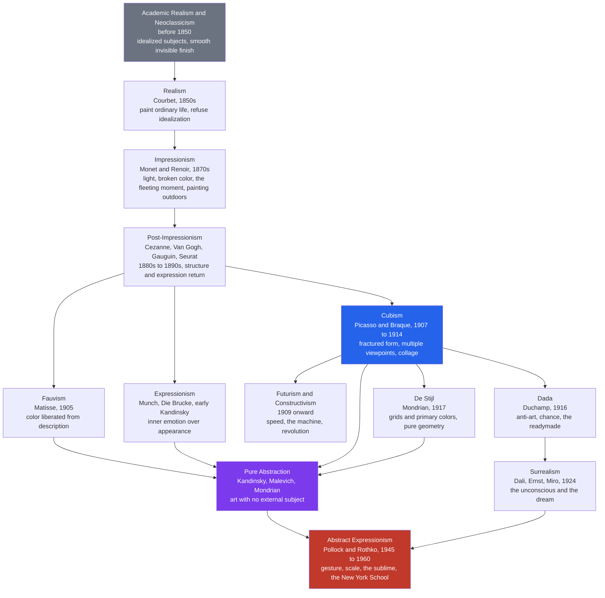

# 🖌️ Modern Art Movements

> [!abstract] TL;DR
> Between roughly 1850 and 1960, Western painting staged a slow-motion revolution: it stopped trying to imitate the visible world and turned to interrogate its own means — color, line, surface, form, and finally pure sensation. The story is a relay of "isms" — Realism, Impressionism, Post-Impressionism, Fauvism, Expressionism, Cubism, Futurism, Dada, De Stijl, Surrealism, and Abstract Expressionism — each handing off a discovery to the next. The engine driving the march is a **progressive break from academic realism toward abstraction and artistic autonomy**, catalyzed by photography (which relieved painting of mere recording), industrialization, new synthetic pigments, and the shock of Japanese prints. What began as a fresh way to paint a haystack ended, ninety years later, as a canvas that is *about nothing but paint itself*.

---

## Intuition

**Analogy — the family that keeps rebelling.** Think of modern art as a lineage of rebellious children, each one reacting against the parent who raised it, yet unmistakably carrying the family features. The stern grandfather is **Academic art**: idealized gods and generals, invisible brushwork, a window onto a perfect illusion. His son **Realism** refuses to paint gods and paints stone-breakers and peasants instead — same craft, scandalous subject. Realism's child **Impressionism** decides the *subject* barely matters; what matters is the shimmer of light on water, caught in twenty minutes before the cloud moves. Impressionism's children split: one obsesses over **structure** (Cézanne), one over raw **feeling** (Van Gogh), one over **flat pattern and symbol** (Gauguin). Their grandchildren push each obsession to its limit — until Cézanne's structural analysis becomes **Cubism's** shattered geometry, Van Gogh's feeling becomes **Expressionism**, and someone finally realizes you can drop the recognizable object entirely and paint *pure color and form*. That last grandchild is **abstraction**.

The key move to feel is this: **each generation subtracts one more layer of "resemblance to the world" and adds one more layer of "attention to the medium."** Nobody planned the destination. Each artist solved one local problem — how do I paint light? how do I make a flat canvas feel solid? how do I paint an emotion? — and the accumulated solutions marched, almost inevitably, away from the mirror and toward the pigment.

---

## How It Works

### The catalysts: why 1850 and not 1650

Modern art is not just a change of taste; it is a response to four external shocks that hit within a single generation.

1. **Photography (1839 onward).** Once a machine could record a face or a landscape in seconds with perfect accuracy, the painter's old job — faithful representation — was suddenly a solved problem, and cheaply. Painting was *freed* to ask what only painting can do: express, distort, structure, abstract. The camera did not kill painting; it kicked painting up the ladder of abstraction. (This is the deepest single cause of the whole story.)
2. **Industrialization.** The [[The_Second_Industrial_Revolution|Second Industrial Revolution]] built railways, boulevards, department stores, and a leisured urban middle class — the very subjects (and buyers) of Impressionism — while the machine age's speed and dynamism later became the explicit worship of Futurism.
3. **New pigments and the paint tube.** Chemistry delivered vivid synthetic colors (cerulean, cobalt violet, cadmium yellow) and, in 1841, the collapsible metal paint tube. Portable, pre-mixed paint made **plein air** (outdoor) painting practical — you could chase the light into a field, which Impressionism required.
4. **Japonisme.** The opening of Japan flooded Europe with *ukiyo-e* woodblock prints, whose flat color areas, cropped compositions, high viewpoints, and decorative outlines taught Van Gogh, Gauguin, and the Nabis that a picture need not be a deep illusionistic box.

### The mechanism of the relay

Each movement isolates a formal variable and pushes it:

- **Realism** (Courbet, 1850s) — attack *idealized subject matter*: paint the ordinary and the ugly at monumental scale.
- **Impressionism** (Monet, Renoir, 1870s) — attack *fixed local color and studio finish*: dab **broken color** side by side so the eye mixes it optically, capture the fleeting moment and changing light. See [[Color_Theory]] for the optics of broken color.
- **Post-Impressionism** (1880s–90s) — Impressionism felt formless, so its heirs each re-introduced structure by different routes: **Cézanne** rebuilt solid form from planes ("the father of modern art"), **Seurat** systematized broken color into **pointillism / divisionism**, **Van Gogh** charged color and stroke with emotion, **Gauguin** flattened into symbolic color fields.
- **Fauvism** (Matisse, 1905) — liberate *color* from description: a face can be green if the composition wants green.
- **Expressionism** (Munch, Die Brücke, early Kandinsky) — subordinate appearance to *inner emotional and spiritual truth*.
- **Cubism** (Picasso and Braque, 1907–14) — shatter *single-viewpoint perspective*: show multiple views at once on a frankly flat surface, and glue real newspaper onto the canvas (**collage**), admitting the picture is an object, not a window.
- **Abstraction** (Kandinsky, Malevich, Mondrian) — take the final step and *drop the recognizable object entirely*.
- **Dada** (Duchamp, 1916) — attack *the institution of art itself* with anti-art, chance, and the readymade (see [[What_Is_Art]]).
- **Surrealism** (Dalí, Ernst, 1924) — mine the *unconscious* and the dream via automatism (see [[Psychodynamic_Theories]]).
- **Abstract Expressionism** (Pollock, Rothko, 1945–60) — fuse abstraction and expression at heroic scale, aiming at the **sublime**.

### Family tree of the movements



The diagram encodes the actual descent: a single trunk (Academic to Realism to Impressionism to Post-Impressionism) that **forks in 1905–07** into the three great problems — color (Fauvism), emotion (Expressionism), and form (Cubism) — which all converge on **pure abstraction**, while a rebellious side-branch (Dada to Surrealism) refuses formal purity and attacks art's very definition. Both currents empty into **Abstract Expressionism**, which weds Cubist/abstract structure to Surrealist spontaneity.

---

## Key Concepts

### Secondary Level

**The one-line summary of each movement.** Realism = paint real, ordinary life (Courbet). Impressionism = capture light and the fleeting moment with quick, visible strokes outdoors (Monet). Post-Impressionism = bring back structure and personal emotion (Cézanne, Van Gogh). Fauvism = wild, unrealistic color (Matisse). Expressionism = paint feelings, not appearances (Munch's *The Scream*). Cubism = break objects into geometric facets and show many sides at once (Picasso). Dada = anti-art nonsense born of disgust at war. Surrealism = dreamlike, illogical images from the unconscious (Dalí's melting clocks). Abstract Expressionism = huge canvases of pure gesture and color (Pollock's drips).

**Why the strokes got looser.** Before modern art, painters hid their brushwork to make a smooth "window" onto an illusion. Modern painters *left the marks visible* — you can see the dabs, drips, and scrapes. The picture stopped pretending to be a window and admitted it was paint on a flat surface. That single honesty is the seed of everything that follows.

**The catalyst you must remember: the camera.** Photography could copy the world better than any hand. So painters asked, "What can I do that a camera cannot?" The answer — express, distort, dream, abstract — is the whole engine of modern art.

### Undergraduate Level

**Impressionism's technique.** Working *en plein air* with the new paint tubes, the Impressionists rejected the muddy, blended tones of the studio. They laid **broken color** — small, separate strokes of pure hue — side by side so the viewer's eye fuses them at a distance (a partial *additive* optical mix that keeps the color luminous; see [[Color_Theory]]). Subject matter became a pretext: Monet painted the *same* haystack or cathedral dozens of times purely to record how light rebuilt it hour by hour.

**Cézanne, the hinge of modern art.** Cézanne felt Impressionism had dissolved the solid world into flicker. He wanted "to make of Impressionism something solid and durable, like the art of the museums." His method: analyze nature into underlying geometric solids ("treat nature by the cylinder, the sphere, the cone"), build form from patches of modulated color rather than line, and gently tilt planes so the picture holds together *as a designed flat surface* even while depicting depth. This double allegiance — to the motif *and* to the autonomous picture-plane — is precisely what Cubism inherited and exploded.

**Cubism's two phases and collage.** *Analytic Cubism* (1908–12, Picasso and Braque) fractures a subject into shifting, semi-transparent facets seen from multiple viewpoints, in a near-monochrome palette — a radical break with the single fixed vantage of one-point perspective. *Synthetic Cubism* (1912 onward) reverses course: it *builds up* the image from flat shapes and introduces **collage** and *papier collé*, gluing newspaper, wallpaper, and chair-caning onto the canvas. Collage is a philosophical bombshell: it drags a scrap of the real world into the artwork and forces the picture to declare itself a constructed *object*, not an illusionistic window.

**From figuration to non-objective art.** Around 1910–15 several artists independently crossed the threshold to art with *no depicted subject at all*: **Kandinsky** (color and line as a "spiritual" music), **Malevich** (Suprematism — a black square on white), and **Mondrian** (De Stijl / Neo-Plasticism — only horizontals, verticals, and primary colors). Abstraction is not "bad drawing"; it is the deliberate claim that form and color are *self-sufficient* carriers of meaning.

**The avant-garde and "art for art's sake."** *Avant-garde* (a military metaphor — the advance guard) names artists who define themselves by breaking ahead of accepted taste, usually via a manifesto. The allied slogan **"art for art's sake"** (*l'art pour l'art*) asserts art's **autonomy**: art answers to its own internal standards, not to storytelling, morality, religion, or the market. This ideology of autonomy is what licenses abstraction — if art owes the world no resemblance, it is free to be *only* itself.

### Graduate Level

**Greenberg's medium-specific modernism.** The critic Clement Greenberg gave the "march toward abstraction" its most influential theory ("Modernist Painting," 1960). Borrowing Kant, he argued that each art becomes *modernist* by turning self-critical — using its own methods to isolate and foreground what is *unique and irreducible* to its medium. For painting, the irreducible essence is **flatness** (and the shape of the support). So the entire history from Manet forward is read as painting progressively purging itself of everything borrowed from sculpture and theater — modeled depth, illusionistic space, narrative — until only the flat, pigmented surface remains. On this account abstraction is not an arbitrary style but the *logical telos* of painting's self-purification, culminating in Pollock and the color-field painters. **This teleological narrative is powerful, canonical — and heavily contested**; it retroactively straightens a messy, plural history into a single inevitable line.

**The historical avant-garde versus formalist autonomy (Bürger).** Peter Bürger's *Theory of the Avant-Garde* (1974) draws a sharp distinction Greenberg blurs. Greenberg's modernism *perfects* the autonomy of art — art withdrawing into its own medium, safely inside the museum. The **historical avant-garde** (Dada, early Surrealism, Constructivism) did the opposite: it attacked *the institution of art itself* and tried to dissolve art back into life praxis. Duchamp's readymade is not a formal experiment in flatness; it is a bomb aimed at the categories "artwork," "artist," and "museum" (a challenge worked out in [[What_Is_Art]]). Reading Dada as one more formal "ism" misses that it was **anti-formalist and anti-autonomy** by design.

**The sublime and the New York School.** The Abstract Expressionists — especially Barnett Newman and Mark Rothko — explicitly reached past *beauty* toward **the sublime**: an overwhelming, quasi-religious encounter with vastness, void, and the infinite, achieved through enormous scale and enveloping fields of color that dwarf and surround the viewer's body. Newman's essay "The Sublime Is Now" reframes the goal of art away from pleasing form and toward *awe* — a shift in aesthetic values (see [[Beauty_and_Taste]]) as radical as the shift in style.

**"Primitivism" and the colonial substrate.** The Cubist and Expressionist breakthrough drew directly on African and Oceanic masks and carvings (Picasso's *Les Demoiselles d'Avignon*, 1907), and Gauguin's Tahitian work. Modern scholarship treats this "primitivism" critically: European artists appropriated objects wrenched from colonized cultures, misread ritual artifacts as raw "instinctive" form, and rarely credited their sources. The avant-garde's formal liberation was materially entangled with empire.

**The "-ism" as a social form.** Note the *sociology* of the period: modern art organizes itself into named, manifesto-issuing **movements** with founders, journals, group shows, and dealers. The "-ism" is a modern invention — a branded collective identity competing in an attention market. This institutional machinery (galleries, critics, little magazines, the emerging modern art museum) is inseparable from the art and prefigures the institutional theory of art itself.

---

## Python Demo

Two views of the same story, using only `numpy` and `matplotlib`. **Left:** an *influence network / timeline* — each movement is a node placed by its date (x) and its degree of abstraction (y), with arrows showing who influenced whom, so you can literally see the trunk fork in 1905–07 and converge on abstraction. **Right:** the *degree-of-abstraction curve* traced along the mainstream trajectory from about 1850 to 1950, quantifying the march away from representation.

```python
# The march toward abstraction, 1850-1960, as a network + a curve.
# Dependencies: numpy, matplotlib only.
import numpy as np
import matplotlib.pyplot as plt

# --- Movements: (name, year, abstraction 0..1) ---------------------------------
# abstraction = 0 means faithful representation; 1 means pure non-objective form.
M = {
    "Realism":                (1850, 0.10),
    "Impressionism":          (1872, 0.25),
    "Post-Impressionism":     (1888, 0.42),
    "Fauvism":                (1905, 0.58),
    "Expressionism":          (1906, 0.62),
    "Cubism":                 (1909, 0.72),
    "Futurism":               (1910, 0.70),
    "Dada":                   (1916, 0.78),
    "De Stijl":               (1917, 0.93),
    "Pure Abstraction":       (1915, 0.97),
    "Surrealism":             (1924, 0.60),
    "Abstract Expressionism": (1948, 0.94),
}

# --- Influence edges: (source -> target) ---------------------------------------
EDGES = [
    ("Realism", "Impressionism"),
    ("Impressionism", "Post-Impressionism"),
    ("Post-Impressionism", "Fauvism"),
    ("Post-Impressionism", "Expressionism"),
    ("Post-Impressionism", "Cubism"),
    ("Fauvism", "Pure Abstraction"),
    ("Expressionism", "Pure Abstraction"),
    ("Cubism", "Pure Abstraction"),
    ("Cubism", "Futurism"),
    ("Cubism", "De Stijl"),
    ("Cubism", "Dada"),
    ("De Stijl", "Pure Abstraction"),
    ("Dada", "Surrealism"),
    ("Pure Abstraction", "Abstract Expressionism"),
    ("Surrealism", "Abstract Expressionism"),
]

fig, (axL, axR) = plt.subplots(1, 2, figsize=(15, 7))

# ============================ LEFT: influence network ==========================
# Draw influence arrows first so nodes sit on top.
for src, dst in EDGES:
    x0, y0 = M[src]
    x1, y1 = M[dst]
    axL.annotate("", xy=(x1, y1), xytext=(x0, y0),
                 arrowprops=dict(arrowstyle="-|>", color="0.55",
                                 lw=1.3, shrinkA=14, shrinkB=14,
                                 connectionstyle="arc3,rad=0.12"))

years = np.array([v[0] for v in M.values()])
abstr = np.array([v[1] for v in M.values()])
sc = axL.scatter(years, abstr, s=520, c=abstr, cmap="viridis",
                 vmin=0, vmax=1, edgecolors="black", linewidths=1.3, zorder=3)

for name, (yr, ab) in M.items():
    axL.text(yr, ab + 0.035, name, ha="center", va="bottom",
             fontsize=8, fontweight="bold", zorder=4)

axL.set_title("Influence network of modern art movements\n"
              "position by date and degree of abstraction",
              fontsize=11, fontweight="bold")
axL.set_xlabel("Year")
axL.set_ylabel("Degree of abstraction  (0 = representation, 1 = pure form)")
axL.set_xlim(1842, 1958)
axL.set_ylim(0.0, 1.08)
axL.grid(alpha=0.25)
cbar = fig.colorbar(sc, ax=axL, shrink=0.85)
cbar.set_label("abstraction level")

# ============================ RIGHT: abstraction curve =========================
# Mainstream trajectory: the trunk that leads to full abstraction.
trunk = ["Realism", "Impressionism", "Post-Impressionism",
         "Fauvism", "Cubism", "Pure Abstraction",
         "De Stijl", "Abstract Expressionism"]
tx = np.array([M[m][0] for m in trunk], dtype=float)
ty = np.array([M[m][1] for m in trunk], dtype=float)
order = np.argsort(tx)
tx, ty = tx[order], ty[order]
trunk_sorted = [t for _, t in sorted(zip([M[m][0] for m in trunk], trunk))]

# Smooth interpolation for the "march toward abstraction" curve.
xx = np.linspace(tx.min(), tx.max(), 400)
yy = np.interp(xx, tx, ty)

axR.plot(xx, yy, color="#7c3aed", lw=2.5, label="march toward abstraction")
axR.scatter(tx, ty, s=90, color="#c0392b", zorder=3, edgecolors="black")
for m in trunk_sorted:
    yr, ab = M[m]
    axR.annotate(m, (yr, ab), textcoords="offset points",
                 xytext=(6, -12), fontsize=8, rotation=20)

axR.axhline(0.5, color="0.6", ls="--", lw=1)
axR.text(1852, 0.52, "half-abstract threshold", fontsize=8, color="0.4")
axR.fill_between(xx, yy, 0, color="#7c3aed", alpha=0.08)

axR.set_title("Degree of abstraction along the mainstream trunk\n"
              "photography frees painting from mere representation",
              fontsize=11, fontweight="bold")
axR.set_xlabel("Year")
axR.set_ylabel("Degree of abstraction")
axR.set_ylim(0, 1.05)
axR.grid(alpha=0.25)
axR.legend(loc="lower right")

plt.tight_layout()
plt.savefig("modern_art_movements.png", dpi=120, bbox_inches="tight")
print("Saved modern_art_movements.png")
print(f"Abstraction rose from {ty[0]:.2f} (Realism, {int(tx[0])}) "
      f"to {ty[-1]:.2f} (Abstract Expressionism, {int(tx[-1])}).")
```

Running it produces two panels. The **network** shows the genealogy visually: a low, representational trunk climbing through Impressionism and Post-Impressionism, a fork at 1905–07 into Fauvism / Expressionism / Cubism, and a convergence of arrows onto *Pure Abstraction* and *Abstract Expressionism* near the top — with Dada→Surrealism as the one branch that dips *back down* toward imagery. The **curve** quantifies the same trend: abstraction climbs from about 0.10 to about 0.94 in a single century, crossing the "half-abstract" line right around Cubism (1909) — the moment the recognizable world begins to dissolve for good.

---

## Real-World Applications

- **The museum canon and art-historical pedagogy.** The "isms" are the organizing skeleton of every Art History 101 course, every major museum's floor plan (MoMA, the Musée d'Orsay, Tate Modern), and the wall-label vocabulary the public uses to see art. The narrative is not neutral: choosing which movements count *builds* the canon.
- **The art market.** Provenance to a named movement is a primary driver of valuation. A canvas confidently attributed to Analytic Cubism or Abstract Expressionism commands eight- and nine-figure prices; the movement label is, in effect, a brand that authenticates and monetizes.
- **Graphic design, architecture, and typography.** De Stijl and the Bauhaus turned modernist abstraction into a *design language* — the grid, primary colors, sans-serif type, and "form follows function" that still govern corporate identity, product design, and the clean geometry of modern user interfaces. Mondrian's grid is on everything from dresses to app icons.
- **Advertising and film.** Surrealism's dream logic and uncanny juxtaposition became the default grammar of surreal advertising and music video; Impressionist and Fauvist color strategies feed cinematography and color grading.
- **Art therapy.** Surrealist **automatism** (drawing without conscious control to surface unconscious material) fed directly into therapeutic art practices grounded in the [[Psychodynamic_Theories|psychodynamic]] idea that the unconscious speaks through spontaneous imagery.
- **Generative and neural-style AI.** Neural style transfer and diffusion models are routinely trained and prompted on these movements ("in the style of Van Gogh / Cubist / Rothko"), making the modernist vocabulary a literal parameter space for machine image-making.

---

## Common Pitfalls

- **Reading it as inevitable linear "progress."** The clean story "representation → abstraction" is largely Greenberg's *retroactive* teleology. In reality the movements overlapped, contradicted, and doubled back (Surrealism re-embraced imagery *after* pure abstraction existed). Treat the arrow as one influential interpretation, not a law of nature.
- **Equating "modern art" with "everything weird" or with "contemporary art."** *Modern art* is a period term (roughly 1850–1960) with specific movements; *contemporary art* is the later, post-1960s field (Pop, Minimalism, Conceptual, and after). Calling a 2020 installation "modern art" is a category error historians will flag instantly.
- **Thinking abstraction means "no meaning" or "no skill."** Abstraction is a positive claim that form and color carry meaning *directly*, not a failure to draw. Mondrian's grids and Rothko's fields are the product of relentless discipline and theory, not the absence of it.
- **Collapsing Impressionism into all of modern art.** Impressionism is the most popular movement, so beginners use it as a synonym for "modern art." It is only the *first* step; Cézanne, Cubism, and abstraction are the more consequential ruptures.
- **Ignoring the colonial and gendered substrate.** The heroic "primitivism" of Picasso and Gauguin appropriated colonized cultures' objects, and the canonical roster is overwhelmingly male, erasing figures like Sonia Delaunay, Hilma af Klint (a non-objective painter *before* Kandinsky), and Hannah Höch. The tidy family tree hides real exclusions.
- **Treating movements as neat boxes with hard start dates.** Artists moved between "isms" (Kandinsky was an Expressionist *and* a pioneer of abstraction; Picasso worked in several modes at once). The labels are useful shorthand, not sealed containers.

---

## Related Concepts

*(This section's companion notes — on Renaissance and Baroque art, Contemporary and Postmodern art, Formalism, Photography, and The Sublime — are planned; links will be added here as those notes are created.)*

- [[What_Is_Art]] — Dada and the readymade (Duchamp's *Fountain*, 1917) are the events that broke every essence-based definition of art; modern art's history is the setup, and the definition problem is the payoff.
- [[Color_Theory]] — Impressionist broken color and optical mixing, and Fauvism's non-local high-chroma color, are the practical applications of the color science laid out there.
- [[Beauty_and_Taste]] — modern art's turn from *beauty* toward the difficult, the ugly, and the sublime is a direct challenge to the classical equation of art with beauty and good taste.
- [[Aesthetics_and_Art_Overview]] — situates these movements within the broader field of aesthetics and the philosophy of art.
- [[Psychodynamic_Theories]] — Freud's model of the unconscious, dreams, and free association is the explicit theoretical source for Surrealist automatism and dream imagery.
- [[The_Second_Industrial_Revolution]] — the urban, mechanized, consumer society that supplied Impressionism's subjects and buyers and Futurism's cult of the machine.
- [[World_War_I_and_Its_Aftermath]] — the trauma of industrialized war triggered Dada's disgust-driven anti-art and shaped the flight into the Surrealist unconscious.

---

## Review Questions

### Secondary
1. Name the movement, a key artist, and the one-sentence "big idea" for each of: Impressionism, Cubism, and Surrealism.
2. Explain in your own words how the invention of photography could *encourage* rather than destroy painting. What "job" did the camera take over, and what were painters freed to do instead?

### Undergraduate
1. Trace a single line of influence from Impressionism to pure abstraction, naming the intermediate movements and what specific formal problem each one solved or introduced. Where in your chain does the "recognizable subject" effectively disappear?
2. Cézanne is called "the father of modern art." Using his stated aim to make Impressionism "solid and durable like the art of the museums," explain what he changed about painting and how Cubism inherited and radicalized it.
3. Compare Fauvism's and Cubism's breaks with tradition: one liberated *color*, the other liberated *form and viewpoint*. Why might both have been necessary preconditions for a fully non-objective abstraction?

### Graduate
1. Reconstruct Greenberg's argument that modernist painting progresses by isolating the medium's "irreducible essence" of flatness. Then state the strongest objection to reading the whole 1850–1960 period as this single self-purifying line, using Surrealism or Dada as a counterexample.
2. Using Bürger's distinction, explain why treating Dada as "just another formal ism" misunderstands it. What is the difference between *perfecting the autonomy of art* (Greenbergian modernism) and *attacking the institution of art* (the historical avant-garde), and where does Duchamp's readymade fall?
3. Abstract Expressionism is often described as reaching for "the sublime" rather than "the beautiful." Define both aesthetic categories, explain what Newman and Rothko did formally (scale, color field, the viewer's body) to produce a sublime rather than a merely beautiful experience, and connect this to the broader modernist devaluation of beauty as art's goal.

---

## Sources

- [Greenberg, C. (1960). "Modernist Painting." *Forum Lectures*, Voice of America.](https://voidnetwork.gr/wp-content/uploads/2016/09/Modernist-Painting-by-Clement-Greenberg.pdf)
- Hughes, R. (1980, rev. 1991). *The Shock of the New: Art and the Century of Change*. Alfred A. Knopf / BBC.
- Arnason, H. H., & Mansfield, E. C. (2012). *History of Modern Art*, 7th ed. Pearson / Prentice Hall.
- Bürger, P. (1974/1984). *Theory of the Avant-Garde* (trans. M. Shaw). University of Minnesota Press.
- [The Museum of Modern Art — "Art Terms" glossary (Impressionism, Cubism, Surrealism, Abstract Expressionism).](https://www.moma.org/learn/moma_learning/glossary/)
- [Tate — "Art Movements" resource.](https://www.tate.org.uk/art/art-terms)

---

#aesthetics #art-history #modern-art #impressionism #cubism
