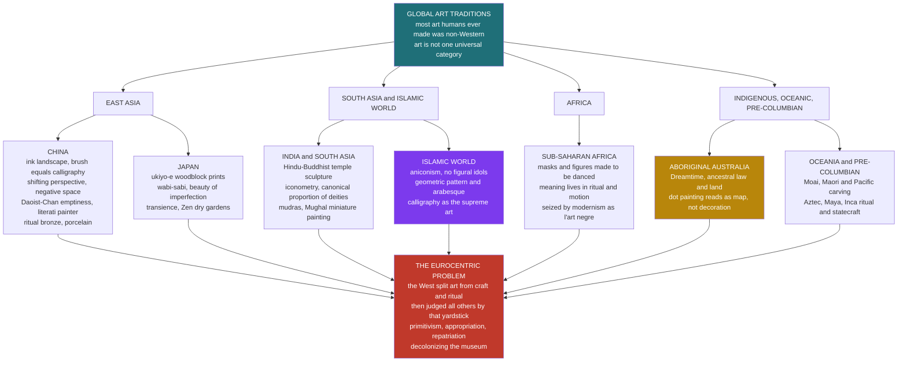

# 🌍 Non-Western and Global Art Traditions

> [!abstract] TL;DR
> The overwhelming majority of the objects humans have made and prized as beautiful, sacred, or powerful were produced *outside* Europe — Chinese ink landscapes, Japanese woodblock prints, Islamic geometric tiling, Indian temple sculpture, African masks, Aboriginal Dreamtime paintings — yet the discipline called "art history" was built to narrate a single line from Greece to modern Paris. Studying global art means two things at once: encountering the astonishing formal systems these traditions invented (brush-primacy and negative space in China, aniconic infinity in Islam, iconometry in India, art-in-motion in Africa), *and* dismantling the Eurocentric frame that splits "art" from "craft" and "ritual object," ranks cultures on a ladder, and pins living things dead behind museum glass. The debates it generates — primitivism, cultural appropriation, repatriation, decolonizing the museum — are not footnotes; they decide who owns culture and whose gaze defines beauty.

---

## Intuition

**Analogy — the label on the glass case.** Picture a Yoruba *gelede* mask in a European museum: carved by a named master, meant to be worn low over the dancer's brow at dusk, tilted forward so the spirit "sees" through it, sweated in, drummed to, whirled through a crowd, and then retired or left to rot because its power lived in the *event*, not the object. Now it hangs motionless in a climate-controlled vitrine, spotlit from a fixed angle it was never meant to be seen from, behind glass that forbids touch, beside a card that reads "Mask. Wood, pigment. Nigeria. Artist unknown. Early 20th c." Every word on that card quietly rewrites the thing: it freezes a moving performance into a static "sculpture," it erases the maker's name to make him "anonymous" and therefore "primitive," it calls a ritual instrument "art," and it lets you keep your coat on and your distance.

That gap — between what the object *was made to do* and what the museum *makes it be* — is the whole subject. Non-Western art is not simply "the same enterprise as Western art, done elsewhere." It is often a different enterprise entirely, and the first task is to notice that the very word "art," and the glass case around it, are not neutral. They are a specific, recent, European invention that we have exported to the rest of the planet and then used to judge the planet's own creations.

---

## How It Works

Two problems run in parallel through this whole field, and you must hold both at once.

**Problem one — the frame.** The modern concept of "fine art" (autonomous objects made for disinterested visual contemplation, cleanly separated from craft, decoration, religion, and use) is a local European construction, largely of the eighteenth century. Before then even Europe did not have it; afterward, Europe projected it backward across all of history and outward across all of geography. This frame does three kinds of damage to non-Western traditions: it **splits** integrated wholes (a Hindu temple is architecture *and* sculpture *and* liturgy *and* cosmology; the frame files it under "sculpture"), it **ranks** (traditions that make figural, illusionistic, individually-signed objects sit "higher" than those that make masks, textiles, or pattern), and it **freezes** (performance and ritual objects become gallery specimens). The discipline of art history, canonized in the nineteenth century, encoded all three.

**Problem two — the traditions themselves.** Set against that frame are the actual formal systems, each internally coherent and often far older than the European canon:

1. **China** — the primacy of the *brushstroke*. Painting is a branch of calligraphy; the disciplined, unrepeatable ink line carries the artist's *qi* (breath-energy) and moral character. The ideal is the *literati* (scholar-amateur) painter, who paints to cultivate the self, not to sell. Space is organized by **shifting perspective** (the eye is led on a journey, not fixed at one vanishing point) and by **negative space** — vast passages of empty silk or paper are not "unfinished background" but the active presence of mist, water, and Daoist/Chan *emptiness*. Ceramics (porcelain) and ritual bronzes are equally central, not "minor arts."
2. **Japan** — imported Chinese ink painting and Zen, then invented its own idioms: *ukiyo-e* woodblock prints of the "floating world," *wabi-sabi* (the aesthetic of imperfection, asymmetry, weathering, and transience — a cracked tea bowl valued *for* its flaw), and Zen dry-landscape gardens that compose raked gravel and a few rocks into meditative infinity.
3. **India and South Asia** — Hindu and Buddhist temple architecture and sculpture, governed by **iconometry**: deities are proportioned by fixed canonical measures (*tala* units) laid down in the *shilpa shastras*, so that a "correct" image is a diagram of cosmic order, not a life-study. Multiple arms, heads, and *mudras* (hand-gestures) are a precise theological language. Later, Mughal **miniature painting** fuses Persian, Indian, and (via trade) European elements.
4. **The Islamic world** — a broad tradition unified by **aniconism** (avoidance of figural images in sacred contexts, to forbid idolatry) that redirected genius into three supreme non-figural arts: infinite **geometric pattern** (governed by rotational and reflection symmetry), the flowing vegetal **arabesque**, and above all **calligraphy** — the written word of God as the highest visual art.
5. **Africa** — masks and figures whose meaning is inseparable from **ritual function and motion**: they are activated in ceremony, danced, addressed, fed, and understood as vessels of ancestral or spiritual force. Their "discovery" by Picasso, Matisse, and the Cubists around 1906–07 (dubbed *l'art nègre*) helped detonate European modernism — while stripping the objects of their meaning and reframing them as "primitive" raw form.
6. **Indigenous, Oceanic, and Pre-Columbian** — Aboriginal Australian painting encodes the **Dreamtime** (ancestral law, sacred geography, and kin relations) in maps that outsiders read as abstract "dot painting"; Oceanic carving, Pacific tattoo, and the monumental art of the Aztec, Maya, and Inca operate as ritual, genealogy, and statecraft, not gallery decoration.

The synthesis: to study global art well you must simultaneously *learn each tradition's own terms* and *keep noticing the Western frame you are viewing it through*.



The diagram's shape is the argument: every branch is a rich, self-standing system, yet all of them flow into the same red node — because in the actual history of the discipline, each was received, sorted, and often diminished through a single European frame. World art history is the project of loosening that funnel.

---

## Key Concepts

### Secondary Level

**Most art was never Western.** For every marble Venus and oil Madonna, there are ten thousand Chinese scrolls, Japanese prints, Persian tiles, Indian bronzes, Yoruba masks, and Aboriginal bark paintings. "Art history" as usually taught tells a thin European thread as if it were the whole cloth.

**A quick tour of formal ideas.** Chinese landscape painting leaves huge areas *blank* on purpose — the emptiness is mist, water, and calm, and it is the point. Japanese *wabi-sabi* finds beauty in the cracked, faded, and asymmetrical rather than the shiny and perfect. Islamic art fills surfaces with dazzling *geometric patterns* and beautiful writing instead of pictures of people. African masks were made to be *worn and danced*, not hung on a wall. Aboriginal "dot paintings" are actually maps of sacred land and ancestral stories.

**Art, craft, or ritual object?** In much of the world, the tidy Western boxes do not fit. A carved mask is a religious instrument; a woven textile is a record of clan identity; a temple carving is theology in stone. Calling all of these "art" is convenient for museums but can miss what the makers thought they were doing.

### Undergraduate Level

**The Eurocentric frame, precisely.** The category *fine art* — objects made purely to be looked at, autonomous from use, ranked above "craft" and "decoration," produced by a named individual genius — is not universal or timeless. It crystallized in eighteenth-century Europe (Paul Oskar Kristeller called it "the modern system of the arts"). Nineteenth-century art history then wrote a **teleological narrative**: a single upward story from Greek naturalism through the Renaissance to modern Europe, with everything else slotted in as "earlier," "primitive," "decorative," or "ethnographic." Non-Western traditions were literally housed in *different buildings* — the fine-art museum for Europe, the ethnographic or natural-history museum for everyone else.

**Chinese aesthetics — brush, emptiness, the scholar-painter.** In the Chinese view, painting and calligraphy are one art, both made with the same brush and ink, and both valued as traces of the artist's inner life. Xie He's sixth-century "Six Principles" put *qi yun sheng dong* — "spirit-resonance, life-motion" — first: a painting must be *alive*, not merely accurate. The prized painter is the *wenren* (literati): a scholar-official who paints as self-cultivation, disdaining professional polish. Space is handled through **shifting or moving perspective** (a handscroll unrolls as a journey; there is no single fixed viewpoint) and through the deliberate **void** — Daoist *wu* (nothingness) and Chan (Zen) emptiness made visible, so that what is *not* painted carries as much meaning as what is.

**Japanese aesthetics — impermanence and imperfection.** *Ukiyo-e* ("pictures of the floating world") were mass-produced woodblock prints of actors, courtesans, and landscapes (Hokusai's *Great Wave*, Hiroshige's roads) — a popular, commercial art. *Wabi-sabi* names a refined taste for the impermanent, incomplete, and humble: the tea master prizes the irregular, ash-glazed bowl and repairs its cracks with gold (*kintsugi*) rather than hiding them. Transience (*mono no aware*, the poignancy of passing things) is not a flaw to be overcome but the very source of beauty.

**Indian iconometry.** Hindu and Buddhist images are built to **canonical proportions** set out in the *shilpa shastras*: a deity's every dimension is fixed in *tala* modules so that the finished figure is a precise, cosmologically correct diagram. Multiple arms and heads, *mudras* (coded hand gestures), *asanas* (postures), and attributes form a dense theological sign-system. The sculptor is a devotee executing a sacred formula, not a naturalist studying a live model — which is exactly why early European viewers, expecting Greek naturalism, dismissed Indian gods as "monstrous."

**Islamic aniconism and the infinite.** Wary of idolatry, Islamic sacred art largely **avoids figural images** and channels its energy into three arts that can be endlessly elaborated without depicting a living being: **geometry** (star-and-polygon tilings that could, in principle, repeat forever — a visual metaphor for the infinity and unity of God), the **arabesque** (rhythmic, interlacing vegetal scrollwork), and **calligraphy** (the Qur'anic word itself as the highest visual art). Note that Persian, Mughal, and Ottoman *secular* art did produce superb figural miniature painting — aniconism is a rule of the sacred, not an absolute ban.

**African art and the modernist "discovery."** Sub-Saharan masks and figures are **ritual technology**: activated in ceremony, danced, fed, and understood as housing spiritual force — Robert Farris Thompson's phrase *African art in motion* captures that their aesthetic is inseparable from performance. Around 1906–07, Picasso, Matisse, Derain, and others encountered such objects in Paris flea markets and the ethnographic Trocadéro, and their radical simplification of form (the faces of *Les Demoiselles d'Avignon*) drew directly on them. This "*l'art nègre*" moment gave African form immense influence — while emptying it of meaning, renaming it "primitive," and treating the makers as timeless "savages" rather than contemporaries with names and histories.

**Japonisme.** The reverse traffic: when Japan reopened to trade, *ukiyo-e* prints flooded Europe and reshaped Impressionism and Post-Impressionism. Flat color planes, cropped asymmetrical framing, high vantage points, and everyday subjects in Monet, Degas, Van Gogh, and Whistler are lifted from Japanese prints. Global art history runs *both ways*.

### Graduate Level

**Fine art as an eighteenth-century artifact (Kristeller).** The claim is strong and consequential: the grouping of painting, sculpture, architecture, music, and poetry into one class ("the fine arts") sharing an essence and set apart from the "mechanical" or "servile" arts is not found in antiquity or the Middle Ages and does not exist, in that form, in most non-European cultures. If "art" is historically local, then applying it universally is an act of translation — sometimes illuminating, sometimes a category error. This is the philosophical hinge that connects this note to the definitional debates in [[What_Is_Art]].

**Primitivism and its critique.** Modernism's romance with the "primitive" reached an institutional climax in MoMA's 1984 exhibition *"Primitivism" in 20th Century Art: Affinity of the Tribal and the Modern*, which paired modern masterworks with tribal objects to show formal "affinities." Critics — Hal Foster ("The 'Primitive' Unconscious of Modern Art"), James Clifford, Thomas McEvilley — savaged it: by stripping dates, names, and functions and displaying non-Western objects only as *anticipations of* or *resemblances to* European modernism, the show made other cultures into a mute mirror for Western creativity, denying them their own history and coevalness. Primitivism, on this reading, is not appreciation but appropriation with the labels off.

**The ethnographic museum problem (Sally Price).** In *Primitive Art in Civilized Places*, Sally Price dissects how Western display conventions manufacture "the Primitive": anonymity (the maker is "unknown," so the object seems to spring from a collective, timeless folk rather than an individual talent), decontextualization (spotlight, plinth, glass), and the assumption that non-Western objects need *no* wall text because they speak a universal language of form — while European works get names, dates, and dense scholarship. The very architecture of the two museum types (fine-art vs. ethnographic) encodes a hierarchy of peoples.

**World art history vs. art history.** A movement (David Summers's *Real Spaces*, James Elkins's *Is Art History Global?*, Kitty Zijlmans and Wilfried van Damme's *World Art Studies*) asks whether the *methods* of the discipline — the very concepts of style, period, influence, masterpiece, the visual — are themselves so Western that "global art history" risks re-colonizing its objects with Western analytic tools. Proposals range from comparative frameworks to abandoning "art" for broader terms like "the visual" or "made things." There is no settled answer; the problem is live.

**Cultural appropriation vs. exchange.** Not all borrowing is theft. The category of harmful *appropriation* typically involves a **power asymmetry** (a dominant group taking from a marginalized one), a **decontextualization** (sacred or meaningful forms used as fashion or décor), and a **failure of credit or benefit** (the source community neither acknowledged nor compensated). Distinguishing this from ordinary, universal cultural exchange (all art borrows) is genuinely hard, and the debate turns on who has the standing to license use of a tradition — a question sovereignty movements press directly (see [[Indigenous_Rights_and_Sovereignty]]).

**Repatriation and decolonizing the museum.** The flagship disputes: the **Parthenon (Elgin) Marbles** (Athens vs. the British Museum), the **Benin Bronzes** (looted by a British punitive expedition in 1897, now dispersing back to Nigeria), and, in the United States, **NAGPRA** (1990), which mandates return of Native American human remains and sacred objects. The 2018 **Sarr-Savoy report**, commissioned by France, argued for restituting African heritage taken without consent and catalyzed a wave of European returns. "Decolonizing the museum" bundles these with demands to rewrite labels, disclose looting provenance, hire from source communities, and question whether the encyclopedic "universal museum" (which claims to hold world heritage in trust for humanity) is a noble ideal or a colonial alibi. These debates connect directly to [[Colonialism_and_Postcolonial_Anthropology]] and [[Postcolonial_Literary_Theory]].

---

## Python Demo

We illustrate a *formal principle* of Islamic geometric art: an entire aniconic pattern is generated by applying a **symmetry group** — rotations and reflections — to a single fundamental motif, then translating it across a lattice. An eight-pointed star has the dihedral symmetry group **D8** (eight rotations plus eight mirror axes); repeating it by translation yields a decoration that is, in principle, *infinite* — a visual metaphor for divine unity and the endlessness of creation, achieved with zero figural imagery. This is the same mathematics of symmetry studied in [[Groups_and_Subgroups]], here doing theological work.

```python
# Builds an Islamic-style geometric star pattern with numpy + matplotlib only.
# Idea: one motif (an 8-pointed star) carries the dihedral symmetry group D8
# (8 rotations + 8 mirror axes); translating it tiles an infinite aniconic pattern.
import numpy as np
import matplotlib.pyplot as plt

def star(n, R, r, cx, cy, phase=0.0):
    """Vertices of an n-pointed star: alternate outer radius R and inner radius r."""
    ang = np.linspace(0.0, 2.0 * np.pi, 2 * n, endpoint=False) + phase
    rad = np.where(np.arange(2 * n) % 2 == 0, R, r)   # outer, inner, outer, inner...
    return cx + rad * np.cos(ang), cy + rad * np.sin(ang)

fig, (axL, axR) = plt.subplots(1, 2, figsize=(12, 6))

# ---- Left: ONE 8-pointed star and its D8 symmetry (8 mirror axes drawn) ----
N = 8
xs, ys = star(N, 1.0, 0.42, 0.0, 0.0, phase=np.pi / N)
axL.fill(xs, ys, facecolor="#1f6f78", edgecolor="#0b2e33", linewidth=2.0, zorder=3)
for k in range(N):                                   # the 8 reflection axes of D8
    a = k * np.pi / N
    axL.plot([-1.3 * np.cos(a), 1.3 * np.cos(a)],
             [-1.3 * np.sin(a), 1.3 * np.sin(a)],
             color="#c0392b", lw=0.8, ls="--", zorder=1)
axL.set_title("One motif: 8-pointed star\nsymmetry group D8 = 8 rotations + 8 mirrors")
axL.set_aspect("equal"); axL.axis("off")

# ---- Right: TILE the motif by translation + a rotated interstitial star ----
step = 2.2
for i in range(5):
    for j in range(5):
        cx, cy = i * step, j * step
        sx, sy = star(8, 0.95, 0.40, cx, cy, phase=np.pi / 8)          # star at node
        axR.fill(sx, sy, facecolor="#1f6f78", edgecolor="#0b2e33", lw=1.2)
        sx2, sy2 = star(8, 0.50, 0.21, cx + step / 2, cy + step / 2)   # rotated infill
        axR.fill(sx2, sy2, facecolor="#e0a458", edgecolor="#7a5320", lw=1.0)
axR.set_title("Tessellation: same motif repeated by translation + rotation\n"
              "aniconic, algorithmic, in principle infinite")
axR.set_aspect("equal"); axR.axis("off")
axR.set_xlim(-1, 4 * step + 1); axR.set_ylim(-1, 4 * step + 1)

plt.tight_layout()
plt.savefig("islamic_star_pattern.png", dpi=120, bbox_inches="tight")
plt.show()

# ---- Console: the symmetry group is what "generates" the whole design ----
print("Fundamental motif : 8-pointed star")
print("Symmetry group    : D8  ->  |D8| = 2*8 =", 2 * N, "symmetries")
print("  rotations : angles k * 360/8 deg for k = 0..7")
print("  reflections: 8 mirror axes through the star")
print("Whole pattern = motif acted on by D8, then repeated by translation (a lattice).")
print("No figure is ever drawn: infinity and unity are expressed by SYMMETRY alone.")
```

**Expected console output:**

```
Fundamental motif : 8-pointed star
Symmetry group    : D8  ->  |D8| = 2*8 = 16 symmetries
  rotations : angles k * 360/8 deg for k = 0..7
  reflections: 8 mirror axes through the star
Whole pattern = motif acted on by D8, then repeated by translation (a lattice).
No figure is ever drawn: infinity and unity are expressed by SYMMETRY alone.
```

The left panel shows the single motif and its sixteen symmetries; the right panel shows what happens when you let translation loose — the pattern marches off the edge of the canvas in every direction, exactly the point of the tradition: an ornament with no natural boundary, no depicted person, and no fixed center, standing for a God who is one, infinite, and beyond image. The aesthetics *is* the mathematics.

---

## Real-World Applications

**Museum practice and decolonization.** Every major museum is now rewriting itself against this material: the British Museum, the Met, the Humboldt Forum in Berlin, and France's *musée du quai Branly* face restitution claims, provenance audits, and label rewrites. The Benin Bronzes are actively being returned; the Sarr-Savoy report reshaped French policy. Curatorial jobs, acquisition budgets, and international law now hinge on the arguments above.

**Global art markets and heritage law.** UNESCO's 1970 Convention against illicit trafficking, national patrimony laws, and NAGPRA govern billions of dollars in antiquities and set the boundary between legitimate collecting and looting. Auction houses must now publish provenance; objects with colonial-era gaps are increasingly unsellable.

**Design, branding, and the appropriation line.** Fashion houses, tattoo studios, film design (Māori *moko*, Native American headdresses, Aboriginal motifs, henna) repeatedly ignite appropriation controversies. Companies now consult source communities, license motifs, and credit or compensate — an operational answer to the theory of appropriation.

**Cross-cultural aesthetics in creative tech.** Generative and parametric design draws directly on non-Western formal systems: algorithmic *girih* and *muqarnas* generators in architecture (the symmetry math above), procedural pattern in games and textiles, and computational analysis of ink-wash and calligraphic brush dynamics. Global aesthetics is a live source of design vocabulary.

**Cultural diplomacy and identity.** Returned heritage, national pavilions at biennials, and the international circulation of non-Western contemporary art are instruments of soft power and post-colonial nation-building — art history as statecraft.

---

## Common Pitfalls

- **Treating "non-Western" as one thing.** The category lumps together Song-dynasty scrolls, Benin bronzes, and Aboriginal bark painting whose only shared feature is *not being European*. Defined by a negation, it centers the West by default. Use it as a critical shorthand, never as a real aesthetic unit.
- **Applying the fine-art/craft hierarchy uncritically.** Calling a Navajo weaving or a Chinese porcelain a "minor" or "decorative" art imports exactly the ranking this field exists to question. In their own contexts these were often the highest, most prestigious arts.
- **Freezing living traditions in the ethnographic present.** Writing about "the African mask" or "the Aboriginal painting" in a timeless present tense denies these cultures history and change, and erases the named, dated, individual artists who made specific objects. Coevalness is the fix: they are your contemporaries, not your past.
- **Mistaking primitivist "appreciation" for respect.** Praising African form as "raw," "instinctive," or "pure" while ignoring its meaning, makers, and history repeats the primitivist move. Formal admiration without context is a subtler version of the museum's decontextualization.
- **Collapsing all borrowing into "appropriation" — or dismissing appropriation entirely.** Both extremes fail. All art exchanges; not all exchange is harmful; harm turns on power asymmetry, sacred decontextualization, and lack of credit or benefit. The work is in the distinctions, not the slogan.
- **Reading negative space or aniconism as "lack."** Chinese emptiness is not an unfinished background and Islamic aniconism is not an inability to draw people — each is a *positive* aesthetic and theological choice. Describing them as absences measures them against a Western presence they never sought.
- **Assuming "decolonizing" just means returning objects.** Repatriation is one strand; the deeper task includes rewriting narratives, sharing curatorial authority, and questioning the concepts (style, masterpiece, "art" itself) through which the discipline sees.

---

## Related Concepts

- [[What_Is_Art]] — the definitional debate directly underwrites this note: if "fine art" is an 18th-century European category, applying it globally is precisely the problem Kristeller and world-art-history diagnose
- [[Postcolonial_Literary_Theory]] — Said's Orientalism, Spivak's subaltern, and Bhabha's hybridity are the theoretical engine behind critiques of primitivism, the ethnographic museum, and the Eurocentric canon
- [[Feminist_and_Queer_Literary_Theory]] — the parallel critique that the canon encodes whose gaze and whose bodies count; feminist and postcolonial critiques of art history run together in questioning the "great masters" narrative
- [[Colonialism_and_Postcolonial_Anthropology]] — colonial collecting built the ethnographic museum; anthropology's reckoning with that history is the same reckoning driving repatriation and decolonizing debates
- [[Non_Western_Literary_Traditions]] — the literary companion: the same Eurocentric-canon problem and the same wealth of Chinese, Sanskrit, Arabic, Japanese, African, and Indigenous traditions, in words rather than images
- [[World_Music_Scales_and_Systems]] — the sonic parallel: non-Western scales, tunings, and rhythmic systems that Western music theory long treated as "exotic" deviations from a supposed norm
- [[Culture_Symbols_and_Meaning]] — Geertz's interpretive anthropology and symbolic analysis give the tools for reading a mask or motif as meaning-in-context rather than pure form
- [[Religion_Magic_and_Ritual]] — most non-Western "art" is ritual technology; understanding masks, icons, and temple images requires the anthropology of ritual and the sacred
- [[Material_Culture_and_Technology]] — archaeology's study of made objects as social and technological artifacts reframes "art vs. craft vs. tool" as a single continuum of material culture
- [[Economic_Anthropology_and_Exchange]] — objects circulate as gifts, prestige goods, and commodities; the looting-and-market debate is an economic-anthropology question about how sacred things become saleable
- [[Groups_and_Subgroups]] — the dihedral and wallpaper symmetry groups are the exact mathematics that generate Islamic geometric pattern, the formal principle demonstrated in the Python demo
- [[Indigenous_Rights_and_Sovereignty]] — repatriation, appropriation, and control of sacred imagery are legal and political sovereignty claims, not merely aesthetic preferences
- [[Decolonization]] — the mid-20th-century political dismantling of empire is the historical ground on which "decolonizing the museum" and restitution movements stand

---

## Review Questions

### Secondary
1. Chinese landscape paintings often leave large areas of the paper completely blank. Explain why this empty space is a deliberate artistic choice rather than an unfinished background, and give the aesthetic idea it expresses.
2. An African mask sits behind glass in a museum, labeled "Mask. Wood. Artist unknown." Name two things this display changes or hides about what the mask originally was and did.

### Undergraduate
1. Islamic sacred art avoids depicting people and instead develops geometric pattern, arabesque, and calligraphy. Explain *aniconism* and describe how each of these three arts turns a religious restriction into a distinctive aesthetic strength.
2. Around 1907 Picasso and the Cubists drew on African masks, while European Impressionists earlier absorbed Japanese *ukiyo-e* prints. Compare these two cases of cross-cultural influence: in what ways were they similar, and why do many critics judge the "*l'art nègre*" case more troubling than *Japonisme*?
3. Explain the claim that "fine art" is an eighteenth-century European invention (Kristeller). What concrete distortions does this frame produce when it is applied to a Hindu temple or a Navajo weaving?

### Graduate
1. MoMA's 1984 *"Primitivism"* exhibition was attacked for displaying tribal objects as "affinities" to modern art. Reconstruct the critique (Foster, Clifford, McEvilley) and assess: is there any way to exhibit formal resemblance across cultures *without* committing the primitivist error the critics identify?
2. Distinguish harmful cultural *appropriation* from ordinary, universal cultural *exchange* using at least three criteria, then apply your framework to a hard case (e.g., a fashion house using a sacred Indigenous motif, or a Western musician adopting a non-Western scale). Where exactly does your line fall, and who has standing to draw it?
3. "The encyclopedic 'universal museum' holds world heritage in trust for all humanity" versus "it is a colonial warehouse of loot." Evaluate both positions using at least two real cases (Parthenon Marbles, Benin Bronzes, NAGPRA, the Sarr-Savoy report). Does full repatriation *decolonize* the museum, or does genuine decolonization require dismantling the discipline's underlying concepts as well?

---

## Sources

- [Craig Clunas, *Art in China* (Oxford History of Art, 2nd ed., Oxford University Press, 2009).](https://global.oup.com/academic/product/art-in-china-9780199217342)
- [Oleg Grabar, *The Formation of Islamic Art* (rev. ed., Yale University Press, 1987).](https://yalebooks.yale.edu/book/9780300038699/the-formation-of-islamic-art/)
- [Sally Price, *Primitive Art in Civilized Places* (2nd ed., University of Chicago Press, 2001).](https://press.uchicago.edu/ucp/books/book/chicago/P/bo3626299.html)
- [Kwame Anthony Appiah, "Whose Culture Is It?" *The New York Review of Books* (9 Feb 2006).](https://www.nybooks.com/articles/2006/02/09/whose-culture-is-it/)
- [The Metropolitan Museum of Art, *Heilbrunn Timeline of Art History*.](https://www.metmuseum.org/toah/)
- [Smarthistory — the free, global history-of-art resource.](https://smarthistory.org/)

---

#aesthetics #art-history #non-western-art #global-art #world-art
