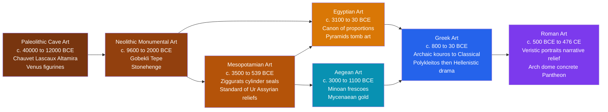

# 🗿 Prehistoric and Ancient Art

> [!abstract] TL;DR
> Human image-making begins roughly **40,000 years ago** with the animals painted deep inside caves like **Chauvet, Lascaux, and Altamira** and the enigmatic **Venus figurines** — the material trace of a mind that had become symbolic. Over the next 40 millennia art becomes the instrument of the first states, temples, and tombs: **Neolithic monuments** (Göbekli Tepe, Stonehenge), the rigid **canon of proportions** and afterlife art of **Egypt**, the ziggurats, cylinder seals, and roaring reliefs of **Mesopotamia**, and finally the twin poles of the Western tradition — Greek **idealism** (the Polykleitan Canon, contrapposto, the Parthenon) and Roman **naturalism** (veristic portraits, narrative relief, the engineered arch and dome). Across all of it runs one thread: for most of history, art served not the artist but **religion, the state, and the dead**.

## Intuition

**Analogy:** Imagine you found a civilization's *hard drive* but not its manual. The oldest files are cave paintings — vivid, technically brilliant, and utterly silent about *why* they were made. As you scroll forward, the files start coming with metadata: a pharaoh's name, a god's temple, a battle's date. Ancient art is that hard drive. The images did not exist to be beautiful in a gallery; they were **functional software** — running programs called "keep the herds coming," "make the king eternal," "hold the cosmos together," "impress the enemy." Reading ancient art means recovering the function, not just admiring the surface.

This reframes the whole field. A Paleolithic bison and a Roman emperor's portrait are separated by 40,000 years, but both are **technologies of belief** — the first perhaps invoking the animal's spirit, the second manufacturing political authority. The style changes; the job of the image is remarkably continuous.

---

## How It Works

### The four great functions of ancient art

Almost every object in this vast span answers to one of four purposes, and often several at once:

1. **Ritual / cognitive** — Paleolithic cave art and figurines externalise belief and memory. Their placement (deep, dark, acoustically resonant chambers) argues against decoration and for **ceremony**. This is the archaeological fingerprint of **symbolic cognition** — the same cognitive leap discussed in [[Human_Origins_and_the_Paleolithic]].
2. **Death and the afterlife** — Egyptian tomb painting, grave goods, and the pyramids exist to *equip and sustain the dead*. Art here is an insurance policy against oblivion (see [[Egyptian_Society_and_Religion]]).
3. **Religion and the divine** — Mesopotamian ziggurats, Greek temples, and cult statues house and honour gods; the building *is* the offering.
4. **State power and propaganda** — Assyrian palace reliefs, the Standard of Ur, Roman triumphal columns, and imperial portraits **manufacture authority**, terrify enemies, and record official history.

### From absolute rule to observed body: the central stylistic story

The deepest through-line in ancient *figurative* art is the tension between two ways of representing a human being:

- **Conceptual / idealised representation** draws what the mind *knows* to be true and permanent. Egyptian art is the purest case: the **composite (twisted) view** shows the head in profile, the eye and shoulders frontal, the legs in profile — every part from its most characteristic angle — laid onto a fixed **proportional grid** that barely changed for **3,000 years** (its famous **stylistic conservatism**). Nothing is left to the accident of a single viewpoint.
- **Perceptual / naturalistic representation** draws what a single eye *sees* from one place at one moment. This is the Greek revolution: over roughly 200 years (c. 600–400 BCE) the stiff, frontal Archaic **kouros** loosens into the **contrapposto** stance — weight shifted onto one leg so the hips and shoulders tilt in a living **S-curve** — and finally into full Classical **naturalism fused with idealism**.

Rome then splits the difference: **veristic** (warts-and-all) private portraits of stern Republican elders coexist with **idealised** imperial images, and Roman engineering (concrete, the arch, the dome) turns architecture itself into an art of enclosed space.

### Timeline of ancient art traditions



---

## Key Concepts

### Secondary Level

**The birth of image-making (Upper Paleolithic).** The earliest securely dated figurative art is European cave painting, led by **Chauvet** (c. 36,000 BP; horses, rhinos, lions) and the later, iconic galleries of **Lascaux** (c. 17,000 BP) and **Altamira** (c. 14,000 BP; the ceiling of polychrome bison). Alongside these come **portable art**: the ivory **Lion Man of Hohlenstein-Stadel** (c. 40,000 BP) and over 200 **Venus figurines** such as the **Venus of Willendorf** (c. 28,000 BP) — small, faceless, exaggerated female forms found across Eurasia.

**What was cave art *for*?** No one knows, and the debate is a model of how archaeology reasons from silent evidence:

| Hypothesis | Core claim | Evidence for | Weakness |
|---|---|---|---|
| **Hunting / sympathetic magic** | Painting the prey helped secure or control it | Animals dominate; some bear "wound" marks | Painted species often differ from bones eaten at the site |
| **Shamanism / altered states** | Images arise from trance in ritual specialists | Deep, dark, resonant locations; geometric "entoptic" signs | Hard to falsify; imports modern ethnography onto the deep past |
| **Totemism / social signalling** | Images mark clan identity and social memory | Recurrent motifs, regional styles | Under-determined by the data |
| **"Art for its own sake"** | Aesthetic play, teaching | Technical mastery, playful hand stencils | Fails to explain the deliberate inaccessibility |

The scholarly consensus is only that these images signal fully modern **symbolic cognition** — the capacity for **displaced reference** (representing what is not present) that also underlies language.

**Neolithic monumental art.** With farming (the [[Neolithic_Revolution_and_Agriculture]]) came monuments. **Göbekli Tepe** (Turkey, c. 9600 BCE) upends the old story: massive carved T-shaped pillars with relief animals were erected by people who were *not yet fully agricultural*, suggesting ritual gathering may have *driven* settlement rather than followed it. **Stonehenge** (sarsen circle c. 2500 BCE) shows the same impulse — astronomically aligned monumental architecture as a communal, sacred technology.

**Mesopotamia — art of the first cities.** In Sumer (see [[Sumer_and_the_First_Cities]]) art serves temple and palace: the stepped **ziggurat** as an artificial sacred mountain; the miniature carved **cylinder seal** rolled into clay as a signature; the **Standard of Ur** (c. 2600 BCE) with its "war" and "peace" registers; and later the terrifying **Assyrian palace reliefs** (lion hunts, sieges) that lined imperial corridors as royal propaganda (see [[Mesopotamian_Empires]]).

**Egypt — the eternal style.** Egyptian art is instantly recognisable because it obeyed a **canon** (a fixed rule of proportion) and the **composite view** for nearly three millennia. Its purpose was overwhelmingly funerary and religious: tomb paintings supplied the dead with food, servants, and pleasures for eternity; the **pyramids** are the ultimate royal tombs. Its conservatism was a *feature* — permanence of form mirrored the desired permanence of the cosmic order, **ma'at** (see [[Egyptian_Society_and_Religion]]).

### Undergraduate Level

**The Egyptian canon of proportions.** Egyptian artists did not draw freehand. They ruled a **grid of squares** on the wall and placed body parts at fixed grid coordinates. In the classic Old-and-Middle-Kingdom system the standing figure was **18 squares from the soles of the feet to the hairline** (about 19 to the crown). Key landmarks were canonical: knees at square 6, the buttocks/hands at square 9, shoulders around 15–16. The module was tied to the body itself (originally the **fist** or the **foot**), but the crucial point is that proportion was defined **absolutely, by the grid** — not by the size of the head. The result is a figure roughly **6.3 heads tall**: dignified, stable, timeless. After the Amarna interlude the canon was revised (a 21-square system to the eyelids in the 26th Dynasty), but the *principle* of grid-governed proportion endured.

**The Aegean bridge.** Before Greece, **Minoan** Crete (c. 2000–1450 BCE) produced airy, naturalistic **frescoes** (dolphins, bull-leapers, the "flotilla") with a lightness alien to Egypt, and **Mycenaean** Greece (c. 1600–1100 BCE) left gold death-masks and cyclopean citadels. Their collapse in the Bronze Age fed into the later Greek imagination.

**The Greek revolution: kouros to Classical.** Around 600 BCE the **Archaic kouros** (a nude standing youth) is unmistakably Egyptian in descent — frontal, rigid, one foot forward, arms locked to the sides, wearing the "Archaic smile." Over the sixth and fifth centuries Greek sculptors began *observing* the body. The turning point is **contrapposto** (Italian for "counterpoise"), first seen in the **Kritios Boy** (c. 480 BCE): the figure shifts its weight to one leg, so the engaged hip rises, the free hip drops, the shoulders counter-tilt, and the spine curves. The statue seems capable of *moving*.

**Polykleitos and the Canon.** The sculptor **Polykleitos** (5th c. BCE) wrote a treatise, the ***Kanon***, and made a statue, the **Doryphoros** ("Spear-Bearer"), to demonstrate it. His system was **symmetria** — the **commensurability of parts**: every measurement (finger to hand, hand to forearm, forearm to whole) stood in a fixed harmonic ratio, so beauty resided in **proportion and relationship**, not in any single measurement. Crucially this is a **ratio-based, relative** canon (the whole body as a multiple of the head/module), the opposite of Egypt's absolute grid — and it produced an *idealised* body: no real man is this perfect, yet every part is drawn from observation.

**The Parthenon and Classical idealism.** In architecture the same ideal governs the **Parthenon** (447–432 BCE, Athens; see [[Athenian_Democracy_and_Greek_Culture]]): the Doric temple applies **optical refinements** — columns that swell slightly (*entasis*), lean subtly inward, and sit on a floor that curves up in the middle — to make the building *look* perfectly straight and alive to the human eye. Idealism means depicting things not as they are but as they *ought* to be.

**Hellenistic drama.** After Alexander (see [[Alexander_and_the_Hellenistic_World]]) the serene Classical ideal gives way to **emotion, movement, age, and pain**: the swirling drapery and lost balance of the **Nike of Samothrace**, the writhing agony of the **Laocoön**, the exhaustion of the **Dying Gaul**. Art now grabs the viewer by the gut.

**Rome: naturalism, narrative, and engineering.** Roman art absorbs Greece but adds three signatures. (1) **Verism** — brutally realistic Republican portrait busts of wrinkled, jowly elders, projecting the authority of *gravitas* and ancestry. (2) **Continuous narrative relief** — the spiral of **Trajan's Column** and the **Ara Pacis** turn history into a scroll in stone. (3) **Revolutionary architecture** — Roman **concrete** plus the **arch, vault, and dome** enclose vast interior spaces, culminating in the **Pantheon** (c. 118–128 CE) with its unreinforced concrete dome and central **oculus** (see [[The_Roman_Empire]]).

### Graduate Level

**"Frontality" and the law of the composite view.** The Egyptologist Heinrich Schäfer analysed Egyptian representation as **"based on frontal images"** (*geradvorstellig*): each body part is rendered in its most legible, characteristic aspect and *combined* on the plane, rather than projected from a single station point. This is not naïve "inability to draw perspective" — it is a *different and internally consistent visual logic* optimised for conveying complete, unambiguous information about a permanent essence. Judging it by the yardstick of Renaissance perspective is an anachronism.

**Riegl's *Kunstwollen* and the rehabilitation of "decline."** Alois Riegl (*Late Roman Art Industry*, 1901) argued against the Vasarian assumption that art *progresses* toward naturalism and then *declines*. His concept of **Kunstwollen** ("will to form") holds that each era has its own artistic *intention*; the flatter, more abstract, hierarchically scaled art of Late Antiquity is not "decadent" Classicism but a positive shift toward a new, symbolic mode — the seedbed of medieval and Byzantine art. This reframing is foundational to treating non-naturalistic ancient styles on their own terms.

**Idealism versus naturalism as an anthropological, not merely aesthetic, choice.** Whether a culture idealises or individualises the body tracks its ideology of the person. Egyptian and Archaic figures are **type-images** of an eternal, ordered role (king, official, youth); Classical Greek figures fuse observation with a **normative ideal** (*arete*, human excellence made visible); Roman verism asserts the specific, historical individual embedded in family and state. Style is a claim about **what a person fundamentally is** — a point where art history meets the study of [[Material_Culture_and_Technology]] and social structure.

**The archaeology of the deep past is inference under extreme uncertainty.** Interpretations of Paleolithic art (Leroi-Gourhan's structural male/female binary; Lewis-Williams's neuropsychological/shamanic model) are **theory-laden reconstructions** from a radically incomplete record, filtered by taphonomy (caves preserve; open sites do not) and by the analogies we import from living hunter-gatherers. Robust claims are those anchored in **quantifiable patterning** — motif frequencies, spatial distribution, superimposition sequences, pigment chemistry — rather than in narrative appeal.

**Continuity and rupture.** The old textbook march "cave → Egypt → Greece → Rome → us" is a **teleological fiction**. Traditions overlap, borrow, and run in parallel (Egyptian art was still being made when Greek Classicism peaked; the kouros descends *directly* from Egyptian models yet its culture drove it somewhere Egypt never went). The interesting historical questions are *why* the Greek city-state milieu converted an inherited Egyptian form into naturalism, while Egypt, encountering the same problem for millennia, deliberately did not.

---

## Python Demo

Two visualisations, using only `numpy` and `matplotlib`. **Figure 1** is a two-panel horizontal timeline from Paleolithic cave art through Roman architecture (split into a deep-prehistory panel and a high-resolution ancient-civilisations panel, because 40,000 years cannot honestly share one linear axis with the last 3,000). **Figure 2** contrasts the two great proportional systems numerically: the **Egyptian 18-square grid canon** (absolute) versus the **Greek 8-head Polykleitan canon** (relative), by plotting stylised standing figures on their respective grids and printing where the body's landmarks fall as a fraction of total height.

```python
# Prehistoric-through-ancient art: a timeline, and the Egyptian vs Greek
# canon of proportions. numpy + matplotlib only.

import numpy as np
import matplotlib.pyplot as plt
from matplotlib.patches import Ellipse

# =====================================================================
# PART 1 - Timeline of key works and periods
# Year convention: negative = BCE, positive = CE.
# =====================================================================
COLORS = {
    "Prehistoric": "#78350f", "Neolithic": "#92400e",
    "Mesopotamian": "#b45309", "Egyptian": "#d97706",
    "Aegean": "#0891b2", "Greek": "#2563eb", "Roman": "#7c3aed",
}

events = [
    (-40000, "Chauvet cave art",        "Prehistoric"),
    (-28000, "Venus of Willendorf",     "Prehistoric"),
    (-17000, "Lascaux",                 "Prehistoric"),
    (-14000, "Altamira ceiling",        "Prehistoric"),
    (-9600,  "Gobekli Tepe",            "Neolithic"),
    (-2500,  "Stonehenge sarsens",      "Neolithic"),
    (-3200,  "Sumer / cylinder seals",  "Mesopotamian"),
    (-2600,  "Standard of Ur",          "Mesopotamian"),
    (-2560,  "Great Pyramid of Giza",   "Egyptian"),
    (-1600,  "Minoan frescoes",         "Aegean"),
    (-1345,  "Bust of Nefertiti",       "Egyptian"),
    (-700,   "Assyrian palace reliefs", "Mesopotamian"),
    (-530,   "Archaic kouros",          "Greek"),
    (-440,   "Doryphoros",              "Greek"),
    (-438,   "Parthenon",               "Greek"),
    (-190,   "Nike of Samothrace",      "Greek"),
    (-13,    "Ara Pacis",               "Roman"),
    (126,    "Pantheon rebuilt",        "Roman"),
]

def fmt_year(y):
    return f"{abs(y)} BCE" if y < 0 else f"{y} CE"

def draw_timeline(ax, evts, xmin, xmax, title):
    ax.axhline(0, color="black", lw=2, zorder=1)
    for i, (yr, label, cat) in enumerate(sorted(evts)):
        up = 1 if i % 2 == 0 else -1
        stem = 0.6 * up
        ax.plot([yr, yr], [0, stem], color=COLORS[cat], lw=1.2, zorder=2)
        ax.plot(yr, 0, "o", color=COLORS[cat], ms=7,
                markeredgecolor="black", markeredgewidth=0.5, zorder=3)
        ax.annotate(f"{label}\n{fmt_year(yr)}",
                    xy=(yr, stem), xytext=(yr, stem + 0.28 * up),
                    ha="center", va="bottom" if up > 0 else "top",
                    fontsize=7.5, color=COLORS[cat])
    ax.set_xlim(xmin, xmax)
    ax.set_ylim(-2.1, 2.1)
    ax.set_yticks([])
    ax.set_title(title, fontsize=11, fontweight="bold")
    for spine in ("left", "right", "top"):
        ax.spines[spine].set_visible(False)

fig1, (axA, axB) = plt.subplots(2, 1, figsize=(13, 7))

# Panel A: deep prehistory + Neolithic
draw_timeline(
    axA, [e for e in events if e[0] <= -2500],
    xmin=-42000, xmax=-1500,
    title="Deep prehistory and the Neolithic  (c. 40000 to 2500 BCE)")
axA.set_xlabel("Year  (BCE)", fontsize=9)

# Panel B: the first civilisations
draw_timeline(
    axB, [e for e in events if e[0] > -2700],
    xmin=-2900, xmax=400,
    title="The first civilisations  (c. 2600 BCE to 200 CE)")
axB.set_xlabel("Year  (negative = BCE, positive = CE)", fontsize=9)

# shared legend
handles = [plt.Line2D([], [], marker="o", ls="", color=c, label=k,
                      markeredgecolor="black", markeredgewidth=0.5)
           for k, c in COLORS.items()]
fig1.legend(handles=handles, ncol=7, loc="lower center",
            fontsize=8, frameon=False)
fig1.suptitle("Prehistoric through Ancient Art: a timeline",
              fontsize=13, fontweight="bold")
fig1.tight_layout(rect=[0, 0.05, 1, 0.96])
fig1.savefig("ancient_art_timeline.png", dpi=120)

# =====================================================================
# PART 2 - The canon of proportions: Egypt (absolute grid) vs Greece (heads)
# =====================================================================
# --- Egyptian 18-square canon (soles=0, hairline=18, crown~19) ---------
EGY_TOTAL = 19.0
egy_lines = {           # canonical horizontal registers, in grid squares
    "soles": 0, "knees": 6, "buttocks / hands": 9,
    "elbows": 11, "shoulders": 15.5, "hairline": 18, "crown": 19}

# --- Greek 8-head canon (Polykleitan / Vitruvian ideal) ----------------
GRK_TOTAL = 8.0
grk_lines = {           # canonical registers, in head modules
    "feet": 0, "knees": 2, "groin (midpoint)": 4,
    "navel": 5, "nipples": 6, "chin": 7, "crown": 8}

def draw_egyptian(ax):
    ax.set_title("Egyptian canon\n18-square grid  (~6.3 heads tall)",
                 fontsize=10, fontweight="bold")
    # light full grid
    for y in range(0, 20):
        ax.axhline(y, color="0.85", lw=0.6, zorder=0)
    for x in np.arange(-3, 3.1, 1):
        ax.plot([x, x], [0, 19], color="0.85", lw=0.6, zorder=0)
    # emphasised canonical lines
    for name, y in egy_lines.items():
        ax.axhline(y, color="#d97706", lw=1.1, zorder=1)
        ax.text(3.2, y, f"{name}  ({int(y) if y==int(y) else y})",
                va="center", fontsize=7.5, color="#b45309")
    # rigid frontal figure (composite view is noted in text)
    ax.add_patch(Ellipse((0, 18.0), 1.5, 2.6, fc="#fde68a",
                         ec="#92400e", lw=1.4, zorder=2))     # head
    seg = [([0, 0], [16.7, 15.5]),                            # neck
           ([-1.6, 1.6], [15.5, 15.5]),                       # shoulders
           ([-1.6, -1.1], [15.5, 9]), ([1.6, 1.1], [15.5, 9]),# torso sides
           ([-1.1, 1.1], [9, 9]),                             # hips
           ([-1.55, -1.4], [15.3, 9.2]),                      # arms (straight)
           ([1.55, 1.4], [15.3, 9.2]),
           ([-0.55, -0.55], [9, 0]), ([0.55, 0.55], [9, 0]),  # legs
           ([-0.55, -1.4], [0, 0]), ([0.55, 1.4], [0, 0])]    # feet
    for xs, ys in seg:
        ax.plot(xs, ys, color="#92400e", lw=2.4, zorder=2)
    ax.set_xlim(-3, 5.5); ax.set_ylim(-1, 20)
    ax.set_ylabel("grid squares (module = fist)"); ax.set_xticks([])

def draw_greek(ax):
    ax.set_title("Greek / Polykleitan canon\n8 head modules, contrapposto",
                 fontsize=10, fontweight="bold")
    for h in range(0, 9):
        ax.axhline(h, color="#93c5fd", lw=1.0, zorder=0)
        ax.text(2.6, h, f"{h} heads", va="center",
                fontsize=7.5, color="#1d4ed8")
    for name, y in grk_lines.items():
        ax.text(-2.5, y, name, va="center", fontsize=7.5, color="#1e3a8a")
    # contrapposto: weight on figure-right (negative x); hips tilt up on that
    # side, shoulders counter-tilt -> S-curve
    ax.add_patch(Ellipse((0.15, 7.45), 0.95, 1.05, fc="#dbeafe",
                         ec="#1e3a8a", lw=1.4, zorder=2))       # head
    seg = [([0.15, 0.05], [6.95, 6.1]),                         # neck
           ([-0.85, 0.9], [5.85, 6.15]),                        # shoulders (tilt)
           ([-0.85, -0.7], [5.85, 4.15]),                       # torso R
           ([0.9, 0.7], [6.15, 3.85]),                          # torso L
           ([-0.7, 0.7], [4.15, 3.85]),                         # hips (tilt)
           ([-0.85, -1.0], [5.85, 4.2]),                        # right arm down
           ([0.9, 1.25], [6.15, 5.2]), ([1.25, 0.95], [5.2, 4.5]),# left arm bent
           ([-0.7, -0.55], [4.15, 2.0]), ([-0.55, -0.5], [2.0, 0]),# weight leg
           ([0.7, 0.7], [3.85, 1.9]), ([0.7, 0.85], [1.9, 0.45]),  # free leg
           ([-0.5, -1.1], [0, 0]), ([0.85, 1.4], [0.45, 0.45])]    # feet
    for xs, ys in seg:
        ax.plot(xs, ys, color="#1e3a8a", lw=2.4, zorder=2)
    ax.set_xlim(-3.2, 4); ax.set_ylim(-0.6, 8.5)
    ax.set_ylabel("head modules (relative)"); ax.set_xticks([])

fig2, (axE, axG) = plt.subplots(1, 2, figsize=(11, 8))
draw_egyptian(axE)
draw_greek(axG)
fig2.suptitle("Two canons of the body: absolute grid vs relative head-module",
              fontsize=13, fontweight="bold")
fig2.tight_layout(rect=[0, 0, 1, 0.95])
fig2.savefig("canon_of_proportions.png", dpi=120)
plt.show()

# =====================================================================
# Numerical comparison: landmark height as a FRACTION of total height
# =====================================================================
print("=== Body landmark as a fraction of total height ===\n")
print(f"{'Landmark':<20}{'Egyptian':>12}{'Greek':>12}")
print("-" * 44)
pairs = [("knees", egy_lines["knees"] / EGY_TOTAL, grk_lines["knees"] / GRK_TOTAL),
         ("mid-body / groin", egy_lines["buttocks / hands"] / EGY_TOTAL,
          grk_lines["groin (midpoint)"] / GRK_TOTAL),
         ("shoulders", egy_lines["shoulders"] / EGY_TOTAL,
          grk_lines["nipples"] / GRK_TOTAL),
         ("crown", 1.0, 1.0)]
for name, e, g in pairs:
    print(f"{name:<20}{e:>12.3f}{g:>12.3f}")

egy_heads = EGY_TOTAL / (EGY_TOTAL - egy_lines["shoulders"] + 1.0)  # ~ crown-to-neck
print("\nTotal height in head-lengths:")
print(f"  Egyptian canon : ~6.3 heads  (stockier, absolute-grid ideal)")
print(f"  Greek canon    :  8.0 heads  (slender, ratio-based ideal)")
print("\nKey contrast: Egypt fixes landmarks by an ABSOLUTE grid module,")
print("Greece fixes them as RATIOS of the head -> the body's midpoint sits")
print("exactly at the groin (0.500) in the Greek ideal, near the hip in Egypt.")
```

**Expected console output:**

```
=== Body landmark as a fraction of total height ===

Landmark                Egyptian       Greek
--------------------------------------------
knees                      0.316       0.250
mid-body / groin           0.474       0.500
shoulders                  0.816       0.750
crown                      1.000       1.000

Total height in head-lengths:
  Egyptian canon : ~6.3 heads  (stockier, absolute-grid ideal)
  Greek canon    :  8.0 heads  (slender, ratio-based ideal)

Key contrast: Egypt fixes landmarks by an ABSOLUTE grid module,
Greece fixes them as RATIOS of the head -> the body's midpoint sits
exactly at the groin (0.500) in the Greek ideal, near the hip in Egypt.
```

The numbers make the abstract point concrete: the **Greek** canon places the exact **midpoint of the body at the groin (0.500)** and stretches the figure to a slender **8 heads**, because proportion is defined *relative to the head*. The **Egyptian** canon puts the mid-body near the hip and yields a **stockier ~6.3-head** figure, because proportion is defined *absolutely, by the grid square*. Same problem (how tall is a person, and where do the joints go?), two philosophically opposite solutions.

---

## Real-World Applications

- **Museum interpretation and cultural heritage.** Reading ancient art functionally (ritual, funerary, propaganda) is exactly how the British Museum, the Louvre, and the Met frame the Assyrian reliefs, the Standard of Ur, and Egyptian tomb assemblages — and it governs high-stakes **repatriation** debates (e.g. the Parthenon Marbles).
- **Conservation science.** Dating and authenticating cave art depends on **uranium-thorium** dating of calcite over pigment and **AMS radiocarbon** of charcoal; pigment chemistry (ochre, manganese, charcoal) distinguishes genuine Paleolithic work from later additions or forgeries.
- **Figure drawing and animation pedagogy.** The **"eight heads tall"** rule taught in every life-drawing and character-design course is the living descendant of the Polykleitan/Vitruvian canon; game and film character riggers still block out proportions in head-units.
- **Architecture and structural engineering.** The Roman **arch, vault, dome, and concrete** are the direct ancestors of modern masonry and shell structures; the Pantheon's coffered, oculus-topped dome remains a case study in load path and material optimisation.
- **Branding and political imagery.** Neoclassical government buildings, currency portraits, and state iconography deliberately borrow **Roman verism** (authority through gravitas) and **Greek idealism** (legitimacy through perfected form) — ancient propaganda grammar still in daily use.

---

## Common Pitfalls

- **"Egyptian artists couldn't do perspective."** They used a *different, deliberate* visual logic (the composite view on a proportional grid) optimised for clarity and permanence. It is not failed naturalism; it is a coherent alternative system.
- **Treating cave art as decorative "primitive" art.** Its deep, dark, inaccessible placement argues for **ceremony**, not ornament, and its technical sophistication rivals any later era. "Primitive" describes our knowledge, not their skill.
- **Assuming a single progress line cave → Egypt → Greece → Rome.** Traditions overlapped and ran in parallel for millennia; Egyptian art flourished *during* Greek Classicism. The march-of-progress narrative is a 19th-century teleology (critiqued by Riegl's *Kunstwollen*).
- **Confusing idealism with realism in Greek art.** Classical statues *look* natural but depict an unattainable **ideal** body governed by ratio, not a specific model. Roman **verism**, by contrast, deliberately depicts the specific, aged individual.
- **Over-reading the Venus figurines.** Labels like "fertility goddess" or "Stone Age pornography" project modern categories onto objects whose meaning is genuinely unknown; the honest position is interpretive humility.
- **Calling Late Roman / Late Antique art "decadent."** The flatter, more hierarchical, symbolic style is a positive shift toward medieval and Byzantine modes, not a failure of Classical skill.

---

## Related Concepts

- [[Human_Origins_and_the_Paleolithic]] — the cognitive and archaeological context for cave art, Venus figurines, and the emergence of symbolic thought
- [[Neolithic_Revolution_and_Agriculture]] — the agricultural transition behind Göbekli Tepe, Stonehenge, and the first monumental architecture
- [[Material_Culture_and_Technology]] — the anthropological framework for reading art objects as encoded social and technological information
- [[State_Formation_and_Early_Civilizations]] — how emerging states used monumental art to legitimise power, exactly the function of ziggurats and palace reliefs
- [[Archaeological_Methods_and_Theory]] — the dating and inference methods that let us interpret silent prehistoric and ancient objects
- [[Sumer_and_the_First_Cities]] — Mesopotamian urban context for the Standard of Ur, cylinder seals, and the ziggurat
- [[Mesopotamian_Empires]] — the Assyrian and Babylonian states behind the great narrative palace reliefs
- [[Cuneiform_and_the_Code_of_Hammurabi]] — writing and the carved law stele, where Mesopotamian text and relief image fuse
- [[Ancient_Egypt_Kingdoms]] — the political history that commissioned pyramids, tombs, and the enduring Egyptian canon
- [[Egyptian_Society_and_Religion]] — ma'at, the afterlife, and the funerary purpose that shaped Egyptian art's conservatism
- [[Ancient_Greece_and_the_Polis]] — the city-state milieu in which the kouros evolved into Classical naturalism
- [[Athenian_Democracy_and_Greek_Culture]] — the Athenian Golden Age of the Parthenon and Classical sculpture
- [[Alexander_and_the_Hellenistic_World]] — the world that produced Hellenistic emotion and drama in art
- [[The_Roman_Empire]] — the imperial context for veristic portraiture, narrative relief, and revolutionary architecture

---

## Review Questions

### Secondary
1. Name three famous Paleolithic cave-art sites and one type of portable Paleolithic art, and give a rough date for each. What single cognitive capacity do all of them signal?
2. What were the four main purposes ancient art served? Give one concrete object or monument as an example of each.

### Undergraduate
3. Describe the Egyptian **canon of proportions** and the **composite view**. Why did Egyptian style stay so stable for roughly 3,000 years, and how does that relate to Egyptian religion and the concept of ma'at?
4. Trace the evolution from the Archaic **kouros** to Classical naturalism. What is **contrapposto**, and how did **Polykleitos' Canon** define beauty differently from the Egyptian grid?
5. Contrast Greek **idealism** with Roman **verism**. What does each style imply about how its culture conceived of the individual person?

### Graduate
6. Using the Python demo's results, explain the fundamental philosophical difference between an **absolute-grid** canon and a **ratio-of-the-head** canon. Why does the Greek system place the body's midpoint exactly at the groin while the Egyptian system does not?
7. Evaluate the competing hypotheses for the purpose of Paleolithic cave art (hunting magic, shamanism, totemism, aesthetics). What kinds of *quantifiable* evidence would let you favour one over another, and why is definitive interpretation so difficult?
8. Explain Riegl's concept of **Kunstwollen** and how it dismantles the "rise and decline" model of ancient art. Apply it to the shift from Classical Greek naturalism to Late Roman abstraction.

---

## Sources

- Gombrich, E. H. (1995). *The Story of Art* (16th ed.). Phaidon. [Chs. 1–7: prehistoric through Roman art]
- Robins, G. (1994). *Proportion and Style in Ancient Egyptian Art*. University of Texas Press.
- Schäfer, H. (1974). *Principles of Egyptian Art* (trans. J. Baines). Oxford: Clarendon Press.
- Pollitt, J. J. (1972). *Art and Experience in Classical Greece*. Cambridge University Press.
- Riegl, A. (1901 / 1985). *Late Roman Art Industry* (trans. R. Winkes). Giorgio Bretschneider.
- Clottes, J. (2016). *What Is Paleolithic Art? Cave Paintings and the Dawn of Human Creativity*. University of Chicago Press.

---

#aesthetics #art-history #ancient-art #prehistoric #classical
