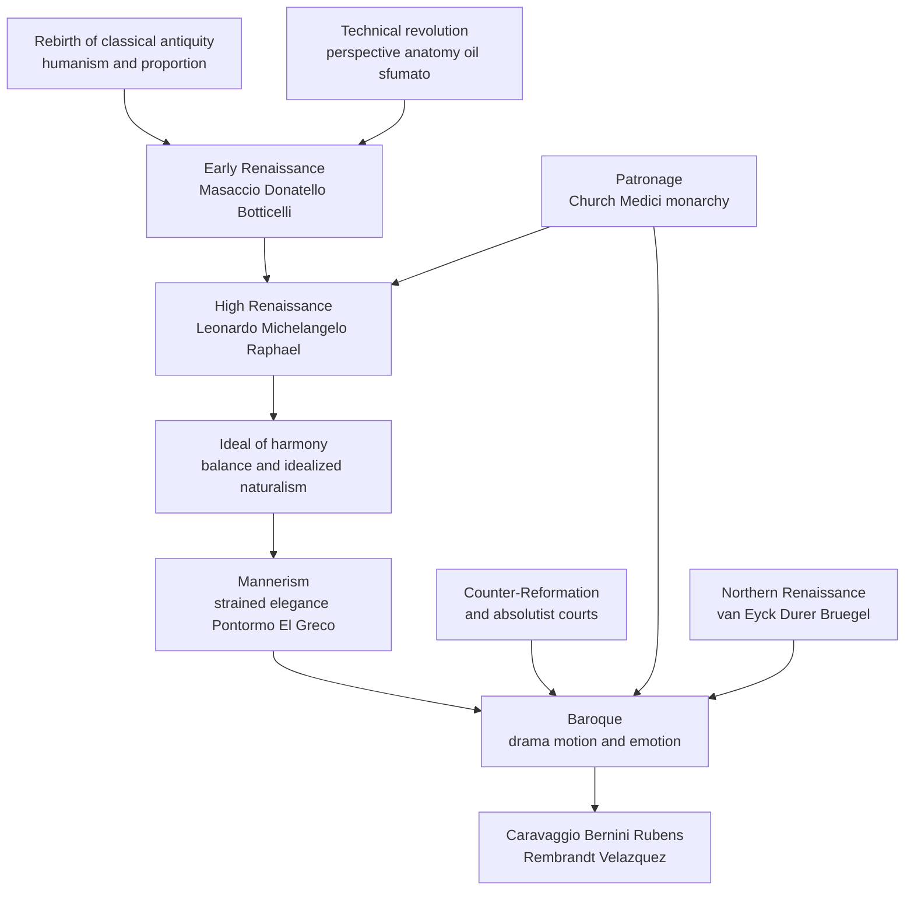

# 🎨 Renaissance and Baroque

> [!abstract] TL;DR
> Between roughly 1400 and 1750, European art was transformed twice. The **Renaissance** ("rebirth") revived the classical ideals of antiquity and humanism and armed painters with a new toolkit — **linear perspective, anatomy, oil paint, sfumato, and chiaroscuro** — to represent an idealized, harmonious, mathematically-ordered world; it also elevated the artist from anonymous **craftsman to celebrated genius**. Its offspring **Mannerism** deliberately strained that harmony into elegant artifice, and the **Baroque** then blew the calm apart into **drama, motion, deep shadow, and emotional persuasion** in the service of the Counter-Reformation Church and absolutist courts. Renaissance = balance and reason made visible; Baroque = that same skill weaponized for wonder and propaganda.

---

## Intuition

**Analogy:** Think of the Renaissance as a team that finally invented a photorealistic **3D rendering engine** after a thousand years of flat, symbolic 2D icons — and was so proud of the crisp geometry that it composed every scene as a serene, perfectly balanced architectural blueprint. The **Baroque** is what happens a century later when a brilliant cinematographer gets hold of that same engine and adds **dramatic spotlighting, motion blur, dutch angles, and a swelling soundtrack** — the geometry is still there under the hood, but now it is used to grab you by the collar and make you *feel* the miracle happening.

In technical terms: the Renaissance solved the *representation* problem (how do I make a flat wall convincingly hold measurable space and breathing bodies?), while the Baroque, taking that solution for granted, pushed the *rhetoric* problem (how do I use that realism to overwhelm and persuade the viewer?).

---

## How It Works

### Core Mechanics

The two-century arc is best read as a sequence of problems solved and then deliberately un-solved:

1. **The "rebirth" premise.** Renaissance thinkers believed classical Greece and Rome had achieved a peak of beauty, proportion, and human dignity that the "middle" ages had lost. Recovering antiquity — its statues, its ruins, its texts, its ideal of *man as the measure* — became the explicit program (see [[The_Italian_Renaissance]] and [[Humanism_and_the_Arts]]).
2. **The technical revolution.** Four breakthroughs made the new realism possible:
   - **Linear perspective** — Filippo **Brunelleschi** demonstrated one-point perspective around 1415, and Leon Battista **Alberti** codified it in *On Painting* (1435) as a geometric grid converging on a single vanishing point, turning the picture into a "window" onto measurable space.
   - **Anatomy** — artists dissected cadavers to render muscle, bone, weight, and the classical *contrapposto* stance accurately.
   - **Oil paint** — a slow-drying medium (perfected in the North) that allowed translucent glazes, minute detail, and luminous depth impossible in fast-drying tempera or fresco.
   - **Sfumato and chiaroscuro** — Leonardo's smoky, edgeless transitions (*sfumato*) and the modeling of form through strong light-and-shade (*chiaroscuro*) gave figures volume and inner life.
3. **The new status of the artist.** The medieval painter was an anonymous guild craftsman. Vasari's *Lives of the Artists* (1550) reframed Leonardo, Michelangelo, and Raphael as divinely gifted **individual geniuses** — the birth of art history and of the artist-as-celebrity.
4. **Early → High Renaissance.** The **Early Renaissance** (Masaccio's solid perspectival figures, Donatello's freestanding bronze *David*, Botticelli's mythologies) matured into the **High Renaissance** (c. 1490s–1520s) ideal of harmony, balance, and idealized naturalism perfected by Leonardo, Michelangelo, and Raphael.
5. **The Northern variant.** In the Low Countries and Germany, Jan **van Eyck** achieved jewel-like oil realism through observation rather than Italian geometry; **Dürer** fused German craft with Italian proportion theory and mass-produced it in prints; **Bruegel** turned to peasant life and landscape.
6. **Mannerism as reaction.** After the High Renaissance "solved" harmony, **Mannerists** (Pontormo, Parmigianino, El Greco) deliberately distorted it — elongated bodies, acidic colours, compressed or impossible space, elegant artifice over natural balance.
7. **The Baroque.** From c. 1600, art became **dramatic, dynamic, theatrical, and emotional**: Caravaggio's harsh spotlight **tenebrism**, Bernini's marble caught mid-motion, Rubens' surging energy, Rembrandt's psychological light, Velázquez's optical realism — art as **persuasion and propaganda** for the Counter-Reformation Church and absolutist courts.

### Flow / Architecture



---

## Key Concepts

### Secondary — the big picture
- **Renaissance = rebirth.** A revival of ancient Greek and Roman ideals of beauty, balance, and human dignity, centered on Florence and funded by patrons like the **Medici**.
- **Perspective** makes a flat surface look deep by making parallel lines converge to a **vanishing point**.
- **The three High Renaissance greats:** **Leonardo** (the *Mona Lisa*, *The Last Supper*), **Michelangelo** (the *David*, the Sistine ceiling), and **Raphael** (*The School of Athens*).
- **Baroque = drama.** A later, more theatrical, high-contrast, emotionally intense style — think **Caravaggio's** spotlight and **Bernini's** dynamic sculpture — often made to impress worshippers and kings.

### Undergraduate — the mechanisms and cast
- **Alberti's *costruzione legittima*** (1435): the first written rules of one-point perspective, a grid of orthogonals converging on the *centric point* at the viewer's eye level.
- **Sfumato vs. chiaroscuro vs. tenebrism:** *sfumato* softens edges into smoke (Leonardo); *chiaroscuro* models volume with graded light and shade; *tenebrism* is chiaroscuro pushed to violent extremes with a near-black ground and a stabbing beam of light (Caravaggio).
- **Contrapposto and the pyramidal composition:** the classical weight-shifted stance and the stable triangular arrangement of figures (Leonardo's *Madonna* and *Last Supper*) that give High Renaissance works their calm equilibrium.
- **Mannerism** (c. 1520–1600): the self-conscious "manner" — *figura serpentinata*, elongation, spatial ambiguity, and virtuoso artifice (Pontormo's *Deposition*, El Greco's flickering saints).
- **Baroque devices:** diagonal dynamism, foreshortened *di sotto in sù* ceiling illusionism, the "decisive moment" of narrative, and the merging of painting, sculpture, and architecture into a total sensory environment (**Bernini's** *Ecstasy of St. Teresa*).
- **Patronage systems:** the Church (Counter-Reformation commissions to move the faithful), princely dynasties (Medici, later monarchs), and absolutist courts (Rubens as diplomat-painter, Velázquez at the Spanish court) — art as statecraft.

### Graduate — theory and historiography
- **Perspective as ideology.** Erwin Panofsky's *Perspective as Symbolic Form* argues that linear perspective is not neutral optical "truth" but a historically specific *construction* of space that encodes a rationalized, subject-centered worldview — a claim linking art to the same measuring impulse behind [[The_Scientific_Revolution]].
- **Wölfflin's polarities.** Heinrich Wölfflin's *Principles of Art History* systematized the Renaissance-to-Baroque shift as five formal oppositions: linear→painterly, plane→recession, closed→open form, multiplicity→unity, and absolute→relative clarity — a still-influential (and contested) formalist model.
- **The Counter-Reformation program.** The Council of Trent (1545–1563) explicitly instructed that sacred art be clear, decorous, and emotionally moving to counter Protestant iconoclasm — a doctrinal driver of Baroque affect (contrast the image-skeptical [[The_Protestant_Reformation]]).
- **Genius, gender, and the canon.** Vasari's genius-narrative built a canon that long excluded figures like **Artemisia Gentileschi** and **Sofonisba Anguissola**; modern scholarship (Nochlin, Garrard) reads the "artist-genius" myth critically.
- **Periodization is constructed.** "Renaissance," "Mannerism," and "Baroque" are retrospective labels (Burckhardt, later critics) imposed on a continuous field; their boundaries are arguments, not facts.

---

## Python Demo

```python
# Reconstruct the geometric skeleton of a High-Renaissance mural in the
# spirit of Leonardo's "Last Supper": ONE-POINT (linear) perspective whose
# orthogonals all converge on a single vanishing point placed BEHIND the head
# of the central figure, overlaid with the stable PYRAMIDAL composition that
# frames that figure. This visualizes the Renaissance fusion of mathematics
# (perspective + proportion) with art. numpy + matplotlib only.
import numpy as np
import matplotlib.pyplot as plt

# --- proportions of the picture field (a wide mural) and the vanishing point
W, H = 15.0, 8.0
VP = np.array([W / 2.0, 0.56 * H])   # central vanishing point, behind the figure's head

fig, ax = plt.subplots(figsize=(11, 6))

# 1) the framed picture plane -------------------------------------------------
ax.add_patch(plt.Rectangle((0, 0), W, H, fill=False, edgecolor='black', lw=2))

# 2) horizon / eye level runs exactly through the vanishing point --------------
ax.axhline(VP[1], color='gray', ls='--', lw=1)
ax.text(0.2, VP[1] + 0.15, 'horizon / eye level', color='gray', fontsize=8)

# 3) ORTHOGONALS: every depth line races to the ONE vanishing point ------------
for x in np.linspace(0, W, 9):
    ax.plot([x, VP[0]], [H, VP[1]], color='#d97706', lw=0.8, zorder=1)  # ceiling coffers
    ax.plot([x, VP[0]], [0, VP[1]], color='#d97706', lw=0.8, zorder=1)  # floor tiles
for y in np.linspace(0, H, 5):
    ax.plot([0, VP[0]], [y, VP[1]], color='#f0b46b', lw=0.6, zorder=1)  # left wall
    ax.plot([W, VP[0]], [y, VP[1]], color='#f0b46b', lw=0.6, zorder=1)  # right wall

# 4) TRANSVERSALS: nested "room" rectangles whose spacing shrinks with depth ----
#    at depth fraction t, each front corner is interpolated toward the VP
def room_rect(t):
    xl = t * VP[0]
    xr = W + t * (VP[0] - W)
    yb = t * VP[1]
    yt = H + t * (VP[1] - H)
    return xl, yb, xr - xl, yt - yb

for t in [0.0, 0.40, 0.68, 0.85]:          # deepest rect = far "back wall"
    x0, y0, w, h = room_rect(t)
    ax.add_patch(plt.Rectangle((x0, y0), w, h, fill=False,
                               edgecolor='#8a8a8a', lw=0.7, zorder=1))

# 5) PROPORTION: vertical centre axis + golden-section verticals ----------------
ax.axvline(VP[0], color='#059669', ls=':', lw=0.9)
for gx in (0.382 * W, 0.618 * W):
    ax.axvline(gx, color='#059669', ls=':', lw=0.7)
ax.text(0.618 * W + 0.1, 0.2, 'golden section', color='#059669', fontsize=8)

# 6) PYRAMIDAL COMPOSITION: the central figure as a stable triangle -------------
apex = np.array([VP[0], VP[1] + 0.25])       # head sits at the vanishing point
base_l = np.array([VP[0] - 2.7, 0.16 * H])   # outstretched arms form the base
base_r = np.array([VP[0] + 2.7, 0.16 * H])
ax.add_patch(plt.Polygon([apex, base_l, base_r], closed=True,
                         facecolor='#2563eb', alpha=0.18,
                         edgecolor='#2563eb', lw=1.8, zorder=2))
ax.add_patch(plt.Circle(apex, 0.28, facecolor='#2563eb', alpha=0.35,
                        edgecolor='#2563eb', zorder=3))  # the head
ax.text(VP[0], 0.16 * H - 0.35, 'pyramidal composition',
        ha='center', color='#2563eb', fontsize=8)

# 7) mark the vanishing point --------------------------------------------------
ax.plot(VP[0], VP[1], 'o', color='#dc2626', ms=8, zorder=4)
ax.annotate('vanishing point\n(behind central figure)', xy=VP,
            xytext=(VP[0] + 3.2, VP[1] + 1.7), fontsize=8, color='#dc2626',
            ha='left', arrowprops=dict(arrowstyle='->', color='#dc2626'))

ax.set_xlim(-0.6, W + 0.6)
ax.set_ylim(-0.6, H + 0.6)
ax.set_aspect('equal')
ax.axis('off')
ax.set_title("One-point perspective + pyramidal composition\n"
             "the Renaissance fusion of mathematics and art", fontsize=11)
plt.tight_layout()
plt.show()
```

Running this produces the geometric "wireframe" beneath a work like *The Last Supper*: a fan of orange orthogonals (ceiling coffers, floor, side walls) all converging on a single red vanishing point set behind the central figure's head, nested grey transversal rectangles receding to a back wall, green proportion axes marking the centre and golden sections, and a translucent blue triangle showing how the central figure is locked into a stable pyramid. It makes literal the claim that Renaissance painting was *applied geometry*.

---

## Real-World Example

> **Example — Leonardo's *The Last Supper* (1495–1498), Milan.** Every orthogonal in the painted architecture — the ceiling coffers, the tapestry tops on the side walls, the edges of the table — converges on a single vanishing point located exactly behind **Christ's right temple**. This does two things at once: it constructs a mathematically convincing room *and* it uses that geometry as a rhetorical device, drawing the viewer's eye inexorably to Christ at the calm centre while the apostles react in agitated groups of three around him. Christ's own figure forms a stable **pyramid**, an island of geometric order amid emotional turbulence. It is the perfect specimen of the Renaissance fusion of perspective (maths) and meaning (art). A century later, **Caravaggio's *The Calling of St. Matthew*** takes the *opposite* approach: it abandons the calm architectural grid for a dark room slashed by a single diagonal shaft of light (tenebrism) that functions like the finger of God — the same subject-focusing goal, achieved by Baroque drama rather than Renaissance geometry.

---

## Trade-offs

| Aspect | Renaissance (pro) | Baroque (con / contrast) |
|--------|-------------------|--------------------------|
| Emotional register | Serene, rational, balanced — invites contemplation | Overwhelming, theatrical — can tip into bombast and manipulation |
| Spatial method | Clear, measurable, geometric perspective | Deliberately unstable diagonals and dramatic recession sacrifice legibility for impact |
| Purpose | Idealized harmony as an end in itself | Persuasion and propaganda — art subordinated to Church and state power |

---

## When to Use vs Avoid

*(reading these as design lessons a modern visual communicator can borrow)*

**Reach for Renaissance principles when:**
- You need **clarity, order, and a single unmistakable focal point** (linear perspective + centred, pyramidal composition).
- The goal is calm authority — technical diagrams, architectural rendering, formal portraiture, UI hierarchy.

**Reach for Baroque principles when:**
- You need to **move an audience emotionally and fast** — dramatic lighting, motion, high contrast, a "decisive moment."
- The message is persuasive or immersive — cinema, advertising, spectacle, theatrical staging.

**Avoid** rigid Renaissance symmetry when you want energy and surprise; **avoid** Baroque excess when the content demands neutral legibility or when the drama would read as manipulative.

---

## Common Pitfalls

- **"The Renaissance was a sudden rebirth after a cultural dark age."** This is the era's own flattering propaganda (Vasari, later Burckhardt). The Middle Ages had its own sophisticated art and a "12th-century renaissance"; continuity is as real as rupture.
- **Confusing chiaroscuro with tenebrism.** All tenebrism is chiaroscuro, but chiaroscuro is simply modeling with light and shade; *tenebrism* is the specific Baroque extreme of a near-black ground pierced by a harsh beam (Caravaggio). Using the terms interchangeably flattens a real stylistic distinction.
- **Treating perspective as neutral "truth."** Linear perspective is a *constructed* convention with a fixed single viewpoint, not how binocular human vision actually works; Panofsky showed it encodes a particular worldview. Other cultures rendered space very differently.
- **Assuming Baroque = merely "ornate/messy."** "Baroque" once meant "misshapen pearl" as an insult, but the style is rigorously composed drama, not chaos. Judging it by Renaissance criteria (it "lacks balance") misses that instability is the intended effect.
- **Erasing the patrons and politics.** The art is downstream of Medici banking, papal Counter-Reformation strategy, and absolutist court propaganda. Reading it as pure aesthetic genius mistakes the symptom for the cause.
- **A canon of lone male geniuses.** The Vasari narrative long buried figures like Artemisia Gentileschi; the "solitary genius" is partly a myth of art history itself.

---

## Related Concepts

- [[The_Italian_Renaissance]] — the wealth, city-state rivalry, and Medici patronage that funded and demanded this art.
- [[Humanism_and_the_Arts]] — the humanist ideal of human dignity and the perspective/anatomy revolution that gave it visual form; the direct intellectual companion to this note.
- [[The_Protestant_Reformation]] — its Catholic counterpart, the Counter-Reformation (Council of Trent), directly commissioned the emotive Baroque as a weapon against Protestant iconoclasm.
- [[The_Scientific_Revolution]] — grew from the same measuring, observing impulse that produced geometric perspective and anatomical study.

---

## Review Questions

1. **(Conceptual)** Explain how linear perspective is both a *mathematical* technique and a *rhetorical* device, using the placement of the vanishing point in *The Last Supper* as your example.
2. **(Scenario)** You are commissioned by the Counter-Reformation Church to paint an altarpiece that must instantly move illiterate worshippers to awe. Would you adopt a High Renaissance or a Baroque approach, and which specific devices (composition, light, motion) would you use and why?
3. **(Trade-off / historiography)** Wölfflin framed the Renaissance-to-Baroque shift as "linear vs. painterly" and "closed vs. open form." What does this formalist model illuminate, and what important drivers (patronage, religion, the artist's social status) does a purely formal account leave out?

---

## Sources

- Vasari, G. (1550). *Lives of the Most Excellent Painters, Sculptors, and Architects*.
- Alberti, L.B. (1435). *On Painting* (*De pictura*).
- Wölfflin, H. (1915). *Principles of Art History: The Problem of the Development of Style in Later Art*.
- Panofsky, E. (1927). *Perspective as Symbolic Form* (English trans. 1991, Zone Books).
- Gombrich, E.H. (1950). *The Story of Art*. Phaidon.

---

#aesthetics #art-history #renaissance #baroque #perspective
