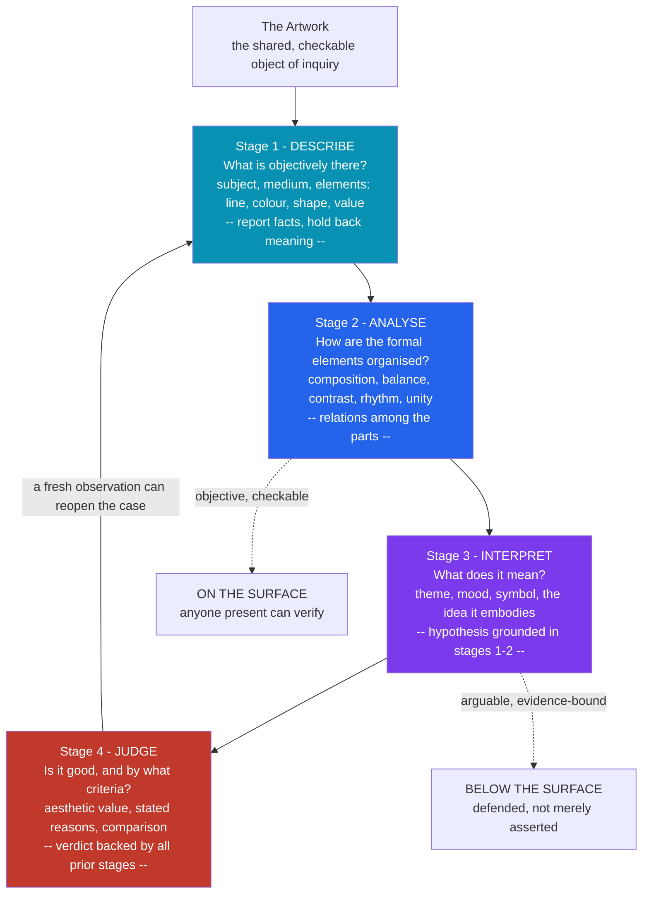

# 🗣️ Art Criticism and Interpretation

> [!abstract] TL;DR
> **Art criticism** is the disciplined activity of responding to art through four linked operations — **describing** what is objectively present, **analyzing** how the formal elements are organized, **interpreting** what the work means, and **evaluating** whether it is good and by what criteria. Its power is real: critics from Diderot to Greenberg have made and unmade reputations, shaped the canon, and moved markets. Two hard questions run underneath it. First, **is there one correct interpretation?** — the intentionalists say meaning is fixed by the artist, the anti-intentionalists (the "intentional fallacy") say the work's public meaning is all we have, and constructivists say interpretation partly *constitutes* the work. Second, **can value judgments be objective?** — they are neither provable like theorems nor mere shrugs of taste, but *reasoned* verdicts backed by relevant features of the work. Good criticism is not opinion louder; it is interpretation and judgment **grounded in observation**.

---

## Intuition

**Analogy — the courtroom, not the shout.** Imagine two people leaving a gallery. The first says, "That painting is a masterpiece — I just *feel* it." The second says: "Look at how the diagonal of the outstretched arm drags your eye from the dark left third into the single lit face; the red is the only warm note in a field of grey-greens, so it reads as a wound; and because every other figure turns *away* from that face, the picture is *about* abandonment — which it earns, because nothing in it is decorative." Both delivered a verdict. Only the second built a **case**. A good critic works like a trial lawyer, not a heckler: every claim about *meaning* and *worth* is traced back to *evidence on the canvas* that anyone standing there could check. The verdict "guilty" is worthless without the exhibits; the verdict "masterpiece" is worthless without the description.

That is the whole discipline in miniature. Criticism moves in one direction — **from what is seen, to what it means, to whether it is good** — and the quality of a critique is measured by how tightly the later, riskier claims are anchored to the earlier, checkable ones. Skip the looking and you get a review that tells you about the critic's mood; do the looking and you get one that tells you about the work.

---

## How It Works

Art criticism is not a single act but a **pipeline of four distinct operations**, each answering a different kind of question and each governed by different standards. The most widely taught articulation is **Edmund Burke Feldman's four-stage method** (from *Varieties of Visual Experience*, 1972), designed as a discipline that forces the critic to *look before judging* and to *ground meaning in form*.

1. **Description — "What is objectively there?"** An inventory of the perceptible facts, made with as little interpretation as possible: the subject depicted, the medium and size, and the raw **elements** — line, shape, color, value, texture, space. The test of a good description is that a viewer who has *not* seen the work could pick it out of a lineup. "A kneeling woman in blue" is description; "a grieving mother" is already interpretation smuggled in early.
2. **Analysis — "How are the elements organized?"** Now attention shifts from the *elements* to their **arrangement** — the principles of composition: balance, contrast, rhythm, proportion, emphasis, movement, and unity. Analysis is relational: it asks how the parts are structured into a whole, how the eye is led, where tension is created and resolved. This is the stage most continuous with **formalism** and with visual *close reading*. It still stays "on the surface" — it reports how the work is built, not yet what it says.
3. **Interpretation — "What does it mean?"** The critic advances a **hypothesis about meaning**: theme, mood, symbolism, idea, the human situation the work embodies. Interpretation is where criticism becomes *risky* and *arguable*, because meaning is not sitting on the surface like a color value. The governing rule — the one that separates criticism from free association — is that an interpretation must be **supported by the description and analysis**: it must cash out its claims in features actually present. An interpretation no feature supports is not bold, it is unfounded.
4. **Judgment (Evaluation) — "Is it good, and by what criteria?"** Finally, the verdict: an appraisal of the work's **aesthetic value**, made explicit by naming the *criteria* and the *reasons*. Is it praised for unity, complexity, and intensity (Beardsley's canons)? For originality? For emotional or intellectual power? For historical importance? Judgment is not the same as *liking*: "I don't enjoy it" is a report about the critic; "it is incoherent because its two halves never resolve" is a reasoned evaluation about the work.

The stages are a **discipline, not a straitjacket**: skilled critics loop back — a fresh piece of description can overturn an interpretation, and a difficulty in evaluation can send you back to look again. But the *dependency* is directional: sound interpretation rests on description and analysis, and sound judgment rests on all three.



The diagram encodes the method's core logic: the first two stages are **objective and checkable** (they stay "on the surface"), the last two are **arguable and evidence-bound** (they go "below the surface" but must stay tethered to it), and the loop-back edge captures that criticism is revisable — new evidence reopens the case rather than closing it forever.

---

## Key Concepts

### Secondary Level

**What art criticism is.** Criticism is *reasoned talk about art* organized as four moves — describe, analyze, interpret, evaluate. It is not a "thumbs up / thumbs down" score and it is not the artist telling you what they meant; it is a *viewer* building a public, checkable account of a work.

**Description versus interpretation — the first thing to get right.** Description reports what is *there* ("two figures, one in red, against a grey wall"); interpretation says what it *means* ("the red figure is defiant"). Beginners collapse the two, letting meaning creep into the inventory. Keeping them apart is the single most useful skill in criticism, because it forces every interpretation to *point back* to something described.

**Feldman's four stages as a learning tool.** Edmund Feldman turned criticism into a teachable sequence so students would *look* before *pronouncing*. The order matters: you may only interpret what you have described and analyzed, and you may only judge what you have interpreted. Following the steps prevents the most common failure — leaping straight to "I like it / I hate it."

**Ekphrasis — writing that makes you see.** *Ekphrasis* is vivid verbal description of a visual work, so precise the reader can picture it. It runs from Homer's description of the Shield of Achilles to Keats's "Ode on a Grecian Urn" to a great newspaper review. Criticism's Stage 1 is, at its best, ekphrasis: language doing the work of the eye.

### Undergraduate Level

**A short history of the critic.** Art criticism as a public genre begins with **Denis Diderot**, whose reviews of the Paris *Salons* (1759–1781) for a private newsletter model the critic as an eloquent, opinionated eyewitness. **John Ruskin** (*Modern Painters*, 1843–60) made criticism *moral*, defending Turner and demanding "truth to nature." **Charles Baudelaire** ("The Painter of Modern Life," 1863) made it *partisan and modern* — criticism should be "partial, passionate, political." In twentieth-century America two rivals defined the field: **Clement Greenberg**, whose *formalist* criticism ("Modernist Painting," 1960) prized medium-specificity and flatness and helped consecrate Abstract Expressionism, and **Harold Rosenberg**, whose "The American Action Painters" (1952) read the same canvases *existentially*, as "arenas in which to act." Today criticism splits between **journalism** (newspaper and magazine reviewers writing for a general public) and **academia** (theory-driven writing in journals like *October*, exhibition catalogues, and scholarship).

**The four operations, precisely.** *Description* is the objective layer — the elements and subject, stated so anyone could verify them. *Analysis* is the formal layer — how those elements are **composed** into a structure (balance, contrast, rhythm, unity); it is where criticism overlaps most with formalist theory and visual close reading. *Interpretation* is the semantic layer — the work's **meaning**, mood, and symbolism, advanced as an argued hypothesis. *Evaluation* is the axiological layer — the work's **value**, and, crucially, the *criteria* by which it is judged. Each layer has its own standard of success, and each depends on the ones beneath it.

**Is there a single correct interpretation? The intentionalism debate.** The pivotal move is **anti-intentionalism**. W. K. Wimsatt and Monroe Beardsley's "The Intentional Fallacy" (1946) argued that the artist's private intention is "neither available nor desirable as a standard" for judging a work: meaning is *public*, embodied in the work itself, not locked in the maker's head. Roland Barthes radicalized this in "The Death of the Author" (1967): once released, a work belongs to its readers, and appeal to the author's biography *closes* meaning rather than opening it. Against this, **actual intentionalists** (E. D. Hirsch, *Validity in Interpretation*, 1967) insist a work *means what its author meant*, distinguishing fixed **meaning** from variable **significance** (its relation to changing contexts). The debate is not academic hair-splitting: it decides whether a symbol "counts" because the artist put it there or because the work supports it.

**Evaluation: opinion, science, or something between?** Value judgments are neither *provable* (you cannot deduce "this is beautiful" from a list of facts) nor *arbitrary* (we give and demand *reasons*). Beardsley proposed three general **canons** of aesthetic value — **unity, complexity, and intensity** of regional quality — as the features that make a work rewarding to experience. Frank Sibley ("Aesthetic Concepts," 1959) showed that aesthetic verdicts are not *rule-governed* — no non-aesthetic checklist mechanically yields "graceful" or "garish" — yet they are still *supported by reasons* a sensitive critic can point to. Evaluation, then, is **reasoned but not deductive**: a verdict defended by relevant features, not a proof and not a shrug.

### Graduate Level

**Hypothetical intentionalism and the middle path.** Between actual intentionalism and pure anti-intentionalism sits **hypothetical intentionalism** (Jerrold Levinson, Alexander Nehamas): a work means what a suitably informed, ideal audience would *attribute* to a hypothetical author, given the full public context (genre, oeuvre, historical moment) — but *not* the artist's actual private notes. Umberto Eco frames the same territory as a triangle: *intentio auctoris* (the author's intention), *intentio lectoris* (the reader's), and *intentio operis* (the **intention of the work** itself), the last acting as a brake on **overinterpretation** — readings the text's own coherence cannot support. This gives a principled answer to "is any interpretation as good as any other?": no — interpretations must be *admissible*, answerable to the work's public features.

**The constructivist challenge — interpretation as partly constitutive.** A stronger position (Joseph Margolis, Michael Krausz, and, in a different key, Nelson Goodman and Stanley Fish) holds that artworks are **culturally emergent** and *interpretively underdetermined*: the object does not fully fix its meaning, so interpretation does not merely *report* a pre-existing content but partly **constitutes the work as an object of a certain kind**. On this view a plurality of *incompatible but equally admissible* interpretations can coexist without one being uniquely correct — the "many-right-answers" thesis. Fish's **interpretive communities** locate the constraint not in the object but in the shared conventions of a community of readers. The cost is a slide toward relativism; the benefit is that it explains why great works sustain *endless*, non-converging readings across centuries.

**The objectivity of evaluation and the sociology of reputation.** The philosophical debate — are value judgments objective, subjective, or reasoned? — has a *sociological* shadow. Pierre Bourdieu (*The Field of Cultural Production*; *Distinction*) argues that "taste" is not innocent perception but **symbolic capital**: critics, dealers, and institutions perform acts of **consecration** that convert new work into recognized art and confer value, so that critical reputation is produced by a *field* of competing agents, not read off the works. This reframes Beardsley's tidy "reasons for a verdict" as embedded in a struggle over legitimacy — which is why Greenberg's championing of Jackson Pollock was simultaneously an *aesthetic argument* and a *market-making act*.

**The critic's power: canon, market, and the artworld.** Because evaluation is where value is conferred, the critic is a node in **canon formation** (what enters museums, survey courses, and cultural memory) and in the **market** (critical consecration and auction prices track each other). This ties criticism directly to the **institutional theory of art**: if art status is conferred by the artworld, the critic is one of the artworld's principal officers, and a review is not just a description of value but partly an *act* of valuation. The **October** generation (Rosalind Krauss, Hal Foster) turned this reflexivity into a program, using structuralist and psychoanalytic theory to interrogate the very institutions — museum, market, medium — that criticism had taken for granted.

---

## Python Demo

We model the **describe → analyze → interpret → evaluate** pipeline as a *scoring rubric*. First we represent an artwork by **feature scores across the formal elements** (its "salience" — what is actually there to be seen). Then we take two hypothetical critiques of the *same* work — one **well-reasoned**, one **poorly-reasoned** — and score each stage on *how well it is supported by evidence*. The crucial mechanic: a critique's **interpretation** and **judgment** can only be *grounded* to the extent that it actually *observed* the work's features. The poor critic barely looks (Stages 1–2 near zero), so its interpretive claims have nothing to point to and collapse — computationally demonstrating the note's thesis that **good criticism grounds interpretation in observation**.

```python
# Models the four-stage critique rubric and shows that ungrounded interpretation
# collapses. numpy + matplotlib only.
import numpy as np
import matplotlib.pyplot as plt

# ---- 1. The artwork as observable formal-element "evidence" (salience 0..1) ----
#     This is what is actually THERE for any critic to describe and analyse.
ELEMENTS = ["Line", "Color", "Composition", "Contrast", "Texture", "Value/Light"]
salience = np.array([0.65, 0.90, 0.85, 0.80, 0.45, 0.70])   # prominence of each element

# ---- 2. How well each critic actually OBSERVED each element (Stages 1-2 evidence) ----
#     Good critic looks hard; poor critic barely glances before opining.
observed_good = np.array([0.70, 1.00, 0.90, 0.90, 0.40, 0.80])
observed_poor = np.array([0.00, 0.30, 0.10, 0.00, 0.00, 0.20])

def coverage(observed, sal):
    # Weighted recall: of the salient facts present, how many did the critic register?
    return float((observed * sal).sum() / sal.sum())

# A feature counts as "seen" if the critic engaged it at least moderately.
seen_good = int((observed_good >= 0.5).sum())
seen_poor = int((observed_poor >= 0.5).sum())

# ---- 3. Interpretive & evaluative claims, and how many can be GROUNDED ----
#     Key rule: a claim can only be grounded in a feature the critic actually saw,
#     so grounded interpretation is CAPPED by observation (interpretation rests on
#     description/analysis).
interp_claims_good, interp_claims_poor = 4, 4     # both make bold interpretive claims
judg_claims_good,   judg_claims_poor   = 3, 3     # both deliver a verdict

interp_grounded_good = min(interp_claims_good, seen_good)   # 4 of 4 -> all anchored
interp_grounded_poor = min(interp_claims_poor, seen_poor)   # 0 of 4 -> pure assertion
# A judgment is grounded only if it states a criterion AND cites observed evidence.
judg_grounded_good = min(judg_claims_good, seen_good)       # 3 of 3
judg_grounded_poor = 0                                      # "I just don't like it"

# ---- 4. Compute the four rubric scores (evidence-support per stage, 0..1) ----
STAGES = ["Describe", "Analyse", "Interpret", "Judge"]

def rubric(observed, seen, interp_g, interp_n, judg_g, judg_n):
    describe = coverage(observed, salience)                 # did you look?
    analyse  = seen / len(ELEMENTS)                         # of elements, how many related?
    interpret = interp_g / interp_n                         # grounded / claimed
    judge     = judg_g / judg_n                             # reasoned / claimed
    return np.array([describe, analyse, interpret, judge])

good = rubric(observed_good, seen_good, interp_grounded_good, interp_claims_good,
              judg_grounded_good, judg_claims_good)
poor = rubric(observed_poor, seen_poor, interp_grounded_poor, interp_claims_poor,
              judg_grounded_poor, judg_claims_poor)

# ---- 5. Visualise: bar (did they look?) + radar (evidence-support by stage) ----
fig = plt.figure(figsize=(12.5, 5.5))

ax1 = fig.add_subplot(1, 2, 1)
x = np.arange(len(ELEMENTS)); w = 0.27
ax1.bar(x - w, salience,      w, label="Present in work", color="#7f8c8d")
ax1.bar(x,     observed_good, w, label="Seen by good critic", color="#27ae60")
ax1.bar(x + w, observed_poor, w, label="Seen by poor critic", color="#c0392b")
ax1.set_xticks(x); ax1.set_xticklabels(ELEMENTS, rotation=30, ha="right", fontsize=8)
ax1.set_ylabel("Formal-element attention (0..1)")
ax1.set_ylim(0, 1.05)
ax1.set_title("Stages 1-2: did the critic actually LOOK?", fontsize=11, fontweight="bold")
ax1.legend(fontsize=8)

angles = np.linspace(0, 2 * np.pi, len(STAGES), endpoint=False)
ang_c  = np.concatenate([angles, angles[:1]])
good_c = np.concatenate([good, good[:1]])
poor_c = np.concatenate([poor, poor[:1]])

ax2 = fig.add_subplot(1, 2, 2, polar=True)
ax2.plot(ang_c, good_c, color="#27ae60", lw=2.2, label="Well-reasoned critique")
ax2.fill(ang_c, good_c, color="#27ae60", alpha=0.25)
ax2.plot(ang_c, poor_c, color="#c0392b", lw=2.2, label="Poorly-reasoned critique")
ax2.fill(ang_c, poor_c, color="#c0392b", alpha=0.25)
ax2.set_xticks(angles); ax2.set_xticklabels(STAGES, fontsize=10)
ax2.set_ylim(0, 1.0)
ax2.set_title("Stages 1-4: evidence-support by stage", fontsize=11, fontweight="bold")
ax2.legend(loc="upper right", bbox_to_anchor=(1.28, 1.12), fontsize=8)

plt.tight_layout()
plt.savefig("art_criticism_rubric.png", dpi=120, bbox_inches="tight")
plt.show()

# ---- 6. Console summary ----
print(f"{'Stage':12s} | {'Well-reasoned':>14s} | {'Poorly-reasoned':>16s}")
print("-" * 50)
for i, s in enumerate(STAGES):
    print(f"{s:12s} | {good[i]:14.2f} | {poor[i]:16.2f}")
print("-" * 50)
print(f"{'OVERALL':12s} | {good.mean():14.2f} | {poor.mean():16.2f}")
print(f"\nGood critic observed {coverage(observed_good, salience):.2f} of the evidence,")
print(f"so its 4 interpretive claims are all grounded ({interp_grounded_good}/4).")
print(f"Poor critic observed only {coverage(observed_poor, salience):.2f} of the evidence,")
print(f"so NONE of its interpretive claims can be grounded ({interp_grounded_poor}/4):")
print("interpretation was never anchored to observation -> the critique collapses.")
```

**Expected output (approximate):**

```
Stage        |  Well-reasoned |  Poorly-reasoned
--------------------------------------------------
Describe     |           0.82 |             0.11
Analyse      |           0.83 |             0.00
Interpret    |           1.00 |             0.00
Judge        |           1.00 |             0.00
--------------------------------------------------
OVERALL      |           0.91 |             0.03

Good critic observed 0.82 of the evidence,
so its 4 interpretive claims are all grounded (4/4).
Poor critic observed only 0.11 of the evidence,
so NONE of its interpretive claims can be grounded (0/4):
interpretation was never anchored to observation -> the critique collapses.
```

The bar chart shows the *root cause* — the poor critic never looked, so the grey "present in work" bars tower over its red "seen" bars. The radar chart shows the *consequence* — its interpretation and judgment axes flatten to zero because nothing in the work supports them. The well-reasoned critique is not "louder"; it simply *earned* its interpretation and verdict by first doing the describing and analyzing. That directional dependence — later stages capped by earlier ones — is exactly Feldman's discipline turned into arithmetic.

---

## Real-World Applications

**Art journalism.** Newspaper and magazine critics (the *New York Times*'s Roberta Smith and Holland Cotter, *New York* magazine's Jerry Saltz — a Pulitzer winner for criticism) apply the describe–analyze–interpret–judge sequence in public every week, translating gallery experience into a reasoned verdict that shapes attendance, sales, and reputation.

**Museum interpretation and wall texts.** The didactic labels, audio guides, and catalogue essays that museums produce are institutionalized criticism: a good wall text *describes* the object, *analyzes* its making, and offers an *interpretation*, teaching millions of visitors to look before concluding. Interpretation is literally a museum department name.

**Art education.** Feldman's method (and Harry Broudy's "aesthetic scanning") became the backbone of **Discipline-Based Art Education** in K–12 curricula: students are trained to describe, then analyze, then interpret, then judge, precisely to break the habit of jumping to "I like it." The pipeline in this note is a standard classroom rubric.

**The art market and valuation.** Critical consecration and monetary value are coupled: Greenberg's advocacy helped make Pollock's market, and today a favorable review or a scholar's re-attribution can move a work's price by orders of magnitude. Auction houses, insurers, and collectors read criticism as a signal of value, making evaluation an economically load-bearing act.

**AI-generated art critique.** Vision-language models are now asked to "critique" images, and they exhibit exactly this note's failure mode: they generate fluent *interpretation* and *judgment* while their *description* is hallucinated or ungrounded — praising a symbolism the pixels do not support. The rubric here (does the interpretation cite features actually observed?) is becoming a practical benchmark for grounding machine-generated criticism.

---

## Common Pitfalls

- **Jumping straight to judgment.** The commonest failure is opening with "I love it / I hate it" and never doing Stages 1–3. A verdict with no description behind it reports the critic's mood, not the work's quality. The four-stage discipline exists precisely to defer judgment until it can be earned.
- **Smuggling interpretation into description.** Writing "a grieving mother" instead of "a kneeling woman, head bowed" contaminates the objective layer with the conclusion you are supposed to *argue for*. Keep Stage 1 as verifiable as a police report so that Stage 3 has independent evidence to point at.
- **The intentional (and biographical) fallacy.** Deciding a work's meaning by appeal to the artist's stated intention or life story — "he painted this after his divorce, so it is about loss" — is exactly what Wimsatt and Beardsley warned against. The divorce is not *in the picture*; if loss is there, the *canvas* must show it. Beware the mirror-image error too: refusing all context (genre, title, historical moment) that the *work itself* invokes.
- **Overinterpretation.** Reading in symbolism, allusions, or messages the work's own features cannot bear — Eco's *intentio operis* is the check. Interpretive boldness is a virtue only when the object can support the weight; otherwise it is projection.
- **Confusing taste with evaluation.** "I don't enjoy Rothko" is a fact about you; "Rothko fails because his fields lack internal structure" is a claim about the work that must be defended with reasons. Collapsing the two turns criticism into autobiography and makes disagreement impossible.
- **Presentism.** Judging historical art by present-day criteria — dismissing academic history painting as "stiff," or a devotional icon as "unrealistic" — misreads works made for different purposes and audiences. Evaluation should name the criteria appropriate to what the work was trying to do.
- **Mistaking criticism for either pure science or pure opinion.** Treating verdicts as *provable* invites false rigor; treating them as *arbitrary* invites nihilism ("it's all subjective, so why argue?"). Criticism lives in between: reasoned, revisable judgment answerable to public evidence.

---

## Related Concepts

*(Companion notes planned for this section — Art_and_Meaning, Formalism_and_Aesthetic_Theory, Composition, and Art_Institutions_and_the_Artworld — will expand the interpretation-of-meaning, formal-analysis, and artworld-power threads touched on here.)*

- [[What_Is_Art]] — the *classification* question (institutional theory, Danto's artworld, Beardsley's aesthetic definition) that criticism's *evaluation* presupposes; the critic is one of the artworld's officers who confer status
- [[Beauty_and_Taste]] — the philosophical engine of the **evaluation** stage: Hume's ideal critic, Kant's antinomy of taste, and Bourdieu's sociology of taste directly answer "are value judgments objective, subjective, or reasoned?"
- [[Aesthetics_and_Art_Overview]] — the broader field map that situates criticism among aesthetics, philosophy of art, and art history
- [[New_Criticism_and_Close_Reading]] — the literary home of the **Intentional Fallacy** (Wimsatt and Beardsley) and of formalist close reading; the textual twin of visual *description* and *analysis*
- [[Hermeneutics_and_Interpretation]] — the general theory of interpretation (the hermeneutic circle, Gadamer's fusion of horizons, Ricoeur) underwriting the intentionalism-versus-anti-intentionalism debate at Stage 3
- [[The_Reader_and_Reception]] — reader-response and reception theory, the basis of the **constructivist** view that interpretation partly *constitutes* the work
- [[Literary_Theory_Overview]] — the theoretical toolkit (structuralism, poststructuralism, Barthes's "Death of the Author") that criticism borrows for interpretation
- [[Color_Theory]] — a concrete formal element the **analysis** stage examines; grounds abstract talk of "how the elements are organized"
- [[Metaphor_Symbol_and_Imagery]] — the symbolic vocabulary the **interpretation** stage deploys when arguing what a work means

---

## Review Questions

### Secondary
1. Name Feldman's four stages of art criticism in order, and explain why you are not allowed to *interpret* a painting before you have *described* it.
2. Rewrite each of these so it belongs in the **description** stage rather than sneaking in interpretation: "a menacing sky," "a joyful crowd," "a lonely house." What did you have to remove, and why does that matter for the interpretation you might later argue?

### Undergraduate
1. State the "intentional fallacy" in your own words. Suppose an artist says "I intended this red shape to symbolize hope," but nothing in the composition supports reading it as hopeful. Should the critic accept the artist's word? Answer from *both* the actual-intentionalist and the anti-intentionalist positions.
2. Greenberg and Rosenberg looked at the *same* Abstract Expressionist paintings and produced opposite criticism — one formal, one existential. Using the four-stage pipeline, explain at *which* stage their accounts diverge and why two competent critics can legitimately disagree there.
3. Beardsley proposes unity, complexity, and intensity as general criteria of aesthetic value, while Sibley argues aesthetic verdicts are not rule-governed. Are these views compatible? Show how a critic could use Beardsley's criteria *without* claiming to derive judgments mechanically from a checklist.

### Graduate
1. Distinguish actual intentionalism, hypothetical intentionalism, and anti-intentionalism as answers to "is there a single correct interpretation?" Construct one artwork scenario in which the three positions yield *different* interpretations, and say which you find most defensible and why.
2. The **constructivist** view holds that interpretation partly *constitutes* the work, licensing multiple incompatible-but-admissible readings. Does this collapse into "anything goes" relativism, or can Eco's *intentio operis* and Fish's interpretive communities supply a non-arbitrary constraint? Argue a position.
3. "A favorable review is not a report of value but an *act* of valuation." Evaluate this claim using Bourdieu's account of consecration in the field of cultural production, the coupling of critical reputation with the art market, and the link to the institutional theory of art. Does the *sociology* of critical reputation undermine the *philosophical* claim that evaluations can be objectively reasoned, or are the two compatible?

---

## Sources

- [Feldman, E. B. (1972). *Varieties of Visual Experience*. Harry N. Abrams. (Origin of the four-stage description–analysis–interpretation–judgment method.)](https://www.worldcat.org/title/varieties-of-visual-experience/oclc/25508413)
- [Wimsatt, W. K. & Beardsley, M. C. (1946). "The Intentional Fallacy." *The Sewanee Review* 54(3), 468–488.](https://www.jstor.org/stable/27537676)
- [Barthes, R. (1967). "The Death of the Author." In *Image–Music–Text* (1977), trans. S. Heath.](https://www.tbook.constantvzw.org/wp-content/death_authorbarthes.pdf)
- [Carroll, N. (2009). *On Criticism*. Routledge. (Contemporary philosophy of art criticism; the "evaluation-centered" account.)](https://www.routledge.com/On-Criticism/Carroll/p/book/9780415396219)
- [Zangwill, N. "Aesthetic Judgment." *Stanford Encyclopedia of Philosophy*.](https://plato.stanford.edu/entries/aesthetic-judgment/)
- [The Art Story: "Clement Greenberg vs. Harold Rosenberg" (formalist vs. action-painting criticism).](https://www.theartstory.org/critic/greenberg-clement/)

---

#aesthetics #art-criticism #interpretation #evaluation #critique
