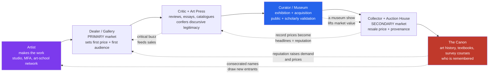

# 🏛️ Art Institutions and the Artworld

> [!abstract] TL;DR
> "Art" is not a property an object has by itself; it is a **status conferred by a network** — artists, dealers, critics, curators, museums, collectors, auction houses, fairs, schools, foundations, and the art press — that Arthur Danto named **the artworld** and George Dickie turned into a definition: art is whatever the artworld treats as art. This note maps that network as a *machine that produces, validates, and prices art*: how a canon is formed and contested, why the art market concentrates almost all its money and fame on a handful of "superstar" names in a brutal power-law, how the museum frames what we see, and how artists (Haacke, Fraser) turn the artworld's own machinery into their subject. The stakes are not aesthetic trivia — they decide whose art is remembered, what public money funds, which looted objects go home, and what a signature is worth.

---

## Intuition

**Analogy — the restaurant with no menu prices.** Imagine a food world where a dish is "great cuisine" not because of how it tastes but because of *where it is served and who has blessed it*. A young cook plates something in a tiny room (the gallery). A famous critic writes it up (the review). A three-star institution puts it on its permanent tasting menu (the museum). Wealthy regulars start paying stunning sums to have it, and their willingness to pay is itself reported as proof of greatness (the auction). Cookbooks and culinary schools then teach it as a classic (the canon). Notice what has happened: the *same plate of food*, served in an unlabelled diner by an unknown cook, would be lunch — but routed through this chain of blessings, it becomes Art with a capital A, insured for millions and studied for a century. And once a name is blessed, every later blessing comes *more easily* — success breeds success, until a few chefs own the whole conversation and thousands of equally skilled cooks are forgotten.

That chain of blessings is the **artworld**. It explains the puzzle left open by [[What_Is_Art]]: if Duchamp's urinal and a hardware-store urinal are physically identical, the thing that makes one *art* is not in the object at all — it is in the **institutional network** that received it, argued about it, exhibited it, priced it, and wrote it into history. The philosophy of art asks *what* that invisible status is; the sociology and economics of art ask *who confers it, how, for whose benefit, and with what money*.

---

## How It Works

### The network, not a place

Danto's "the artworld" (1964) did not mean a district or a guild; it meant an **atmosphere of artistic theory and a knowledge of the history of art** — the shared interpretive frame without which an object cannot even be *seen* as art. Dickie (1974) made this concrete and sociological: an artwork is an artifact on which someone **acting on behalf of the artworld** has conferred the status of *candidate for appreciation*, exactly as a chairperson "opens" a meeting or a registrar pronounces a couple married. Status is **performative** — it is *done*, not discovered. The question this note answers is: *who does the conferring, through what institutions, and with what consequences?*

The artworld is a **division of labor** (Howard Becker's term: art is *collective action*). No artist makes art alone; every work depends on a web of "support personnel" — the paint-maker, the framer, the printer, the gallery assistant, the shipper, the insurer, the archivist — and on institutions that legitimate and circulate it. The core roles:

1. **Artists and art schools.** The MFA and the elite academy (Yale, the Slade, Central Saint Martins) are the *first gate*: they credential, network, and socialize entrants into the field's tacit rules.
2. **Dealers and galleries — the primary market.** A gallery gives an artist a first price, a first audience, and represents them. This is where a career is *launched*; mega-galleries (Gagosian, Hauser & Wirth, David Zwirner, Pace) function as talent kingmakers.
3. **Critics and the art press.** Reviews, catalogue essays, and magazines (*Artforum*, *frieze*, *October*) confer **discursive legitimacy** — they supply the theory that lets the object be read as significant art. (See the companion note on *Art Criticism and Interpretation*.)
4. **Curators and museums.** A museum show and, above all, a permanent-collection acquisition confer **public and scholarly validation** — the strongest non-market blessing there is. The curator is a *gatekeeper of memory*.
5. **Collectors and auction houses — the secondary market.** Private collectors, foundations, and the auction duopoly (Sotheby's, Christie's) set **resale prices** and track **provenance**. A record price becomes a headline that *feeds back* into reputation.
6. **Fairs, biennials, and foundations.** Art Basel, Frieze, the Venice Biennale, Documenta, and private foundations (the Broad, Fondation Louis Vuitton) are the field's periodic *concentrating events*, where reputations are made, sold, and networked at scale.
7. **The canon.** Art history, survey textbooks, and the university syllabus are the terminal output: the short list of names that get *remembered*. The canon is not a neutral record of quality — it is the accumulated residue of everything upstream, and it is fiercely contested (Whose art? See *Feminist and Postcolonial Art Theory*, forthcoming in this section).

### Two engines: consecration and cumulative advantage

The network runs on two intertwined dynamics.

**Consecration (Bourdieu).** Pierre Bourdieu modelled the artworld as a **field of cultural production** — a structured game with its own stakes and its own inverted logic. At the *autonomous pole* (avant-garde, "art for art's sake"), commercial success is *suspect*: prestige goes to those who appear to renounce the market ("the economic world reversed"). At the *heteronomous pole* (commercial, popular), sales are the measure. **Symbolic capital** — reputation, legitimacy, the recognition of other consecrated players — is the true currency, and it slowly converts into economic capital. **Consecration** is the act by which gatekeepers (critics, museums, prizes) transubstantiate an artist into a legitimate name.

**Cumulative advantage (Merton / Rosen).** Once a name accrues early recognition, every later evaluation is biased toward it — Robert Merton's **Matthew effect** ("to those who have, more shall be given"). Combined with the **superstar economics** Sherman Rosen described in 1981 — markets where tiny differences in perceived quality translate into enormous differences in reward because reputation scales without limit — this produces a **winner-take-all, power-law distribution**: a handful of artists command almost all the attention and money, while the vast majority earn little and are forgotten. The Python demo below simulates exactly this rich-get-richer process.

### Flow / Architecture



The solid arrows are the *forward pipeline* (make → sell → interpret → validate → resell → remember); the dashed arrows are the **feedback loops** that make the system winner-take-all. A museum show raises market value; a record price becomes a headline that reads as merit; a consecrated canon pulls new artists and collectors back toward the same few blessed names. Nothing here measures "quality" directly — every node is a *social judgment that references the other nodes' judgments*, which is precisely why reputations, once seeded, snowball.

---

## Key Concepts

### Secondary Level

**What "the artworld" means.** Not a building and not a clique of snobs, but the whole cooperative network — people *and* institutions — that together decide what counts as art and keep it circulating. When people say "it's in a museum, so it must be art," they are (usually without knowing it) invoking Dickie's institutional theory: the museum is *acting on behalf of the artworld* to confer status.

**Primary vs secondary market — the two ways art is sold.** The **primary market** is the *first* sale: an artist's new work sold through their gallery. The **secondary market** is *resale*: previously owned works traded through auction houses and dealers. A crucial and counter-intuitive fact: in most countries the artist earns *nothing* when their work is resold for millions years later — a gap that laws called *droit de suite* (artist's resale right) try, imperfectly, to close.

**Auction houses and the record price.** Sotheby's and Christie's (founded in the 18th century) run the theatrical evening sales where headline prices are set. Those prices do double duty: they are transactions *and* they are publicity. Leonardo's *Salvator Mundi* selling for USD 450 million in 2017 was a financial event and a reputation event at once.

**The canon.** The canon is the short list of artists and works that get taught, exhibited, and remembered — the "greatest hits" of art history. The key insight is that the canon is *made*, not found: it is the downstream product of centuries of gallery, critical, curatorial, and market decisions, each of which reflected the tastes and biases of whoever held the gate.

### Undergraduate Level

**Danto and Dickie — from insight to definition.** Danto's move was epistemic: two perceptually identical objects (Warhol's *Brillo Box* and a supermarket carton) can differ in art-status, so the difference is *not in the object* but in the surrounding theory and history — "the artworld." Dickie's **institutional theory** operationalizes this: art is a *status* conferred by an artworld representative, like knighthood or legal tender. The strength is that it explains readymades, conceptual art, and anything the classical essence-theories (mimesis, expression, form) could not; the weakness, debated at length in [[What_Is_Art]], is apparent **circularity** ("art is what the artworld says is art; the artworld is the people who make art").

**Becker's *Art Worlds* — art as cooperative labor.** Howard Becker (1982), a sociologist, deflated the romantic myth of the solitary genius. Art is produced by **cooperative networks** following **conventions** — shared understandings (of scale, medium, exhibition, notation) that let dispersed participants coordinate. An artist who violates conventions ("mavericks") pays a coordination cost; the "support personnel" who are usually invisible (assistants, fabricators, framers, curators) are constitutive of the work. Becker's lens is bottom-up and descriptive where Dickie's is philosophical.

**Bourdieu's field of cultural production.** Where Becker sees cooperation, Bourdieu sees **struggle for position**. The art field is a battlefield over *legitimacy*, structured by an **inverted economy**: in the avant-garde subfield, disavowing commerce is itself a strategy for accruing symbolic capital, which later converts to money. Taste is not innate but **cultural capital** — dispositions acquired through upbringing and education that mark and reproduce class (his *Distinction*, 1979; see [[Social_Class_and_Stratification]] and [[Beauty_and_Taste]]). The gatekeepers who *consecrate* — critics, curators, prize juries — are themselves positioned players, not neutral judges.

**The museum and the "universal survey museum."** The public art museum is a modern invention (the Louvre opened to the public in 1793 as a Revolutionary act). Carol Duncan and Alan Wallach analysed the grand encyclopedic museum as a **"universal survey museum"** — a ritual space whose architecture, sequencing, and display *script* the visitor into a civic, quasi-religious experience of "universal" culture. **Framing** matters: the modernist **"white cube"** (Brian O'Doherty) — the neutral, windowless, white-walled gallery — is not neutral at all; it sacralizes whatever it contains and strips it of context, teaching the eye to see "pure art."

**The market's structure and superstar economics.** The art market is opaque, illiquid, and thin — few buyers, unique goods, no continuous price. Prices are set by **reputation, provenance, and scarcity** more than by any intrinsic measure. Rosen's **economics of superstars** (1981) explains the extreme skew: when consumers prefer the "best" and reputation scales without limit, a sliver of top names captures the overwhelming majority of revenue. Layer on **cumulative advantage** (early success predicts later success independently of quality) and you get the empirical fact that art prices and artist incomes follow a steep **power law** — a pattern the Python demo reproduces from first principles.

### Graduate Level

**Institutional critique — art turning on its own conditions.** From the late 1960s, artists made the artworld itself their medium. **Hans Haacke** exposed the museum's entanglements: *MoMA Poll* (1970) invited visitors to vote on a trustee's political ties; *Shapolsky et al.* (1971) mapped a slumlord's real-estate holdings and was *cancelled* by the Guggenheim, proving the point. **Daniel Buren** and **Marcel Broodthaers** interrogated the frame and the museum-as-fiction; **Andrea Fraser**, in performances like *Museum Highlights* (1989), impersonated a docent to lay bare the museum's ideological script. The deep paradox — **Fraser's own thesis** — is that institutional critique is *absorbed*: the museum exhibits the very work that attacks it, converting dissent into cultural capital. Critique becomes a genre the institution collects.

**Canon formation and its contestation.** Linda Nochlin's "Why Have There Been No Great Women Artists?" (1971) reframed the question: the absence is not a lack of talent but a product of **institutional exclusion** — women barred from academies, from life-drawing, from patronage and guild membership. The **Guerrilla Girls** (from 1985) audited museum walls and counted the erasure. Postcolonial critique extends this to whose *cultures* the canon centers, and **repatriation** debates (below) make canon-formation a live political fight. The lesson: the canon encodes who held the gates, and revising it means revising the institutions, not just adding names. (See *Feminist and Postcolonial Art Theory* and *Non-Western Art*, forthcoming in this section.)

**Provenance, authentication, and forgery.** Because value rides on **attribution** and **provenance** (the documented chain of ownership), the artworld runs on trust and is exquisitely vulnerable to forgery. The **Knoedler Gallery** scandal (a 165-year-old New York gallery closed in 2011 after selling ~USD 80 million in fake Abstract Expressionists) and the **Wolfgang Beltracchi** case (a forger who fabricated "lost" works *and* their provenance) show that what collapses in a fraud is not the paint but the *institutional certification*. Connoisseurship, catalogues raisonnés, and forensic science are the artworld's authentication apparatus — and each is fallible.

**Art as an asset class.** Contemporary art is increasingly treated as **investment and speculation**: art funds, fractional-ownership platforms, and freeports. **Freeports** (Geneva, Luxembourg, Singapore) are tax-advantaged warehouses where masterpieces are stored, traded, and never displayed — art as pure collateral. Prices exhibit **bubble dynamics**, herding, and momentum familiar from [[Market_Anomalies_and_Bubbles]]: the market is prone to speculative runs precisely because "value" is a social consensus with no cash-flow anchor.

**The ethics of collecting and the museum's colonial inheritance.** Much of the encyclopedic museum's holdings were acquired through **colonial extraction, looting, and coercion**. The **Parthenon (Elgin) Marbles**, contested by Greece since the 1980s, and the **Benin Bronzes** — looted by British forces in 1897 and, from 2022, being returned by several Western museums to Nigeria — are the flashpoints of a broader **"decolonize the museum"** movement. Repatriation forces the question of *whose* universal culture the "universal survey museum" ever represented.

**Funding, censorship, and the culture wars.** The artworld's autonomy is constrained by who pays. **Public funding** (national endowments, arts councils) makes provocative art a political target: the 1989–90 U.S. fights over NEA grants to Mapplethorpe and Serrano turned an aesthetic dispute into a congressional battle over public money and obscenity. **Private funding** brings its own compromises — the "toxic philanthropy" campaigns against the Sackler name (opioid money) and against fossil-fuel and arms sponsorship (protests by Nan Goldin's P.A.I.N. and Liberate Tate) show artists and publics contesting *whose* money legitimately buys naming rights and social cover through the museum.

---

## Python Demo

We model the artworld's central economic fact — the **power-law concentration of attention and price on a few "superstar" names** — as a **cumulative-advantage (preferential-attachment) process**, the mechanism behind Merton's Matthew effect and Rosen's superstar economics. Every artist starts *equal*. Units of "attention" (a sale, a review, a museum show, a citation) arrive one at a time; each is most likely to go to an artist who *already* has attention (success breeds success), with a small chance of going to a random newcomer (luck / novelty). No artist is intrinsically more talented in this model — the ferocious inequality is generated *purely by the feedback structure of the institution*. We then measure the resulting distribution with a rank-size log-log plot (the signature of a power law) and a Lorenz curve / Gini coefficient (the signature of inequality).

```python
# Cumulative-advantage model of art-market fame: equal artists -> power-law "superstars".
# numpy + matplotlib only. Point: the artworld concentrates value by feedback, not merit.
import numpy as np
import matplotlib.pyplot as plt

rng = np.random.default_rng(42)

N       = 500        # artists in the field (all identically talented at the start)
T       = 120_000    # units of "attention": sales, reviews, shows, citations
P_NOVEL = 0.08       # chance a unit goes to a RANDOM artist (luck / novelty / discovery)

# --- Rich-get-richer via an exact "urn" method (attention proportional to holdings) ---
# owners is a token pool: each token is owned by an artist. Copying a random token's
# owner reproduces preferential attachment exactly, in O(1) per step.
attention = np.ones(N, dtype=float)      # everyone begins with exactly one unit
owners    = list(range(N))               # one seed token per artist

for _ in range(T):
    if rng.random() < P_NOVEL:
        i = int(rng.integers(N))                       # a lucky unknown gets noticed
    else:
        i = owners[int(rng.integers(len(owners)))]     # attention flows to the already-noticed
    owners.append(i)
    attention[i] += 1.0

# --- Inequality measures -------------------------------------------------------------
def gini(x):
    x = np.sort(np.asarray(x, dtype=float))
    n = x.size
    cum = np.cumsum(x)
    return (n + 1 - 2.0 * cum.sum() / cum[-1]) / n     # 0 = equal, 1 = one winner takes all

G = gini(attention)
ranked = np.sort(attention)[::-1]                      # descending: rank 1 = biggest star
top1   = ranked[: max(1, N // 100)].sum() / attention.sum()   # share held by top 1 percent
top10  = ranked[: max(1, N // 10)].sum()  / attention.sum()   # share held by top 10 percent

# --- Lorenz curve --------------------------------------------------------------------
asc     = np.sort(attention)
lorenz  = np.insert(np.cumsum(asc) / asc.sum(), 0, 0.0)
pop     = np.linspace(0.0, 1.0, lorenz.size)

# --- Plot: (left) rank-size log-log power law, (right) Lorenz inequality --------------
fig, (ax1, ax2) = plt.subplots(1, 2, figsize=(13, 5.4))

ranks = np.arange(1, N + 1)
ax1.loglog(ranks, ranked, marker="o", ms=3, lw=0.8, color="#7c3aed")
ax1.set_title("Fame is a power law: a few names own the attention", fontweight="bold")
ax1.set_xlabel("Artist rank  (1 = biggest superstar, log scale)")
ax1.set_ylabel("Accumulated attention / price proxy (log scale)")
ax1.grid(True, which="both", ls=":", alpha=0.5)
ax1.annotate("the 'superstars':\nsteep head",
             xy=(ranks[0], ranked[0]), xytext=(6, ranked[0] * 0.35),
             arrowprops=dict(arrowstyle="->"), fontsize=9)
ax1.annotate("the 'long tail':\nthousands forgotten",
             xy=(ranks[-1], ranked[-1]), xytext=(20, ranked[-1] * 4.0),
             arrowprops=dict(arrowstyle="->"), fontsize=9)

ax2.plot(pop, lorenz, lw=2.2, color="#c0392b", label="artworld attention")
ax2.plot([0, 1], [0, 1], ls="--", color="gray", label="perfect equality")
ax2.fill_between(pop, pop, lorenz, alpha=0.15, color="#c0392b")
ax2.set_title("How unequal? The Lorenz gap", fontweight="bold")
ax2.set_xlabel("Cumulative share of artists (poorest to richest)")
ax2.set_ylabel("Cumulative share of attention / value")
ax2.text(0.05, 0.80, f"Gini = {G:0.2f}\nTop 1% hold {top1:0.0%}\nTop 10% hold {top10:0.0%}",
         fontsize=11, bbox=dict(boxstyle="round", fc="white", ec="#c0392b"))
ax2.legend(loc="lower right")
ax2.grid(True, ls=":", alpha=0.5)

plt.tight_layout()
plt.savefig("artworld_superstar_powerlaw.png", dpi=120, bbox_inches="tight")
plt.show()

# --- Console summary -----------------------------------------------------------------
print(f"Artists: {N}   Attention units: {T}   Novelty chance: {P_NOVEL:.0%}")
print(f"Gini coefficient of attention: {G:0.3f}  (0 = equal, 1 = one winner)")
print(f"Top   1% of artists hold {top1:6.1%} of all attention/value")
print(f"Top  10% of artists hold {top10:6.1%} of all attention/value")
print(f"Biggest star has {ranked[0]:,.0f} units; median artist has "
      f"{np.median(attention):,.0f}  ->  ratio {ranked[0]/max(1,np.median(attention)):,.0f}x")
```

**Expected output (approximate, seed-dependent):**

```
Artists: 500   Attention units: 120000   Novelty chance: 8%
Gini coefficient of attention: 0.79 ... 0.86
Top   1% of artists hold   ~35-50% of all attention/value
Top  10% of artists hold   ~70-85% of all attention/value
Biggest star has tens of thousands of units; median artist a few dozen -> hundreds of x
```

The demo makes the artworld's political economy visible from a single assumption. Every artist was *identical at birth*; the only mechanism was **attention flows to whoever already has attention**. Yet the outcome is a **Gini near 0.8** and a top decile swallowing most of the value — the empirical shape of real art-price and artist-income data. Lower `P_NOVEL` (less room for lucky discovery) and the inequality worsens toward pure lock-in; raise it and the tail flattens as fresh names keep breaking through. This is the quantitative meaning of Merton's Matthew effect and Rosen's superstars, and it is why "the market" cannot be read as a thermometer of quality: the shape is manufactured by the **feedback structure of the institution**, not by differences in talent.

---

## Real-World Applications

**Mega-galleries as kingmakers.** Gagosian, Hauser & Wirth, David Zwirner, and Pace operate the primary market at industrial scale — global branches, art-fair booths, museum-quality catalogues. Representation by one is career-defining because it plugs an artist directly into the collector, museum, and press networks that produce consecration. This is Dickie's "acting on behalf of the artworld" as a *business model*.

**The auction spectacle and reference pricing.** Sotheby's and Christie's evening sales manufacture the headline prices — *Salvator Mundi* at USD 450m (2017), Beeple's *Everydays* NFT at USD 69m at Christie's (2021) — that anchor an entire artist's market. The 2021 crypto-art boom (and 2022 bust) was a compressed re-run of the whole artworld emerging around a new object class: platforms as galleries, Discord as the art press, and a savage power-law of a few tokens capturing most of the value.

**Fairs and biennials as concentrating events.** Art Basel, Frieze, and the Venice Biennale compress a year's worth of dealmaking, networking, and reputation-setting into a few days in a few cities — the field's periodic *phase transition* where symbolic and economic capital are exchanged at maximum density.

**Repatriation reshaping the canon of display.** The return of **Benin Bronzes** from museums in Germany, the UK, and the US (from 2022) and the ongoing **Parthenon Marbles** dispute are institutional critique enacted at the level of state policy — renegotiating *which* culture the "universal" museum is entitled to hold and show.

**Provenance tech and authentication.** Blockchain provenance registries, forensic pigment analysis, and catalogue-raisonné committees are the market's response to Knoedler- and Beltracchi-style fraud — an arms race over the *certification* on which all art value rests.

---

## Common Pitfalls

- **Mistaking price for merit.** A record auction price is a *reputational and speculative* fact, not a measure of quality. Because prices are generated by cumulative advantage, scarcity, and herding (the demo above), reading them as a quality thermometer inverts cause and effect: fame drives price, and price then *reinforces* fame.
- **Treating the canon as a neutral meritocracy.** "The greats" are the survivors of centuries of gatekeeping by academies, dealers, and museums that excluded women and non-Western makers by rule, not by talent (Nochlin, the Guerrilla Girls). Survivorship bias, not a fair tournament, produced the survey-textbook lineup.
- **Imagining the artworld as a conspiracy of critics.** It is not a cabal deciding what is good; it is a **decentralized, cooperative practice** (Becker) with a self-referential validation structure (Dickie) and internal power struggles (Bourdieu). No single actor controls it — which is exactly why its biases are so hard to correct.
- **Assuming institutional critique escapes the institution.** The museum happily *collects the work that attacks it*, converting dissent into prestige (Andrea Fraser's paradox). Critique that ignores this reflexivity ends up as another consecrated genre on the wall.
- **Conflating the primary and secondary markets.** New-work sales (artist paid) and resales (artist usually paid nothing) obey different logics and different actors. Confusing them misreads both who profits from an artist's success and *droit de suite* debates about resale royalties.
- **Universalizing the modern Western museum.** Placing a ritual mask, an ancestral figure, or a devotional icon in a white-cube vitrine as "art for disinterested contemplation" strips the object of the function it was made to perform — a category error the "decolonize the museum" critique targets directly.

---

## Related Concepts

*(Sibling notes planned for this section — Art Criticism and Interpretation, Contemporary and Postmodern Art, Feminist and Postcolonial Art Theory, and Non-Western Art — will expand the criticism, postmodern-institution, canon-contestation, and repatriation threads opened here.)*

- [[What_Is_Art]] — the philosophical core: Danto's artworld and Dickie's institutional theory *define* art as conferred status; this note is that theory's sociological and economic extension
- [[Beauty_and_Taste]] — taste is socially structured, not innate (Bourdieu's *Distinction*); the artworld is the machinery that *manufactures and legitimates* taste
- [[Aesthetics_and_Art_Overview]] — the section map that situates art criticism and institutions within the wider field of aesthetics
- [[Art_and_Meaning]] — the artworld supplies the interpretive frame (Danto's "atmosphere of theory") that lets an object *carry* meaning at all
- [[Contemporary_Sociological_Theory]] — Bourdieu's field, habitus, and capital are the theoretical backbone of the sociology of the art field, including consecration and cultural capital
- [[Social_Class_and_Stratification]] — cultural capital and Bourdieu's *Distinction*: taste in art as a class marker that reproduces social hierarchy
- [[Media_Culture_and_Cultural_Industries]] — the culture-industry and cultural-production frameworks: gatekeeping, cultural intermediaries, and the political economy of who gets seen
- [[Market_Anomalies_and_Bubbles]] — art as a speculative asset: bubbles, herding, and winner-take-all pricing, with no cash-flow anchor to discipline value

---

## Review Questions

### Secondary
1. Explain, using the "restaurant with no menu prices" analogy, how the *same object* can be lunch in one setting and priceless art in another. Which specific institutions in the artworld play the role of the critic, the three-star kitchen, and the cookbook?
2. What is the difference between the **primary** and **secondary** art markets, and why does it matter to a living artist whether their work is sold in one or the other?

### Undergraduate
1. Danto and Dickie both say art-status is *conferred* rather than *found in the object*. State Dickie's institutional definition precisely, then explain the "circularity" objection and why Becker's *Art Worlds* and Bourdieu's *field of cultural production* offer different (sociological) answers to the same puzzle.
2. Using the cumulative-advantage model from the Python demo, explain why art prices and artist incomes follow a power law even when artists are equally talented. What real mechanisms (the Matthew effect, superstar economics, museum-show feedback) does the model's `P_NOVEL` parameter and its feedback loop stand in for?
3. What is the "white cube," and how does it — together with the "universal survey museum" — *frame* an object as art? Give one way this framing distorts a non-Western ritual object placed inside it.

### Graduate
1. "Institutional critique is impossible because the institution absorbs it." Evaluate this claim using Hans Haacke's cancelled *Shapolsky* piece and Andrea Fraser's own analysis of reflexivity. Does absorption defeat critique, transform it, or prove its point?
2. The canon has been challenged on feminist (Nochlin), postcolonial, and repatriation grounds. Argue whether revising *which names appear* is sufficient, or whether the *institutions that form the canon* must change — and what "decolonizing the museum" would concretely require of an encyclopedic museum's display and holdings.
3. Art functions simultaneously as symbolic capital (Bourdieu), a status good, and a speculative asset stored in freeports. Analyse how these three roles interact to make the art market resistant to the price-discovery that disciplines ordinary financial markets. When, if ever, should a purely descriptive institutional account give way to a normative critique of who the system serves?

---

## Sources

- [Danto, A. (1964). "The Artworld." *Journal of Philosophy* 61(19), 571–584.](https://www.jstor.org/stable/2022937)
- [Dickie, G. (1974). *Art and the Aesthetic: An Institutional Analysis*. Cornell University Press.](https://www.worldcat.org/title/art-and-the-aesthetic-an-institutional-analysis/oclc/862606)
- [Becker, H. S. (1982). *Art Worlds*. University of California Press.](https://www.ucpress.edu/book/9780520256361/art-worlds)
- [Bourdieu, P. (1993). *The Field of Cultural Production*. Columbia University Press.](https://cup.columbia.edu/book/the-field-of-cultural-production/9780231082877)
- [Nochlin, L. (1971). "Why Have There Been No Great Women Artists?" *ARTnews*, January 1971.](https://www.artnews.com/art-news/retrospective/why-have-there-been-no-great-women-artists-4201/)
- [Rosen, S. (1981). "The Economics of Superstars." *American Economic Review* 71(5), 845–858.](https://www.jstor.org/stable/1803469)

---

#aesthetics #artworld #art-market #institutional-theory #museums
