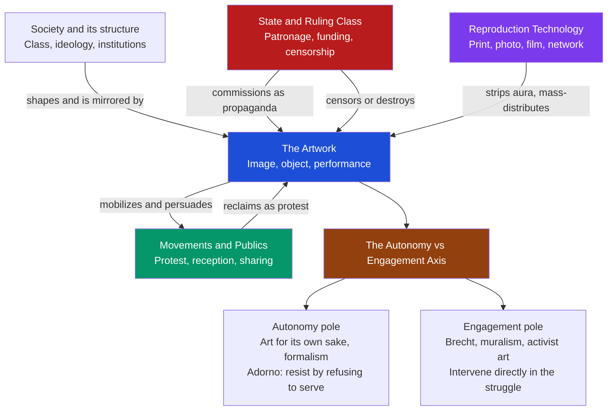

# Art, Society, and Politics

> [!abstract] TL;DR
> No image floats free of the society that makes it. This note treats art along a single loaded axis with three jobs it can perform: art can *reflect and serve* the social order (the **social history of art** — Hauser, T.J. Clark, Marxist art history reading a picture as a symptom of class and ideology); it can be a *weapon of power* (state **propaganda** and monumental aesthetics — Soviet Socialist Realism, Nazi classicism and the 1937 "Degenerate Art" show, the political poster); or it can be a *tool of resistance* (Goya's *Disasters of War*, Picasso's *Guernica*, Diego Rivera's murals, the Black Arts Movement, ACT UP's AIDS activism). Running underneath is the great modern quarrel over whether art should stay **autonomous** ("art for art's sake," formalism, Adorno's claim that autonomous art resists by refusing to serve) or become **engaged** (Brecht's committed, interventionist theatre) — a quarrel reshaped once **mechanical reproduction** stripped the artwork's "aura" (Benjamin) and mass culture became a standardized **culture industry** (Adorno and Horkheimer). It closes on the live battlegrounds where all of this becomes policy: censorship and the culture wars, public monuments and their removal, and art's role in forging national identity.

---

## Intuition

**Analogy:** Picture a packed stadium and a single fan who unfurls a flag. For a moment it is just a piece of dyed cloth held by one person. Then a neighbor raises theirs, then two more, and within seconds a wave of color crosses forty thousand people — not because anyone studied the flag's design, but because each person raised theirs *once enough of the people around them already had*. The flag's power was never in the fabric. It lived in three things at once: the **shared code** that told everyone what the color meant, the **social pressure** that made each person join when their neighbors did, and the fact that someone — a club, a nation, a movement — **printed and handed out** the flags in the first place, and could just as easily have banned them.

That is the whole subject of art and politics compressed into one gesture. An artwork is never only the object. It is the object **plus** the social field that loads it with meaning, **plus** the ripple of reception that decides whether it spreads or dies, **plus** the power that funds it, weaponizes it, or destroys it. Change any of those and the "same" image does opposite work: a hammer-and-sickle poster is triumphant in one square and forbidden contraband in another; a general on horseback is civic pride to one crowd and a wound to be pulled down by another. To ask how art relates to society and politics is to stop looking only at the canvas and start tracing the forces pushing on it from every side.

---

## How It Works

Art sits inside a **social field** shaped by pressures that pull it in different directions. From above, the **state and ruling class** commission, fund, and censor — they can make art carry their ideology or destroy art that threatens it. From below, **movements and publics** receive, reinterpret, and reclaim images as instruments of protest; reception is not passive, and the meaning a work *does* is often not the meaning it was *given*. Cutting across both, **reproduction technology** (print, photography, film, the network) detaches images from any single sacred original and hurls copies into mass circulation, which is exactly what makes art politically potent at scale. All of this feeds the central modern tension: whether a work should preserve its **autonomy** (refusing to be a tool, resisting through form alone) or embrace **engagement** (intervening directly in the political struggle).

The three "jobs" of art are not mutually exclusive — the same techniques of composition and distribution serve all three, which is precisely why the propaganda poster and the protest poster are formal cousins:

1. **Reflection / service** — Art registers the worldview and class interests of the society that produces it. The *social history of art* (Arnold Hauser, T.J. Clark) reads style itself as a document of social conditions; classical Marxism casts culture as **superstructure** rising from an economic **base**, so that a picture both *reflects* the ruling ideology and helps *reproduce* it by making a contingent social order look natural and eternal.
2. **Power / propaganda** — When the state seizes the means of image-making, art becomes an instrument of legitimation and control: Socialist Realism's heroic workers, Nazi Germany's monumental neoclassicism paired with the ritual humiliation of the 1937 *Entartete Kunst* ("Degenerate Art") exhibition, the mass-printed political poster.
3. **Resistance / engagement** — The same tools turned against power: Goya cataloguing atrocity, Picasso's *Guernica* as an anti-war howl, Rivera's murals writing the people back into history, ACT UP and Gran Fury's "SILENCE = DEATH" graphics fusing design and dying.



The diagram is deliberately a cycle, not a one-way arrow: the state loads meaning into art, but publics unload and re-load it, and reproduction technology keeps the object in perpetual circulation where control is never final.

---

## Key Concepts

### Secondary Level

**Art reflects the society that makes it.** The oldest political insight about art is the simplest: pictures are documents of their world. A cathedral encodes a feudal, God-centered order; a boardroom portrait encodes wealth and command. Even when a work says nothing about politics, it *shows* what its society took to be normal, beautiful, and important — and that is already political information.

**Propaganda and protest: the two political jobs of an image.** The same poster format can be pointed in opposite directions. **Propaganda** uses art to make people *support power*: strong workers marching toward a bright future, a heroic leader, a demonized enemy. **Protest art** uses art to make people *resist power*: Goya's *The Disasters of War* (etchings, made 1810–1820) refuses to glorify battle and instead shows executions, mutilation, and famine; Picasso's *Guernica* (1937) turns the bombing of a Basque town into a monochrome scream of horses, mothers, and severed limbs. Both are trying to move a crowd — the difference is whom they serve.

**Iconoclasm and censorship.** Because images have power, rulers have always tried to control them — smashing statues (iconoclasm), banning styles, burning books, closing exhibitions. To censor art is to admit it matters.

**Monuments and identity.** A statue in a public square is not a neutral decoration; it tells a city *who its heroes are*. That is why the fiercest recent fights over art are about *removing* monuments — pulling down a statue is a statement about who the community wants to be now.

---

### Undergraduate Level

**The social history of art.** Against the older idea that art history is a parade of geniuses and masterpieces, the *social history of art* insists that art is produced by, and legible as, its social conditions. **Arnold Hauser's** *The Social History of Art* (1951) narrated all of Western art as a function of changing class relations. **T.J. Clark** sharpened this into rigorous case studies: *Image of the People* and *The Painting of Modern Life* read Courbet and Manet against the class conflicts of 1848 and the rebuilt, commodified Paris of the Second Empire, arguing that modern painting's *form* — its flatness, its awkwardness, its refusal of easy pleasure — is itself a response to the social crisis of modernity.

**Marxist art history: base, superstructure, and ideology.** Classical Marxism treats culture as **superstructure** arising from the economic **base** (see [[Marx_and_Critical_Theory]] and [[Culture_Norms_Values_and_Ideology]]). On this view art performs **ideological** work: it makes a specific class order look like the natural, permanent shape of the world, so that domination is experienced as common sense. The crude version reads art as a mere *reflection* of economics; sophisticated versions (below) grant art **relative autonomy** — its own history, techniques, and capacity to *criticize* the order that produced it.

**State aesthetics I — Socialist Realism.** After 1934, the Soviet state made **Socialist Realism** the only permitted style: optimistic, accessible, heroic depictions of workers, peasants, and leaders building communism. Stalin called artists "engineers of human souls." Formal experiment (the earlier avant-garde of Malevich, Rodchenko) was condemned as bourgeois and suppressed. Art became a branch of the state.

**State aesthetics II — Nazi Germany.** The Nazi regime paired a monumental neoclassical ideal of "healthy" Aryan bodies with the 1937 ***Entartete Kunst*** ("Degenerate Art") exhibition, which hung confiscated modernist works — Expressionism, Dada, abstraction, art by Jewish and leftist artists — in deliberately chaotic, mocking displays to teach the public to despise them. Leni Riefenstahl's *Triumph of the Will* turned a party rally into cinematic myth. This is the textbook case of **aestheticizing politics**: making domination beautiful.

**Art as protest and social engagement.** A countertradition weaponizes art *against* power. **Diego Rivera** and Mexican muralism (1920s–30s) put epic public histories of labor and revolution on the walls of government buildings, art for the illiterate majority rather than the collector. The **Black Arts Movement** (1960s–70s, Amiri Baraka and others) demanded an art rooted in and accountable to Black political liberation. **ACT UP** and its art collective **Gran Fury** fused graphic design and direct action in the AIDS crisis; the "SILENCE = DEATH" pink triangle turned a Nazi persecution symbol into a rallying image. **Contemporary socially-engaged art** ("the social turn") makes the artwork a participatory social process rather than an object.

**The poster and political graphics.** The modern political poster — cheap, reproducible, legible at a glance — is arguably the defining political art form, from WWI recruitment images to the Soviet ROSTA windows, from Cuban revolutionary graphics to Shepard Fairey's Obama "HOPE." It is engineered for *diffusion*, which is exactly what the Python demo below models.

**Benjamin: art in the age of mechanical reproduction.** In his 1935 essay, **Walter Benjamin** argued that mechanical reproduction (photography, film) destroys the **aura** of the artwork — the unique authority of the here-and-now original, rooted in ritual and tradition. As copies proliferate, art's "cult value" gives way to "exhibition value," and the basis of art shifts from ritual to **politics**. His warning, still quoted: fascism responds to the masses by *aestheticizing politics* (spectacle, war as beauty); the answer, he wrote, is to *politicize art* (see [[Marx_and_Critical_Theory]]).

---

### Graduate Level

**The autonomy-vs-engagement debate: Adorno vs Brecht.** The central twentieth-century quarrel (collected in Verso's *Aesthetics and Politics*) pits two Marxists against each other. **Bertolt Brecht** demanded *committed*, interventionist art: epic theatre, the *Verfremdungseffekt* (alienation effect) that breaks illusion to make the audience *think and act*, and *Umfunktionierung* — the "functional transformation" of the artistic apparatus toward revolution. Art should be a tool. **Theodor Adorno** flipped the argument: precisely *because* capitalism instrumentalizes everything, art's political force lies in its **autonomy** — its refusal to be useful. "Committed" art that spells out its message collapses into propaganda and gets absorbed as one more consumable opinion; genuinely radical art (Beckett, Schoenberg) resists by its *form*, by being difficult, negative, and irreducible to a slogan. For Adorno, autonomous art is not apolitical — its very uselessness is an accusation against a totally administered world. Brecht's ally **Benjamin** split the difference in "The Author as Producer": the political question is not an artwork's *stated* attitude but its *position within the relations of production* — does it merely supply the apparatus, or transform it?

**The culture industry.** In *Dialectic of Enlightenment* (1944), **Adorno and Horkheimer** described mass culture as a **culture industry**: film, radio, and popular music are not spontaneous folk expression but standardized **commodities** manufactured to pacify. Its trick is **pseudo-individualization** — endless superficial novelty (this star, that hit) masking rigid sameness underneath — which trains audiences in passive consumption and reconciles them to the existing order. This is the pessimistic counterpart to Benjamin's hope that reproduction might *democratize* art; the tension between them frames media theory to this day (see [[Media_Culture_and_Cultural_Industries]] and [[Conflict_Theory_and_Critical_Theory]]).

**Relative autonomy and the revolt against reductionism.** Sophisticated Marxist aesthetics rejects "vulgar" economic determinism. **Raymond Williams** dismantled the base/superstructure metaphor, replacing it with the interplay of *dominant, residual, and emergent* cultural forms. **Pierre Bourdieu's** *The Field of Cultural Production* models the art world as a semi-autonomous **field** with its own stakes and hierarchy, structured by an **autonomous pole** ("art for art's sake," prestige, small audiences) opposed to a **heteronomous pole** (commercial success, mass audiences) — a rigorous sociological map of the very autonomy-vs-engagement axis. **Althusser's** "Ideological State Apparatuses" recasts culture as one institution through which subjects are *interpellated* into ideology. In each case the point is the same: art is neither a pure mirror of the economy nor magically free of it, but *relatively* autonomous.

**Aestheticization of politics vs politicization of art.** Benjamin's closing antithesis repays deep reading. Fascism, unable to grant the masses their economic rights, grants them *expression* — mass rallies, monumental architecture, the beauty of war ("Fiat ars, pereat mundus"). It makes politics a spectacle to be enjoyed rather than a set of interests to be contested. The revolutionary response is to *politicize* art: to make images tools of consciousness and organization rather than of trance. The contemporary heir of this debate is the critique of "spectacle" (Guy Debord) and of protest that is all image and no organization.

**Monuments, iconoclasm, and difficult heritage.** Public monuments are the sharpest edge where art meets power today. **Dario Gamboni's** *The Destruction of Art* shows that iconoclasm is not mindless vandalism but a *communicative act* — the toppling of a statue restates who holds legitimacy. Debates over Confederate monuments in the US, colonial statues ("Rhodes Must Fall," the 2020 toppling of Edward Colston in Bristol), and Soviet-era monuments in Eastern Europe turn on whether to **remove, relocate, contextualize, or counter** them. The **counter-monument** tradition (Jochen Gerz, Horst Hoheisel) answers by building anti-monuments that refuse triumphal permanence — memorials that sink, vanish, or implicate the viewer, especially around the Holocaust.

**The social turn and its critics.** Since the 1990s, **socially-engaged / participatory art** has made *social process* the medium — community projects, activism, and "relational" encounters (Nicolas Bourriaud's *relational aesthetics*). This reopens the autonomy debate on new ground. **Grant Kester** champions a "dialogical aesthetics" of collaboration; **Claire Bishop** (*Artificial Hells*) warns that judging such work only by its good intentions or social utility abandons the *aesthetic* and ethical friction that makes art more than benign social work. The unresolved question — can art be both genuinely useful and genuinely art? — is the Adorno–Brecht quarrel wearing new clothes.

---

## Python Demo

```python
# Diffusion of a Politically Charged Image Through a Social Network
# ----------------------------------------------------------------
# Model art as SOCIAL COMMUNICATION. A protest poster / political graphic is
# a unit of meaning that spreads person-to-person. We use Granovetter's LINEAR
# THRESHOLD model of social contagion: a person "adopts" the image (shares or
# endorses it) once a large enough FRACTION of their social contacts already
# have -- i.e. people are moved partly by peer conformity, not the image alone.
#
# We compare two ways of LAUNCHING the same image:
#   (A) GRASSROOTS -- seed a few RANDOM people      (bottom-up activism)
#   (B) BROADCAST  -- seed the few most-connected HUB people
#                     (top-down media / propaganda targeting influencers)
#
# Analytical, not partisan: "adoption" is neutral sharing behaviour, and both
# launch strategies are treated as generic seeding of a diffusion process.
#
# Panel 1: cumulative ADOPTION CURVE (the classic S-curve) for A vs B
# Panel 2: FINAL REACH vs population "resistance" (average conformity threshold)
#
# numpy + matplotlib only.

import numpy as np
import matplotlib
matplotlib.use("Agg")
import matplotlib.pyplot as plt

rng = np.random.default_rng(42)

# --- 1. Build a small-world social network (Watts-Strogatz style) -----------
def small_world_adjacency(n, k, p, rng):
    """n nodes, each linked to k nearest neighbours on a ring, edges rewired w.p. p."""
    A = np.zeros((n, n), dtype=int)
    for i in range(n):
        for j in range(1, k // 2 + 1):
            A[i, (i + j) % n] = 1
            A[i, (i - j) % n] = 1
    for i in range(n):                       # rewire to inject long-range ties
        for j in range(1, k // 2 + 1):
            if rng.random() < p:
                nb = (i + j) % n
                A[i, nb] = A[nb, i] = 0
                t = int(rng.integers(n))
                while t == i or A[i, t] == 1:
                    t = int(rng.integers(n))
                A[i, t] = A[t, i] = 1
    return A

N, K, P = 240, 8, 0.10
A   = small_world_adjacency(N, K, P, rng)
deg = A.sum(axis=1)

# --- 2. Linear threshold dynamics -------------------------------------------
def diffuse(A, seeds, thresholds, max_steps=80):
    n = A.shape[0]
    active = np.zeros(n, dtype=bool)
    active[seeds] = True
    d = np.maximum(A.sum(axis=1), 1)
    history = [active.mean()]
    for _ in range(max_steps):
        active_frac = (A @ active.astype(float)) / d      # share of active neighbours
        newly = (~active) & (active_frac >= thresholds)
        if not newly.any():
            break
        active = active | newly
        history.append(active.mean())
    return np.array(history), active

# Heterogeneous thresholds: a spread of easy adopters and resistant hold-outs.
base_thr = np.clip(rng.normal(0.18, 0.10, N), 0.02, 0.95)

n_seeds     = 8
grass_seeds = rng.choice(N, size=n_seeds, replace=False)   # random people
hub_seeds   = np.argsort(deg)[-n_seeds:]                    # most-connected people

hist_A, final_A = diffuse(A, grass_seeds, base_thr)
hist_B, final_B = diffuse(A, hub_seeds,  base_thr)

# Pad to equal length so both curves plot on the same time axis.
L = max(len(hist_A), len(hist_B))
hist_A = np.pad(hist_A, (0, L - len(hist_A)), mode="edge")
hist_B = np.pad(hist_B, (0, L - len(hist_B)), mode="edge")

# --- 3. Sweep population "resistance" (mean conformity threshold) -----------
mean_thr_grid = np.linspace(0.08, 0.40, 17)
reach_grass, reach_hub = [], []
for m in mean_thr_grid:
    thr = np.clip(rng.normal(m, 0.10, N), 0.02, 0.98)
    _, fa = diffuse(A, grass_seeds, thr)
    _, fb = diffuse(A, hub_seeds,  thr)
    reach_grass.append(fa.mean())
    reach_hub.append(fb.mean())

# --- 4. Report --------------------------------------------------------------
print("=== Diffusion of a politically charged image ===")
print(f"Network: {N} people, mean degree {deg.mean():.1f}, small-world (p={P})")
print(f"Launch: {n_seeds} seed people each\n")
print(f"Grassroots (random seeds): final reach {final_A.mean()*100:5.1f}% "
      f"in {len(hist_A)-1} steps")
print(f"Broadcast  (hub seeds)   : final reach {final_B.mean()*100:5.1f}% "
      f"in {len(hist_B)-1} steps")
print("\nHub-seeding tends to reach more people, faster: a few highly connected")
print("nodes push many neighbours over their conformity threshold at once --")
print("the structural logic behind why states and movements court 'influencers'.")

# --- 5. Plot ----------------------------------------------------------------
fig, (ax1, ax2) = plt.subplots(1, 2, figsize=(14, 5.5))
fig.suptitle("Art as Social Persuasion: Diffusion of a Political Image",
             fontsize=12, fontweight="bold")

steps = np.arange(L)
ax1.plot(steps, hist_A*100, "-o", color="#059669", lw=2, ms=4,
         label=f"Grassroots seeds (final {final_A.mean()*100:.0f} pct)")
ax1.plot(steps, hist_B*100, "-s", color="#b91c1c", lw=2, ms=4,
         label=f"Hub / broadcast seeds (final {final_B.mean()*100:.0f} pct)")
ax1.set_xlabel("Diffusion step (time)")
ax1.set_ylabel("Population that has adopted the image (pct)")
ax1.set_title("Adoption S-curve: grassroots vs broadcast launch", fontsize=10)
ax1.set_ylim(0, 100); ax1.grid(alpha=0.25); ax1.legend(fontsize=8, loc="lower right")

ax2.plot(mean_thr_grid, np.array(reach_grass)*100, "-o", color="#059669",
         lw=2, ms=4, label="Grassroots seeds")
ax2.plot(mean_thr_grid, np.array(reach_hub)*100, "-s", color="#b91c1c",
         lw=2, ms=4, label="Hub / broadcast seeds")
ax2.set_xlabel("Average conformity threshold (population resistance)")
ax2.set_ylabel("Final reach (pct)")
ax2.set_title("Tipping point: reach collapses past a resistance level", fontsize=10)
ax2.set_ylim(0, 100); ax2.grid(alpha=0.25); ax2.legend(fontsize=8, loc="upper right")

plt.tight_layout(rect=[0, 0, 1, 0.95])
plt.savefig("art_political_diffusion.png", dpi=140, bbox_inches="tight")
print("\nFigure saved: art_political_diffusion.png")
```

**What the model demonstrates:**

- **The adoption S-curve.** Both launches produce the signature S-shape of social contagion: a slow start while early adopters are isolated, an explosive middle once clusters ignite and neighbors tip each other, and a plateau once only the resistant hold-outs remain. This is the real dynamic behind a poster that "goes viral" — spread is driven by network structure and peer conformity, not by the image being seen once.
- **Who you seed changes the outcome.** Seeding the few **hub** nodes (the broadcast / propaganda strategy) generally reaches more people faster than seeding **random** individuals, because one high-degree person simultaneously exposes many others, tipping several over their thresholds at once. This is the structural reason states monopolize mass media and movements court influencers — the *content* can be identical; the *seeding* is the lever.
- **The tipping point (Panel 2).** As the population's average conformity threshold rises (people grow more skeptical, or opposing messages raise the bar), final reach does not decline smoothly — it **collapses** past a critical resistance level. Below the tipping point almost everyone adopts; above it the image dies with its seeds. Hub-seeding pushes that cliff further right, meaning a broadcast launch can still spread in a more resistant population where grassroots effort stalls.
- **A crucial caveat the model makes visible.** "Adoption" here is *sharing behavior*, not belief. Diffusion is necessary but not sufficient for persuasion — an image can saturate a network while changing few minds, or spread precisely *because* people share it to mock it. Confusing reach with influence is one of the most common errors in reading political art (see Common Pitfalls).

---

## Real-World Applications

> **Example 1 — Campaign visual identity and the viral poster.** Shepard Fairey's 2008 Obama "HOPE" poster began as a small print run and diffused through exactly the network dynamics the demo models — reproduced, remixed, and stickered across cities until it became the campaign's de facto icon. Its power was inseparable from its *reproducibility* (Benjamin's point): there was no sacred original that mattered, only the endlessly copied image.

> **Example 2 — State propaganda ministries and monopoly aesthetics.** From WWI recruitment posters to Soviet Socialist Realism, Chinese Cultural Revolution graphics, and North Korean monumental art, states that seize the means of image-making enforce a single style and seed it from the commanding "hub" of mass media. The Nazi *Entartete Kunst* show is the mirror image — a state using an exhibition to *inoculate* the public against rival images (see [[Media_Propaganda_and_Political_Communication]]).

> **Example 3 — The culture industry and advertising.** Branding is aestheticized ideology at industrial scale: standardized images engineered for diffusion that naturalize consumption and lifestyle as identity. Adorno and Horkheimer's critique is now the everyday logic of the attention economy, where "pseudo-individualization" is literally an A/B-tested product feature (see [[Media_Culture_and_Cultural_Industries]]).

> **Example 4 — Monument policy and heritage commissions.** Cities worldwide now run formal processes to decide the fate of contested statues — remove, relocate, contextualize with plaques, or answer with counter-monuments. The 2020 toppling of the Edward Colston statue in Bristol and the global "Rhodes Must Fall" and Confederate-monument debates turned art criticism into live municipal policy about national and civic identity (see [[Nationalism_Ethnicity_and_Collective_Identity]]).

> **Example 5 — Digital activism and image warfare.** Protest imagery and political memes now diffuse through actual social networks in real time — the pink "SILENCE = DEATH" triangle, the raised-fist and hashtag graphics of recent movements, and their propaganda counterparts in coordinated influence operations. The linear-threshold model in the demo is a first-order tool for understanding *why* some images cascade and others stall, and why seeding strategy (organic vs bot-amplified hubs) is decisive (see [[Social_Movements_and_Revolution]]).

> **Example 6 — Arts funding and the culture wars.** State arts bodies routinely become censorship battlegrounds. The late-1980s US controversies over National Endowment for the Arts support for Andres Serrano and Robert Mapplethorpe forced the question of what a democratic state should fund and whether withdrawal of funding is censorship — a live test of art's autonomy against the power that pays for it.

---

## Common Pitfalls

- **Vulgar / reductive Marxism** — Reading an artwork as nothing but a coded expression of its economy or the artist's class, so that form, craft, and the work's capacity to *criticize* its own society all vanish. The corrective is *relative autonomy* (Williams, Bourdieu, Althusser): art is shaped by society without being a mere mirror of it.

- **Equating all political art with propaganda** — Assuming that because a work takes a side it must be crude and dishonest. *Guernica* and a recruitment poster share a political function but differ enormously in complexity and truthfulness. Political commitment is orthogonal to aesthetic quality; committed art can be great and autonomous art can be reactionary.

- **Assuming autonomy means apolitical** — Treating "art for art's sake" as a retreat from politics. Adorno's whole argument is the opposite: in a society that instrumentalizes everything, art's *refusal to be useful* is itself a political stance. "Neutral" and "formal" are not the same as "non-ideological."

- **The reach-equals-persuasion fallacy** — Concluding that because an image spread widely it changed minds. The diffusion model spreads *sharing*, not *belief*; images go viral through outrage, mockery, and irony as readily as through agreement. Virality is a measure of circulation, not of conversion.

- **The effect-follows-intent fallacy** — Assuming a political image does the work its maker intended. Reception is active and appropriative: symbols get reclaimed (the pink triangle), inverted, or defanged into fashion. Meaning is decided downstream, by publics, not upstream, by artists.

- **Presentism (and its opposite) in monument debates** — Either judging historical monuments purely by present values while ignoring why they were built, *or* treating them as neutral, eternal heritage above politics. Monuments were political acts when erected and remain political acts when kept, moved, or removed; both amnesia and absolutism dodge that fact.

- **Aestheticization creep** — Mistaking spectacle for politics. When protest becomes primarily a supply of striking images, or governance becomes primarily stagecraft, Benjamin's warning applies: the beautiful image can substitute for, rather than advance, the underlying struggle.

---

## Related Concepts

- [[Marx_and_Critical_Theory]] — The philosophical engine of this note: base/superstructure and ideology, and the Frankfurt School (Benjamin's aura and mechanical reproduction, Adorno and Horkheimer's culture industry) that reframed art's political role for the age of mass media.
- [[Media_Propaganda_and_Political_Communication]] — The political-science account of how messages and images are engineered to persuade populations; the propaganda pole of art's political function, and the empirical study of the diffusion the demo models.
- [[Literature_and_Politics]] — The literary counterpart of this entire debate: the same Adorno–Brecht quarrel over committed vs autonomous work, censorship, and national identity, played out in the verbal rather than the visual arts.
- [[Media_Culture_and_Cultural_Industries]] — The sociological development of the culture-industry thesis: how cultural production is organized as commodity manufacture, and how mass media seed and standardize imagery.
- [[Culture_Norms_Values_and_Ideology]] — Unpacks "ideology," the key mechanism by which art naturalizes a social order and makes contingent power look like common sense.
- [[Conflict_Theory_and_Critical_Theory]] — The broader sociological frame of power, domination, and critique within which Marxist and Frankfurt-School art theory sits.
- [[Social_Movements_and_Revolution]] — The engine of protest and engaged art: how movements generate, spread, and are mobilized by images, murals, posters, and monuments.
- [[Political_Sociology_and_Social_Power]] — The anatomy of state and class power that funds, censors, and monumentalizes art, and against which resistance art pushes.
- [[Nationalism_Ethnicity_and_Collective_Identity]] — The identity dimension: how monuments, national styles, and public art forge (and contest) collective belonging.
- [[Art_and_Meaning]] — The prior question of *how* a picture means at all (representation, expression, symbolism, Panofsky's iconology); political meaning is a specialization of that machinery, and reception-dependent meaning is central to both.
- [[What_Is_Art]] — The definitional backdrop: institutional and social theories of art (the "artworld") that make the social embedding of art a defining feature, not an external add-on.

---

## Review Questions

### Secondary

1. Goya's *Disasters of War* and a wartime recruitment poster both use art to move a crowd during conflict. Explain how they perform *opposite* political jobs, and state one thing an image reveals about its society even when it says nothing overtly political.
2. Why is pulling down a public statue a *political statement* rather than simple vandalism? Frame your answer in terms of what a monument tells a community about itself.

### Undergraduate

3. Explain the base/superstructure model and the idea of art as "ideology." Then give the strongest objection to reading art as a *mere reflection* of the economy, and define "relative autonomy" as the reply.
4. Compare Socialist Realism and Nazi *Entartete Kunst* as two techniques of state control over art — one prescribing a style, the other proscribing one. What does each reveal about why regimes fear certain images?
5. Summarize Benjamin's claim that mechanical reproduction destroys the artwork's "aura," and explain his antithesis between the *aestheticization of politics* (fascism) and the *politicization of art*. Use the Obama "HOPE" poster or a viral protest image to illustrate why reproducibility is politically powerful.

### Graduate

6. Reconstruct the Adorno–Brecht debate over committed vs autonomous art. State each position at its strongest, then adjudicate: can Adorno's claim that autonomous art "resists by refusing to serve" survive the objection that it merely lets privileged art abstain from struggle? Bring in Benjamin's "author as producer" to reframe the question around the *relations of production* rather than the artwork's stated attitude.
7. The Python model shows that seeding a few network *hubs* generally beats seeding random individuals, and that final reach *collapses* past a critical resistance threshold. Using these two results, analyze one real influence campaign (state propaganda, a social movement, or a coordinated online operation) in terms of seeding strategy and population resistance. Then critique the model: what does treating "adoption" as sharing rather than belief let it capture, and what does it miss?
8. Bourdieu's "field of cultural production" maps art along an autonomous vs heteronomous axis; Claire Bishop and Grant Kester reopen the same tension for socially-engaged art. Formulate the question "can art be genuinely useful *and* genuinely art?" as a version of the autonomy-vs-engagement problem, and defend a position. What criteria should judge participatory/activist art — aesthetic, ethical, political — and can any single criterion be primary without betraying the form?

---

## Sources

- [Benjamin, W. (1935). "The Work of Art in the Age of Mechanical Reproduction," in *Illuminations*. Schocken.](https://www.marxists.org/reference/subject/philosophy/works/ge/benjamin.htm)
- [Adorno, T. & Horkheimer, M. (1944). "The Culture Industry: Enlightenment as Mass Deception," in *Dialectic of Enlightenment*. Stanford University Press.](https://www.goodreads.com/book/show/385228.Dialectic_of_Enlightenment)
- [Adorno, T., Benjamin, W., Bloch, E., Brecht, B. & Lukács, G. (1977). *Aesthetics and Politics*. Verso.](https://www.goodreads.com/book/show/113115.Aesthetics_and_Politics)
- [Clark, T.J. (1973). *Image of the People: Gustave Courbet and the 1848 Revolution*. Thames & Hudson.](https://www.goodreads.com/book/show/1044996.Image_of_the_People)
- [Hauser, A. (1951). *The Social History of Art*. Routledge.](https://www.goodreads.com/book/show/595903.The_Social_History_of_Art)
- [Bourdieu, P. (1993). *The Field of Cultural Production*. Columbia University Press.](https://www.goodreads.com/book/show/318444.The_Field_of_Cultural_Production)
- [Bishop, C. (2012). *Artificial Hells: Participatory Art and the Politics of Spectatorship*. Verso.](https://www.goodreads.com/book/show/13485755-artificial-hells)
- [Gamboni, D. (1997). *The Destruction of Art: Iconoclasm and Vandalism since the French Revolution*. Reaktion Books.](https://www.goodreads.com/book/show/1902066.The_Destruction_of_Art)

---

#aesthetics #art-and-politics #propaganda #social-art-history #engaged-art
