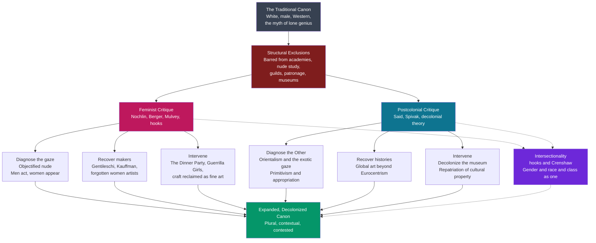

# Feminist and Postcolonial Art Theory

> [!abstract] TL;DR
> The list of "great artists" everyone learns — Michelangelo, Rembrandt, Picasso — is overwhelmingly white, male, and Western, and feminist and postcolonial art theory ask *why*, refusing the lazy answer that genius simply happened to cluster there. Linda Nochlin's landmark essay "Why Have There Been No Great Women Artists?" (1971) turns the question inside out: the absence is not a fact about female talent but about **institutions and access** — the academies, nude-drawing classes, patronage networks, and guilds that women were barred from. Feminist theory further exposes the **male gaze** (Berger's "men act, women appear"; Mulvey's cinematic formulation) that made woman the *object* of the nude rather than its maker, and it drives a positive practice — recovering forgotten women (Artemisia Gentileschi), reclaiming craft and textile as fine art (Judy Chicago's *The Dinner Party*), and militant institutional critique (the Guerrilla Girls). Postcolonial theory extends the same move outward: Edward Said's *Orientalism* names the Western fantasy of the exotic "Other" staged in Orientalist painting, "primitivism" appropriates non-Western form while erasing its makers (Picasso and African masks), the ethnographic museum enacts a **colonial gaze**, and decolonial scholarship demands global art history over Eurocentrism, plus **repatriation** of looted cultural property. Intersectionality (bell hooks) insists these axes — gender, race, class, sexuality — are inseparable.

---

## Intuition

**Analogy:** Imagine a national hall of fame for cooking whose plaques, for three hundred years, honor almost only male head chefs of grand restaurants. A visitor concludes women must simply be worse cooks — after all, look at the wall. But walk into the archive and the real story appears: women were forbidden to enroll in the culinary academies, banned from the professional kitchens where reputations were made, denied the bank loans to open restaurants, and the food they *did* make all day — the home cooking, the preserving, the baking — was reclassified as "domestic chores," not "cuisine," precisely so it could never qualify for a plaque. The wall is not a record of talent. It is a record of **who was allowed into the rooms where greatness gets certified**. And notice a second twist: the few women who *do* appear on the wall are mostly there as the pretty hostesses in the restaurant's paintings — decoration, not authorship.

Now swap "cooking" for "art," "academies" for the Royal Academy and its life-drawing class, "home cooking" for embroidery and quilting, and the "pretty hostess" for the female nude, and you have the feminist critique of the art canon exactly. Extend the same X-ray to the *rest of the world's art* — masks and bronzes seized from colonized peoples, displayed in glass cases as anonymous "primitive" specimens while a European painter who copied their forms is celebrated as a revolutionary genius — and you have the postcolonial critique. Both start from one refusal: **the canon is not nature, it is an institution, and institutions have doors, gatekeepers, and locks.**

---

## How It Works

Feminist and postcolonial art theory are not primarily about individual pictures; they are a **structural analysis of how a canon is manufactured**. A canon — the working list of "great" artists and masterpieces reproduced in survey textbooks, hung in the permanent galleries, and taught in Art History 101 — presents itself as the neutral cream that rose to the top of an open competition of talent. Both theories deny the competition was ever open. They proceed in three coordinated moves that mirror each other across the two critiques.

1. **Diagnose the exclusion mechanism.** Ask not "were there great women / non-Western artists?" but "what institutions decided who could *become* one?" For women: no access to the academies, the nude-study classes that were the gateway to prestigious history painting, guild membership, patronage, or the myth of the lone male "genius." For colonized peoples: their art is stripped of authorship and history, relabeled "primitive" or "artifact," and physically removed to European museums.
2. **Diagnose the representational regime.** Examine *how* the excluded group appears when it appears at all. Woman appears as the surveyed **nude** — object of a male gaze (Berger, Mulvey), not its bearer. The colonized appears as the exotic, eroticized, timeless **Other** of Orientalist painting (Said), or as raw formal material to be "borrowed" (primitivism).
3. **Intervene.** Recover erased makers (Gentileschi, Kauffman, entire non-Western traditions); revalue excluded media (textile, craft, ritual object); build counter-institutions and critique existing ones (Guerrilla Girls, decolonial curation, repatriation) to force the canon open.

The whole apparatus turns on a single insight shared with [[What_Is_Art|institutional theories of art]]: **"great art" is not discovered, it is certified** — by academies, critics, dealers, museums, and textbooks — and whoever controls the certifying institutions controls the canon.



The diagram reads top-down: a canon presented as natural is re-described as the output of exclusion mechanisms; two critical traditions each run the same three-step program (diagnose the gaze / the Other, recover erased makers and histories, intervene institutionally); intersectionality cuts across both, insisting the axes cannot be separated; and the target is not a "female" or "non-Western" canon bolted onto the old one but a plural, contextual, permanently contestable account of art.

---

## Key Concepts

### Secondary Level

**The canon and its exclusions**

A **canon** is the informal but powerful list of artists and works that a culture treats as essential — the ones in the survey textbook (Janson's or Gardner's *History of Art*), the permanent-collection galleries, and the "masterpiece" postcards. For most of Western art history this list was almost entirely white, male, and European. The first move of both feminist and postcolonial theory is to make that fact *visible* and then *strange*: it is so familiar that we stop noticing it and start assuming it must reflect where the talent actually was. The theories insist the pattern is too total to be an accident of ability.

**Nochlin's reframing: "Why Have There Been No Great Women Artists?" (1971)**

Art historian Linda Nochlin's essay is the founding text of feminist art history. Her key move is to *refuse the trap in the question*. Faced with "why no great women artists?", the tempting reply is defensive: "there were some, you just forgot them!" Nochlin rejects both that and the sexist assumption behind the question. Her answer: there have been few celebrated women artists **not because women lack genius but because the institutions that manufacture great artists were closed to them.** You could not become a "great master" of grand history painting without training you were forbidden to receive — above all, the study of the nude from live models, from which women were excluded on grounds of "modesty" well into the 19th century. The very *concept* of the solitary male genius, she argues, is part of the mechanism. It is a structural, not a biological, explanation.

**Berger: "men act and women appear"**

In *Ways of Seeing* (1972), the critic John Berger gave the objectification of the female body its most quotable formula: in the European tradition of the nude, **"men act and women appear. Men look at women. Women watch themselves being looked at."** The woman in the painting is not a subject doing something; she is a surface arranged for, and often gazing back to acknowledge, an assumed *male* spectator-owner outside the frame. Berger showed that the nude is rarely just a naked body — it is a naked body *aware of being seen*, composed for consumption.

**The male gaze (introduced)**

Closely linked is the **male gaze**: the idea that mainstream visual culture is structured to look *at* women from an assumed heterosexual male viewpoint, making women the object of the look and men its bearer. Formulated for cinema by Laura Mulvey (see Undergraduate), it maps directly onto the centuries-long tradition of the reclining female nude. It explains the Guerrilla Girls' most famous statistic — that in the museum, women are far more often the naked subject of the picture than its author.

**The Guerrilla Girls**

Founded in New York in 1985, the **Guerrilla Girls** are anonymous feminist artist-activists who appear in gorilla masks and wage data-driven poster campaigns against sexism and racism in the art world. Their most celebrated poster (1989) asked, over Ingres' odalisque, *"Do women have to be naked to get into the Met. Museum?"* — pointing out that a tiny fraction of the artists in the modern sections were women while the overwhelming majority of the nudes were female. They turned institutional critique into memorable, countable public art.

---

### Undergraduate Level

**Feminist art history, in depth: essentialist vs constructionist strands**

After Nochlin, feminist art history split into complementary programs:

- **Recovery / recuperation.** Scholars (Nochlin, Ann Sutherland Harris, Germaine Greer's *The Obstacle Race*) unearthed and re-attributed the women who *did* make major work against the odds — **Artemisia Gentileschi** (whose visceral *Judith Slaying Holofernes* is now read partly through her own history of assault and public trial), Sofonisba Anguissola, Angelica Kauffman (a founding member of the Royal Academy who nonetheless could not attend its life class), Élisabeth Vigée Le Brun, Rosa Bonheur, Berthe Morisot. Recovery corrects the archive.
- **Essentialist / "feminine aesthetic" feminism.** A strand (associated with 1970s practice, e.g. **Judy Chicago** and Miriam Schapiro's "central-core" imagery) sought a distinctively female visual language and *revalued the media women had been allowed*: needlework, ceramics, quilting, china-painting — "craft" long ranked beneath the "fine arts" precisely because women did it. Reclaiming craft as fine art is a direct assault on the medium hierarchy that helped exclude women.
- **Constructionist / socio-institutional feminism.** A later strand (Griselda Pollock, Rozsika Parker's *Old Mistresses* and *The Subversive Stitch*) rejected any innate "feminine essence" as itself a patriarchal idea, and instead analyzed how the *category* "artist," the *institutions*, and the very language of art history produce sexual difference. Pollock argued you cannot just "add women and stir" — you must rewrite the discipline's structures.

**Judy Chicago's *The Dinner Party* (1974-79)**

The landmark monument of feminist art: a large triangular banquet table with 39 elaborate place settings, each honoring a mythical or historical woman (Sappho, Hildegard, Sojourner Truth, Virginia Woolf, Georgia O'Keeffe), executed in the "low" craft media of **ceramics and embroidered textiles** by a large collaborative team. It simultaneously *recovers* forgotten women, *revalues* craft, and rejects the myth of the solitary male genius through collective authorship. It is now permanently installed at the Brooklyn Museum.

**The male gaze in visual art: Mulvey's mechanism**

Laura Mulvey's essay "Visual Pleasure and Narrative Cinema" (1975) theorized *how* the male gaze works, using psychoanalysis. Classical film, she argued, splits looking by gender: the male character *drives the story and looks*; the female is coded for **"to-be-looked-at-ness"**, a passive spectacle that halts the narrative for visual pleasure. The spectator is sutured into the male position. Though written about Hollywood, Mulvey's structure retro-illuminates the entire Western tradition of the reclining Venus and the bathing nude — the painting, like the film, is built for an off-screen male eye. Berger's "men act, women appear" and Mulvey's "to-be-looked-at-ness" are the same insight in two media.

**Postcolonial art theory: Said's *Orientalism* applied to painting**

Edward Said's *Orientalism* (1978) argued that "the Orient" is not a real place Europe described but a **fantasy Europe constructed** — a discourse that produced the East as sensual, despotic, irrational, timeless, and feminine, precisely so the West could imagine itself as rational, dynamic, and masculine by contrast, and thereby justify ruling it. Applied to visual art, this dissects the 19th-century genre of **Orientalist painting** — Jean-Léon Gérôme's slave markets and *The Snake Charmer*, Delacroix's harems, Ingres' odalisques. These canvases are not documentary; they stage a Western erotic and colonial fantasy of the exotic "Other," often combining the *sexualized female nude* with the *colonized exotic locale* — which is why feminist and postcolonial readings converge on exactly these images (the odalisque is objectified *as woman* and *as Oriental* at once). The critic looks at what such paintings reveal about the *painter's* culture and its power, not about the East.

**Primitivism and appropriation**

**Primitivism** is the early-20th-century avant-garde's fascination with African, Oceanic, and Indigenous art — the "borrowing" of mask forms and "tribal" motifs by Picasso (*Les Demoiselles d'Avignon*, 1907), Matisse, the German Expressionists, and others. Postcolonial critique exposes the asymmetry: the European artists were hailed as *revolutionary geniuses* for the "discovery," while the actual makers of the masks were kept **anonymous, dateless, and "timeless"**, their objects wrenched from ritual meaning into raw formal inspiration and displayed as "primitive." The 1984 MoMA exhibition *"Primitivism" in 20th Century Art* became the flashpoint: critics (notably Thomas McEvilley) attacked it for celebrating the Western "affinity" while erasing the colonized cultures whose objects made it possible. Appropriation without attribution or context is a form of the colonial gaze.

---

### Graduate Level

**Intersectionality and bell hooks: no single-axis critique**

Early feminist art history was itself critiqued for centering *white, middle-class, Western* women — for treating "woman" as if she had no race or class. The concept of **intersectionality** (coined by legal scholar Kimberlé Crenshaw; see [[Intersectionality]]) and the writing of **bell hooks** (*Ain't I a Woman*; *Art on My Mind*, 1995) insist that gender, race, class, and sexuality are not separable variables you can analyze one at a time — they co-constitute a single lived position. A Black woman artist is not excluded "as a woman plus as Black"; the exclusions interlock and produce something specific. hooks argues for a Black feminist practice of looking — an "oppositional gaze" that refuses both the white gaze and the male gaze. Intersectionality is why the mature field braids the feminist and postcolonial critiques together rather than running them in parallel.

**The ethnographic museum and the colonial gaze**

Postcolonial museology turns the critique on the museum *as an apparatus*. Why is a West African bronze in the *ethnographic* museum (labeled by "culture," undated, anonymous, behind glass as a specimen of a people) while a European bronze of similar date is in the *art* museum (labeled by named artist, dated, framed as individual masterpiece)? The very partition of "art museum" from "ethnographic / natural-history museum" encodes a colonial hierarchy: the West *makes art and history*; the rest *makes artifacts and custom*. The mode of display — the vitrine, the diorama, the anonymous mass — enacts a **colonial gaze** that fixes the colonized as a timeless object of study. James Clifford's "art-culture system" maps how objects migrate between the "authentic art" and "authentic artifact" bins depending on who is doing the sorting.

**Decolonizing art history and the problem of global art history**

"Decolonizing art history" means more than adding non-Western chapters. It attacks the discipline's deep grammar: the **Eurocentric master narrative** in which art "develops" from Greece to the Renaissance to the modern West, with everything else as either "influence," "background," or arrested "tradition"; the assumption that Western categories ("fine art," "the aesthetic," "the artist") are universal yardsticks; and the periodization (Renaissance, Baroque, Modern) that only fits Europe. Proposals for a **global / world art history** (Hans Belting, David Summers' *Real Spaces*, John Onians' *Atlas of World Art*) try to write art history without a single center. But this program has its own dangers debated at the graduate level:

- **The new-universalism trap.** A "global" survey can smuggle Western aesthetic categories back in as the neutral common measure, re-colonizing under a cosmopolitan flag.
- **Loss of specificity.** Flattening radically different practices into one comparative frame can erase exactly the local meanings decolonial critique wanted to protect.
- **Market co-optation.** The global art market and biennial circuit happily absorb "diversity" as a brand, neutralizing critique into a saleable style — the institution assimilates its critics.

**Repatriation and cultural property**

The material stakes of the museum critique are **repatriation** — the return of looted and coercively acquired objects. Flashpoints include the **Parthenon (Elgin) Marbles** (Greece vs the British Museum), the **Benin Bronzes** (thousands looted in the 1897 British punitive expedition, now dispersed across Western museums, with returns from Germany, Cambridge, and others underway), and countless Indigenous ancestral remains and sacred objects (governed in the US by NAGPRA). The debate pits a "universal / encyclopedic museum" argument (the British Museum's position: great collections serve all humanity in one place) against claims of **cultural property, provenance justice, and sovereignty** (see [[Indigenous_Rights_and_Sovereignty]]). Repatriation makes decolonization concrete: it is not a reading of a painting but the physical undoing of a theft.

**Queer art theory**

Extending the critique along the axis of sexuality, **queer art theory** (indebted to Michel Foucault's history of sexuality, Judith Butler's performativity, and Eve Sedgwick) both *recovers* suppressed queer artists and iconographies (the coded homoeroticism in Caravaggio or Sargent; the explicit work of Robert Mapplethorpe, David Wojnarowicz, Catherine Opie; the AIDS-crisis activism of Gran Fury) and, more radically, **queers the act of looking itself** — dismantling the assumed heterosexual male spectator of Mulvey's model and theorizing camp, drag, and the queer gaze as ways of destabilizing the "natural" categories of gender and desire that the canon presumed. The 1989-90 culture wars over Mapplethorpe's NEA-funded exhibition made queer art theory a public battleground over representation and public funding.

**The persistent internal tensions**

The mature field openly debates its own fault lines: the **essentialism problem** (is there a "feminine" or "African" aesthetic to recover, or does asserting one re-inscribe the stereotype?); **strategic essentialism** (Gayatri Spivak's idea that a group may *provisionally* adopt an essential identity for political leverage while knowing it is constructed); the risk that **institutional critique gets institutionalized** (the Guerrilla Girls now hang *in* the museums they attack; "decolonial" becomes a curatorial brand); and Spivak's haunting question, "**Can the Subaltern Speak?**" — whether the museum and the academy can ever represent the colonized without re-silencing them in the act.

---

## Python Demo

```python
# The Representation Gap in the Canon -- a SCHEMATIC, ILLUSTRATIVE model
# ---------------------------------------------------------------------
# Feminist and postcolonial art theory rest on an empirical claim: women and
# non-Western artists are severely under-represented in the institutions that
# certify "great art" -- museum collections and art-history survey textbooks --
# even as representation slowly rises. This script visualizes that claim.
#
# IMPORTANT: the numbers below are PLAUSIBLE ILLUSTRATIVE / SCHEMATIC values
# chosen to convey the shape and scale of the gap for teaching. They are NOT
# precise measurements of any single institution. Real audited figures exist
# (e.g. studies of major US museum collections and of Janson's/Gardner's
# survey editions) and land in broadly the same low-double-digit range.
#
# Panel 1 (line): percent of works by women and by non-Western artists in a
#                 major museum's collection, by decade -- rising but still low.
# Panel 2 (bar):  the "act vs appear" objectification gap in the modern galleries
#                 -- share of ARTISTS who are women vs share of NUDES that are
#                 female -- the empirical form of "men act, women appear".
#
# numpy + matplotlib only.

import numpy as np
import matplotlib
matplotlib.use("Agg")
import matplotlib.pyplot as plt

# --- Panel 1 data: representation over time (SCHEMATIC) ----------------------
decades = np.array([1900, 1920, 1940, 1960, 1980, 2000, 2020])

# % of collection works attributed to women artists (illustrative, rising slowly)
pct_women_collection = np.array([2.0, 2.5, 3.0, 4.0, 6.0, 9.0, 11.0])

# % of collection works by non-Western artists (illustrative)
pct_nonwestern       = np.array([1.0, 1.2, 1.5, 2.5, 4.0, 7.0, 10.0])

# % of women artists included in a leading art-history survey TEXTBOOK edition
# (illustrative; famously ~0 in the 1962 first edition of Janson, rising later)
pct_women_textbook   = np.array([0.0, 0.0, 0.0, 0.0, 2.0, 7.0, 12.0])

# Parity reference line
parity = 50.0

# --- Panel 2 data: the objectification gap in the modern galleries -----------
# Echoes the Guerrilla Girls' 1989 poster: few artists are women, most nudes
# are female. Illustrative values, two schematic eras.
categories   = ["Artists who\nare women", "Nudes that\nare female"]
era_1985     = np.array([5.0, 85.0])    # "then"
era_recent   = np.array([13.0, 76.0])   # "now" (illustrative improvement)

# --- Console summary ---------------------------------------------------------
print("=== Representation Gap in the Canon (SCHEMATIC / ILLUSTRATIVE) ===\n")
print(f"{'Decade':>8}{'Women coll.':>13}{'NonWest coll.':>15}{'Women text.':>13}")
print("-" * 49)
for i, d in enumerate(decades):
    print(f"{d:>8}{pct_women_collection[i]:>12.1f}%{pct_nonwestern[i]:>14.1f}%"
          f"{pct_women_textbook[i]:>12.1f}%")
print(f"\nParity would be {parity:.0f}%. Even the 2020 figures sit far below it.")
print("Objectification gap (1985, illustrative): "
      f"{era_1985[0]:.0f}% of artists women vs {era_1985[1]:.0f}% of nudes female.")

# --- Plot --------------------------------------------------------------------
fig, (ax1, ax2) = plt.subplots(1, 2, figsize=(14, 5.5))
fig.suptitle("The Representation Gap in the Art Canon  (schematic, illustrative numbers)",
             fontsize=12, fontweight="bold")

# Panel 1: representation rising but low
ax1.plot(decades, pct_women_collection, "o-", color="#be185d", lw=2.2,
         label="Women artists in collection")
ax1.plot(decades, pct_nonwestern, "s-", color="#0e7490", lw=2.2,
         label="Non-Western artists in collection")
ax1.plot(decades, pct_women_textbook, "^--", color="#b45309", lw=2.0,
         label="Women in survey textbook")
ax1.axhline(parity, color="gray", lw=1.2, ls=":", label="Parity (50%)")
ax1.fill_between(decades, 0, pct_women_collection, color="#be185d", alpha=0.08)
ax1.set_xlabel("Decade")
ax1.set_ylabel("Share of works / artists (%)")
ax1.set_title("Representation over time: rising, still far from parity", fontsize=10)
ax1.set_ylim(0, 55)
ax1.legend(fontsize=8, loc="upper left")
ax1.grid(alpha=0.25)
ax1.annotate("The whole critique lives\nin this low band",
             xy=(2010, 11), xytext=(1975, 30), fontsize=8,
             arrowprops=dict(arrowstyle="->", color="#be185d"))

# Panel 2: "men act, women appear" -- act vs appear
x = np.arange(len(categories))
w = 0.38
b1 = ax2.bar(x - w/2, era_1985, w, color="#9d174d", label="c. 1985 (illustrative)")
b2 = ax2.bar(x + w/2, era_recent, w, color="#f472b6", label="recent (illustrative)")
for bars in (b1, b2):
    for rect in bars:
        h = rect.get_height()
        ax2.annotate(f"{h:.0f}%", xy=(rect.get_x() + rect.get_width()/2, h),
                     xytext=(0, 3), textcoords="offset points",
                     ha="center", fontsize=8)
ax2.set_xticks(x)
ax2.set_xticklabels(categories, fontsize=9)
ax2.set_ylabel("Share in modern galleries (%)")
ax2.set_title('The objectification gap: "men act, women appear"', fontsize=10)
ax2.set_ylim(0, 100)
ax2.legend(fontsize=8, loc="upper center")
ax2.grid(axis="y", alpha=0.25)

plt.tight_layout(rect=[0, 0, 1, 0.95])
plt.savefig("canon_representation_gap.png", dpi=140, bbox_inches="tight")
print("\nFigure saved: canon_representation_gap.png")
```

**What the model demonstrates:**

- **Panel 1 — the low band.** Plotting the share of women and non-Western artists in a collection (and in a survey textbook) across the 20th century produces the signature shape of the critique: a line that genuinely *rises* — the field is not static — yet never leaves a low band far beneath the 50% parity reference. This is the empirical backbone of Nochlin's structural argument: the gap is too large and too persistent to be a coincidence of talent, and the slow climb tracks the gradual, hard-won opening of the certifying institutions. The textbook line starting at zero literally encodes the famous fact that Janson's *History of Art* included **no** women in its 1962 first edition.
- **Panel 2 — act vs appear.** The paired bars make Berger's and Mulvey's slogan countable: in the modern galleries a small minority of the *artists* are women while a large majority of the *nudes* are female. Woman is far more present as the *object* of the picture than as its *author*. The modest shift from the "then" to the "recent" bars shows change without closure — exactly the state of play the theory describes.
- **The honest caveat.** The script foregrounds that the numbers are schematic teaching values. That transparency is itself part of the lesson: the *strength* of the critique does not rest on any single disputed figure but on the robust, repeatedly audited *pattern* — low representation, slowly rising, with objectification inverting the ratio.

---

## Real-World Applications

> **Example 1 — The Guerrilla Girls' data-posters.** The Guerrilla Girls turned the critique into public, quantitative art. Their 1989 poster counting the ratio of female artists to female nudes in the Met's modern sections is Panel 2 of the demo made into a billboard. Museums now cite Guerrilla Girls audits when justifying acquisition and exhibition-diversity policies, and the collective's work is itself collected by the Tate and MoMA — a live case of institutional critique being absorbed by the institution.

> **Example 2 — "Why Have There Been No Great Women Artists?" as living curatorial practice.** Nochlin's essay directly seeded exhibitions and permanent programs: LACMA's landmark *Women Artists 1550-1950* (1976, co-curated by Nochlin), the National Museum of Women in the Arts (Washington, opened 1987), and blockbuster rediscoveries such as the touring **Artemisia Gentileschi** retrospectives. The essay is why "recovery" is now standard museum work rather than a fringe cause.

> **Example 3 — Repatriation in motion: the Benin Bronzes.** The postcolonial museum critique became policy: since 2021, Germany, the University of Cambridge, the Smithsonian, and others have begun returning Benin Bronzes to Nigeria, while the British Museum resists on "universal museum" grounds. The debate — provenance justice and sovereignty versus the encyclopedic collection — is the ethnographic-museum critique adjudicated in real diplomacy and law (NAGPRA in the US governs the parallel return of Indigenous remains and sacred objects).

> **Example 4 — Decolonizing the survey and the gallery.** The postcolonial critique reshaped pedagogy and display: Tate Britain and Tate Modern have rehung permanent collections to foreground women and colonial context; the Rijksmuseum's *Slavery* exhibition (2021) re-labeled Golden Age masterpieces with their colonial-economy backstories; and revised editions of Gardner's and Stokstad's survey textbooks now integrate global and women artists that Janson's 1962 edition omitted entirely. "Decolonizing art history" is now a syllabus, not a slogan.

> **Example 5 — Orientalism as a reading tool in the wild.** Said's framework is routinely applied beyond 19th-century painting: museum wall texts now contextualize Gérôme and Delacroix as *fantasies of the East* rather than reportage, and the same lens is turned on contemporary advertising, film, fashion, and tourism imagery that recycle "exotic Other" tropes. It is a portable diagnostic for spotting when a culture is painting its own fantasy onto someone else's face.

---

## Common Pitfalls

- **"Add women and stir."** Treating the fix as simply inserting a few women or non-Western artists into the *same old master narrative*. Griselda Pollock's warning: this leaves the discipline's exclusionary categories (genius, masterpiece, the medium hierarchy) intact and makes the newcomers permanent guests in someone else's house. The structural critique targets the frame, not just the roster.

- **The essentialism trap.** Assuming there is an innate "feminine aesthetic" or "African sensibility" to recover. Asserting a natural female or racial essence can re-inscribe the very stereotype that justified exclusion. The constructionist reply (Pollock, Parker) and Spivak's "strategic essentialism" navigate this — use identity provisionally for leverage while knowing it is made, not found.

- **Confusing depiction *of* women with a female viewpoint.** A gallery wall crowded with female bodies can look "full of women" while containing almost no women *artists*. Berger's point is precisely that presence-as-object is the opposite of presence-as-author; counting nudes is not counting women's authorship.

- **Celebrating "influence" while erasing makers.** Praising Picasso's "borrowing" from African masks as pure homage ignores the asymmetry: the European is named a genius, the source cultures kept anonymous and "timeless." Appropriation without attribution, dating, or context reproduces the colonial gaze even when the borrowing is sincere admiration.

- **The universal-museum alibi.** Defending retention of looted objects with "great collections belong to all humanity" often functions to launder the original theft and freeze current possession as neutral. The critique demands attention to *how the object was acquired* (provenance justice), not only to how educational the display is.

- **New universalism in "global art history."** Building a world survey on Western aesthetic categories ("fine art," "the aesthetic," Renaissance-to-Modern periodization) as if they were neutral yardsticks re-centers Europe under a cosmopolitan banner. Decolonizing means questioning the *categories and periodization*, not merely widening the geography.

- **Institutional critique that gets institutionalized.** Radical gestures can become saleable brands: the Guerrilla Girls enter the permanent collection, "decolonial" becomes a marketing adjective, "diversity" a curatorial product line. The market's capacity to absorb and neutralize its critics is itself a phenomenon the theory has to keep analyzing.

---

## Related Concepts

- [[Feminist_and_Queer_Literary_Theory]] — The literary sibling of this note: the same core apparatus (patriarchal canon, the male gaze, recovery of erased women writers, queer readings of desire) worked out in text rather than image; Mulvey's "male gaze" and hooks' "oppositional gaze" cross over directly.

- [[Postcolonial_Literary_Theory]] — Home base for Said's *Orientalism*, Spivak's "Can the Subaltern Speak?" and strategic essentialism, and Bhabha's hybridity; this note applies that toolkit to Orientalist painting, primitivism, and the museum rather than to the novel.

- [[Colonialism_and_Postcolonial_Anthropology]] — The ethnographic-museum critique is an art-world instance of anthropology's reckoning with the "colonial gaze"; the discipline that filled the vitrines with "artifacts" and the discipline that critiques them share a history and a target.

- [[Intersectionality]] — Crenshaw's concept and bell hooks' Black feminism are why the mature field braids gender, race, class, and sexuality into a single analysis rather than treating "woman" as raceless or "the colonized" as genderless.

- [[Gender_Sex_and_Patriarchy]] — Supplies the structural theory of patriarchy that underwrites Nochlin's "it's the institutions, not innate ability" answer and Berger's "men act, women appear"; the canon's exclusions are one domain of a broader gendered power system.

- [[What_Is_Art]] — The institutional theory of art (art is what the artworld certifies) is the hinge of this critique: if greatness is conferred by academies, dealers, critics, and museums rather than discovered, then controlling those gatekeepers is controlling the canon.

- [[Art_and_Meaning]] — The gaze and Orientalism operate through *representation and iconology*: what a nude or an odalisque *means* depends on the viewer position and cultural code the picture assumes, exactly the machinery of pictorial meaning this note politicizes.

---

## Review Questions

### Secondary

1. Nochlin argues the near-absence of celebrated women artists is explained by institutions, not innate ability. Name two specific institutional barriers women faced, and explain how Nochlin's reframing avoids *both* the sexist assumption in the original question *and* the weak "you just forgot them" reply.

2. John Berger wrote "men act and women appear." Using the tradition of the female nude, explain what this slogan means about *who the picture is built for*, and connect it to the Guerrilla Girls' observation about artists versus nudes in the museum.

### Undergraduate

3. Distinguish the **essentialist** ("feminine aesthetic," reclaiming craft) and **constructionist** ("add women and stir is not enough," rewrite the discipline) strands of feminist art history. Use Judy Chicago's *The Dinner Party* and Griselda Pollock to illustrate each, and explain why the two strands can be in tension.

4. Apply Said's *Orientalism* to a specific Orientalist painting (e.g. Gérôme's *The Snake Charmer* or an Ingres odalisque). What does the picture reveal about the *painter's* culture and its power rather than about the "East"? Explain why feminist and postcolonial readings converge on precisely these images.

5. The 1984 MoMA "Primitivism" exhibition is a classic flashpoint. Explain the *asymmetry* postcolonial critics identified between the European modernists and the makers of the objects they borrowed, and say why "it was sincere admiration" is not an adequate defense.

### Graduate

6. "You cannot decolonize art history simply by writing a global survey." Reconstruct this claim: identify at least three features of the discipline's *deep grammar* (categories, narrative, periodization) that a merely wider geography leaves untouched, and assess whether a genuinely non-Eurocentric world art history is achievable or whether "global art history" risks becoming a new universalism.

7. bell hooks and intersectionality reject a single-axis feminism that centers white women. Explain how an intersectional analysis of a Black woman artist's exclusion differs from "sexism plus racism added together," and evaluate whether the museum and the academy can represent the subaltern without, in Spivak's sense, re-silencing them.

8. The repatriation debate pits the "universal / encyclopedic museum" against claims of cultural property and sovereignty (Benin Bronzes, Parthenon Marbles). Steel-man each side, then argue which better serves the decolonial project — and specify what role, if any, provenance (how the object was acquired) should play versus the educational value of the current display.

---

## Sources

- [Nochlin, L. (1971). "Why Have There Been No Great Women Artists?" *ARTnews*.](https://www.artnews.com/art-news/retrospective/why-have-there-been-no-great-women-artists-4201/)
- [Berger, J. (1972). *Ways of Seeing*. BBC / Penguin.](https://www.penguin.co.uk/books/353766/ways-of-seeing-by-john-berger/9780140135152)
- [Mulvey, L. (1975). "Visual Pleasure and Narrative Cinema." *Screen*, 16(3).](https://academic.oup.com/screen/article-abstract/16/3/6/1603296)
- [Said, E. (1978). *Orientalism*. Pantheon Books.](https://www.penguinrandomhouse.com/books/163898/orientalism-by-edward-w-said/)
- [Parker, R. & Pollock, G. (1981). *Old Mistresses: Women, Art and Ideology*. Routledge & Kegan Paul.](https://www.bloomsbury.com/us/old-mistresses-9781350090330/)
- [hooks, b. (1995). *Art on My Mind: Visual Politics*. The New Press.](https://thenewpress.com/books/art-on-my-mind)
- [Topaz, C.M. et al. (2019). "Diversity of artists in major U.S. museums." *PLOS ONE*, 14(3).](https://journals.plos.org/plosone/article?id=10.1371/journal.pone.0212852)

---

#aesthetics #feminist-art #postcolonial-art #canon #representation
