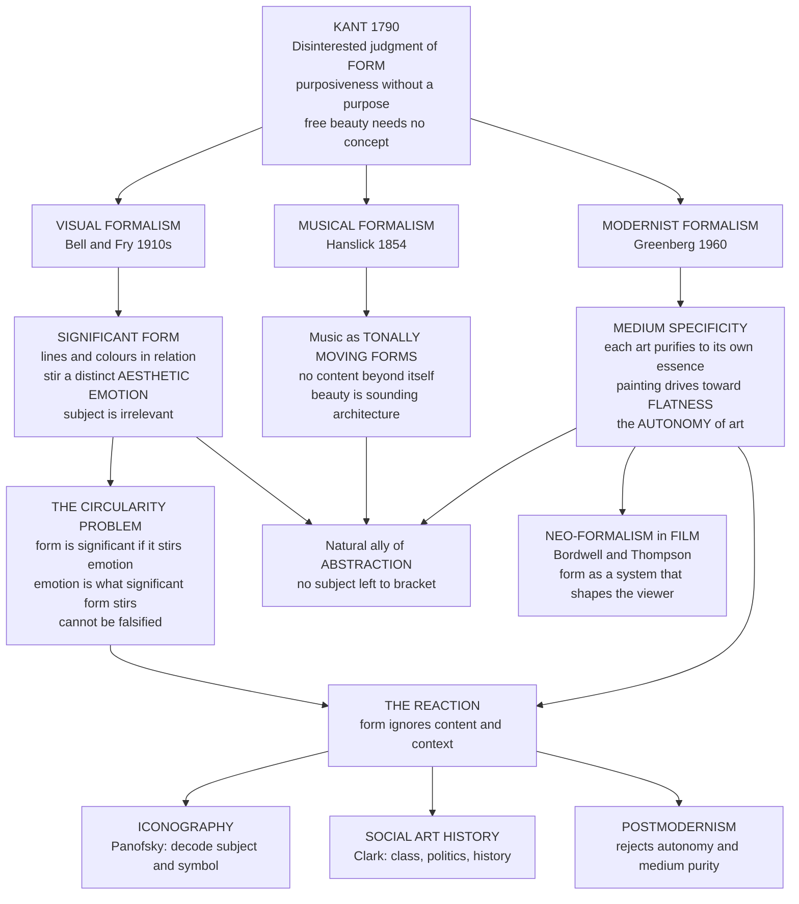

# 🔲 Formalism and Aesthetic Theory

> [!abstract] TL;DR
> **Formalism** is the theory that the artistic value of a work lies in its **form** — the arrangement of lines, colours, shapes, tones, and their relations — rather than in its subject matter, story, moral, or historical context. Its manifesto is **Clive Bell's** "**significant form**" (1914): the single quality common to all visual art, from Chartres to a Cézanne, is a form that provokes a distinctive "**aesthetic emotion**" — though the definition is famously **circular** (significant form is *the form that stirs aesthetic emotion*, and aesthetic emotion is *what significant form stirs*). Bell's ally **Roger Fry** brought the same doctrine to Post-Impressionism. Its philosophical taproot is **Kant's disinterested judgment of form** — beauty as "purposiveness without a purpose," attended for its own sake. Parallel strands run through the arts: **Eduard Hanslick** defined music's beauty as **"tonally moving forms"** with no content beyond itself, and **Clement Greenberg** turned formalism into a theory of *modernism* — each art must **purify itself to the properties unique to its own medium** (for painting, the **flatness** of the picture plane), securing the **autonomy of art**. Formalism's great strength is that it takes seriously *how a work is made* — the visual, the sensory, the compositional — and it is the natural home of **abstraction**. Its great weakness is that it brackets **content, context, meaning, politics, and history**, which is exactly why **iconography** (Panofsky), **social art history** (T. J. Clark), and **postmodernism** rebelled against it. A late, disciplined descendant survives as **neo-formalism** in film studies (David Bordwell).

---

## Intuition

**Analogy — muting the television.** Put a foreign film on the screen, turn off the sound, and delete the subtitles. You no longer know who the characters are, what they want, what era it is, or what the story means — the *content* is gone. Yet you can still tell a beautifully composed frame from an ugly one: the balance of light and dark, the rhythm of shapes across the screen, the way a diagonal line pulls your eye, the tension between a mass on the left and a void on the right. Whatever quality you are still responding to — with the plot, dialogue, and reference stripped away — is what the formalist calls **form**. Formalism is the wager that *that* residue is where art's value actually lives.

Now do the opposite experiment. Take two paintings of the Crucifixion: one a masterpiece, one a clumsy devotional print. They share the same *subject* exactly. Whatever makes one great and the other worthless cannot be the subject — it must be the arrangement. The formalist concludes: subject matter is aesthetically inert; only the disposition of line, colour, and mass carries artistic worth.

---

## How It Works

Formalism is not one claim but a family of them, sharing a single move: **subtract everything referential and keep the configuration.** The philosophical engine came from Kant, the manifesto from Bell and Fry, the theory of music from Hanslick, and the theory of modernism from Greenberg. Each answers the question "where is the value?" with "in the form" — and each draws a different border around what counts as form.

### The core mechanism

1. **Bracket the content.** Set aside what the work *depicts* or *says* — its narrative, its subject, its social message, its author's biography. These are treated as, at best, a vehicle and, at worst, a distraction.
2. **Attend to the relations.** What remains is the sensuous configuration: the intervals between shapes, the harmonies and dissonances of colour, the balance of masses, the rhythm of repetition and contrast, the handling of the medium itself.
3. **Locate value in those relations.** A work is good insofar as its formal relations are ordered, resolved, tense-yet-unified, "significant." A work is bad insofar as its form is inert, whatever its subject.
4. **Ground the response in a special faculty.** The pleasure taken in form is *disinterested* (Kant) — free of appetite, use, and even of belief in the depicted world — and it registers as a distinct "aesthetic emotion" (Bell) available to a trained, contemplative eye.

### Kant's disinterested formal judgment — the root

In the *Critique of the Power of Judgment* (1790), Kant argues that a pure judgment of beauty is **disinterested** (I do not desire, use, or morally approve the object — I contemplate it), and that its object is **form** apprehended as **"purposiveness without a purpose"**: the arrangement *looks* designed to suit our faculties though it serves no external end. He even privileges **free beauty** — an arabesque, a flower, a fugue without words — precisely because it carries *no concept* of what the thing should be. Strip away the concept and you are left judging form alone. This is the philosophical licence every later formalist draws on (see [[Beauty_and_Taste]]).

### Bell, Fry, and "significant form"

**Clive Bell** (*Art*, 1914) proposed that all works that move us aesthetically share **one** common quality — **significant form**: "lines and colours combined in a particular way, certain forms and relations of forms, that stir our aesthetic emotions." Subject is irrelevant; representation is, at best, tolerated. **Roger Fry**, organising the London Post-Impressionist exhibitions, gave the theory its critical practice, championing Cézanne's structure over Impressionist surface. The doctrine's fatal flexibility is its **circularity**: significant form is defined by the aesthetic emotion it provokes, and aesthetic emotion is defined as the response to significant form. Neither term is fixed independently, so the theory can never be falsified — it merely relabels "art I respond to" as "art with significant form."

### Hanslick's musical formalism

Even before Bell, **Eduard Hanslick** (*On the Musically Beautiful*, 1854) attacked the idea that music's value is the *feelings* it represents. Music, he argued, has **no content outside itself**: its beauty consists in **"tonally moving forms"** — sounding forms in motion — whose logic is purely musical. A theme is not *about* grief; it is a shape in pitch and time, admired as architecture is admired (see [[Musical_Form_and_Structure]]). This is formalism in its purest case, because instrumental music has no subject to bracket in the first place.

### Greenberg's modernist formalism

**Clement Greenberg** ("Modernist Painting," 1960) recast formalism as the *internal logic of modern art*. Each art, he argued, secures its **autonomy** by identifying and exploiting what is **unique to its own medium** and purging everything borrowed from the others — **medium specificity**. For painting, the irreducible essence is the **flatness** of the picture plane and the delimiting shape of the support; so modernist painting progressively renounces illusionistic depth and drives toward the flat, optical, self-referential surface (Manet → Cézanne → Cubism → Pollock → the Color Field painters). Art advances by self-criticism, refining itself down to its formal essence (see [[Texture_Pattern_and_Materiality]] on medium specificity).

### The reaction

Because formalism *defines away* content and context, three counter-movements arose to reinstate them: **iconography** (Panofsky's decoding of subject and symbol), **social art history** (T. J. Clark reading painting through class and politics), and **postmodernism** (which rejects the very autonomy and medium-purity Greenberg prized). What survives, chastened and rigorous, is **neo-formalism** in film studies (David Bordwell, Kristin Thompson), which analyses how a film's formal system organises the viewer's activity — without claiming that form is *all* there is.



The diagram's spine is the descent from Kant's disinterested contemplation of form; the branches are the three great formalisms; the loop at the bottom is the reaction that reinstated everything formalism subtracted.

---

## Key Concepts

### Secondary Level

**Form versus content.** *Content* is **what** a work is about — the Crucifixion, a bowl of apples, a love story. *Form* is **how** it is arranged — the shapes, colours, lines, rhythms, and their relations. Formalism says: value lives in the *how*, not the *what*. The muted-television thought experiment makes this vivid: strip the story and you can still judge the composition.

**Why abstraction is formalism's home turf.** A totally abstract painting — a Mondrian grid, a Rothko field, a Kandinsky burst — has **no subject to talk about**. If such works are art (and they plainly are), then whatever makes them art cannot be subject matter. It must be form. Abstraction is thus the strongest single argument *for* formalism, and it is no accident that formalist theory and abstract art rose together in the early twentieth century.

**Significant form and aesthetic emotion — the headline idea.** Clive Bell's slogan is that all visual art shares one quality: **significant form**, an arrangement of lines and colours that stirs a special **aesthetic emotion** — a contemplative thrill unlike ordinary feelings of pity, desire, or amusement. You do not need to know the story of a painting to feel it; you need only an eye trained on relations.

**The flatness idea in one sentence.** A painting is not really a window into a 3-D world — it is *literally* flat paint on a flat surface. Greenberg's modernist formalism says the honest, essential thing for painting to do is to *own* that flatness rather than fake depth, which is why modern painting grew flatter and flatter until it became pure surface.

---

### Undergraduate Level

**Bell's argument, reconstructed.** Bell wants a definition of *visual art* that (a) covers everything from Sumerian carving to Cézanne and (b) explains why we value them. His move: find the **one quality all and only artworks share**. Representation cannot be it (some great art barely represents; some accurate representation is worthless). Beauty in the everyday sense cannot be it (a beautiful butterfly is not art). What remains, he claims, is **significant form** — relations of forms that produce **aesthetic emotion**. Corollaries follow: the subject of a picture is "irrelevant"; a portrait is to be judged as an arrangement of shapes, not a likeness; and even *emotion in the depicted scene* (the grief in a Pietà) is beside the aesthetic point.

**The circularity problem in detail.** The theory has two undefined terms that lean entirely on each other:

- *Significant form* = the form that produces aesthetic emotion.
- *Aesthetic emotion* = the emotion produced by significant form.

Neither is pinned to anything outside the pair, so the theory makes **no independent prediction**: you cannot use it to decide a hard case, because "does it have significant form?" just means "do I feel the aesthetic emotion?" Bell effectively renames the *explanandum* (the works we value) as the *explanans* (why we value them). It is descriptively suggestive but explanatorily empty — a point pressed by later analytic aestheticians and central to why formalism *as a definition of art* failed (see [[What_Is_Art]]).

**Fry and the critical practice.** Where Bell theorised, **Roger Fry** *did* formalist criticism. Organising *Manet and the Post-Impressionists* (1910), he defended Cézanne, Gauguin, and Van Gogh not as accurate depicters but as builders of pictorial **structure** — plane, volume, and the architecture of the design. Fry's essays taught a generation to look at *how* a picture is organised, and his influence on the Bloomsbury circle made "significant form" the reigning avant-garde slogan in interwar Britain.

**Hanslick and the problem of musical content.** Romantic listeners said a symphony *expresses* feelings; Hanslick replied that this confuses the **subject's** associations with the **object's** properties. Music cannot represent the *concept* of hope or grief — only their possible dynamic shape (rising, falling, accelerating). Its true content is its **form**: "tonally moving forms," admired as pattern. This is the cleanest formalism because instrumental music has, arguably, no representational content to argue over. It also gave rise to the enduring "absolute music" versus "programme music" debate.

**Greenberg's dialectic of self-criticism.** Greenberg borrowed a Kantian move: each discipline uses its own characteristic methods to criticise itself, not to subvert it but to entrench it more firmly in its area of competence. For painting, the "unique and proper area of competence" turned out to be everything the medium *cannot share* with sculpture or theatre — chiefly the **flat surface, the shape of the support, and the properties of pigment**. Illusion, storytelling, sculptural modelling are borrowed effects to be purged. Modernist painting is therefore the *self-purification* of painting toward flatness and opticality — a **teleology** that let Greenberg narrate a clean line from Manet to the Color Field painters and to declare figuration a regression.

**"The medium is the message."** Marshall McLuhan's slogan (1964) is a media-theory cousin of medium specificity: the *form of a medium* — not the content it carries — is what shapes perception and society. A televised debate and a printed debate differ not in content but in the sensory logic of the medium. Where Greenberg is *normative* (each art *ought* to exploit its essence), McLuhan is *descriptive* (each medium *inevitably* reshapes experience through its form), but both relocate significance from content to form.

---

### Graduate Level

**The strengths, stated fairly.** Formalism's enduring contribution is **methodological seriousness about making**. Before Fry and Greenberg, much criticism was literary paraphrase of subject matter ("a moving depiction of maternal grief"). Formalism forced attention onto the **facts of the object**: the interval, the edge, the value-key, the brushstroke, the way a composition distributes weight. It supplied a vocabulary for the *visual and sensory* dimension that content-first criticism simply skipped. It also honoured the artist's actual labour, which is overwhelmingly the labour of *form* — decisions about placement, proportion, colour, and touch. And it is the only theory that gracefully handles **abstraction, decoration, and design**, where there is no subject to interpret.

**The critiques, in order of depth.**

- *It cannot survive its own circularity (analytic critique).* As a **definition of art**, "significant form" is empty (above). Weaker "value formalisms" — form is *one* source of value, or the *primary* aesthetically relevant one — are defensible, but they are no longer the bold thesis that content is *irrelevant*.
- *It suppresses content and reference (iconographic critique).* **Erwin Panofsky's** iconography and iconology insist that a painting's *subject and symbolism* are constitutive of its meaning: to see the *Arnolfini Portrait* as an arrangement of browns and a convex mirror, while ignoring the marriage, the dog, the single candle, and the signature, is to miss most of what the picture *is*. Content is not disposable packaging; much of a work's meaning is inseparable from *what it shows* (a point the Art vault's [[Art_and_Meaning]] develops).
- *It depoliticises and dehistoricises (social art history critique).* **T. J. Clark**, the Marxist art historian, argued that Greenbergian formalism turns paintings into timeless optical facts and thereby *erases* the class relations, urban modernity, and ideological pressures that produced them. Manet's *Olympia* is not merely a bold flat composition; it is a scandal about prostitution, class, and the gaze in Second-Empire Paris. Form abstracted from history becomes a form of *forgetting*.
- *It universalises a parochial taste (postmodern critique).* The "aesthetic emotion" and the "pure optical eye" turn out to be *culturally specific dispositions* — the connoisseurship of a particular class and moment (compare Bourdieu in [[Beauty_and_Taste]]). Postmodern practice (installation, video, appropriation, conceptual art) deliberately violates medium purity and reinstates text, context, and politics. **Rosalind Krauss's** "post-medium condition" argues that Greenberg's one-art-one-medium doctrine was a *historically bounded ideology*, not a law of art.

**Formalism and abstraction — a two-way street.** Formalism did not merely *describe* abstraction; it helped *cause* it. Once critics and artists accepted that value lies in form, the representational subject became optional, then a distraction, then something to be purged — a logic that runs straight to non-objective painting. Kandinsky's appeal to music (the least representational art) as the model for painting is formalism turned into a programme for abstraction. Greenberg's teleology then supplied abstraction with a *history* and a *destiny*. Formalism is thus both the theory of abstraction and, in Greenberg's hands, its ideology.

**Neo-formalism in film (Bordwell and Thompson).** The most rigorous living formalism sits in film studies. Drawing on **Russian Formalism** (Shklovsky's *ostranenie* / defamiliarisation; the fabula/syuzhet distinction), **David Bordwell** and **Kristin Thompson** analyse a film as a **formal system** that *cues and structures the viewer's activity* — how editing, framing, sound, and narrative organisation guide attention and construct the story in the spectator's mind. Crucially, neo-formalism is a *methodology*, not the metaphysical claim that form is all there is: it studies how form *does its work* while remaining agnostic about, or even attentive to, meaning and context. It is formalism that has learned the lessons of its critics.

**Where this leaves us.** No serious critic today is a *pure* formalist who holds subject "irrelevant," and none is a pure contextualist who thinks form is mere delivery. The mature position is **methodological pluralism**: form and content, the sensuous and the semantic, the object and its history are *distinct analytical layers*, and a strong reading integrates them. Formalism's permanent gift is the demand that you *actually look* — that before you decode a picture's politics you can say what its composition is doing. Its permanent limit is that looking is never enough.

---

## Python Demo

```python
# Operationalizing "significant form": a formalist REDUCES an artwork to a small
# set of structural quantities of its surface -- with no access to subject,
# story, or context. This demo computes four such compositional metrics on three
# synthetic "images" and plots the metric profile, then shows precisely where
# the reduction breaks down.
#
#   symmetry  : left-right mirror symmetry of the value field (Kantian balance)
#   contrast  : RMS spread of values (the "value range" formalists prize)
#   complexity: mean gradient magnitude (edge density / busyness of the design)
#   balance   : how centered the visual "mass" is (composition equilibrium)
#
# Requires: numpy and matplotlib only.

import numpy as np
import matplotlib
matplotlib.use("Agg")
import matplotlib.pyplot as plt

H = W = 160
yy, xx = np.mgrid[0:H, 0:W].astype(float)
cy, cx = (H - 1) / 2.0, (W - 1) / 2.0
rng = np.random.default_rng(1854)   # Hanslick's year, for luck

# --- Three synthetic compositions (values in [0, 1]) ------------------------
# A: symmetric concentric rings -- ordered, balanced, low complexity
r = np.sqrt((xx - cx) ** 2 + (yy - cy) ** 2)
imgA = 0.5 + 0.5 * np.cos(r / 10.0)

# B: Mondrian-like flat planes with hard black grid -- abstraction, hard edges
imgB = np.full((H, W), 0.18)
imgB[12:70, 12:88]   = 0.92          # large light block
imgB[80:150, 24:60]  = 0.55          # mid block
imgB[36:140, 100:150] = 0.78         # tall block
imgB[70:76, :]  = 0.0                # horizontal grid line
imgB[:, 92:98]  = 0.0                # vertical grid line

# C: off-center noisy blob -- asymmetric, busy, unbalanced
blob = np.exp(-(((xx - 0.30 * W) ** 2 + (yy - 0.34 * H) ** 2) / (2 * 22.0 ** 2)))
imgC = np.clip(blob + rng.normal(0, 0.16, (H, W)), 0, 1)

images = {"A: symmetric rings": imgA,
          "B: Mondrian planes": imgB,
          "C: off-center noise": imgC}

# --- Formal metrics: reduce a whole image to four numbers -------------------
def symmetry(I):
    rng_ = I.max() - I.min() + 1e-9
    return 1.0 - np.abs(I - I[:, ::-1]).mean() / rng_      # 1 = perfect mirror

def contrast(I):
    return I.std()                                          # RMS value spread

def complexity(I):
    gy, gx = np.gradient(I)
    return np.sqrt(gx ** 2 + gy ** 2).mean()               # mean edge strength

def balance(I):
    total = I.sum() + 1e-9
    my = (yy * I).sum() / total
    mx = (xx * I).sum() / total
    d = np.hypot(mx - cx, my - cy)
    return 1.0 - d / np.hypot(cx, cy)                       # 1 = mass centered

METRICS = ["symmetry", "contrast", "complexity", "balance"]
FUNCS   = [symmetry, contrast, complexity, balance]

raw = {name: np.array([f(I) for f in FUNCS]) for name, I in images.items()}

# Normalize each metric across the three images -> comparable [0, 1] profile
mat = np.vstack([raw[name] for name in images])            # shape (3, 4)
lo, hi = mat.min(axis=0), mat.max(axis=0)
norm = (mat - lo) / (hi - lo + 1e-9)

# --- Report -----------------------------------------------------------------
print("=== Formalist reduction: each artwork -> four structural numbers ===\n")
hdr = f"{'image':<22}" + "".join(f"{m:>12}" for m in METRICS)
print(hdr); print("-" * len(hdr))
for i, name in enumerate(images):
    print(f"{name:<22}" + "".join(f"{v:>12.3f}" for v in raw[name]))

print("\nWhat a formalist SEES (and all they see):")
print("  A scores high on symmetry and balance, low on complexity -- 'resolved,")
print("    harmonious form'. B is high-contrast with hard edges -- 'strong design'.")
print("    C is asymmetric, busy, off-balance -- 'unresolved composition'.")
print("\nWhat the formalist reduction CANNOT see:")
print("  - B would score identically whether it is a masterpiece or a forgery.")
print("  - Swap subjects behind identical form: a flag, a wound, an advert all")
print("    reduce to the same numbers. Iconography, context, politics vanish.")
print("  - 'Significant form' stays circular: nothing here tells us WHY these")
print("    relations should move us -- only THAT they can be measured.")

# --- Plot: the images and their metric profiles -----------------------------
fig, axes = plt.subplots(2, 3, figsize=(14, 8))
for ax, (name, I) in zip(axes[0], images.items()):
    ax.imshow(I, cmap="gray", vmin=0, vmax=1)
    ax.set_title(name, fontsize=10)
    ax.set_xticks([]); ax.set_yticks([])

colors = ["#2563eb", "#059669", "#dc2626"]
x = np.arange(len(METRICS)); bw = 0.26
ax_bar = axes[1, 0]
for i, name in enumerate(images):
    ax_bar.bar(x + (i - 1) * bw, norm[i], width=bw, color=colors[i], label=name)
ax_bar.set_xticks(x); ax_bar.set_xticklabels(METRICS, fontsize=8, rotation=15)
ax_bar.set_ylabel("normalized score"); ax_bar.set_ylim(0, 1.05)
ax_bar.set_title("Metric profile (normalized across images)", fontsize=9)
ax_bar.legend(fontsize=7); ax_bar.grid(axis="y", alpha=0.3)

# Radar of the same profiles
ang = np.linspace(0, 2 * np.pi, len(METRICS), endpoint=False).tolist(); ang += ang[:1]
ax_r = plt.subplot(2, 3, 5, projection="polar")
for i, name in enumerate(images):
    vals = norm[i].tolist() + [norm[i][0]]
    ax_r.plot(ang, vals, color=colors[i], lw=2, label=name)
    ax_r.fill(ang, vals, color=colors[i], alpha=0.08)
ax_r.set_xticks(ang[:-1]); ax_r.set_xticklabels(METRICS, fontsize=7)
ax_r.set_yticks([0.5, 1.0]); ax_r.set_ylim(0, 1)
ax_r.set_title("Formal 'fingerprint'", fontsize=9, pad=14)

# The limit, written on the canvas
ax_txt = axes[1, 2]; ax_txt.axis("off")
ax_txt.text(0.0, 0.95,
            "The limit of formalism:\n\n"
            "These 4 numbers capture HOW a work\n"
            "is arranged -- symmetry, contrast,\n"
            "edge density, balance.\n\n"
            "They are blind to WHAT it depicts,\n"
            "WHEN and WHY it was made, and\n"
            "WHOM it serves.\n\n"
            "Two images with identical profiles\n"
            "can differ totally in meaning.\n"
            "Form is measurable; significance is not\n"
            "reducible to the measurement.",
            fontsize=9, va="top", family="monospace")

fig.suptitle("Formalism operationalized: reducing an artwork to significant FORM",
             fontsize=13, fontweight="bold")
plt.tight_layout()
plt.savefig("formalism_metric_profile.png", dpi=140, bbox_inches="tight")
print("\nFigure saved: formalism_metric_profile.png")
```

**Reading the output.** The top row shows three synthetic "compositions"; the bottom row reduces each to a four-number **formal fingerprint** (symmetry, contrast, complexity, balance) and plots it as a bar chart and radar. This is formalism made literal: a whole picture collapsed into structural quantities of its surface, with *no* access to subject or context. The demo is deliberately double-edged. It shows that formal properties really *are* measurable and really *do* discriminate compositions (A reads as ordered and balanced, C as busy and off-balance) — vindicating the formalist insight that *how a work is arranged* is a genuine, analysable object. But it also stages the critique: the same profile would score a masterpiece and its forgery identically, and swapping the *subject* behind an identical arrangement changes the numbers not at all. The measurement captures form and is *blind to significance* — which is exactly the gap Bell's circular "aesthetic emotion" tried, and failed, to close.

---

## Real-World Applications

> **Example 1 — Museum wall texts and the "pure eye."** The modernist hang — a single canvas isolated on a white wall, minimal label, no narrative — is *built* formalism. The white cube (Brian O'Doherty's term) removes context precisely so the viewer attends to the object's form. When MoMA hung Abstract Expressionism this way in the 1950s and 60s, it institutionalised Greenberg's optical, autonomous painting. Contemporary curating has largely rebelled, adding context, politics, and provenance back onto the wall — the museum itself re-enacting the formalism-versus-context debate.

> **Example 2 — Design, typography, and UX.** Graphic design, product design, and interface design are applied formalism: grids, balance, contrast, visual hierarchy, and negative space are taught and judged as *formal* relations largely independent of the content they carry. "Good composition" for a poster or a dashboard is a direct descendant of Fry's structural analysis — which is why the same layout principles apply whether the poster advertises a concert or a protest.

> **Example 3 — Film form and neo-formalist analysis.** Bordwell and Thompson's *Film Art* — the standard film textbook worldwide — teaches students to analyse mise-en-scène, cinematography, editing, and sound as a **formal system** that shapes the viewer's experience, before and apart from theme or ideology. Shot-by-shot analysis of how a sequence cues attention (a Hitchcock suspense build, a Wes Anderson symmetry) is neo-formalism as a practical, teachable method.

> **Example 4 — Computational aesthetics and generative art.** Algorithms that score or generate images by symmetry, colour harmony, complexity, edge density, and rule-of-thirds balance (in photo-culling apps, auto-cropping, and evaluation of GAN outputs) *literally implement* a formalist reduction — the Python demo above is a toy version. Their well-known failure mode is exactly the formalist blind spot: they can rank a well-composed but meaningless image above a rough, historically momentous one, because they measure form and cannot read significance.

> **Example 5 — Music theory and "absolute music."** Hanslick's formalism underwrites the analytical tradition (Schenkerian analysis, set theory) that treats a piece as **structure in pitch and time** rather than as expressed emotion — reducing a movement to its formal relations (see [[Musical_Form_and_Structure]]). The programmatic counter-tradition (Liszt, Strauss) insists music *does* narrate, keeping the nineteenth-century formalism debate alive in the concert hall.

---

## Common Pitfalls

- **Confusing the strong thesis with the weak one.** *Strong formalism* — subject and context are **irrelevant** — is what Bell and Greenberg asserted and what the critics demolished. *Weak (value) formalism* — form is **one** important, often primary, locus of aesthetic value — is defensible and widely held. Attacking the strong thesis to dismiss all attention to form throws out the defensible baby with the indefensible bathwater.

- **Taking "significant form" as an explanation.** Because the term is circular (form is significant if it stirs aesthetic emotion; aesthetic emotion is what significant form stirs), invoking it *explains nothing* — it relabels the works you already value. Use it descriptively if at all, never as a criterion that could settle a hard case.

- **Reading Kantian disinterest as "form is all that matters."** Kant grounds a *pure judgment of taste* in form, but he does not say art has no content or that content is worthless — the sublime, the morality of the beautiful, and dependent beauty all reintroduce more than form. Formalists borrowed Kant's *disinterest* and quietly dropped his qualifications.

- **Mistaking Greenberg's teleology for a law of art.** "Painting inevitably purifies toward flatness" is a *narrative*, not a natural law — it fits a slice of 1860–1960 Euro-American painting and misreads installation, video, and conceptual art. Applying medium specificity as a universal standard (as Greenberg did in dismissing minimalism and mixed media) is the classic overreach (see [[Texture_Pattern_and_Materiality]]).

- **Believing "form vs content" is a clean split.** In strong works, form and content are *fused*: the flatness of a Matisse or the fractured planes of Cubism *are* meanings, not neutral vehicles. "Form" and "content" are analytical layers we impose; treating them as physically separable is itself a formalist assumption to be examined, not assumed.

- **Confusing formalism with "ignoring emotion."** Formalists relocate emotion, they do not deny it. Bell's *aesthetic emotion* and Hanslick's admiration for musical shape are intense responses — just responses to *form* rather than to depicted subject or expressed feeling. The mistake is to read formalism as cold analysis rather than as a theory about *where* aesthetic feeling comes from.

---

## Related Concepts

- [[Beauty_and_Taste]] — supplies formalism's philosophical root: Kant's **disinterested** judgment of **form** as "purposiveness without a purpose," and the debate over whether the "pure eye" formalists prize is universal or (per Bourdieu) a class disposition.
- [[What_Is_Art]] — treats formalism as one of the classic **definitions of art** ("art is significant form") and details the **circularity** refutation that sank it as a definition; this note extends that entry from definition into critical theory.
- [[Art_and_Meaning]] — the counterweight: Bell's "significant form" and Hanslick's "tonally moving forms" appear there as theories of meaning-as-internal-structure, against which iconographic and referential accounts of meaning push back.
- [[Texture_Pattern_and_Materiality]] — develops **Greenberg's medium specificity**, "truth to materials," and the flatness of painting, plus Krauss's post-medium critique — the visual-elements sibling to this note's theoretical treatment.
- [[Aesthetics_and_Art_Overview]] — situates formalism within the map of critical theories (formalism, iconography, semiotics, institutional, Marxist), the panorama this note zooms into.
- [[The_Sublime_and_Aesthetic_Emotion]] — analyses "aesthetic emotion" as a psychological category, the very response Bell made the keystone (and the undefined term) of significant form.
- [[Renaissance_and_Baroque]] — home of **Wölfflin's** five formal polarities (linear vs painterly, closed vs open form), the most influential *formalist* model in art history proper.
- [[Musical_Form_and_Structure]] — the musical instance of formalism: analysing a piece as architecture in pitch and time, the tradition Hanslick's "tonally moving forms" underwrites.
- [[New_Criticism_and_Close_Reading]] — the **literary** cousin: the poem as autonomous "verbal icon," value in form over author intent or reader emotion — significant form transposed to the text.
- [[Color_Theory]] — colour is one of the raw formal elements ("lines and colours combined in a particular way") whose relations formalist analysis attends to.

---

## Review Questions

### Secondary

1. Explain the difference between the **form** and the **content** of a painting, using the "muted television" idea. Why does the existence of purely **abstract** art (a Mondrian grid) make it hard to say that a work's value is its subject matter?
2. What did Clive Bell mean by "**significant form**," and what is the "**aesthetic emotion**" it is supposed to produce? Give one everyday reason a critic might find this idea attractive and one reason it might be too vague to be useful.
3. Greenberg said modern painting should embrace its **flatness**. In plain terms, what is "flatness," and why might a painter think it is more *honest* than painting a convincing illusion of depth?

### Undergraduate

1. Reconstruct the **circularity objection** to Bell's "significant form" as a two-line definition, and explain why it means the theory can never settle a disputed case. Does the objection also sink the *weaker* claim that form is *one* important source of artistic value? Why or why not?
2. Compare **Hanslick's** musical formalism ("tonally moving forms") with **Bell's** visual formalism. Why is instrumental music arguably the *purest* case for formalism, and how does that strength become a liability when a formalist tries to explain a Crucifixion painting or a protest poster?
3. State **Greenberg's** doctrine of **medium specificity** and his claim that painting advances by self-criticism toward flatness. Then present **T. J. Clark's** or **Rosalind Krauss's** objection. Is Greenberg describing a *law* of art, an *ideology* of one period, or a *value* one may endorse or reject? Defend your reading.

### Graduate

1. "Formalism's permanent gift is that it makes you actually look; its permanent limit is that looking is never enough." Using one specific artwork, show both a *formal* reading (composition, colour, handling, medium) and an *iconographic or social-historical* reading (Panofsky, Clark), and argue whether the two are **rivals**, **complements**, or **distinct analytical layers**. What does your case imply about the "form versus content" distinction itself?
2. The Python demo reduces an image to four measurable formal metrics and notes that a masterpiece and its forgery would score identically. Formulate this as a philosophical objection to *strong* formalism, then have a defender of *weak* formalism reply. Could **any** enrichment of the metric set (adding more formal features) close the gap between measurable form and artistic significance, or is the gap **in principle** unbridgeable? Argue precisely.
3. **Neo-formalism** in film (Bordwell) claims to keep formalist rigour while dropping formalist metaphysics — studying how form *organises the viewer* without asserting that form is *all there is*. Is this a coherent, stable position, or does close attention to how form "cues meaning" inevitably smuggle content and context back in? Relate your answer to the Russian Formalist concept of **defamiliarization** and to the fabula/syuzhet distinction.

---

## Sources

- [Clive Bell, *Art* (1914) — the "significant form" and "aesthetic emotion" thesis](https://archive.org/details/artbell00belluoft)
- [Clement Greenberg, "Modernist Painting" (1960), in *The Collected Essays and Criticism, Vol. 4*, University of Chicago Press](https://voices.uchicago.edu/wittgenstein/files/2007/10/Greenbergmodpaint.pdf)
- [Eduard Hanslick, *On the Musically Beautiful* (1854), trans. Geoffrey Payzant (Hackett)](https://www.hackettpublishing.com/on-the-musically-beautiful)
- [Stanford Encyclopedia of Philosophy, "The Concept of the Aesthetic" (formalism and aesthetic properties)](https://plato.stanford.edu/entries/aesthetic-concept/)
- [Stanford Encyclopedia of Philosophy, "Aesthetic Formalism" / Nick Zangwill's account of moderate formalism](https://plato.stanford.edu/entries/formalism-aesthetics/)
- [David Bordwell & Kristin Thompson, *Film Art: An Introduction* — the neo-formalist method](https://www.mheducation.com/highered/product/film-art-introduction-bordwell-thompson/M9781259534959.html)
- [Rosalind Krauss, *A Voyage on the North Sea: Art in the Age of the Post-Medium Condition* (1999), Thames & Hudson](https://www.worldcat.org/title/voyage-on-the-north-sea-art-in-the-age-of-the-post-medium-condition/oclc/41641531)

---

#aesthetics #formalism #significant-form #greenberg #aesthetic-theory
