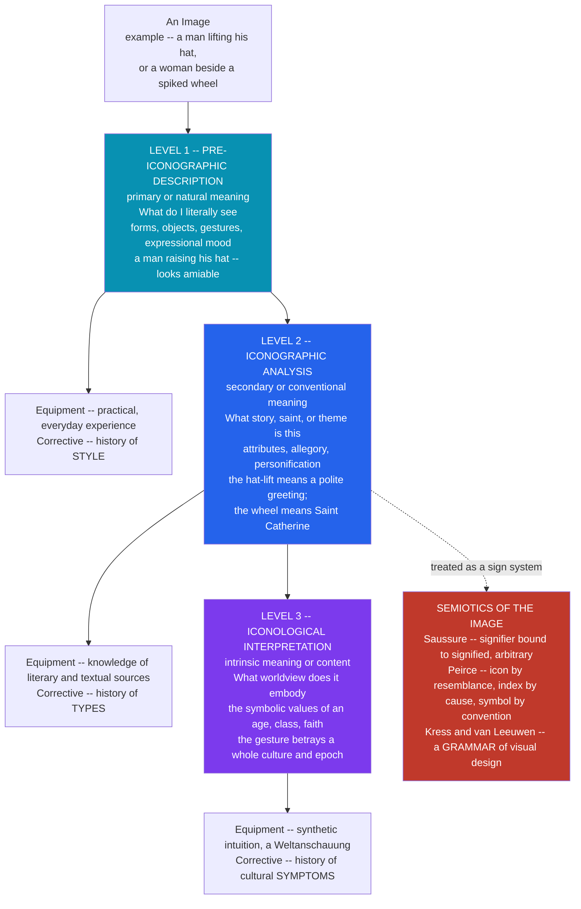

# 🖼️ Iconography and Semiotics of Art

> [!abstract] TL;DR
> **Iconography** is the branch of art history that reads the *subject matter* of an image — identifying, describing, and interpreting its figures, stories, and symbols (what is depicted and what it means), as distinct from **formalism**, which reads its lines, colors, and composition (how it is arranged). Erwin **Panofsky** organized the reading into three ascending levels: **pre-iconographic description** (the natural, factual meaning you see with everyday eyes), **iconographic analysis** (the conventional subject decoded through textual sources — a woman with a wheel *is* St Catherine), and **iconological interpretation** (the intrinsic cultural meaning, the "symbolic values" of an age). **Semiotics** generalizes this: it treats the image as a *sign system*, applying Saussure's signifier/signified and Peirce's icon/index/symbol, and — in the **social semiotics** of Kress and van Leeuwen — gives visual communication its own "grammar." Together they turn the museum into a language you can learn to read.

---

## Intuition

**Analogy — the painting as a page written in a forgotten alphabet.** Imagine you are handed a 500-year-old letter written in a script you cannot read. At first you see only *marks* — loops, dots, strokes. You can describe them ("a curved line here, a cluster of dots there") and even sense a mood (the hand looks hurried, or careful). But you cannot yet *read* it. Then someone gives you the alphabet: this glyph is the letter *A*, that one is *M*. Now the marks resolve into words, the words into sentences, the sentences into a message. Finally, knowing the message, you ask the deepest question: *what kind of person, in what kind of world, would write this, and why?*

A painting works the same way. Confronted with an old master, your naked eye sees an old man with a key, a young woman beside a spiked wheel, a candle guttering next to a skull. That is the *marks* stage. Iconography hands you the **alphabet of symbols**: the key means St Peter (to whom Christ gave the keys of heaven), the wheel means St Catherine (broken on the wheel), the skull-and-guttering-candle means *memento mori* — "remember you must die." Suddenly the picture *reads*. And the final, iconological question — what worldview made these symbols meaningful and worth painting — is the historian's equivalent of asking what kind of civilization wrote the letter. Iconography is literacy for images; semiotics is the general theory of how those images come to *mean* at all.

---

## How It Works

### Iconography versus iconology — the "what" and the "why"

The words are often blurred, but Panofsky drew a working distinction. **Iconography** (Greek *eikon* = image, *graphein* = to write/describe) is the *descriptive* and *classificatory* work: cataloguing the motifs, identifying the saint by her attribute, naming the story. **Iconology** is the *interpretive* synthesis: asking what the whole configuration reveals about the mind of an artist, a patron, a period. Iconography assembles the evidence; iconology renders the verdict. Panofsky compared iconography to *ethnography* — collecting and classifying — and iconology to *ethnology* — interpreting the collected data into a picture of a culture.

### Panofsky's three strata of meaning

In the introduction to *Studies in Iconology* (1939), Panofsky laid out a three-level method. Each level asks a harder question, requires different equipment, and is kept honest by a different corrective discipline. His famous everyday example is **a man raising his hat in the street**:

1. **Pre-iconographic description — primary or natural meaning.** You identify pure forms as representations of natural objects (a man, a hat) and their *expressional* qualities (the gesture looks friendly, the mood is amiable). You need only **practical experience** — familiarity with objects and events. But this "naive" seeing is not culture-free: a medieval Australian aboriginal would not recognize a hat, and a Botticelli mood can be misread. The corrective is the **history of style** (how objects and expressions were rendered in different eras).
2. **Iconographic analysis — secondary or conventional meaning.** You realize the hat-raising *means* a polite greeting — a convention. In art this is where a woman-with-a-wheel becomes *St Catherine*, three men at a table become *the Last Supper*, a blindfolded figure with scales becomes *Justice*. This requires **knowledge of literary and textual sources** (scripture, hagiography, classical texts, emblem books). The corrective is the **history of types** (how given themes were conventionally represented).
3. **Iconological interpretation — intrinsic meaning or content.** The greeting-gesture, fully read, betrays the man's whole personality — his period, nationality, class, education, "the manner in which... he does react to the world." In art this is the **symbolic value**: what Leonardo's *Last Supper* reveals of the Italian High Renaissance's harmonizing, humanist temper. This demands **synthetic intuition** shaped by a familiarity with the "essential tendencies of the human mind" — a *Weltanschauung*. The corrective is the **history of cultural symptoms or symbols** — checking one's intuition against how symbolic values were expressed across a whole culture.

### The dictionary of symbols

The engine of level 2 is a shared, learnable **lexicon** built over centuries: the *attributes* of saints (Peter's keys, Catherine's wheel, Lawrence's gridiron, Sebastian's arrows, Barbara's tower), **personifications** (Justice, Fortune, the Virtues and Vices as female figures with props), **allegory** (an abstract idea told as a scene), and moralizing genres such as **memento mori** and **vanitas** (skulls, hourglasses, extinguished candles, soap bubbles, wilting flowers — all preaching the brevity of life). Reference works such as Cesare Ripa's *Iconologia* (1593) codified these; modern scholars use indexes like *Iconclass*. Reading a painting is, quite literally, dictionary lookup — plus the judgment to know which sense applies.

### Aby Warburg and the Warburg school

Before Panofsky systematized it, **Aby Warburg** (1866–1929) pioneered a wilder, more anthropological iconology. He tracked the *Nachleben der Antike* — the "afterlife of antiquity," how classical images and emotive gestural formulas (his *Pathosformeln*, "pathos formulas") survived, migrated, and re-erupted across centuries and media. His unfinished *Bilderatlas Mnemosyne* juxtaposed photographs — Renaissance paintings beside ancient coins beside contemporary advertisements — to make image-migration visible. The **Warburg Institute** (his library, moved from Hamburg to London in 1933 to escape the Nazis) became the home of iconology, training Panofsky, Fritz Saxl, and Ernst Gombrich.

### From iconography to semiotics

**Semiotics** is the general science of signs, and it subsumes iconography as a special case. Two founding vocabularies apply directly to images:

- **Saussure's dyad.** A sign is a **signifier** (the perceptible form — a painted lily) bound to a **signified** (the concept — purity, the Virgin). The bond is *arbitrary* and *conventional*: nothing about a lily *necessitates* "purity"; a culture assigns it. Meaning arises from **difference** within a system (a lily is not a rose is not a thistle).
- **Peirce's triad of sign-types.** An **icon** signifies by *resemblance* (a portrait looks like the sitter); an **index** signifies by *physical/causal connection* (smoke indexes fire; a pointing finger; a cast shadow); a **symbol** signifies by *pure convention* (the dove for the Holy Spirit, the color red for danger). A single painting braids all three: it is *iconic* (it resembles a scene), *indexical* (brushwork indexes the artist's hand), and *symbolic* (its attributes encode meanings by convention).

**Social semiotics** (Gunther **Kress** and Theo **van Leeuwen**, *Reading Images: The Grammar of Visual Design*, 1996) pushed further: images have a **grammar**. Composition encodes meaning through systematic choices — *vectors* between figures create narrative "processes"; the horizontal axis distributes *Given* (left, familiar) versus *New* (right, contested); the vertical axis distributes *Ideal* (top) versus *Real* (bottom); a low camera angle confers power, a frontal angle confers involvement, close framing confers intimacy. Meaning is not just *what* is depicted (iconography) but *how* it is arranged to position the viewer.



The diagram encodes the method's logic: reading climbs from *what the eye sees* (level 1) through *what the culture has agreed it means* (level 2) to *what worldview produced that agreement* (level 3) — and semiotics is the theoretical lens that reframes the whole ascent as the decoding of a sign system.

---

## Key Concepts

### Secondary Level

**Attributes — the saint's name tag.** Most viewers cannot tell one bearded man in a robe from another. Medieval and Renaissance art solved this with **attributes**: a fixed object that identifies the figure. Keys = St Peter (Christ's "keys of the kingdom"). A spiked wheel = St Catherine of Alexandria (the wheel that was to torture her). A gridiron = St Lawrence (roasted on one). Arrows piercing the body = St Sebastian. A tower = St Barbara. Once you know a dozen attributes, a wall of "identical" saints becomes a cast of named characters — the single most empowering trick in gallery literacy.

**Memento mori and vanitas — pictures that preach.** Some symbols carry not identity but a *message*. A **memento mori** ("remember you must die") inserts a skull, an hourglass, or a guttering candle to remind the viewer of mortality. A **vanitas** still life piles up worldly goods — books, coins, instruments, flowers, bubbles — precisely to show their emptiness ("vanity of vanities"): the wilting bloom and rising bubble say all earthly things pass. These are moral instructions written in objects.

**Content versus form.** Iconography asks *what* a picture shows and means (its subject, story, symbols). **Formalism** asks *how* it is made — the arrangement of line, color, mass, and space, independent of subject. A formalist and an iconographer can stand before the same Raphael and have almost non-overlapping conversations: one about the pyramid composition and warm palette, the other about which Madonna type and which theological program. Neither reading is complete alone.

### Undergraduate Level

**Why level 1 is not innocent.** Panofsky's subtlest point is that even "just describing what you see" is culturally loaded. To recognize the painted shape as *a hat*, or the crossed lines as *a table*, or a particular contortion of the body as *anguish*, you already draw on a history of how such things have been depicted — the **history of style**. A viewer from a culture without hats, or unfamiliar with a period's conventions for showing grief, will misread level 1. There is no theory-free seeing; the "naive" eye is already trained.

**The role — and tyranny — of the text.** Level 2 is powered by *textual sources*: you cannot know that three men and a table is the Last Supper without the Gospel, or that a winged youth with a bow is Cupid without Ovid. This makes iconography powerfully precise for *literary* cultures with recoverable sources. But it also biases the method toward pictures that *illustrate texts* and toward *reading* rather than *looking* — the central line of critique (below). Emblem books (image + motto + verse, like Alciato's *Emblemata*, 1531) show how tightly text and image were bound in the period.

**Saussure and the arbitrariness of the visual sign.** Applying Saussure to art yields a liberating insight: symbolic meaning is *conventional*, not natural. A lily means purity in Christian Europe, but flowers carry different codes elsewhere; the color white signifies weddings in one culture and funerals in another. Because the signifier-signified bond is arbitrary and system-relative, *iconographic literacy is culturally specific* — you must learn each tradition's dictionary. Meaning lives in the difference between signs within a system, not in any sign alone.

**Peirce's three sign-modes in a single canvas.** Peirce's icon/index/symbol trichotomy is more flexible than Saussure's dyad for images, because a picture *resembles* (iconic), *records the trace of its making* (indexical — the brushstroke, and in photography the light that physically struck the film), and *encodes conventions* (symbolic). Photography's special force comes from its **indexicality**: the photograph is caused by its referent, which lends it the "this really happened" authority that painting lacks and that advertising and propaganda exploit.

### Graduate Level

**Iconology as cultural symptom — the ambition and the risk.** Panofsky's level 3 treats the artwork as a *symptom* of a whole culture's mentality — its *Weltanschauung* — recoverable by "synthetic intuition." At its best (Panofsky's own essays on perspective as "symbolic form," or on Netherlandish "disguised symbolism," where ordinary domestic objects secretly carry sacred meaning) this yields dazzling cultural readings. At its worst it licenses the historian to project a pre-formed theory of the age onto the image and then "discover" it there — a hermeneutic circle with no external check. Gombrich's critique (*Symbolic Images*, 1972) warned that iconology risks finding profound programs where a patron may have intended mere decoration, and demanded evidence that a given symbolic reading was *available and intended* in its own time (the "principle of the primacy of the genre" and of documented programs).

**Warburg's *Pathosformel* and the mnemonic image.** Warburg's key concept, the **pathos formula**, is a charged gestural schema (a maenad's backward-flung head, a nymph's fluttering drapery) that encodes intense emotion and *survives* by migrating across works and centuries — a kind of cultural DNA of expression. His *Mnemosyne* atlas proposed that images function as a collective, trans-historical **memory** (Mnemosyne = memory), and that art history should study these energized formulas as they resurface. This anticipates modern concerns with visual "memes," remediation, and the Aby-Warburg-flavored "iconology of the interval" (the meaning that lives *between* juxtaposed images).

**Barthes and the myth of the image.** Roland Barthes fused semiotics with ideology critique. In *Rhetoric of the Image* (1964), analyzing a Panzani pasta advertisement, he distinguished the **denoted** message (the literal photograph of groceries) from the **connoted** message (a web of cultural signifieds — "Italianicity," freshness, domestic abundance) and identified a **linguistic message** (the caption) that *anchors* the floating meanings of the image. In *Mythologies* he argued that connotation is where **ideology** ("myth") hides: an image naturalizes a cultural value, making the constructed look given. This is iconology radicalized — the "symbolic values of an age" reread as the operations of power.

**Social semiotics and the grammar of visual design.** Kress and van Leeuwen systematized image-reading into three simultaneous "metafunctions" borrowed from Halliday's linguistics: the **representational** (what participants and processes are depicted — narrative vectors vs. conceptual/classificatory structures), the **interactive** (how the image positions the viewer — gaze as "demand" vs. "offer," social distance via framing, power via angle), and the **compositional** (information value via Given/New and Ideal/Real zones, salience, and framing). This gives a *replicable analytic vocabulary* for exactly the visual/formal dimension that classical iconography neglected — reuniting content and form under a semiotic banner, and extending the method from old masters to advertising, textbooks, web pages, and film.

---

## Python Demo

We build a tiny **iconography engine**: a lookup dictionary mapping each *subject* (saint, allegory, or moral theme) to its set of conventional *attributes*. We then invert it into an attribute → subjects index — exactly the "reader's dictionary" a restorer uses — and write a `decode()` function that, given the symbols "detected" in a panel, ranks the likely subjects by overlap (this is Panofsky's level 2 made mechanical). Finally we draw the symbol → meaning lexicon as a **bipartite graph** (signifiers on the left, signifieds on the right), highlighting the path from the three detected symbols to the subjects they resolve to. The picture makes the thesis literal: **iconography decodes images the way a dictionary decodes words.**

```python
# Iconography as a lookup dictionary: decode a painting from its symbols.
# numpy + matplotlib only (no networkx).
import numpy as np
import matplotlib.pyplot as plt

# --- The "dictionary" of iconographic attributes -------------------------------
# Each SUBJECT (saint, allegory, or moral theme) is identified by a SET of
# ATTRIBUTES that conventionally accompany it in Christian and classical art.
ICONOGRAPHY = {
    "St Peter":              {"keys", "book", "inverted cross"},
    "St Catherine":          {"wheel", "sword", "palm"},
    "St Sebastian":          {"arrows", "column"},
    "St Lawrence":           {"gridiron", "palm"},
    "St Barbara":            {"tower", "palm", "chalice"},
    "Virgin / Purity":       {"lily", "blue robe", "crescent moon"},
    "Memento Mori":          {"skull", "hourglass", "guttering candle"},
    "Vanitas":               {"skull", "soap bubbles", "wilting flower", "hourglass"},
}

# --- Invert into an attribute -> subjects index (the reader's lookup table) -----
attr_index = {}
for subject, attrs in ICONOGRAPHY.items():
    for a in attrs:
        attr_index.setdefault(a, set()).add(subject)

def decode(detected):
    """Panofsky Level 2: match motifs in an image to conventional subjects.
    Confidence = shared attributes / the subject's full signature set."""
    detected = set(detected)
    ranked = []
    for subject, attrs in ICONOGRAPHY.items():
        hits = detected & attrs
        if hits:
            conf = len(hits) / len(attrs)
            ranked.append((subject, conf, hits))
    return sorted(ranked, key=lambda t: (-t[1], -len(t[2])))

# --- A panel in which the restorer has identified three objects ----------------
detected_symbols = {"keys", "book", "skull"}
print(f"Symbols detected in the panel: {sorted(detected_symbols)}\n")
print("Iconographic reading (best matches first):")
for subject, conf, hits in decode(detected_symbols):
    print(f"  {subject:16s} confidence={conf:0.2f}  via {sorted(hits)}")

inferred = {s for s, _, _ in decode(detected_symbols)}   # subjects the image resolves to

# --- Visualize the symbol -> meaning lexicon as a BIPARTITE GRAPH ---------------
subjects = list(ICONOGRAPHY.keys())
symbols  = sorted(attr_index.keys())
y_sym = np.linspace(0, 1, len(symbols))
y_sub = np.linspace(0, 1, len(subjects))
x_sym, x_sub = 0.0, 1.0

fig, ax = plt.subplots(figsize=(11, 8))

# edges: each attribute -> every subject it can signify; red if on the decoded path
for j, subject in enumerate(subjects):
    lit_sub = subject in inferred
    for a in ICONOGRAPHY[subject]:
        i = symbols.index(a)
        lit = (a in detected_symbols) and lit_sub
        ax.plot([x_sym, x_sub], [y_sym[i], y_sub[j]],
                color=("#c0392b" if lit else "#cfcfcf"),
                lw=(2.4 if lit else 0.8), alpha=(0.95 if lit else 0.55), zorder=1)

# left column: symbols (signifiers)
for i, a in enumerate(symbols):
    lit = a in detected_symbols
    ax.scatter([x_sym], [y_sym[i]], s=170, zorder=3,
               color=("#c0392b" if lit else "#2563eb"))
    ax.text(x_sym - 0.03, y_sym[i], a, ha="right", va="center",
            fontsize=9, fontweight=("bold" if lit else "normal"))

# right column: subjects (signifieds)
for j, s in enumerate(subjects):
    lit = s in inferred
    ax.scatter([x_sub], [y_sub[j]], s=210, zorder=3,
               color=("#7c3aed" if lit else "#0891b2"))
    ax.text(x_sub + 0.03, y_sub[j], s, ha="left", va="center",
            fontsize=9, fontweight=("bold" if lit else "normal"))

ax.text(x_sym, 1.07, "SIGNIFIERS\n(visible symbols)", ha="center",
        fontsize=10, fontweight="bold")
ax.text(x_sub, 1.07, "SIGNIFIEDS\n(subjects / meanings)", ha="center",
        fontsize=10, fontweight="bold")
ax.set_title("Iconography as a dictionary: reading a panel through its symbols\n"
             "(red path = the three detected symbols and the subjects they decode to)",
             fontsize=11, fontweight="bold")
ax.set_xlim(-0.42, 1.42); ax.set_ylim(-0.08, 1.15); ax.axis("off")
plt.tight_layout()
plt.savefig("iconography_bipartite.png", dpi=120, bbox_inches="tight")
plt.show()
```

**Expected console output:**

```
Symbols detected in the panel: ['book', 'keys', 'skull']

Iconographic reading (best matches first):
  St Peter         confidence=0.67  via ['book', 'keys']
  Memento Mori     confidence=0.33  via ['skull']
  Vanitas          confidence=0.25  via ['skull']
```

The engine decodes the panel as **St Peter** (the keys and book are two-thirds of his signature) *inflected by a memento-mori/vanitas theme* (the lone skull) — a perfectly plausible "Penitent St Peter with a skull," a real Counter-Reformation subject (Ribera, El Greco). Notice what the toy makes visible about the *limits* of the method: the skull alone is **ambiguous** — it maps to both *Memento Mori* and *Vanitas*, and only additional attributes (an hourglass? soap bubbles?) or the surrounding context would disambiguate. That ambiguity is not a bug in the code; it is the real epistemic condition of iconographic reading, and the reason level-2 analysis always needs level-1 context and level-3 judgment to close the case.

---

## Real-World Applications

**Museum cataloguing and digital art history.** Every serious collection tags its holdings by subject using controlled vocabularies — most importantly **Iconclass**, a hierarchical classification of tens of thousands of iconographic notations used by the Rijksmuseum, the Warburg, and countless databases. This is Panofsky's level 2 turned into searchable metadata: it lets a scholar retrieve "all depictions of Judith beheading Holofernes" across centuries. Machine-learning systems for *automatic iconographic classification* now train on these labels, essentially learning the `decode()` function from data.

**Advertising and brand semiotics.** Barthes's Panzani analysis is the founding gesture of an entire industry. Commercial **semioticians** are hired to audit how a package or campaign signifies — which colors, typefaces, and visual codes connote "premium," "natural," "trustworthy," or "rebellious" in a given market — and to catch unintended connotations before launch (a color that reads as luxury in one country reading as mourning in another). Reading an ad is applied iconography: the dew on the fruit denotes freshness and connotes nature-and-health.

**Film and screen analysis.** Cinema is dense with iconographic and semiotic coding: a *genre* is partly a stable icon-set (the Western's hat/badge/saloon; noir's venetian-blind shadows), and *mise-en-scène* deploys Kress-and-van-Leeuwen grammar — low angles to aggrandize a villain, a "demand" gaze straight to camera to implicate the viewer, warm/cold palettes to signal safety/threat. Colour scripting in animation (Pixar's emotional color arcs) is deliberate visual semiotics.

**Propaganda, political imagery, and monuments.** States and movements engineer symbolic values on purpose: heroic low-angle portraits, the iconography of the flag, the visual grammar of the mass rally. Iconological analysis is a core tool of visual-culture and cultural-memory studies for decoding *what worldview* a monument, poster, or state ceremony is designed to naturalize — Barthes's "myth" at civic scale.

**UI, emoji, and information design.** The modern interface is a semiotic system of icons that must signify by resemblance (a trash-can icon), convention (a hamburger menu), or index. Emoji are a living, rapidly drifting iconographic dictionary whose signifieds shift by platform and community — a case study in Saussurean arbitrariness and conventional meaning-change happening in real time.

---

## Common Pitfalls

- **Reading the text instead of looking at the picture.** Iconography's textual bias tempts the analyst to treat a painting as an *illustration* of a known source and stop there, ignoring how the specific visual handling — composition, color, scale, brushwork — *inflects or resists* the text. The corrective is to reunite iconography with formal analysis: a Caravaggio and a Poussin can depict the same story and *mean* opposite things through form.
- **Over-interpretation — "iconographobia" in reverse.** Gombrich's warning: not every object is a symbol. A dog at the feet of a couple *might* signify fidelity — or might just be a dog. Reading deep programs into what was decoration or convention manufactures meaning the period never intended. Demand evidence that a symbolic reading was *available and likely intended* in its own context.
- **Projecting the modern dictionary onto the past (anachronism).** Symbolic codes are historically specific and drift. Colors, flowers, animals, and gestures meant different things in 1450, 1600, and 1900; applying today's or the wrong period's lexicon yields confident nonsense. Always date and localize the dictionary you are using.
- **Confusing iconology's intuition with proof.** Level 3 rests on "synthetic intuition," which can quietly become circular: the historian assumes a theory of the age, then finds it confirmed in the image. Keep the interpretation falsifiable by tethering it to documented programs, patrons' instructions, and the "history of cultural symptoms" across many works — not a single suggestive picture.
- **Assuming meanings are natural rather than conventional.** Because a symbol feels obvious *to you*, it seems universal. Saussure's point is the opposite: the signifier-signified bond is arbitrary and culture-bound. Cross-cultural and cross-period reading requires *learning the other system*, not trusting your reflex.
- **Ignoring the viewer's position (the interactive dimension).** Classical iconography catalogues *what is shown* but can neglect *how the image addresses you* — gaze, angle, framing, salience. Social semiotics shows these choices are meaning-bearing; skipping them misses half of how propaganda, advertising, and film actually work on an audience.

---

## Related Concepts

- [[What_Is_Art]] — the content-versus-form debate here (iconography vs formalism) directly extends that note's treatment of formalism and "significant form"; iconography answers *what a work means*, formalism *how it is arranged*
- [[Semantic_Theory]] — supplies the linguistic machinery iconography borrows: Saussure's signifier/signified and the truth-conditional question of how signs acquire determinate content, transposed from words to images
- [[Semiotics_and_Symbolic_Communication]] — the general theory of signs (Saussure's dyad, Peirce's icon/index/symbol) of which the semiotics of art is a visual special case
- [[Structuralism_and_Narratology]] — the structuralist reading of narrative as a rule-governed sign system is the literary sibling of reading images as a coded system; Barthes bridges both
- [[Metaphor_Symbol_and_Imagery]] — the literary study of symbol and allegory parallels the visual "dictionary" of attributes, personification, and memento mori
- [[Hermeneutics_and_Interpretation]] — Panofsky's three levels enact a hermeneutic ascent from description to deep meaning, and level 3's "synthetic intuition" is a classic case of the hermeneutic circle

---

## Review Questions

### Secondary
1. A gallery wall shows four bearded men in robes; one holds a large pair of keys, one stands by a spiked wheel, one is pierced with arrows, one holds a gridiron. Name each figure and explain how the *attribute* let you do it. What is the single skill this demonstrates?
2. What does a **memento mori** (a skull or an hourglass tucked into a portrait) tell the viewer, and how does that differ from an attribute like St Peter's keys — that is, how does a *message* symbol differ from an *identity* symbol?

### Undergraduate
1. Walk Panofsky's three levels through one example (a man raising his hat, *or* Leonardo's *Last Supper*). For each level, state the meaning uncovered, the "equipment" the interpreter needs, and the corrective discipline that keeps the reading honest.
2. Explain why Panofsky insists that even "pre-iconographic description" (level 1) is not culturally neutral. Give a concrete case where a viewer would misdescribe *what they literally see*, and name the corrective.
3. Distinguish Saussure's signifier/signified dyad from Peirce's icon/index/symbol triad. Using a single photograph in an advertisement, identify one iconic, one indexical, and one symbolic aspect of how it means.

### Graduate
1. Gombrich accused iconology of over-interpretation and circularity. Reconstruct his critique, then defend Panofsky's level 3 against it: what safeguards ("history of cultural symptoms," documented programs) can keep intrinsic-meaning interpretation from merely confirming the historian's prior theory of the age?
2. Compare Warburg's *Pathosformel*/Mnemosyne project with Panofsky's systematic three-level method. In what sense is Warburg's iconology more anthropological and less text-bound, and what does his notion of image-migration ("the afterlife of antiquity") add that a level-by-level decoding misses?
3. "Social semiotics repairs the central weakness of classical iconography." Using Kress and van Leeuwen's metafunctions (representational, interactive, compositional) and Barthes's denotation/connotation/anchorage, argue whether visual semiotics genuinely reunites *content* and *form* — or merely relabels the formalism that iconography set out to transcend.

---

## Sources

- [Panofsky, E. (1939). *Studies in Iconology: Humanistic Themes in the Art of the Renaissance* (Introduction: "Iconography and Iconology"). Oxford University Press.](https://archive.org/details/studiesiniconolo0000pano)
- [Panofsky, E. (1955). *Meaning in the Visual Arts*. Doubleday Anchor.](https://archive.org/details/meaninginvisuala0000pano)
- [Barthes, R. (1977). "Rhetoric of the Image," in *Image-Music-Text* (trans. S. Heath). Fontana/Hill and Wang.](https://archive.org/details/imagemusictext0000bart)
- [Kress, G. & van Leeuwen, T. (2006). *Reading Images: The Grammar of Visual Design* (2nd ed.). Routledge.](https://www.routledge.com/Reading-Images-The-Grammar-of-Visual-Design/Kress-van-Leeuwen/p/book/9780415319157)
- [Gombrich, E. H. (1972). *Symbolic Images: Studies in the Art of the Renaissance*. Phaidon.](https://archive.org/details/symbolicimagesst0000gomb)
- [The Warburg Institute — Aby Warburg and the *Bilderatlas Mnemosyne*.](https://warburg.sas.ac.uk/library-collections/warburg-institute-archive/bilderatlas-mnemosyne)

---

#aesthetics #iconography #semiotics #panofsky #symbolism
