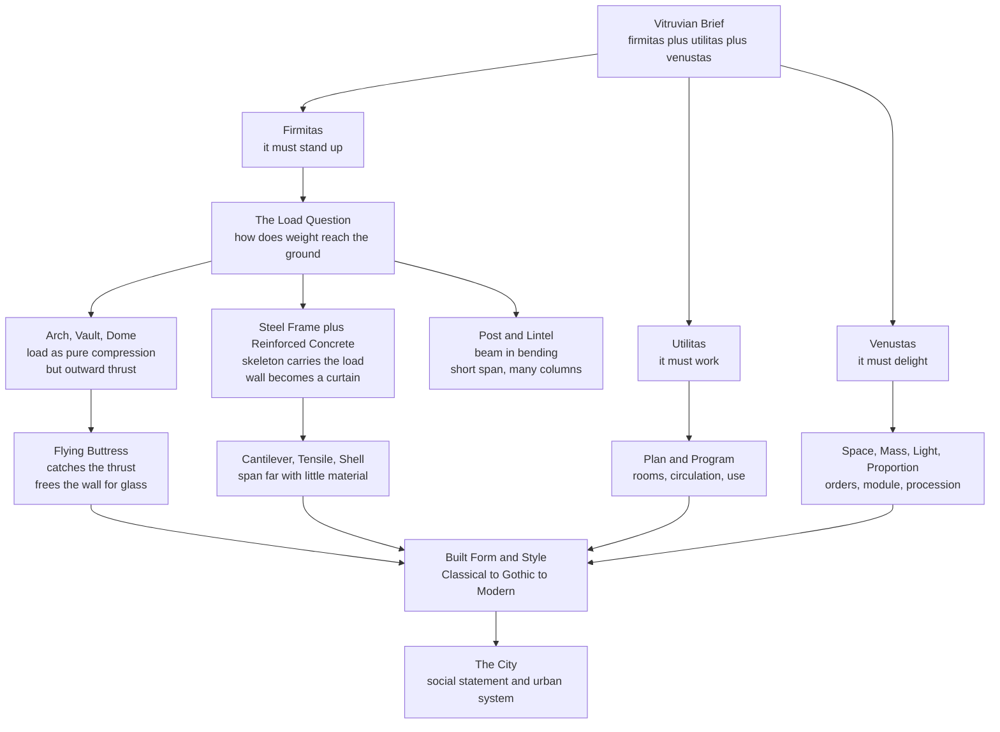

# 🏛️ Architecture and the Built Environment

> [!abstract] TL;DR
> **Architecture** is the art and science of shaping buildings and space — the only art form you inhabit and walk through. Vitruvius fixed its permanent job description in three words: **firmitas** (it must stand up), **utilitas** (it must work), and **venustas** (it must delight). Everything else — the post-and-lintel of a Greek temple, the Roman arch and dome, the Gothic flying buttress, the steel frame and reinforced concrete of the skyscraper — is a running negotiation between how loads reach the ground, what people need to do inside, and what the culture wants a building to *mean*. Structure sets the vocabulary; style, proportion, light, and the experience of moving through space compose the sentence.

---

## Intuition

**Analogy: a building is a frozen argument about gravity, use, and meaning — held at once.** Think of pitching a tent versus building a stone hut versus raising a cathedral. The tent stakes just have to survive the next storm; a hut has to keep out weather for a generation; a cathedral has to lift your gaze and outlast its builders by a thousand years. Same act — enclosing space — but three totally different balances of *staying up*, *being useful*, and *feeling significant*. Architecture is what happens when you have to solve all three simultaneously and cannot cheat on any of them: an ugly bridge that stands is engineering, a beautiful ceiling that collapses is a tragedy, and a gorgeous sound building nobody can use is a folly.

Now watch what gravity forces on that argument. A flat stone slab laid across two posts can only span a few metres before it cracks under its own weight — so a temple of post-and-lintel becomes a forest of closely spaced columns. Bend that slab into an arch and suddenly stone, which is weak in tension but immensely strong in compression, can leap a river or roof a hall. The history of architecture is largely the history of that one trick — turning bending into pure compression, then pure tension — repeated with ever-better materials until a wall can be made of glass.

---

## How It Works

### The Vitruvian triad: the permanent brief

The Roman architect **Vitruvius** (1st century BCE) wrote that good building requires three things held in balance:

1. **Firmitas** (firmness / structure) — the building must resist gravity, wind, earthquake, and time. This is the engineering: how forces travel from the roof, down through walls or frames, into the foundation, and out into the earth.
2. **Utilitas** (commodity / function) — the building must serve its use. Rooms of the right size, sensible circulation, light and air where people need them. This is *program* and *plan*.
3. **Venustas** (delight / beauty) — the building must please and move us: proportion, rhythm, light, ornament, the drama of a threshold, the calm of a courtyard.

The three are not independent. A structural choice (a dome, a cantilever) creates a spatial and aesthetic possibility (a soaring interior, a floating terrace); a functional need (a factory floor free of columns) drives a structural invention (the steel truss). Great architecture is where all three reinforce one another; the modernist slogan **"form follows function"** was one radical proposal about how to prioritise them.

### Structure sets the vocabulary: how loads shape form

Every structural system is a different answer to one question — *how does weight get to the ground?*

- **Post-and-lintel** (trabeated): vertical posts carry a horizontal beam (lintel). Simple and ancient (Stonehenge, the Greek temple), but the lintel works in **bending** — its top fibres compress while its bottom fibres stretch. Stone is strong in compression yet weak in **tension**, so a stone lintel cracks along its underside over any large span. Result: short spans and many columns.
- **The arch**: bend the span into a curve and the load travels along the curve as almost pure **compression** — exactly what stone and brick are good at. The price is **thrust**: an arch pushes *outward* at its base, which must be buttressed or tied. The Roman **round (semicircular) arch** unlocked bridges, aqueducts, and — rotated in a circle — the **dome** (the Pantheon), and — extruded along a line — the **barrel vault**.
- **The pointed arch and rib vault** (Gothic): a steeper, pointed profile drives thrust more **vertically** and reaches higher for the same span. Concentrating the vault's load onto slender ribs and piers, then catching the residual outward thrust with an external **flying buttress**, freed the wall from load-bearing duty — so it could dissolve into **stained glass** (see [[Classical_to_Medieval_Art]]).
- **The truss**: a triangulated frame of members in pure tension or compression (no bending), spanning far with little material — the logic of railway bridges, roof trusses, and cranes.
- **The steel frame and reinforced concrete**: steel is strong in *both* tension and compression; concrete is strong in compression, so embedding steel bars where concrete would stretch (**reinforced concrete**) gives a material strong in both. Together they enabled the **skeleton frame** — the building's weight carried by an internal cage, the exterior wall demoted to a weather-proof "**curtain wall**" hung on it — which is why skyscrapers can be sheathed in glass.
- **The cantilever**: a beam or slab anchored at one end only, projecting into space (Wright's *Fallingwater* terraces). It works by a couple — tension on top, compression below — and depends utterly on the strength of the anchoring and the tensile capacity of steel.
- **Tensile and shell structures**: cables and membranes carry load in **pure tension** (suspension bridges, tent roofs); thin curved shells (a concrete dome, a hyperbolic paraboloid) carry it as membrane forces across a surface — maximum span for minimum material. The physics here is the statics of forces in equilibrium (see [[Rotational_Dynamics]] for torque and moment).

### The elements of architecture: space, mass, light, proportion

Structure makes it stand; these make it *architecture*:

- **Space and procession** — architecture is experienced in **time**, by moving through it: the compression of a low entry giving way to the release of a tall nave, the turn that reveals a courtyard. This is the one art whose "composition" you walk inside (compare [[Composition_and_Design_Principles]]).
- **Mass and void** — the play of solid (wall, pier) against opening (window, door, portico); the sculpting of enclosed and open volume.
- **Light** — daylight is a structural material: the oculus of the Pantheon, the coloured glass of Chartres, the sharp shadow-lines of modernist concrete (see [[Light_Shadow_and_Value]]).
- **Proportion and module** — the classical **orders** (Doric, Ionic, Corinthian) fix column-to-entablature ratios; Renaissance theorists tied beauty to whole-number and musical ratios; Le Corbusier's **Modulor** derived a proportioning grid from the human body and the golden ratio. Proportion is where architecture meets the mathematics of [[Composition_and_Design_Principles]].

### Style, society, and the city

Styles are the historical dialects of this vocabulary: **Classical** (order, symmetry, the orders) → **Gothic** (verticality, light, structure made visible) → **Renaissance** (revived classical proportion, the ideal geometric plan) → **Baroque** (dynamic curves, theatrical space; see [[Renaissance_and_Baroque]]) → the **Modernist** revolution (Bauhaus, the International Style, Mies's "less is more," Le Corbusier's "machine for living," Wright's organic architecture) → **Postmodern** and **contemporary parametric** design (computationally generated, fluid form). Architecture is also always a **political and social statement** — monuments assert power, civic squares stage public life, and housing encodes a society's ideas about the good life. At the largest scale, buildings aggregate into the **city**, itself a self-organising complex system (see [[Urban_and_Infrastructure_Systems]]), while **vernacular** and **sustainable** architecture return to climate, local material, and the body as first principles.

### Flow: from the Vitruvian brief to the built form



---

## Key Concepts

### Secondary (explainable to a beginner)

- **Architecture is the art you walk inside.** Unlike a painting you look *at*, you experience a building by moving *through* it.
- **The three jobs (Vitruvius):** a good building must **stand up** (firmitas), **be useful** (utilitas), and **look and feel good** (venustas) — all three at once.
- **Post-and-lintel:** two posts and a beam across the top, like a doorway or Stonehenge. Simple, but the beam can only reach so far before it snaps.
- **The arch is the great leap:** curving the span turns a stone into something that gets *squeezed* (compression) rather than *stretched* — and stone is very strong when squeezed, so arches can span much farther.
- **The skyscraper trick:** a hidden steel or concrete skeleton carries all the weight, so the outside wall can be thin — even all glass — because it holds up nothing but itself.

### Undergraduate (needs some background)

- **Tension vs compression is the whole game.** A loaded beam bends: its top surface shortens (compression) and its bottom surface lengthens (tension). Masonry (stone, brick, concrete) is strong in compression but weak in tension, so pre-modern architecture is a search for shapes — arch, vault, dome — that convert bending into compression. Steel changed everything because it is strong in *both*.
- **Thrust and the buttress.** An arch or vault does not push straight down; it pushes **outward** at the springing. That horizontal thrust must be resisted — by mass (thick Romanesque walls), by a tie (a chain, as later added to the Pantheon's dome and St Peter's), or by a **flying buttress** that carries the thrust across open air to a heavy external pier.
- **The classical orders and proportion.** The **Doric, Ionic, and Corinthian** orders are complete proportional systems relating column diameter, height, spacing, and entablature. Renaissance architects (Alberti, Palladio) fused this with the idea that beauty lies in **harmonic ratios**, echoing musical consonance — a direct architectural cousin of the proportion tools in [[Composition_and_Design_Principles]].
- **Reinforced concrete.** Concrete cracks under tension, so steel reinforcing bars are placed exactly where the member will stretch. **Prestressing** goes further: the steel is tensioned *before* loading so the concrete is permanently squeezed and never actually feels tension — the basis of long thin bridge decks.
- **Form follows function.** Louis Sullivan's phrase, radicalised by the Bauhaus and the International Style into an anti-ornament ethic: honest structure and use should generate the form; decoration is dishonest. Wright's rival **"organic architecture"** insisted form and function are "one," rooted in site and material.

### Graduate (system-level thinking)

- **The catenary is the ideal arch.** A hanging chain settles into a **catenary** curve — pure tension, no bending. Flip that curve upside down and you get the shape of pure **compression**: the ideal arch, in which the "thrust line" runs exactly through the material and no bending stress arises anywhere. Robert Hooke stated it as "as hangs the flexible line, so but inverted will stand the rigid arch"; Antoni **Gaudí** designed the Sagrada Família's geometry with literal hanging-chain models, and shell designers (Heinz Isler, Frei Otto) generalised it to surfaces via inverted membranes.
- **Thrust-line / limit analysis of masonry.** A masonry arch is safe not because stresses are low but because a valid **compression thrust line** can be drawn inside the stonework (Jacques Heyman's plasticity theory of masonry). Gothic cathedrals stand by *geometry*, not material strength — which is why they can be cracked yet stable, and why the flying buttress must place a precise counter-thrust.
- **Structure as symbolic order.** Panofsky linked Gothic structural clarity to scholastic habits of ordered exposition; Viollet-le-Duc read Gothic as pure structural rationalism, while Pol Abraham argued its forms are largely aesthetic-symbolic and only *permitted* by structure. The debate — does form *follow* structure or merely *exploit* it? — recurs in every era, including the honest-structure claims of modernism.
- **Space and phenomenology.** Architectural theory (Bachelard's *Poetics of Space*, Norberg-Schulz's *genius loci*, Zumthor's atmospheres, Kevin Lynch's *Image of the City*) treats space not as neutral volume but as *lived* and *remembered* — how a threshold, a scale, a material, or a light shaft produces bodily and emotional meaning. This connects architecture to how we perceive depth and enclosure (see [[Space_Perspective_and_Depth]]).
- **The building as sculpture and the body.** Architecture borders on sculpture at the monumental scale (Brutalist mass, Gehry's titanium curves) yet is separated by **inhabitation** and **program** — it must be entered and used. Both, however, are ultimately calibrated to the human body: the module, the tread of a stair, the height of a rail, the reach of a doorway. Vernacular and sustainable design push this further, deriving form from climate, local material, and passive comfort rather than style.

---

## Python Demo

```python
# Structural spanning systems: how form defeats gravity.
# Uses only numpy and matplotlib. Four panels:
#   1. Post-and-lintel: a beam in BENDING (top compression, bottom tension),
#      the reason stone lintels crack and spans stay short.
#   2. Roman round arch: load travels as COMPRESSION along the curve, but
#      pushes OUTWARD (thrust) at the base.
#   3. Gothic pointed arch: same span, reaches higher, steers thrust more
#      DOWNWARD -> taller, lighter, walls freed for glass.
#   4. Catenary vs inverted catenary: the ideal PURE-COMPRESSION arch.
import numpy as np
import matplotlib.pyplot as plt

fig, axes = plt.subplots(2, 2, figsize=(13, 10))
SPAN = 2.0                      # common span for the arch comparison

# ---------------------------------------------------------------
# Panel 1: POST-AND-LINTEL -- beam in bending
# ---------------------------------------------------------------
ax = axes[0, 0]
# two posts
for px in (-0.9, 0.9):
    ax.add_patch(plt.Rectangle((px - 0.12, 0.0), 0.24, 1.0,
                               color="#7f8c8d"))
# unloaded lintel (dashed) and its sagging deflected shape (solid)
x = np.linspace(-0.9, 0.9, 200)
sag = -0.10 * (1 - (x / 0.9) ** 2)          # exaggerated deflection
ax.plot(x, 1.0 + 0 * x, "k--", lw=1, alpha=0.5)     # original top line
ax.plot(x, 1.0 + sag, color="#c0392b", lw=6)        # bent lintel
# annotate the fibre stresses that crack stone
ax.annotate("TOP fibres compress", xy=(0, 1.02), xytext=(-0.8, 1.35),
            fontsize=9, color="#2c3e50",
            arrowprops=dict(arrowstyle="->", color="#2c3e50"))
ax.annotate("BOTTOM fibres stretch\n(tension -> stone cracks here)",
            xy=(0, 0.90), xytext=(-0.85, 0.35), fontsize=9, color="#c0392b",
            arrowprops=dict(arrowstyle="->", color="#c0392b"))
ax.set_title("1. Post-and-lintel: beam BENDS\n-> short spans, many columns")
ax.set_xlim(-1.5, 1.5); ax.set_ylim(-0.1, 1.7)
ax.set_aspect("equal"); ax.axis("off")

# ---------------------------------------------------------------
# Panel 2: ROMAN ROUND ARCH -- compression + outward thrust
# ---------------------------------------------------------------
ax = axes[0, 1]
r = SPAN / 2.0
t = np.linspace(0, np.pi, 200)
ax.plot(r * np.cos(t), r * np.sin(t), color="#8e44ad", lw=8)
ax.plot([-r, r], [0, 0], "k", lw=1)                 # springing line
# compression flowing along the curve
for ang in np.linspace(0.25, np.pi - 0.25, 7):
    cx, cy = r * np.cos(ang), r * np.sin(ang)
    dx, dy = -np.sin(ang), np.cos(ang)              # tangent direction
    ax.annotate("", xy=(cx + 0.10 * dx, cy + 0.10 * dy),
                xytext=(cx - 0.10 * dx, cy - 0.10 * dy),
                arrowprops=dict(arrowstyle="-", color="#f39c12", lw=2))
# strong OUTWARD thrust at the base
ax.annotate("", xy=(r + 0.55, 0), xytext=(r, 0),
            arrowprops=dict(arrowstyle="->", color="#c0392b", lw=2.5))
ax.annotate("", xy=(-r - 0.55, 0), xytext=(-r, 0),
            arrowprops=dict(arrowstyle="->", color="#c0392b", lw=2.5))
ax.text(0, r + 0.12, "load = pure COMPRESSION", ha="center",
        fontsize=9, color="#f39c12")
ax.text(r + 0.05, -0.22, "big OUTWARD thrust", fontsize=9, color="#c0392b")
ax.set_title(f"2. Round arch: apex = {r:.2f} = 0.50 x span\ncompression, strong side thrust")
ax.set_xlim(-2.0, 2.0); ax.set_ylim(-0.5, 1.8)
ax.set_aspect("equal"); ax.axis("off")

# ---------------------------------------------------------------
# Panel 3: GOTHIC POINTED ARCH -- taller, thrust steered down
# ---------------------------------------------------------------
ax = axes[1, 0]
A = np.array([-SPAN / 2, 0.0])       # left springing point
B = np.array([SPAN / 2, 0.0])        # right springing point
apex_y = SPAN * np.sqrt(3) / 2       # equilateral pointed arch apex
a1 = np.linspace(0, np.pi / 3, 150)          # right half: centre A
a2 = np.linspace(np.pi, 2 * np.pi / 3, 150)  # left half:  centre B
ax.plot(A[0] + SPAN * np.cos(a1), A[1] + SPAN * np.sin(a1),
        color="#16a085", lw=8)
ax.plot(B[0] + SPAN * np.cos(a2), B[1] + SPAN * np.sin(a2),
        color="#16a085", lw=8)
ax.plot([-SPAN / 2, SPAN / 2], [0, 0], "k", lw=1)
# residual thrust is smaller and steeper (more downward) than the round arch
ax.annotate("", xy=(B[0] + 0.28, -0.42), xytext=(B[0], 0),
            arrowprops=dict(arrowstyle="->", color="#c0392b", lw=2.5))
ax.annotate("", xy=(A[0] - 0.28, -0.42), xytext=(A[0], 0),
            arrowprops=dict(arrowstyle="->", color="#c0392b", lw=2.5))
ax.text(0, apex_y + 0.08, "reaches higher, lighter", ha="center",
        fontsize=9, color="#16a085")
ax.text(B[0] + 0.05, -0.62, "thrust steered DOWN\n(smaller sideways push)",
        fontsize=9, color="#c0392b")
ax.set_title(f"3. Pointed arch: apex = {apex_y:.2f} = 0.87 x span\nsame span, ~73% taller")
ax.set_xlim(-2.0, 2.0); ax.set_ylim(-0.8, 2.0)
ax.set_aspect("equal"); ax.axis("off")

# ---------------------------------------------------------------
# Panel 4: CATENARY vs INVERTED CATENARY -- the ideal arch
# ---------------------------------------------------------------
ax = axes[1, 1]
# A hanging chain of half-width a settles into y = a*cosh(x/a): pure tension.
a = 0.7
xc = np.linspace(-1.0, 1.0, 300)
hang = a * np.cosh(xc / a)
hang = hang - hang.min()                 # drop lowest point to y = 0
ax.plot(xc, hang, color="#2980b9", lw=5, label="hanging chain (pure TENSION)")
# Invert it about its own midline -> the ideal compression arch.
arch = hang.max() - hang
ax.plot(xc, arch, color="#8e44ad", lw=5,
        label="inverted arch (pure COMPRESSION)")
# a round (circular) arch of the same span+rise for contrast
rr = 1.0
tt = np.linspace(0, np.pi, 200)
circ_x, circ_y = rr * np.cos(tt), rr * np.sin(tt)
circ_y = circ_y * (arch.max() / circ_y.max())     # match the rise
ax.plot(circ_x, circ_y, "k--", lw=1.5, alpha=0.7,
        label="circular arch (for contrast)")
ax.text(0, -0.18, "Hooke: as hangs the chain, so stands the arch",
        ha="center", fontsize=9, color="#555")
ax.set_title("4. Catenary = ideal thrust line\n(Gaudi built with hanging models)")
ax.set_xlim(-1.3, 1.3); ax.set_ylim(-0.35, 1.6)
ax.set_aspect("equal"); ax.legend(loc="upper right", fontsize=7.5)
ax.axis("off")

plt.suptitle("Spanning systems: how form turns gravity into compression",
             fontsize=14)
plt.tight_layout()
plt.savefig("architecture_spanning_systems.png", dpi=120)
plt.show()

# --- the numbers behind the pictures ---
round_apex = SPAN / 2.0
pointed_apex = SPAN * np.sqrt(3) / 2.0
print(f"Span (all arches)      = {SPAN:.2f}")
print(f"Round-arch apex height = {round_apex:.3f}  (0.500 x span)")
print(f"Pointed-arch apex      = {pointed_apex:.3f}  (0.866 x span)")
print(f"Extra height gained     = {pointed_apex / round_apex - 1:+.1%}")
print("=> for the SAME opening the pointed arch clears far more height and")
print("   drives its thrust closer to vertical -- so walls could become glass.")
```

The panels tell the structural story in order: the lintel *bends* (and stone cracks on its stretched underside, capping the span); the round arch converts that bending into pure compression but pays with a strong outward thrust; the pointed arch clears roughly 73% more height for the same span while steering thrust downward; and the catenary reveals the *ideal* arch — the inverted shape of a hanging chain, in which the load runs as pure compression with no bending anywhere, exactly the geometry Gaudí found with literal hanging-string models.

---

## Real-World Applications

- **Long-span roofs and stadiums.** Tensile membrane roofs (Munich Olympic Stadium, Frei Otto) and thin concrete shells (Isler, Candela) put the catenary/inverted-membrane logic to work, covering vast column-free spans with startlingly little material.
- **Skyscrapers.** The steel skeleton frame plus curtain wall (from Chicago's early towers to Mies's Seagram Building) is a direct application of "the frame carries the load, the wall carries only itself" — the enabling idea behind every glass tower.
- **Bridges.** Suspension and cable-stayed bridges are catenaries and trusses at civil scale; masonry arch bridges (Roman aqueducts still standing) are thrust-line engineering that has survived two millennia.
- **Earthquake and heritage engineering.** Limit / thrust-line analysis of masonry (Heyman) governs how Gothic cathedrals, domes, and historic arches are assessed and retrofitted — you stabilise a crack by ensuring the compression line stays inside the stone.
- **Sustainable and vernacular design.** Passive solar orientation, thermal mass, courtyards, and local materials (adobe, rammed earth, timber) return architecture to climate and body — now formalised in green-building standards and low-carbon structural design.
- **Urban planning and civic space.** Zoning, street grids, plazas, and housing policy shape the city as a lived system; reading buildings as social and political statements (monuments, capitols, public housing) is central to urbanism (see [[Urban_and_Infrastructure_Systems]]).
- **Computational / parametric design.** Contemporary practice (Zaha Hadid, form-finding software) generates fluid geometry algorithmically, optimising structure and form together — the modern descendant of Gaudí's physical models.

---

## Common Pitfalls

- **Confusing structure with style.** "Gothic" is not just pointed windows; it is a *structural system* (pointed arch + rib vault + flying buttress) that the look expresses. Copying the ornament without the logic is Gothic *Revival*, a different thing.
- **Forgetting that stone hates tension.** The single most common misreading of pre-modern architecture is treating a stone lintel or dome like a steel beam. Masonry is a *compression-only* material; every classical form is a workaround for its weakness in tension.
- **Ignoring thrust.** Beginners draw an arch pushing straight down. Arches and vaults push **outward** — un-buttressed, they spread and collapse. The Pantheon's dome and St Peter's needed tension rings *because* the outward thrust cracked them.
- **Treating the flying buttress as decoration.** It is a precisely aimed structural member catching the vault's outward thrust; remove it and the glass wall has nothing resisting the spread.
- **"Form follows function" as a universal law.** It was a *manifesto*, not a fact. Plenty of great architecture is expressive, symbolic, or ornamental first; and undecorated modernism has its own aesthetics and failures (windswept plazas, unloved housing slabs).
- **Designing the plan and forgetting the section.** Architecture is three-dimensional and experienced in *time*; a beautiful floor plan can produce oppressive or confusing space if the vertical dimension, light, and procession are ignored.
- **Mistaking the model for the material.** A shape that is stable at model scale may not be at full scale — self-weight grows with volume while cross-section grows with area (the square-cube law), which is exactly why you cannot just scale a design up without re-checking the structure.

---

## Related Concepts

- [[Composition_and_Design_Principles]] — proportion, balance, rhythm, and the golden ratio are the same organizing grammar architects apply in three dimensions and through time; the classical orders and Le Corbusier's Modulor are proportion systems.
- [[Space_Perspective_and_Depth]] — architecture is the art of shaping and moving through real space; perspective and depth cues govern how interiors and facades are perceived and how procession is staged.
- [[Classical_to_Medieval_Art]] — the round arch, rib vault, flying buttress, and stained-glass wall are treated there as the structural engine of the Gothic; this note extends that structural story forward to steel and concrete.
- [[Renaissance_and_Baroque]] — the revival of classical proportion and the dynamic, theatrical spatial ideas that shaped Renaissance and Baroque buildings.
- [[Light_Shadow_and_Value]] — daylight is an architectural material; the oculus, the clerestory, and coloured glass are light-as-design, and shadow reveals mass and depth.
- [[Urban_and_Infrastructure_Systems]] — buildings aggregate into the city, a self-organizing complex system with scaling laws; architecture is where the built environment meets urban emergence.
- [[Rotational_Dynamics]] — the statics of structures rests on force and moment equilibrium (torque about a support); the same mechanics that describe rotation govern why an arch stands or a cantilever tips.

---

## Review Questions

1. **(Secondary)** State Vitruvius' three requirements for good architecture in your own words, and give one everyday building where all three are obviously in tension (for example, a school, a stadium, or a hospital). Which requirement do you think its designers prioritised, and how can you tell?
2. **(Undergraduate)** Explain, in terms of tension and compression, why a stone post-and-lintel temple needs many closely spaced columns while a stone arch can span a river. Then describe what "thrust" is and three different ways architects have resisted it.
3. **(Graduate)** "As hangs the flexible line, so but inverted will stand the rigid arch." Explain what Hooke meant, why the catenary is the *ideal* arch form, and how thrust-line (limit) analysis explains why a cracked Gothic vault can still be perfectly safe. What does this reveal about the difference between *strength* and *stability* in masonry?

---

## Sources

- Vitruvius. *The Ten Books on Architecture* (De Architectura). Trans. M. H. Morgan, Dover, 1960 (orig. c. 25 BCE).
- Ching, Francis D. K. *Architecture: Form, Space, and Order* (4th ed.). Wiley, 2014.
- Heyman, Jacques. *The Stone Skeleton: Structural Engineering of Masonry Architecture*. Cambridge University Press, 1995.
- Salvadori, Mario. *Why Buildings Stand Up: The Strength of Architecture*. W. W. Norton, 1990.
- Kostof, Spiro. *A History of Architecture: Settings and Rituals* (2nd ed.). Oxford University Press, 1995.
- Le Corbusier. *Towards a New Architecture*. Trans. F. Etchells, Dover, 1986 (orig. 1923).

---

#aesthetics #architecture #built-environment #structure #design
