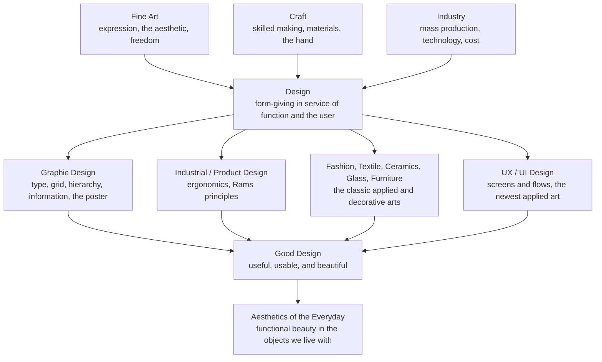

# 🪑 Design and the Applied Arts

> [!abstract] TL;DR
> The **applied arts** are art in the service of function and everyday life — the poster, the chair, the teapot, the typeface, the phone interface — historically ranked below the "fine arts" as mere *minor* or *decorative* arts, a hierarchy that the twentieth century dismantled. **Design** is the disciplined form-giving that solves a problem for a user under real constraints, yet the border with art is porous: the **Bauhaus** deliberately married art, craft, and industry, and movements from **Arts and Crafts** to the **Swiss Style** to **UX/UI** all argue over the same question — how do usefulness, making, and beauty fit together in the objects we actually live with?

---

## Intuition

**Analogy: a painting is a soliloquy; a chair is a conversation.** A painter can say whatever they like on the canvas — the work answers only to itself and to the viewer's contemplation. A chair cannot. A chair must hold a body, survive being dragged across a floor, cost a factory a sensible amount to stamp out, ship flat, and *then*, having done all that, still look good in a room. The designer is not a lone speaker but a negotiator sitting between a human need, a material, a manufacturing process, and a budget, trying to make all four agree — and to make the agreement beautiful.

That negotiation is the whole difference. Fine art starts from expression and is free to ignore function. Design starts from a **problem** and a **user**, and its beauty has to be earned *through* the solution, not bolted on afterward. When you find a doorknob that turns sweetly, a road sign you read at 70 mph without thinking, or an app you never had to learn, you are looking at applied art doing its quiet work: form that serves before it shows off.

---

## How It Works

### From "minor arts" to design

For centuries European academies sorted art into a **hierarchy**. At the top sat the **fine arts** — painting, sculpture, architecture — prized as products of pure intellect and imagination. Below them sat the **decorative** or **applied arts** — furniture, ceramics, textiles, metalwork, bookbinding — dismissed as *minor* because they were made by hand for use, often by anonymous craftspeople rather than named geniuses. Industrialization then split the maker from the object entirely: machines mass-produced goods that were often ugly, and the designer emerged as a new figure whose job was to give *form* to things that would be made by *someone else's* hands, or by no hands at all. The twentieth century flattened the old hierarchy: a Breuer chair now hangs in a museum next to a painting, and "design" is understood as a serious cultural practice, not a lesser cousin of art.

### Art versus design — a porous boundary

The cleanest distinction: **art poses questions; design solves problems.** Design is *purposeful* (it serves a function), *user-centred* (it answers to someone other than its maker), *constrained* (materials, cost, ergonomics, manufacturing, deadlines), and usually *reproducible* (meant to be made many times). Art is free of all four. But the line leaks in both directions — a protest poster is art *and* a solution; a limited-edition designer object is functional *and* a collector's expression. The **Bauhaus** (Weimar, 1919) made the porousness its founding creed: unite fine art, craft, and industrial technology so that a well-designed teapot and a great painting are the same kind of achievement.

### Graphic design: type, grid, hierarchy

**Graphic design** organizes visual information so it can be read and understood. Its atoms:

1. **Typography** — the selection and arrangement of type. Type has an **anatomy** (x-height, ascenders, descenders, serifs, counters, stems) and a history (humanist and old-style serifs, transitional and modern serifs, then the geometric and grotesque sans-serifs of the twentieth century). The designer tunes **legibility** (can you decode a single letter?), **readability** (can you read a paragraph comfortably?), leading, tracking, and measure.
2. **The grid** — an underlying modular framework of columns, rows, and margins that snaps every element into alignment, giving a layout order and rhythm. This is [[Composition_and_Design_Principles|composition]] applied to information.
3. **Visual hierarchy** — using size, weight, colour, and position to rank elements so the eye reads them in the intended order: headline first, then subhead, then body, then caption. Hierarchy is what turns a wall of undifferentiated content into a scannable, ranked message.
4. **Applications** — the poster, the logo, the book, the brand identity, and **information design** (maps, charts, wayfinding, the London Underground diagram).

### Industrial and product design: "good design"

**Industrial design** gives form to mass-produced objects, balancing **ergonomics** (fit to the human body and its limits), manufacturability, cost, and aesthetics. Its most quoted creed is **Dieter Rams' ten principles of good design** — good design is innovative, makes a product useful, is aesthetic, makes a product understandable, is unobtrusive, honest, long-lasting, thorough down to the last detail, environmentally friendly, and involves **as little design as possible**. Rams' spare functionalism at Braun directly shaped later product design, including early Apple hardware.

### The widening family of applied arts

Beyond graphics and products, the applied arts include **fashion and textile design**, **ceramics, glass, and furniture**, and the whole world of **craft** — where the character of the object lives in [[Texture_Pattern_and_Materiality|material and surface]]. The newest member is **UX/UI and digital design**: designing screens, flows, and interactions is an applied art governed by the cognitive limits of real users, which is exactly the domain of [[Human_Computer_Interaction_and_Applied_Cognition|human-computer interaction]]. Tying them together is **design thinking** — an iterative, human-centred problem-solving process (empathize, define, ideate, prototype, test) and the broader idea of the **aesthetics of the everyday**: that beauty in functional things is a real and worthwhile value, not a frivolous one.



---

## Key Concepts

### Secondary (explainable to a beginner)
- **Applied arts** are art made to be *used* — chairs, posters, cups, clothes, apps — not just looked at.
- **Design solves a problem** for a person; a poster has to be read, a chair has to be sat in. That is the big difference from painting, which only has to be looked at.
- **Typography** is the art of arranging letters so they are easy and pleasant to read; the shapes and sizes of type matter as much as the words.
- **The grid** is an invisible set of columns and rows that keeps everything on a page lined up and tidy.
- **Visual hierarchy**: make the most important thing biggest and boldest so the eye sees it first.
- **"Good design"** is not just pretty — it is useful, easy to understand, and long-lasting.

### Undergraduate (needs some background)
- **The minor-arts hierarchy and its breakdown**: fine arts (painting, sculpture) were ranked above decorative arts (furniture, ceramics, textiles) because the latter were handmade for use by anonymous craftspeople. Industrialization and then the Bauhaus dissolved the ranking; design became a serious discipline in its own right.
- **The four marks of design** versus art: purpose (serves a function), user-centredness (answers to someone else), constraint (materials, cost, ergonomics, manufacture), reproducibility (made many times). Art is free of all four — but the boundary is genuinely porous.
- **Type anatomy and classification**: x-height, ascenders/descenders, serifs, counters, stems; and the broad families — humanist and old-style serif, transitional, modern (Didone), slab serif, and sans-serif (grotesque, geometric, humanist). **Legibility** (single-glyph decoding) differs from **readability** (comfort of reading running text).
- **The modular grid and the modular type scale**: layouts are built on columns and a baseline grid; type sizes are often chosen from a **modular scale**, a geometric progression `base * ratio ** n` (common ratios: 1.25 major third, 1.333 perfect fourth, 1.618 golden ratio). Proportional sizes create harmony the way musical intervals do.
- **The design movements**:
  - **Arts and Crafts** (William Morris, 1860s onward) — a reaction against shoddy industrial goods; a return to handcraft, honest materials, and the dignity of the maker. Beautiful but expensive, and nostalgic about the machine.
  - **Art Nouveau** (1890s) — organic, whiplash botanical lines applied to everything from posters to ironwork.
  - **The Bauhaus** (1919-1933) — "form follows function," the marriage of art and technology, geometric abstraction, and design *for* industry.
  - **International Typographic (Swiss) Style** (1950s) — mathematical grids, sans-serif type (Helvetica, Univers), flush-left ragged-right setting, and objective clarity above ornament.
  - **Postmodern design** (1970s-80s, Memphis Group, April Greiman) — a rebellion against Swiss austerity: colour, decoration, historical quotation, and playful "bad taste."
- **Dieter Rams' ten principles** compress functionalist ideology into a checklist, ending in the famous "as little design as possible" — restraint as a virtue.

### Graduate (system-level thinking)
- **"Form follows function" is a slogan, not a proof.** Louis Sullivan coined it about architecture; the Bauhaus adopted it. But function rarely dictates a single form — a chair has thousands of functional solutions — so "form follows function" is better read as a *value commitment* (honesty, economy, anti-ornament) than a deterministic law. Postmodernism's whole point was to reject it and reclaim ornament and meaning.
- **The autonomy problem**: is design ever "pure," or is it always compromised by the client, the market, and manufacturability? Critical design and speculative design deliberately break the service relationship to ask questions rather than sell products, blurring back toward art — showing the art/design line is a *social* boundary drawn by institutions (museums, markets, academies), not an essence in the objects.
- **Functional beauty and everyday aesthetics**: philosophers (Glenn Parsons, Allen Carlson, Yuriko Saito) argue that fitness-for-function is itself an aesthetic category — a well-proportioned tool *looks* right partly *because* it works — reversing Kant's separation of the beautiful (disinterested) from the useful (interested). This reclaims the applied arts from their "minor" status on philosophical grounds.
- **Universalism versus its critique**: the Swiss Style and Rams present clarity and restraint as *objective* good design, but critics note these are culturally specific modernist values; Helvetica's neutrality is itself an ideology. Postmodern and non-Western design traditions treat ornament, colour, and cultural specificity as virtues, not noise.
- **The ethics of design**: because design shapes mass behaviour, it carries responsibility — accessibility and inclusive design, sustainability and the throwaway economy Rams warned against, and **dark patterns** (interfaces engineered to manipulate). Design thinking's "human-centredness" can be co-opted to optimize for engagement rather than genuine human good.

---

## Python Demo

```python
# Design and the Applied Arts - the modular grid, visual hierarchy, and the type scale
# numpy + matplotlib only. Two core graphic-design ideas made concrete:
#   Panel 1: a poster laid out on a typographic / modular grid. Content blocks
#            are snapped to grid columns and rows, and are SIZED and WEIGHTED
#            by importance so the eye reads them in ranked order (hierarchy).
#   Panel 2: a modular type scale. Font sizes form a geometric progression
#            base * ratio ** step. Proportional sizes create harmony, the way
#            musical intervals do; we compare a 1.25 "major third" scale with
#            the golden-ratio 1.618 scale.

import numpy as np
import matplotlib.pyplot as plt
from matplotlib.patches import Rectangle

fig, (ax1, ax2) = plt.subplots(1, 2, figsize=(15, 8))

# ---------------------------------------------------------------
# Panel 1: poster on a 12-column modular grid with visual hierarchy
# ---------------------------------------------------------------
COLS = 12                      # a 12-column grid, the workhorse of layout
MARGIN = 1.0                   # outer margin in grid units
PAGE_W, PAGE_H = 12.0, 16.0
col_w = (PAGE_W - 2 * MARGIN) / COLS
row_h = 1.0

# page border
ax1.add_patch(Rectangle((0, 0), PAGE_W, PAGE_H, fill=False, lw=2))

# faint column grid
for c in range(COLS + 1):
    x = MARGIN + c * col_w
    ax1.plot([x, x], [MARGIN, PAGE_H - MARGIN], color="0.85", lw=0.7, zorder=0)
# faint baseline grid
y = MARGIN
while y <= PAGE_H - MARGIN + 1e-9:
    ax1.plot([MARGIN, PAGE_W - MARGIN], [y, y], color="0.9", lw=0.5, zorder=0)
    y += row_h

def block(ax, col, row, cspan, rspan, label, size, weight, color):
    """Place a content block snapped to the grid.
    Importance is encoded by block size and by font size / weight."""
    x = MARGIN + col * col_w
    w = cspan * col_w
    y_top = PAGE_H - MARGIN - row * row_h     # rows counted from the top
    h = rspan * row_h
    ax.add_patch(Rectangle((x, y_top - h), w, h, facecolor=color,
                           edgecolor="black", lw=1.0, alpha=0.9, zorder=2))
    ax.text(x + 0.15, y_top - 0.15, label, fontsize=size, weight=weight,
            va="top", ha="left", zorder=3)

# ranked hierarchy: headline > subhead > image > body > caption > footer
block(ax1, 0,  0, 12, 2, "HEADLINE",              24, "bold",     "#f2c14e")
block(ax1, 0,  2,  8, 1, "Subheading / deck",     14, "semibold", "#f0e6d2")
block(ax1, 8,  2,  4, 4, "IMAGE",                 12, "normal",   "#7fb3d5")
block(ax1, 0,  4,  4, 5, "Body column A\nrunning text ...", 8, "normal", "#f7f7f7")
block(ax1, 4,  4,  4, 5, "Body column B\nrunning text ...", 8, "normal", "#f7f7f7")
block(ax1, 8,  6,  4, 3, "caption",                8, "normal",   "#f7f7f7")
block(ax1, 0, 11, 12, 1, "footer   .   page 1   .   2026", 8, "normal", "#e0e0e0")

ax1.set_title("Poster on a 12-column modular grid\n"
              "blocks snapped to grid, sized and weighted by importance",
              fontsize=11)
ax1.set_xlim(-0.5, PAGE_W + 0.5)
ax1.set_ylim(-0.5, PAGE_H + 0.5)
ax1.set_aspect("equal")
ax1.axis("off")

# ---------------------------------------------------------------
# Panel 2: modular type scale - a geometric progression of font sizes
# ---------------------------------------------------------------
base = 16.0                          # base body size in points
steps = np.arange(-1, 6)             # below body (captions) and above (headings)
scales = {"1.250  major third": 1.25,
          "1.618  golden ratio": (1 + np.sqrt(5)) / 2}
colors = {"1.250  major third": "#c0392b", "1.618  golden ratio": "#2874a6"}

for name, r in scales.items():
    sizes = base * r ** steps
    ax2.plot(steps, sizes, "o-", color=colors[name], lw=2, label=name)
    for s, sz in zip(steps, sizes):
        ax2.annotate(f"{sz:.0f}", (s, sz), textcoords="offset points",
                     xytext=(6, 4), fontsize=8, color=colors[name])

ax2.set_title("Modular type scale: size = base * ratio ** step\n"
              "proportional sizes create harmony",
              fontsize=11)
ax2.set_xlabel("scale step   [ 0 = body text, negative = caption, positive = heading ]")
ax2.set_ylabel("font size in points")
ax2.grid(True, alpha=0.3)
ax2.legend(title="modular ratio")

plt.tight_layout()
plt.show()

# print the golden-ratio scale the way a designer would spec it
PHI = (1 + np.sqrt(5)) / 2
print("Golden-ratio type scale from a 16pt base:")
for step in range(-1, 6):
    print(f"  step {step:+d}: {base * PHI ** step:6.1f} pt")
```

The left panel shows *structure*: every block is snapped to the same 12-column grid so nothing floats arbitrarily, and importance is encoded twice over — by block size and by type size/weight — so a reader's eye ranks the content without effort. The right panel shows *proportion*: font sizes are not chosen ad hoc but pulled from a geometric progression, so every size relates to every other by a constant ratio, which is why a well-set page feels harmonious rather than noisy. Grid plus scale is the quiet skeleton under almost every poster, book, and screen you read.

---

## Real-World Applications

- **Wayfinding and information design**: Harry Beck's 1933 London Underground map abandoned geography for a topological diagram on a strict grid of horizontals, verticals, and 45-degree diagonals — a masterpiece of applied art that made a chaotic network legible and has been copied by transit systems worldwide.
- **Corporate identity and the Swiss Style**: Helvetica (1957) and grid-based systems became the visual language of postwar business, airlines, and governments precisely because their neutral clarity read as trustworthy and modern.
- **Product design**: Dieter Rams' Braun radios and calculators, and the Apple hardware they influenced, are textbook demonstrations of "as little design as possible" — reduction, honest materials, and obsessive detail.
- **Furniture as canonical applied art**: Marcel Breuer's tubular-steel Wassily chair, the Eameses' molded-plywood and fiberglass chairs, and IKEA's flat-pack system all solve the same negotiation between body, material, factory, and cost.
- **Digital UX/UI**: design systems (Google's Material, Apple's Human Interface Guidelines) codify grids, type scales, spacing, and components so that thousands of screens stay coherent — the modular grid and type scale of this note's demo, industrialized. See [[Design_System_Overview]] and [[Human_Computer_Interaction_and_Applied_Cognition]].
- **The poster and protest graphics**: from Toulouse-Lautrec's Art Nouveau lithographs to the constructivist and Swiss poster to the "HOPE" and pandemic public-health posters, the poster is where graphic design, art, and persuasion visibly fuse.

---

## Common Pitfalls

- **Confusing decoration with design** — adding ornament to an unsolved problem. Good design begins with the function and the user; styling comes after, not instead. A beautiful interface that no one can use has failed as design however it looks.
- **Style over legibility** — choosing a trendy display face or ultra-thin weight for body text, tight tracking, or low colour contrast. Legibility and readability are non-negotiable in applied work; the message must survive real reading conditions.
- **Ignoring the grid, or worshipping it** — freeform layouts with no alignment look amateurish, but a rigid grid slavishly followed becomes monotonous. The grid is a scaffold to align *and* to knowingly break for emphasis.
- **No visual hierarchy** — making everything the same size and weight so nothing leads. If every element shouts, the eye has no entry point; rank the content and let type size, weight, and space do the ranking.
- **Ad hoc type sizes** — picking font sizes by eye until "it looks OK," producing a jumble. A modular scale gives every size a proportional relationship and instant harmony.
- **Treating "good design = my taste"** — mistaking Swiss minimalism (or any single school) for a universal law. Restraint is a *value*, not a proof; ornament, colour, and cultural specificity are legitimate choices, as postmodern and non-Western design insist.
- **Design thinking as theater** — running "empathize / ideate / prototype" workshops with sticky notes but never testing with real users or shipping, so the human-centred process becomes ritual rather than problem-solving.

---

## Related Concepts

- [[Composition_and_Design_Principles]] — the grid, visual hierarchy, balance, and proportion that graphic design inherits directly from pictorial composition; this note applies those principles to functional, reproducible artifacts.
- [[Texture_Pattern_and_Materiality]] — the surface, material, and craft dimension of the applied arts; ceramics, glass, furniture, and textiles live or die by how their materiality is handled.
- [[Color_Theory]] — colour choice in branding, typography, and interfaces (contrast for legibility, palette for identity) rests on the same colour relationships treated there.
- [[Human_Computer_Interaction_and_Applied_Cognition]] — UX/UI is the newest applied art, and its constraints (Fitts's law, cognitive load, usability) come from applied cognition; design for screens is HCI made visual.
- [[Design_System_Overview]] — the modern, industrialized descendant of the modular grid and type scale: a codified visual language that keeps thousands of digital screens coherent.

*Planned sibling note in this section (create and back-link once written):* **Digital_Art** (generative, procedural, and screen-native art, S06), which extends the digital thread of the applied arts into fine-art territory.

---

## Review Questions

1. **(Secondary)** In your own words, what makes a chair or a poster an example of the *applied* arts rather than the fine arts? Name one thing a designer must satisfy that a painter does not.
2. **(Undergraduate)** You are laying out a one-page event poster. Explain how a modular grid and a modular type scale would each help you, and describe how you would use size, weight, and position to build a visual hierarchy so a passerby reads the right things first.
3. **(Graduate)** "Form follows function" and Dieter Rams' "as little design as possible" are often quoted as objective principles of good design. Argue both sides: in what sense are they genuine design wisdom, and in what sense are they culturally specific modernist *values* that postmodern or non-Western design can legitimately reject?

---

## Sources

- Rams, Dieter. *Ten Principles for Good Design* (as collected in Klemp, Klaus, and Keiko Ueki-Polet, eds., *Less and More: The Design Ethos of Dieter Rams*). Gestalten, 2011.
- Muller-Brockmann, Josef. *Grid Systems in Graphic Design*. Niggli, 1981.
- Bringhurst, Robert. *The Elements of Typographic Style* (4th ed.). Hartley & Marks, 2013.
- Naylor, Gillian. *The Bauhaus Reassessed: Sources and Design Theory*. Herbert Press, 1985.
- Parsons, Glenn, and Allen Carlson. *Functional Beauty*. Oxford University Press, 2008.
- Norman, Donald A. *The Design of Everyday Things* (revised ed.). Basic Books, 2013.

---

#aesthetics #design #graphic-design #typography #applied-arts
