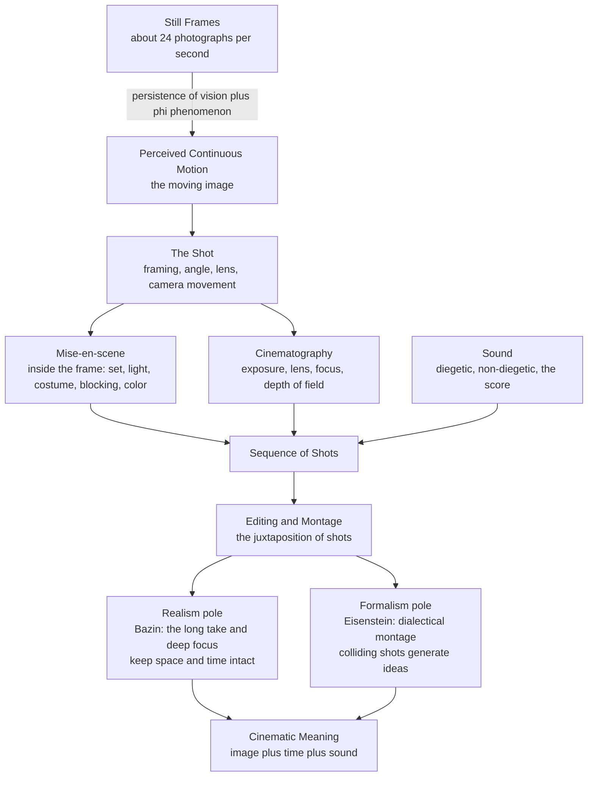

# 🎬 Film and the Moving Image

> [!abstract] TL;DR
> **Film** is the 20th century's dominant art form: a time-based medium that synthesizes the still image, motion, duration, and sound into a single expressive language. Its magic rests on a perceptual trick — a rapid succession of **still photographs** (about 24 per second) is read by the brain as continuous motion (the **phi phenomenon** / apparent motion). On top of that illusion, cinema builds a grammar with three main layers: the **shot** (framing, angle, movement), **mise-en-scene** (everything arranged inside the frame), and **editing / montage** (the juxtaposition of shots, where — as the Kuleshov effect proves — meaning is manufactured in the *cut* as much as in the image). Its history is a running argument between **realism** (Bazin's faith in the unbroken long take) and **formalism** (Eisenstein's belief that colliding shots generate ideas), all inside a medium that is simultaneously high art and mass-industrial commodity.

---

## Intuition

**Analogy first: cinema is a flipbook with a soundtrack.** Draw a stick figure in the corner of a notepad, redraw it slightly shifted on each page, then riffle the pages with your thumb. The figure *walks* — even though every page is a frozen, motionless drawing and nothing on the paper actually moves. Your eye and brain, not the paper, create the motion by stitching still snapshots together faster than they can be told apart. That is the entire physical foundation of film: **a strip of stills flashed fast enough becomes a living image.**

Now add a second, deeper trick. Cut from a shot of a person's blank face to a shot of a bowl of soup, and the audience "sees" hunger. Cut from the *same* blank face to a coffin, and they see grief. Nothing in the face changed — the meaning came from *what you placed next to it*. Cinema, then, is two illusions stacked: motion built from stills, and meaning built from adjacency. Everything else — the lens, the lighting, the score, the theory — is elaboration on those two founding sleights of hand.

---

## How It Works

### 1. The perceptual base: motion from stillness

A movie is a sequence of **discrete photographs (frames)** displayed in rapid succession. Two perceptual facts make the strip come alive:

- **Persistence of vision** — the retina briefly retains an image after the light is gone (roughly a fraction of a second), so successive frames blur into one another rather than appearing as a stutter of separate pictures. (This classic explanation is real but *incomplete* — see pitfalls.)
- **The phi phenomenon / apparent motion** — demonstrated by Max Wertheimer (1912), this is the brain's active *construction* of motion between stationary stimuli shown in sequence. It, more than mere retinal afterimage, is why we perceive smooth movement rather than a slideshow.

**Frame rate** is the number of frames shown per second. Below roughly **16 fps** the illusion breaks into visible flicker and jerk; silent film ran near 16–18 fps, the sound-era standard settled at **24 fps**, television used 25/30, and high-frame-rate cinema (48/60/120 fps) pushes for hyper-smoothness. Link the perceptual machinery to [[Visual_Cognition]].

### 2. The language of film: three layers

Cinema is often taught as three nested layers of choice — what the frame *is*, what is *inside* it, and how frames are *joined*:

- **The shot** (the basic unit). **Framing** runs from the extreme close-up to the extreme long shot; **angle** (high, low, eye-level, canted/Dutch) shapes power and unease; **camera movement** — **pan** (pivot horizontally), **tilt** (pivot vertically), **dolly / tracking** (the whole camera glides), **crane** (sweeps through vertical space), **zoom** (optical magnification), plus handheld and Steadicam — turns the frame itself into a moving eye. The central rhythm choice is the **long take** (one continuous unbroken shot) versus the **cut** (fragmentation into many shots).
- **Mise-en-scene** — literally "putting into the scene": *everything arranged within the frame* — set and production design, **lighting**, costume, props, actor **blocking**, and color palette. This is where cinema inherits the whole tradition of the still visual arts: tonal drama from [[Light_Shadow_and_Value]], the guiding of the eye from [[Composition_and_Design_Principles]], mood and symbolism from [[Color_Theory]], and staging in depth from [[Space_Perspective_and_Depth]].
- **Cinematography** — how the frame is *captured*: exposure, lens choice (focal length, aperture, depth of field), focus, and film stock or digital sensor. These are exactly the exposure-and-lens principles of still [[Photography_and_the_Photographic_Image|photography]], now unfolding in time.

### 3. Editing / montage: meaning in the join

**Editing** is the selection and joining of shots. Two great traditions pull in opposite directions:

- **Continuity ("invisible" Hollywood) editing** hides the cut so the audience forgets they are watching assembled fragments: the **180-degree rule** (keep the camera on one side of the action line so screen geography stays stable), **shot / reverse-shot** for conversations, **match-on-action**, and **eyeline matches**. The goal is a seamless, transparent flow of story-space and story-time.
- **Soviet montage** treats the cut as the *engine of meaning*. Lev Kuleshov's experiment (the **Kuleshov effect**) showed that an identical neutral face reads as hunger, grief, or desire depending purely on the adjacent shot. Sergei Eisenstein radicalized this into **dialectical / intellectual montage**: two shots *collide* like a thesis and antithesis to produce a new idea (a synthesis) that is in neither shot alone — meaning is manufactured, not merely recorded.

### 4. Sound

Since 1927, film is audiovisual. Sound is classed by its relation to the story-world: **diegetic** (sourced inside the world — dialogue, footsteps, a radio the characters hear) versus **non-diegetic** (added for the audience only — most notably the **musical score**, plus voice-over narration). The score is film's most direct emotional lever, exploiting the psychology of musical expectation and affect covered in [[Music_Cognition_and_Emotion]].

### 5. The great theoretical debates

- **Realism vs formalism.** André **Bazin** championed the **long take** and **deep focus**: keep space and time intact, let the viewer's eye roam an ambiguous reality, minimize the director's manipulation. Eisenstein's **formalism** held the opposite — reality means nothing until *shaped* by editing. This is the founding axis of film theory.
- **Auteur theory.** Advanced by the *Cahiers du cinema* critics (Truffaut) and Andrew Sarris, it treats the **director as the "author"** of a film — the guarantor of a personal style and vision across a body of work — importing the idea of authorship from literature (compare [[Narrative_Structure_and_Storytelling]]).
- **Apparatus theory and the male gaze.** Laura **Mulvey** ("Visual Pleasure and Narrative Cinema," 1975) argued that mainstream cinema structures its look as *masculine*: the camera, the male character, and the spectator align to make woman the passive object of a controlling **gaze**. This feminist-psychoanalytic critique connects to the broader ideology critique in [[Feminist_and_Postcolonial_Art_Theory]].
- **Genre** (western, noir, musical, horror) as a system of shared conventions and audience expectations, and **narrative** (the distinction between *story* — all events in order — and *plot* — how the film actually presents them) as film's inheritance from literary storytelling.

### 6. Digital transformation and the double life of film

CGI, digital cameras, and computer animation have dissolved the photographic guarantee that "the camera records something real," raising fresh questions about realism. Throughout, film has led a double life as **fine art** and as **mass-industrial commodity** — a tension Walter Benjamin named when he argued that mechanical reproduction strips the artwork of its unique "aura."



---

## Key Concepts

### Secondary (explainable to a beginner)
- **A film is moving pictures with sound that tell a story** — but the "movement" is an illusion made of still photographs shown very fast.
- **Frame rate:** how many pictures per second; below about 16 the motion looks jerky, and 24 fps is the classic cinema standard.
- **Shot, scene, sequence:** a **shot** is one uninterrupted run of the camera; a **scene** is a set of shots in one place/time; a **sequence** is a chain of scenes forming a chapter of the story.
- **The cut** is the join between two shots — the basic act of editing.
- **Close-up vs wide shot:** a close-up fills the frame with a face for intimacy; a wide (long) shot shows the whole setting for context.
- **The director** is the person who guides all these choices — the closest thing a film has to a single author.

### Undergraduate (needs some background)
- **Mise-en-scene:** everything staged inside the frame — set, lighting, costume, props, blocking, color — the film's debt to painting and photography.
- **Continuity editing:** the invisible Hollywood system — the **180-degree rule**, **shot/reverse-shot**, **match-on-action**, **eyeline match** — designed so cuts go unnoticed and story-space stays coherent.
- **Montage and the Kuleshov effect:** juxtaposing shots creates meaning that is in neither shot alone; the same neutral face changes meaning with its neighbor.
- **Diegetic vs non-diegetic sound:** sound *inside* the story-world versus sound added for the audience (the score, voice-over).
- **Cinematography basics:** lens focal length and aperture set the **depth of field** (how much is in focus); shallow focus isolates a subject, deep focus keeps foreground and background sharp.
- **The long take vs montage:** one flowing shot preserves real time and space; rapid cutting compresses and comments.
- **Genre:** a contract of conventions between film and audience (noir's shadows, the western's frontier).

### Graduate (system-level thinking)
- **Realism vs formalism (Bazin vs Eisenstein):** is cinema's essence its capacity to *record* an ambiguous reality (favoring the long take, deep focus, restrained editing) or its capacity to *construct* meaning through the cut (favoring montage)? The debate structures nearly all of classical film theory.
- **Auteur theory and its critique:** treating the director as author illuminates personal style but risks obscuring cinema's radically **collaborative and industrial** nature (writers, cinematographers, editors, studios).
- **The male gaze and apparatus theory (Mulvey):** the cinematic *apparatus* — camera, editing, narrative — is not neutral but ideologically structured, positioning the spectator and gendering the act of looking; a foundational move in feminist and psychoanalytic film theory.
- **Fabula and syuzhet (narratology):** the formalist distinction between the raw chronological *story* (fabula) and the artful *plot* ordering (syuzhet) — flashbacks, ellipses, and unreliable narration are syuzhet operations (see [[Narrative_Structure_and_Storytelling]]).
- **Benjamin's "aura" and mechanical reproduction:** film has no unique original — it is *born* reproducible, which for Benjamin both destroys the traditional aura of the artwork and opens radical new political and perceptual possibilities.
- **Post-cinema / the digital turn:** when the image is computed rather than photographed (CGI, animation, deepfakes), the indexical bond between image and reality — the very thing Bazin's realism rested on — is broken, reopening every classical question.

---

## Python Demo

```python
"""
Film and the Moving Image -- the perceptual base and the montage principle.

Uses only numpy and matplotlib. Two demonstrations:

  PART 1 -- Apparent motion (persistence of vision / the phi phenomenon):
    A ball is drawn at successive positions as a strip of STILL frames.
    Each frame is frozen -- nothing actually moves. When such frames are
    flashed in rapid succession above the apparent-motion threshold
    (roughly 16-24 frames per second) the visual system fills the gaps and
    reports smooth, continuous motion. We render the filmstrip and the
    sampled trajectory to show how discrete samples are read as "motion".

  PART 2 -- The Kuleshov effect (montage / juxtaposition creates meaning):
    The SAME neutral face shot is placed next to three different context
    shots. The perceived emotion of the identical face changes with its
    neighbour -- meaning is manufactured in the CUT, not in the shot.
"""
import numpy as np
import matplotlib.pyplot as plt
from matplotlib.gridspec import GridSpec
from matplotlib.patches import Circle, Rectangle


# ---------- helpers ----------
def ball_position(t):
    """A ball arcing left-to-right (a gentle parabolic hop), t in [0, 1]."""
    x = t
    y = 0.5 + 0.35 * np.sin(np.pi * t)
    return x, y


def draw_neutral_face(ax):
    """A deliberately expression-less face -- the SAME shot every row."""
    ax.add_patch(Rectangle((0, 0), 1, 1, color="#1b1b2b"))
    cx, cy = 0.5, 0.55
    ax.add_patch(Circle((cx, cy), 0.26, color="#e8c9a0"))            # head
    ax.add_patch(Circle((cx - 0.10, cy + 0.05), 0.028, color="#111"))  # eye
    ax.add_patch(Circle((cx + 0.10, cy + 0.05), 0.028, color="#111"))  # eye
    ax.plot([cx - 0.09, cx + 0.09], [cy - 0.11, cy - 0.11],
            color="#111", lw=2)                                      # flat mouth
    ax.set_xlim(0, 1); ax.set_ylim(0, 1); ax.set_aspect("equal"); ax.axis("off")


def draw_context(ax, label, color):
    ax.add_patch(Rectangle((0, 0), 1, 1, color=color))
    ax.text(0.5, 0.5, label, color="white", fontsize=10, ha="center",
            va="center", fontweight="bold")
    ax.set_xlim(0, 1); ax.set_ylim(0, 1); ax.set_aspect("equal"); ax.axis("off")


# ---------- FIGURE 1: apparent motion from still frames ----------
N = 8
ts = np.linspace(0.05, 0.95, N)

fig1 = plt.figure(figsize=(14, 5))
fig1.suptitle("Apparent motion: 8 still frames are read as ONE moving ball "
              "when flashed above ~16-24 fps", fontsize=12, fontweight="bold")
gs = GridSpec(2, N, figure=fig1, height_ratios=[1, 1.2])

for i, t in enumerate(ts):
    ax = fig1.add_subplot(gs[0, i])
    ax.add_patch(Rectangle((0, 0), 1, 1, color="#0b0b1a"))
    x, y = ball_position(t)
    ax.add_patch(Circle((x, y), 0.10, color="#f5d76e"))
    ax.set_xlim(0, 1); ax.set_ylim(0, 1); ax.set_aspect("equal")
    ax.set_xticks([]); ax.set_yticks([])
    ax.set_title(f"frame {i + 1}", fontsize=8)

axT = fig1.add_subplot(gs[1, :])
tt = np.linspace(0, 1, 200)
xc, yc = ball_position(tt)
axT.plot(xc, yc, color="#999", lw=1, ls="--", label="true continuous path")
xs, ys = ball_position(ts)
axT.scatter(xs, ys, s=80, color="#f5a623", zorder=5, label="8 sampled stills")
for i, (xi, yi) in enumerate(zip(xs, ys)):
    axT.annotate(str(i + 1), (xi, yi), textcoords="offset points",
                 xytext=(0, 8), ha="center", fontsize=8)
axT.set_xlim(0, 1); axT.set_ylim(0, 1)
axT.set_xlabel("horizontal position in frame"); axT.set_ylabel("height")
axT.set_title("The brain interpolates between discrete samples -> perceived "
              "continuous motion (the phi phenomenon)")
axT.legend(loc="upper right", fontsize=8)
fig1.tight_layout(rect=[0, 0, 1, 0.93])


# ---------- FIGURE 2: the Kuleshov effect ----------
rows = [
    ("A BOWL OF\nHOT SOUP",  "#7a4b1e", "reads as HUNGER"),
    ("A CHILD IN\nA COFFIN", "#2f2f47", "reads as GRIEF"),
    ("A RECLINING\nFIGURE",  "#7a1e3c", "reads as DESIRE"),
]

fig2, axes = plt.subplots(3, 3, figsize=(11, 8))
fig2.suptitle("The Kuleshov effect: the SAME neutral face, cut against three "
              "different shots, is read as three different emotions",
              fontsize=12, fontweight="bold")

col_titles = ["context shot", "SAME neutral face", "viewer's reading"]
for j, ct in enumerate(col_titles):
    axes[0, j].annotate(ct, xy=(0.5, 1.12), xycoords="axes fraction",
                        ha="center", va="bottom", fontsize=10, fontweight="bold")

for r, (ctx_label, ctx_color, verdict) in enumerate(rows):
    draw_context(axes[r, 0], ctx_label, ctx_color)
    draw_neutral_face(axes[r, 1])
    axes[r, 2].axis("off")
    axes[r, 2].text(0.5, 0.5, verdict, ha="center", va="center",
                    fontsize=13, fontweight="bold", color="#b8322b")

fig2.tight_layout(rect=[0, 0, 1, 0.92])
plt.show()

print(f"Apparent motion: {N} discrete frames; above ~16 fps the gaps vanish "
      "and motion is perceived.")
print("Kuleshov: identical face pixels every row -- meaning is supplied "
      "entirely by the adjacent shot (montage, not performance).")
```

**What to notice when you run it:** Figure 1's top row is eight *frozen* pictures; the ball never moves within any single frame. The trajectory panel shows that the eight discrete samples trace out a path the brain will "fill in" as smooth motion once they are flashed fast enough — the perceptual foundation of every film ever made. Figure 2 draws the identical neutral face three times; only the neighboring shot changes, yet the "reading" flips from hunger to grief to desire. Meaning lives in the **cut**.

---

## Real-World Applications

- **Suspense and performance built in the edit:** Hitchcock explicitly credited the Kuleshov effect — a shot of a man, a shot of what he sees, and a shot of his reaction *construct* an emotion the actor never had to play. Editors and directors exploit this daily.
- **Political montage:** Eisenstein's *Battleship Potemkin* (1925) Odessa Steps sequence assembles fragments — a baby carriage, a boot, a broken glasses lens — into a visceral indictment of state violence that no single shot contains.
- **Deep-focus realism:** Bazin's ideal is visible in Orson Welles's *Citizen Kane* and Jean Renoir, where deep focus keeps foreground and background simultaneously sharp so the eye chooses where to look, preserving the ambiguity of reality.
- **The invisible Hollywood system:** virtually every mainstream dialogue scene uses shot/reverse-shot inside the 180-degree rule — a grammar so naturalized that audiences never notice the dozens of cuts.
- **The score as emotional engine:** John Williams's leitmotifs and Hans Zimmer's textures are non-diegetic sound that tells the audience how to feel, leveraging musical expectation (see [[Music_Cognition_and_Emotion]]).
- **Frame-rate choices:** *The Hobbit* screened at 48 fps to increase smoothness; many viewers found it *too* real (the "soap-opera effect"), a reminder that 24 fps is an aesthetic convention, not just a technical limit.
- **CGI and animation:** Pixar and modern VFX construct photorealistic motion frame-by-frame with no camera at all, extending cinema's founding illusion into fully synthetic worlds.
- **The moving image everywhere:** advertising, music videos, video-game cinematics, and short-form platforms (TikTok, Reels) all deploy the same shot/edit/sound grammar at internet scale.

---

## Common Pitfalls

- **Believing "persistence of vision" fully explains motion.** The retinal-afterimage story is popular but incomplete and partly discredited; smooth motion is better explained by **apparent motion** (the phi/beta phenomena and short-range motion detection) — an active neural *construction*, not just a lingering image. Cite the phi phenomenon, not persistence of vision alone.
- **Thinking meaning lives in the single shot.** The Kuleshov effect's whole lesson is that a shot's meaning is *relational* — determined by its neighbors. Analyzing a frame in isolation misses where cinematic meaning is actually made.
- **Confusing diegetic and non-diegetic sound.** A song is diegetic if a character could hear it (a car radio) and non-diegetic if it exists only for the audience (the orchestral score). Films deliberately blur the line for effect; misreading it garbles the analysis.
- **Treating the director as sole author.** Auteur theory is a useful lens, not a literal fact — film is radically collaborative (cinematographer, editor, composer, writers, crew). Ignoring that collaboration is a category error.
- **Assuming higher frame rate is always "better."** More frames can *reduce* the dreamlike quality audiences associate with cinema (the soap-opera effect). Frame rate is an expressive choice, not a pure upgrade.
- **Crossing the 180-degree line by accident.** Jumping the camera across the action axis flips screen direction and disorients the viewer — the classic continuity-editing error.
- **Over-cutting / no motivation.** Rapid cutting without spatial or rhythmic logic (incoherent action editing) fatigues the eye and destroys the sense of space that continuity editing exists to protect.

---

## Related Concepts

- [[Photography_and_the_Photographic_Image]] — film is photography set in motion; exposure, lens, aperture, and depth-of-field principles carry over directly into cinematography.
- [[Light_Shadow_and_Value]] — cinematic lighting is mise-en-scene in motion; film noir's chiaroscuro and high-key/low-key contrast are the same tonal tools, now doing narrative work across time.
- [[Composition_and_Design_Principles]] — the rule of thirds, balance, and leading lines live inside the film frame too; the cinematographer directs the eye with composition, shot by shot.
- [[Color_Theory]] — color palettes and grading set mood and symbolism in a scene exactly as they do in painting.
- [[Space_Perspective_and_Depth]] — depth staging, deep focus, and the lens's depth of field are how cinema builds the illusion of space within the flat frame.
- [[Feminist_and_Postcolonial_Art_Theory]] — Mulvey's "male gaze" and apparatus theory are the film-specific case of the ideology-and-representation critique this note develops for the visual arts.
- [[Visual_Cognition]] — supplies the perceptual machinery behind apparent motion, figure/ground, and attention that make the moving image and its editing legible.
- [[Narrative_Structure_and_Storytelling]] — film inherits and reshapes literary narrative; the story/plot (fabula/syuzhet) distinction and auteur-as-author both come from the literary tradition.
- [[Music_Cognition_and_Emotion]] — the non-diegetic score is film's most direct emotional lever, exploiting musical expectation and affect.

---

## Review Questions

1. **(Secondary)** A movie is "just" a series of still photographs. Explain why we see continuous motion rather than a slideshow, and roughly how many frames per second are needed before the illusion holds.
2. **(Undergraduate)** You are editing a two-person conversation. Describe how the 180-degree rule and shot/reverse-shot keep the scene coherent, and then explain how the Kuleshov effect could let you change a character's apparent emotion *without* reshooting their performance.
3. **(Graduate)** Bazin defends the long take and deep focus while Eisenstein defends montage. Lay out the philosophical stakes of this realism-versus-formalism debate: what does each side believe cinema is *for*, and how does the shift to digital, computer-generated imagery reopen the question by breaking the photographic bond to reality?

---

## Sources

- Bazin, Andre. *What Is Cinema?* Vol. 1, trans. Hugh Gray. University of California Press, 1967 — the classic statement of long-take realism and deep focus.
- Eisenstein, Sergei. *Film Form: Essays in Film Theory*, ed. and trans. Jay Leyda. Harcourt, Brace, 1949 — dialectical/intellectual montage.
- Bordwell, David, and Kristin Thompson. *Film Art: An Introduction*, 12th ed. McGraw-Hill, 2020 — the standard textbook on the shot, mise-en-scene, editing, and sound.
- Mulvey, Laura. "Visual Pleasure and Narrative Cinema." *Screen* 16.3 (1975): 6-18 — the male gaze and apparatus theory.
- Benjamin, Walter. "The Work of Art in the Age of Mechanical Reproduction" (1936), in *Illuminations*, trans. Harry Zohn. Schocken, 1969 — aura and the double life of film as art and commodity.
- Wertheimer, Max. "Experimentelle Studien uber das Sehen von Bewegung." *Zeitschrift fur Psychologie* 61 (1912): 161-265 — the founding study of the phi phenomenon / apparent motion.

---

#aesthetics #film #cinema #montage #moving-image
