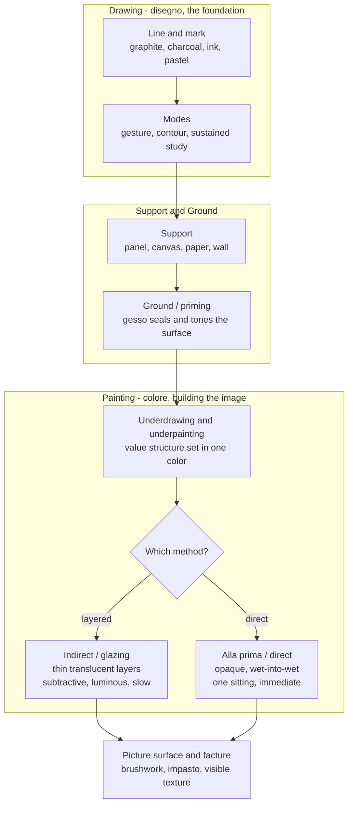

# 🖌️ Painting and Drawing

> [!abstract] TL;DR
> **Drawing** is the foundational discipline of art — the *primacy of line*, the fastest route from eye and mind to marked surface, and the medium in which artists think (Italian **disegno**, both "drawing" and "design"). **Painting** adds the transformative dimension of pigment and value across a **support and ground** — from fresco painted into wet plaster, to egg tempera, to the slow-drying **oil** that unlocked glazing, blending, and impasto, to fast modern acrylic and transparent watercolor. The single deepest lesson is that **the medium shapes the image**: a translucent glaze building color in luminous layers, an opaque alla-prima stroke laid down in one confident pass, and a graphite contour line are three different ways of *thinking with your hands*, each with its own truth, permanence, and surface character.

---

## Intuition

**Analogy first: drawing is handwriting, painting is calligraphy on a prepared page.** When you jot a note, you don't plan each stroke — the pen simply *records your thought* as it happens; the line is the trace of a decision. That is **drawing**: the most immediate, most honest mark, where a single contour can carry gesture, weight, and intention with nothing added. Now imagine writing that same thought as formal calligraphy on a hand-prepared, gessoed page, choosing the ink's transparency, layering washes, letting one stroke glow through the next. That is **painting**: the same impulse to make a mark, but now mediated by a *support* you had to build, a *pigment* whose physics you must respect, and a *sequence of layers* that can take months to dry. Drawing is the sketch of the idea; painting is the idea given body, color, and time.

Push the analogy one step further. A **glaze** is like laying a sheet of colored gel over a photograph — the image below still shows through, but every color is now filtered and deepened. A **direct (alla prima)** stroke is like a strip of opaque tape — it *replaces* what is under it. Master when to filter and when to replace, and you have mastered the grammar of paint.

---

## How It Works

### Drawing: the primacy of line

A drawing exists the instant a marking tool meets a surface. There is no drying, no priming, no palette — which is exactly why drawing is the discipline of *seeing and thinking*. The core variables are:

- **The medium of the mark.** **Graphite** (pencil) gives a controllable gray with a slight sheen, ideal for precise value and detail. **Charcoal** is soft, dark, and erasable-by-smudging — built for bold value masses and gesture. **Ink** (pen, brush) is committed and permanent, forcing decisive line and hatching. **Pastel** (and chalk/conté) is dry pigment in stick form — effectively "drawing with paint," bridging into color.
- **The three modes of drawing.** A **gesture** drawing captures movement and energy in seconds, chasing the *action* not the outline. A **contour** drawing follows the edge of the form slowly and continuously, training hand-eye coordination. A **sustained study** builds full value and structure over hours. Every finished draftsman fluidly shifts among the three.
- **Disegno as thinking.** In the Renaissance, *disegno* meant both the physical act of drawing and the intellectual act of *design* — the artist's conception made visible. This fed the famous **disegno vs colore** debate: the Florentine/Roman school (Michelangelo) held that **line and design** were the intellectual soul of art, while the Venetian school (Titian) championed **colore** — color, tone, and the sensuous handling of paint — as the true carrier of life. It is the oldest argument about whether art is fundamentally *drawn* or *painted*. See [[Renaissance_and_Baroque]].

### Painting: support, ground, medium, layer

A painting is a *stack*. From the bottom up:

1. **The support** — the physical thing painted on: a wooden **panel** (rigid, archival), stretched **canvas** (light, flexible, textured), **paper** (for watercolor and gouache), or a **wall** (fresco).
2. **The ground / priming** — a preparatory coating (traditionally **gesso**) that seals the absorbent support, provides a uniform tone, and gives the paint something to grip. A toned ground also sets the key of the whole picture.
3. **The paint medium** — pigment (colored powder) suspended in a **binder** that glues it to the ground as it dries. *The binder defines the medium and its entire behavior:*
   - **Fresco** — pigment in water painted **into wet lime plaster** (*buon fresco*); as the plaster cures it chemically locks the color into the wall. Extremely permanent but unforgiving — you must finish each patch (*giornata*) before it dries.
   - **Tempera** — pigment bound in **egg yolk**. Fast-drying, luminous, precise; built up in thousands of tiny hatched strokes because it cannot be blended wet. Dominant before oil.
   - **Oil** — pigment in **drying oil** (linseed). The transformative medium: it dries *slowly*, allowing seamless **blending**, transparent **glazing**, thick **impasto**, and endless reworking. This subtlety is exactly what powered the Renaissance and Baroque revolution in realism.
   - **Watercolor** — pigment in gum arabic, used **transparently** on white paper; the paper's white *is* the highlight, and mistakes are hard to hide.
   - **Gouache** — watercolor made **opaque** with added white; flat, matte, correctable.
   - **Acrylic** — pigment in plastic polymer; **fast-drying**, water-thinnable but waterproof when dry, able to mimic both watercolor and oil. The versatile modern default.
   - **Encaustic** — pigment in **hot wax**; luminous and durable (used for the ancient Fayum portraits).
4. **Technique — the two grand strategies.**
   - **Indirect / layered painting:** build the image in stages — an **underdrawing**, a monochrome **underpainting** (e.g., *grisaille*) that fixes the value structure, then transparent **glazes** that add color over the established tones. Slow, luminous, controlled. See value structure in [[Light_Shadow_and_Value]].
   - **Alla prima / direct ("at first attempt"):** finish wet-into-wet in one sitting with opaque, mixed color. Immediate, gestural, alive — the method of the Impressionists and most plein-air work.
5. **Facture and the picture surface.** *Facture* is the visible evidence of the hand — brushwork, drag, impasto ridges, the physical **texture** of application. It is where the painting declares itself an object, not just an image. See [[Texture_Pattern_and_Materiality]].

### The academic hierarchy of genres

For centuries the academies ranked painting *subjects* by intellectual ambition: **history painting** (mythological, religious, historical narrative — the noblest, requiring invention and the human figure) at the top, then **portraiture**, then **genre scenes** (everyday life), then **landscape**, and **still life** at the bottom. The nineteenth century inverted this — the Impressionists and moderns elevated landscape and still life precisely by rejecting the hierarchy.



---

## Key Concepts

### Secondary (foundations)

- **Drawing is the foundation of all visual art** — the discipline of seeing, and the skill every painter, sculptor, and designer trains first.
- **Line** is the most basic element: it can describe an edge, imply motion (gesture), or build value (hatching).
- **Dry vs wet media.** Dry drawing media (pencil, charcoal, pastel) vs wet painting media (oil, watercolor, acrylic).
- **You paint on a prepared surface, not raw material** — a canvas or panel is first *primed* so the paint adheres and does not rot the support.
- **Transparent vs opaque paint.** Watercolor is transparent (the paper glows through); gouache and most oil mixtures are opaque (they cover what is beneath).
- **Warm/cool, light/dark, and mixing** carry over directly from [[Color_Theory]] and [[Light_Shadow_and_Value]].

### Undergraduate (media and technique)

- **The binder makes the medium.** Fresco (lime), tempera (egg), oil (linseed), watercolor/gouache (gum arabic), acrylic (polymer), encaustic (wax) — each dictates drying time, transparency, blendability, and permanence.
- **Why oil changed everything:** slow drying enables *wet-into-wet blending*, *transparent glazing over dry layers*, and *thick impasto* — subtleties impossible in fast-drying tempera or fresco.
- **Glazing (subtractive layering):** a thin transparent colored layer over a *dry* underlayer. Light passes through the glaze, reflects off the layer below, and returns — so each glaze **multiplies** (subtracts from) the reflectance beneath it, producing a luminous depth flat mixing cannot match.
- **Indirect method:** underdrawing → monochrome underpainting (grisaille/verdaccio) that locks the **value** structure → colored glazes on top. Separates the problem of *value* from the problem of *color*.
- **Alla prima / direct method:** finish wet-into-wet in one pass; color is mixed on the palette and laid opaquely. The signature of Frans Hals, Velázquez's late work, and the Impressionists.
- **Facture:** visible brushwork as expressive content — the loaded impasto of Van Gogh vs the invisible, licked surface of an Ingres.
- **The hierarchy of genres** and its nineteenth-century collapse.
- **Drawing modes:** gesture (energy), contour (edge), sustained study (structure and value).

### Graduate (physics, systems, and theory)

- **Subtractive color and the Kubelka-Munk model.** Real pigment layering is governed by absorption and scattering coefficients; the classic **Kubelka-Munk** theory (1931) predicts the reflectance of a paint layer of given thickness over a given ground. Glazing is the thin-transparent limit (high scattering-free transmittance); opaque "hiding" paint is the thick, high-scattering limit. The demo below uses the simplified multiplicative idealization.
- **Alpha compositing** is the digital-painting analogue of layering: the **"over" operator**, `C_out = a·C_src + (1-a)·C_dst`, formalized by Porter and Duff (1984), is precisely a semi-transparent glaze applied per pixel. Digital painting is a mathematical continuation of the layered-media tradition — see the future *Digital Art* note (S06).
- **Disegno vs colore** as a theory of art: is meaning carried by *design/structure* (the intellectual, drawable skeleton) or by *color/handling* (the sensuous, painterly surface)? The debate recurs as line-vs-tone, Poussinistes vs Rubénistes, and Ingres vs Delacroix.
- **Permanence and conservation:** the **fat-over-lean** rule (each oil layer must be more flexible/oil-rich than the one below or it cracks), pigment lightfastness, fresco's chemical bonding vs the fragility of pastel, and why fugitive pigments doom otherwise great works.
- **The support-surface as meaning.** Modernism (Greenberg) argued the flat picture surface and the medium's own physical properties are the true subject of painting — facture becomes content, not accident.
- **Value structure precedes color** (see [[Light_Shadow_and_Value]]) and lives inside composition (see [[Composition_and_Design_Principles]] and [[Space_Perspective_and_Depth]]).

---

## Python Demo

```python
"""
Painting and Drawing -- a numpy/matplotlib study of the media of the mark.

Three linked demonstrations, numpy + matplotlib only:

  1. GLAZING (subtractive layering): starting from a colored underpainting, each
     translucent glaze MULTIPLIES the reflectance beneath it (Beer-Lambert idea --
     the transparent film only subtracts wavelengths, while the ground still
     reflects light back up). We watch the color deepen and shift layer by layer.

  2. GLAZE vs ALLA PRIMA: build a green two ways from the SAME two colorants --
     (a) a luminous transparent yellow glaze over a dry blue underlayer, and
     (b) an opaque direct mixture of blue + yellow pigment made on the palette.
     The glaze keeps more light and reads more luminous; the mix is darker / muddier.

  3. DIGITAL BRUSH (alpha compositing): soft semi-transparent circular strokes are
     composited 'over' a white canvas array -- canvas = (1-a)*canvas + a*color --
     exactly the operator behind every digital-painting app. We show the build-up.
"""
import numpy as np
import matplotlib.pyplot as plt

# ---------------------------------------------------------------------------
# 1. GLAZING: each translucent layer multiplies the reflectance below it
# ---------------------------------------------------------------------------
def glaze_stack(ground, transmittance, n_layers):
    """Reflectance after 0..n glazes. Subtractive: R_k = R_{k-1} * T."""
    R = np.array(ground, float)
    T = np.array(transmittance, float)
    history = [R.copy()]
    for _ in range(n_layers):
        R = R * T                      # transparent film subtracts; ground still reflects
        history.append(R.copy())
    return np.clip(np.array(history), 0, 1)

blue_ground  = [0.16, 0.26, 0.85]      # a blue underpainting
yellow_glaze = [0.98, 0.94, 0.42]      # transparent warm glaze (most light passes through)
layers = glaze_stack(blue_ground, yellow_glaze, n_layers=6)

# ---------------------------------------------------------------------------
# 2. GLAZE vs ALLA PRIMA for the same two colorants
# ---------------------------------------------------------------------------
blue_pig   = np.array([0.16, 0.26, 0.85])   # opaque blue pigment reflectance
yellow_pig = np.array([0.90, 0.85, 0.16])   # opaque yellow pigment reflectance
yellow_T   = np.array([0.98, 0.94, 0.42])   # the same yellow as a TRANSPARENT glaze

glaze_green     = np.clip(blue_pig * yellow_T,   0, 1)  # transparent yellow over dry blue
allaprima_green = np.clip(blue_pig * yellow_pig, 0, 1)  # opaque blue+yellow mixed first

# ---------------------------------------------------------------------------
# 3. DIGITAL BRUSH: alpha-composite soft round strokes 'over' a white canvas
# ---------------------------------------------------------------------------
H = W = 260
def paint(strokes):
    canvas = np.ones((H, W, 3))                          # white ground
    yy, xx = np.mgrid[0:H, 0:W]
    for cx, cy, rad, color, alpha in strokes:
        d = np.sqrt((xx - cx) ** 2 + (yy - cy) ** 2)
        soft = np.clip(1.0 - d / rad, 0.0, 1.0) ** 1.5   # soft-edged bristle falloff
        a = (alpha * soft)[..., None]
        canvas = (1.0 - a) * canvas + a * np.array(color)  # the 'over' operator
    return np.clip(canvas, 0, 1)

rng = np.random.default_rng(7)
strokes = []
for i in range(60):                                       # build form with layered strokes
    cx = 130 + 70 * np.cos(i / 9.0) + rng.normal(0, 8)
    cy = 130 + 70 * np.sin(i / 9.0) + rng.normal(0, 8)
    color = np.array([0.85, 0.35 + 0.4 * (i / 60), 0.20]) # warm build-up
    strokes.append((cx, cy, 42, color, 0.16))
snapshots = [paint(strokes[:k]) for k in (6, 24, 60)]

# ---------------------------------------------------------------------------
# Render
# ---------------------------------------------------------------------------
fig = plt.figure(figsize=(13, 8))
fig.suptitle("Painting and Drawing: glazing vs alla prima, and alpha-composited brushwork",
             fontsize=13, fontweight="bold")

ax = fig.add_subplot(2, 3, 1)                              # glaze build-up swatches
ax.imshow(layers[None, :, :], aspect="auto")
ax.set_title("Glaze build-up (each layer multiplies)")
ax.set_yticks([]); ax.set_xticks(range(len(layers)))
ax.set_xticklabels([f"L{n}" for n in range(len(layers))])

ax = fig.add_subplot(2, 3, 2)                              # per-channel reflectance
for c, name in zip(range(3), ("R", "G", "B")):
    ax.plot(layers[:, c], marker="o", label=name)
ax.set_title("Reflectance falls per channel")
ax.set_xlabel("glaze layers"); ax.set_ylabel("reflectance"); ax.legend()

ax = fig.add_subplot(2, 3, 3)                              # glaze vs alla prima
ax.imshow(np.array([[glaze_green, allaprima_green]]), aspect="auto")
ax.set_title("Same colorants:\nglaze (left) vs direct mix (right)")
ax.set_xticks([0, 1]); ax.set_xticklabels(["glaze", "direct mix"]); ax.set_yticks([])

for j, (snap, k) in enumerate(zip(snapshots, (6, 24, 60))):  # brush build-up
    ax = fig.add_subplot(2, 3, 4 + j)
    ax.imshow(snap)
    ax.set_title(f"Alpha brush build-up: {k} strokes")
    ax.axis("off")

plt.tight_layout(rect=[0, 0, 1, 0.95])
plt.show()

print("Glaze green   RGB:", np.round(glaze_green, 3),
      " sum:", round(float(glaze_green.sum()), 3), " (more luminous)")
print("Alla-prima    RGB:", np.round(allaprima_green, 3),
      " sum:", round(float(allaprima_green.sum()), 3), " (darker / muddier)")
```

**What to notice when you run it:** the glaze build-up (top-left) shows the blue ground turning green then deep olive as the yellow glaze *multiplies* the reflectance layer by layer — the line plot proves it: the blue channel collapses fastest because the yellow glaze absorbs blue. The center swatch is the payoff: from the *same two colorants*, the transparent glaze produces a more **luminous** green (higher total reflectance) than the opaque direct mix, which is darker and muddier — the physical reason master painters glazed for jewel-like depth. The bottom row shows the digital brush: semi-transparent strokes composited with the **"over" operator** build up opacity and form exactly as layered paint does.

---

## Real-World Applications

- **Old Master painting.** Jan van Eyck and, later, Titian and Rembrandt built flesh and fabric with a monochrome underpainting followed by transparent **glazes** — the luminous depth of a Vermeer or a Rembrandt is subtractive layering, not surface mixing. See [[Renaissance_and_Baroque]].
- **Fresco cycles.** Michelangelo's Sistine Ceiling and Giotto's chapels are *buon fresco* — painted into wet plaster in daily patches (*giornate*), which is why they have survived 500+ years locked into the wall.
- **Plein-air and Impressionism.** Portable tube paint plus the **alla prima** method let Monet and the Impressionists finish canvases outdoors in one sitting, chasing changing light with broken, opaque strokes.
- **Concept art, film, and games.** Digital painting in Photoshop, Procreate, and Krita is built entirely on **alpha compositing** and layers — the identical logic of glazes, now per-pixel and non-destructive. A future *Digital Art* note (S06) treats this directly.
- **Illustration and design.** Watercolor (transparent) for botanical and architectural rendering; gouache (opaque, flat) for editorial and animation backgrounds; acrylic for its speed and durability across murals and canvases.
- **Drawing as thinking everywhere.** Architects, industrial designers, and animators still **draw** to ideate — *disegno* as design remains the fastest interface between mind and image.
- **Art conservation.** Understanding the medium (fat-over-lean cracking, fresco salts, fugitive pigments) governs how conservators clean, stabilize, and restore paintings without destroying facture.

---

## Common Pitfalls

- **Skipping drawing.** Rushing to color before you can *draw* — see and structure form in line and value — produces paintings with weak underlying design. Value and drawing come first; color is applied to a sound skeleton.
- **Glazing over wet paint.** A glaze only works over a **dry** underlayer; brush transparent color into a wet one and you just muddy-mix them, losing the luminous layered effect entirely.
- **Violating fat-over-lean.** In oils, a lean (low-oil) layer painted over a fat (oil-rich) one dries and shrinks at different rates and **cracks**. Each successive layer must be *more* flexible/oil-rich than the last.
- **Confusing transparent and opaque intentions.** Trying to "cover" a dark area with a transparent color (it won't hide) or trying to build luminous depth with opaque paint (it goes muddy). Know which pigments are transparent and which are opaque.
- **Overworking alla prima.** Direct painting lives on the freshness of decisive strokes; endless reworking of half-dry opaque paint turns wet-into-wet vitality into gray mud.
- **Ignoring the ground.** Painting on unprimed or wrongly toned support causes sinking, poor adhesion, and a fight against the surface tone the whole way.
- **Treating facture as accident.** Slick, hyper-blended finishing kills the expressive information in brushwork; conversely, random texture with no structure reads as noise. Facture should be *chosen*.
- **Using fugitive media for permanence.** Building a "finished" work in unfixed pastel or fugitive dye-based pigment and expecting it to last — pastel smudges, cheap reds fade. Match the medium to the required permanence.

---

## Related Concepts

- [[Light_Shadow_and_Value]] — the value structure that the underpainting and glazing method is built to establish first; drawing and grisaille are pure value work.
- [[Color_Theory]] — subtractive mixing, transparent vs opaque pigment, and warm/cool relationships are the physics that glazing and palette-mixing exploit.
- [[Renaissance_and_Baroque]] — where oil paint, sfumato, and glazing revolutionized realism, and where the *disegno vs colore* debate was fought.
- [[Composition_and_Design_Principles]] — *disegno* as design: arranging the drawn and painted image so the eye is led and the whole coheres.
- [[Space_Perspective_and_Depth]] — linear and atmospheric perspective, the drawn and painted techniques for holding measurable space on a flat surface.
- [[Texture_Pattern_and_Materiality]] — facture, impasto, and the picture surface as physical object; the "materiality" of the marked medium.

> Companion notes in this vault (to be cross-linked once created): *Line, Shape, and Form* (the primacy of line, S02) and *Digital Art* (alpha compositing and painting software as the continuation of layered media, S06).

---

## Review Questions

1. **(Secondary)** Why do art teachers insist that *drawing* is the foundation for *painting*? Name three dry drawing media and three wet painting media, and give one property that distinguishes each medium.
2. **(Undergraduate)** Explain the difference between the **indirect (glazing)** method and the **alla prima (direct)** method. Using the idea of subtractive color, describe *why* a transparent glaze of yellow over a dry blue underlayer produces a more luminous green than physically mixing the same blue and yellow pigment on the palette.
3. **(Graduate)** The digital "over" operator is `C_out = a·C_src + (1-a)·C_dst`. Explain how this is the per-pixel analogue of applying a semi-transparent glaze, and relate it to the Kubelka-Munk description of a real transparent paint layer over a ground. Then connect the *disegno vs colore* debate to the choice between line-first (drawn) and tone-first (painterly) approaches — which side does the layered glazing method philosophically favor, and why?

---

## Sources

- Ralph Mayer, *The Artist's Handbook of Materials and Techniques*, 5th ed. (Viking, 1991) — the standard reference on supports, grounds, binders, media, and permanence.
- Kimberley Reynolds and Michael Seymour / National Gallery, *Making and Meaning* and the NG technical bulletins — how Old Masters built paintings in underdrawing, underpainting, and glaze layers.
- Betty Edwards, *The New Drawing on the Right Side of the Brain* (Tarcher/Putnam, 1999) — drawing as seeing: gesture, contour, and sustained study.
- Thomas Porter and Tom Duff, "Compositing Digital Images," *Computer Graphics (SIGGRAPH)* 18(3), 1984 — the "over" operator behind alpha compositing and digital painting.
- Paul Kubelka and Franz Munk, "Ein Beitrag zur Optik der Farbanstriche," *Zeitschrift für technische Physik*, 1931 — the physics of reflectance for pigmented layers over a ground.

---

#aesthetics #painting #drawing #media #technique
