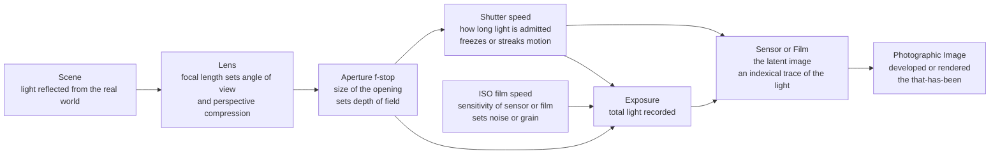

# 📷 Photography and the Photographic Image

> [!abstract] TL;DR
> A photograph is made by letting focused light from a real scene fall on a light-sensitive surface — the same principle as the ancient **camera obscura**, now governed by the **exposure triangle** of aperture, shutter speed, and ISO. That mechanical origin gives photography two revolutionary properties. First, it *freed painting* from the job of accurate recording and pushed it toward abstraction ([[Modern_Art_Movements]]). Second, it gives the image a peculiar bond to reality: unlike a painting, a photograph is an **index** — a physical *trace* left by light that actually reflected off a thing that was there. Barthes called this the *that-has-been*. Everything interesting about photography — its power as evidence, its aesthetics, and today's crisis of AI-generated fakes — flows from that single strange fact.

---

## Intuition

**Analogy first — the sun-print and the shadow.** Leave a leaf on a piece of dark construction paper on a sunny windowsill for a day. When you lift the leaf, its shape is bleached into the paper: a pale leaf-ghost where the object blocked the light. Nobody *drew* that leaf. The leaf itself, plus sunlight, made the picture by physically acting on the paper. A photograph is exactly this, sped up and focused: light bouncing off a face travels through a lens and physically alters a sensor, leaving a trace of *that particular face on that particular afternoon*. This is why a photo feels different from a painting of the same face. A painter can invent a face that never existed; a photograph is a **fingerprint pressed by reality**. The whole philosophy of photography — Barthes' "the thing was there," documentary's power as evidence, the shock of a deepfake — grows from the leaf on the paper.

Now add a control: how *wide* you open the window, how *long* you leave the leaf, and how *sensitive* the paper is together decide how bright and how sharp the print comes out. Those three dials are the **exposure triangle**, and each one leaves its own aesthetic signature — soft blurred backgrounds, frozen or streaking motion, clean or grainy tone.

---

## How It Works

### The camera obscura: the 2000-year-old core

The physics is ancient. Light travels in straight lines, so if you make a *small* hole in the wall of a dark room, rays from the top of the outside scene cross through the hole and land at the bottom of the opposite wall, and vice versa — projecting an upside-down, full-color, moving image of the world outside. This is the **camera obscura** (Latin for "dark chamber"), described by Mozi in ancient China and by Aristotle, refined by the physicist Ibn al-Haytham (Alhazen, c. 1020), and used as a drawing aid by Renaissance and Baroque painters (Vermeer's uncanny optical realism is widely thought to owe it a debt). A **lens** in place of the pinhole gathers far more light and produces a brighter, sharper image. Photography is nothing but a camera obscura with a chemically or electronically **light-sensitive surface** placed where the projected image falls — so the fleeting projection can be *fixed* permanently. The missing piece for centuries was not the optics but a way to *keep* the picture, solved by Niépce (c. 1826), Daguerre (1839), and Talbot's negative–positive process (1841).

### The exposure triangle: three dials, one exposure, three aesthetics

A correct exposure means the sensor receives the right *total amount* of light. Three controls set that total, and — crucially — different combinations give the *same* brightness but *different looks*:

1. **Aperture (f-stop)** — the diameter of the lens opening, written as an f-number like f/2 or f/16. Confusingly, a *smaller* f-number means a *larger* hole and more light. Aperture also sets **depth of field**: a wide aperture (f/1.8) throws the background into soft blur (shallow depth of field, the classic portrait "bokeh"); a narrow aperture (f/16) keeps foreground and background both sharp (deep depth of field, the landscape look).
2. **Shutter speed** — how long the sensor is exposed, e.g. 1/1000 s or 1 s. A fast shutter **freezes** motion (a hummingbird's wing); a slow shutter lets moving things **streak** into motion blur (silky waterfalls, light trails).
3. **ISO (film speed)** — the sensitivity, or gain, of the sensor or film. Low ISO (100) gives clean tone; high ISO (6400) lets you shoot in the dark but amplifies **noise** (digital) or **grain** (film) along with the signal.

The three trade off along a line of **equivalent exposures** governed by reciprocity: total light is proportional to shutter time and ISO and inversely proportional to the square of the f-number. Open the aperture one stop (doubling the area) and you must halve the shutter time to keep the same exposure — same brightness, but now a blurred background *and* frozen motion. Every photograph is a choice of *where on that line to stand*, and that choice is aesthetic, not just technical.

### Focus, focal length, and the latent image

The **lens** focuses rays from one subject distance to a sharp point on the sensor; objects nearer or farther blur, and the range that looks acceptably sharp is the depth of field. **Focal length** sets the angle of view: short (wide-angle, 24 mm) sees a broad scene and exaggerates near-far size differences; long (telephoto, 200 mm) crops in tight and *compresses* space, flattening depth. The light that lands on film chemically forms an invisible **latent image** in silver-halide crystals, made visible only by development; on a digital sensor the same photons free electrons whose charge is read out as pixel values ([[Image_Representations]]). Either way the image is a *record left by photons* — the point the ontology section returns to.



The diagram shows the two things happening at once: a **light path** from scene to image, and the **three exposure controls** all feeding one shared exposure budget. Aperture sits on both — it meters light *and* shapes depth of field, which is why it is the photographer's most expressive dial.

---

## Key Concepts

### Secondary Level

- **A camera is a controlled camera obscura.** A dark box, a small opening (with a lens), and a light-sensitive surface. The image is real light from the world, focused and then fixed in place.
- **The exposure triangle in plain terms.** Aperture = how wide the hole is (also blurs or sharpens the background). Shutter = how long the light comes in (also freezes or blurs movement). ISO = how sensitive the film/sensor is (higher = works in the dark but adds grainy speckle). Together they decide how bright the photo is.
- **A photo is different from a painting.** A painting is made by a hand and can show something imaginary. A photograph is made by *light off a real thing* — so we tend to trust it as proof that "this really was there."
- **Is photography art?** When cameras appeared in 1839, many said "no — a machine just copies, there's no skill or soul." Today photography is unquestionably a fine art (galleries, million-dollar prints), but that debate — *machine-made versus hand-made* — shaped its whole history.

### Undergraduate Level

- **f-stops and reciprocity.** Full stops (f/1.4, f/2, f/2.8, f/4, f/5.6, f/8, f/11, f/16, f/22) each *halve* the light of the previous one, because the f-number is focal length divided by aperture diameter and light scales with *area*. Shutter and ISO also move in stops (halving/doubling). This shared "stop" currency is what makes equivalent exposures possible: trade one stop of aperture for one stop of shutter and the exposure is unchanged.
- **Depth of field, quantitatively.** Shallow depth of field comes from a *wide aperture*, a *long focal length*, and a *close subject*; deep depth of field from the opposite. It is the photographer's main tool for **isolating a subject** from its surroundings — the eye is forced to the one sharp plane.
- **Focal length is not zoom of perspective.** Perspective (how big near things look versus far things) depends on *where you stand*, not the lens; the lens only crops. But because photographers change lens *and* distance together, telephoto shots look "compressed" and wide-angle shots look "stretched." (See [[Space_Perspective_and_Depth]].)
- **The Zone System (Ansel Adams).** A rigorous method for **controlling tonal value**: the tonal range is divided into eleven **zones** (0 = pure black to X = paper white), each a full stop of luminance apart, with Zone V as middle gray (18 percent reflectance). The photographer *previsualizes* where each part of the scene should land and exposes/develops to place it there. It is essentially a disciplined value scale for photography — the exact bridge to [[Light_Shadow_and_Value]].
- **The genres.** *Portrait* (the human face and presence), *documentary / photojournalism* (witnessing events, with an ethic of truth), *street* (candid public life, Cartier-Bresson's "decisive moment"), *landscape* (Adams, the sublime in nature), *fashion / advertising* (constructed desire), *fine-art / conceptual* (the photograph as idea, not record). Each genre negotiates the medium's realism differently — documentary leans on it, conceptual art plays against it.

### Graduate Level

- **The photograph as index (Peirce).** Semiotics distinguishes three sign types: the **icon** (resembles its object, like a portrait painting), the **symbol** (arbitrary convention, like a word), and the **index** (physically *caused by* its object, like smoke, a footprint, or a weathervane). The photograph's defining trait is that it is an **index**: it is causally connected to its referent by light. A painting of a unicorn is a coherent icon of nothing real; a photograph is a physical *deposit* of something that stood before the lens. This is the deep source of photography's evidentiary authority — and it plugs directly into the sign theory in [[Iconography_and_Semiotics_of_Art]].
- **Bazin's ontology.** André Bazin ("The Ontology of the Photographic Image," 1945) argued that photography satisfies an ancient human craving to *preserve* reality against time — a "mummy complex" — and that its psychological power comes precisely from the *absence of the human hand*: because a machine, not an artist, produces the image, we credit it with objectivity. Photography, he says, "embalms time." Bazin wrote this as the founding ontology of *cinema* too; the argument bridges directly to [[Film_and_the_Moving_Image]].
- **Barthes' *Camera Lucida*.** Roland Barthes locates the essence of photography in the **that-has-been** (*ça-a-été*): every photograph certifies "the thing was there, and it is now past." He splits our response into the **studium** (the cultural, coded, general interest of a photo — its subject, its politics, what we *study*) and the **punctum** (the accidental, piercing detail that *wounds* the individual viewer — a specific pair of shoes, a gesture — that no code explains). Grief animates the book: a photograph is always a little death, a return of the dead moment.
- **Sontag's critique.** Susan Sontag (*On Photography*, 1977) is the skeptic. To photograph is to *appropriate* and to *aestheticize*; the camera turns experience into images and can numb as much as it reveals ("the more you look, the less you feel"). She warns that the photograph's air of truth is itself an ideology — the image is always framed, selected, and interested.
- **Benjamin's aura and mechanical reproduction.** Walter Benjamin (1935) argued that **mechanical reproduction** (photography, film) strips the artwork of its **aura** — the unique presence of an original in time and place — by making infinite identical copies with no "original." He saw this as *politically double-edged*: it demystifies art and can democratize it, but reproducibility is also weaponized by spectacle and propaganda — the argument developed at length in [[Art_Society_and_Politics]].
- **The truth/manipulation problem — old and new.** Photographs have *never* been innocent: framing, choice of moment, staging (the "moved" Civil War corpse), darkroom dodging and burning, and airbrushing out purged Soviet officials are as old as the medium. Digital editing made manipulation frictionless; **generative AI and deepfakes** now sever the indexical link entirely — a synthetic "photograph" of an event that never happened, with *no light and no referent behind it* (see [[Stable_Diffusion_Architecture]]). This is a genuine epistemic crisis: the *that-has-been* that grounded photographic trust can now be perfectly faked.
- **Digital and computational imaging.** A modern smartphone photo is barely a single exposure: it is a *computed* image fused from many frames — HDR bracketing, multi-frame denoising, deep-learned tone mapping, and simulated depth of field ("portrait mode") produced by a depth network rather than a lens (see [[Depth_Estimation_Deep]]). Computational photography quietly shifts the medium from *recording* light toward *inferring* a pleasing image, further loosening the indexical bond.
- **"Is photography art?" as a genuine theoretical problem.** The debate is not naive. If art requires *intentional expression* and photography merely *records*, is the photographer an artist or a selector? Pictorialism (c. 1900) answered by making photos *look like* soft paintings; **straight photography** (Stieglitz, Weston, Adams) answered the opposite way — by embracing sharp, un-painterly optical fidelity as photography's *own* aesthetic. The medium won the argument by proving that *selection, framing, timing, and tonal control* are expressive acts (connects to [[What_Is_Art]]).

---

## Python Demo

```python
"""
Photography and the Photographic Image -- a numpy/matplotlib study.

Six panels, using only numpy and matplotlib:
  1. Equivalent exposures: the reciprocity curve. For a fixed exposure, shutter time
     rises with the square of the f-number; higher ISO shifts the whole curve down.
     Every point on one curve is the SAME brightness but a different look.
  2. The Ansel Adams Zone System value scale (Zone 0 black -> Zone X white).
  3. Zone vs relative luminance: even PRINT steps correspond to a DOUBLING of scene
     luminance each zone -- the whole point of the zone system.
  4. Deep depth of field  (narrow aperture, f/16): subject AND background sharp.
  5. Shallow depth of field (wide aperture, f/1.8): subject sharp, background blurred.
  6. Motion blur from a slow shutter: the moving subject streaks over a sharp scene.
"""
import numpy as np
import matplotlib.pyplot as plt

rng = np.random.default_rng(7)

# ---------- tiny numpy image toolbox ----------------------------------------
def gaussian_kernel1d(sigma):
    radius = max(1, int(3 * sigma))
    x = np.arange(-radius, radius + 1)
    k = np.exp(-(x ** 2) / (2 * sigma ** 2))
    return k / k.sum()

def blur(img, sigma):
    """Separable Gaussian blur -- simulates optical defocus (bokeh)."""
    if sigma <= 0:
        return img.copy()
    k = gaussian_kernel1d(sigma)
    out = np.apply_along_axis(lambda m: np.convolve(m, k, mode="same"), 1, img)
    out = np.apply_along_axis(lambda m: np.convolve(m, k, mode="same"), 0, out)
    return out

def motion_blur(img, length, axis=1):
    """Directional averaging -- simulates a subject moving during a long exposure."""
    acc = np.zeros_like(img)
    for s in range(length):
        acc += np.roll(img, s - length // 2, axis=axis)
    return acc / length

# ---------- build a synthetic scene: a subject in front of bokeh lights ------
H, W = 240, 360
yy, xx = np.mgrid[0:H, 0:W]

background = np.zeros((H, W))
for _ in range(45):                      # scatter bright out-of-focus points
    cy, cx = rng.uniform(0, H), rng.uniform(0, W)
    r, amp = rng.uniform(4, 9), rng.uniform(0.4, 1.0)
    background += amp * np.exp(-(((xx - cx) ** 2 + (yy - cy) ** 2) / (2 * r ** 2)))
background = np.clip(background, 0, 1) * 0.75 + 0.05

subj_cy, subj_cx, subj_r = H * 0.52, W * 0.30, 34
subj_mask = (xx - subj_cx) ** 2 + (yy - subj_cy) ** 2 <= subj_r ** 2
subject = np.where(subj_mask, 0.93, 0.0)

def compose(bg_sigma):
    """Subject stays sharp; background blurs by the chosen aperture amount."""
    bg = blur(background, bg_sigma)
    return np.where(subj_mask, 0.93, bg)

deep_dof    = compose(0.6)               # f/16  -> everything sharp
shallow_dof = compose(6.0)               # f/1.8 -> soft, isolated subject
streak      = motion_blur(subject, 41)   # the subject moves during a slow shutter
motion      = np.maximum(blur(background, 0.6), streak)

# ---------- figure -----------------------------------------------------------
fig, ax = plt.subplots(2, 3, figsize=(15, 9))
fig.suptitle("Photography: the exposure triangle, the zone system, and its aesthetics",
             fontsize=14, fontweight="bold")

# (1) equivalent exposures -- reciprocity curve
fstops = np.array([1.4, 2, 2.8, 4, 5.6, 8, 11, 16, 22])
k_exp = 0.05                                   # exposure constant  H = t*ISO/N^2
for S, col in zip([100, 400, 1600], ["#1f77b4", "#2ca02c", "#d62728"]):
    t = k_exp * fstops ** 2 / S                # shutter time for equal exposure
    ax[0, 0].loglog(fstops, t, "o-", color=col, label=f"ISO {S}")
ax[0, 0].set_title("Equivalent exposures (reciprocity)\n"
                   "same brightness, different look")
ax[0, 0].set_xlabel("aperture f-number  (larger = smaller hole)")
ax[0, 0].set_ylabel("shutter time (s), log scale")
ax[0, 0].set_xticks(fstops)
ax[0, 0].set_xticklabels([str(f) for f in fstops], fontsize=7)
ax[0, 0].grid(True, which="both", alpha=0.3)
ax[0, 0].legend(fontsize=8)
ax[0, 0].annotate("wide + fast\nblur bg, freeze",
                  xy=(fstops[1], k_exp * fstops[1] ** 2 / 100),
                  xytext=(2.2, 5e-4), fontsize=7,
                  arrowprops=dict(arrowstyle="->", color="0.4"))
ax[0, 0].annotate("narrow + slow\ndeep DoF, motion blur",
                  xy=(fstops[-1], k_exp * fstops[-1] ** 2 / 100),
                  xytext=(6, 0.35), fontsize=7,
                  arrowprops=dict(arrowstyle="->", color="0.4"))

# (2) Zone System value scale
zones = np.arange(0, 11)
roman = ["0", "I", "II", "III", "IV", "V", "VI", "VII", "VIII", "IX", "X"]
bar = np.repeat((zones / 10.0)[None, :], 24, axis=0)
ax[0, 1].imshow(bar, cmap="gray", vmin=0, vmax=1, aspect="auto")
ax[0, 1].set_title("Zone System value scale\nZone 0 black  ->  Zone X white")
ax[0, 1].set_yticks([])
ax[0, 1].set_xticks(zones)
ax[0, 1].set_xticklabels(roman)
ax[0, 1].axvline(5, color="#d62728", lw=1.5)
ax[0, 1].text(5, -1.4, "Zone V = middle gray", color="#d62728",
              fontsize=8, ha="center")

# (3) zone vs luminance -- doubling per zone
lum = 0.18 * 2.0 ** (zones - 5)                # relative scene luminance
ax[0, 2].semilogy(zones, lum, "s-", color="#7c3aed")
ax[0, 2].axhline(0.18, color="0.6", ls="--", lw=1)
ax[0, 2].text(0.1, 0.20, "18% middle gray (Zone V)", fontsize=8, color="0.4")
ax[0, 2].set_title("Even print steps = doubling of\nscene luminance each zone")
ax[0, 2].set_xlabel("zone")
ax[0, 2].set_ylabel("relative luminance (log)")
ax[0, 2].set_xticks(zones)
ax[0, 2].set_xticklabels(roman)
ax[0, 2].grid(True, which="both", alpha=0.3)

# (4)-(6) the aesthetic simulations
for a, im, title in [(ax[1, 0], deep_dof,    "Narrow aperture f/16\ndeep depth of field"),
                     (ax[1, 1], shallow_dof, "Wide aperture f/1.8\nshallow depth of field (bokeh)"),
                     (ax[1, 2], motion,      "Slow shutter\nmotion blur streaks the subject")]:
    a.imshow(im, cmap="gray", vmin=0, vmax=1)
    a.set_title(title)
    a.axis("off")

plt.tight_layout(rect=[0, 0, 1, 0.95])
plt.savefig("photography_exposure_and_zones.png", dpi=120, bbox_inches="tight")
print("Saved photography_exposure_and_zones.png")
print(f"At ISO 100, f/2 needs t = {k_exp * 4 / 100:.4f}s (1/{int(100/(k_exp*4)):d}); "
      f"stopping down to f/16 needs t = {k_exp * 256 / 100:.3f}s -- "
      f"{(256/4):.0f}x longer for the same exposure.")
```

**What to notice when you run it.** The reciprocity curve is a straight line on log-log axes (slope 2): closing the aperture demands a *quadratically* longer shutter, and every point on one ISO line is the *same brightness* — you buy a blurred background and a slower shutter with the same light. Raising ISO drops the whole curve, letting you shoot faster/darker at the cost of noise. The zone bar climbs in *even perceptual steps*, but the luminance plot beside it *doubles each zone* — the essence of the Zone System. Finally the three simulated frames show the aesthetics the triangle buys: deep-focus everything-sharp, shallow-focus subject isolation, and the streak of a slow shutter.

---

## Real-World Applications

- **Photojournalism and the law of evidence.** Documentary photography, press photos, forensic and crime-scene imaging, and courtroom evidence all rest on the photograph's **indexical** authority — the presumption that light from a real event made the picture. Wire-service ethics codes (Reuters, AP) ban compositing and heavy editing precisely to protect that trust.
- **Smartphone computational photography.** Night mode (multi-frame stacking), HDR (exposure bracketing), and **portrait mode** (neural depth estimation faking a shallow-DoF lens) are the exposure triangle re-implemented in software — see [[Depth_Estimation_Deep]] and [[Image_Representations]].
- **Scientific and medical imaging.** Astrophotography (long exposures, high ISO), microscopy, X-ray and MRI reconstruction, and remote sensing all inherit exposure, focus, and noise trade-offs directly from photographic physics.
- **Advertising, fashion, and the construction of desire.** Studio lighting, retouching, and lens choice manufacture idealized images — a domain where the *manipulation* Sontag warned of is the entire point, and where "un-retouched" labeling laws are now debated.
- **Computer vision datasets and generative AI.** Cameras are the sensors that feed nearly all vision models; conversely, diffusion models now *synthesize* photorealistic images with no referent, driving both creative tools and the **deepfake-detection** arms race ([[Stable_Diffusion_Architecture]]).
- **Fine-art market and archives.** Gelatin-silver and platinum prints, editioned photographs, and vast documentary archives (FSA, Magnum) make photography both a blue-chip art form and the primary visual memory of the modern world.

---

## Common Pitfalls

- **"Bigger f-number = more light."** Backwards. f/2 is a *wide* opening (lots of light, shallow DoF); f/16 is a *tiny* opening (little light, deep DoF). The f-number is a *denominator* (focal length ÷ diameter), so larger number = smaller hole.
- **"ISO brightens the exposure."** ISO does not gather more light — it *amplifies* the signal already captured (gain), amplifying **noise** along with it. Raising ISO is a last resort after aperture and shutter, not a free brightness knob.
- **"Focal length changes perspective."** Perspective is set by *camera-to-subject distance*, not the lens. A telephoto does not "compress" space by itself; you compress space by standing farther back, and the long lens merely crops. Confusing the two produces wrong intuitions about wide-angle "distortion."
- **"The camera never lies."** Every photograph is framed, timed, exposed, and toned by choices — and always *excludes* whatever lay outside the frame. Even before digital editing, selection is interpretation. Indexicality guarantees *something was there*, not that the image is *true or complete*.
- **Treating a smartphone shot as a single optical exposure.** Modern "photos" are computed fusions with AI tone-mapping and fake bokeh; the pixels are partly *inferred*, not purely recorded — relevant to any claim about photographic authenticity.
- **Reciprocity failure (film) and clipping (digital).** On film, very long exposures stop obeying the neat reciprocity math (the emulsion loses sensitivity); on digital sensors, blown highlights clip to pure white with *no recoverable data*. Both break the tidy "one stop = double" model at the extremes.
- **Confusing the punctum with the subject.** Barthes' *punctum* is an accidental, personal detail that pierces *you*, not the photo's official theme (the *studium*). Students often mislabel the obvious subject as the punctum, missing the point of the distinction.

---

## Related Concepts

- [[Modern_Art_Movements]] — the single deepest link: photography "solved" accurate representation and thereby *freed painting* to pursue abstraction, expression, and medium-autonomy. The camera is the offstage engine of modern art.
- [[Light_Shadow_and_Value]] — the Zone System is a disciplined *value scale for photography*; previsualizing tonal placement is the same value-control craft, formalized for exposure and development.
- [[Space_Perspective_and_Depth]] — focal length, perspective compression, and depth of field are photographic controls over the very depth cues catalogued there.
- [[Composition_and_Design_Principles]] — framing, the rule of thirds, the "decisive moment," and focal-point control are composition applied through the viewfinder.
- [[Iconography_and_Semiotics_of_Art]] — Peirce's icon/index/symbol trichotomy; the claim that the photograph is an *index* is the semiotic root of its evidentiary power.
- [[Art_Society_and_Politics]] — Benjamin's aura and mechanical reproduction, and photography's double life as democratizing medium and propaganda tool.
- [[Film_and_the_Moving_Image]] — the moving image is photography extended in time; Bazin's photographic ontology is the founding theory of both.
- [[What_Is_Art]] — the "is photography art?" debate (machine record versus intentional expression) is a live test case for essence-based definitions of art.
- [[Geometric_and_Wave_Optics]] — the physics of lenses, focal length, aperture, focus, and the diffraction that ultimately limits sharpness at tiny apertures.
- [[Image_Representations]] — how the sensor's captured light becomes a digital pixel array (Bayer mosaic, channels), the modern successor to the latent image.
- [[Depth_Estimation_Deep]] — how "portrait mode" fakes optical shallow depth of field with a learned depth map instead of a wide lens.
- [[Stable_Diffusion_Architecture]] — generative models that synthesize photorealistic images *with no referent*, severing the indexical bond and driving the deepfake crisis.

---

## Review Questions

### Secondary
1. Explain how a camera obscura works and why a photograph is more like a "leaf-print made by light" than like a drawing.
2. Name the three parts of the exposure triangle and give the *aesthetic* side effect of each (not just its effect on brightness).

### Undergraduate
1. You photograph a runner. You want a *blurred, isolated* background but must *freeze* the runner sharply, keeping the same exposure. Which way do you move each of aperture, shutter, and ISO, and what does each change cost you? Use the language of stops and reciprocity.
2. Explain the Zone System: what are the zones, what does Zone V represent, and how does it connect the ideas in [[Light_Shadow_and_Value]] to a real exposure decision? Why do *even* print steps correspond to *doubling* scene luminance?
3. Distinguish focal length from perspective. Why is it wrong to say a telephoto lens "compresses" space on its own?

### Graduate
1. Using Peirce's icon/index/symbol trichotomy, explain in what precise sense a photograph is an *index* and a painting is not, and why this grounds photography's authority as evidence. Then explain how generative AI "photographs" break this — what exactly is missing behind the pixels?
2. Compare Bazin's, Barthes', and Sontag's accounts of the photographic image (the "mummy complex"/embalmed time, the *that-has-been* with *studium* and *punctum*, and the appropriative/aestheticizing critique). Which most convincingly explains why we grieve over photographs of the dead, and why?
3. Apply Benjamin's argument about aura and mechanical reproduction to *digital* photography and social media. Does an image with no "original" negative and infinite identical copies still lose its aura — or has computational and networked imaging changed what aura even means?

---

## Sources

- Roland Barthes, *Camera Lucida: Reflections on Photography* (trans. R. Howard, Hill and Wang, 1981; French orig. 1980) — the *that-has-been*, studium and punctum.
- Susan Sontag, *On Photography* (Farrar, Straus and Giroux, 1977) — the ethics and epistemology of the photographic image.
- André Bazin, "The Ontology of the Photographic Image" (1945), in *What Is Cinema? Vol. 1* (trans. H. Gray, University of California Press, 1967).
- Walter Benjamin, "The Work of Art in the Age of Mechanical Reproduction" (1935), in *Illuminations* (Schocken, 1968).
- Ansel Adams, *The Negative* (New York Graphic Society / Little, Brown, 1981) — the Zone System, previsualization, and tonal control.
- Beaumont Newhall, *The History of Photography: From 1839 to the Present* (Museum of Modern Art, rev. ed. 1982) — camera obscura, the invention of fixing, and the "is photography art" debates.

---

#aesthetics #photography #image #exposure #camera
