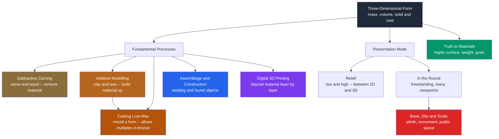

# 🗿 Sculpture and Three-Dimensional Art

> [!abstract] TL;DR
> **Sculpture** is art in three real dimensions: unlike a painting, it occupies actual space, has genuine **mass and volume**, is bound up with the physical **material** it is made of, and must be **experienced from many viewpoints** by a moving body rather than a fixed eye. It is made by four historic processes — **subtractive carving** (cutting a form out of stone or wood, "releasing the figure from the marble"), **additive modelling** (building a form up in clay or wax), **casting** (the lost-wax method that turns a fragile model into durable bronze and permits *multiples*), and modern **assemblage / construction** (welding and found objects), now joined by **3D printing**. Its deep grammar is the play of **solid against void** — the negative space Moore and Hepworth pierced through their forms — and its meaning is inseparable from **scale, base, and site**, from the ancient kouros to the public monument.

---

## Intuition

**Analogy: an apple and a photograph of an apple.** A photo of an apple is finished the instant you look at it — one frontal view tells you everything the picture holds, and it lives entirely on a flat surface you cannot enter. Now put a *real* apple on the table. To know it you pick it up, turn it, feel its weight in your palm, run a thumb over the waxy dimpled skin, notice how the stem-well throws a pocket of shadow that vanishes as you rotate it, and see the highlight slide across its curve as you move. You could bite it and remove material; you could press dough around it and build a copy. **That gap — between the single fixed picture and the heavy, turnable, touchable thing you walk around — is the entire difference between two-dimensional art and sculpture.**

Every idea below is just this apple made deliberate: you can make a form by *cutting one out of a block* (subtractive) or by *packing material up into it* (additive); it always has real weight and surface you want to touch; and it never has one "correct" view, because a solid thing in space shows a different silhouette from every angle you stand.

---

## How It Works

### Sculpture is form that occupies real space

A drawing conjures the *illusion* of volume with shading and perspective; sculpture has the thing itself. Its raw material is **form** — mass (the sense of solid substance and weight), **volume** (the space a form encloses or displaces), and the **void** or negative space around and through it. Because it is real, three consequences follow that no flat art shares:

1. **It is multi-viewpoint.** There is no single "front"; a sculpture in the round unfolds as a *sequence* of silhouettes and contours as you circle it. Bernini and Giambologna designed works with no single privileged angle precisely to keep the body moving.
2. **It is haptic and bodily.** We read it partly through imagined touch — the coolness of marble, the tooth of bronze — and through our own sense of weight, balance, and standing. Scale is felt in the body: a form larger than us dominates, a hand-sized one invites intimacy.
3. **It is site-bound.** It casts real shadows, catches real light that changes through the day, and stands *in* our space, which is why its **base, scale, and site** are part of the work, not neutral packaging.

### The four fundamental processes (plus a fifth, digital)

1. **Subtractive — carving.** You start with a solid block of stone, wood, or ice and *remove* material until the form remains. Nothing can be added back, so it is the least forgiving process. Michelangelo famously described it as *liberating* a figure already latent in the marble — "the sculptor's hand can only break the spell to free the forms slumbering in the stone." The block's grain, faults, and finite bulk constrain the pose.
2. **Additive — modelling.** You *build a form up* from a soft, plastic material — clay, wax, plaster, papier-mâché. It is fully reversible: you can push, pull, add and remove, which makes it the medium of study, gesture, and rapid change. Modelled clay is often only an intermediate stage on the way to casting.
3. **Casting — the lost-wax process (*cire-perdue*).** A way to convert a fragile modelled original into a durable, often hollow metal (usually **bronze**). In outline: model the form in **wax**, encase it in a heat-proof **mould**, then heat it so the wax melts and runs *out* ("lost"), leaving a cavity; pour **molten metal** into that cavity; break away the mould; then chase and patinate the surface. Crucially, because the *mould* holds the form, casting lets you make **multiples** — editions of a bronze — decoupling the artwork from a single unique object.
4. **Assemblage / construction.** A twentieth-century addition: the sculptor neither carves nor models a mass but *joins* pre-existing parts — welded steel (González, Smith), **found objects** (Picasso's bull's-head from a bicycle saddle and handlebars, Duchamp's readymades), or industrial units (Judd). Form is built by connection rather than shaping a substance.
5. **Digital — 3D printing.** The contemporary heir of additive process: a machine deposits material **layer by layer** from a digital model, plus its inverse, CNC milling, which is computer-controlled *carving*. Together they let a form move fluidly between the screen and the physical block.

### Relief versus in the round

A **relief** is sculpture that projects from a background plane it stays attached to — a hybrid between the two-dimensional and the fully three-dimensional. In **low relief** (*bas-relief*, as on a coin or the Parthenon frieze) the figures barely rise from the surface and are meant to be read frontally like a picture; in **high relief** the forms project so far that parts may be undercut and nearly detach. **Sculpture in the round** is fully freestanding — detached from any background and viewable from every side.

### Solid and void: the modern discovery of negative space

Traditional sculpture treated the void as mere leftover. Modern sculptors made it a subject. **Henry Moore** and **Barbara Hepworth** pierced *holes* clean through their reclining figures and ovoids, so that the **empty space becomes as compositionally active as the solid** — you look *through* the form, and the hole reads differently from every angle. This is the sculptural equivalent of figure–ground: the shape of the gap now does real work.



---

## Key Concepts

### Secondary (foundational)
- **Sculpture = art in three dimensions.** It has real mass and volume and is walked around, not just looked at.
- **Carving vs modelling.** Carving *removes* material from a block and cannot be undone; modelling *adds* soft material and is fully reversible.
- **Casting makes copies.** A mould lets one modelled original become many bronzes — sculpture need not be unique.
- **Relief vs in the round.** A relief stays attached to a background plane (like a coin); a sculpture in the round is free on every side.
- **The base matters.** A plinth lifts and frames a work, separating it from ordinary space and telling you it is "art."

### Undergraduate (mechanisms)
- **The lost-wax / *cire-perdue* sequence:** wax model → invested in a mould → wax burned out → molten bronze poured → mould broken → chased and patinated. Understand why the result is usually **hollow** (a core saves metal and prevents cracking on cooling).
- **Truth to materials** (Ruskin, Brancusi, the Direct Carving movement): the medium should reveal its own nature — the grain of wood, the crystalline resistance of marble — rather than imitate flesh or another substance. Ties directly to [[Texture_Pattern_and_Materiality]].
- **Positive form and negative space** as a designed pair; the pierced forms of Moore and Hepworth make the void a compositional element.
- **The four historic processes plus assemblage:** know an exemplar of each — Michelangelo (carving), Degas (modelled wax → cast bronze), Rodin (modelling and casting), Julio González / David Smith (welded construction), Picasso (found-object assemblage).
- **Contrapposto and dynamism:** the Greek discovery of weight-shift (Polykleitos) that made the standing figure alive, later exploded into Baroque spiral movement (see [[Renaissance_and_Baroque]]).

### Graduate (frontier / debate)
- **The multiple and the aura.** Because casting permits editions, sculpture confronts Walter Benjamin's question of the "original" more sharply than painting: which of eight identical Rodin bronzes is *the* work, and what does a posthumous cast mean? Authenticity becomes a matter of the *mould's* authorization, not a unique hand-made object.
- **From object to site to situation.** Rosalind Krauss's *"Sculpture in the Expanded Field"* (1979) argues that modern sculpture lost its pedestal and its figurative subject and became defined *negatively* — as "not-architecture" and "not-landscape" — opening the field to **earthworks, installation, and site-specific** work where the place is constitutive. Richard Serra's *Tilted Arc* (removed in 1989) made the stakes literal: relocating the work would *destroy* it.
- **The monument problem.** Public sculpture encodes power and memory; the contemporary debate over whose monuments stand, and the rise of **counter-monuments** and anti-monuments, treats the plinth as an ideological instrument (a theme that bridges to art, society, and politics).
- **Kinetic and light sculpture.** Once the fourth dimension of *time* enters — Calder's wind-driven mobiles, Tinguely's machines, Flavin's fluorescent-tube installations, Turrell's light spaces — the "form" is an event or a perceptual field, not a fixed mass. The haptic gives way to the temporal and the immersive.
- **Digital fabrication and dematerialization.** 3D printing and parametric modelling let form migrate between file and matter, reviving the old carving/modelling duality (CNC milling *is* carving; FDM printing *is* additive) while raising questions about the "hand" and the edition.

---

## Python Demo

```python
# Sculpture in code: contrast the two oldest processes and show why a
# 3D form has no single "correct" view.  numpy + matplotlib only.
#
#   (1) SUBTRACTIVE (carving): start from a full block of stone (a voxel
#       grid) and REMOVE every point that is not part of the form.  Target =
#       a pierced ovoid (Henry Moore style): an ellipsoid bored through by a
#       cylindrical hole -> solid AND void in one gesture.
#   (2) ADDITIVE (modelling): build a vessel UP from nothing by stacking
#       coils of clay -- rings whose radius follows a swelling profile.
#   (3) SILHOUETTES: orthographically project the carved form onto three
#       planes; the same solid shows a DIFFERENT outline from each viewpoint,
#       which is why sculpture must be walked around.
import numpy as np
import matplotlib.pyplot as plt

# ---- the "block of marble": a solid grid of voxel centres --------------
N = 40
lin = np.linspace(-1.0, 1.0, N)
X, Y, Z = np.meshgrid(lin, lin, lin, indexing="ij")
block = np.stack([X.ravel(), Y.ravel(), Z.ravel()], axis=1)      # (N**3, 3)

# ---- (1) SUBTRACTIVE: carve a pierced ovoid ----------------------------
a, b, c = 0.9, 0.6, 0.75
ellipsoid = (X / a) ** 2 + (Y / b) ** 2 + (Z / c) ** 2 <= 1.0    # inside stone
bore      = (X ** 2 + Z ** 2) <= 0.18 ** 2                       # hole along y
inside    = (ellipsoid & ~bore).ravel()                         # keep stone, drop bore
carved    = block[inside]
removed   = block[~inside]

print(f"Block voxels    : {block.shape[0]}")
print(f"Carved away     : {removed.shape[0]}  (chips on the studio floor)")
print(f"Form remaining  : {carved.shape[0]}  ('the figure freed from the marble')")

# ---- (2) ADDITIVE: model a vessel by stacking coils --------------------
coils = []
for h in np.linspace(-0.9, 0.9, 60):
    r = 0.15 + 0.45 * np.exp(-(h * 1.6) ** 2) + 0.12 * np.cos(3 * h)  # swelling profile
    th = np.linspace(0, 2 * np.pi, 80, endpoint=False)
    coils.append(np.stack([r * np.cos(th), np.full_like(th, h), r * np.sin(th)], axis=1))
built = np.concatenate(coils, axis=0)
print(f"Modelled form   : {built.shape[0]} points added coil by coil")

# ---- render both processes as 3D point clouds --------------------------
fig = plt.figure(figsize=(13, 5.5))
axc = fig.add_subplot(1, 2, 1, projection="3d")
axc.scatter(removed[::14, 0], removed[::14, 1], removed[::14, 2],
            s=2, c="0.82", alpha=0.12)                # ghost of discarded stone
axc.scatter(carved[::4, 0], carved[::4, 1], carved[::4, 2],
            s=5, c="#8a6d3b", alpha=0.65)             # the released form
axc.set_title("Subtractive: carving a pierced ovoid\n(remove stone -> solid + void)")

axm = fig.add_subplot(1, 2, 2, projection="3d")
axm.scatter(built[:, 0], built[:, 1], built[:, 2], s=5, c="#b5651d", alpha=0.6)
axm.set_title("Additive: modelling a vessel\n(build the form up coil by coil)")
for ax in (axc, axm):
    ax.set_box_aspect((1, 1, 1))
    ax.set_xlabel("x"); ax.set_ylabel("y"); ax.set_zlabel("z")
plt.tight_layout(); plt.show()

# ---- (3) SILHOUETTES: one solid, three different outlines --------------
fig2, axs = plt.subplots(1, 3, figsize=(13, 4.3))
projections = [
    ((0, 2), "Look DOWN the y-axis  ->  plane (x, z)\nthe bore reads as a HOLE"),
    ((0, 1), "Look ALONG the z-axis ->  plane (x, y)\nsolid silhouette, hole hidden"),
    ((1, 2), "Look ALONG the x-axis ->  plane (y, z)\nsolid silhouette, hole hidden"),
]
for ax, ((i, j), title) in zip(axs, projections):
    ax.scatter(carved[::2, i], carved[::2, j], s=4, c="#333333", alpha=0.22)
    ax.set_aspect("equal"); ax.set_title(title, fontsize=9)
    ax.set_xlabel(f"axis {i}"); ax.set_ylabel(f"axis {j}")
plt.tight_layout(); plt.show()

# The takeaway, in one number: the bored hole is invisible from two of the
# three axes and gapes open from the third -- proof that a 3D form cannot be
# summarised by a single view the way a photograph can.
print("The hole is empty only when viewed down its own axis (x^2 + z^2 <= r).")
```

Running it prints the voxel bookkeeping (a full block reduced to the carved form plus a large pile of "chips"), draws the pierced ovoid beside the coil-built vessel, and shows the same solid casting a *ring-with-a-hole* outline from one direction but a *filled* outline from the other two — the computational proof of why sculpture demands a walking, embodied viewer.

---

## Real-World Applications

- **Bronze casting foundries.** The lost-wax process the demo abstracts is still the industrial basis of cast sculpture and of precision **investment casting** for turbine blades, dental crowns, and jewellery — the same *cire-perdue* logic scaled to engineering tolerances.
- **Public monuments and memorials.** From Rodin's *Burghers of Calais* to Maya Lin's *Vietnam Veterans Memorial*, sculpture organises civic memory; debates over removal, re-siting, and counter-monuments show that base, scale, and site carry political meaning, not just aesthetics.
- **Site-specific and land art.** Serra's steel arcs, Smithson's *Spiral Jetty*, and Turrell's *Roden Crater* treat the *place* as material — the work cannot be moved without being destroyed, the endpoint of Krauss's "expanded field."
- **Product, film, and game design.** Physical maquettes, ZBrush digital sculpting, and 3D-printed prototypes carry additive/subtractive thinking into character design, industrial styling, and stop-motion (the modelled-then-cast pipeline underlies both a Degas dancer and a Laika puppet).
- **Cultural heritage and restoration.** Photogrammetry and 3D printing now reconstruct lost or damaged sculpture (the reconstructed Palmyra arch), and moulding/casting produce study copies so fragile originals can be conserved.
- **Prosthetics and architecture.** The relief-to-in-the-round spectrum and truth-to-materials thinking inform architectural ornament, façade sculpture, and the tactile design of objects meant to be handled.

---

## Common Pitfalls

- **Judging sculpture from one photograph.** A single frontal shot is to a sculpture what a shadow is to a body — it discards the very dimension that makes it sculpture. Always ask what the *other* views and the silhouette-in-motion do.
- **Confusing carving with modelling in reverse.** Carving is irreversible subtraction constrained by a finite block; modelling is reversible addition. They demand opposite planning — carvers work from the outside in and cannot recover a mistake; modellers grow the form and can undo.
- **Thinking a bronze is "the original."** In casting, the authorised *mould* defines the work; there may be a legitimate edition of identical bronzes, and posthumous or unauthorised casts raise genuine questions of authenticity and value.
- **Ignoring negative space.** Beginners design only the solid and let the gaps fall where they may. In the round, the shape of the void — between limbs, through a Moore hole — is half the composition (see [[Composition_and_Design_Principles]]).
- **Treating the base as neutral.** The plinth's height, material, and presence (or Brancusi's fusing of base *into* the work, or the modernist abolition of the pedestal) is an aesthetic and political decision, not packaging.
- **Forgetting weight, gravity, and material limits.** A pose that reads fine on paper may be impossible in stone (which cannot span thin unsupported spans) yet trivial in welded steel. Material dictates what forms are even buildable — the essence of **truth to materials**.
- **Assuming scale is a free variable.** Enlarging a hand-sized maquette to monumental size changes not just impact but structural behaviour and meaning; a form intimate at 20 cm can be oppressive at 20 m.

---

## Related Concepts

- [[Line_Shape_and_Form]] — sculpture is the art where *form* (mass and volume) is literal rather than an illusion; this note supplies the shape-to-form foundation.
- [[Texture_Pattern_and_Materiality]] — "truth to materials," the haptic surface, and the meaning carried by bronze vs marble vs clay ground sculpture's material dimension.
- [[Prehistoric_and_Ancient_Art]] — the origins of three-dimensional art, from Palaeolithic figurines to the Greek kouros and the discovery of contrapposto.
- [[Renaissance_and_Baroque]] — Michelangelo's "releasing the figure" and Bernini's dynamic, multi-viewpoint marble mark the peaks of carving and of movement in stone.
- [[Composition_and_Design_Principles]] — balance, rhythm, and figure–ground apply in three dimensions, where negative space and the walk-around sequence become compositional tools.
- [[Space_Perspective_and_Depth]] — the counterpoint: how *flat* art fakes the volume that sculpture actually possesses, clarifying what is unique to three dimensions.
- [[Light_Shadow_and_Value]] — a real sculpture models itself through the changing light that rakes across its surface and pools in its hollows.
- [[Ceramics_and_Glasses]] — the material science of clay, firing, and glaze that underlies modelled and ceramic sculpture and its material behaviour.

---

## Review Questions

1. **(Foundational)** Explain, using a concrete example, why a sculpture "in the round" cannot be fully represented by a single photograph, whereas a bas-relief largely can. What does this tell you about the difference between two- and three-dimensional art?
2. **(Formal / process)** Walk through the lost-wax casting sequence step by step. At which step does the possibility of making *multiples* arise, and why does that make the idea of the sculpture's "original" more complicated than for a carved marble?
3. **(Analytical)** Carving is subtractive and irreversible; modelling is additive and reversible. Choose a pose or form and argue how the choice of process, together with "truth to materials," constrains what is physically buildable in marble versus welded steel.
4. **(Conceptual)** How did Moore and Hepworth's pierced forms change the status of *negative space* in sculpture, and how does that relate to the figure–ground problem in flat composition?
5. **(Trade-off / debate)** Using Krauss's "expanded field" and a case like Serra's *Tilted Arc*, discuss what is gained and lost when sculpture abandons the pedestal to become site-specific. When does relocating a work destroy it, and what does that imply about where the "artwork" actually resides?

---

## Sources

- Rosalind Krauss, *"Sculpture in the Expanded Field,"* *October* 8 (1979), pp. 30–44. — the field definition of modern sculpture as not-architecture / not-landscape.
- Herbert Read, *The Art of Sculpture* (Bollingen / Pantheon, 1956). — the classic account of sculpture's three-dimensional, tactile, and material specificity.
- Rudolf Wittkower, *Sculpture: Processes and Principles* (Harper & Row, 1977). — carving, modelling, and casting techniques across history.
- Henry Moore, *Henry Moore on Sculpture*, ed. Philip James (Viking, 1966). — the sculptor's own writing on form, mass, and the hole / negative space.
- The Metropolitan Museum of Art, *"The Art of Bronze: Lost-Wax Casting,"* Heilbrunn Timeline of Art History — [metmuseum.org/toah](https://www.metmuseum.org/toah). — clear technical overview of *cire-perdue*.

---

#aesthetics #sculpture #three-dimensional #carving #casting
