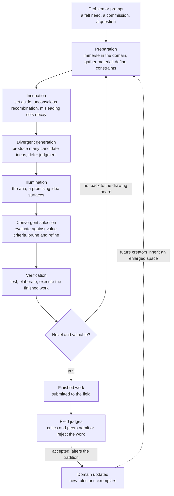

# 🎨 Creativity and the Artistic Process

> [!abstract] TL;DR
> **Creativity** is standardly defined as the production of work that is *both* **novel** (original, surprising) **and valuable** (appropriate to the task, useful, or beautiful) — either criterion alone fails, since mere novelty is noise and mere value is competent imitation. The *process* by which such work arises has been modelled at three scales: **psychologically**, as Wallas's four stages (**preparation → incubation → illumination → verification**) and as the alternation of **divergent** thinking (Guilford — generate many possibilities) with **convergent** thinking (select and refine the best); **computationally**, as Margaret **Boden's** three types — **combinational** (new combinations of familiar ideas), **exploratory** (mapping the unrealized potential of an existing conceptual space's rules), and **transformational** (changing the rules that define the space, the most radical and rarest kind); and **socioculturally**, as Csikszentmihalyi's **systems view**, where creativity is not in the head alone but is the product of a **person** acting on a **domain** and judged by a **field** of gatekeepers. Across all three, the recurring truths are that domain **expertise** is the prerequisite for meaningful rule-breaking ("learn the rules to break them"), that **constraints fuel** rather than throttle invention, and that chance favours only the **prepared mind**.

---

## Intuition

**Analogy:** Think of a jazz musician at a jam session. Before she can play a single surprising note she has spent years absorbing scales, chord changes, and the standards everyone else knows — she has internalized the *rules of the room*. When she solos, she first **explores**: she runs many phrases that all fit the tune's harmony, tossing out far more ideas than she keeps, letting most evaporate. Occasionally something clicks — a phrase that is fresh yet still *works* — and she leans into it, shapes it, resolves it. That is one order of creativity: brilliant moves **inside** the existing game. But once in a generation a Coltrane or a Bird does something else: he does not just play new phrases over the old chords, he **redraws the harmonic rules themselves**, and suddenly a whole new space of possible music opens that literally did not exist before. Everyone who follows now improvises inside *his* enlarged space.

That story contains the entire note. Learning the rules is **preparation**. Trying many phrases is **divergent** search; keeping the good ones is **convergent** selection. Playing new lines over old changes is **exploratory** creativity; rewriting the changes is **transformational** creativity. And whether the innovation *counts* is decided not by the soloist but by the audience, the other players, and the tradition that either absorbs or forgets it — the **field**.

---

## How It Works

### The standard definition, and why it needs two legs

The consensus definition (Runco & Jaeger call it "the standard definition") requires **two** conjoint criteria: a creative product is **original** *and* **effective / appropriate / valuable**. Drop originality and you have skilled reproduction; drop value and you have random deviation. Boden adds a third useful marker, **surprise** — a genuinely creative idea is one you would not merely fail to predict but would have thought *impossible* within your current assumptions. The whole difficulty of studying creativity is that novelty is easy to measure and value is not: appropriateness is judged against a domain's evolving standards, which is exactly why the sociocultural view refuses to locate creativity purely inside a single mind.

### The four-stage model (Wallas, 1926)

Wallas, systematizing Helmholtz and Poincaré's introspections, split the creative act into four phases:

1. **Preparation** — conscious, effortful immersion: gathering knowledge, defining the problem, and loading the domain into mind. This is where **domain expertise** is deployed.
2. **Incubation** — the problem is set aside; conscious work stops but *unconscious* recombination continues. The leading mechanism is **selective forgetting**: misleading assumptions and fixations decay, so the mind re-enters the problem less constrained (the same account used for insight in [[Problem_Solving_and_Insight]]).
3. **Illumination** — the sudden **"Aha!"**: a candidate solution surfaces into consciousness, whole and confident. This is the phenomenology of **insight** and its restructuring of the problem representation.
4. **Verification** — the idea is consciously tested, elaborated, and executed. Most raw illuminations fail here; the stage is what turns a hunch into a finished work.

The model is a loop, not a line: failed verification sends you back to preparation with a sharper problem.

### Divergent vs convergent thinking (Guilford, 1950)

Guilford's presidential address to the APA launched modern creativity research by distinguishing two cognitive modes:

- **Divergent thinking** — generating *many, varied* responses from one starting point. Its measured facets are **fluency** (how many ideas), **flexibility** (how many *categories* of idea), **originality** (statistical rarity), and **elaboration** (developed detail). The **Alternative Uses Test** ("list uses for a brick") and the Torrance Tests operationalize it.
- **Convergent thinking** — narrowing many possibilities to the single best-fitting answer, the mode classical IQ tests reward.

Creativity is *not* divergent thinking alone; it is the **rhythm** of diverging to generate and then converging to select. Osborn's **brainstorming** is an attempt to protect the divergent phase — "defer judgment, quantity breeds quality" — by walling it off from premature evaluation.

### Boden's three types of creativity

Margaret Boden's computational framework recasts a creative domain as a **conceptual space**: a set of generative rules or dimensions that implicitly defines everything the style *can* produce. Three kinds of creativity then correspond to three operations on that space:

- **Combinational** — juxtaposing familiar ideas in an *unfamiliar* combination (collage, metaphor, analogy, the "what if we crossed X with Y"). The engine here is analogical mapping — see [[Analogy_and_Conceptual_Metaphor]].
- **Exploratory** — moving through the *existing* conceptual space to realize structures its rules permit but that no one has yet produced. Most professional creative work — a new sonata in sonata form, a new building in a known style — is exploratory. It can be deeply original without breaking any rule.
- **Transformational** — altering one or more of the *defining rules or dimensions* of the space itself, so that ideas which were literally **impossible** in the old space become possible. Atonality abolishing the rule "music has a home key," Cubism abolishing single-viewpoint perspective, non-Euclidean geometry dropping the parallel postulate. This is the rarest and most disorienting kind, because the new products are un-scorable by the old criteria — the field often rejects them at first.

Boden also distinguishes **P-creativity** (psychological — novel to the person who had the idea) from **H-creativity** (historical — novel to all of human history). The cognitive *process* is identical; only the reference class differs.

### The creative person, and the death of the lone-genius myth

The strongest *personality* correlate of creativity is **Openness to Experience** (of the Big Five) — a taste for novelty, aesthetic sensitivity, and tolerance of ambiguity. But the romantic image of effortless, untrained genius is largely a myth. Hayes's study of composers and Ericsson's expert-performance research converge on a **"ten-year rule"**: world-class creative output almost never appears before roughly a decade of intense domain preparation. Creativity is built on top of hard-won expertise — see [[Deliberate_Practice_and_Expertise]] — not in place of it. You cannot meaningfully *transform* a space whose rules you have not first mastered, which is why "**learn the rules to break them**" is the compositional maxim in [[Composition_and_Arranging]].

### Constraints, flow, chance, and the field

- **Constraints as fuel** — a boundless space is paralysing (the terror of the blank page). Constraints prune the search space and *force* non-obvious combinations; Stravinsky claimed the more limits he imposed, the freer he felt. A sonnet's fourteen lines are a creativity engine, not a cage.
- **Flow** — the autotelic, self-forgetting absorption Csikszentmihalyi identified as the optimal creative state, entered when challenge and skill are matched (its aesthetic cousin is treated in [[Aesthetic_Experience_and_Perception]]).
- **Chance and error** — serendipity (penicillin, the Post-it adhesive) and productive mistakes seed novelty, but only for the **prepared mind** able to recognize the accident's value. This is Campbell and Simonton's **blind-variation-and-selective-retention (BVSR)** model: undirected variation supplies novelty; the trained evaluator supplies value.
- **The systems view (Csikszentmihalyi)** — creativity is the interaction of three subsystems: a **person** with talent and training, a **domain** of symbolic rules and exemplars, and a **field** of gatekeepers (critics, editors, curators, peers) who decide which variations enter the domain and become tradition. On this view an idea is not creative until the field *judges* it so, which is why the same act can be genius or crankery depending on its reception — the sociology of art institutions is inseparable from the psychology.

### The creative process as a whole



---

## Key Concepts

### Secondary (intuitive level)

- **Creativity = new AND good.** A wild idea that is useless is not creative; a useful idea that copies others is not creative either. You need both.
- **Two gears of thinking** — **divergent** (brainstorm lots of ideas, no judging yet) and **convergent** (pick and polish the best one).
- **Sleep on it** — stepping away (**incubation**) and then the sudden **"Aha!"** are real parts of solving hard creative problems.
- **Limits help** — a blank page is scary; a prompt or a rule ("write a poem with exactly 17 syllables") makes ideas easier, not harder.
- **Learn the craft first** — even the most rule-breaking artists spent years learning the rules they later broke.

### Undergraduate (conceptual level)

- **The standard definition** — creative work is *original* and *appropriate/valuable*; Boden adds **surprise** (it seemed impossible before).
- **Wallas's four stages** — preparation, incubation, illumination, verification; a loop, not a straight line.
- **Guilford's divergent thinking** — fluency, flexibility, originality, elaboration; measured by Alternative Uses and Torrance tests; distinct from convergent, IQ-style problem solving.
- **Boden's three types** — **combinational** (novel mixes of familiar ideas), **exploratory** (realizing an existing style's unused potential), **transformational** (changing the rules of the space itself).
- **P-creativity vs H-creativity** — novel to *you* vs novel to *history*; the same process, a different reference class.
- **Person factors** — **Openness to Experience** as the key trait; the **ten-year rule** and expertise as prerequisites, against the lone-genius myth.
- **Constraints and flow** — bounded search spaces aid invention; **flow** is the matched challenge-skill state of deep creative work.

### Graduate (technical / disputed level)

- **The systems model (Csikszentmihalyi)** — creativity as **person × domain × field**; creativity is an *attribution* the field confers, relocating it from cognition to a sociocultural system and connecting directly to the sociology of **art institutions** (gatekeeping, canon formation).
- **BVSR and Darwinian creativity (Campbell, Simonton)** — creative ideation as **blind variation and selective retention**; explains the empirical link between total productivity and eminence (the "equal-odds rule": more shots, more hits *and* more misses) and the role of chance under a prepared mind.
- **Boden's computational reading** — a conceptual space *is* a generative rule system; **exploratory** creativity = search within a fixed grammar, **transformational** creativity = editing the grammar's rules or dimensions. Transformation is hard precisely because it is meta-level: you must operate on the very constraints that make search tractable, and the outputs are un-scorable by the pre-transformation value function.
- **Influence and intertextuality** — Harold **Bloom's "anxiety of influence"**: strong artists creatively *misread* their precursors to clear imaginative space; creativity is recombination within a cultural network rather than *ex nihilo* invention (Sawyer's sociocultural / distributed view).
- **Can machines be creative?** — Boden's framework is the standard lens. Generative models excel at **combinational** and **exploratory** creativity (sampling and interpolating a *learned* conceptual space — the basis of AI and **generative art**), but genuine **transformational** creativity, inventing a *new* space, remains contested, and the perennial bottleneck is **evaluation**: machines generate novelty cheaply but cannot yet reliably judge *value*, the harder half of the definition.
- **Design thinking** — the **double-diamond** operationalizes the divergent-convergent rhythm twice (diverge to *understand*, converge to *define*; diverge to *ideate*, converge to *deliver*), turning the creative process into a repeatable method.

---

## Python Demo

We model **creativity as search over a conceptual space**, following Boden. A "work" is a point in a 2-D feature space; a **value landscape** marks which works are appropriate/valuable, with a *conventional* peak inside the current style and a taller *novel* peak outside it. **Exploratory** creativity may only sample within the current style's rules (a bounded region); **transformational** creativity **changes the rules** — enlarging the space — so the previously unreachable novel peak becomes attainable. In both, we enact the **divergent-then-convergent** structure: generate *many* candidates, then keep the *few* best.

```python
# Creativity as search in a conceptual space: exploratory vs transformational
# (Boden), with a divergent-then-convergent generate-and-select loop.
# numpy + matplotlib only.
import numpy as np
import matplotlib.pyplot as plt

rng = np.random.default_rng(7)

# ---------------------------------------------------------------------
# 1. THE CONCEPTUAL SPACE and its VALUE LANDSCAPE
#    Each point (x, y) is a possible "work". The value function V marks
#    which works are valuable/appropriate. Two peaks:
#      - a CONVENTIONAL peak INSIDE the current style's rules
#      - a taller NOVEL peak OUTSIDE them, unreachable without new rules
# ---------------------------------------------------------------------
def bump(X, Y, cx, cy, s, h):
    return h * np.exp(-((X - cx) ** 2 + (Y - cy) ** 2) / (2 * s ** 2))

def value(X, Y):
    conventional = bump(X, Y, 0.30, 0.35, 0.16, 1.00)   # inside the old rules
    novel        = bump(X, Y, 0.82, 0.80, 0.12, 1.45)   # higher, but far away
    return conventional + novel

gx = np.linspace(0, 1, 300)
gy = np.linspace(0, 1, 300)
GX, GY = np.meshgrid(gx, gy)
V = value(GX, GY)

# ---------------------------------------------------------------------
# 2. THE CURRENT STYLE = a bounded region of the space (the "rules").
#    Exploratory creativity may ONLY sample inside this box.
# ---------------------------------------------------------------------
style_box = dict(xlo=0.05, xhi=0.55, ylo=0.05, yhi=0.60)          # old rules
open_box  = dict(xlo=0.05, xhi=0.98, ylo=0.05, yhi=0.98)          # transformed

def sample_box(box, n):
    xs = rng.uniform(box["xlo"], box["xhi"], n)
    ys = rng.uniform(box["ylo"], box["yhi"], n)
    return xs, ys

# ---------------------------------------------------------------------
# 3. DIVERGENT then CONVERGENT: generate MANY candidates, keep the top-k.
# ---------------------------------------------------------------------
def diverge_then_converge(xs, ys, keep=8):
    vals = value(xs, ys)                 # evaluate every candidate
    top = np.argsort(vals)[::-1][:keep]  # convergence: keep the best few
    return vals, top

N = 400  # size of the divergent burst

# --- EXPLORATORY creativity: search WITHIN the existing rules ---------
ex_x, ex_y = sample_box(style_box, N)
ex_vals, ex_top = diverge_then_converge(ex_x, ex_y)

# --- TRANSFORMATIONAL creativity: CHANGE the rules, then search -------
tr_x, tr_y = sample_box(open_box, N)
tr_vals, tr_top = diverge_then_converge(tr_x, tr_y)

print(f"Exploratory best value (old rules)      : {ex_vals.max():.3f}")
print(f"Transformational best value (new rules)  : {tr_vals.max():.3f}")
print(f"Gain from transforming the space         : {tr_vals.max() - ex_vals.max():.3f}")

# ---------------------------------------------------------------------
# PLOTS
# ---------------------------------------------------------------------
def draw_box(ax, box, color, label):
    ax.plot([box["xlo"], box["xhi"], box["xhi"], box["xlo"], box["xlo"]],
            [box["ylo"], box["ylo"], box["yhi"], box["yhi"], box["ylo"]],
            color=color, lw=2.2, label=label)

fig, ax = plt.subplots(1, 2, figsize=(13, 5.4), sharex=True, sharey=True)
for a in ax:
    cs = a.contourf(GX, GY, V, levels=18, cmap="viridis")
    a.set_xlabel("conceptual dimension 1")
ax[0].set_ylabel("conceptual dimension 2")

# LEFT: exploratory -- confined to the old style, finds only the local peak
ax[0].scatter(ex_x, ex_y, s=8, c="white", alpha=0.35, label="divergent candidates")
ax[0].scatter(ex_x[ex_top], ex_y[ex_top], s=80, c="red", edgecolor="black",
              label="convergent selection")
draw_box(ax[0], style_box, "red", "current style rules")
ax[0].set_title("Exploratory: search WITHIN the rules")
ax[0].legend(loc="upper right", fontsize=8)

# RIGHT: transformational -- enlarged space reaches the novel peak
ax[1].scatter(tr_x, tr_y, s=8, c="white", alpha=0.30, label="divergent candidates")
ax[1].scatter(tr_x[tr_top], tr_y[tr_top], s=80, c="cyan", edgecolor="black",
              label="convergent selection")
draw_box(ax[1], style_box, "red", "old rules")
draw_box(ax[1], open_box, "cyan", "transformed space")
ax[1].set_title("Transformational: CHANGE the rules, reach the novel peak")
ax[1].legend(loc="lower left", fontsize=8)

fig.colorbar(cs, ax=ax, label="value / appropriateness", shrink=0.85)
plt.savefig("creativity_search.png", dpi=120)
plt.show()
```

**What to notice:** In the *left* panel the search is trapped inside the current style's box, so no matter how many candidates it generates (divergence) or how ruthlessly it selects (convergence), the best it can reach is the *conventional* peak — brilliant exploratory work that never escapes the inherited rules. In the *right* panel the single meta-move of **enlarging the space** (transformation) lets the very same divergent-convergent machinery discover the taller *novel* peak that was literally unreachable before. That is Boden's central point rendered geometrically: exploratory creativity searches a fixed space, while transformational creativity edits the space's boundaries, and the payoff of transformation is access to value that the old rules made impossible. The white cloud of discarded candidates in both panels is the usually-invisible truth of creative work: you generate far more than you keep.

---

## Real-World Applications

- **Design thinking (IDEO, Stanford d.school)** — the **double-diamond** turns the divergent-convergent rhythm into a repeatable method: diverge to *empathize* then converge to *define* the problem, diverge to *ideate* then converge to *prototype and test*. It is Wallas's stages plus Guilford's two modes, industrialized.
- **Music and improvisation** — most composition and jazz soloing is **exploratory** creativity inside a learned style, but genre-founding moves (bebop, atonality, hip-hop sampling) are **transformational**, redrawing the space for everyone after (see [[Composition_and_Arranging]]).
- **Generative AI and generative art** — diffusion and language models are trained to represent a **conceptual space** as a latent manifold; sampling and interpolating it is Boden's combinational/exploratory creativity at industrial scale, with the **prompt** acting as the productive constraint. Whether such systems can *transform* a space rather than remix it is the live research question.
- **R&D and scientific discovery** — incubation breaks, analogy (Kekulé's benzene ring), and **serendipity** (penicillin, the Post-it adhesive) are deliberately courted; the "prepared mind" recognizes the accident's value.
- **Creative industries and awards** — advertising, publishing, film, and gallery curation are the **field** in Csikszentmihalyi's sense: prizes, editors, and critics are the gatekeeping machinery that decides which novelties become the domain's new tradition.
- **Innovation management** — techniques like brainstorming, SCAMPER, and constraint-injection ("design a chair using no legs") are engineered attempts to protect divergence and weaponize constraints against premature convergence.

---

## Common Pitfalls

- **Confusing novelty with creativity.** Originality is only *half* the standard definition. Idea generators that optimize purely for surprise produce incoherent noise; the hard, neglected half is **value/appropriateness**, which requires domain judgment.
- **Believing the lone-genius myth.** The romance of untrained, solitary inspiration ignores the **ten-year rule**, the role of collaboration, and the **field** that must ratify the work. Creativity is expertise-dependent and socially embedded, not spontaneous magic.
- **Judging during divergence.** Evaluating ideas while you are still generating them triggers premature convergence and collapses fluency — the exact failure Osborn's "defer judgment" rule targets. Separate the generate and select phases.
- **Fetishizing unlimited freedom.** A blank, constraint-free canvas paralyses. Removing all limits does not liberate creativity; well-chosen **constraints** prune the space and force the non-obvious combinations that make work interesting.
- **Expecting transformation without mastery.** You cannot meaningfully break rules you have not internalized. Attempts to be "revolutionary" before achieving domain competence produce ignorance dressed as innovation, not transformational creativity.
- **Treating incubation as procrastination.** Incubation works because misleading fixations *decay* after genuine **preparation**; it is not a licence to avoid the hard preparatory work. Stepping away from a problem you never loaded into mind yields nothing.
- **Over-trusting group brainstorming.** Empirically, individuals ideating separately and then pooling ("nominal groups") usually *out-generate* interacting groups, which suffer production blocking and evaluation apprehension. Unstructured group brainstorming feels productive but often is not.

---

## Related Concepts

- [[Problem_Solving_and_Insight]] — supplies the cognitive mechanics behind Wallas's incubation and illumination: impasse, selective forgetting, restructuring, and the measurable "Aha!" that creative and analytic problem solving share.
- [[Analogy_and_Conceptual_Metaphor]] — the engine of Boden's **combinational** creativity: structure-mapping and conceptual blending are how "familiar ideas in an unfamiliar combination" actually get computed.
- [[Deliberate_Practice_and_Expertise]] — grounds the ten-year rule and the demolition of the genius myth: the domain expertise that must precede any meaningful rule-breaking.
- [[Composition_and_Arranging]] — a domain-specific worked example of "learn the rules to break them," and of exploratory (a new piece in a known form) vs transformational (founding a new idiom) creativity in music.
- [[Aesthetic_Experience_and_Perception]] — treats **flow** as the optimal creative state and supplies the fluency/interest account of the *value* judgment that the field applies to a creative product.

---

## Review Questions

1. **(Secondary)** Using the jazz-musician analogy, explain the difference between *divergent* and *convergent* thinking, and why a creative idea has to satisfy **both** "new" and "good." Give an example of something that is new but not creative, and something that is good but not creative.
2. **(Undergraduate)** Distinguish Boden's **exploratory** and **transformational** creativity, and map each onto the conceptual-space search in the Python demo. Why does transformational creativity almost always require prior domain **expertise**, and why does the *field* frequently reject transformational work when it first appears?
3. **(Graduate)** Csikszentmihalyi argues creativity is a property of a **system** (person × domain × field), not of an individual mind. Contrast this with Boden's computational, individual-cognition account. Are they rivals or complements? Use the BVSR (blind-variation-and-selective-retention) model and the problem of *evaluating* value to argue whether a purely generative AI system could be "creative" in the full sense of the standard definition.

---

## Sources

- Boden, M. A. (2004). *The Creative Mind: Myths and Mechanisms* (2nd ed.). Routledge.
- Wallas, G. (1926). *The Art of Thought*. Harcourt Brace.
- Guilford, J. P. (1950). "Creativity." *American Psychologist*, 5(9), 444–454. https://doi.org/10.1037/h0063487
- Runco, M. A., & Jaeger, G. J. (2012). "The Standard Definition of Creativity." *Creativity Research Journal*, 24(1), 92–96. https://doi.org/10.1080/10400419.2012.650092
- Csikszentmihalyi, M. (1996). *Creativity: Flow and the Psychology of Discovery and Invention*. HarperCollins.
- Sawyer, R. K. (2012). *Explaining Creativity: The Science of Human Innovation* (2nd ed.). Oxford University Press.

---

#aesthetics #creativity #artistic-process #divergent-thinking #boden
