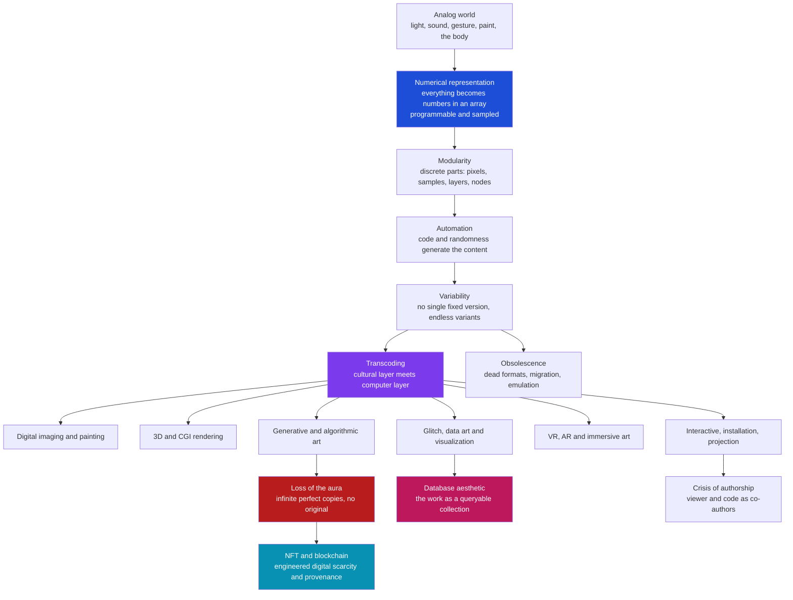

# 🖥️ Digital Art and New Media

> [!abstract] TL;DR
> **Digital and new-media art** is art created, stored, transmitted, or exhibited through computation — and the deep point is that the *medium changes the nature of the artwork*. Once an image, sound, or sculpture is reduced to **numbers in an array**, it acquires properties no oil painting has: it can be copied perfectly and infinitely, generated automatically by **code and randomness**, made to **respond to a viewer**, and endlessly **varied** with no single "original." The historical thread runs from the 1960s **algorithmists** (Vera Molnár, Frieder Nake, Georg Nees) through **video art** and the **net.art** of the 1990s, out into today's generative, interactive, immersive, glitch, data, and bio-art. Lev **Manovich** systematised the shift with five principles — **numerical representation, modularity, automation, variability, transcoding** — while Walter **Benjamin**'s prophecy about the loss of the "**aura**" in the age of reproduction becomes literally true for a file that has no original at all. The result is a permanent crisis of the material object, of authorship, and of preservation — which **NFTs** and blockchain try (imperfectly) to solve by re-engineering scarcity.

---

## Intuition

**Analogy — the sheet-music orchestra versus the master recording.** Think of two ways to "own" a symphony. The first is to own the composer's original hand-inked **manuscript**: there is exactly one, it bears the smudges of his hand, it hangs behind glass, and its value comes from being *that unique physical thing in that place*. The second is to own the **sheet music** — a set of instructions. Sheet music has no aura; any orchestra, anywhere, can execute it, and every performance is both a faithful realisation and a *different* one (this conductor, this tempo, this hall). The score is not a picture of the music; it is a *program that produces music*, and it produces a whole **family** of performances rather than one fixed object.

Digital art is art that has crossed from the manuscript to the sheet-music side of that line. A born-digital work *is* a program plus parameters. There is no smudged original — only the code, the data, and the rules. Copy it and you have not a reproduction but the thing itself, byte-for-byte. Change one parameter and you get a sibling, not a forgery. And because it is executed rather than merely displayed, it can read the room: it can respond to your face, your click, the weather, or the price of Bitcoin. Everything strange about new-media art — the vanished original, the co-authoring viewer, the infinite variants, the preservation nightmare — follows from having moved the artwork from **matter** to **instructions**.

---

## How It Works

New-media art is best understood not as "art that happens to use a screen" but as the set of consequences that follow once a cultural object becomes **computable data**. Lev Manovich's *The Language of New Media* (2001) names the mechanism as five principles; the first is foundational and the other four cascade from it.

1. **Numerical representation.** Every new-media object is, at bottom, a **numerical description** — an array of numbers a computer can address, filter, and transform. This has two corollaries: the object is *programmable* (any algorithm can be run on it), and continuous reality must first be **digitised** — sampled and quantised — before it enters the medium. A photograph becomes a grid of RGB integers; a sculpture becomes a mesh of vertex coordinates. Once numeric, the artwork is subject to mathematics rather than only to the hand.

2. **Modularity.** New-media objects are built from **discrete, independent parts** — pixels, samples, voxels, layers, sprites, scene-graph nodes — that retain their separate identity even when assembled. A Photoshop file is not a fused image but a *stack of layers*; a game world is not a scene but a *tree of objects*. Parts can be swapped, reordered, or reused without dissolving the whole. This is the "**fractal structure**" of new media.

3. **Automation.** Because the object is numeric and modular, its creation and modification can be **automated by code**. Low-level automation is a filter or a batch resize; high-level automation is **generative and algorithmic art**, where the artist writes *rules and randomness* and the computer produces the image — cellular automata, L-systems, noise fields, and reaction-diffusion textures (see [[Cellular_Automata]], [[Fractals_and_Self_Similarity]], and [[Procedural_Generation]]). The artist authors a *space of possible works* rather than a single work.

4. **Variability.** A new-media work is not fixed; it exists in potentially **infinite versions**. The same database and template yield different outputs for different users, screen sizes, times, or interactions. There is no canonical "original state" to conserve — variability is not a defect but a defining property. This is the deep break with the unique, finished object of traditional art.

5. **Transcoding.** The most far-reaching principle: the artwork now lives in **two layers at once** — a **cultural layer** (image, story, genre, aura) and a **computer layer** (file format, codec, data structure, algorithm). The two continually influence each other, so that concepts from computing — *database*, *interface*, *loop*, *variable*, *sampling* — migrate into culture and reshape how we think about art itself. The "**database aesthetic**" is transcoding made visible: the work presented not as a linear narrative but as a **queryable collection** the viewer navigates.

Layered on top of these principles are the field's **categories** — digital imaging and painting (the computer as a super-brush, extending painting and drawing); **3D and CGI**; **generative/algorithmic** art; **interactive** art (the viewer becomes a participant who completes the piece); **installation and projection mapping**; **VR, AR and immersive** art; **glitch art** (aestheticising error, corruption, and compression artefacts); **data art and visualization** (turning datasets into aesthetic form); and **bio-art** (living tissue and DNA as medium). And underneath all of it sits the philosophical rupture: Walter Benjamin's loss of the **aura** and the "here and now" of the original — pushed to its limit by a file that is *nothing but* perfect copies.



Read the diagram top-to-bottom as **cause and consequence**: digitisation turns the analog world into addressable numbers; the four remaining Manovich principles cascade from that; those principles enable the practical *categories* of digital art; and the categories in turn force the *philosophical* consequences — the vanished aura, the database form, the co-authoring viewer, and the twin problems of scarcity (which NFTs try to re-manufacture) and obsolescence (which preservation must fight).

---

## Key Concepts

### Secondary Level

**Digital art is made *with* computers; new-media art is *about* what computers do to art.** A photorealistic painting scanned and printed is a *digitised* traditional artwork. A piece that could only exist as code — that changes when you touch it, or generates itself, or lives on a network — is **new-media art**. The test is not "was a computer involved?" but "does the work depend on properties only computation gives it — interactivity, generativity, networked distribution, or endless variation?"

**A digital file has no original.** When you photograph the *Mona Lisa*, the photo is clearly a copy and the painting in the Louvre is clearly the original. When you copy a digital artwork, there is **no difference at all** between "copy" and "original" — they are identical strings of bits. This is the single most disorienting fact about digital art, and it dissolves the age-old idea that an artwork's value comes from being a unique physical object.

**The viewer can become a participant.** In **interactive art**, the piece is not finished until someone engages it — waves a hand, speaks, walks through a sensor field, clicks a link. The artist supplies a *system*; the audience supplies the *event*. The old separation between the active artist and the passive viewer breaks down, and no two people experience quite the same work.

**Categories worth knowing by name.** *Digital painting* (drawing tablets, extending [[Texture_Pattern_and_Materiality|painting and drawing]] into pixels); *3D/CGI* (modelled and rendered virtual objects); *generative art* (made by rules, code, and randomness); *interactive/installation* art; *VR/AR/immersive* art; *glitch art* (beauty from digital error); *data art/visualization*; and *bio-art* (living matter as medium).

### Undergraduate Level

**The algorithmists and the birth of computer art (1960s).** The first generation of computer artists were often mathematicians and engineers with access to plotters and mainframes. **Georg Nees** and **Frieder Nake** exhibited **algorithmically generated drawings** in 1965 (Stuttgart) — plots produced by pseudo-random programs. **Vera Molnár**, trained as a painter, used what she called an imaginary "*machine imaginaire*" before gaining computer access, then wrote programs that introduced controlled disorder into geometric grids — a founder of generative art. Their radical claim: the artist's product could be a *program and a random seed*, and the plotter's pen would draw the actual marks. **A. Michael Noll** at Bell Labs even ran a 1965 experiment showing viewers preferred a computer-generated pattern to a Mondrian.

**Video art and net.art extend the thread.** **Video art** (Nam June Paik, Bill Viola, from the mid-1960s) treated the electronic signal and the television set — the emblem of mass media — as a fine-art medium, foregrounding time, feedback, and the screen. In the 1990s, **net.art** (a coinage of the movement, whose members included Vuk Ćosić, Olia Lialina, JODI, Alexei Shulgin) made the **World Wide Web itself the medium and the gallery** — works that were URLs, broken HTML, and browser exploits, distributed for free, refusing the object and the market. This is the direct sibling of [[Digital_Literature_and_New_Media|digital literature and hypertext]].

**Manovich's five principles as an analytic toolkit.** *The Language of New Media* (2001) is the field's most cited theory precisely because it is *operational*: given any new-media artwork you can ask how each principle manifests. Where is the **numerical/sampled** base? What are the **modular** parts? What is **automated** versus hand-made? How does it **vary** across viewers or runs? What computing concepts (interface, database, loop) have **transcoded** into its cultural form? The "**database aesthetic**" — Manovich's claim that the database and the algorithm are the symbolic forms of the computer age, rivalling narrative — is the most influential single idea for reading data art and generative work.

**Benjamin's aura, made literal.** Walter Benjamin's essay "*The Work of Art in the Age of Mechanical Reproduction*" (1935) argued that mass reproduction (photography, film) strips an artwork of its **aura** — its unique presence in time and space, its "here and now," its ritual authority — while democratising access and enabling new political functions. Photography and print *approach* auralessness; the born-digital file *achieves* it, because there was never a first, privileged instance to lose. New-media art is the environment in which Benjamin's diagnosis stops being a metaphor. (This is the core theme a future *Art, Society and Politics* note would develop.)

### Graduate Level

**Software as an artistic medium, and creative coding.** By the 2000s, code was treated not as a tool for making art but as *the material itself*. The **Processing** language (Casey Reas and Ben Fry, 2001) and later **p5.js**, **openFrameworks**, **TouchDesigner**, and shader platforms (see [[Fragment_Shaders_and_Effects]]) gave artists a medium whose "brushstrokes" are functions, loops, and parameters. **Software art** foregrounds the *aesthetics of the algorithm* — the elegance, behaviour, and generativity of the code — and blurs into computer science: a well-made generative system is judged partly as one judges a proof or an architecture. The 3D/CGI wing connects directly to the [[Procedural_Generation|procedural generation]] and rendering techniques of computer graphics.

**The crisis of the material object and of authorship.** New media detonates two assumptions inherited from the fine-art tradition. First, the **material object**: if the work is variable, distributed, and copyable, *what exactly does a collector acquire, a museum conserve, or a critic stand before?* Second, **authorship**: in generative art the *system* makes decisions the artist never specified; in interactive art the *audience* co-produces the event; in net.art the *network and its glitches* shape the piece. Authorship becomes **distributed** across artist, code, hardware, viewer, and platform — a computational amplification of Barthes's "death of the author" that runs through [[Contemporary_and_Postmodern_Art|postmodern art]].

**NFTs, scarcity, and provenance.** Because digital files are infinitely copyable, born-digital art historically had *no market for the object* (only for commissions, editions, or services). **Non-fungible tokens** (NFTs) use a blockchain to attach a unique, transferable **ownership record** and **provenance chain** to a specific instance, artificially re-introducing **scarcity** into an inherently abundant medium — famously the 2021 sale of Beeple's *Everydays: The First 5000 Days* for sixty-nine million dollars at Christie's. Crucially, the token usually records a *pointer* (often to a file on decentralised storage such as [[IPFS_and_Filecoin|IPFS]]) rather than the artwork itself, and the ownership guarantee rests on the underlying ledger (see [[Distributed_Ledgers_and_Trilemma]]). NFTs thus *answer* Benjamin's problem by fiat — manufacturing an "original" where physics provides none — while raising new ones about link-rot, energy, and whether provenance is the same as art.

**Preservation and obsolescence — the dark side of variability.** The very properties that make new-media art vital make it **fragile**. Works depend on specific hardware, operating systems, browser versions, plug-ins (Flash), file formats, and codecs that die on a timescale of years, not centuries. A 1998 net.art piece may be unviewable today; a 1985 interactive work may need its original CRT and processor. Conservation strategies — **migration** (porting to current formats), **emulation** (running old software on virtual old hardware), **re-implementation**, and detailed **documentation** of behaviour — trade authenticity against survival, and none is perfect. New-media conservation is now a recognised discipline (Rhizome's *ArtBase* and Webrecorder, the Variable Media Network, museum time-based-media labs) precisely because *variability without a canonical original* makes "what are we even preserving?" a genuine question.

---

## Python Demo

Digital art is generated by **code and parameters**, not by pigment. The demo makes this concrete: it builds a piece of algorithmic art *purely from mathematics* — a **domain-warped value-noise field**, the same family of techniques used for procedural textures and generative art — using only `numpy`, and renders it with `matplotlib`. The key demonstration is that a *single program*, driven by one parameter (`warp`, the strength of the coordinate distortion), yields a whole **family of images**: this is the "sheet-music" nature of new media, where the artwork is a program that produces variants rather than one fixed object.

```python
# Generative digital art from pure math: a domain-warped value-noise field.
# numpy + matplotlib only. The SAME program, driven by ONE parameter (warp),
# yields a family of images -- the essence of generative / algorithmic art.
import numpy as np
import matplotlib
matplotlib.use("Agg")                       # headless-safe backend
import matplotlib.pyplot as plt

RES = 256                                   # output image is RES x RES pixels

def value_noise_at(X, Y, grid):
    """Continuous value noise sampled at coordinate arrays X, Y (in grid units)."""
    G = grid.shape[0] - 1
    x0 = np.clip(np.floor(X).astype(int), 0, G - 1)
    y0 = np.clip(np.floor(Y).astype(int), 0, G - 1)
    x1, y1 = x0 + 1, y0 + 1
    tx, ty = X - x0, Y - y0
    sx = tx * tx * (3 - 2 * tx)              # smoothstep easing, removes grid blockiness
    sy = ty * ty * (3 - 2 * ty)
    v00, v01 = grid[y0, x0], grid[y0, x1]
    v10, v11 = grid[y1, x0], grid[y1, x1]
    top = v00 * (1 - sx) + v01 * sx          # bilinear blend across the cell
    bot = v10 * (1 - sx) + v11 * sx
    return top * (1 - sy) + bot * sy

def fbm(X, Y, seed, octaves=5, base=4):
    """Fractional Brownian motion: stack octaves of value noise at rising frequency."""
    rng = np.random.default_rng(seed)
    total = np.zeros_like(X)
    amp, norm, freq = 1.0, 0.0, base
    for _ in range(octaves):
        grid = rng.random((freq + 2, freq + 2))          # a fresh random lattice
        total += amp * value_noise_at(X * freq, Y * freq, grid)
        norm += amp
        amp *= 0.5                                        # each octave: half amplitude
        freq *= 2                                         # ...and double frequency
    return total / norm

def warped_field(warp):
    """Domain warping: feed the coordinates of one noise field through OTHER noise fields."""
    lin = np.linspace(0.0, 1.0, RES, endpoint=False)
    X, Y = np.meshgrid(lin, lin)
    qx = fbm(X, Y, seed=1)                    # x-offset field
    qy = fbm(X + 5.2, Y + 1.3, seed=2)        # y-offset field (offset avoids identical noise)
    return fbm(X + warp * qx, Y + warp * qy, seed=3)      # sample base noise at warped coords

# One algorithm, six parameter values -> a coherent family of images.
warps = [0.0, 0.15, 0.30, 0.50, 0.70, 0.95]
fig, axes = plt.subplots(2, 3, figsize=(12, 8))
for ax, w in zip(axes.ravel(), warps):
    field = warped_field(w)
    ax.imshow(field, cmap="twilight_shifted", interpolation="bilinear")
    ax.set_title(f"warp = {w:.2f}", fontsize=11)
    ax.set_xticks([]); ax.set_yticks([])

fig.suptitle("One program, a family of images: domain-warped noise as generative art",
             fontsize=14, fontweight="bold")
plt.tight_layout()
plt.savefig("generative_domain_warp.png", dpi=140, bbox_inches="tight")
print("Saved generative_domain_warp.png -- six images from ONE algorithm, varying 'warp'.")
print("warp = 0.00 is smooth marbled noise; higher warp folds it into turbulent,")
print("organic, flame-like structures -- yet every frame is the same 30-line program.")
```

Running this saves a six-panel figure. At `warp = 0.00` you see plain marbled **fBm noise** — soft cloud-like blobs at multiple scales. As `warp` rises, the coordinates themselves are bent by two *other* noise fields, folding the base pattern into increasingly **turbulent, organic, flame- or marble-like** structures. The decisive point for this note: **every panel is produced by the exact same program**; only one number changes. The artwork is not any single image but the *generative system* and the *parameter space* it spans — variability and automation (two of Manovich's five principles) made visible in thirty lines of code. Swap the colormap, the seeds, or the octave count and the "same" piece yields a different lineage — which is precisely why a born-digital work resists having a single "original."

---

## Real-World Applications

> **Application 1 — Generative art platforms and long-form output (Art Blocks).** Blockchain-based platforms such as Art Blocks host artist-written generative *scripts*; when a collector mints an edition, the transaction hash seeds the program, which then draws a *unique* output. The artist ships the algorithm, not the images — a literal, industrial-scale realisation of the "program produces a family of works" principle, with each mint an individual member of that family. Tyler Hobbs's *Fidenza* is the canonical example.

> **Application 2 — Projection mapping and immersive installations.** Studios like teamLab, Refik Anadol, and countless concert and museum productions use **projection mapping** to turn buildings, rooms, and irregular surfaces into responsive canvases, often driven by real-time data or machine-learning models. Anadol's "data sculptures" feed large datasets (weather, archives, brain signals) through generative models to produce ever-changing immersive fields — data art, generative art, and installation fused.

> **Application 3 — Films, games, and procedural content.** Every VFX-heavy film and modern game is a mass application of 3D/CGI and **procedural generation** — noise-based terrain, foliage, textures, and entire universes (*No Man's Sky* generates 18 quintillion planets from seeds). The same value-noise and fBm mathematics in the Python demo above underlie production terrain, clouds, and materials pipelines (see [[Procedural_Generation]]).

> **Application 4 — Glitch, compression, and datamoshing as aesthetics.** Artists and music-video makers deliberately corrupt files, exploit codec keyframe behaviour ("datamoshing"), and bend memory to make **glitch art** — turning the machine's *failure modes* into an expressive vocabulary. What engineers treat as artefacts (blocking, smearing, colour bleed) becomes, in this frame, the visible signature of the digital medium itself.

> **Application 5 — Museum and web preservation of born-digital art.** Institutions like Rhizome (its *ArtBase* and the Webrecorder/Conifer tools), the Guggenheim's Conserving Computer-Based Art initiative, and the Variable Media Network actively **emulate, migrate, and re-implement** early net.art and software art so that Flash-era and browser-dependent works survive the death of their platforms — an applied answer to the obsolescence problem.

---

## Common Pitfalls

- **Equating "digital art" with "a picture drawn in Photoshop."** Digitising a traditional practice is the *shallowest* form. The distinctive claims of new-media art come from **interactivity, generativity, networked distribution, and variability** — properties a static digital painting shares with a scanned oil. Judge a work by which computational properties it *depends on*, not by whether pixels were involved.

- **Thinking "the computer made it, so the artist did nothing."** In generative art the artist designs the *system, constraints, and aesthetic filter*, and chooses which outputs to keep — often the hardest and most authored decisions. "The randomness did it" ignores that the space the randomness explores was entirely shaped by the artist, exactly as a composer shapes an improviser's scale.

- **Confusing the NFT with the artwork.** An NFT is typically a *ledger entry pointing to* a file, not the file itself; owning the token does not usually convey copyright, and the referenced image can live on ordinary or decentralised storage that may rot. Treating "I bought the NFT" as "I own and control the artwork" mistakes a *provenance record* for the *object* — and misreads what blockchain scarcity actually manufactures.

- **Assuming digital art is immortal because it's "just data."** The opposite is true: variability and platform-dependence make new-media art **more** fragile than a fresco. Dead formats (Flash), obsolete hardware, broken links, and un-runnable code kill works within a decade or two. "Bits don't decay" ignores that the *environment needed to interpret* the bits decays constantly.

- **Reading "loss of the aura" as pure loss.** Benjamin's point is *dialectical*: reproduction destroys ritual authority **but** democratises access and unlocks new political and participatory functions. Lamenting the missing "original" while ignoring that new media let millions co-create, remix, and freely distribute work misses half of Benjamin's actual argument.

- **Treating interactivity as automatically democratic or deep.** A button that plays a preset animation is "interactive" in only a trivial sense. Genuine participatory art changes its *state and meaning* through the audience's action; much "interactive" spectacle offers the *feeling* of agency while the outcomes are fixed — the same critique levelled at relational aesthetics in [[Contemporary_and_Postmodern_Art]].

- **Collapsing generative art into "AI art."** Rule-based, procedural, and algorithmic generation (cellular automata, L-systems, noise) long predates and is conceptually distinct from generative *machine-learning* image models. A domain-warped noise field is fully authored and deterministic; a diffusion model samples a learned distribution of scraped images. Conflating them erases both a fifty-year history and a real difference in authorship and provenance.

---

## Related Concepts

- [[Contemporary_and_Postmodern_Art]] — the "expanded field" and the post-medium condition are the art-historical container digital and new-media art grows inside; both share the death-of-the-author theme and the NFT/market frontier.
- [[Texture_Pattern_and_Materiality]] — the counterpoint that grounds the "loss of aura" thesis: it argues the physical medium (bronze vs. plaster, original vs. pixel) always carries meaning, sharpening what exactly is lost when art goes numeric.
- [[Cellular_Automata]] — a paradigm of generative/algorithmic art: napkin-sized local rules iterated on a grid produce emergent visual complexity, the engine behind rule-based new-media work.
- [[Fractals_and_Self_Similarity]] — self-similar mathematics and fractional Brownian motion supply the visual language of much procedural and generative digital art (the fBm in the Python demo is fractal noise).
- [[Procedural_Generation]] — the computer-graphics techniques (value/Perlin/Simplex noise, fBm, domain warping, L-systems) that are literally the tools of generative digital artists; the demo here is a stripped-down version.
- [[Fragment_Shaders_and_Effects]] — shaders are a primary *software-as-medium* for real-time generative and glitch art, projection mapping, and creative coding.
- [[Digital_Literature_and_New_Media]] — the textual/literary sibling: hypertext, net.art writing, and Manovich's principles applied to born-digital narrative and the database aesthetic.
- [[Distributed_Ledgers_and_Trilemma]] — the ledger technology whose immutable ownership records underpin NFTs and blockchain-based digital scarcity and provenance.
- [[IPFS_and_Filecoin]] — the decentralised storage layer NFTs typically point to; explains why "owning the token" and "the file surviving" are separate problems.

---

## Review Questions

### Secondary

1. Explain, using the "manuscript versus sheet music" analogy, why people say a digital artwork "**has no original**." Give one everyday example (a meme, a photo, a song file) that shows the copy and the original are identical.

2. Name three **categories** of digital/new-media art (for example generative, interactive, glitch, data, VR) and describe in one sentence each what makes it different from a traditional painting or sculpture.

### Undergraduate

3. Lev Manovich lists five principles of new media: **numerical representation, modularity, automation, variability, transcoding**. Pick a specific new-media artwork (net.art, a generative piece, an interactive installation) and show how *each* of the five principles manifests in it. Which principle does the most work in explaining why it could not be a traditional artwork?

4. The 1960s "**algorithmists**" (Molnár, Nake, Nees) produced art by writing a program and letting a plotter draw it. In what sense is the *program plus random seed* the artwork rather than the printed drawing? Connect this to the generative art produced by [[Cellular_Automata|cellular automata]] or the noise fields in the Python demo.

5. Apply Walter Benjamin's concept of the "**aura**" to a born-digital file. In what way does digital art make his 1935 prophecy *literally* true rather than metaphorical — and what, according to Benjamin, is *gained* when the aura is lost?

### Graduate

6. NFTs "solve" the problem that digital files are infinitely copyable by using a blockchain to manufacture scarcity and provenance. Critically evaluate this claim: what does an NFT actually certify, what does it *not* control (copyright, the file itself, link-rot), and does re-engineering scarcity restore the "aura" or merely simulate it? Reference [[Distributed_Ledgers_and_Trilemma]] and [[IPFS_and_Filecoin]] in your answer.

7. New-media conservation must choose between **migration**, **emulation**, **re-implementation**, and **documentation** — each trading authenticity against survival. Using a concrete example (a Flash-based net.art work, or a hardware-dependent interactive installation), argue which strategy best preserves the *work* as opposed to merely its *files*, and explain how "variability without a canonical original" makes the choice genuinely hard.

8. Manovich argues the **database** and the **algorithm** are the "symbolic forms" of the computer age, rivalling **narrative**. Defend or contest this thesis using both a data-art/database work and a strongly narrative digital work. Does the "database aesthetic" describe a genuinely new way of organising meaning, or is it a description of old collage and montage in computational dress?

---

## Sources

- [Manovich, L. (2001). *The Language of New Media*. MIT Press.](https://mitpress.mit.edu/9780262632553/the-language-of-new-media/) — The foundational theory of new media; defines numerical representation, modularity, automation, variability, transcoding, and the database aesthetic.
- [Benjamin, W. (1935/1969). "The Work of Art in the Age of Mechanical Reproduction," in *Illuminations* (H. Zohn, trans.). Schocken Books.](https://web.mit.edu/allanmc/www/benjamin.pdf) — The origin of the "aura" thesis that new-media art pushes to its literal limit.
- [Paul, C. (2015/2023). *Digital Art* (World of Art series, 3rd ed.). Thames & Hudson.](https://thamesandhudson.com/digital-art-9780500204238) — The standard survey of digital-art categories, history, and the algorithmists, video art, and net.art.
- [Reas, C., & Fry, B. (2007). *Processing: A Programming Handbook for Visual Designers and Artists*. MIT Press.](https://mitpress.mit.edu/9780262182621/processing/) — Software as artistic medium; the reference text of the creative-coding movement.
- [Rhizome — ArtBase and Digital Preservation.](https://rhizome.org/art/artbase/) — Living archive and toolset (Webrecorder/Conifer) for preserving born-digital and net.art against obsolescence.

---

#aesthetics #digital-art #new-media #generative #interactive
