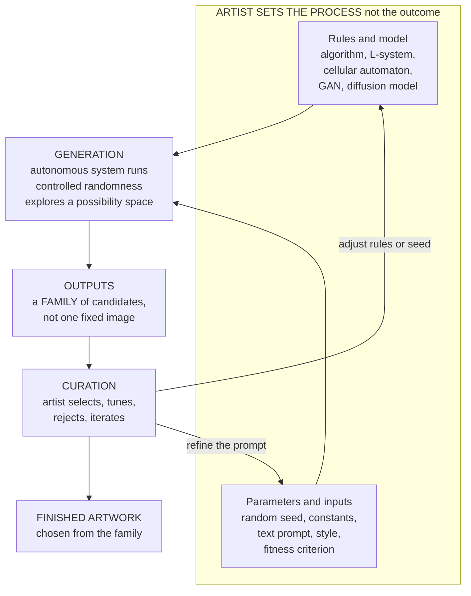

# 🎨 Generative Art and AI

> [!abstract] TL;DR
> **Generative art** is art produced by an **autonomous system executing rules the artist chose** — the artist designs the *process*, not the finished image, and lets **controlled randomness** explore a space of possible outcomes, then **curates** the results. This idea is old: Sol LeWitt's 1960s **instruction-based** wall drawings, cellular automata, **L-systems**, fractals, flow fields, and **evolutionary (genetic) art** all let a procedure make the picture. Deep learning then supercharged it. First **GANs** (Generative Adversarial Networks) pitted two neural nets in a forgery game — one produced the auction piece *Portrait of Edmond de Belamy* (Christie's, 2018, USD 432,500). Then **diffusion models** — DALL-E, Midjourney, **Stable Diffusion** — learned to turn a **text prompt** into an image by iteratively denoising random noise inside a learned **latent space**, making **prompt engineering** a new craft. This reopens ancient questions with new force: can a machine be **creative** (the Lovelace test)? Who is the **author** — coder, prompter, model, or the millions of scraped training images? And it ignites real fights over **copyright and consent**, the **livelihoods** of working artists, **deepfakes**, and the value of **human versus machine** art. Generative art is where this vault's threads — mathematics, code, aesthetics, and cognition — finally braid together.

---

## Intuition

**Analogy — the gardener, not the sculptor.** A sculptor decides in advance exactly where every curve and hollow will go, then imposes that vision on the marble: the artist *designs the outcome*. A **gardener** works the opposite way. She chooses the seeds, the soil, the trellis, the pruning schedule — she *designs the process and the constraints* — and then the plant grows *itself*, differently every season, in ways she could not have drawn beforehand. She does not place each leaf; she sets up the conditions and then **selects and prunes** what emerges. Generative art is gardening for images: the artist writes the rules and plants a seed of randomness, the *system* grows the picture, and the artist curates the harvest.

Extend the analogy into the technical domain: the "seeds and soil" become an **algorithm plus a random seed**; the "growing" becomes the machine iterating those rules with controlled randomness; and one rule set yields not a single image but a whole **family** of related-but-distinct pieces, from which the artist keeps the best. A modern diffusion model is the same garden scaled to planetary size — its "soil" is a hundred million photographs, its "trellis" is a text prompt, and it grows a coherent image out of pure noise.

---

## How It Works

### From instructions to autonomous systems

Generative art is any practice where the artist hands control of the *making* to a system that runs "with some degree of autonomy" (Philip Galanter's widely used definition). The pivotal move is **separating the idea from the execution**. Its clearest fine-art ancestor is **Sol LeWitt's** conceptual work: LeWitt wrote terse *instructions* ("draw ten thousand straight lines... within a square") and had assistants execute them, declaring in 1967 that "the idea becomes a machine that makes the art." The specific marks vary with each executor and wall; the *art* is the rule. Swap the human draftsman for a computer and you have algorithmic generative art. The essential ingredient is **controlled randomness** — enough chance to surprise the artist, enough constraint that every output still belongs to the intended family.

### The classic (pre-neural) toolkit

- **Algorithms and procedural rules.** Deterministic recipes (recursion, tiling, reaction-diffusion) that unfold into complex form.
- **Cellular automata.** A grid of cells updated by simple local rules produces astonishing global patterns — Conway's Game of Life, Wolfram's **Rule 30** — a canonical example of **emergence** from rules (see [[Cellular_Automata]]).
- **L-systems.** String-rewriting grammars (an *axiom* plus *production rules*) that, drawn with turtle graphics, grow botanically convincing plants and **fractals** (see [[Fractals_and_Self_Similarity]]).
- **Flow fields.** Particles advected through a vector field leave trails; Tyler Hobbs' *Fidenza* series is a famous example.
- **Evolutionary / genetic art.** A population of images is bred and mutated; a **fitness function** — or a human clicking "I like this one" (interactive evolution, as in Karl Sims' work) — selects survivors, so the artist steers evolution rather than drawing.

### The deep-learning revolution

**GANs (2014).** A **generator** network invents images while a **discriminator** network tries to tell fakes from real training images. They train in an adversarial arms race until the generator's fakes fool the critic — a two-player game that yields novel, photoreal-ish images. The art collective Obvious used a GAN to produce *Portrait of Edmond de Belamy*, sold at Christie's in 2018 for USD 432,500 — the moment AI art hit the mainstream artworld (see [[GAN]]).

**Diffusion models and text-to-image (2020 onward).** A diffusion model learns by watching images get **destroyed** — Gaussian noise is added step by step until nothing remains — and training a network to **reverse** that, denoising noise back into structure. To generate, you start from pure random noise (the **seed**) and let the model denoise it into an image. Make the denoising **conditioned on a text prompt** (via a joint text-image embedding like CLIP) and you get **text-to-image**: type words, receive a picture (see [[Diffusion_Models]]). **Stable Diffusion** made this efficient by diffusing not in pixel space but in a compressed **latent space** produced by an autoencoder — **latent diffusion** — which is why it runs on consumer GPUs (see [[Stable_Diffusion]], [[Variational_Autoencoders]]). Steering these models well became a discipline of its own — **prompt engineering** (see [[Prompt_Engineering]], [[Multimodal_AI]]).

### Computational creativity, aesthetics, and the fights

**Can a machine be creative?** The research field of **computational creativity** takes the question seriously. Margaret Boden distinguishes **combinational**, **exploratory**, and **transformational** creativity — and current models excel at the first two (recombining and exploring a learned space) while genuine transformation of the space itself is contested. The **Lovelace test** (Bringsjord et al.) demands a machine produce output its designers cannot explain as a mere consequence of the program — a high bar most argue today's models do not clear.

**The aesthetics of AI art** are double-edged: an eerie **uncanniness** (six-fingered hands, dreamlike coherence), a tendency toward the **average** and the **homogenized** (a recognizable "AI look" that regresses to the mean of the training data), and a genuine **loss of authorial intention** — set against a vast **new possibility space** artists can now explore. And the **debates are fierce**: **authorship** (is the artist the coder, the prompter, the model, or the training data?), **copyright and consent** (artists' works scraped without permission), **impact on working illustrators and concept artists**, **deepfakes and misinformation**, and the deeper question of whether human-made art carries value machine art cannot.



---

## Key Concepts

### Secondary Level

**Designing the process, not the picture.** In ordinary painting you decide what the final image looks like and then make it. In generative art you decide the **rules** and a starting **seed**, and the machine makes the image. You are surprised by your own artwork — that surprise is the point.

**Controlled randomness.** Pure chance gives noise; pure rules give something predictable and dead. Generative art lives in between: a rule set plus a dash of randomness, tuned so every result is different yet clearly belongs to the same family. A Spirograph is a toy version — the same gears, a slightly different starting hole, a new but related pattern.

**The seed.** Almost every generative system has a "seed" — a number that sets the random starting point. Change the seed and you get a different piece from the same rules. In a text-to-image model, the seed is the specific patch of random noise the picture is grown from.

**Text-to-image in one line.** Modern tools like DALL-E, Midjourney, and Stable Diffusion take a sentence of text ("a lighthouse in a storm, oil painting") and turn random static into a matching picture, step by step.

---

### Undergraduate Level

**L-systems and production rules.** An L-system is a tiny grammar: an *axiom* (a starting string) and *production rules* that rewrite symbols. Apply the rules a few times, interpret the symbols as turtle-graphics commands (move, turn, push/pop position), and a branching plant or fractal appears. The artist writes perhaps three rules and an angle; the recursion produces the intricacy. This is generative art at its most legible — you can *read* the rules that made the image.

**Cellular automata and emergence.** A grid of on/off cells, updated by a rule that looks only at each cell's neighbors, can generate patterns of unbounded complexity (Rule 30 is used as a random-number generator; Game of Life supports self-reproducing structures). The lesson generalizes across this vault: **simple local rules can generate global complexity** no one designed cell by cell.

**The GAN game.** Train two networks against each other. The **generator** maps random noise to an image; the **discriminator** scores images as "real" (from the dataset) or "fake." Backpropagation pushes the generator to fool the discriminator and the discriminator to catch the generator. At equilibrium the generator has learned the data distribution well enough to synthesize convincing new samples. GANs are powerful but notoriously unstable and prone to **mode collapse** (see below).

**The diffusion process.** Forward: repeatedly add small Gaussian noise to a training image until it becomes pure static — a fixed, known corruption. Reverse: train a network to predict and remove the noise at each step. Generation runs the reverse process from fresh noise. Because each step is a small, well-posed denoising problem, diffusion training is far more stable than GAN training, which is why it won the text-to-image era.

**Latent space and conditioning.** High-quality models do not diffuse raw pixels; they diffuse in a compressed **latent space** learned by an autoencoder — cheaper and semantically smoother. **Conditioning** injects a **text embedding** into the denoiser (cross-attention on CLIP-style features) so the denoising is *steered* toward the prompt. Nearby points in latent space decode to visually similar images, which is why you can "interpolate" between concepts.

**Prompt engineering as craft.** With the model fixed, the artist's leverage is the prompt (plus negative prompts, weights, seeds, and sampler settings). Learning which words, styles, and modifiers reliably summon which results — and iterating toward intent — is a genuine, if fragile, new skill.

**Evolutionary art.** Represent an image as a genome (parameters, a program, or a latent vector), generate a population, then **select, mutate, and recombine** using a fitness function or human taste. The artist shapes the *selection pressure* rather than the pixels — process design one level up.

---

### Graduate Level

**Boden's three creativities and the Lovelace test.** Margaret Boden splits creativity into **combinational** (novel combinations of familiar ideas), **exploratory** (finding new points inside an accepted conceptual space), and **transformational** (changing the space's own rules so previously impossible ideas become possible). Diffusion models are formidable at combinational and exploratory creativity — they interpolate and remix a learned manifold — but whether they can achieve **transformational** creativity, or merely sample ever more finely from an existing distribution, is the crux of the debate. The **Lovelace test** sharpens this: a system is creative only if it produces an output its designer *cannot account for* by appeal to the program's known workings. Most theorists hold that a model trained to reproduce a data distribution, however impressively, fails this test in principle even as it passes casual Turing-style inspection.

**The authorship problem.** A single AI image implicates at least four candidate authors: the **engineers** who built and trained the model, the **prompter** who specified the output, the **model** itself as an autonomous agent, and the **millions of artists** whose images constitute the training distribution. Legal systems are converging on the position that authorship requires **human** creative contribution: the US Copyright Office refused to register the fully AI-generated comic *Zarya of the Dawn*'s images (2023) and issued guidance that purely machine-generated output is not copyrightable, while human-arranged or substantially edited work may be. This turns the philosophical question ("who is the artist?") into a practical one ("whose contribution counts?").

**Copyright, consent, and the training data.** Text-to-image models are trained on web-scraped corpora (e.g., LAION) containing billions of copyrighted images used without artists' permission or payment. This drives litigation — *Andersen v. Stability AI*, *Getty Images v. Stability AI* — and a market response: Adobe **Firefly** advertises training only on licensed and public-domain content precisely to sidestep the consent problem. The technical fact that a model stores *statistical patterns* rather than copies does not settle the ethical claim that it was **built on uncompensated labor** and can now **compete with the very artists it learned from**.

**Homogenization, mode collapse, and "the average."** GANs suffer literal **mode collapse** — the generator maps many inputs to a few outputs, shrinking diversity. Diffusion models exhibit a softer analogue: outputs regress toward the statistical center of the training data, producing a recognizable, glossy "AI aesthetic" and quietly amplifying the **biases** of the corpus (Western, high-engagement, stereotype-laden imagery). Aesthetically this is the tyranny of the average; ethically it is representational bias baked into the tool.

**The aesthetics of the manifold, and epistemic harm.** AI images occupy a strange perceptual register — the **uncanny** of near-coherence, dream logic, and impossible anatomy — that some artists exploit deliberately. The same generative power weaponized is the **deepfake**: photoreal fabrications that corrode the evidentiary status of images and enable disinformation, fraud, and non-consensual media. The value question is thus not merely "is it beautiful?" but "what happens to a visual culture in which any image might be synthetic?"

**Generative art as the vault's culmination.** Here mathematics (probability, manifolds, dynamical systems), code (algorithms and neural nets), aesthetics (form, style, taste), and cognition (creativity, perception, the mind that judges) stop being separate subjects and become one artifact. The generative artwork is a *proof by construction* that these domains were always the same inquiry viewed from different sides.

---

## Python Demo

```python
# GENERATIVE ART FROM A RULE, NOT A DRAWING.
# A flow-field particle piece: the artist writes ONE rule (a smooth vector field
# built from a few sine waves) and drops particles that FLOW along it, leaving
# trails. The artist never places a single stroke -- the SYSTEM draws the picture.
# Changing only the SEED yields a whole FAMILY of related-but-distinct pieces,
# which is the essence of generative art: design the process, curate the outputs.
#
# Requires numpy and matplotlib only.

import numpy as np
import matplotlib
matplotlib.use("Agg")            # headless-safe backend
import matplotlib.pyplot as plt


def field_angle(x, y, phase):
    """The ARTIST'S RULE: map each point (x, y) in [0,1] to a flow direction.
    A sum of sinusoids gives a smooth, noise-like vector field. `phase` is set
    by the seed, so each seed rotates/reshapes the whole field -> a new artwork."""
    a  = np.sin(6.0 * x + phase) + np.cos(5.0 * y - phase)
    a += 0.5 * np.sin(11.0 * x * y + 2.0 * phase)
    a += 0.3 * np.cos(9.0 * (x - y) + phase)
    return np.pi * a             # scale the scalar field into an angle


def generate_piece(ax, seed, n_particles=800, n_steps=200, step=0.0016):
    """SYSTEM GENERATES: advect particles through the field and draw their trails."""
    rng = np.random.default_rng(seed)
    phase = rng.uniform(0, 2 * np.pi)                 # seed -> field variation
    x = rng.uniform(0, 1, n_particles)               # random starts (controlled)
    y = rng.uniform(0, 1, n_particles)

    xs = np.empty((n_steps, n_particles))
    ys = np.empty((n_steps, n_particles))
    for t in range(n_steps):                          # integrate the flow
        xs[t], ys[t] = x, y
        ang = field_angle(x, y, phase)
        x = np.mod(x + step * np.cos(ang), 1.0)       # wrap at the canvas edges
        y = np.mod(y + step * np.sin(ang), 1.0)

    # colour each trail by the field angle at its start -> coherent palette
    base = field_angle(xs[0], ys[0], phase)
    hue = (base - base.min()) / (np.ptp(base) + 1e-9)
    cmap = plt.cm.twilight

    for i in range(n_particles):
        # split a trail wherever wrapping caused a big jump, so no streaks appear
        jump = (np.abs(np.diff(xs[:, i])) > 0.5) | (np.abs(np.diff(ys[:, i])) > 0.5)
        for seg in np.split(np.arange(n_steps), np.where(jump)[0] + 1):
            if len(seg) > 1:
                ax.plot(xs[seg, i], ys[seg, i], color=cmap(hue[i]),
                        lw=0.4, alpha=0.35)

    ax.set_xlim(0, 1); ax.set_ylim(0, 1)
    ax.set_xticks([]); ax.set_yticks([])
    ax.set_facecolor("#0b0b16")
    ax.set_title(f"seed = {seed}", fontsize=9)


# ONE rule set, FOUR seeds -> a generative FAMILY the artist would curate from.
fig, axes = plt.subplots(1, 4, figsize=(16, 4.3))
for ax, seed in zip(axes, [1, 7, 42, 2024]):
    generate_piece(ax, seed)
fig.suptitle("Flow-field generative art: one RULE, a FAMILY of outcomes (vary the seed)",
             fontsize=13, fontweight="bold")
fig.patch.set_facecolor("white")
plt.tight_layout()
plt.savefig("flow_field_generative_art.png", dpi=140, bbox_inches="tight")
print("saved flow_field_generative_art.png")

# HOW DIFFUSION MODELS SCALE THIS EXACT IDEA:
#   * Here the "field" is a hand-written rule with ONE knob (the seed).
#   * A diffusion model REPLACES the hand-written rule with a neural network
#     trained on hundreds of millions of images. Its field is a LEARNED denoising
#     vector field in a high-dimensional LATENT space.
#   * Generation still starts from pure random noise (the seed) and FLOWS it,
#     step by step, toward a plausible image -- now STEERED by a TEXT PROMPT
#     instead of a fixed integer. Same paradigm (start from noise, follow a
#     field, curate the result); the rule is LEARNED, and the knob is language.
```

Running this produces four panels: identical rules, four seeds, four distinct-yet-kin images — the generative "family" from which an artist curates. The closing comment maps the toy directly onto diffusion: swap the hand-written sinusoid field for a learned latent denoising field and swap the integer seed for a text prompt, and the flow-field paradigm becomes DALL-E.

---

## Real-World Applications

> **Text-to-image platforms.** Midjourney, OpenAI's DALL-E, and open-source **Stable Diffusion** put diffusion-based generation in the hands of millions, powering concept art, mood boards, marketing, and hobbyist creation. Stable Diffusion's open weights spawned an ecosystem of fine-tunes (LoRAs), ControlNet steering, and local tooling.

> **Licensed / consent-first models.** Adobe **Firefly** is trained on Adobe Stock, openly licensed, and public-domain content, and ships commercial indemnification — a direct market response to the training-data consent controversy, positioning "clean" provenance as a feature enterprises will pay for.

> **Generative-art NFTs and the on-chain canvas.** Art Blocks and fx(hash) mint *algorithmic* generative art where the code runs at mint time and the buyer's transaction hash is the seed. Tyler Hobbs' **Fidenza** (a flow-field system) is the emblematic example — the collector receives an output the artist never saw, from a rule set the artist authored.

> **Museum-scale data art.** Refik Anadol's installations feed vast datasets through generative models to produce immersive, ever-changing "data paintings" (e.g., *Unsupervised* at MoMA), reframing a neural network's latent space as an aesthetic material.

> **Deepfakes and synthetic media.** The same generative machinery produces photoreal fabricated video and imagery — used for satire and film VFX, but also for fraud, political disinformation, and non-consensual content, driving watermarking (e.g., content-provenance standards) and detection research.

> **Games and film pipelines.** Procedural and generative methods produce textures, terrain, NPC variety, and rapid concept iteration, compressing pre-production while raising sharp questions about illustrator and concept-artist employment.

---

## Common Pitfalls

- **Conflating "generative" with "AI."** Generative art predates neural nets by decades — cellular automata, L-systems, and Processing sketches are generative without any learning. "AI art" is a *recent subset*. Treating the two as synonyms erases the tradition and its rule-based clarity.
- **Mistaking the prompt for the artwork.** A prompt is a seed of intent; the labor and the art often lie in **iteration, selection, editing, and composition** (the curation loop). Underrating curation both overstates and understates the human role — it is neither "you typed a sentence" nor "the AI did it alone."
- **Believing randomness equals creativity.** Noise is not art. The craft is **controlled** randomness — tuning the rules so the possibility space is interesting and every sample stays on-theme. Turning the randomness up to maximum yields mush, not genius.
- **Ignoring training-data provenance.** Assuming outputs are ethically and legally "clean" ignores that most models learned from **uncompensated, non-consenting** artists. Provenance now affects both ethics and commercial risk (indemnification, litigation).
- **Anthropomorphizing the model.** Saying the model "imagines" or "dreams" smuggles in intention and understanding it does not have. It samples a learned distribution; treating that as sentience distorts both the aesthetics and the policy debate.
- **Expecting the average to be excellent.** Because outputs regress toward the training mean, defaults look competent-but-generic (the "AI look") and reproduce dataset **biases**. Distinctive results require fighting the mean — steering, fine-tuning, and heavy curation.
- **Assuming AI-only work is copyrightable.** In the US, purely machine-generated images currently lack the human authorship required for copyright. Commercial users who assume automatic ownership can be surprised.

---

## Related Concepts

- [[GAN]] — the adversarial generator-versus-discriminator game behind the first mainstream AI artwork, *Portrait of Edmond de Belamy*; the deep-learning starting point for this note.
- [[Diffusion_Models]] — the forward-noising / learned-reverse-denoising process that powers today's DALL-E, Midjourney, and Stable Diffusion; the technical heart of modern AI art.
- [[Stable_Diffusion]] — **latent** diffusion and open weights: the specific architecture that democratized text-to-image and seeded an entire tooling ecosystem.
- [[Prompt_Engineering]] — prompting, negative prompts, and iteration as the new craft by which a human steers a generative model toward intent.
- [[Multimodal_AI]] — the joint text-image embeddings (CLIP-style) that let a sentence *condition* image generation, making text-to-image possible.
- [[Variational_Autoencoders]] — the latent-space generative precursor; the autoencoder that compresses images into the latent space Stable Diffusion actually diffuses in.
- [[Cellular_Automata]] — rule-based autonomous generation (Rule 30, Game of Life): classic generative art and a paradigm of emergence from simple local rules.
- [[Fractals_and_Self_Similarity]] — the self-similar recursion behind L-systems and fractal art, the mathematical backbone of pre-neural generative imagery.
- [[What_Is_Art]] — the definitional stakes: does authorless, machine-produced output count as art, and by which theory (institutional, expressive, aesthetic)?
- [[Contemporary_and_Postmodern_Art]] — the lineage of conceptual/instruction art (Sol LeWitt), the post-medium condition, and the NFT market into which generative art plugs.
- [[Art_and_Meaning]] — authorship, intention, and meaning when there is no human hand and no single mind behind the image.

---

## Review Questions

### Secondary

1. In your own words, what is the difference between a **sculptor** deciding every detail in advance and a **generative artist** who "sets the rules and lets the system make the picture"? Give one everyday example of controlled randomness (like a Spirograph).
2. When you type a sentence into a text-to-image tool and get a picture, roughly what is the model doing to the initial random **noise**, and what does changing the **seed** do?
3. Name two ways of making generative art that do **not** use AI at all (hint: think grids of cells, or plant-like fractals).

### Undergraduate

1. Explain the **GAN** training game and the **diffusion** generation process, and give one concrete reason diffusion models largely replaced GANs for text-to-image. What role does the **latent space** play in Stable Diffusion?
2. What does it mean to say prompt engineering is a "craft," and what is the danger in claiming that the prompter alone is "the artist"? Frame your answer using the **curation** loop from the diagram.
3. Cellular automata and L-systems both generate complexity from a handful of rules. Using one of them, explain how "simple local rules produce global complexity," and connect this to why generative art is said to *design the process, not the outcome*.

### Graduate

1. Using **Boden's** combinational / exploratory / transformational distinction and the **Lovelace test**, argue whether a modern diffusion model is genuinely *creative* or merely samples an existing distribution. What evidence would change your verdict?
2. A single AI image implicates the engineers, the prompter, the model, and the training corpus. Construct the strongest case for **each** as "the author," then explain why current copyright regimes (e.g., the US human-authorship requirement, *Zarya of the Dawn*) resolve the question the way they do — and whether that resolution is philosophically satisfying.
3. "Homogenization toward the average" and "training on non-consenting artists" are often treated as separate problems — one aesthetic, one ethical. Argue that they share a **common root** in how these models are built and trained, and propose one technical or institutional intervention that addresses both. What does it cost?

---

## Sources

- [Ian Goodfellow et al., "Generative Adversarial Networks" (2014), arXiv:1406.2661](https://arxiv.org/abs/1406.2661)
- [Jonathan Ho, Ajay Jain, Pieter Abbeel, "Denoising Diffusion Probabilistic Models" (2020), arXiv:2006.11239](https://arxiv.org/abs/2006.11239)
- [Robin Rombach et al., "High-Resolution Image Synthesis with Latent Diffusion Models" (Stable Diffusion, 2022), arXiv:2112.10752](https://arxiv.org/abs/2112.10752)
- [Christie's, "Is artificial intelligence set to become art's next medium?" (Portrait of Edmond de Belamy, 2018)](https://www.christies.com/features/A-collaboration-between-two-artists-one-human-one-a-machine-9332-1.aspx)
- [Selmer Bringsjord, Paul Bello, David Ferrucci, "Creativity, the Turing Test, and the (Better) Lovelace Test" (2001), Minds and Machines](https://link.springer.com/article/10.1023/A:1011206622741)
- [U.S. Copyright Office, "Copyright Registration Guidance: Works Containing Material Generated by Artificial Intelligence" (2023)](https://www.federalregister.gov/documents/2023/03/16/2023-05321/copyright-registration-guidance-works-containing-material-generated-by-artificial-intelligence)
- [Philip Galanter, "What is Generative Art? Complexity Theory as a Context for Art Theory" (2003)](https://www.philipgalanter.com/downloads/ga2003_paper.pdf)

---

#aesthetics #generative-art #ai-art #diffusion #computational-creativity
