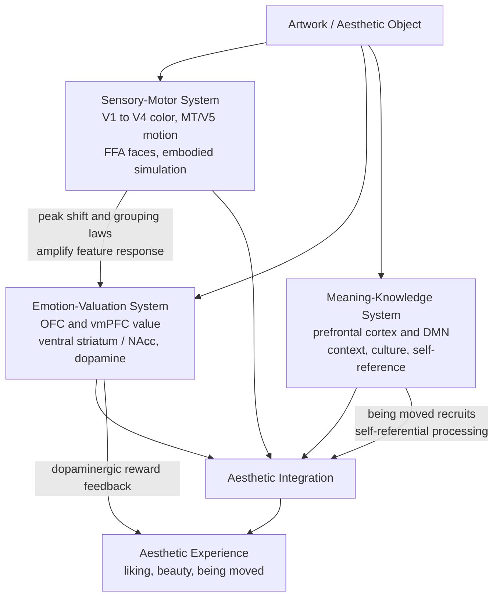

# 🧠 Neuroaesthetics and the Brain

> [!abstract] TL;DR
> **Neuroaesthetics** (a term coined by neurobiologist **Semir Zeki** around 1999) is the neuroscientific study of *how the brain produces aesthetic experience*. Its core claims: (1) artists are unwitting **neuroscientists** who intuitively discover the operating principles of the visual brain — its separate systems for **color** (area V4), **motion** (MT/V5), **form**, and **faces** (the fusiform face area); (2) Ramachandran & Hirstein's **"eight laws of art"**, above all the **peak-shift principle**, explain why **caricature and exaggeration** are so powerful — an exaggerated feature is a **super-stimulus** that drives a feature-tuned neuron *harder than the natural original*; and (3) the *pleasure* of beauty engages the brain's general **reward circuitry** — the **orbitofrontal cortex (OFC)**, the **ventral striatum / nucleus accumbens**, and **dopamine** — while richer, self-referential "being moved" experiences recruit the **default-mode network**. Chatterjee & Vartanian's **aesthetic triad** organizes all this into three interacting systems (sensory-motor, emotion-valuation, meaning-knowledge). The field's power is matched by real critiques: **reductionism**, neglect of **culture**, and "**neuro-hype**."

---

## Intuition

**Analogy:** A locksmith who has never read a textbook on lock design can, after years of feeling springs click, tell you *exactly* which internal mechanism a key engages — because every successful pick is an experiment on the lock's hidden structure. Neuroaesthetics says the **artist is that locksmith and the brain is the lock**. Across millennia, painters and sculptors ran a vast, informal experiment on human vision — testing which marks make color glow, which contours read as a face, which distortions feel *more* real than reality — and the tricks that "worked" survived precisely because they fit the brain's wiring. Impressionism *feels* luminous because it exploits how V4 computes color from context; a caricature is *more* recognizable than a photograph because it pushes a face past its true form into the direction its recognition neurons are already tuned toward.

So instead of asking "what makes this beautiful?" as a mystery of taste, neuroaesthetics asks a mechanical question: *which neural system did the artist happen to trip, and why does tripping it feel good?* The answer folds together **perceptual machinery** (feature detectors that fire hardest for exaggerated inputs) and **reward machinery** (the same dopamine circuit that values food, money, and sex, now valuing a Vermeer).

---

## How It Works

### Zeki: art as a probe of the visual brain

The visual brain is not a camera; it is a bank of **functionally specialized systems** operating in parallel, largely along two streams — the **ventral "what" stream** (object and face identity) and the **dorsal "where/how" stream** (location and action). Zeki's insight is that each specialization has a corresponding **art form** that isolates and celebrates it:

- **Color** is computed in **area V4**, which achieves *color constancy* — it reads a surface's color from surrounding context, not raw wavelength. Painters exploited this centuries before neuroscience named it; the glow of an Impressionist canvas is V4 being fed exactly the contextual contrasts it evolved to integrate.
- **Motion** is the province of **MT/V5**. **Kinetic art** (Calder's mobiles) and the implied motion of Futurist painting target this system directly; patients with V5 damage (akinetopsia) lose motion while keeping form.
- **Form and contour** are built in **V1–V3**; line drawing and the *outline* — a boundary that does not physically exist as an edge of luminance in the world — is an artistic discovery about how the brain reifies edges.
- **Faces** are handled by the **fusiform face area (FFA)** plus the OFA and STS; portraiture and caricature are, in effect, applied FFA science.

Because these systems can be dissociated, **different art forms engage different areas** — and "great art," Zeki argues, is art that satisfies the brain's search for **constancies and essentials** (the enduring, invariant properties of objects) despite ever-changing viewing conditions.

### Ramachandran & Hirstein: the "science of art" and peak shift

V. S. **Ramachandran** and William Hirstein (1999) proposed a set of heuristics — often listed as **eight (or nine) "laws" of aesthetic experience**: **peak shift, grouping, contrast, isolation, perceptual problem-solving (the "aha"), symmetry, abhorrence of coincidence / generic viewpoint, repetition-rhythm-orderliness, and metaphor**. The crown jewel is **peak shift**, borrowed from animal **discrimination learning**:

> Train a rat that a *rectangle* is rewarded (S+) and a *square* is not (S-). The rat later responds **most strongly not to the trained rectangle but to an even longer, thinner rectangle** — its peak response has *shifted* away from the unrewarded S- and *past* the rewarded S+.

Applied to art: the brain stores an **average / prototype** face (the "boring" S-, the population mean). Any individual face is defined by *how it deviates from that average*. A **caricature amplifies exactly those deviations** — it is the mathematical difference `(this face − average face)` scaled up. Because the recognition system's response is *shifted* toward the deviation, the amplified form is a **super-stimulus** that fires the "this-particular-person" detector *harder than the real face does*. This is why a good caricature can be **more recognizable than a photograph**, and it generalizes far beyond faces: the exaggerated hip-to-waist ratio of a Chola bronze, the elongation of a Giacometti figure, the heightened redness of a sunset.

### The reward system: where beauty becomes pleasure

Perceiving structure is not yet *liking* it. The felt pleasure of beauty is produced when perceptual signals reach the brain's **domain-general reward circuitry**:

- The **orbitofrontal cortex (OFC)** and adjacent **medial OFC / ventromedial PFC** encode subjective **value and pleasantness** — activity there scales with rated beauty across paintings, faces, and music.
- The **ventral striatum / nucleus accumbens (NAcc)** and **dopamine** signal **wanting and reward prediction error** — the same currency the brain uses for food and money (see [[Decision_Making_and_Reward_Circuits]]).
- Musical **"chills" / frisson** produce dopamine release in the striatum with a characteristic *anticipation-then-peak* structure, tying aesthetic emotion to the reward loop (see [[Music_Cognition_and_Emotion]]).

So aesthetic liking is well-modeled as a **product**: a strong perceptual/feature response *times* a reward-circuit gain that turns "this fits my visual machinery" into "this feels good."

### The default-mode network and being moved

Simply *liking* a pretty pattern is shallow. The deep, self-relevant experience of being **moved** by art — the kind that recruits memory, identity, and meaning — engages the **default-mode network (DMN)** (medial PFC, posterior cingulate, angular gyrus), the system for **self-referential and internally-directed thought**. Belfi, Vessel and colleagues found that the most *moving* artworks are precisely those that break out of stimulus-driven processing and pull the DMN into the aesthetic response — the artwork becomes *about you*.

### Chatterjee & Vartanian: the aesthetic triad

Anjan **Chatterjee** and Oshin **Vartanian** synthesized the field into the **aesthetic triad** — three large-scale systems whose interaction *is* the aesthetic experience:

1. **Sensory-motor** — early perception, feature processing, and **embodied simulation** (motor resonance).
2. **Emotion-valuation** — reward, OFC, striatum, and core affect.
3. **Meaning-knowledge** — expertise, context, culture, and the DMN.

### Freedberg & Gallese: embodied simulation

**Freedberg & Gallese (2007)** added the body: viewing a slashed Fontana canvas, a Michelangelo *Prigione* straining in marble, or a violent brushstroke activates **mirror mechanisms** and motor/somatosensory areas as if *you* performed the action or felt the effort. Aesthetic response is **enacted, not merely observed** — a bridge to [[Embodied_and_Extended_Cognition]].



---

## Key Concepts

### Secondary (school-level intuition)

- **Neuroaesthetics** — the science of *what happens in the brain* when we find something beautiful.
- **Artists as brain-explorers** — painters figured out visual "tricks" (glowing color, outlines, caricature) long before scientists explained *why they work*.
- **Peak shift / caricature** — exaggerating what makes a face *different* makes it *easier to recognize and more striking* than the real face. A cartoon of a celebrity can look "more them than them."
- **Reward** — beauty feels good because it lights up the same brain "pleasure/wanting" system as tasty food and winning a game.
- **Being moved** — the deepest art makes the experience feel *about you*, not just pretty.

### Undergraduate (neuroscience and psychology depth)

- **Zeki's functional specialization** — parallel visual systems: **V4** (color, color constancy), **MT/V5** (motion), **FFA** (faces); ventral "what" vs dorsal "where/how" streams. Great art targets the brain's search for **constancies/essentials**.
- **Ramachandran's laws** — peak shift, grouping, contrast, isolation, perceptual problem-solving, symmetry, generic-viewpoint avoidance, repetition/rhythm, metaphor.
- **Peak shift from discrimination learning** — response peaks *beyond* S+ and *away from* S-; caricature = amplified deviation from the stored prototype/average, hence a **super-stimulus**.
- **Reward substrates** — **OFC/vmPFC** (subjective value), **ventral striatum/NAcc + dopamine** (wanting/prediction error); musical chills as striatal dopamine release.
- **Aesthetic triad (Chatterjee & Vartanian)** — sensory-motor, emotion-valuation, meaning-knowledge.
- **Embodied simulation (Freedberg & Gallese)** — mirror/motor resonance when viewing depicted actions, effort, and gestural marks.
- **Default-mode network** — self-referential processing underlying *being moved* by art.

### Graduate (theoretical, computational, and critical view)

- **Prototype geometry of caricature** — faces live in a high-dimensional "face space" centered on a norm; identity is the vector *from* the norm, and caricature is scalar amplification of that vector. Norm-based (rather than exemplar-based) coding predicts the caricature advantage and links to **adaptation aftereffects** (anti-faces).
- **Peak shift as a shifted generalization gradient** — excitatory generalization around S+ minus inhibitory generalization around S- yields a net response whose maximum lies past S+; this is a *linear-model* explanation of a super-stimulus, not a special "art module."
- **Liking vs wanting** — Berridge's dissociation: dopamine primarily codes **wanting/incentive salience**; hedonic **liking** depends on opioid/GABA "hotspots" in NAcc and ventral pallidum. Beauty engages both, and conflating them is a common error.
- **Fluency and prototype effects converge** — averageness/prototypicality raise both processing **fluency** and rated beauty, tying neuroaesthetics to the fluency account in [[Aesthetic_Experience_and_Perception]] and to predictive-processing readings of aesthetic pleasure.
- **The critiques** — (1) **reductionism**: localizing beauty in OFC does not *explain* it or exhaust its meaning; (2) **culture and learning**: many "laws" are trained, not innate, and vary across traditions; (3) **reverse inference and neuro-hype**: inferring an experience from a blob of BOLD activation is logically weak, and "neuro-" prefixes lend spurious authority (a cousin of learning-science neuromyths); (4) **small, WEIRD samples** and low-power fMRI. Neuroaesthetics is best read as *one level of analysis*, complementary to philosophy and art history, not a replacement.

---

## Python Demo

We model a **simplified neuroaesthetic response**: aesthetic liking arises from **perceptual reward** (a feature-tuned neural response) passed through **reward-circuit gain** (an OFC/striatal saturating amplifier). The perceptual response is built from Ramachandran's **peak-shift** principle — we form the tuning curve as an *excitatory* generalization gradient around the rewarded, distinctive stimulus (S+) minus an *inhibitory* gradient around the unrewarded prototype/average (S-). The resulting curve **peaks beyond S+**, so an **exaggerated (caricatured) super-stimulus drives the neuron harder than the natural prototype** — the basis of caricature and much art.

```python
# Neuroaesthetics: peak shift, super-stimuli, and reward-circuit gain.
# numpy + matplotlib only.
import numpy as np
import matplotlib.pyplot as plt

# ----------------------------------------------------------------------
# 1. A FEATURE AXIS
#    x = how far a facial feature deviates from the population AVERAGE.
#    x = 0  -> the prototype / average face  (the unrewarded S-)
#    x = 1  -> a real, distinctive individual (the rewarded  S+)
#    x > 1  -> a CARICATURE: the same deviation, exaggerated.
# ----------------------------------------------------------------------
x = np.linspace(-1.0, 3.5, 500)
S_plus  = 1.0   # veridical distinctive feature (rewarded)
S_minus = 0.0   # prototype / average face      (unrewarded)

def gaussian(x, mu, sigma):
    return np.exp(-((x - mu) ** 2) / (2.0 * sigma ** 2))

# Peak shift = excitatory generalization around S+  MINUS
#              inhibitory generalization around S-.
excitatory = 1.00 * gaussian(x, S_plus,  sigma=0.75)
inhibitory = 0.70 * gaussian(x, S_minus, sigma=0.75)
perceptual = np.clip(excitatory - inhibitory, 0.0, None)   # feature-detector firing

x_peak = x[np.argmax(perceptual)]   # where the neuron fires HARDEST
print(f"S- (prototype/average) at x = {S_minus:.2f}")
print(f"S+ (real distinctive)  at x = {S_plus:.2f}")
print(f"Peak of neural response at x = {x_peak:.2f}  <-- SHIFTED BEYOND S+ (caricature)")

# ----------------------------------------------------------------------
# 2. REWARD-CIRCUIT GAIN
#    OFC / ventral striatum turn a perceptual response into felt LIKING
#    via a saturating (Naka-Rushton) transfer function. Aesthetic liking
#    = a blend of raw perceptual reward AND its reward-circuit activation.
# ----------------------------------------------------------------------
def reward_gain(r, sigma=0.30, n=2.0):
    r = np.clip(r, 0.0, None)
    return r ** n / (r ** n + sigma ** n)      # saturates in [0, 1]

w_perc, w_reward = 0.35, 0.65                  # perceptual vs reward weighting
liking = w_perc * perceptual + w_reward * reward_gain(perceptual)

# ----------------------------------------------------------------------
# 3. FOUR NAMED STIMULI ALONG THE AXIS
# ----------------------------------------------------------------------
def response_at(xv):
    e = 1.00 * gaussian(np.array([xv]), S_plus,  0.75)
    i = 0.70 * gaussian(np.array([xv]), S_minus, 0.75)
    p = np.clip(e - i, 0.0, None)[0]
    return p, (w_perc * p + w_reward * reward_gain(np.array([p]))[0])

stimuli = {
    "prototype (average)": S_minus,
    "real face (S+)":      S_plus,
    "optimal caricature":  x_peak,
    "over-exaggerated":    3.0,
}
print("\nstimulus              perceptual   aesthetic-liking")
for name, xv in stimuli.items():
    p, L = response_at(xv)
    print(f"  {name:20s}  {p:8.3f}   {L:12.3f}")

# ----------------------------------------------------------------------
# PLOTS
# ----------------------------------------------------------------------
fig, (ax1, ax2) = plt.subplots(1, 2, figsize=(13, 5.2))

# Left: the peak-shifted tuning curve
ax1.plot(x, excitatory, "--", color="#4a9eff", lw=1.6, label="excitatory around S+")
ax1.plot(x, inhibitory, "--", color="#e06666", lw=1.6, label="inhibitory around S-")
ax1.plot(x, perceptual, color="#7c3aed", lw=2.8, label="net feature response")
ax1.axvline(S_minus, color="#e06666", ls=":", lw=1.2)
ax1.axvline(S_plus,  color="#4a9eff", ls=":", lw=1.2)
ax1.axvline(x_peak,  color="#2e7d32", ls="-",  lw=1.6)
ax1.annotate("prototype\n(S-)",  xy=(S_minus, 0.05), ha="center", color="#e06666")
ax1.annotate("real face\n(S+)",  xy=(S_plus, 0.05),  ha="center", color="#4a9eff")
ax1.annotate("PEAK SHIFT\ncaricature = super-stimulus",
             xy=(x_peak, perceptual.max()),
             xytext=(x_peak + 0.35, perceptual.max() * 0.9),
             color="#2e7d32", arrowprops=dict(arrowstyle="->", color="#2e7d32"))
ax1.set_xlabel("feature deviation from average face")
ax1.set_ylabel("neural response")
ax1.set_title("Peak shift: the neuron fires hardest\nBEYOND the real face")
ax1.legend(loc="upper right", fontsize=8)

# Right: perceptual reward vs aesthetic liking, plus the four stimuli
ax2.plot(x, perceptual, color="#7c3aed", lw=2.4, label="perceptual reward")
ax2.plot(x, liking,     color="#f59e0b", lw=2.8, label="aesthetic liking (after reward gain)")
for name, xv in stimuli.items():
    p, L = response_at(xv)
    ax2.plot(xv, L, "o", ms=9)
    ax2.annotate(name, xy=(xv, L), xytext=(xv, L + 0.05),
                 ha="center", fontsize=7.5)
ax2.set_xlabel("feature deviation from average face")
ax2.set_ylabel("magnitude")
ax2.set_title("Liking = perceptual reward x reward-circuit gain")
ax2.legend(loc="upper right", fontsize=8)

plt.tight_layout()
plt.savefig("neuroaesthetics_peak_shift.png", dpi=120)
plt.show()
```

**What to notice:** In the *left* panel, subtracting the inhibitory gradient centered on the **prototype (S-)** from the excitatory gradient centered on the **real face (S+)** pushes the peak of the net response *past* S+ — the neuron's maximum sits at an **exaggerated feature value**. That is the peak-shift signature: a **caricature is a super-stimulus** that drives the detector harder than the truthful image. In the *right* panel, the perceptual response is transformed by the **reward-circuit gain** into **aesthetic liking**, and the four labeled stimuli make the inverted-U concrete: liking climbs from the bland *prototype* to the *real face* to the *optimal caricature*, then **collapses for the over-exaggerated grotesque** — exaggeration helps only up to the tuning peak.

---

## Real-World Applications

- **Caricature and animation** — professional caricaturists and studios (Pixar, Disney) exaggerate the *distinctive* features of a face or body precisely because super-stimuli are more recognizable and more engaging; "appeal" in character design is applied peak shift.
- **Portraiture and figurative sculpture** — from Chola bronzes to Modigliani, artists heighten proportions the recognition system is tuned toward, producing forms that read as *more* alive than a cast.
- **Advertising and product design** — enlarged eyes ("baby-schema"), amplified color saturation, and idealized proportions are engineered super-stimuli that recruit reward circuitry.
- **Empirical / neuro-marketing aesthetics** — fMRI and rating studies of paintings, architecture, and web layouts map beauty to OFC/striatal activity, informing evidence-based design.
- **Music and film** — anticipation-and-release structures engineer striatal **dopamine "chills"**; sound design and editing ride the same reward dynamics as visual art.
- **Clinical and well-being uses** — art and museum "prescriptions," and studies of aesthetic response in dementia and stroke, use neuroaesthetic frameworks to design restorative environments.

---

## Common Pitfalls

- **Confusing dopamine "wanting" with hedonic "liking."** The mesolimbic dopamine signal mostly codes *incentive salience / prediction error*, while the actual pleasure ("liking") depends on opioid hotspots. Saying "dopamine = the feeling of beauty" is the single most common neuroaesthetics error.
- **Reverse inference.** Observing OFC activation and concluding "the subject experienced beauty" is logically invalid — the same region lights up for many things. Activation localizes a *correlate*, not the experience.
- **Treating the "laws of art" as innate universals.** Peak shift and grouping are real perceptual principles, but *which* features count as distinctive, and what is beautiful, are heavily shaped by **culture, training, and era**. The laws are constraints, not a theory of taste.
- **Over-exaggerating (misapplying peak shift).** Peak shift works only *up to the tuning peak*; push a feature past it and the response — and the appeal — collapses into the grotesque. Exaggeration is an inverted-U, not a monotone.
- **Reductionism / "nothing but."** "Beauty is nothing but OFC activity" mistakes a mechanism for an explanation and ignores meaning, context, and history. Neuroaesthetics is one level of analysis, not the whole account.
- **Neuro-hype.** Adding "neuro-" (or a brain scan) lends spurious authority to weak claims — a cousin of educational *neuromyths*. Demand adequate power, real effect sizes, and non-WEIRD samples.

---

## Related Concepts

- [[Aesthetic_Experience_and_Perception]] — the philosophy/psychology of aesthetic response (disinterestedness, **processing fluency**, prototypicality); neuroaesthetics supplies the neural substrate for the same phenomena.
- [[Visual_System_and_Visual_Cortex]] — the V1–V4, MT/V5, and ventral/dorsal stream machinery that Zeki argues artists intuitively probe.
- [[Decision_Making_and_Reward_Circuits]] — the OFC, ventral striatum/NAcc, and dopamine reward system that turns perceptual structure into *liking* and *wanting*.
- [[Visual_Cognition]] — object and face recognition, prototype coding, and the perceptual organization that grounds the "laws of art."
- [[Music_Cognition_and_Emotion]] — the auditory analogue: musical **chills/frisson** as striatal dopamine release, extending the reward account across modalities.
- [[Embodied_and_Extended_Cognition]] — the theoretical basis for Freedberg & Gallese's **embodied simulation** and mirror mechanisms in art viewing.

---

## Review Questions

1. **(Conceptual)** Explain the **peak-shift principle** using the excitatory-minus-inhibitory generalization-gradient model. Why does the *maximum* of the net response lie *beyond* the rewarded stimulus S+, and how does this account for a caricature being *more* recognizable than a photograph?
2. **(Scenario)** A character designer keeps exaggerating a hero's jaw and eyes to make them "more appealing," but past a point audiences find the face off-putting. Using the neuroaesthetic model (peak-shifted tuning curve plus reward-circuit gain), diagram what is happening to the perceptual response and the felt liking as exaggeration increases, and state where the designer should stop and why.
3. **(Trade-off / critique)** A study reports that rated beauty of paintings correlates with medial-OFC BOLD activity and concludes it has "found beauty in the brain." Identify at least three methodological or conceptual weaknesses (reverse inference, liking-vs-wanting, culture, reductionism, neuro-hype) and explain what a *stronger* neuroaesthetic claim would require.

---

## Sources

- Zeki, S. (1999). *Inner Vision: An Exploration of Art and the Brain*. Oxford University Press.
- Ramachandran, V. S., & Hirstein, W. (1999). "The Science of Art: A Neurological Theory of Aesthetic Experience." *Journal of Consciousness Studies*, 6(6–7), 15–51.
- Chatterjee, A., & Vartanian, O. (2014). "Neuroaesthetics." *Trends in Cognitive Sciences*, 18(7), 370–375.
- Freedberg, D., & Gallese, V. (2007). "Motion, emotion and empathy in esthetic experience." *Trends in Cognitive Sciences*, 11(5), 197–203.
- Vessel, E. A., Starr, G. G., & Rubin, N. (2013). "Art reaches within: aesthetic experience, the self and the default mode network." *Frontiers in Neuroscience*, 7, 258.
- Ishizu, T., & Zeki, S. (2011). "Toward A Brain-Based Theory of Beauty." *PLoS ONE*, 6(7), e21852.

---

#aesthetics #neuroaesthetics #brain #reward #ramachandran
