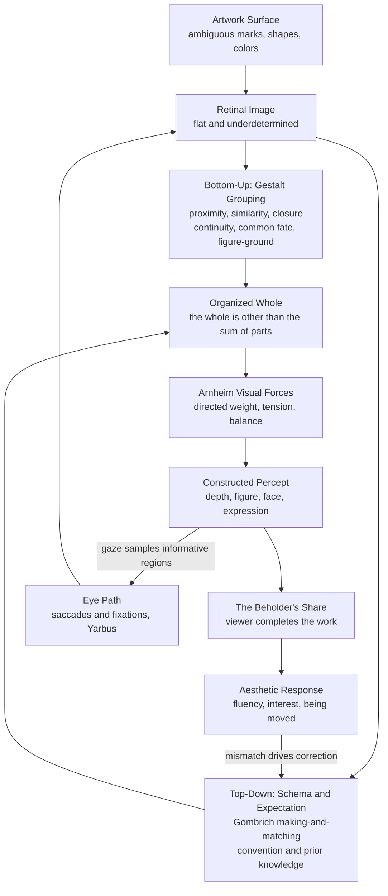

# 🧠 Psychology of Art and Perception

> [!abstract] TL;DR
> Looking at a picture is not passive reception but **active construction**. The psychology of art asks how the mind turns flat marks into seen wholes and felt responses. Three traditions converge: **Gestalt psychology** shows the visual system imposes *grouping laws* — proximity, similarity, closure, continuity, common fate, figure-ground — so that **the whole is other than the sum of its parts**, which **Rudolf Arnheim** extended into a theory of compositional **balance** and perceptual **"forces"**; **Ernst Gombrich** argues perception is **schema-and-correction** — the **"beholder's share"** completes an image the artist merely *suggests*, through **making and matching** guided by expectation and convention; and **empirical aesthetics** (founded by **Fechner**, measured today with **eye-tracking** and preference studies) treats these as testable regularities — symmetry, prototypicality, and balance are liked partly because they are *easy to process*.

---

## Intuition

**Analogy:** Read the string `l3tt3r` and you effortlessly see "letter," even though a `3` is not an `e`. Your eye did not neutrally record the marks; it *matched* them against what you expected a word to be and corrected the input to fit. A painting works the same way. A few smudges of paint become a face; three disconnected black shapes become a triangle floating over a page; a scatter of dabs becomes a crowd at a boulevard. The canvas holds ambiguous fragments — **you** supply the whole, and you do it so fast and so automatically that it feels like the wholeness was *out there* in the picture.

That gap — between the impoverished, ambiguous thing on the surface and the confident, organized image you experience — is the entire subject of the psychology of art. The artist is not filling your eye with a finished scene; the artist is *steering a construction* your brain is already busy performing, exploiting its grouping habits, its expectations, and its willingness to complete a pattern.

---

## How It Works

### 1. Gestalt grouping: the mind organizes before it interprets

The Berlin Gestaltists (**Wertheimer, Köhler, Koffka**, 1910s–1930s) discovered that vision does not build percepts pixel-by-pixel and then bundle them; it **imposes organization from the start**, obeying a small set of *grouping laws*:

- **Proximity** — elements that are near each other are seen as one group.
- **Similarity** — elements sharing a feature (color, size, shape, orientation) group together, even across distance.
- **Closure** — the mind completes broken contours into whole shapes, seeing a circle where only arcs are drawn.
- **Continuity (good continuation)** — the eye follows the smoothest path; crossing lines read as two continuous strokes, not four segments.
- **Common fate** — elements moving or changing together are grouped (crucial in kinetic and time-based art).
- **Figure-ground** — the field is split into a *figure* (a bounded thing) and a *ground* (formless backdrop); which becomes which is a decision the brain makes and can reverse.

Their slogan — **"the whole is other than the sum of its parts"** (often mistranslated as *greater than*) — means the organized percept has properties (a melody, a face, a balanced composition) that *no single part possesses*. Composition is the deliberate arrangement of parts so the emergent whole is the one the artist wants seen.

### 2. Arnheim: composition as a field of visual forces

**Rudolf Arnheim's** *Art and Visual Perception* (1954) took Gestalt from the lab to the studio. His central move: a picture is not an inert arrangement but a **field of perceptual "forces."** Every element carries **directed visual weight** — determined by size, color, isolation, location, and depth cues — and these weights **push and pull** around a felt **structural skeleton** (the center, the axes, the diagonals). A composition feels **balanced** when the forces resolve into equilibrium and **unstable** when they do not. A shape placed dead-center sits at rest; nudged off-center it seems to *strain* toward or away from the middle. "Balance" is therefore not measured with a ruler — it is a **perceptual experience of resolved tension**, which is why a symmetrical layout and an asymmetrical one can both feel balanced if their weights cancel.

### 3. Gombrich: the beholder's share and schema-and-correction

If Gestalt explains *organization*, **Ernst Gombrich's** *Art and Illusion* (1960) explains *representation*. His thesis: there is no "innocent eye." An artist cannot copy nature directly; they start from a **schema** — an inherited formula for "how you draw a tree / a horse / a face" — and then **correct** it against observation. Art history is a sequence of **making and matching**: make a schema, match it to the world, adjust, pass the improved schema on. Crucially, the *viewer* runs the same loop in reverse — the **"beholder's share"**: the picture provides just enough cues to **trigger a schema**, and the mind projects the rest, guided by **expectation and convention**. A cartoon, an Impressionist blur, a perspective drawing all "work" only because the beholder actively completes them. Perception, for Gombrich, is **hypothesis testing**: a guess proposed by prior knowledge and confirmed or corrected by the marks — the same architecture modern **predictive** accounts formalize.

### 4. Constancies and illusions: what artists exploit and defy

Vision maintains **perceptual constancies** — a plate stays "circular" and "white" though it projects an ellipse of grey onto the retina; a person stays the same size as they walk away though their retinal image shrinks. Representational artists must **paint the retinal image while defeating the constancy** their own brain keeps applying (this is why drawing an ellipse for a "round" tabletop feels wrong until trained). Illusion art runs the other way, engineering stimuli that **break** the system on purpose: the size cues of the **Ames room**, impossible objects (Escher), anamorphosis, and *trompe-l'oeil* all work by feeding the visual system contradictory or hijacked cues so it constructs something that cannot be.

### 5. Pictorial depth: fooling a flat surface into space

A canvas is flat, yet we see rooms receding into it. Artists supply **pictorial depth cues** the brain treats as evidence of a third dimension: **linear perspective** (converging parallels), **occlusion**, **relative size**, **texture gradient**, **atmospheric perspective** (distant things pale and bluish), and **shading**. None require binocular vision — a single eye reconstructs the depth, which is exactly why a photograph or painting reads as spatial. See **[[Space_Perspective_and_Depth]]** for the geometric machinery.

### 6. Faces, expression, ambiguity, and the eye's path

- **Faces** get privileged, holistic processing — we detect them from the faintest cues (**pareidolia**: clouds, sockets, a colon-and-parenthesis smiley) and read **emotion** from tiny configural changes, which is why a caricature's few lines can carry more expressive punch than a photograph.
- **Multistable images** — Rubin's vase, the Necker cube, the duck-rabbit — make construction *visible*: the stimulus is fixed but the percept **flips**, proving perception is an interpretation the brain selects, not a readout it receives.
- **The eye's path** is not uniform. **Alfred Yarbus** (1967) recorded eye movements over paintings and found gaze is **task-dependent**: asked different questions about the same picture (the ages of the people, their wealth, what they were doing), viewers scan *entirely different* paths. Vision samples the image with rapid **saccades** and brief **fixations**, dwelling on faces, eyes, and informative edges — evidence that looking is goal-driven inquiry, not a camera exposure.

### 7. Why balance and symmetry are *preferred*: empirical aesthetics

Gustav **Fechner** (1876) founded **empirical aesthetics** — "aesthetics from below," building up from measured preferences rather than down from grand theory. The modern payoff links back to perception: symmetric, prototypical, well-balanced stimuli are reliably **preferred**, and one leading explanation is **processing fluency** — such stimuli are *easy to encode*, and that ease is felt as pleasure and misattributed to the object as "beauty" (developed in **[[Aesthetic_Experience_and_Perception]]**). Preference, on this view, is partly a **byproduct of perceptual efficiency**.



---

## Key Concepts

### Secondary (school-level intuition)

- **Your brain guesses.** A picture gives hints; your mind fills in the rest. That is why cartoons and smileys work.
- **Grouping** — dots that are *close* look like a group (proximity); dots the *same color* look like a group (similarity); a shape with *gaps* still looks whole (closure).
- **The whole is more than the parts** — a bunch of dabs becomes a face; the face is not "in" any one dab.
- **Balance** — a picture can *feel* steady or *feel* like it is tipping, depending on where the big, bright, or heavy things sit.
- **Illusions** show the guessing: the duck-rabbit is one drawing but flips between two things because your brain has to *choose*.

### Undergraduate (perception and aesthetics depth)

- **Gestalt laws** — proximity, similarity, closure, continuity, common fate, figure-ground as built-in organizing principles; Prägnanz (the tendency toward the simplest, most stable organization).
- **Arnheim's visual forces** — directed weight, structural skeleton, and perceptual balance as *felt equilibrium of tension*, not measured symmetry.
- **Gombrich's beholder's share** — schema-and-correction, making-and-matching, "the innocent eye is blind"; representation as *convention-guided suggestion* completed by the viewer.
- **Perceptual constancies vs illusions** — size, shape, color, lightness constancy; how representational art must paint the projection while illusion art hijacks the cues.
- **Pictorial depth cues** — monocular cues (perspective, occlusion, texture gradient, atmospheric perspective, shading) that manufacture space on a flat plane.
- **Multistability and figure-ground reversal** — Rubin vase, Necker cube, duck-rabbit as demonstrations that percepts are *selected interpretations*.
- **Yarbus and task-dependent gaze** — eye movements reveal that looking is goal-driven; saccades and fixations concentrate on faces and informative edges.
- **Fechner and empirical aesthetics** — "aesthetics from below"; preference for symmetry, prototypicality, and balance as measurable regularities.

### Graduate (theoretical and computational view)

- **Predictive-processing reframing** — Gombrich's schema-and-correction is a special case of **perception as Bayesian inference**: the percept is the brain's best hypothesis, priors are conventions and schemas, and the marks are evidence that updates (or fails to update) the guess. Ambiguous figures are cases of *near-equal posterior probability* between two hypotheses, hence the flip. See **[[Predictive_Processing_and_Free_Energy]]**.
- **Grouping as prior structure** — Gestalt laws are not arbitrary; they encode **statistical regularities** of natural scenes (nearby, similar, co-moving elements usually belong to one object), so grouping is an evolved / learned prior that *usually* pays off and can be exploited when it does not.
- **Ramachandran's "laws of art"** — peak shift, isolation, grouping, contrast, symmetry, and perceptual problem-solving as candidate neural principles connecting art to reward and attention systems (bridging to neuroaesthetics).
- **Holistic vs analytic face processing** — configural coding, the composite and inversion effects, and how caricature exaggerates deviations from a norm face to *amplify* recognition and expression.
- **Empirical measurement** — eye-tracking metrics (fixation duration, saccade amplitude, scan-path entropy), preference-rating paradigms, and the fluency/arousal models that predict them; the replication and individual-difference challenges of the field.
- **Open problems** — the relation between low-level perceptual preference and high-level meaning; expertise effects (experts weight novelty and style over fluency); and whether "balance" and "beauty" reduce to processing efficiency or require semantic and cultural content.

---

## Python Demo

We implement three **Gestalt grouping principles** directly on element fields with `numpy` and visualize them, so the emergent grouping is *visible to the eye*. Each panel isolates one cue: in **proximity** the field is a uniform grid except that columns are pulled into tight pairs, so you see column-pairs; in **similarity** the grid is perfectly even (no proximity cue) but color alternates by column, so you see color stripes; in **closure** dots lie on a circle with three arcs deleted, yet the mind completes a full circle from the fragments. This is exactly the perceptual organization an artist manipulates when composing.

```python
# Gestalt grouping principles on element fields (numpy + matplotlib only).
import numpy as np
import matplotlib.pyplot as plt

fig, axes = plt.subplots(1, 3, figsize=(15, 5.2))

# ----------------------------------------------------------------------
# 1. PROXIMITY: rows are evenly spaced, but columns are pulled into tight
#    PAIRS. Nearness dominates -> the eye groups into vertical column-pairs,
#    not one uniform field.
# ----------------------------------------------------------------------
n_rows   = 7
pair_gap  = 0.35   # small gap WITHIN a pair
group_gap = 1.40   # large gap BETWEEN pairs
bases = np.arange(4) * group_gap                       # base x of each pair
xs    = np.concatenate([[b, b + pair_gap] for b in bases])
Xp, Yp = np.meshgrid(xs, np.arange(n_rows))
axes[0].scatter(Xp, Yp, s=110, color="#222222")
axes[0].set_title("Proximity\nnear elements group into column-pairs")

# ----------------------------------------------------------------------
# 2. SIMILARITY: a perfectly even grid (NO proximity cue). Color alternates
#    by column, so grouping follows the shared feature -> we read vertical
#    stripes of like color, ignoring the equal spacing.
# ----------------------------------------------------------------------
n = 8
Xs, Ys = np.meshgrid(np.arange(n), np.arange(n))
col_idx = (Xs % 2)                                     # 0 for even cols, 1 for odd
palette = np.array(["#d1495b", "#2e86ab"])             # two distinct colors
axes[1].scatter(Xs.ravel(), Ys.ravel(), s=110,
                c=palette[col_idx.ravel()])
axes[1].set_title("Similarity\nshared color groups into stripes")

# ----------------------------------------------------------------------
# 3. CLOSURE: dots sampled along a circle, but three arcs are DELETED.
#    The visual system fills the gaps and perceives a complete circle --
#    a whole inferred from disconnected parts.
# ----------------------------------------------------------------------
theta = np.linspace(0, 2 * np.pi, 300, endpoint=False)
gap_centers = np.array([0.4, 2.6, 4.7])               # where arcs are removed
keep = np.ones_like(theta, dtype=bool)
for c in gap_centers:
    # signed angular distance to gap center, wrapped to [-pi, pi]
    d = np.abs((theta - c + np.pi) % (2 * np.pi) - np.pi)
    keep &= d > 0.38                                   # delete a small arc
cx, cy = np.cos(theta[keep]), np.sin(theta[keep])
axes[2].scatter(cx, cy, s=28, color="#222222")
axes[2].set_title("Closure\nfragments read as a complete circle")

# tidy every panel so only the grouping structure is visible
for ax in axes:
    ax.set_aspect("equal")
    ax.set_xticks([])
    ax.set_yticks([])
    for spine in ax.spines.values():
        spine.set_visible(False)

plt.tight_layout()
plt.savefig("gestalt_grouping.png", dpi=120)
plt.show()
```

**What to notice:** No panel *draws* a group, a stripe, or a circle — every image is just a `numpy` array of independent dot positions and colors. The grouping is manufactured **inside the viewer**: proximity makes evenly-rowed dots snap into pairs, similarity makes an even grid split into colored columns, and closure makes a broken ring read as a solid circle. That is the demonstration of "the whole is other than the sum of its parts" — and it is the raw material of composition, because arranging the *parts* is how an artist controls the *whole* the beholder will see.

---

## Real-World Applications

- **Visual design and UI/UX** — layout hierarchy, spacing, and card grouping are pure Gestalt engineering: proximity clusters related controls, similarity codes function by color, and closure lets a logo omit lines the eye restores (the FedEx arrow, the WWF panda).
- **Composition teaching** — the rule of thirds, leading lines, and "visual weight" are Arnheim's forces made into studio heuristics; painters and photographers balance a large dark mass against a small bright one exactly as his force model predicts. See **[[Composition_and_Design_Principles]]**.
- **Advertising and attention** — eye-tracking (descended from Yarbus) is used to verify that gaze lands on the product, the face, and the call-to-action; faces are placed to *direct* the viewer's gaze because we follow where depicted eyes look.
- **Film and animation** — common fate and continuity govern how motion reads as coherent objects; staging and "line of action" steer the beholder's construction frame by frame.
- **Illusion and installation art** — anamorphosis, Ames rooms, Op-art, and impossible figures (Escher) are deliberate exploitation of constancy and depth-cue machinery to build percepts that defy physics.
- **Information visualization** — grouping laws decide whether a chart is instantly parsed or misread; gridlines, color families, and grouping-by-position determine the "whole" a reader extracts from data.

---

## Common Pitfalls

- **Reading "the whole is greater than the sum of its parts" as addition.** Wertheimer said **other than**, not *greater than*. The percept has *emergent, qualitatively different* properties (a face, a balance), not merely *more* of the same parts. The mistranslation invites vague mysticism instead of the precise claim about organization.
- **Believing in the "innocent eye."** Assuming a viewer sees "what is really there" ignores Gombrich: perception is always schema-laden. Designers who forget this are surprised when the *same* image is read differently across cultures and expertise levels.
- **Confusing symmetry with balance.** Arnheim's balance is *resolved perceptual force*, not mirror symmetry. A dead-symmetric layout can feel inert, and a highly asymmetric one can feel perfectly balanced — treating balance as a geometric checksum misses the phenomenon.
- **Treating the eye as a camera.** Yarbus showed gaze is task-driven and highly selective; assuming viewers "see the whole image at once" leads to designs where critical information sits where nobody fixates.
- **Overgeneralizing Gestalt laws as absolute.** The grouping principles *compete* and can be overridden; proximity can lose to similarity, closure can fail under strong figure-ground cues. They are soft priors, not deterministic rules — real images are settled by their *interaction*.
- **Assuming preference reduces to fluency.** Symmetry and prototypicality are liked *partly* through processing ease, but meaning, novelty, and expertise pull the other way (see **[[Aesthetic_Experience_and_Perception]]**). A purely fluency-based account predicts the blandest image is the most beautiful, which is false.

---

## Related Concepts

- [[Aesthetic_Experience_and_Perception]] — the *pleasure and judgment* side: why the well-organized percepts described here are also *liked*, via processing fluency and the beauty-interest duality.
- [[Composition_and_Design_Principles]] — the studio-level application: balance, emphasis, and unity are Arnheim's forces and Gestalt grouping turned into design practice.
- [[Space_Perspective_and_Depth]] — the geometric machinery behind pictorial depth cues that let a flat surface be seen as space.
- [[Visual_Cognition]] — the cognitive-science account of object recognition, feature integration, and top-down interpretation that underlies artistic perception.
- [[Theories_of_Perception]] — the direct-vs-constructivist debate; Gestalt grouping, bottom-up features, and top-down priors that "processing" in art depends on.
- [[Schemas_and_Mental_Models]] — Gombrich's "schema-and-correction" is the perceptual case of schema-driven cognition; expectation and convention as the priors that complete an image.
- [[Predictive_Processing_and_Free_Energy]] — the modern formalization of the beholder's share: perception as hypothesis testing, ambiguity as competing posteriors, the "click" of recognition as error reduction.
- [[Sensation_and_Perception]] — the psychology-level foundation (transduction, constancies, Gestalt organization) on which any account of art perception is built.

---

## Review Questions

1. **(Conceptual)** Explain why "the whole is *other* than the sum of its parts" is a stronger and more precise claim than "the whole is *greater* than the sum of its parts." Use one of the demo panels (proximity, similarity, or closure) to make the point concrete.
2. **(Scenario)** A poster designer places a small, brilliant red dot in the lower-left of an otherwise large, dark, centered composition and reports it "feels balanced." Using Arnheim's theory of **visual forces and directed weight**, explain how a *small* element can balance a *large* one, and why symmetry is not required for balance.
3. **(Trade-off / critique)** Gombrich claims there is "no innocent eye" and the beholder's share completes every image, while Gestalt theory emphasizes automatic, bottom-up grouping laws. Are these views in conflict? Argue how a **predictive-processing** account reconciles automatic grouping (priors) with schema-driven completion (top-down inference), and state one prediction that would distinguish a purely bottom-up from a schema-driven reading of an ambiguous artwork.

---

## Sources

- Arnheim, R. (1974). *Art and Visual Perception: A Psychology of the Creative Eye* (new version). University of California Press. (Original 1954.)
- Gombrich, E. H. (1960). *Art and Illusion: A Study in the Psychology of Pictorial Representation*. Phaidon Press.
- Wertheimer, M. (1923). "Untersuchungen zur Lehre von der Gestalt II" ["Laws of Organization in Perceptual Forms"]. *Psychologische Forschung*, 4, 301–350.
- Yarbus, A. L. (1967). *Eye Movements and Vision* (trans. B. Haigh). Plenum Press.
- Fechner, G. T. (1876). *Vorschule der Ästhetik* [*Elements of Aesthetics*]. Breitkopf & Härtel.
- Palmer, S. E., Schloss, K. B., & Sammartino, J. (2013). "Visual Aesthetics and Human Preference." *Annual Review of Psychology*, 64, 77–107.
- Ramachandran, V. S., & Hirstein, W. (1999). "The Science of Art: A Neurological Theory of Aesthetic Experience." *Journal of Consciousness Studies*, 6(6–7), 15–51.

---

#aesthetics #psychology-of-art #gestalt #perception #arnheim
