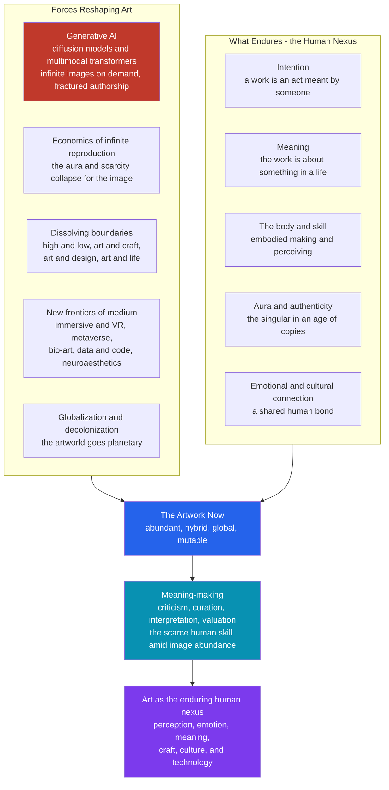

# 🌅 The Future of Art and Aesthetics

> [!abstract] TL;DR
> A machine can now generate a plausible "painting" in four seconds, an entire artworld can now be assembled from every continent at once, and the boundary between art, craft, design, and everyday life has all but dissolved — yet the questions that opened this vault ("what is art?", "what is art *for*?") have not been answered by technology so much as *sharpened* by it. This capstone argues a single thesis: everything reproducible about art — the image, the style, the technique, the sheer *volume* — is being automated and commoditized, and precisely because of that, the *non-reproducible* human core (intention, meaning, embodiment, cultural belonging, and the value of the singular that Walter Benjamin called the **aura**) becomes the scarce and defining thing. The future of art is not human *or* machine; it is a **co-creation** in which the machine supplies reach and the human supplies *why*. Aesthetics, meanwhile, escapes the museum entirely — into everyday life, science, data, and code — leaving criticism and curation, not production, as the truly hard human work.

---

## Intuition

**Analogy — the invention of photography, replayed at ten thousand times the speed.** In the 1840s a machine appeared that could capture a face more accurately in a few seconds than a portrait painter could in weeks. Painters panicked: the camera would make them obsolete. It did the opposite. By taking over the one job everyone thought *was* painting — faithful likeness — the camera *freed* painting to become something the camera could not do. Within two generations you get Impressionism, then abstraction, then Duchamp's urinal: art stopped *depicting* the world and started *interrogating* what art itself is. Photography did not kill art; it **stripped away the reproducible part and forced the irreducible part to the surface**.

Generative AI is that story running again, but faster, wider, and cheaper. A diffusion model has now absorbed "faithful likeness" *and* "convincing style" *and* "competent composition" — the whole visible skin of art history — and it dispenses them on demand for the price of a sentence. So ask the photography question again: when the machine can make the *image*, what is left for the human? The answer this note defends is the same answer 1840 gave: whatever the machine cannot supply becomes the definition of the art. And what a prompt-driven model conspicuously cannot supply is a *reason to have made this rather than nothing* — an **intention**, a lived body behind the gesture, a stake in a culture, a meaning that is *about* something in a life. The future of art is the discovery, forced by the machine, of exactly how much of art was never the image at all.

---

## How It Works

Treat "the future of art" not as prophecy but as a set of **forces** acting on a system, plus an account of which parts of the system are load-bearing enough to survive them. Five forces are reshaping the artwork; five human elements keep enduring; and one activity — meaning-making through criticism and curation — becomes the pivot on which the whole thing turns.

1. **The AI transformation and the crisis of authorship.** Generative models (diffusion models, GANs, multimodal transformers) shatter the classical chain *skilled maker → made object → viewer*. Authorship fragments across the prompter, the model, the millions of artists whose work trained it, and the engineers who built it. This re-opens *every* question from the [[What_Is_Art]] note at once: if a machine-made image has no human author, is it art (the U.S. Copyright Office says an unauthored image cannot be registered)? If the model learned "style" by ingesting living artists without consent, whose labor and whose economics are at stake? The definition, the authorship, and the *money* all destabilize together.

2. **The economics of infinite reproduction.** Benjamin argued in 1936 that mechanical reproduction (photography, film) strips the artwork of its **aura** — the unique "here and now," the authority of the singular original rooted in a tradition. Generative AI is reproduction without even an original: infinite variations, no negative, no first print. Scarcity, the entire basis of art's market value, collapses for the *image* — which is exactly why the market violently re-invents scarcity elsewhere (the signed limited edition, the NFT's cryptographic "original," the artist's certified intention, the live performance you had to be *at*).

3. **The dissolving of boundaries.** The old hierarchies — high art versus low, fine art versus craft, art versus design, art versus life — were already eroding across the twentieth century (see [[Contemporary_and_Postmodern_Art]]); the digital flood finishes the job. When a meme, a video-game environment, a generative feed, and a museum installation compete for the same attention on the same screen, "everyday aesthetics" ceases to be a niche and becomes the default condition.

4. **New frontiers of medium.** The material of art expands past pigment and bronze into *immersive and VR* space, the *metaverse*, *bio-art* (living tissue, DNA), *data and code as medium*, and the empirical study of aesthetic response itself in **neuroaesthetics** — the neuroscience of why a curve, a face, or a chord moves the brain. Each frontier pushes art further from the framed object toward *experience* and *system*.

5. **Globalization and decolonization.** The artworld stops being a Paris–New York axis judging everyone else by its standards. Non-Western canons, indigenous forms, and previously excluded voices (feminist, postcolonial, diasporic) are re-centered, and the very category "fine art" is exposed as a local eighteenth-century European invention rather than a human universal (see [[Non_Western_and_Global_Art_Traditions]]).

Against these forces stand the **enduring human elements** — the parts that keep answering "what is art *for*?": **intention** (a work is an act *meant* by someone), **meaning** (it is *about* something in a life and a culture; see [[Art_and_Meaning]]), the **body** (art is made and perceived by embodied beings, a fact neuroaesthetics grounds empirically), **aura and authenticity** (the value of the singular and the real amid infinite copies), and **emotional and cultural connection** (art as a shared human bond, not a decorative surface). The claim is not that these are *magic* the machine can never touch — it is that they are precisely the *non-reproducible* residue, and so they become the scarce, defining core once the reproducible skin is automated.

The pivot between the forces and the endurances is **meaning-making**: criticism, curation, interpretation, contextualization, valuation (see [[Art_Criticism_and_Interpretation]]). When anyone can *generate* an image, the scarce skill is no longer production but *judgment* — the polymath's capacity to say what a thing means, where it sits in a tradition, and why it matters. In an age of image abundance, the curator and the critic are not obsolete gatekeepers; they are the only remaining bottleneck.



The diagram encodes the thesis: the five external *forces* and the five internal *endurances* both feed into the artwork of the present, but the flow does not stop there — it passes through the **meaning-making** bottleneck (the one activity technology has made *scarcer*, not cheaper) and out into art understood as the enduring human **nexus** where perception, emotion, meaning, craft, culture, and technology meet.

---

## Key Concepts

### Secondary Level

**"What is art for?" is the question technology cannot dodge.** Across the whole vault, one question keeps returning: not just *what* art is, but *what it is for*. Every theory of the future has to answer it, because the answer decides what survives. If art is *for* making pretty images, the machine wins and humans are obsolete. If art is *for* one person meaning something to another — expressing, connecting, remembering, protesting, belonging — then the machine can *assist* but cannot *replace*, because it has nothing to mean and no one to mean it to.

**The aura, in one idea.** Walter Benjamin's *aura* is the special value a unique original has because it exists in one place, with one history — the actual canvas Van Gogh's hand touched, in the room where you stand. A perfect photograph of it lacks the aura even if it looks identical. AI-generated images have *no* original at all, so the aura problem goes to an extreme: the culture responds by re-attaching aura to things a machine cannot mass-produce — a signature, a live performance, a certified "1 of 1," the artist's documented intention.

**Democratization has a shadow: homogenization.** The good news: anyone with a phone can now make images that once required years of training — art-making is genuinely *democratized*. The shadow: if millions of people all steer the *same* handful of models trained on the *same* internet, the outputs converge toward a bland average "AI look," and a flood of near-identical content can drown out the rare and strange. More access does not automatically mean more diversity.

### Undergraduate Level

**Authorship, copyright, and the economics of AI art.** Generative art breaks the legal and economic machinery built for human authorship. Three fault lines: (1) *Output ownership* — courts and copyright offices in several countries have refused to register purely machine-generated images because copyright protects *human* authorship, forcing artists to prove and document their human contribution. (2) *Training data* — models learn "style" by ingesting enormous corpora of existing art, often without consent, license, or payment, sparking lawsuits over whether this is fair use or industrial-scale appropriation of living artists' labor. (3) *Scarcity engineering* — because the image itself is now infinitely reproducible and therefore nearly worthless as a commodity, value migrates to whatever *cannot* be copied: provenance, the artist's name and intention, editions, and the "aura" reconstructed through certification (NFTs were one attempt to cryptographically re-create the "original"). The technical substrate of all this is worth understanding directly: [[Diffusion_Models]], [[GAN]], [[Stable_Diffusion]], and [[Multimodal_AI]].

**Everyday aesthetics and the erosion of the art/life boundary.** For most of modern history, "aesthetics" meant the philosophy of *fine art* — special objects in special rooms for disinterested contemplation. The everyday-aesthetics movement (Yuriko Saito and others) argues this is a distortion: aesthetic experience saturates ordinary life — the feel of a well-made tool, the arrangement of a meal, the sound of rain, the design of an app, the tidiness of a desk. As the boundaries dissolve, the future of *aesthetics* is larger than the future of *art*: it becomes the study of how perception, pleasure, and meaning pervade *everything*, including domains once thought purely functional — science (the "elegance" of a proof or an equation), *data* (the aesthetics of visualization), and *code* (the programmer's sense of "beautiful," clean, or "ugly" implementations).

**Neuroaesthetics — art meets the brain.** Neuroaesthetics asks what happens in the nervous system when we find something beautiful or moving: which circuits (reward, emotion, the default-mode network, embodied simulation) light up in front of a face, a landscape, a dissonant chord, or a Rothko. It grounds the "the body endures" claim empirically — aesthetic response is not a free-floating spirit but an embodied, evolved brain process, which is exactly why a *disembodied* model that has never had a body, a fear, or a longing is in a different relationship to art than a human is. This connects the aesthetics vault to cognitive science and to the parallel debate in [[AI_and_the_Future_of_Cognitive_Science]].

### Graduate Level

**The "end of art" and the post-historical condition.** Arthur Danto argued that art reached the "end of art" not in the sense of ceasing but in the sense of ending its *master narrative*: once Warhol showed that anything can be art and no visible property distinguishes art from non-art, there is no longer a single story of *where art must go next*. We enter the **post-historical** condition — a radical pluralism in which every style, medium, and tradition is simultaneously available and no direction is mandatory. Generative AI intensifies this: a model trained on *all* of art history can emit any style at will, collapsing the historical *sequence* of styles into a flat, instantly accessible *menu*. The future is not a next movement; it is the permanent co-presence of *all* movements, which makes *curatorial framing* — not stylistic innovation — the site where meaning is now produced.

**Computational creativity and the intention gap.** Can a machine be *creative*? Margaret Boden's taxonomy distinguishes *combinational*, *exploratory*, and *transformational* creativity — recombining ideas, exploring a conceptual space, and *breaking* the rules of the space itself. Contemporary models are formidable at combinational and exploratory creativity (they interpolate and remix a learned distribution superbly) but structurally weak at *transformational* creativity that arises from a *lived reason* to break a rule — a felt need, a political stake, a bodily experience, a mortality. Projects like Creative Adversarial Networks deliberately reward "deviation from learned style norms" to simulate novelty, which sharpens the philosophical point rather than dissolving it: the machine can be made to *deviate*, but it has no *intention behind the deviation*. This is the **intention gap** — the residue that the reproduction of style cannot fill, and the reason "meaning and intention are central to art" is not a sentimental slogan but the actual load-bearing wall of the future artworld.

**Aesthetics beyond art, and the polymath's response.** The deepest shift may be that aesthetics *outgrows art*. If aesthetic experience is a general mode of human engagement with the world — the perception of form, order, expressive quality, and meaning — then it is as relevant to a data visualization, a mathematical proof, a piece of software architecture, a city, or a scientific model as to a painting. This is the natural home of the *polymath*: the future rewards not the specialist who can *generate* one kind of artifact (the machine now does that) but the connector who can *interpret* across domains — read a generative image against Benjamin's aura, a codebase against notions of elegance, a dataset against the ethics of representation. In an age where production is automated and abundant, the scarce and defining human capacity is **interpretation, contextualization, and valuation** — precisely the skills the entire Art and Aesthetics vault has been building, and the same conclusion reached by the parallel capstones for [[The_Future_of_Music_and_AI]] and [[The_Future_of_Literature]]: the medium changes, the machine amplifies, but the human nexus of perception, emotion, meaning, craft, culture, and technology endures.

---

## Python Demo

We model the **human–AI co-creation spectrum** analytically. Let the horizontal axis be the *AI share* of a creative act, from `0` (fully human, an artisan alone in the studio) to `1` (fully automated, a prompt into a model with no further human judgment). Two quantities move in opposite directions as AI share rises: the **volume and reach** of output *climbs* (a little AI hugely boosts productivity; more makes it explode), while **human intention, meaning, and scarcity value** *falls* (the more the machine decides, the less any single output is *meant*, and the less scarce it is). If art needs *both* reach *and* meaning, then cultural value is their product — and a product of a rising and a falling curve has an **interior maximum**: a co-creation sweet spot. The demo locates it, and finds it sits *left of center* — leaning toward human intention — which is the whole vault's recurring thesis rendered as a curve.

```python
# Models the human-AI co-creation spectrum and its effect on artistic output.
# numpy + matplotlib only. Thesis: cultural value peaks where humans still supply
# most of the intention while AI amplifies reach -- a co-creation sweet spot.
import numpy as np
import matplotlib.pyplot as plt

N = 400
ai = np.linspace(0.0, 1.0, N)          # AI's share of the creative act: 0=human, 1=machine

# 1) VOLUME / SPEED / REACH of output: rises with AI, with front-loaded gains.
#    A little AI assistance dramatically boosts productivity, then it saturates.
output_reach = 1.0 - np.exp(-3.5 * ai)          # concave-rising, in [0, ~0.97]

# 2) HUMAN INTENTION / MEANING / SCARCITY VALUE: falls as the machine decides more.
#    A small floor: even AI-heavy work curated with deliberate human intent keeps
#    a little meaning -- it never quite reaches zero.
meaning_floor = 0.05
human_meaning = meaning_floor + (1.0 - meaning_floor) * (1.0 - ai) ** 1.3   # falling

# 3) CULTURAL / ARTISTIC VALUE = reach * meaning. Art needs BOTH an audience it can
#    reach AND something worth meaning. The product of a rising and a falling curve
#    has an interior peak -- the co-creation sweet spot.
cultural_value = output_reach * human_meaning
cultural_value_norm = cultural_value / cultural_value.max()   # normalize to peak = 1

i_star = int(np.argmax(cultural_value))
ai_star = ai[i_star]

# --- Plot -------------------------------------------------------------------
fig, axL = plt.subplots(figsize=(10, 6))

axL.plot(ai, output_reach, color="#c0392b", lw=2.5,
         label="Volume / speed / reach of output  (rises with AI)")
axL.plot(ai, human_meaning, color="#2563eb", lw=2.5,
         label="Human intention / meaning / scarcity  (falls with AI)")
axL.plot(ai, cultural_value_norm, color="#7c3aed", lw=3.0, ls="--",
         label="Cultural value = reach x meaning  (normalized)")

# Mark the co-creation sweet spot.
axL.axvline(ai_star, color="#0891b2", lw=1.6, ls=":")
axL.scatter([ai_star], [cultural_value_norm[i_star]], s=90, color="#0891b2", zorder=5)
axL.annotate("Co-creation sweet spot\nAI share = %.0f%%\nhuman-led, AI-amplified" %
             (100 * ai_star),
             xy=(ai_star, cultural_value_norm[i_star]),
             xytext=(ai_star + 0.14, cultural_value_norm[i_star] - 0.02),
             fontsize=9, color="#0891b2",
             arrowprops=dict(arrowstyle="->", color="#0891b2"))

# Shade the two failure zones.
axL.axvspan(0.0, 0.08, color="#95a5a6", alpha=0.15)
axL.axvspan(0.85, 1.0, color="#95a5a6", alpha=0.15)
axL.text(0.015, 0.06, "Artisanal\nlow reach", fontsize=8, color="#555")
axL.text(0.865, 0.85, "Content flood\nlow meaning", fontsize=8, color="#555")

axL.set_xlabel("AI share of the creative act   (0 = fully human  ->  1 = fully AI)")
axL.set_ylabel("Normalized value (0..1)")
axL.set_title("The Human-AI Co-Creation Spectrum\n"
              "reach rises, meaning falls, cultural value peaks in between",
              fontsize=12, fontweight="bold")
axL.set_ylim(0, 1.05)
axL.legend(loc="upper center", fontsize=8.5, framealpha=0.95)
axL.grid(alpha=0.25)
plt.tight_layout()
plt.savefig("co_creation_spectrum.png", dpi=120, bbox_inches="tight")
plt.show()

# --- Console summary ---------------------------------------------------------
print("AI share | reach | meaning | cultural value")
print("-" * 46)
for x in [0.0, 0.15, ai_star, 0.5, 0.75, 1.0]:
    j = int(np.argmin(np.abs(ai - x)))
    print("  %4.2f   |  %.2f |   %.2f  |     %.3f" %
          (ai[j], output_reach[j], human_meaning[j], cultural_value_norm[j]))
print("-" * 46)
print("Peak cultural value at AI share = %.0f%%  (human intention still dominant)" %
      (100 * ai_star))
```

**Expected output (approximate):**

```
AI share | reach | meaning | cultural value
----------------------------------------------
  0.00   |  0.00 |   1.00  |     0.000
  0.15   |  0.41 |   0.83  |     0.842
  0.30   |  0.65 |   0.67  |     1.000
  0.50   |  0.83 |   0.51  |     0.966
  0.75   |  0.93 |   0.28  |     0.598
  1.00   |  0.97 |   0.05  |     0.113
----------------------------------------------
Peak cultural value at AI share = 30%  (human intention still dominant)
```

The curve tells the argument. At the far *left* (`AI share = 0`), meaning is maximal but reach is zero — a masterpiece no one sees, the artisan's limit. At the far *right* (`AI share = 1`), reach is near-total but cultural value has *collapsed* to a floor — the "content flood," infinite images that mean nothing to no one, the age of reproduction with the aura gone. The peak sits near **30%**: cultural value is maximized when the human still supplies the *majority* of the intention and the machine *amplifies* its reach. The model is a toy, but its shape is the vault's central claim made quantitative — meaning and intention are the load-bearing terms, and the future that maximizes art is *human-led and AI-amplified*, not either extreme.

---

## Real-World Applications

**AI image tools reshaping creative industries.** Text-to-image systems (built on [[Diffusion_Models]] and [[Multimodal_AI]]) are already default infrastructure in advertising, concept art, game and film pre-visualization, and product design. The pattern matches the demo: the *volume and speed* of visual output has exploded, and the surviving human premium has migrated to *direction, taste, and meaning* — art directors who know *what to ask for and why it matters*, not illustrators executing the pixels. The economic disruption (displaced junior illustrators, contested training data) is the "content flood" region of the curve made real.

**Museums, biennials, and the curation premium.** As production commoditizes, cultural institutions double down on the scarce activity — *framing meaning*. Exhibitions increasingly foreground provenance, context, and the artist's intention precisely because the images themselves are no longer scarce. The 2018 sale of an AI-generated portrait (*Edmond de Belamy*) at Christie's for hundreds of thousands of dollars was a market experiment in whether *aura* can be re-attached to a machine-made image through the ritual of the auction house — an applied test of Benjamin's thesis (see [[Contemporary_and_Postmodern_Art]]).

**Immersive, VR, and metaverse art.** Large-scale immersive installations (projection-mapped "experiences," VR galleries, generative environments) monetize exactly what a downloadable JPEG cannot reproduce — an *embodied, singular, here-and-now event you had to attend*. This is aura re-engineered for the digital age: scarcity relocated from the object to the *experience*.

**Neuroaesthetics in design and medicine.** The empirical study of aesthetic response feeds back into practice — evidence-informed architecture and hospital design that measurably reduce stress, UX research on what makes interfaces feel "right," and art-therapy protocols grounded in how aesthetic engagement modulates emotion. Aesthetics escaping the gallery into science and health is the "aesthetics beyond art" thesis in action.

**Decolonizing the canon.** Major museums are actively repatriating objects, re-hanging collections to de-center the European narrative, and elevating non-Western, indigenous, feminist, and postcolonial traditions (see [[Non_Western_and_Global_Art_Traditions]]). This is the globalization force reshaping the artworld's *criteria of value*, not merely its geography.

---

## Common Pitfalls

- **"AI will replace artists" / "AI is not real art" — both mistake the image for the art.** The replacement panic assumes art *is* the reproducible image (which the machine does supply); the dismissive reflex assumes machine involvement *cancels* art (ignoring the human intention in prompting, selecting, and framing). The demo's lesson is that neither extreme is the interesting region — the value lives in *co-creation*, where the human supplies meaning and the machine supplies reach.
- **Confusing democratization with diversity.** "Everyone can make images now" is true and genuinely liberating, but if millions steer the *same* models trained on the *same* corpus, outputs converge toward a homogenized average and the flood *buries* the rare and strange rather than surfacing it. More production is not more culture; without meaning-making it can be *less*.
- **Treating "the aura" as mystical nonsense.** Benjamin's aura is not magic; it is a precise economic and phenomenological claim about how the *singular original with a history* carries a value the copy lacks. The entire NFT/limited-edition/live-performance economy is a rational market response to the collapse of image-scarcity — the aura re-engineered, not abandoned.
- **Universalizing the Western "fine art" concept when discussing "the future of art."** The autonomous art-object-for-contemplation is a local eighteenth-century European construction. Predicting art's future through that lens alone misreads traditions where the "art" was always ritual, craft, communal, or functional — the decolonization force is not an add-on to the future of art; it is a correction to the *premise* of the question.
- **Assuming aesthetics is only about art.** As boundaries dissolve, the aesthetics of the everyday, of science, of data, and of code become central. Restricting "the future of aesthetics" to the future of the *gallery* misses that the more consequential shift is aesthetic experience saturating *all* of designed and lived life.
- **Believing meaning-making will automate too.** It is tempting to assume that if production automates, interpretation will follow. But interpretation requires a *stake* — a body, a culture, a life the work could matter *to*. The scarce skill the future rewards is exactly the human capacity to interpret, contextualize, and value, which is why criticism and curation *grow* in importance as production cheapens.

---

## Related Concepts

*(Companion notes planned for this section 06 — Generative_Art_and_AI, Neuroaesthetics_and_the_Brain, and Digital_Art_and_New_Media — will expand the AI-production, brain-science, and new-media threads this capstone synthesizes.)*

- [[What_Is_Art]] — the definitional crisis this note inherits; generative AI re-opens the institutional, authorship, and essence questions at machine speed and scale
- [[Art_and_Meaning]] — the "meaning and intention are central" thesis this capstone rests on; the demo makes it a curve
- [[Art_Criticism_and_Interpretation]] — the meaning-making pivot: as production automates, criticism and curation become the scarce, defining human work
- [[Contemporary_and_Postmodern_Art]] — the twentieth-century erosion of high/low and art/life boundaries that the digital flood completes; also home to Danto's "end of art"
- [[Non_Western_and_Global_Art_Traditions]] — the globalization and decolonization force; exposes "fine art" as a local construct, not a universal
- [[Formalism_and_Aesthetic_Theory]] — the "significant form" tradition against which AI's competent-but-empty formal fluency is measured
- [[Diffusion_Models]] — the core generative architecture behind text-to-image tools driving the AI transformation
- [[Stable_Diffusion]] — the open, widely deployed diffusion system that democratized image generation and triggered the training-data disputes
- [[GAN]] — the generative-adversarial approach behind early AI art and Creative Adversarial Networks
- [[Multimodal_AI]] — text-to-image and vision-language models that fuse language and imagery, the substrate of prompt-driven creation
- [[AI_and_the_Future_of_Cognitive_Science]] — the parallel debate on machine minds; grounds why a disembodied model stands in a different relation to art than an embodied human
- [[The_Future_of_Music_and_AI]] — the sibling capstone in music: same structure of automated production versus enduring human meaning
- [[The_Future_of_Literature]] — the sibling capstone in literature; the machine writes fluent text, but authorship, intention, and meaning remain the human residue
- [[Learning_Science_Overview]] — the creativity and expertise angle: what "human creativity" is, and why interpretation and transfer are the durable skills

---

## Review Questions

### Secondary
1. Photography could copy a face better than any painter, yet it did not kill painting — it changed what painting was *for*. Explain how generative AI is repeating this pattern, and name one thing the machine takes over and one thing it leaves to humans.
2. What is Walter Benjamin's "aura," and why does an AI-generated image pose an even bigger problem for it than a photograph does? Give one way the art market tries to re-create scarcity when the image itself becomes infinitely copyable.

### Undergraduate
1. "Everyone can make images now" is presented as *democratization*. Explain the shadow side — *homogenization* — and describe the mechanism by which more image-making could lead to *less* cultural diversity, not more.
2. The Python demo peaks at roughly 30% AI share rather than at 0% or 100%. Reconstruct the argument: what does each extreme lack, why is cultural value modeled as reach times meaning, and why does the peak sit *left* of center? What claim about art does that leftward lean encode?
3. Explain the "intention gap" using Boden's distinction between exploratory and transformational creativity. Why can a model be engineered to *deviate* from learned norms yet still lack what the vault calls intention?

### Graduate
1. Danto's "end of art" describes a post-historical pluralism with no mandatory next direction. Argue whether generative AI *confirms* this thesis (by flattening all styles into an instantly available menu) or *escapes* it — and explain why, on this view, the locus of meaning-production shifts from stylistic innovation to curatorial framing.
2. This note claims that as production automates, the scarce and defining human activity becomes interpretation, contextualization, and valuation — "the polymath's response." Defend or attack this claim. Could meaning-making itself be automated, and if not, what exactly is the non-automatable residue?
3. Compare this capstone with its siblings for music and literature ([[The_Future_of_Music_and_AI]], [[The_Future_of_Literature]]). Formulate the *general* law they share about any human art form meeting a powerful generative technology, then identify one respect in which the visual case differs from the musical or literary case and why that difference matters.

---

## Sources

- [Benjamin, W. (1936). "The Work of Art in the Age of Its Technological Reproducibility."](https://web.mit.edu/allanmc/www/benjamin.pdf)
- [Danto, A. C. (1997). *After the End of Art: Contemporary Art and the Pale of History*. Princeton University Press.](https://press.princeton.edu/books/paperback/9780691163895/after-the-end-of-art)
- [Manovich, L., and Arielli, E. (2021–2024). *Artificial Aesthetics: A Critical Guide to AI, Media and Design*.](http://manovich.net/index.php/projects/artificial-aesthetics)
- [Chatterjee, A. (2014). *The Aesthetic Brain: How We Evolved to Desire Beauty and Enjoy Art*. Oxford University Press.](https://global.oup.com/academic/product/the-aesthetic-brain-9780199811809)
- [Saito, Y. "Aesthetics of the Everyday." *Stanford Encyclopedia of Philosophy* (2021 ed.).](https://plato.stanford.edu/entries/aesthetics-of-everyday/)
- [Elgammal, A., Liu, B., Elhoseiny, M., and Mazzone, M. (2017). "CAN: Creative Adversarial Networks Generating 'Art' by Learning About Styles and Deviating from Style Norms." arXiv:1706.07068.](https://arxiv.org/abs/1706.07068)

---

#aesthetics #future-of-art #ai-art #creativity #art-and-technology
