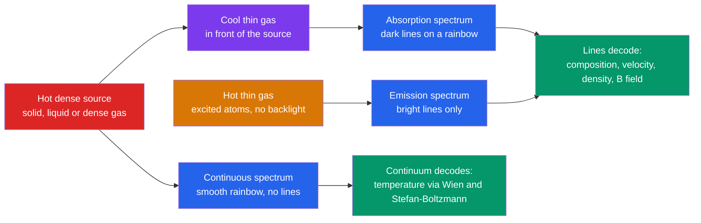

# 🌈 Light and Astronomical Spectroscopy

> [!abstract] TL;DR
> Light is the astronomer's primary messenger, and spreading it into a spectrum reveals a rich code. A hot dense body radiates a **continuous (blackbody) spectrum** whose shape fixes its temperature — via Wien's law $\lambda_{max}T = 2.898\times10^{-3}\,\mathrm{m\,K}$ and the Stefan–Boltzmann law $L = 4\pi R^2\sigma T^4$. Thin gas imprints **spectral lines** (Kirchhoff's laws) whose atomic origin encodes chemical composition, while line *positions* shift with velocity via the Doppler effect $\Delta\lambda/\lambda = v/c$. From a single spectrum an astronomer can read a star's temperature, composition, density, velocity, and even its magnetic field. Graduate treatment adds the Saha ionization equation, equivalent widths, and curve-of-growth abundance analysis.

## Intuition — analogy FIRST

Imagine holding a stranger's supermarket barcode up to the light. You can't see the shopper, but the pattern of black stripes uniquely identifies every item in the cart. Starlight works the same way: pass it through a prism or grating and it fans out into a rainbow crossed by sharp dark or bright lines. That striped pattern is a **fingerprint** — no two elements make the same one, because each atom absorbs and emits only at wavelengths set by its own energy levels.

So although we can never bring a star into a laboratory, its light arrives pre-loaded with a full report. The smooth background rainbow tells us how hot it is; the lines tell us what it is made of; and how far those lines are nudged from their laboratory positions tells us how fast it is moving toward or away from us.

---

## How It Works

Kirchhoff's three laws (1859) organize every astronomical spectrum into one of three types, depending on the source and what sits in front of it.



A star is essentially a hot dense interior (continuous spectrum) viewed through its own cooler outer atmosphere (absorption lines). A glowing nebula, being hot thin gas, shows emission lines instead.

---

## Key Concepts / Details

### Secondary Level

**Thermal (blackbody) radiation.** Any warm opaque body glows. As it heats up, its glow both *brightens* and shifts *bluer* — a stove element goes from dull red to orange to yellow-white. Two rules capture this:

- **Wien's displacement law** — the peak wavelength moves inversely with temperature:
$$\lambda_{max} = \frac{2.898\times10^{-3}\ \mathrm{m\,K}}{T}$$
The Sun ($T\approx 5772$ K) peaks near 500 nm (green-yellow); a cool 3000 K star peaks in the infrared; a hot 12000 K star peaks in the ultraviolet.
- **Stefan–Boltzmann law** — total power radiated per unit area grows as the fourth power of temperature, so a star's luminosity is
$$L = 4\pi R^2\,\sigma T^4, \qquad \sigma = 5.67\times10^{-8}\ \mathrm{W\,m^{-2}\,K^{-4}}$$
Doubling temperature makes a body 16 times brighter for the same size.

**Spectral lines as fingerprints.** Each dark or bright line corresponds to an electron jumping between fixed energy levels in an atom (see [[Atomic_Models_and_Spectroscopy]]). Hydrogen's visible **Balmer series** — Hα (656 nm, red), Hβ (486 nm), Hγ (434 nm) — arises from transitions ending on the $n=2$ level. Because line patterns are unique, we can identify elements in stars millions of light-years away.

### Undergraduate Level

**The Planck function.** Blackbody intensity per unit wavelength is
$$B_\lambda(T) = \frac{2hc^2}{\lambda^5}\,\frac{1}{e^{hc/\lambda k_B T} - 1}$$
Wien's law follows from $dB_\lambda/d\lambda = 0$, and integrating $B_\lambda$ over all wavelengths and solid angle recovers $\sigma T^4$. The quantum $hc/\lambda k_B T$ in the exponent is why classical physics failed (the "ultraviolet catastrophe") — the photon and its energy quantization are the fix (see [[Photoelectric_Effect_and_Compton]], [[Electromagnetic_Waves_and_Radiation]]).

**Stellar spectral classification — OBAFGKM.** Stars are sorted by the strength of their absorption lines into a temperature sequence:

| Class | $T_{eff}$ (K) | Color | Dominant lines |
|-------|---------------|-------|----------------|
| O | > 30 000 | blue | ionized He II, weak H |
| B | 10 000–30 000 | blue-white | neutral He I, H |
| A | 7 500–10 000 | white | **strongest H Balmer** |
| F | 6 000–7 500 | yellow-white | H weaker, metal lines rising |
| G | 5 200–6 000 | yellow (the Sun) | Ca II H&K, metals |
| K | 3 700–5 200 | orange | strong metals, some molecules |
| M | 2 400–3 700 | red | TiO molecular bands |

Mnemonic: *"Oh Be A Fine Girl/Guy, Kiss Me."* Crucially, line strength is **not** the same as abundance. Balmer lines peak in A stars not because they hold the most hydrogen, but because only there is the temperature right to keep hydrogen atoms populated in the $n=2$ level (excitation) without ionizing them all away. This temperature dependence is set by the **Boltzmann equation** (level populations) and the **Saha equation** (ionization). This sequence maps directly onto the horizontal axis of the HR diagram (see [[Stellar_Properties_and_the_HR_Diagram]]).

**The Doppler effect.** Motion along the line of sight shifts every line by
$$\frac{\Delta\lambda}{\lambda} = \frac{v_r}{c}$$
A **blueshift** ($\Delta\lambda < 0$) means approach; a **redshift** means recession. This one relation delivers stellar and galaxy radial velocities, unmasks spectroscopic binaries, and — through the tiny reflex wobble a planet induces on its star — enabled the first exoplanet discovery. Cosmological redshift is a related but distinct effect: the *expansion of space itself* stretches wavelengths (see [[Magnitudes_Luminosity_and_Flux]] for how this ties to distance and flux).

**Special line diagnostics.**
- The **21 cm line** (1420 MHz) is a forbidden hyperfine spin-flip transition of neutral hydrogen; it penetrates dust and maps galactic HI and rotation curves.
- **Forbidden lines** such as [O III] 5007 Å and 4959 Å appear only in the near-vacuum of nebulae, where atoms in metastable states can decay radiatively before a collision de-excites them. Once mistaken for a new element, "nebulium."

### Graduate Level

**The Saha ionization equation** gives the ratio of successive ionization states in thermodynamic equilibrium:
$$\frac{n_{i+1}\,n_e}{n_i} = \frac{2\,g_{i+1}}{g_i}\left(\frac{2\pi m_e k_B T}{h^2}\right)^{3/2} e^{-\chi_i / k_B T}$$
where $\chi_i$ is the ionization potential, $g$ are statistical weights, and $n_e$ is the electron density. Combined with the Boltzmann factor $n_b/n_a = (g_b/g_a)\,e^{-\Delta E/k_B T}$, it quantitatively predicts the OBAFGKM line strengths and underpins model-atmosphere abundance work.

**Equivalent width and the curve of growth.** The strength of an absorption line is measured by its **equivalent width**
$$W_\lambda = \int\left(1 - \frac{F_\lambda}{F_c}\right)d\lambda$$
the width of a fully black rectangle removing the same flux as the actual line. Plotting $W_\lambda$ against the absorber column density $N$ yields the **curve of growth** with three regimes: **linear** ($W\propto N$, weak lines), **flat/saturated** ($W\propto\sqrt{\ln N}$, the Doppler core saturates), and **damped/square-root** ($W\propto\sqrt{N}$, pressure-broadened Lorentzian wings grow). Fitting the curve of growth extracts element abundances.

**Line broadening as a diagnostic.** A line is never infinitely thin, and its profile is data:
- **Thermal (Doppler) broadening**: $\Delta\lambda_D/\lambda = \sqrt{2k_B T/m c^2}$ — a thermometer for the gas.
- **Pressure / collisional (Stark) broadening**: Lorentzian wings widen in dense atmospheres, discriminating dwarfs from giants (luminosity class).
- **Rotational broadening**: a rotating star smears lines by $v\sin i$, revealing spin.
- **Zeeman splitting**: a magnetic field splits a line into polarized components with separation $\propto B$ — how we measure kilogauss fields in sunspots and magnetic stars.

```python
import numpy as np
import matplotlib.pyplot as plt

# Planck blackbody spectra for several stellar temperatures, with Wien peaks
h  = 6.62607015e-34   # Planck constant, J s
c  = 2.99792458e8     # speed of light, m/s
kB = 1.380649e-23     # Boltzmann constant, J/K
b_wien = 2.897771955e-3   # Wien displacement constant, m K

def planck_lambda(wavelength, T):
    """Spectral radiance B_lambda(T), W / m^2 / m / sr."""
    a = 2.0 * h * c**2 / wavelength**5
    expo = h * c / (wavelength * kB * T)
    return a / np.expm1(expo)      # expm1(x) = exp(x)-1, numerically stable

wl = np.linspace(50e-9, 2000e-9, 2000)   # 50 nm to 2000 nm

stars = [(3000,  "M star (red)"),
         (6000,  "G star (Sun-like, yellow)"),
         (12000, "B/A star (blue-white)")]

plt.figure(figsize=(8, 5))
for T, label in stars:
    plt.plot(wl * 1e9, planck_lambda(wl, T), lw=2, label=f"{T} K  {label}")
    lam_peak = b_wien / T                          # Wien's law
    plt.scatter([lam_peak * 1e9], [planck_lambda(lam_peak, T)], color="k", zorder=5)
    print(f"T = {T:5d} K  ->  peak at {lam_peak*1e9:6.1f} nm")

plt.axvspan(380, 750, color="gray", alpha=0.15, label="visible band")
plt.xlabel("Wavelength (nm)")
plt.ylabel(r"Spectral radiance $B_\lambda(T)$")
plt.title("Planck Blackbody Spectra with Wien Peaks")
plt.legend(); plt.grid(True, alpha=0.3); plt.tight_layout()
# Peaks: 3000 K -> 966 nm (IR), 6000 K -> 483 nm (blue-green), 12000 K -> 242 nm (UV)
```

---

## Real-World Notes

- **Discovery of helium (1868)**: an unidentified yellow emission line in the solar chromosphere spectrum during an eclipse — "helium," from *helios* — was found in the Sun 27 years before it was isolated on Earth. Spectroscopy at its most literal.
- **Exoplanet radial-velocity method**: Mayor & Queloz detected 51 Pegasi b (1995) from a $\pm 59\ \mathrm{m\,s^{-1}}$ Doppler wobble in its host star's lines. Modern spectrographs (HARPS, ESPRESSO) now reach $\sim 0.1\ \mathrm{m\,s^{-1}}$, the walking-pace precision needed for Earth-mass planets.
- **Hubble's law**: the systematic redshift of galaxy spectra revealed cosmic expansion — the single most important spectroscopic observation in cosmology.
- **21 cm radio surveys** map neutral hydrogen through dust-obscured spiral arms, and their flat rotation curves are a pillar of the [[Stellar_Properties_and_the_HR_Diagram|dark-matter]] case (galactic dynamics).
- **Sloan Digital Sky Survey**: automated pipelines classify millions of stellar and galactic spectra, turning Kirchhoff's 19th-century laws into industrial-scale data science.
- **Cosmic Microwave Background**: the most perfect blackbody ever measured — COBE/FIRAS fit a Planck curve at $T = 2.725$ K with deviations under 0.01%.

---

## Common Pitfalls

1. **Line strength is not abundance.** Strong Balmer lines in A stars reflect *temperature-tuned excitation* (Saha + Boltzmann), not extra hydrogen. Always account for ionization/excitation before inferring composition.
2. **Confusing cosmological redshift with Doppler shift.** Galaxy redshift is the stretching of space (metric expansion), not motion *through* space; the naive $v = cz$ only holds for small $z$. High-$z$ requires the relativistic and cosmological treatment.
3. **Wien's law in $\lambda$ vs $\nu$.** The wavelength peak and the frequency peak of the *same* spectrum occur at different places ($\lambda_{max}\nu_{max}\neq c$), because $B_\lambda$ and $B_\nu$ are densities in different variables. State which you mean.
4. **Emission vs absorption depends on geometry, not the gas alone.** The same gas cloud shows absorption when backlit by a hotter continuum and emission when viewed against the dark sky. It is Kirchhoff's *configuration* that decides.
5. **Ignoring instrumental and broadening effects.** An observed line width blends thermal, pressure, rotational, turbulent, and instrumental broadening. Extracting temperature or $v\sin i$ demands deconvolving these; treating the raw width as purely thermal overestimates $T$.
6. **Forgetting the star is not a perfect blackbody.** Real stellar continua are shaped by opacity and absorption lines; fitting a single Planck curve gives an *effective* temperature, a useful idealization rather than a literal one.

---

## Related Concepts

- [[_MOC_Observational_Astronomy|↑ Section MOC]]
- [[The_Celestial_Sphere_and_Coordinates]] — where on the sky the light comes from, before we disperse it
- [[Telescopes_and_Detectors]] — the collecting area and gratings/prisms that make spectroscopy possible
- [[Magnitudes_Luminosity_and_Flux]] — turning the measured spectral flux into luminosities and distances
- [[The_Cosmic_Distance_Ladder]] — spectroscopic redshifts and parallaxes rung the distance scale
- [[Multi_Messenger_Astronomy]] — light joined by neutrinos and gravitational waves as cosmic messengers
- [[Stellar_Properties_and_the_HR_Diagram]] — spectral class maps onto the HR diagram's temperature axis
- **Physics** — [[Atomic_Models_and_Spectroscopy]] (atomic origin of lines), [[Photoelectric_Effect_and_Compton]] (quantum origin of blackbody radiation), [[Electromagnetic_Waves_and_Radiation]] (the nature of the messenger)
- **Chemistry** — [[Atomic_Structure_and_Subatomic_Particles]] (energy levels behind the fingerprints)
- **Mathematics** — [[_MOC_Mathematics_Master]] (calculus and statistics behind Planck integrals and the Saha equation)

---

## Review Questions

1. **Secondary**: A star's continuous spectrum peaks at 725 nm. Use Wien's law to estimate its surface temperature, and state roughly what color and spectral class it belongs to.
2. **Undergraduate**: A hydrogen absorption line with rest wavelength 656.28 nm is observed at 656.50 nm in a star's spectrum. Is the star approaching or receding, and what is its radial velocity? Then explain why hydrogen Balmer absorption is strongest in A-type stars rather than in the much hotter O-type stars.
3. **Graduate**: Sketch the curve of growth and identify its linear, saturated, and damped regimes. Explain how measuring the equivalent widths of many lines of a single element — spanning weak to strong — lets you disentangle the microturbulent velocity from the true abundance.

---

## Sources

- Carroll & Ostlie — *An Introduction to Modern Astrophysics*, 2nd ed., Ch. 3, 5, 8–9
- Rybicki & Lightman — *Radiative Processes in Astrophysics* (blackbody radiation, line formation)
- Gray — *The Observation and Analysis of Stellar Photospheres*, 3rd ed. (curve of growth, broadening)
- Mayor & Queloz (1995) — "A Jupiter-mass companion to a solar-type star," *Nature* 378, 355

#astronomy #observational-astronomy #spectroscopy #blackbody #Kirchhoff #Doppler #stellar-classification #Saha #secondary #undergraduate #graduate
