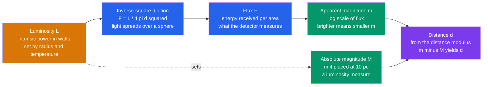

# ✨ Magnitudes, Luminosity and Flux

> [!abstract] TL;DR
> **Luminosity** $L$ is a star's intrinsic power output (watts); **flux** $F$ is the tiny fraction we catch on Earth, diluted by the inverse-square law $F = L/(4\pi d^2)$. Astronomers report brightness on the ancient, logarithmic, *backwards* **magnitude** scale: brighter objects have *smaller* (more negative) magnitudes, and every 5 magnitudes is exactly a factor of 100 in flux (Pogson's law). **Apparent magnitude** $m$ is how bright something looks; **absolute magnitude** $M$ is how bright it *would* look at 10 parsecs — an intrinsic-luminosity measure. Their difference, the **distance modulus** $m - M = 5\log_{10}d - 5$, turns a brightness comparison into a distance, making magnitudes the backbone of the cosmic distance ladder.

## Intuition — analogy FIRST

Imagine identical 100-watt light bulbs scattered across a dark field. Every bulb emits the same power — that is its **luminosity**, fixed no matter where you stand. But a bulb ten steps away looks dim and one at your feet looks blinding: what reaches your eye is the **flux**, and it drops as the square of the distance because the light spreads over an ever-larger sphere. So a *bright-looking* bulb might just be nearby, and a *faint* one might be a distant floodlight.

That is exactly the astronomer's problem. If you know a star's true wattage (its absolute magnitude) and measure how bright it appears (its apparent magnitude), the *mismatch* tells you how far away it is. The whole magnitude system is a 2000-year-old, deliberately inverted, logarithmic way of bookkeeping that mismatch.

---

## How It Works



---

### Secondary Level

**Flux vs luminosity.** Luminosity $L$ is the total energy a source radiates per second — its intrinsic power, in watts. It never changes with your vantage point. Flux $F$ is the power crossing one square metre of your detector, and it *does* depend on distance. As light leaves a star it spreads over the surface of an expanding sphere of area $4\pi d^2$, so

$$F = \frac{L}{4\pi d^2}$$

Double the distance and the flux falls to one-quarter. This **inverse-square law** is pure geometry (see [[Electromagnetic_Waves_and_Radiation]]).

**The magnitude system.** Around 130 BC the Greek astronomer **Hipparchus** ranked naked-eye stars into six classes: the brightest were "first magnitude," the faintest "sixth." Two quirks survive to this day:

- It is **inverted** — *bigger* number means *fainter* star.
- It is roughly **logarithmic** — the eye responds to ratios, so equal magnitude steps look like equal brightness *jumps*, not equal flux differences.

In 1856 **Norman Pogson** made it precise by anchoring the scale so that a difference of exactly **5 magnitudes equals a factor of 100 in flux**. One magnitude step is therefore

$$100^{1/5} = 10^{0.4} \approx 2.512 \ \text{times in flux}.$$

| Object | Apparent magnitude $m$ |
|--------|------------------------|
| Sun | $-26.7$ |
| Full Moon | $-12.7$ |
| Venus (brightest) | $-4.6$ |
| Sirius (brightest star) | $-1.46$ |
| Vega | $+0.03$ |
| Naked-eye limit (dark sky) | $\approx +6$ |
| Pluto | $+14$ |
| Faintest JWST/Hubble sources | $\approx +30$ |

### Undergraduate Level

**Pogson's equation.** For two sources of flux $F_1$ and $F_2$,

$$m_1 - m_2 = -2.5\log_{10}\!\left(\frac{F_1}{F_2}\right)$$

The minus sign encodes the inversion; the $2.5$ makes $5$ magnitudes give $-2.5\log_{10}(1/100) = +5$. Equivalently the flux ratio is $F_1/F_2 = 10^{-0.4(m_1-m_2)}$.

**Absolute magnitude $M$** removes distance from the equation. It is *defined* as the apparent magnitude the object would have if placed at a standard distance of **10 parsecs**. Because it fixes distance, $M$ is a direct proxy for luminosity — two stars with the same $M$ have the same intrinsic power.

**Distance modulus.** Comparing the flux at the true distance $d$ with the flux the same star would give at 10 pc, and using $F \propto 1/d^2$:

$$m - M = -2.5\log_{10}\!\left[\left(\frac{10\,\text{pc}}{d}\right)^2\right] = 5\log_{10}\!\left(\frac{d}{10\,\text{pc}}\right) = 5\log_{10}d - 5$$

with $d$ in parsecs. Invert it to get distance directly: $d = 10^{(m - M + 5)/5}$ pc. This single relation is the workhorse of the [[The_Cosmic_Distance_Ladder|cosmic distance ladder]] — any object whose $M$ you can guess (a Cepheid, a Type Ia supernova) becomes a distance yardstick.

**Photometric systems and bands.** A magnitude is only meaningful in a defined wavelength band, set by a filter plus the detector response. The classic **Johnson–Cousins UBVRI** system spans the ultraviolet to near-infrared:

| Band | Centre $\lambda$ (nm) | Region |
|------|----------------------|--------|
| $U$ | 365 | near-ultraviolet |
| $B$ | 445 | blue |
| $V$ | 551 | visual (green-yellow) |
| $R$ | 658 | red |
| $I$ | 806 | near-infrared |

**Color index.** The difference between two band magnitudes, most commonly $B - V$, measures the *shape* of the spectrum and hence temperature. Since a hot star emits more blue than red light, $B$ is small relative to $V$ and $B-V$ is small or negative; cool stars have large positive $B-V$. So **larger $B-V$ = cooler star** — the observational axis of the [[Stellar_Properties_and_the_HR_Diagram|HR diagram]] (Vega $B-V \approx 0.0$, Sun $B-V \approx +0.65$, a red M dwarf $\approx +1.5$).

**Bolometric magnitude.** A band magnitude misses light outside the filter. The **bolometric magnitude** $m_{\text{bol}}$ integrates over *all* wavelengths. The **bolometric correction** converts a $V$ magnitude to bolometric:

$$BC = m_{\text{bol}} - m_V = M_{\text{bol}} - M_V \le 0$$

$BC$ is always negative or zero (all-band flux $\ge$ V-band flux). It is largest in size for very hot stars (much flux in the UV) and very cool stars (much flux in the IR); for the Sun $BC \approx -0.08$.

### Graduate Level

**Absolute magnitude and luminosity.** The bolometric absolute magnitude ties directly to luminosity. The IAU (2015) fixed the zero point at $L_0 = 3.0128\times10^{28}$ W, so

$$M_{\text{bol}} = -2.5\log_{10}\!\left(\frac{L}{L_0}\right), \qquad M_{\text{bol}} = M_{\text{bol},\odot} - 2.5\log_{10}\!\left(\frac{L}{L_\odot}\right)$$

with $M_{\text{bol},\odot} = 4.74$ and $L_\odot = 3.828\times10^{26}$ W. A star ten times more luminous than the Sun is $2.5\log_{10}(10) = 2.5$ magnitudes brighter.

**Vega vs AB systems.** Zero points differ by convention:

- **Vega system** — Vega defines $m = 0$ in every band, so magnitudes are ratios relative to Vega's spectrum. Convenient historically but tied to one (variable, complicated) star.
- **AB system** — anchored to a physical flux density: $m_{\text{AB}} = -2.5\log_{10} f_\nu - 48.60$ with $f_\nu$ in $\text{erg s}^{-1}\,\text{cm}^{-2}\,\text{Hz}^{-1}$, so $f_\nu = 3631$ Jy gives $m_{\text{AB}}=0$. Preferred in modern surveys (SDSS, LSST) because it is absolute and reproducible. Vega and AB magnitudes differ by a band-dependent offset (e.g. $m_{\text{AB}} - m_{\text{Vega}} \approx +0.02$ in $V$ but $\approx +0.9$ in $K$).

**Extinction and reddening.** Interstellar dust dims and reddens starlight, adding a wavelength-dependent **extinction** term $A_\lambda \ge 0$ (in magnitudes) to the distance modulus:

$$m - M = 5\log_{10}d - 5 + A_\lambda$$

Dust scatters blue more than red, so the *reddening* is $E(B-V) = A_B - A_V > 0$, and $A_V = R_V\,E(B-V)$ with $R_V \approx 3.1$ for the diffuse Galactic ISM. **Ignoring $A_\lambda$ overestimates the distance**, because the extra dimming is mistakenly attributed to distance. For redshifted sources a **K-correction** further accounts for the band sampling a different rest-frame wavelength.

---

## Code Demo

```python
import numpy as np

# --- 1. Flux ratio <-> magnitude difference (Pogson's law) ---
def mag_diff_from_flux_ratio(F1, F2):
    "m1 - m2 = -2.5 log10(F1/F2); brighter (larger flux) => smaller magnitude."
    return -2.5 * np.log10(F1 / F2)

def flux_ratio_from_mag_diff(m1, m2):
    "F1/F2 = 10^(-0.4 (m1 - m2))."
    return 10 ** (-0.4 * (m1 - m2))

print("5 mag brighter -> flux ratio:", flux_ratio_from_mag_diff(0.0, 5.0))   # 100.0 exactly
print("1 mag step      -> flux ratio:", flux_ratio_from_mag_diff(0.0, 1.0))  # ~2.512
# Sun (m=-26.74) vs Sirius (m=-1.46): apparent flux ratio
print("Sun/Sirius flux ratio: {:.3e}".format(flux_ratio_from_mag_diff(-26.74, -1.46)))

# --- 2. Distance modulus: m - M = 5 log10(d/10pc) => d = 10^((m-M-A+5)/5) pc ---
def distance_from_modulus(m, M, A=0.0):
    "Distance in parsecs from apparent m, absolute M, and extinction A (mag)."
    mu0 = (m - M) - A                 # extinction-corrected true distance modulus
    return 10 ** (mu0 / 5.0 + 1.0)    # parsecs

# A Cepheid: apparent V mag m = 20.0, absolute mag M = -5.0, no dust
d = distance_from_modulus(20.0, -5.0)
print(f"Distance (no extinction): {d:,.0f} pc = {d/1e6:.2f} Mpc")

# --- 3. How 1 magnitude of ignored extinction biases the distance ---
A_V = 1.0
d_true  = distance_from_modulus(20.0, -5.0, A=A_V)  # correct: subtract the dust
d_naive = distance_from_modulus(20.0, -5.0, A=0.0)  # wrong: ignore the dust
print(f"True distance  (A={A_V}): {d_true:,.0f} pc")
print(f"Naive distance (A=0):   {d_naive:,.0f} pc")
print(f"Overestimate factor:    {d_naive/d_true:.3f}x  (= 10^(A/5))")
```

Expected output: a 5-mag gap gives exactly $100\times$ in flux; the Sun outshines Sirius by $\sim1.3\times10^{10}$ in apparent flux; the Cepheid sits at $1.00$ Mpc; and ignoring $1$ mag of dust inflates the inferred distance by $10^{1/5} = 1.585\times$.

---

## Real-World Notes

- **Gaia** measures $G$-band magnitudes for ~2 billion stars to milli-magnitude precision, then combines them with parallaxes to build the definitive luminosity map of the Milky Way — a direct, industrial-scale application of the flux–distance relationship.
- **Type Ia supernovae** are "standardizable candles" with a well-calibrated absolute magnitude $M_V \approx -19.3$. Measuring their apparent magnitude and applying the distance modulus revealed cosmic acceleration (1998 Nobel-winning result).
- **Cepheid variables** obey a period–luminosity relation, so their pulsation period fixes $M$; the distance modulus then anchors the extragalactic distance scale and Hubble-constant measurements.
- **AB magnitudes dominate modern surveys** (SDSS $ugriz$, LSST) because their physical zero point is instrument-independent, essential when cross-matching billions of sources across telescopes.
- **Dust maps** (Schlegel–Finkbeiner–Davis, and 3D maps from Gaia) provide $E(B-V)$ so observers can subtract $A_\lambda$ before computing distances or intrinsic colors.
- **Exoplanet transit photometry** works in flux ratios: a Jupiter-sized planet crossing a Sun-like star drops the flux by ~1%, a change of only ~0.011 mag that Kepler and TESS detect routinely.

---

## Common Pitfalls

1. **Getting the sign backwards.** Brighter means *smaller* magnitude. A star at $m = -1$ is far brighter than one at $m = +6$; the $-2.5$ in Pogson's law is what flips flux ratios into this inverted scale.
2. **Confusing apparent and absolute magnitude.** $m$ tells you nothing about intrinsic power alone — a faint-looking star may be an intrinsically luminous one far away. Only $M$ (or $L$) measures true output; you need *both* $m$ and $M$ to get distance.
3. **Ignoring extinction.** Dust dimming is not distance dimming. Omitting $A_\lambda$ overestimates distance by $10^{A_\lambda/5}$ per magnitude — a systematic error that grows toward the Galactic plane.
4. **Mixing photometric systems or bands.** A $V$ magnitude and a $B$ magnitude are not interchangeable, and an AB magnitude differs from a Vega magnitude by a band-dependent offset. Always state the system and band.
5. **Forgetting the bolometric correction.** A single-band magnitude undercounts total luminosity; hot and cool stars radiate much of their energy outside the visible, so $BC$ can be several magnitudes.
6. **Assuming magnitudes are linear.** They are logarithmic — a "2-magnitude" difference is a flux factor of $\sim6.3$, not "twice as bright." Averaging magnitudes is not the same as averaging fluxes.

---

## Related Concepts

- [[_MOC_Observational_Astronomy|↑ Section MOC]]
- [[The_Cosmic_Distance_Ladder]] — the distance modulus is the rung that converts standard candles into distances
- [[Stellar_Properties_and_the_HR_Diagram]] — absolute magnitude and color index $B-V$ are the two axes of the HR diagram
- [[Light_and_Astronomical_Spectroscopy]] — spectra fix temperature and the bolometric correction behind band magnitudes
- [[Telescopes_and_Detectors]] — collecting area and detector response set the faintest magnitude you can reach
- [[The_Celestial_Sphere_and_Coordinates]] — where to point before you measure how bright
- [[Multi_Messenger_Astronomy]] — flux measurements extend beyond photons to neutrinos and gravitational waves
- [[Electromagnetic_Waves_and_Radiation]] — the inverse-square law and radiated power that define flux and luminosity (Physics vault)
- [[_MOC_Mathematics_Master]] — logarithms and the algebra behind Pogson's law (Mathematics vault)

---

## Review Questions

1. **Secondary:** Star A has apparent magnitude $+2$ and star B has $+7$. Which appears brighter, and by what factor in flux? (Hint: a 5-magnitude gap is exactly a factor of 100.)
2. **Undergraduate:** A Cepheid has apparent magnitude $m = 15.0$ and, from its pulsation period, an absolute magnitude $M = -4.0$. Assuming negligible extinction, use the distance modulus to find its distance in parsecs and in kiloparsecs.
3. **Graduate:** The same Cepheid actually lies behind $A_V = 1.5$ mag of dust. Recompute its true distance, and state the factor by which you would have *overestimated* the distance had you ignored the extinction. Explain physically why ignoring dust always biases distances upward.

---

## Sources

- Carroll & Ostlie — *An Introduction to Modern Astrophysics*, 2nd ed., Ch. 3 (Continuous Spectrum of Light)
- Bessell (2005) — "Standard Photometric Systems," *ARA&A* 43, 293
- Pogson, N. (1856) — *MNRAS* 17, 12 (the definition of the magnitude ratio)
- IAU 2015 Resolution B2 — nominal solar and bolometric magnitude zero points
- Fitzpatrick (1999) — "Correcting for the Effects of Interstellar Extinction," *PASP* 111, 63

---

#astronomy #observational-astronomy #magnitudes #luminosity #flux #distance-modulus #photometry #extinction #secondary #undergraduate #graduate
