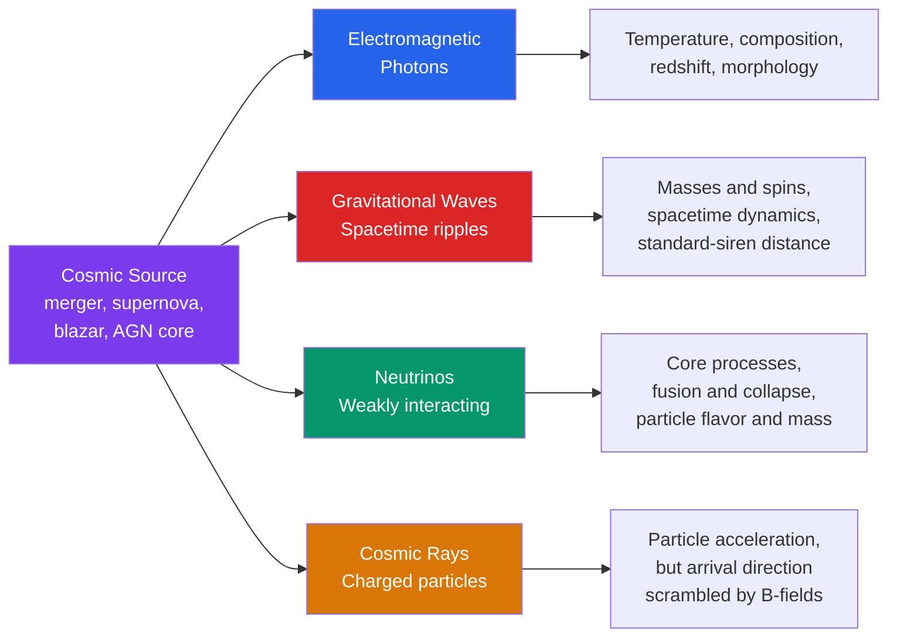

# 📡 Multi-Messenger Astronomy

> [!abstract] TL;DR
> For four centuries astronomy meant collecting **light**. Multi-messenger astronomy adds three more carriers of cosmic information — **gravitational waves** (ripples in spacetime), **neutrinos** (weakly interacting particles that escape stellar cores), and **cosmic rays** (charged particles) — and studies the same event through several at once. Because each messenger probes different physics and travels under different rules, a *coincident* detection localizes a source, cross-checks the astrophysics, and constrains fundamental physics. The landmark events are **GW170817** (a neutron-star merger seen in gravitational waves *and* across the electromagnetic spectrum) and **TXS 0506+056** (a blazar coincident with an IceCube neutrino).

## Intuition — analogy FIRST

Imagine a distant explosion at night. You **see** the flash, you **hear** the boom seconds later, you **feel** the ground shake, and you **smell** the smoke on the wind. Each sense reaches you by a different physical channel, at a different speed, carrying different information — light tells you *where*, sound tells you *how far* (from the delay), the tremor tells you it moved the earth, the smell tells you *what burned*. No single sense gives the whole story; combining them does.

The cosmos broadcasts on four such channels. Photons show us the surface; neutrinos pierce through to the core where fusion and collapse happen; gravitational waves report the violent motion of mass itself, needing no light at all; and cosmic rays sample the particles that were accelerated. Listening on all four turns astronomy from *watching* into *witnessing*.

---

## How It Works



---

## Key Concepts / Details

### Secondary Level

The four messengers are not interchangeable — each is made of something different and obeys different rules.

| Messenger | What it is | Speed | Points back to source? | What it reveals |
|-----------|-----------|-------|------------------------|-----------------|
| **Electromagnetic** | Photons (radio → gamma) | $c$ | Yes (uncharged) | Surface temperature, composition, redshift |
| **Gravitational waves** | Ripples in spacetime | $c$ (in GR) | Yes | Masses, orbital motion, distance |
| **Neutrinos** | Weakly interacting particles | $\approx c$ (tiny mass) | Yes (nearly uncharged) | Core fusion / collapse, flavor |
| **Cosmic rays** | Charged particles (protons, nuclei) | $\lesssim c$ | **No** — bent by magnetic fields | That acceleration happened |

Why bother with more than light? **Neutrinos and gravitational waves come from places light cannot escape.** A supernova core collapses in seconds, but the light takes *hours* to punch out through the star's envelope; neutrinos leave immediately. Two merging black holes emit essentially no light at all — only gravitational waves. Cosmic rays prove that some engine in the universe accelerates particles to enormous energy, even though their scrambled paths hide *which* engine.

### Undergraduate Level

**GW170817 — the multi-messenger event.** On 17 August 2017, LIGO and Virgo recorded a gravitational-wave chirp from a **binary neutron-star merger** at $\sim 40$ Mpc (in the galaxy NGC 4993). About **1.7 s later**, the Fermi and INTEGRAL satellites saw a **short gamma-ray burst** (GRB 170817A). Adding the Virgo detector shrank the sky localization to $\sim 28\,\text{deg}^2$, and roughly 11 hours later optical telescopes found the fading **kilonova** (AT2017gfo). This single event delivered:

1. **Confirmation** that binary neutron-star mergers produce short gamma-ray bursts.
2. **Direct evidence of r-process nucleosynthesis** — the kilonova's reddening matched ejecta rich in heavy, neutron-captured elements (gold, platinum, the lanthanides). Mergers forge much of the periodic table's heaviest half.
3. A **standard-siren** measurement of the Hubble constant (see below), independent of the [[The_Cosmic_Distance_Ladder|distance ladder]].

**Standard sirens.** A gravitational waveform's amplitude encodes the source's *luminosity distance* $D_L$ directly — no calibration chain needed. The electromagnetic counterpart supplies the host-galaxy redshift $z$. For nearby sources,

$$H_0 \approx \frac{c\,z}{D_L}$$

GW170817 gave $H_0 = 70.0^{+12.0}_{-8.0}\ \text{km s}^{-1}\text{Mpc}^{-1}$ — a completely new rung, sitting between the CMB and Cepheid values that disagree in the "Hubble tension."

**TXS 0506+056 — the neutrino source.** On 22 September 2017, IceCube's alert system flagged a single $\sim 290$ TeV neutrino (IceCube-170922A). Follow-up telescopes found it aligned with a **flaring blazar**, TXS 0506+056 (redshift $z \approx 0.34$) — a supermassive black hole shooting a relativistic jet at Earth. This was the first identified extragalactic source of high-energy astrophysical neutrinos, and evidence that blazar jets accelerate cosmic rays.

**The machinery.** Multi-messenger science runs on **alert networks** (GCN, SCiMMA) that broadcast a detection's time and sky map within seconds, so robotic telescopes can slew and hunt for a counterpart before it fades. The bottleneck is **localization**: a single gravitational-wave detector or neutrino event pins the sky only poorly, so networks of detectors and rapid optical tiling are essential.

### Graduate Level

**Inspiral chirp.** For a compact binary in the quadrupole (Newtonian) approximation, the gravitational-wave frequency $f_{\rm GW}$ (twice the orbital frequency) evolves as

$$\frac{df_{\rm GW}}{dt} = \frac{96}{5}\,\pi^{8/3}\left(\frac{G\mathcal{M}}{c^{3}}\right)^{5/3} f_{\rm GW}^{11/3},$$

governed entirely by the **chirp mass**

$$\mathcal{M} = \frac{(m_1 m_2)^{3/5}}{(m_1 + m_2)^{1/5}}.$$

Integrating gives the frequency a time $\tau$ before coalescence, $f_{\rm GW}(\tau) = \tfrac{1}{\pi}\left(\tfrac{5}{256\,\tau}\right)^{3/8}\left(\tfrac{G\mathcal{M}}{c^3}\right)^{-5/8}$ — the rising "chirp" whose slope reads out $\mathcal{M}$.

**Speed of gravity.** The $1.7$ s photon–GW delay in GW170817, over a light-travel time $D/c$, bounds any difference between the speed of gravity $v_{\rm gw}$ and light:

$$\frac{|v_{\rm gw}-c|}{c} \lesssim \frac{\Delta t}{D/c}.$$

Accounting for the astrophysical emission delay, LIGO/Virgo reported $-3\times10^{-15} \le (v_{\rm gw}-c)/c \le +7\times10^{-16}$ — killing whole classes of modified-gravity dark-energy models.

**Neutrino mass and time-of-flight.** A neutrino of mass $m_\nu$ and energy $E_\nu$ lags a photon by

$$\Delta t \approx \frac{D}{c}\,\frac{1}{2}\left(\frac{m_\nu c^2}{E_\nu}\right)^{2}.$$

The $\sim 13$ s spread of the $\sim$ two dozen SN 1987A neutrinos (11 in Kamiokande-II, 8 in IMB, 5 in Baksan), arriving $\sim 3$ hours *before* the optical brightening, bounds $m_\nu \lesssim$ a few eV — an astrophysical limit competitive with lab experiments of its era.

**Detection challenge.** Neutrino and GW backgrounds are severe. IceCube rejects a $\sim 10^6$-times larger flux of atmospheric muons; GW searches use *matched filtering* against template banks plus coincidence between separated detectors to beat non-Gaussian glitches. A confident signal requires both low false-alarm rate **and** a plausible sky coincidence with an EM event.

```python
import numpy as np

# Physical constants (SI)
c   = 2.998e8      # speed of light, m/s
Mpc = 3.086e22     # meters per megaparsec
kpc = 3.086e19     # meters per kiloparsec
yr  = 3.156e7      # seconds per year

# --- 1. Neutrino mass from time-of-flight (SN 1987A) ---
# A massive neutrino trails a photon by  dt = (D/c) * 0.5 * (m c^2 / E)^2
D_sn = 51.4 * kpc          # distance to SN 1987A (Large Magellanic Cloud)
E_nu = 10e6                # neutrino energy in eV  (~10 MeV typical)
m_nu = 1.0                 # trial neutrino mass in eV/c^2
dt_nu = (D_sn / c) * 0.5 * (m_nu / E_nu)**2          # (m c^2 / E) is eV/eV
print(f"SN 1987A photon travel time  : {D_sn/c/yr:.3e} yr")
print(f"Delay of {m_nu:.0f} eV neutrino at {E_nu/1e6:.0f} MeV : {dt_nu:.3f} s")

# --- 2. Speed of gravity from GW170817 ---
D_gw   = 40 * Mpc          # distance to host galaxy NGC 4993
dt_obs = 1.7               # GRB arrived ~1.7 s after the GW merger
travel = D_gw / c
frac   = dt_obs / travel   # rough bound on |v_gw - c| / c
print(f"\nGW170817 travel time         : {travel/yr:.3e} yr")
print(f"Bound on |v_gw - c| / c       : ~{frac:.1e}")

# --- 3. Chirp mass and pre-merger frequency of a neutron-star binary ---
G, Msun = 6.674e-11, 1.989e30
m1 = m2 = 1.4 * Msun
Mc  = (m1 * m2)**0.6 / (m1 + m2)**0.2               # chirp mass, kg
tau = 0.01                                          # 10 ms before merger
f_gw = (1/np.pi) * (5/(256*tau))**0.375 * (G*Mc/c**3)**(-0.625)
print(f"\nChirp mass                   : {Mc/Msun:.3f} Msun")
print(f"GW frequency 10 ms pre-merger : {f_gw:.0f} Hz")
```

---

## Real-World Notes

- **LIGO / Virgo / KAGRA** form a global gravitational-wave network; three or more detectors triangulate a source by the *arrival-time differences* of the same wavefront, the way GPS fixes a position.
- **IceCube** instruments a cubic kilometer of Antarctic ice with photomultipliers, catching the faint Cherenkov flash of the rare neutrino that interacts — and now issues real-time alerts to optical observatories.
- **Solar neutrinos** were the *first* astrophysical neutrino signal. The measured deficit ("solar neutrino problem") was resolved by **neutrino oscillation**, simultaneously confirming that the [[Standard_Model_Overview|Standard Model]] is incomplete and that the Sun runs on p-p fusion exactly as [[Stellar_Structure_and_Energy_Generation|stellar models predict]].
- **Cosmic rays** at the highest energies ($>10^{19}$ eV) are deflected only slightly by galactic fields, so experiments like the Pierre Auger Observatory search for faint anisotropies — the closest cosmic rays come to "pointing."
- **The r-process confirmation** from GW170817's kilonova rewrote nucleosynthesis: neutron-star mergers, not just supernovae, are a dominant factory of the universe's gold and platinum.
- **Rubin Observatory (LSST)** and next-generation GW detectors (Einstein Telescope, Cosmic Explorer) are being built explicitly for the multi-messenger era — wide, fast optical surveys paired with deeper, better-localized GW alerts.

---

## Common Pitfalls

1. **Assuming coincidence proves association.** A neutrino and a flaring blazar in the same patch of sky at the same time might be chance. Claims require a quantified false-alarm probability, not just visual overlap.
2. **Confusing arrival delay with speed difference.** The 1.7 s GW–GRB lag is mostly the *astrophysics* of when the gamma rays were emitted, not evidence that gravity is slower than light. Bounds must model the emission delay.
3. **Expecting cosmic rays to point home.** Because they are charged, galactic and intergalactic magnetic fields scramble their directions — cosmic rays alone cannot localize a source, which is why the *neutrino* was the messenger that fingered TXS 0506+056.
4. **Treating luminosity distance as physical distance.** The standard-siren $D_L$ is redshifted and must be paired with an EM redshift; using it as a comoving distance biases $H_0$.
5. **Underestimating localization area.** Early GW alerts can span hundreds of square degrees; without an EM counterpart, "detecting" a merger tells you little about *where* it happened.
6. **Forgetting the messengers travel differently.** Photons scatter and absorb, neutrinos oscillate in flavor, cosmic rays diffuse — comparing them naively as if all arrive clean and on time leads to wrong inferences.

---

## Related Concepts

- [[_MOC_Observational_Astronomy|↑ Section MOC]]
- [[The_Celestial_Sphere_and_Coordinates]] — how sky positions and localization regions are specified
- [[Telescopes_and_Detectors]] — the EM instruments that chase transient counterparts
- [[Light_and_Astronomical_Spectroscopy]] — the traditional messenger and how its spectrum is decoded
- [[Magnitudes_Luminosity_and_Flux]] — quantifies the brightness of kilonovae and afterglows
- [[The_Cosmic_Distance_Ladder]] — standard sirens add an independent rung for $H_0$
- [[Gravitational_Waves]] — the spacetime-ripple messenger in depth
- [[Cosmic_Rays_and_Neutrino_Astrophysics]] — the particle messengers in depth
- [[Supernovae_and_Gamma_Ray_Bursts]] — the engines behind SN 1987A neutrinos and GW170817's short GRB
- **Physics** — [[Introduction_to_General_Relativity]] (why GWs travel at $c$), [[Standard_Model_Overview]] (neutrino flavor and mass), [[Fundamental_Forces_and_Feynman_Diagrams]] (the weak interaction that lets neutrinos escape)
- **Mathematics** — [[_MOC_Mathematics_Master]] (matched filtering, time-series and probability behind detection)

---

## Review Questions

1. **Secondary**: Name the four cosmic messengers. Which one does *not* point back to its source, and why? Give one thing each messenger reveals that the others cannot.
2. **Undergraduate**: GW170817 gave a luminosity distance of $\sim 40$ Mpc and its host galaxy a recession velocity of $\sim 3000$ km/s. Estimate $H_0$. Explain why this "standard siren" needs *both* a gravitational-wave *and* an electromagnetic detection.
3. **Graduate**: A neutrino burst and a photon burst leave a source at distance $D$ simultaneously. Derive the arrival-time delay $\Delta t$ for a neutrino of mass $m_\nu$ and energy $E_\nu$. Using SN 1987A ($D = 51.4$ kpc, $E_\nu \sim 10$ MeV, burst duration $\sim 13$ s), estimate the upper bound this places on $m_\nu$.

---

## Sources

- Abbott et al. (2017) — "Multi-messenger Observations of a Binary Neutron Star Merger," *ApJ Letters* 848, L12
- Abbott et al. (2017) — "GW170817: Observation of GWs from a BNS Inspiral," *PRL* 119, 161101
- IceCube Collaboration et al. (2018) — "Multimessenger observations of a flaring blazar coincident with high-energy neutrino IceCube-170922A," *Science* 361, eaat1378
- Maggiore — *Gravitational Waves, Vol. 1: Theory and Experiments*, Ch. 4 (inspiral waveforms)
- Meszaros, Fox, Hanna & Murase (2019) — "Multi-messenger astrophysics," *Nature Reviews Physics* 1, 585

#astronomy #observational-astronomy #multimessenger #gravitationalwaves #neutrinos #cosmicrays #GW170817 #standardsiren #undergraduate #graduate
