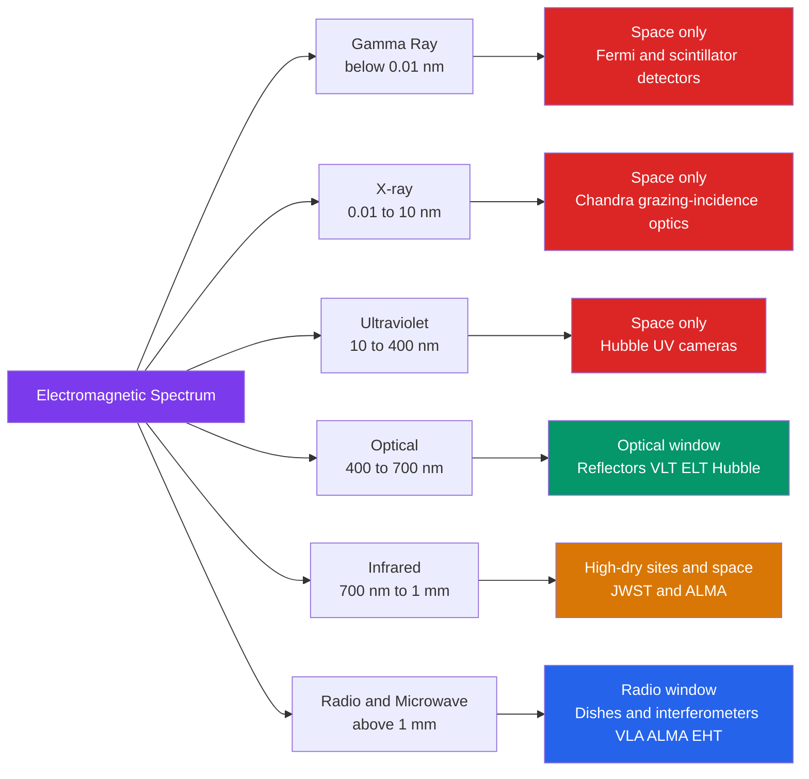

# 🔭 Telescopes and Detectors

> [!abstract] TL;DR
> A telescope does two jobs: it **gathers light** (collecting power scales with aperture area, $\propto D^2$) and it **resolves detail** (the diffraction limit $\theta \approx 1.22\,\lambda/D$). Big telescopes are always **reflectors** because large mirrors are cheaper, lighter, and free of chromatic aberration. Earth's atmosphere blocks UV, X-ray, and gamma light and blurs the optical to $\sim 1''$ **seeing**, so we go to space or use **adaptive optics**. At long (radio) wavelengths a single dish resolves poorly, so we use **interferometry**: an array's resolution is set by its baseline, not its dish size, and the sky is reconstructed by Fourier inversion — the principle behind the VLA, ALMA, and the Event Horizon Telescope.

## Intuition — analogy FIRST

A telescope is a **bigger, sharper eye**. Your pupil is a 5 mm aperture; on a dark night it catches too few photons to see a faint galaxy, and its small size smears fine detail. A telescope replaces your pupil with a mirror metres across: a wider bucket catches far more rain (photons), and a wider opening diffracts light less, so the picture is sharper.

Now push the idea further. To photograph a coin from across a city you would need an absurdly large lens — or you could set up two small cameras at opposite ends of the city and *combine* their signals. The pair "sees" as sharply as a single lens spanning the whole city. That is **interferometry**: the resolution comes from how far apart your detectors are, not how big each one is.

---

## How It Works



Only two **atmospheric windows** are wide open from the ground — the **optical** window ($\sim 300$–$1100$ nm) and the **radio** window ($\sim 1$ cm–$10$ m). UV, X-ray, and gamma astronomy must fly above the atmosphere.

---

## Key Concepts / Details

### Secondary Level

**The two jobs of a telescope**

1. **Light-gathering power** — proportional to the collecting *area*, so to aperture diameter squared:
$$\text{Light collected} \propto D^2$$
A $10$ m mirror gathers $(10/0.005)^2 = 4{,}000{,}000$ times more light than a $5$ mm human pupil. This is why "aperture wins" — bigger telescopes see fainter objects.

2. **Angular resolution** — the ability to separate two close points, set by diffraction (below).

**Refractors vs reflectors**

| Design | Optical element | Problem it has | Example |
|--------|-----------------|----------------|---------|
| Refractor | Lens | **Chromatic aberration** (colours focus at different points); lens sags under its own weight; must be flawless throughout | Yerkes 1.02 m — the largest ever |
| Reflector | Mirror | None of the above; only the front surface matters, supported from behind | Every large telescope, e.g. VLT 8.2 m, ELT 39 m |

**All large telescopes are reflectors**: mirrors reflect every colour identically (no chromatic aberration), can be supported across their whole back, and only need one polished surface.

**Magnification (visual eyepiece)**
$$M = \frac{f_{\text{objective}}}{f_{\text{eyepiece}}}$$
For research imaging, magnification is almost irrelevant — aperture and resolution are what matter.

### Undergraduate Level

**Focal ratio, plate scale, f-number**

- **Focal length** $f$: distance from the mirror/lens to the focus.
- **Focal ratio (f-number)**: $N = f/D$. "Fast" optics (small $N$, e.g. $f/2$) give a wide, bright field; "slow" optics (large $N$, e.g. $f/15$) give a larger, higher-magnification image scale.
- **Plate scale**: angular size per unit length at the focal plane. Since a source at angle $\theta$ lands at $x = f\theta$,
$$\text{plate scale} = \frac{1}{f} \ \text{rad/mm} = \frac{206265}{f\,[\text{mm}]}\ \text{arcsec/mm}$$

**The diffraction limit (Rayleigh criterion)**

Even a perfect telescope cannot beat diffraction. Two point sources are just resolved when the peak of one Airy pattern falls on the first null of the other:
$$\boxed{\theta_{\min} \approx 1.22\,\frac{\lambda}{D}} \quad (\text{radians})$$
The $1.22$ comes from the first zero of the Bessel function $J_1$ for a circular aperture (see [[Interference_and_Diffraction]] and [[Geometric_and_Wave_Optics]]). Longer wavelength or smaller aperture ⇒ coarser resolution.

**Atmospheric seeing**

Turbulent cells in the atmosphere distort the incoming wavefront, blurring ground-based optical images to $\theta_{\text{seeing}} \sim 0.5$–$1.5''$. A $10$ m telescope's *diffraction* limit at $550$ nm is $\sim 0.014''$ — so **seeing, not diffraction, limits raw ground images** by a factor of $\sim 100$ unless corrected.

**Detectors: from plates to CCDs**

| Detector | Quantum efficiency | Notes |
|----------|--------------------|-------|
| Photographic plate | $\sim 1$–$2\%$ | Non-linear; historical |
| CCD / CMOS | up to $\sim 90\%$ | Linear, digital, low noise |

- **Quantum efficiency (QE)**: fraction of incident photons actually detected.
- **Integration time** $t$: signal $S \propto t$. For photon (shot) noise $\propto \sqrt{N}$, the signal-to-noise ratio grows as $\text{SNR} \propto \sqrt{t}$.
- **Noise sources**: photon shot noise, detector **read noise**, and thermal **dark current** (reduced by cooling).

**Beating the single-aperture limit**

- **Adaptive optics (AO)**: a **wavefront sensor** measures the atmospheric distortion using a bright natural or **laser guide star**, and a **deformable mirror** reshapes hundreds of times per second to flatten the wavefront, recovering near-diffraction-limited images from the ground.
- **Radio interferometry**: combine $N$ dishes; the resolution is set by the **baseline** $B$ (dish separation), not the dish diameter:
$$\theta \approx \frac{\lambda}{B}$$

### Graduate Level

**Point spread function and MTF**

The image of a point source is the **point spread function (PSF)**. For a circular aperture it is the **Airy pattern**,
$$I(\theta) = I_0\left[\frac{2 J_1(x)}{x}\right]^2,\qquad x = \frac{\pi D \sin\theta}{\lambda}$$
The imaging system's response in the spatial-frequency domain is the **optical transfer function (OTF)** — the Fourier transform of the PSF — whose modulus is the **modulation transfer function (MTF)**. Incoherent imaging has a hard cutoff frequency $f_c = D/\lambda$: detail finer than $\lambda/D$ carries zero contrast. This is the Fourier-optics restatement of the diffraction limit.

**Aperture synthesis and the van Cittert–Zernike theorem**

An interferometer measures the **complex visibility** $V(u,v)$ — the correlation of the field between two antennas separated by baseline vector $(u,v)$ (in wavelengths). The **van Cittert–Zernike theorem** states that for a spatially incoherent source, the visibility is the normalised Fourier transform of the sky brightness $I(l,m)$:
$$V(u,v) = \int\!\!\int I(l,m)\, e^{-2\pi i (ul + vm)}\, dl\, dm$$
So each baseline samples one Fourier component of the sky. As Earth rotates, the baselines sweep out the **$uv$-plane**; inverting the sampled transform reconstructs the image — **aperture synthesis** (link [[Fourier_Transform]]). **VLBI** extends baselines to Earth's diameter ($\sim 10{,}000$ km); the **Event Horizon Telescope** synthesised an Earth-sized aperture at $1.3$ mm to image the black-hole shadows of M87\* and Sgr A\*.

**Grazing-incidence X-ray optics**

X-rays pass straight through a normal-incidence mirror. They reflect only at very shallow **grazing angles** ($< 1^\circ$), so X-ray telescopes (Chandra, XMM-Newton) nest paraboloid–hyperboloid **Wolter** mirrors that skim the rays to a focus.

```python
import numpy as np

# Diffraction-limited resolution theta = 1.22 * lambda / D, in arcseconds.
# 1 radian = 206265 arcseconds.
RAD_TO_ARCSEC = 206265.0

def resolution_arcsec(wavelength_m, aperture_m):
    theta_rad = 1.22 * wavelength_m / aperture_m
    return theta_rad * RAD_TO_ARCSEC

# Each instrument observes at its natural wavelength.
configs = [
    ("10 m optical telescope", 550e-9, 10.0),    # visible light (VLT-class)
    ("25 m single radio dish", 0.21,   25.0),    # 21 cm neutral-hydrogen line
    ("10,000 km VLBI baseline", 0.21,  1.0e7),   # same line, Earth-sized array
    ("EHT: 1.3 mm, 10,000 km", 1.3e-3, 1.0e7),   # Event Horizon Telescope
]

print(f"{'Instrument':<26}{'lambda[m]':>11}{'D or B[m]':>12}{'resolution':>16}")
for name, lam, D in configs:
    theta = resolution_arcsec(lam, D)
    print(f"{name:<26}{lam:>11.2e}{D:>12.2e}{theta:>12.4g} arcsec")

opt    = resolution_arcsec(550e-9, 10.0)
single = resolution_arcsec(0.21, 25.0)
vlbi   = resolution_arcsec(0.21, 1.0e7)

# A single radio dish is far coarser than an optical scope only because
# lambda is ~380,000x larger. Stretching the effective aperture into a
# 10,000 km baseline recovers -- and beats -- optical sharpness.
print(f"\nSingle dish is {single/opt:,.0f}x coarser than the 10 m optical scope")
print(f"VLBI baseline is {single/vlbi:,.0f}x sharper than the single 25 m dish")
```

Running it shows the $10$ m optical scope reaches $\sim 0.014''$, the $25$ m dish only $\sim 2100''$ (half a degree!), while the $10{,}000$ km VLBI baseline reaches $\sim 0.005''$ and the EHT $\sim 3\times10^{-5}\,''$ ($\sim 30$ microarcseconds) — the sharpness that resolves a black-hole shadow.

---

## Real-World Notes

- **Hubble Space Telescope** — a modest $2.4$ m mirror, but above the atmosphere it works at its diffraction limit ($\sim 0.05''$), out-resolving much larger uncorrected ground telescopes and reaching into the UV.
- **JWST** — a $6.5$ m segmented mirror at the Sun–Earth L2 point, passively cooled behind a sunshield to observe the **infrared** (redshifted first galaxies, cool dust, exoplanet atmospheres) — wavelengths the atmosphere and warm optics would swamp.
- **VLT / ELT (ESO, Chile)** — four $8.2$ m Unit Telescopes usable as an interferometer (VLTI); the $39$ m ELT, with adaptive optics baked in, will image exoplanets directly.
- **VLA and ALMA** — the Very Large Array (27 × 25 m dishes, radio) and ALMA (66 antennas, millimetre/submillimetre on the high, dry Atacama plateau) exploit aperture synthesis; ALMA's dry site is chosen to dodge water-vapour absorption.
- **Event Horizon Telescope** — a global VLBI network at $1.3$ mm that produced the first images of black-hole shadows (M87\* in 2019, Sgr A\* in 2022).
- **LIGO** — not an EM telescope but a laser interferometer detecting spacetime strain; a cornerstone of [[Multi_Messenger_Astronomy]].

---

## Common Pitfalls

1. **Confusing magnification with power.** For research, magnification is nearly meaningless — **aperture** sets both light grasp ($\propto D^2$) and resolution ($\propto 1/D$). Amateur ads touting "600×" mislead.
2. **Assuming a big optical telescope is automatically sharp.** From the ground, **seeing** ($\sim 1''$) dominates the tiny diffraction limit unless adaptive optics or space observing intervenes.
3. **Forgetting the $\lambda$ in $\theta \approx 1.22\,\lambda/D$.** Radio wavelengths are $\sim 10^6\times$ larger than optical, so a single dish resolves poorly — this *necessity*, not a preference, is why radio astronomy invented interferometry.
4. **Thinking an interferometer's collecting area equals a filled aperture.** Baseline sets *resolution*; total dish area sets *sensitivity*. An array resolves like a giant dish but only collects like its individual dishes summed.
5. **Expecting normal mirrors to focus X-rays.** X-rays penetrate ordinary coatings; only **grazing-incidence** optics work, and only from space.
6. **Ignoring detector noise at low signal.** Faint-source imaging can be **read-noise** or **dark-current** limited, not photon limited — cooling and long integrations are essential, and SNR only grows as $\sqrt{t}$.

---

## Related Concepts

- [[_MOC_Observational_Astronomy|↑ Section MOC]]
- [[The_Celestial_Sphere_and_Coordinates]] — where telescopes point: the coordinate framework and how mounts track the sky
- [[Light_and_Astronomical_Spectroscopy]] — what detectors record once light is dispersed into a spectrum
- [[Magnitudes_Luminosity_and_Flux]] — how collected flux is turned into the brightness scale
- [[The_Cosmic_Distance_Ladder]] — resolution and light grasp set which standard candles we can reach
- [[Multi_Messenger_Astronomy]] — detectors beyond light: gravitational waves, neutrinos, cosmic rays
- **Physics** — [[Interference_and_Diffraction]] (the $1.22\,\lambda/D$ limit), [[Geometric_and_Wave_Optics]] (lenses, mirrors, focal length), [[Electromagnetic_Waves_and_Radiation]] (the spectrum we observe)
- **Signals & Systems** — [[Fourier_Transform]] (aperture synthesis and the van Cittert–Zernike theorem)
- **Mathematics** — [[_MOC_Mathematics_Master]] (Bessel functions, Fourier analysis, error propagation)

---

## Review Questions

1. **Secondary**: A $2$ m telescope replaces a $0.2$ m one. By what factor does its light-gathering power increase? Why do professional astronomers care more about this than about magnification?
2. **Undergraduate**: Compute the diffraction-limited resolution (in arcseconds) of an $8$ m telescope at $\lambda = 500$ nm. Compare it to typical seeing of $1''$. What technology closes the gap without going to space, and how does it work?
3. **Graduate**: State the van Cittert–Zernike theorem and explain how Earth-rotation aperture synthesis fills the $uv$-plane. Why can a 10,000 km VLBI array at $1.3$ mm resolve a black-hole shadow that no single filled dish could?

---

## Sources

- Carroll & Ostlie — *An Introduction to Modern Astrophysics*, 2nd ed., Ch. 6 (Telescopes)
- Thompson, Moran & Swenson — *Interferometry and Synthesis in Radio Astronomy*, 3rd ed.
- Rieke — *Detection of Light: From the Ultraviolet to the Submillimeter*, 2nd ed.
- Event Horizon Telescope Collaboration (2019) — *ApJL* 875, L1 (First M87\* image)
- Kitchin — *Astrophysical Techniques*, 6th ed.

#astronomy #observational-astronomy #telescopes #detectors #diffraction #interferometry #adaptive-optics #secondary #undergraduate #graduate
