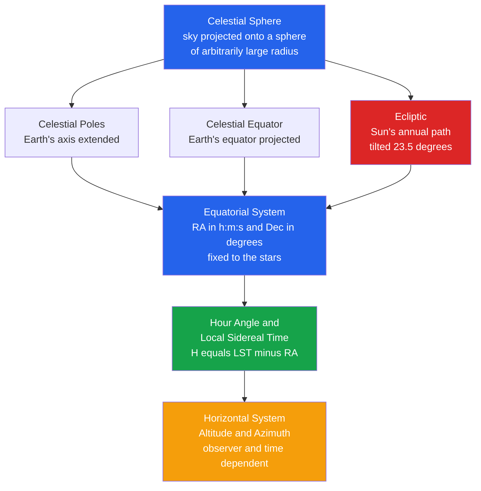

# 🌐 The Celestial Sphere and Coordinate Systems

> [!abstract] TL;DR
> The **celestial sphere** is an imaginary sphere of arbitrarily large radius, centred on the observer, onto which all stars are projected — a bookkeeping device that lets us treat the sky as a 2-D surface. Positions are specified in two main systems: the **horizontal (alt-azimuth)** system tied to the local horizon (altitude and azimuth, which change with observer and time) and the **equatorial** system tied to the stars (right ascension and declination, fixed for distant objects). The two are linked by the **hour angle** and **local sidereal time**. The sky appears to turn once per **sidereal day** (about 3m56s shorter than a solar day), the Sun crawls yearly along the tilted **ecliptic** producing the seasons, and the whole grid slowly drifts over the ~26,000-year cycle of **precession**.

## Intuition — analogy FIRST

Imagine you are standing inside a giant planetarium dome. You cannot tell how far away each projected star is — they all look "painted" on the inside of the dome at the same distance. To tell a friend where a star is, you can either point relative to *your* room (how high above the floor, and which wall it faces) or use a fixed grid printed on the dome itself. The first is fast but only works for you, right now; the second works for everyone, forever.

That is exactly the choice astronomers make. **Altitude/azimuth** is the "your room" description — intuitive but useless to anyone elsewhere or later. **Right ascension/declination** is the "grid printed on the dome" — it does not care where you stand or what time it is, so it is what catalogues use.

---

## How It Works

The celestial sphere inherits its reference circles from the Earth. Extend the Earth's rotation axis to infinity and it pierces the sphere at the **north and south celestial poles**; extend the equatorial plane and it cuts the sphere in the **celestial equator**. The Sun's apparent yearly path is the **ecliptic**, tilted by Earth's axial obliquity of $23.5^\circ$ relative to the celestial equator. The two intersection points of ecliptic and equator are the **equinoxes**; the vernal (spring) equinox defines the zero point of right ascension.



---

## Key Concepts / Details

### Secondary Level

**Angular measure.** All positions and separations on the sphere are angles. The full sky spans $360^\circ$ around and $180^\circ$ pole to pole. Finer units:

$$1^\circ = 60' \text{ (arcminutes)}, \qquad 1' = 60'' \text{ (arcseconds)}$$

The full Moon and the Sun are each about $0.5^\circ = 30'$ across; the unaided human eye resolves roughly $1'$.

**Horizontal (alt-azimuth) system.** Two angles anchored to *your* horizon:
- **Altitude** $a$: angle above the horizon, from $0^\circ$ (horizon) to $90^\circ$ (the **zenith**, straight up). Negative means below the horizon.
- **Azimuth** $A$: compass bearing along the horizon, measured from North ($0^\circ$) through East ($90^\circ$), South ($180^\circ$), West ($270^\circ$).

These change minute by minute as the sky turns, and differ for every observer — so they are used for *pointing a telescope now*, not for cataloguing.

**Equatorial system.** Two angles fixed to the stars:
- **Declination** $\delta$: celestial "latitude," $-90^\circ$ to $+90^\circ$, measured from the celestial equator.
- **Right ascension** $\alpha$ (RA): celestial "longitude," measured *eastward* from the vernal equinox, quoted in **time units** ($0^\text{h}$ to $24^\text{h}$) because the sky turns $15^\circ$ per hour: $1^\text{h} = 15^\circ$.

**The meridian and culmination.** The **meridian** is the north–south line through the zenith. A star reaches its highest point (**culminates**) when it crosses the meridian; there its altitude is $a_{\max} = 90^\circ - |\varphi - \delta|$ for latitude $\varphi$.

**Circumpolar stars.** From latitude $\varphi$ (northern hemisphere), a star never sets if $\delta > 90^\circ - \varphi$ — it circles the pole all night. Likewise stars with $\delta < -(90^\circ - \varphi)$ never rise.

### Undergraduate Level

**Solar vs sidereal time.** A **sidereal day** ($23^\text{h}56^\text{m}04^\text{s}$) is one rotation relative to the *stars*; a **solar day** ($24^\text{h}$) is one rotation relative to the *Sun*. Because Earth advances about $1^\circ$ along its orbit each day, it must turn an extra $\sim 1^\circ$ ($\approx 4$ minutes) to bring the Sun back to the meridian:

$$\Delta t \approx \frac{360^\circ/365.25}{15^\circ/\text{h}} \times 60 \approx 3^\text{m}56^\text{s}$$

This is why a given star rises about 4 minutes earlier each night, and why constellations shift with the season.

**Hour angle and local sidereal time (LST).** The **hour angle** $H$ of a star is how far west of the meridian it has moved, and it links the two systems:

$$H = \text{LST} - \alpha$$

LST equals the RA currently on the meridian. At culmination $H = 0$ (LST $= \alpha$); $H < 0$ means the object is rising in the east, $H > 0$ setting in the west.

**Equation of time and the analemma.** Apparent solar time (a sundial) and mean solar time (a clock) differ by up to $\pm 16$ minutes over the year, because Earth's orbit is elliptical (varying orbital speed) and the ecliptic is tilted. Plotting the Sun's position at the same clock time each day traces a figure-eight, the **analemma**.

**Precession of the equinoxes.** Torques from the Sun and Moon on Earth's equatorial bulge make the spin axis wobble like a top, tracing a cone of half-angle $23.5^\circ$ over about **26,000 years**. Consequences: the pole star changes (Polaris now, Vega in ~12,000 yr), and the vernal equinox — the zero of RA — drifts $\sim 50''$ per year. This is why coordinates must be tagged with an **epoch**.

### Graduate Level

**Coordinate transformation (spherical law of cosines).** Consider the spherical triangle joining the celestial **pole** $P$, the **zenith** $Z$, and the **star** $X$. Its sides are $PZ = 90^\circ-\varphi$, $PX = 90^\circ-\delta$, $ZX = 90^\circ-a$, with the hour angle $H$ as the angle at $P$. Applying the spherical law of cosines to side $ZX$ gives altitude:

$$\sin a = \sin\varphi\,\sin\delta + \cos\varphi\,\cos\delta\,\cos H$$

and azimuth (from North, through East) follows from the two-argument arctangent:

$$A = \operatorname{atan2}\big(-\cos\delta\,\sin H,\; \sin\delta\,\cos\varphi - \cos\delta\,\sin\varphi\,\cos H\big)$$

The inverse (horizontal $\to$ equatorial) swaps the roles of $\delta$ and $a$ and of $\varphi$.

**Reference frames and epochs.** Positions are given at a standard **epoch**, currently **J2000.0** (2000 Jan 1, 12:00 TT; JD 2451545.0). The modern **ICRS** (International Celestial Reference Frame) replaces the moving equator/equinox with a fixed grid defined by hundreds of extragalactic radio sources (quasars), stable to $\sim$ tens of microarcseconds and aligned with J2000 to within milliarcseconds.

**Small corrections** that separate the catalogue position from the observed direction:

| Effect | Cause | Typical size |
|--------|-------|--------------|
| Precession | Lunisolar torque on the bulge | $\sim 50''/\text{yr}$ |
| Nutation | Periodic (18.6 yr) lunar-orbit terms | up to $\sim 9''$ |
| Aberration | Finite $c$ plus observer's velocity, $\theta \approx v/c$ | up to $\sim 20.5''$ (annual) |
| Proper motion | Star's true transverse velocity | $\lesssim 10''/\text{yr}$ (Barnard's Star) |
| Parallax | Earth's orbital baseline | $\lesssim 0.77''$ (Proxima) |

Aberration constant $\kappa = v_\oplus/c \approx 20.49''$; nutation and precession together define the transformation from the fixed ICRS to the true equator-and-equinox of date used for pointing.

```python
import numpy as np

def equatorial_to_horizontal(ra_hours, dec_deg, lat_deg, lst_hours):
    """Equatorial (RA, Dec) -> horizontal (alt, az) via spherical trig.
    RA and LST in hours; Dec and latitude in degrees.
    Azimuth measured from North through East. Returns (alt_deg, az_deg)."""
    H = (lst_hours - ra_hours) * 15.0        # hour angle in degrees
    H = np.radians((H + 180.0) % 360.0 - 180.0)
    dec, lat = np.radians(dec_deg), np.radians(lat_deg)

    sin_alt = np.sin(lat) * np.sin(dec) + np.cos(lat) * np.cos(dec) * np.cos(H)
    alt = np.arcsin(sin_alt)
    az = np.arctan2(-np.cos(dec) * np.sin(H),
                    np.sin(dec) * np.cos(lat) - np.cos(dec) * np.sin(lat) * np.cos(H))
    return np.degrees(alt), np.degrees(az) % 360.0

# Vega: RA 18h36m56s, Dec +38 deg 47'; observer at latitude 40 N
ra_vega  = 18 + 36/60 + 56.3/3600
dec_vega = 38 + 47/60
lat = 40.0

lst = np.linspace(0, 24, 1441)                # one sidereal day, every minute
alt, az = equatorial_to_horizontal(ra_vega, dec_vega, lat, lst)

i = np.argmax(alt)                            # culmination: highest altitude
print(f"Vega culminates at LST={lst[i]:.2f} h: alt={alt[i]:.1f} deg, az={az[i]:.1f} deg")
print(f"Analytic max altitude = {90 - abs(lat - dec_vega):.1f} deg")   # 90 - |phi - dec|
print(f"Above horizon for {100*(alt > 0).mean():.0f}% of the sidereal day")
# Circumpolar test: never sets if dec > 90 - latitude
print("Circumpolar:", dec_vega > 90 - lat)
```

---

## Real-World Notes

- **Go-to telescopes** store targets in J2000 equatorial coordinates, then compute altitude/azimuth on the fly from the site's latitude and the current LST to drive the motors — exactly the transformation above.
- **Alt-azimuth mounts** (used by nearly all large modern telescopes, e.g. the Keck and VLT) are cheaper and stiffer than equatorial mounts but must rotate in *two* axes at non-uniform rates and additionally de-rotate the field, because the sky image spins relative to the detector.
- **Star catalogues** (Hipparcos, Gaia) publish positions, proper motions, and parallaxes at J2000/ICRS; to point tonight you must propagate proper motion and apply precession, nutation, and aberration.
- **Astronomical navigation** (the sextant) inverts the problem: measure a star's altitude and time, and the intersection of position circles fixes your latitude and longitude.
- **Precession and archaeoastronomy**: 4,500 years ago the pole star was Thuban (in Draco), a fact used to date the alignment of the Egyptian pyramids.
- **Sidereal drift** is why observatories schedule targets by LST, not clock time — an object culminates at the same LST every night regardless of the calendar.

---

## Common Pitfalls

1. **Confusing the two systems** — quoting a fixed catalogue as if it were altitude/azimuth. *Why:* alt/az depend on where and when you observe; RA/Dec do not. *Fix:* store objects in equatorial J2000 and convert to horizontal only at observation time.
2. **Forgetting RA is in time units** — treating "18h" as $18^\circ$. *Why:* RA is quoted in hours because the sky turns $15^\circ$/hour. *Fix:* multiply hours by 15 to get degrees before any trigonometry.
3. **Using solar time for star positions** — assuming a star returns to the same place after exactly 24 clock hours. *Why:* the sidereal day is $\sim 3^\text{m}56^\text{s}$ shorter. *Fix:* track hour angle via **local sidereal time**, not civil time.
4. **Ignoring the epoch** — mixing B1950 and J2000 coordinates, an error of nearly a degree. *Why:* precession moves the equinox $\sim 50''$/yr. *Fix:* always record and match the epoch/frame (prefer ICRS/J2000).
5. **Azimuth convention mismatch** — some texts and older software measure azimuth from South, not North. *Why:* both conventions exist historically. *Fix:* state the convention explicitly; a South-based azimuth differs by exactly $180^\circ$.
6. **Single-argument arctangent for azimuth** — using `arctan` loses the quadrant and folds $360^\circ$ into $180^\circ$. *Why:* azimuth spans the full circle. *Fix:* always use `atan2` of the two components.

---

## Related Concepts

- [[_MOC_Observational_Astronomy|↑ Section MOC]]
- [[Telescopes_and_Detectors]] — mounts and pointing turn these coordinates into physical motion
- [[Light_and_Astronomical_Spectroscopy]] — once pointed at a target, we disperse its light to read its physics
- [[Magnitudes_Luminosity_and_Flux]] — how bright the objects located on this grid appear
- [[The_Cosmic_Distance_Ladder]] — parallax, the first rung, is measured as a tiny angle on this same sphere
- [[Multi_Messenger_Astronomy]] — localising gravitational-wave and neutrino sources on the sky uses these coordinates
- [[Orbital_Mechanics_and_Celestial_Dynamics]] — the orbital motions that produce the ecliptic, seasons, and precession
- [[Rotational_Dynamics]] — precession of Earth's axis is the classic spinning-top torque problem (Physics vault)
- [[Newtons_Laws_and_Kinematics]] — the lunisolar torques driving precession follow directly from gravitation (Physics vault)
- [[_MOC_Mathematics_Master]] — spherical trigonometry and rotation matrices underpin the transformations (Mathematics vault)

---

## Review Questions

1. **Secondary**: A star has declination $\delta = +60^\circ$. From an observatory at latitude $40^\circ$N, is it circumpolar? What is its maximum altitude when it crosses the meridian?
2. **Undergraduate**: Explain why the sidereal day is about 4 minutes shorter than the solar day, and estimate the difference quantitatively from Earth's orbital motion. How does this cause a given star to rise earlier each night?
3. **Graduate**: Starting from the astronomical triangle (pole–zenith–star), derive $\sin a = \sin\varphi\sin\delta + \cos\varphi\cos\delta\cos H$. Then explain which corrections (precession, nutation, aberration, proper motion) you must apply to convert a Gaia J2000/ICRS position into the actual altitude and azimuth to point a telescope tonight.

---

## Sources

- Karttunen et al. — *Fundamental Astronomy*, 6th ed., Ch. 2 (Spherical Astronomy)
- Green — *Spherical Astronomy* (Cambridge)
- Meeus — *Astronomical Algorithms*, 2nd ed.
- Carroll & Ostlie — *An Introduction to Modern Astrophysics*, 2nd ed., Ch. 1

#astronomy #observational-astronomy #celestial-sphere #equatorial-coordinates #alt-azimuth #sidereal-time #precession #secondary #undergraduate #graduate
