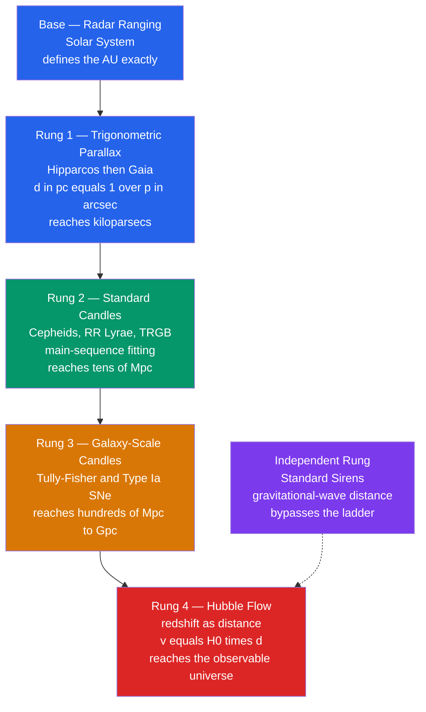

# 📏 The Cosmic Distance Ladder

> [!abstract] TL;DR
> No single tool can measure distances across the whole universe, so astronomers **chain overlapping methods** — each rung calibrated against the one below it. Rung 1 is geometric: radar ranging fixes the astronomical unit, and trigonometric **parallax** gives $d[\mathrm{pc}] = 1/p[\mathrm{arcsec}]$, now reaching across the Galaxy with Gaia. Rung 2 uses **standard candles** of known luminosity — Cepheids obeying the Leavitt period–luminosity law, RR Lyrae, and the tip of the red-giant branch — via the distance modulus. Rung 3 extends to **Type Ia supernovae** and the Tully–Fisher relation, reaching billions of light-years. Rung 4 uses **redshift and Hubble's law**. The ladder yields the Hubble constant $H_0$ — and a persistent **"Hubble tension"** between local and early-universe measurements.

## Intuition — analogy FIRST

Imagine measuring the height of a skyscraper you can't touch. You start with a **ruler** for the lobby, use the ruler to calibrate the length of a **shadow** on the plaza, then use trigonometry on the shadow to estimate the roof — and finally compare against a distant tower whose height you already know. Each step **hands its calibration up** to the next, and any error in a lower step propagates all the way to the top.

The cosmos works the same way. We can bounce radar off Venus (the ruler), use Earth's orbit as a baseline for parallax (the shadow trick), calibrate "standard candle" stars against those parallaxes, and finally read off distances to galaxies billions of light-years away. Every rung **only works because the rung beneath it is trusted** — which is why a small systematic error in the bottom rung can shift our measurement of the entire universe's expansion rate.

---

## How It Works

The ladder is a sequence of methods, each valid over a limited distance range, each **calibrating the next** where their ranges overlap.



---

## Key Concepts / Details

### Secondary Level

**The problem.** Distances in space are too vast for any tape measure, and objects that look faint could be either "small and near" or "bright and far." Astronomers break the deadlock by chaining methods.

**Parallax — the geometric first rung.** As Earth orbits the Sun, a nearby star appears to shift against the distant background. Half of that annual shift is the **parallax angle** $p$. The closer the star, the larger the shift. The parsec is *defined* as the distance at which $1$ AU subtends $1$ arcsecond, giving the deceptively simple law:

$$d[\mathrm{pc}] = \frac{1}{p[\mathrm{arcsec}]}$$

Proxima Centauri has $p \approx 0.769''$, so $d \approx 1.30$ pc $\approx 4.24$ light-years — the nearest star. ($1$ pc $= 3.26$ ly $= 3.086\times10^{16}$ m.)

**Standard candles — a brightness ruler.** If you know a light bulb's true wattage (luminosity $L$), its apparent brightness tells you its distance, because brightness falls off as $1/d^2$. Certain stars are "standard candles" — their luminosity can be inferred from another property. **Cepheid variables** pulse in brightness with a period tied directly to their luminosity: the slower they blink, the brighter they truly are.

**Redshift — the farthest rung.** For distant galaxies, the whole spectrum is stretched to longer (redder) wavelengths by cosmic expansion; more redshift means more distance.

| Rung | Method | Reaches | Basis |
|------|--------|---------|-------|
| Base | Radar ranging | Solar System | Light travel time |
| 1 | Trigonometric parallax | ~kpc (Gaia) | Pure geometry |
| 2 | Cepheids, RR Lyrae, TRGB | ~tens of Mpc | Known luminosity |
| 3 | Tully–Fisher, Type Ia SNe | ~hundreds of Mpc to Gpc | Standardizable luminosity |
| 4 | Redshift / Hubble's law | Observable universe | Cosmic expansion |

### Undergraduate Level

**Fixing the base unit.** Radar ranging — timing a radio pulse bounced off Venus or a planetary probe — measures Solar-System distances directly from the speed of light. This pins the astronomical unit, defined exactly since 2012 as $1\ \mathrm{AU} = 149\,597\,870\,700$ m, providing the baseline for parallax.

**Parallax, precisely.** With a baseline of $1$ AU, geometry gives $\tan p = 1\,\mathrm{AU}/d$, and for tiny angles $d[\mathrm{pc}] = 1/p[\mathrm{arcsec}]$ follows directly ($1\ \mathrm{rad} = 206\,265''$). The revolution has been instrumental:
- **Hipparcos** (1989–93): milliarcsecond precision, reliable distances to a few hundred pc.
- **Gaia** (2013– ): **microarcsecond** ($\mu\mathrm{as}$) parallaxes for over a billion stars, reaching distances of kiloparsecs across much of the Milky Way — a thousandfold leap.

**The distance modulus.** Standard candles convert to distance through the difference between apparent magnitude $m$ and absolute magnitude $M$ (see [[Magnitudes_Luminosity_and_Flux]]):

$$\mu \equiv m - M = 5\log_{10}\!\left(\frac{d}{10\ \mathrm{pc}}\right) = 5\log_{10} d[\mathrm{pc}] - 5$$

**Standard candles of rung 2:**
- **Main-sequence fitting / spectroscopic parallax:** place a cluster's stars on the H–R diagram; the vertical offset to a calibrated main sequence gives $\mu$.
- **Cepheids** obey the **Leavitt period–luminosity (PL) relation** (Henrietta Leavitt, 1912): brighter Cepheids pulse more slowly. An illustrative $V$-band form is $M_V = -2.76\,(\log_{10}P - 1) - 4.22$ ($P$ in days). This is the **workhorse of extragalactic distances**, reaching tens of Mpc.
- **RR Lyrae** stars, older and fainter, have near-constant $M_V \approx 0.6$ — excellent in globular clusters and the Galactic halo.
- **Tip of the red-giant branch (TRGB):** the sharp upper cutoff of the red-giant branch marks the helium flash at a nearly fixed luminosity ($M_I \approx -4.0$) — a robust, low-scatter candle.

**Rung 3 — galaxy-scale indicators:**
- **Tully–Fisher relation** (1977): a spiral galaxy's luminosity correlates with its rotation speed, roughly $L \propto v_{\mathrm{rot}}^4$; the spectral-line width yields $L$, hence distance.
- **Type Ia supernovae:** exploding white dwarfs near the Chandrasekhar mass reach a near-uniform peak, $M_B \approx -19.3$. After the **Phillips relation** correction (brighter events fade more slowly), they become *standardizable* to ~5–7% and shine to **billions of light-years** (see [[Supernovae_and_Gamma_Ray_Bursts]], [[Stellar_Evolution]]).

**Rung 4 — Hubble's law.** Beyond the reach of individual candles, recession velocity tracks distance: $v = H_0\, d$ (see [[The_Expanding_Universe_and_Hubbles_Law]]). Measure a galaxy's redshift, divide by $H_0$, and read off the distance — provided $H_0$ was itself calibrated by the lower rungs.

**Error propagation.** Because rungs multiply, fractional errors **add in quadrature and compound**: a 5% zero-point error in the Cepheid calibration becomes a 5% error in every Type Ia distance and thus directly in $H_0$.

### Graduate Level

**Geometric anchors bypass rung 1's fragility.** Three routes tie the ladder to pure geometry with no candle assumptions:
- **Water megamasers** in the accretion disk of NGC 4258 give a direct geometric distance of $7.58 \pm 0.11$ Mpc, calibrating Cepheids in that galaxy.
- **Detached eclipsing binaries** in the LMC yield $49.59 \pm 0.09_{\rm stat} \pm 0.54_{\rm sys}$ kpc — a ~1% anchor (Pietrzyński et al. 2019).
- **Gaia parallaxes** of Milky Way Cepheids set the PL zero-point directly.

**Zero-point calibration (SH0ES).** The three-step program — geometric anchors → Cepheids → Type Ia SNe — treats the Cepheid PL zero-point as the pivotal free parameter, propagating covariances through a global fit. The result: $H_0 = 73.0 \pm 1.0\ \mathrm{km\,s^{-1}\,Mpc^{-1}}$ (Riess et al. 2022).

**The Hubble tension.** The early-universe value inferred from the CMB assuming $\Lambda$CDM is $H_0 = 67.4 \pm 0.5$ (Planck 2018). The **~5$\sigma$ discrepancy** with the local ladder is one of cosmology's central open problems. A TRGB-based ladder (Freedman et al.) gives an intermediate $\sim 69.8 \pm 1.9$, so the debate hinges partly on Cepheid vs. TRGB systematics: crowding, extinction, and the **metallicity dependence** of the PL relation.

**Standard sirens — a rung off the ladder.** A gravitational-wave inspiral encodes its **luminosity distance directly** in the waveform amplitude, with no need for candles. GW170817's electromagnetic counterpart gave $H_0 = 70^{+12}_{-8}$ (2017). "Bright sirens" (with a redshift from a counterpart) and "dark sirens" (statistical host association) promise a **fully independent** $H_0$ that may adjudicate the tension.

**Statistical vs. systematic errors.** Modern ladders are systematics-limited. Key biases: **Malmquist bias** (magnitude-limited samples preferentially select intrinsically bright objects), PL **metallicity/reddening** terms, and Type Ia **progenitor evolution** with redshift.

```python
import numpy as np

# ---- Rung 1: parallax distance with error propagation ----
# Gaia-style measurement of a nearby star
p_mas   = 2.00      # parallax in milliarcseconds
p_err_mas = 0.02    # 1-sigma uncertainty
p_arcsec     = p_mas    / 1000.0
p_err_arcsec = p_err_mas / 1000.0

d_pc = 1.0 / p_arcsec                       # d[pc] = 1 / p[arcsec]
d_err = p_err_arcsec / p_arcsec**2          # sigma_d = sigma_p / p^2
print(f"Rung 1  Parallax distance: {d_pc:.0f} +/- {d_err:.0f} pc")

# ---- Rung 2: Cepheid period-luminosity -> distance modulus ----
# A Cepheid observed in a distant galaxy
P_days = 30.0       # pulsation period
m_V    = 25.00      # apparent magnitude (extinction-corrected)

# Illustrative V-band Leavitt PL relation (P in days)
M_V = -2.76 * (np.log10(P_days) - 1.0) - 4.22   # absolute magnitude
mu  = m_V - M_V                                  # distance modulus
d_cepheid_pc  = 10.0**((mu + 5.0) / 5.0)         # invert mu = 5 log10(d) - 5
d_cepheid_Mpc = d_cepheid_pc / 1e6

print(f"Rung 2  Cepheid  M_V = {M_V:.2f},  mu = {mu:.2f}")
print(f"        Galaxy distance: {d_cepheid_Mpc:.1f} Mpc "
      f"({d_cepheid_Mpc*3.26:.1f} million light-years)")

# ---- Rung 4: read a rough recession velocity from Hubble's law ----
H0 = 73.0  # km/s/Mpc (local ladder value)
v = H0 * d_cepheid_Mpc
print(f"Rung 4  Implied Hubble-flow velocity: {v:.0f} km/s")
```

Expected output: a parallax distance of $500 \pm 5$ pc, a Cepheid distance modulus $\mu \approx 30.5$ placing the galaxy at $\approx 12.8$ Mpc ($\approx 42$ million light-years), and a Hubble-flow velocity of $\sim 930$ km/s.

---

## Real-World Notes

- **Gaia's harvest:** Gaia's $\mu\mathrm{as}$ parallaxes have re-anchored the entire ladder, sharpening the Cepheid PL zero-point and, paradoxically, *strengthening* the Hubble tension rather than resolving it.
- **HST and JWST Cepheids:** the Hubble Space Telescope resolved individual Cepheids in dozens of SN Ia host galaxies; JWST's infrared imaging now confirms them with far less crowding and dust, so far corroborating the SH0ES calibration.
- **NGC 4258, the golden anchor:** its water-maser geometric distance is the single most important non-parallax calibrator, tying Cepheids to pure geometry.
- **Type Ia and dark energy:** the same standardizable candles that measure $H_0$ revealed cosmic **acceleration** in 1998 (Nobel Prize 2011), the discovery of dark energy.
- **Multi-messenger future:** gravitational-wave standard sirens (see [[Multi_Messenger_Astronomy]]) offer an $H_0$ route with completely different systematics from the photometric ladder.
- **The stakes:** a confirmed tension would signal new physics — early dark energy, evolving dark energy, or a departure from $\Lambda$CDM.

---

## Common Pitfalls

1. **Inverting noisy parallaxes.** $d = 1/p$ is biased when $p$ is uncertain (Lutz–Kelker bias); for faint Gaia stars one must work in parallax space or use a distance prior, never naively invert.
2. **Forgetting extinction.** Interstellar dust dims and reddens sources, inflating $m$ and hence the inferred distance. Every rung using magnitudes must correct for extinction, ideally with reddening-free (Wesenheit) magnitudes.
3. **Confusing Population I and II candles.** Classical Cepheids (young, metal-rich) and Type II Cepheids/RR Lyrae (old, metal-poor) obey *different* PL relations; mixing them corrupts the calibration.
4. **Ignoring the metallicity term.** The Cepheid PL zero-point depends on chemical composition; neglecting it introduces galaxy-to-galaxy systematics that dominate the modern $H_0$ error budget.
5. **Using Hubble's law too close.** For nearby galaxies, **peculiar velocities** (local gravitational motions) are comparable to the Hubble flow, so $v = H_0 d$ gives poor distances below ~10–20 Mpc.
6. **Treating $H_0$ tension as a single bad measurement.** It persists across many independent teams, anchors, and candles — the burden is now on systematics or new physics, not on any one dataset.

---

## Related Concepts

- [[_MOC_Observational_Astronomy|↑ Section MOC]]
- [[The_Celestial_Sphere_and_Coordinates]] — the coordinate framework in which parallax shifts are measured
- [[Telescopes_and_Detectors]] — the instruments delivering the astrometry and photometry every rung depends on
- [[Light_and_Astronomical_Spectroscopy]] — redshifts for rung 4 come from spectroscopy
- [[Magnitudes_Luminosity_and_Flux]] — the distance modulus and inverse-square law that convert candle brightness to distance
- [[Multi_Messenger_Astronomy]] — gravitational-wave standard sirens as a rung independent of the ladder
- [[The_Expanding_Universe_and_Hubbles_Law]] — rung 4 and the $H_0$ measurement the whole ladder targets
- [[Supernovae_and_Gamma_Ray_Bursts]] — Type Ia supernovae, the top-rung standardizable candle
- [[Stellar_Evolution]] — why Cepheids pulse and why white dwarfs detonate as Type Ia events
- [[_MOC_Mathematics_Master]] — logarithms, error propagation, and regression underlie every calibration

---

## Review Questions

1. **Secondary:** A star has a measured parallax of $0.05''$. How far away is it in parsecs and in light-years? If a second star is four times more distant, what parallax would you measure?
2. **Undergraduate:** A Cepheid with period $20$ days is observed at apparent magnitude $m_V = 24.0$ (extinction-corrected) in galaxy X. Using $M_V = -2.76(\log_{10}P - 1) - 4.22$, compute its absolute magnitude, distance modulus, and distance in Mpc. Why can this method not be used at $z \approx 1$?
3. **Graduate:** Explain how a systematic error in the Cepheid period–luminosity zero-point propagates to the inferred value of $H_0$, and why geometric anchors (masers, detached eclipsing binaries, Gaia parallaxes) are essential. How could standard sirens break the resulting degeneracy and inform the Hubble tension?

---

## Sources

- Riess, A. G. et al. (2022) — "A Comprehensive Measurement of the Local Value of the Hubble Constant" (SH0ES), *ApJL* 934, L7
- Freedman, W. L. et al. (2001) — HST Key Project on the Extragalactic Distance Scale, *ApJ* 553, 47
- Pietrzyński, G. et al. (2019) — "A distance to the LMC accurate to one per cent," *Nature* 567, 200
- Planck Collaboration (2020) — *Planck 2018 results. VI. Cosmological parameters*, *A&A* 641, A6
- LIGO/Virgo & partners (2017) — "A gravitational-wave standard siren measurement of the Hubble constant," *Nature* 551, 85
- Leavitt, H. S. & Pickering, E. C. (1912) — Periods of 25 variable stars in the Small Magellanic Cloud, *Harvard Circ.* 173

#astronomy #observational-astronomy #distance-ladder #parallax #standard-candles #cepheids #supernovae #hubble-constant #secondary #undergraduate #graduate
