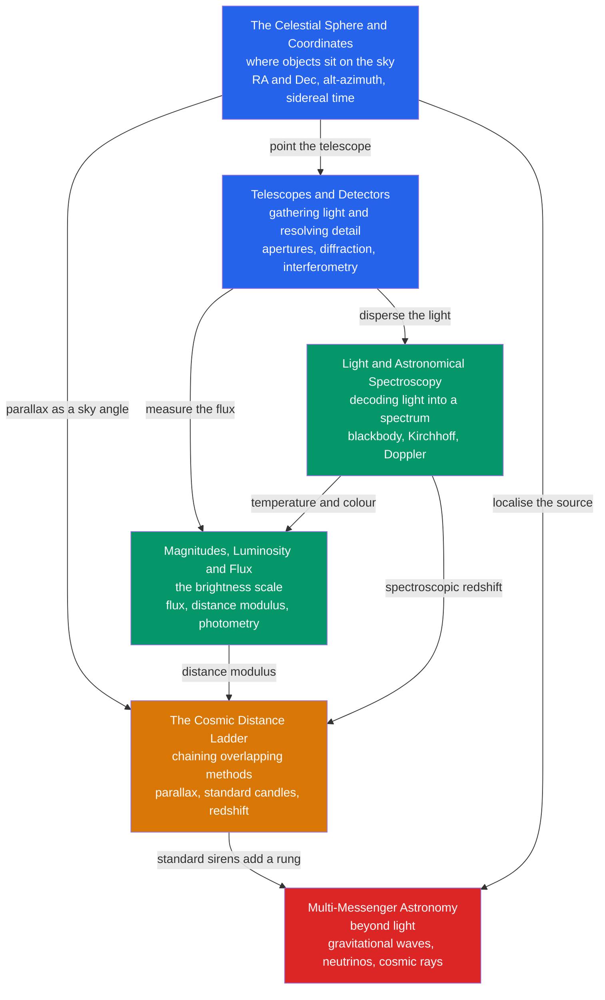

# 🔭 Observational Astronomy — Map of Content

> [!abstract] What This Section Covers
> Observational astronomy is the craft of turning faint light — and now other cosmic messengers — into physical knowledge. This section builds the toolkit end to end: first *where* things are, with the celestial sphere and its coordinate systems; then *how we collect and sharpen* their light, through telescope optics, detectors, and interferometry; then *how we decode* that light, spreading it into spectra that reveal temperature, composition, and motion; then *how bright* things really are, on the ancient logarithmic magnitude scale that ties flux to luminosity; then *how far* they lie, by chaining the rungs of the cosmic distance ladder; and finally *beyond light altogether*, adding gravitational waves, neutrinos, and cosmic rays in the new era of multi-messenger astronomy. Every note opens at secondary level with an everyday analogy and deepens to graduate-level formalism and current research frontiers.

## Concept Map

*(Blue = the observing framework, green = decoding the light, orange = measuring distance, red = the multi-messenger frontier; arrows read "feeds into" or "enables".)*

## Learning Path

*Recommended order for a first pass through this section:*

1. [[The_Celestial_Sphere_and_Coordinates]] — the coordinate framework that tells you *where* to point before anything else.
2. [[Telescopes_and_Detectors]] — how apertures gather and resolve light, and how interferometry beats the single-dish limit.
3. [[Light_and_Astronomical_Spectroscopy]] — spreading light into a spectrum to read temperature, composition, and velocity.
4. [[Magnitudes_Luminosity_and_Flux]] — the inverse-square law and the magnitude scale that convert measured flux into intrinsic brightness.
5. [[The_Cosmic_Distance_Ladder]] — chaining parallax, standard candles, and redshift to measure distances across the universe.
6. [[Multi_Messenger_Astronomy]] — adding gravitational waves, neutrinos, and cosmic rays to witness events light cannot fully show.

## All Notes in This Section

| Note | Core Idea | Difficulty |
|------|-----------|------------|
| [[The_Celestial_Sphere_and_Coordinates]] | The sky as a projected sphere; equatorial vs horizontal coordinates, sidereal time, and precession fix where and when objects appear. | Secondary → Graduate |
| [[Telescopes_and_Detectors]] | Aperture sets light grasp and diffraction-limited resolution; atmospheric windows, adaptive optics, CCDs, and radio interferometry beat the limits. | Secondary → Graduate |
| [[Light_and_Astronomical_Spectroscopy]] | Blackbody continua give temperature while spectral lines encode composition, velocity, and more, via Wien, Stefan–Boltzmann, Kirchhoff, Doppler, and Saha. | Secondary → Graduate |
| [[Magnitudes_Luminosity_and_Flux]] | Luminosity, flux, and the inverted logarithmic magnitude scale; apparent vs absolute magnitude and the distance modulus. | Secondary → Graduate |
| [[The_Cosmic_Distance_Ladder]] | Overlapping rungs — radar, parallax, standard candles, Type Ia SNe, Hubble's law — measure cosmic distances and expose the Hubble tension. | Secondary → Graduate |
| [[Multi_Messenger_Astronomy]] | Light joined by gravitational waves, neutrinos, and cosmic rays; landmark events GW170817 and TXS 0506+056, and standard-siren cosmology. | Secondary → Graduate |

## Key Questions This Section Answers

- How do astronomers describe where an object is on the sky so that anyone, anywhere, at any time can find it again?
- Why is aperture, not magnification, what really matters — and how does interferometry resolve a black-hole shadow?
- What can a single spectrum tell you about a star's temperature, chemistry, motion, and even its magnetic field?
- Why is the brightest-looking star not the most luminous, and how does the distance modulus turn brightness into distance?
- How do we bootstrap our way from radar ranging in the Solar System out to the redshifts of distant galaxies — and why do local and early-universe measurements of $H_0$ disagree?
- What do gravitational waves and neutrinos reveal about violent events that light alone cannot?

## Related Sections

- [[_MOC_Astronomy_Master|↑ Astronomy Master MOC]]
- [[_MOC_Solar_System|→ The Solar System]] — the coordinates, orbits, and detection methods that locate and characterise planets
- [[_MOC_Stellar_Astrophysics|→ Stellar Astrophysics]] — spectral classes and magnitudes feed straight into the HR diagram and stellar physics
- [[_MOC_Cosmology|→ Cosmology]] — the distance ladder and redshift underpin Hubble's law and the expanding universe
- [[_MOC_High_Energy_Astrophysics|→ High-Energy Astrophysics]] — gravitational waves, neutrinos, and cosmic rays as probes of the extreme universe

#MOC #Astronomy #Observational
