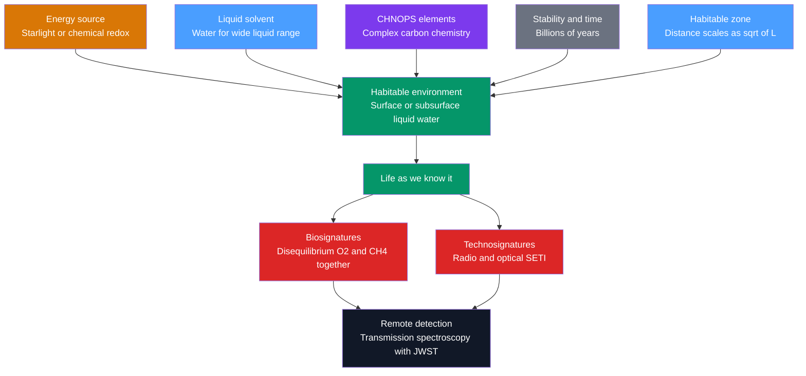

# 🧬 Astrobiology and Habitability

> [!abstract] TL;DR
> **Astrobiology** asks whether, where, and how life arises beyond Earth. *Life as we know it* needs four things: an **energy** source (starlight or chemical redox), a **liquid solvent** (water, prized for its wide liquid range and polarity), the **CHNOPS** elements assembled into complex carbon chemistry, and **stability over time**. The **circumstellar habitable zone** is the shell of orbital distances where a planet could keep *surface* liquid water; its boundaries scale as $d \propto \sqrt{L_\star}$ and are set by the greenhouse effect. But "Goldilocks" is too narrow: **extremophiles** and tidally heated **ocean worlds** (Europa, Enceladus) show habitability can hide underground far outside the classical zone. We hunt for life via **biosignatures** — chemical disequilibrium like $\mathrm{O_2}$ and $\mathrm{CH_4}$ coexisting — read from exoplanet atmospheres with **transmission spectroscopy** (JWST), and for **technosignatures** via SETI. The **Drake equation** frames how many civilizations might exist; the **Fermi paradox** asks why, if the number is large, we see no one.

## Intuition — analogy FIRST

Think of baby bears and porridge. Papa Bear's is too hot, Mama Bear's too cold, Baby Bear's is *just right*. A planet is the porridge and the star is the stove: too close and the oceans boil away, too far and they freeze solid. Somewhere in between is a band — the **habitable zone** — where a bowl of water stays liquid. Move the stove up in power (a brighter star) and the "just right" band slides outward.

But the fairy tale misleads in one way: it only checks the *surface*. A thermos of soup buried in a snowbank stays warm from its own heat, not the room's. Moons like Europa keep buried oceans liquid using **tidal heating** — Jupiter's gravity kneads them like a squeezed rubber ball — even though they sit far outside any starlit "just right" band. Life, it turns out, may not need to sit at the table at all.

---

## How It Works



### Secondary Level

**The four requirements for life as we know it.**

1. **Energy.** Either *photons* (photosynthesis harvests sunlight) or *chemistry* (chemosynthesis harvests redox gradients, e.g. hydrogen + carbon dioxide at hot vents). Life is fundamentally a process that runs on an energy flow.
2. **A liquid solvent.** Water is the reference solvent: it stays liquid across a wide temperature range, is a superb polar solvent for the ions and molecules of metabolism, and its chemistry underlies pH and acid–base balance (see [[Acids_Bases_and_pH]]).
3. **The right elements.** Life is built from **CHNOPS** — carbon, hydrogen, nitrogen, oxygen, phosphorus, sulfur — assembled into the four families of biomolecules (see [[Biomolecules_Overview]]). Carbon's four bonds make it the master architect of complex molecules.
4. **Stability and time.** Environments must persist long enough — hundreds of millions to billions of years — for chemistry to become biology and for biology to evolve.

**The habitable ("Goldilocks") zone** is the range of distances from a star where a rocky planet could hold liquid water on its surface. Too close and water evaporates (Venus); too far and it freezes (Mars). Brighter stars push the zone outward; dimmer stars pull it inward.

| Planet | Distance | Status |
|--------|----------|--------|
| Venus | $0.72$ AU | Too hot — runaway greenhouse, surface $\sim 460^\circ$C |
| **Earth** | $1.00$ AU | **In the zone** — surface oceans |
| Mars | $1.52$ AU | Near the cold edge — liquid water only in the distant past |

### Undergraduate Level

**Where the zone comes from.** A planet's equilibrium temperature balances absorbed starlight against thermal re-radiation:

$$T_{eq} = \left[\frac{L_\star\,(1-A)}{16\pi\,\sigma\,d^2}\right]^{1/4}$$

where $L_\star$ is stellar luminosity, $A$ the albedo, $\sigma$ the Stefan–Boltzmann constant, and $d$ the orbital distance. Holding the temperature needed for liquid water fixed, $d^2 \propto L_\star$, so the habitable-zone boundaries scale as

$$d_{HZ} \propto \sqrt{L_\star}.$$

Real boundaries are set not by $T_{eq}$ alone but by the **greenhouse effect** and its runaway limits. The **inner edge** is the *runaway greenhouse*: rising temperature evaporates more water vapor (a greenhouse gas), which traps more heat — a feedback that boils the oceans. The **outer edge** is the *maximum greenhouse*: even a thick $\mathrm{CO_2}$ blanket eventually cannot offset the weak sunlight, and the surface freezes. Kasting et al. (1993) placed the conservative zone at roughly $0.95$–$1.37$ AU for the Sun; later work (Kopparapu et al. 2013) shifts it slightly to $\sim 0.99$–$1.70$ AU.

**Extremophiles rewrite the limits.** Earth life thrives far outside "temperate":

| Extremophile | Extreme tolerated | Lesson |
|--------------|-------------------|--------|
| Thermophiles (vent microbes) | $>100^\circ$C, no sunlight | Chemosynthesis frees life from starlight |
| Acidophiles | $\mathrm{pH}\sim 0$ | Life brackets a huge chemical range (see [[Acids_Bases_and_pH]]) |
| *Deinococcus radiodurans* | Massive radiation doses | DNA repair enables survival off-world |
| Halophiles / psychrophiles | Brines, sub-freezing | Salty subsurface liquids may host life |

What early Earth teaches: microbial life was present by $\sim 3.5$–$3.8$ Gyr ago, remarkably soon after the surface cooled, hinting that life's *origin* may be fast once conditions allow (see [[Earths_History_Hadean_to_Phanerozoic]]).

**Where to look in the Solar System.**
- **Mars** — dry riverbeds, deltas, and hydrated minerals record *past* surface water; the search is for extinct or deep-subsurface life.
- **Europa & Enceladus** — icy moons with **subsurface oceans** kept liquid by **tidal heating**; Enceladus vents plumes containing water, salts, and organic molecules straight into space (see [[Giant_Planets_and_Their_Moons]]).
- **Titan** — Saturn's moon runs an *exotic* chemistry: liquid methane/ethane lakes and a rich organic haze — a testbed for whether life could use a non-water solvent.

**Biosignatures.** A single gas rarely proves life, but a **chemical disequilibrium** does: oxygen and methane react quickly, so their *coexistence* in Earth's atmosphere demands continuous biological resupply. Detecting such disequilibrium in an exoplanet atmosphere is a strong biosignature. **Transmission spectroscopy** reads it: as a planet transits, a sliver of starlight filters through its atmosphere and imprints molecular absorption lines, which **JWST** now resolves for favorable worlds (see [[Exoplanets_and_Detection_Methods]]).

### Graduate Level

**The continuously habitable zone (CHZ).** Stars brighten as they age — the Sun is $\sim 30\%$ more luminous now than at birth (the "faint young Sun"). Because $d_{HZ}\propto\sqrt{L_\star}$, the zone migrates *outward* over gigayears. A planet is only *continuously* habitable if it stays inside the moving band long enough for complex life; Earth persists thanks to the **carbonate–silicate cycle**, a slow negative feedback that regulates $\mathrm{CO_2}$ and buffers the greenhouse.

**M dwarfs and tidal locking.** Low-mass **M dwarfs** are the galaxy's most common stars, and their faintness places the habitable zone very close in ($\lesssim 0.1$ AU). At such distances tidal torques drive the planet toward **synchronous rotation** (tidal locking) on a timescale

$$\tau_{lock} \sim \frac{\omega\, a^6\, I\, Q}{3\,G\,M_\star^2\,k_2\,R^5},$$

so one hemisphere bakes while the other freezes — though thick atmospheres or oceans can redistribute heat. M dwarfs also flare violently and emit hard UV/X-rays that can strip atmospheres, complicating their habitability despite abundant targets (TRAPPIST-1, Proxima b).

**The Drake equation** frames the number of communicative civilizations in the Galaxy:

$$N = R_\star \cdot f_p \cdot n_e \cdot f_l \cdot f_i \cdot f_c \cdot L$$

The astronomical terms ($R_\star$, $f_p$, $n_e$) are increasingly constrained by exoplanet surveys, but the *biological and sociological* terms ($f_l$, $f_i$, $f_c$, $L$) span many orders of magnitude and are essentially unknown — so $N$ is uncertain by factors of $10^{10}$ or more. The equation is best read as a **structured statement of our ignorance**, not a prediction.

**The Fermi paradox and anthropics.** If $N$ is large and the Galaxy is $\sim 10^{10}$ yr old, technological life should have spread everywhere — yet we observe silence ("Where is everybody?"). Proposed resolutions include a **Great Filter** (some step from chemistry to lasting civilization is astronomically improbable), rare-Earth arguments, short civilization lifetimes ($L$ small), or observational/temporal selection. **Anthropic** reasoning warns that our own existence conditions any inference: we necessarily find ourselves on a habitable world that produced observers, which biases naive estimates of $f_l$ and $f_i$.

```python
# Habitable-zone edges vs stellar luminosity, plus a Drake-equation range.
# HZ boundaries scale as d = sqrt( (L/Lsun) / S_eff ) AU, where S_eff is the
# stellar flux threshold in units of the solar constant.
# Runaway greenhouse (inner) S_in ~ 1.1 ; maximum greenhouse (outer) S_out ~ 0.53.
import numpy as np

S_in, S_out = 1.10, 0.53  # flux thresholds (solar-flux units) -> Sun gives 0.95-1.37 AU

def hz_edges(L_over_Lsun):
    d_in  = np.sqrt(L_over_Lsun / S_in)
    d_out = np.sqrt(L_over_Lsun / S_out)
    return d_in, d_out

for name, L in [("M dwarf", 0.02), ("Sun", 1.0), ("F star", 3.0)]:
    din, dout = hz_edges(L)
    print(f"{name:8s} L={L:5.2f} Lsun  ->  HZ = {din:5.2f} to {dout:5.2f} AU")

# Place solar-system planets against the Sun's zone
din, dout = hz_edges(1.0)
for planet, d in [("Venus", 0.72), ("Earth", 1.00), ("Mars", 1.52)]:
    inside = "IN zone" if din <= d <= dout else "outside"
    print(f"  {planet:5s} at {d:.2f} AU -> {inside}")

# Drake equation: low vs high estimates show the vast uncertainty in N
def drake(R, fp, ne, fl, fi, fc, L):
    return R * fp * ne * fl * fi * fc * L

low  = drake(1.5, 1.0, 0.1, 1e-3, 1e-3, 0.1, 1e2)   # pessimistic
high = drake(3.0, 1.0, 1.0, 1.0,  1.0,  1.0, 1e9)   # optimistic
print(f"\nDrake N: {low:.2e}  (pessimistic)  ...  {high:.2e}  (optimistic)")
# The two estimates differ by ~14 orders of magnitude -- N is dominated by
# the unknown biological/sociological factors, not the astronomical ones.
```

---

## Real-World Notes

- **Enceladus plumes carry the lab to us.** Cassini flew *through* Enceladus's south-polar jets and detected water, salts, molecular hydrogen, and complex organics — direct evidence of a habitable subsurface ocean with active chemistry.
- **JWST is reading atmospheres now.** JWST transmission spectra have detected $\mathrm{CO_2}$, water, and methane on exoplanets, and probed the temperate TRAPPIST-1 worlds — the first genuine hunt for biosignatures on rocky planets.
- **"Follow the water" drives Mars exploration.** Perseverance caches samples from Jezero Crater's ancient river delta for a future return mission to test for biosignatures in rocks laid down when Mars was wet.
- **Hydrothermal vents rewrote the origin story.** The 1977 discovery of chemosynthetic ecosystems at deep-sea vents showed whole food webs can run with no sunlight — a template for icy-moon oceans.
- **The Wow! signal and modern SETI.** A single strong 1977 narrowband radio burst was never repeated; today Breakthrough Listen scans billions of radio channels and optical SETI hunts for laser pulses as technosignatures.
- **Biosignature caution: false positives.** Abiotic oxygen can build up (photolysis of water, escape of hydrogen), so context — planetary mass, star type, other gases — is essential before calling any single gas "life."

---

## Common Pitfalls

1. **Equating "habitable zone" with "inhabited."** The zone marks where surface liquid water is *possible* for a rocky planet with an atmosphere — not a guarantee of oceans, and certainly not of life. Venus sits at the inner edge yet is hellish.
2. **Forgetting subsurface oceans.** The classical zone only checks *surface* water. Tidally heated moons (Europa, Enceladus) host oceans far outside it — the "Goldilocks" picture badly undercounts habitable real estate.
3. **Assuming life needs water and carbon by necessity.** These define life *as we know it*; Titan's methane chemistry tests whether alternatives exist. We reason from one example (a sample size of one), a deep statistical limitation.
4. **Treating a single biosignature gas as proof.** Oxygen or methane alone can be abiotic. The signal is *disequilibrium* — reactive gases coexisting — plus planetary context, not any lone molecule.
5. **Reading the Drake equation as a prediction.** It multiplies well-known astronomical factors by wildly unknown biological ones; the output spans $\gtrsim 10$ orders of magnitude and encodes ignorance, not knowledge.
6. **Ignoring anthropic and selection bias.** We necessarily observe from a life-bearing planet late enough to host observers, which skews naive inferences about how common life and intelligence are.

---

## Related Concepts

- [[_MOC_Solar_System|↑ Section MOC]]
- [[Formation_of_the_Solar_System]] — where in the disk the ingredients and stable environments for life arise
- [[Terrestrial_Planets]] — the rocky worlds (Venus, Earth, Mars) that bracket the inner solar system's habitability
- [[Giant_Planets_and_Their_Moons]] — Europa, Enceladus, and Titan: tidally heated ocean worlds and exotic chemistry
- [[Small_Bodies_Asteroids_Comets_and_KBOs]] — comets as delivery vehicles for water and organics to early planets
- [[Exoplanets_and_Detection_Methods]] — transits and spectroscopy that let us measure other worlds and read their atmospheres
- [[Orbital_Mechanics_and_Celestial_Dynamics]] — tidal heating and tidal locking that govern moon and M-dwarf-planet habitability
- **Chemistry** — [[Biomolecules_Overview]] (the CHNOPS molecules of life); [[Acids_Bases_and_pH]] (water as solvent and the pH range life tolerates)
- **Earth Science** — [[Earths_History_Hadean_to_Phanerozoic]] (how and when life first appeared on Earth)
- **Mathematics** — [[_MOC_Mathematics_Master]] (probability and estimation behind the Drake equation)

---

## Review Questions

1. **Secondary**: List the four requirements for life as we know it, and explain why Earth is in the Sun's habitable zone while Venus and Mars are not.
2. **Undergraduate**: Starting from the equilibrium-temperature balance, show that habitable-zone distance scales as $\sqrt{L_\star}$. Then explain why the *actual* inner and outer edges are set by greenhouse feedbacks (runaway and maximum greenhouse) rather than by $T_{eq}$ alone.
3. **Graduate**: Write out the Drake equation and classify each factor as astronomical or biological/sociological. Discuss how the habitable zone shifts over a star's main-sequence lifetime, why tidal locking complicates M-dwarf habitability, and how anthropic selection biases estimates of $f_l$ and $f_i$.

---

## Sources

- Kasting, Whitmire & Reynolds (1993) — "Habitable Zones around Main Sequence Stars," *Icarus* 101, 108
- Kopparapu et al. (2013) — "Habitable Zones around Main-Sequence Stars: New Estimates," *ApJ* 765, 131
- Catling & Kasting — *Atmospheric Evolution on Inhabited and Lifeless Worlds* (2017)
- Des Marais et al. (2002) — "Remote Sensing of Planetary Biosignatures," *Astrobiology* 2, 153
- Drake, F. (1961) — Green Bank meeting / Drake equation formulation
- NASA Astrobiology Strategy (2015); Cassini INMS/CDA Enceladus results (Waite et al. 2017, *Science* 356, 155)

#astronomy #astrobiology #habitable-zone #biosignatures #extremophiles #ocean-worlds #drake-equation #fermi-paradox #SETI #secondary #undergraduate #graduate
