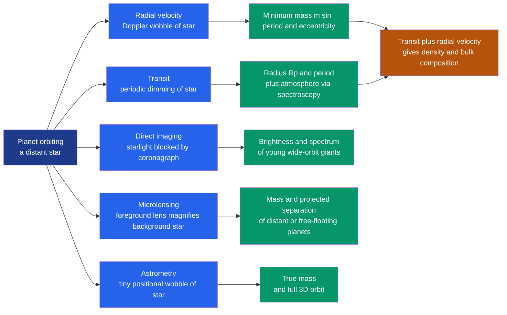

# 🔭 Exoplanets and Detection Methods

> [!abstract] TL;DR
> An **exoplanet** is a planet orbiting a star other than the Sun. Because a star outshines its planets by factors of $10^6$–$10^{10}$, we almost never see the planet directly — we infer it from its effect on the star's light. Five methods dominate: **radial velocity** measures the star's Doppler wobble and yields a minimum mass $m_p\sin i$; **transits** measure the fractional dimming $(R_p/R_\star)^2$ and yield the radius plus, via spectroscopy, the atmosphere; **direct imaging** blocks starlight to photograph young wide-orbit giants; **microlensing** catches distant and free-floating planets by transient magnification; and **astrometry** tracks the star's positional wobble. Combining a transit radius with a radial-velocity mass gives the **density**, hence bulk composition. Since 51 Pegasi b (1995), surveys like Kepler and TESS have found that planets are ubiquitous and astonishingly diverse — a discovery that rewrote planet-formation theory.

## Intuition — analogy FIRST

Imagine a moth fluttering around a distant searchlight. You will never see the moth: its glow is a billionth of the lamp's. But you have tricks. Watch the beam dim by a hair each time the moth crosses in front of it — that is a **transit**. Notice the lamp rock gently back and forth as the moth's tiny gravity tugs it — that is the **radial-velocity wobble**. Mask the blinding lamp with your thumb and catch the moth's own faint glimmer — that is **direct imaging**.

Exoplanet hunting is exactly this problem at cosmic scale. The star is overwhelmingly bright, so nearly every technique reads the *star's* light for a tell-tale fingerprint of an unseen companion, rather than collecting the planet's own photons. Each trick is sensitive to a different kind of planet — which is why the picture of what worlds exist depends heavily on *how* we look.

---

## How It Works



The two workhorses — radial velocity and transits — are complementary: one gives mass, the other gives radius. A planet detected by *both* is the gold standard, because mass and radius together reveal what it is made of.

---

## Key Concepts / Details

### Secondary Level

**What is an exoplanet?** A planet orbiting a star other than the Sun. The first confirmed planet around a Sun-like star was **51 Pegasi b** in 1995 (Mayor & Queloz, Nobel Prize 2019). Today more than **5,700** are confirmed, and statistics imply *on average more than one planet per star* in the Galaxy.

**Transits — the dimming trick.** When a planet passes in front of its star, it blocks a small slice of light. The fractional drop in brightness equals the ratio of the areas — the **transit depth**:

$$\delta = \left(\frac{R_p}{R_\star}\right)^2$$

- A Jupiter ($R_p \approx 0.10\,R_\star$) crossing a Sun-like star dims it by $\approx 1\%$ ($\sim$10,000 ppm).
- An Earth ($R_p \approx 0.009\,R_\star$) dims it by only $\approx 0.008\%$ ($\sim$84 ppm) — tiny, which is why space telescopes are needed.

**Radial velocity — the wobble trick.** A planet and its star both orbit their common centre of mass, so the star traces a small circle. As it swings toward and away from us, its spectral lines shift blue then red (the Doppler effect). Bigger, closer planets tug harder and are easiest to detect.

**The habitable zone.** The band of orbital distances where a planet's temperature allows *liquid water* on its surface. It sits farther out for bright stars and closer in for dim ones — the search for a truly Earth-like world targets rocky planets in this zone.

### Undergraduate Level

**Radial-velocity semi-amplitude.** The stellar reflex speed traces out a periodic curve of amplitude

$$K=\left(\dfrac{2\pi G}{P}\right)^{1/3}\dfrac{m_p\sin i}{(M_\star+m_p)^{2/3}\sqrt{1-e^2}}$$

Because only the line-of-sight velocity is observed, RV yields the **minimum mass** $m_p\sin i$, not the true mass — the *inclination degeneracy*. Numerically: Jupiter makes the Sun wobble by $K\approx 12.5\ \mathrm{m/s}$ over 11.9 yr; Earth by only $K\approx 0.09\ \mathrm{m/s}$; the hot Jupiter 51 Peg b induces $K\approx 56\ \mathrm{m/s}$ in 4.23 days. Relies on precision spectroscopy — see [[Light_and_Astronomical_Spectroscopy]].

**Transit geometry.** A transit is seen only if the orbit is nearly edge-on. The geometric probability is $p_{tr}\approx R_\star/a$ — about $0.5\%$ for Earth at 1 AU but $\sim$10% for a hot Jupiter at 0.05 AU. A central transit lasts roughly $T_{dur}\approx \dfrac{P\,R_\star}{\pi a}$, and the light-curve shape fixes the inclination $i$. Because a transit forces $i\approx 90^\circ$, it *breaks* the RV degeneracy: combining the two gives the true mass and radius, hence

$$\rho_p=\frac{m_p}{\tfrac{4}{3}\pi R_p^3}$$

which distinguishes a rocky world from a gas giant or a water world.

**Comparison of methods.**

| Method | Observable | Yields | Biased toward |
|---|---|---|---|
| Radial velocity | Doppler shift $\Delta\lambda/\lambda = v/c$ | $m_p\sin i,\ P,\ e$ | Massive, close-in |
| Transit | Flux dip $(R_p/R_\star)^2$ | $R_p,\ P,\ i$, atmosphere | Large, close-in, aligned |
| Direct imaging | Resolved photons | Luminosity, spectrum, wide orbit | Young, hot, massive, wide |
| Microlensing | Transient magnification | $m_p$, projected separation | Distant, near snow line, free-floating |
| Astrometry | Positional wobble $\alpha=\tfrac{m_p}{M_\star}\tfrac{a}{d}$ | True mass, full 3D orbit | Massive, wide, nearby |

**Direct imaging** needs a coronagraph or starshade to suppress the star by $10^{6}$–$10^{10}$; it works best in the infrared for *young, self-luminous* giants (e.g. the four planets of HR 8799). The achievable contrast is set by the telescope's diffraction limit — see [[Interference_and_Diffraction]].

**Demographics and surprises.** The first finds were **hot Jupiters** — gas giants on days-long orbits, unlike anything in the Solar System. Kepler then revealed that the *most common* planets are **super-Earths and sub-Neptunes** (1–4 $R_\oplus$), with a striking scarcity near $1.5$–$2\,R_\oplus$ called the **radius gap**. This diversity — and giants where they "shouldn't" form — forced formation theory to embrace planetary migration (see [[Formation_of_the_Solar_System]]).

### Graduate Level

**The $m\sin i$ mass function.** For a large RV sample with random orientations, inclinations are distributed isotropically, so $\langle\sin i\rangle=\pi/4\approx 0.785$. The observed $m_p\sin i$ distribution is the *true* mass function convolved with the $\sin i$ kernel; deprojecting it (an Abel-type deconvolution) recovers the intrinsic mass distribution statistically, even though any *individual* mass stays a lower bound.

**Transit-timing variations (TTVs).** In a multi-planet system, mutual gravitational perturbations make transits arrive minutes early or late on a periodic cycle. Modelling the TTV pattern yields planet **masses without any RV data** — the technique that weighed the seven planets of TRAPPIST-1 and confirmed Kepler-9. TTVs are most powerful near mean-motion resonances, where perturbations pile up coherently.

**Transmission and emission spectroscopy.** During transit, starlight filtering through the planet's limb imprints atmospheric absorption; the signal scales with the atmospheric **scale height** $H = k_B T/(\mu g)$, giving an extra transit depth of order $\sim 2 R_p H / R_\star^2$ per scale height. Emission spectroscopy (measuring the planet's own thermal glow at secondary eclipse) constrains temperature structure. Atmospheric **retrieval** — Bayesian fitting of radiative-transfer models — extracts abundances of $\mathrm{H_2O}$, $\mathrm{CO}$, $\mathrm{CO_2}$, $\mathrm{CH_4}$ and clouds; JWST has now detected several of these.

**Origin of the radius gap.** The valley at $\sim 1.8\,R_\oplus$ likely marks the divide between bare rocky cores and cores that retained a few-percent H/He envelope. Two mechanisms compete: **photoevaporation** (XUV-driven escape over $\sim$100 Myr) and **core-powered mass loss** (the cooling luminosity of the core itself). Both predict a gap whose location shifts with orbital distance and stellar type — a live test bed for the physics of atmospheric escape.

```python
import numpy as np

# --- Constants (SI) ---
G       = 6.674e-11        # gravitational constant
M_sun   = 1.989e30         # kg
R_sun   = 6.957e8          # m
M_jup   = 1.898e27         # kg
R_jup   = 6.9911e7         # m
M_earth = 5.972e24         # kg
R_earth = 6.371e6          # m
day     = 86400.0
year    = 365.25 * day

# --- 1. Transit depth = (Rp / R_star)^2, in parts per million ---
def transit_depth_ppm(Rp, Rstar):
    return (Rp / Rstar) ** 2 * 1e6

print("Transit depth across a Sun-like star:")
print(f"  Jupiter: {transit_depth_ppm(R_jup, R_sun):8.0f} ppm  (~1 %)")
print(f"  Earth:   {transit_depth_ppm(R_earth, R_sun):8.0f} ppm  (~0.008 %)")

# --- 2. Radial-velocity semi-amplitude K (m/s), edge-on (i = 90 deg) ---
def rv_semi_amplitude(P, m_p, M_star, e=0.0, sin_i=1.0):
    """P in seconds, masses in kg -> K in m/s."""
    return (2 * np.pi * G / P) ** (1 / 3) * (m_p * sin_i) \
           / (M_star + m_p) ** (2 / 3) / np.sqrt(1 - e ** 2)

print("\nStellar reflex velocity K (edge-on):")
print(f"  Jupiter @ 11.86 yr : {rv_semi_amplitude(11.86 * year, M_jup,   M_sun):6.2f} m/s")
print(f"  Earth   @  1.00 yr : {rv_semi_amplitude(1.00 * year,  M_earth, M_sun):6.2f} m/s")
# 51 Pegasi b: hot Jupiter, P = 4.23 d, m sin i = 0.47 M_jup, M_star = 1.11 M_sun
print(f"  51 Peg b (hot J)   : {rv_semi_amplitude(4.23 * day, 0.47 * M_jup, 1.11 * M_sun):6.2f} m/s")

# Why big, close-in planets are easiest: depth ~ Rp^2 and K ~ m_p / P^(1/3)
```

---

## Real-World Notes

- **51 Pegasi b (1995)** — the first planet found around a Sun-like star, a hot Jupiter detected by radial velocity; its 4-day orbit was so unexpected it launched the field and earned the 2019 Nobel Prize.
- **Kepler (2009–2018)** — stared at one patch of sky and found >2,700 transiting planets, revealing that super-Earths and sub-Neptunes are the Galaxy's most common worlds and uncovering the radius gap (Fulton et al. 2017).
- **TESS (2018–present)** — an all-sky transit survey targeting *bright, nearby* stars, chosen so that radial-velocity and JWST follow-up can measure masses and atmospheres.
- **JWST** — transmission and emission spectroscopy have detected $\mathrm{CO_2}$ (WASP-39b, 2022), water, and other molecules, opening quantitative exoplanet atmospheric chemistry.
- **HR 8799** — a system of four giant planets *directly imaged* in the infrared, a rare case of seeing the planets themselves.
- **Gaia** — its microarcsecond astrometry is expected to reveal thousands of giant planets from their stars' positional wobble, complementing the close-in bias of transits and RV.

---

## Common Pitfalls

1. **Treating $m_p\sin i$ as the mass.** Radial velocity gives only a *minimum* mass; the true mass is unknown until a transit ($i\approx 90^\circ$) or astrometry pins the inclination. A face-on system can hide a massive planet behind a tiny RV signal.
2. **Stellar activity masquerading as a planet.** Starspots, granulation, and magnetic cycles produce RV "jitter" and periodic photometric signals that have mimicked — and led to the retraction of — claimed planets. Activity indicators and multi-wavelength checks are essential.
3. **Confusing catalog abundance with true abundance.** Hot Jupiters dominate early catalogs yet orbit only $\sim$1% of stars; every method has selection effects, so the raw detection census is *not* the true planet population until debiased.
4. **Astrophysical false positives in transits.** Grazing transits and background eclipsing binaries blended in the aperture produce dips that imitate planets. Light-curve shape (U- vs V-shaped) and statistical validation are needed before calling a detection a planet.
5. **Assuming a non-detection means no planet.** A transit is visible only for the small fraction of systems aligned edge-on ($p_{tr}\approx R_\star/a$); most true planets simply never transit our line of sight.
6. **Equating the habitable zone with habitability.** The zone is a crude equilibrium-temperature cut; actual surface conditions depend on albedo, atmosphere, greenhouse gases, and history (see [[Astrobiology_and_Habitability]]).

---

## Related Concepts

- [[_MOC_Solar_System|↑ Section MOC]]
- [[Formation_of_the_Solar_System]] — exoplanet diversity (hot Jupiters, migration) forced a rewrite of formation theory
- [[Orbital_Mechanics_and_Celestial_Dynamics]] — Kepler's laws and two-body reflex motion underlie radial velocity and astrometry
- [[Terrestrial_Planets]] — super-Earths benchmarked against our own rocky planets
- [[Giant_Planets_and_Their_Moons]] — hot Jupiters contrasted with our cold, distant gas giants
- [[Small_Bodies_Asteroids_Comets_and_KBOs]] — debris disks trace ongoing planet formation around other stars
- [[Astrobiology_and_Habitability]] — the habitable zone and the search for biosignatures
- [[Light_and_Astronomical_Spectroscopy]] — Doppler shifts and transmission spectra rest entirely on spectroscopy
- [[Magnitudes_Luminosity_and_Flux]] — transit photometry is a precise measurement of fractional flux change
- [[Interference_and_Diffraction]] (Physics) — coronagraphs and the diffraction limit set direct-imaging contrast
- [[_MOC_Mathematics_Master]] (Math) — orbital dynamics and the statistical deconvolution of the mass function

---

## Review Questions

1. **Secondary**: A Jupiter dims a Sun-like star by about 1% and an Earth by about 0.008%. Explain in one sentence why, and estimate the transit depth of a Neptune-sized planet ($R_p \approx 0.035\,R_\star$).
2. **Undergraduate**: A Sun-like star shows a radial-velocity signal of $K = 12\ \mathrm{m/s}$ with period 12 yr. Estimate $m_p\sin i$. Why can you not yet claim it is "a Jupiter," and what single additional observation would give you both its true mass and its density?
3. **Graduate**: For an RV-selected sample with random orientations, show that $\langle\sin i\rangle=\pi/4$ and outline how you would deconvolve the observed $m_p\sin i$ distribution to recover the true mass function. Then explain how transit-timing variations measure planet masses in a multi-transiting system with no RV data.

---

## Sources

- Perryman — *The Exoplanet Handbook*, 2nd ed. (2018)
- Winn, J. — "Exoplanet Transits and Occultations," in *Exoplanets* (ed. Seager, 2010)
- Mayor & Queloz (1995) — "A Jupiter-mass companion to a solar-type star," *Nature* 378, 355
- Fulton et al. (2017) — "The California-Kepler Survey III: the radius gap," *AJ* 154, 109
- NASA Exoplanet Archive — [exoplanetarchive.ipac.caltech.edu](https://exoplanetarchive.ipac.caltech.edu/)

#astronomy #planetary-science #exoplanets #transit #radial-velocity #direct-imaging #microlensing #habitable-zone #secondary #undergraduate #graduate
